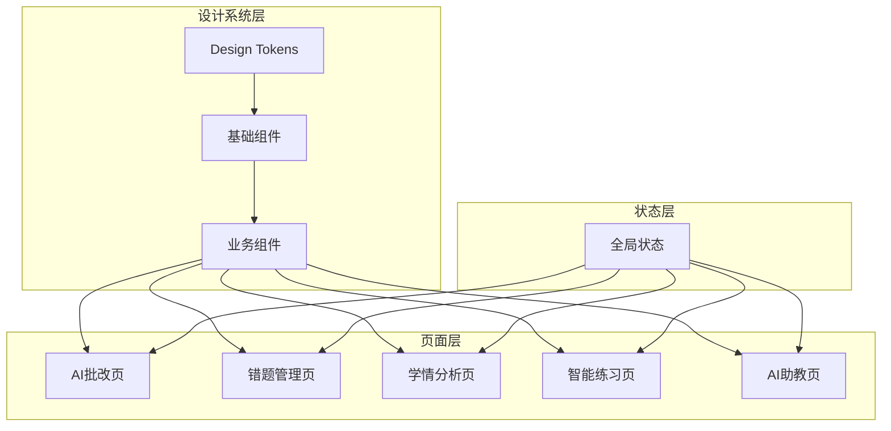

## 产品概述

智慧教研平台是一款面向教育行业的综合性智能教学辅助系统，旨在通过AI技术赋能教师教学和学生学习全流程。平台需要进行全面的前端设计重构，打造世界级的教育产品界面，提升用户体验和视觉品质。

## 核心功能

- **AI智能批改**: 自动批改作业和试卷，提供详细的批注和评分反馈
- **错题管理系统**: 智能收集、分类和归纳学生错题，支持错题本生成和复习推荐
- **学情分析仪表盘**: 多维度可视化展示学生学习数据，包含成绩趋势、知识点掌握度、班级对比等
- **智能练习引擎**: 基于学情自适应推送练习题目，个性化学习路径规划
- **AI助教对话**: 智能问答助手，支持学科知识解答和教学辅助

## 技术栈

- **前端框架**: React 18 + TypeScript
- **构建工具**: Vite
- **UI组件库**: Ant Design (保留核心组件，深度定制主题)
- **数据可视化**: ECharts
- **样式方案**: Tailwind CSS + CSS Variables (设计令牌系统)
- **动画库**: Framer Motion

## 技术架构

### 系统架构

采用分层组件架构，建立统一的设计系统层，确保全平台视觉一致性。



### 模块划分

- **设计令牌模块**: 颜色、字体、间距、阴影、动画等设计变量
- **基础组件模块**: Button、Card、Input、Modal等通用组件的重新设计
- **业务组件模块**: 批改卡片、错题列表、数据图表、练习题卡等
- **页面模块**: 五大核心功能页面的完整重构
- **布局模块**: 导航栏、侧边栏、页面容器等布局组件

### 数据流

用户交互 → 组件状态更新 → 设计令牌应用 → 视觉渲染 → 动画过渡

## 实现细节

### 核心目录结构

```
src/
├── design-system/
│   ├── tokens/
│   │   ├── colors.ts          # 颜色令牌
│   │   ├── typography.ts      # 字体令牌
│   │   ├── spacing.ts         # 间距令牌
│   │   └── animations.ts      # 动画令牌
│   ├── components/
│   │   ├── Button/            # 重构按钮组件
│   │   ├── Card/              # 玻璃态卡片组件
│   │   ├── Input/             # 输入框组件
│   │   └── ...
│   └── theme/
│       └── antd-overrides.ts  # Ant Design主题覆盖
├── components/
│   ├── layout/
│   │   ├── AppShell.tsx       # 应用外壳
│   │   ├── Sidebar.tsx        # 侧边导航
│   │   └── Header.tsx         # 顶部导航
│   └── business/
│       ├── GradingCard.tsx    # 批改卡片
│       ├── ErrorBookItem.tsx  # 错题项
│       ├── AnalyticsChart.tsx # 分析图表
│       └── PracticeCard.tsx   # 练习卡片
├── pages/
│   ├── Dashboard.tsx          # 首页仪表盘
│   ├── AIGrading.tsx          # AI批改页
│   ├── ErrorBook.tsx          # 错题管理页
│   ├── Analytics.tsx          # 学情分析页
│   ├── Practice.tsx           # 智能练习页
│   └── AIAssistant.tsx        # AI助教页
└── styles/
    └── globals.css            # 全局样式与Tailwind配置
```

### 关键代码结构

**设计令牌接口**: 定义统一的设计变量系统，确保全平台视觉一致性。

```typescript
// 颜色令牌定义
interface ColorTokens {
  primary: {
    main: string;      // #4F46E5
    light: string;     // #818CF8
    dark: string;      // #3730A3
  };
  accent: {
    orange: string;    // #F97316
    green: string;     // #10B981
  };
  background: {
    primary: string;   // #EEF2FF
    card: string;      // rgba(255,255,255,0.7)
    glass: string;     // rgba(255,255,255,0.25)
  };
}
```

**玻璃态卡片组件**: 实现Glassmorphism风格的核心卡片组件。

```typescript
interface GlassCardProps {
  children: React.ReactNode;
  blur?: 'sm' | 'md' | 'lg';
  hover?: boolean;
  className?: string;
}

const GlassCard: React.FC<GlassCardProps> = ({
  children,
  blur = 'md',
  hover = true,
  className
}) => { /* 实现 */ }
```

### 技术实现要点

1. **设计令牌系统**: 使用CSS Variables实现动态主题切换
2. **Glassmorphism效果**: backdrop-filter + 半透明背景 + 微妙边框
3. **微交互动画**: Framer Motion实现150-300ms的流畅过渡
4. **骨架屏加载**: 所有数据加载场景使用骨架屏提升感知性能
5. **无障碍支持**: 支持prefers-reduced-motion，清晰的焦点状态

## 设计理念

采用"智慧与温度"的设计理念，将现代科技感与教育的亲和力完美融合。通过Glassmorphism玻璃态设计传递科技智能感，结合Claymorphism柔和质感体现教育的温暖与关怀。

## 整体风格

- **主风格**: Glassmorphism + Soft UI Evolution
- **辅助风格**: Claymorphism微交互元素
- **氛围**: 专业、智能、友好、激励

## 页面规划

### 1. 首页仪表盘 (Dashboard)

- **顶部导航栏**: 玻璃态背景，左侧Logo和平台名称，右侧用户头像、通知铃铛、设置入口
- **侧边导航**: 垂直图标导航，悬停展开文字，当前页面高亮指示器带微动画
- **数据概览区**: 四张玻璃态统计卡片横向排列，展示今日批改数、待处理错题、学习进度、AI对话次数
- **快捷入口区**: 六宫格功能入口，每个入口使用渐变图标+功能名称，悬停时卡片微微上浮

### 2. AI批改页 (AIGrading)

- **顶部操作栏**: 上传作业按钮(渐变背景)、批改历史筛选器、搜索框
- **作业列表区**: 左侧卡片列表，每张卡片显示学生姓名、作业类型、提交时间、批改状态标签
- **批改详情区**: 右侧大面板，顶部显示作业图片/内容，下方AI批注覆盖层，底部评分和评语区
- **AI建议浮层**: 右下角浮动按钮，点击展开AI批改建议面板

### 3. 错题管理页 (ErrorBook)

- **筛选工具栏**: 学科标签切换、难度筛选、时间范围选择、知识点多选下拉
- **错题瀑布流**: 卡片式错题展示，每卡包含题目缩略、错误类型标签、错误次数、掌握进度条
- **错题详情抽屉**: 右侧滑出抽屉，显示完整题目、学生答案、正确答案、AI解析、相似题推荐
- **批量操作栏**: 底部固定栏，支持批量加入复习计划、生成错题本、导出PDF

### 4. 学情分析页 (Analytics)

- **时间维度切换**: 顶部Tab切换日/周/月/学期视图
- **核心指标卡片组**: 横向滚动卡片，展示平均分、进步指数、薄弱知识点、学习时长
- **趋势图表区**: 大面积折线图展示成绩趋势，支持多班级/多学生对比，悬停显示详细数据
- **知识点雷达图**: 六边形雷达图展示各知识点掌握度，点击知识点跳转详情
- **班级排行榜**: 右侧卡片展示班级/学生排名，进步最大标记特殊徽章

### 5. 智能练习页 (Practice)

- **推荐练习区**: 顶部横向滚动卡片，AI推荐的个性化练习集，每卡显示练习主题、题目数、预计时长
- **练习题展示区**: 中央大卡片，单题展示模式，题目内容+选项/答题区，底部进度条
- **答题反馈区**: 提交后即时反馈，正确绿色动效+鼓励语，错误红色+详细解析
- **练习统计侧栏**: 右侧固定面板，显示本次练习正确率、用时、连续正确数

### 6. AI助教页 (AIAssistant)

- **对话主区域**: 聊天气泡式布局，用户消息右对齐蓝色，AI回复左对齐白色玻璃态
- **快捷问题栏**: 对话区上方横向滚动标签，常见问题快捷入口
- **输入区域**: 底部固定，大输入框+语音输入按钮+发送按钮，支持拖拽上传图片
- **AI能力展示**: 首次进入显示AI能力介绍卡片，支持学科问答、作业辅导、学习规划等

## Agent Extensions

### Skill

- **ui-ux-pro-max**
- 用途: 提供完整的UI/UX设计资源，包括50种设计风格、21种配色方案、50种字体搭配，指导整个设计系统的构建
- 预期成果: 输出符合教育类应用特点的Glassmorphism + Claymorphism设计方案，完整的设计令牌和组件规范

- **frontend-design**
- 用途: 创建高质量、生产级的前端界面代码，避免通用AI美学
- 预期成果: 生成独特、精致的React组件代码和页面实现

### SubAgent

- **code-explorer**
- 用途: 探索现有项目结构，理解当前组件和页面实现
- 预期成果: 完整了解现有代码结构，为重构提供基础