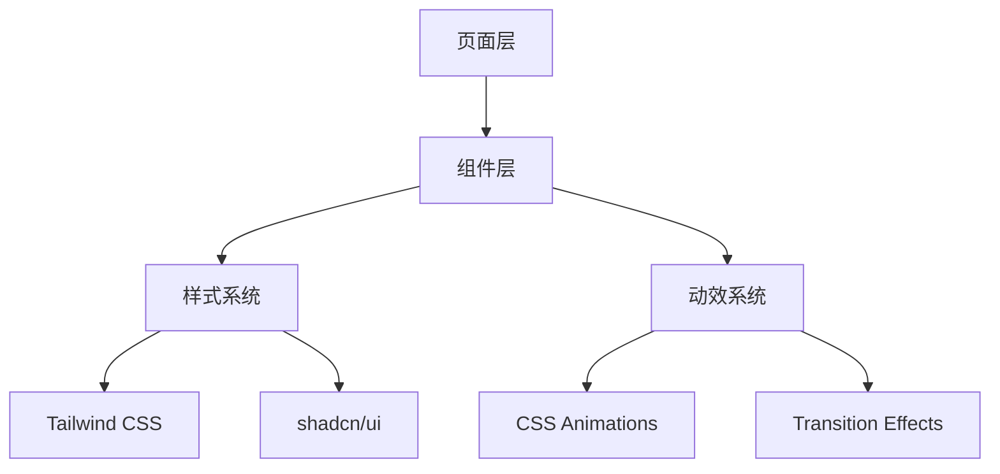

## 产品概述

对现有教育类前端项目进行全面视觉与交互优化，涵盖 AI 功能页面及原有核心页面，打造现代化、专业级的用户体验。

## 核心功能

- **视觉设计升级**：优化配色方案，增加现代感设计元素，添加流畅动效与微交互
- **交互体验优化**：简化操作流程，提升页面响应速度，完善用户反馈提示机制
- **全页面覆盖**：统一设计语言，确保 AI 功能页面与核心页面风格一致
- **组件现代化**：升级按钮、表单、卡片等基础组件的视觉表现

## 技术栈

- 前端框架：React + TypeScript
- 样式方案：Tailwind CSS
- 组件库：shadcn/ui
- 动效库：Framer Motion / CSS Animations
- 测试工具：Playwright

## 技术架构

### 系统架构



### 模块划分

- **样式系统模块**：统一配色、字体、间距等设计变量
- **动效系统模块**：页面过渡、微交互、加载动画
- **组件优化模块**：按钮、表单、卡片、导航等基础组件升级
- **反馈系统模块**：Toast 提示、Loading 状态、操作确认

### 数据流

用户操作 -> 交互反馈（动效/提示） -> 状态更新 -> UI 重渲染

## 实现细节

### 核心目录结构

```
project-root/
├── src/
│   ├── components/
│   │   └── ui/              # 优化后的 UI 组件
│   ├── styles/
│   │   └── globals.css      # 全局样式变量更新
│   └── lib/
│       └── animations.ts    # 动效配置
```

### 关键代码结构

**动效配置**：定义统一的过渡动画参数，确保全站动效一致性。

```typescript
// 动效配置
const transitions = {
  fast: 'all 0.15s ease',
  normal: 'all 0.3s ease',
  slow: 'all 0.5s ease-out'
};
```

**反馈组件接口**：标准化的用户反馈提示接口。

```typescript
interface FeedbackProps {
  type: 'success' | 'error' | 'warning' | 'info';
  message: string;
  duration?: number;
}
```

### 性能优化

- 使用 CSS 硬件加速优化动画性能
- 图片懒加载与组件按需加载
- 减少不必要的重渲染

## 设计风格

采用现代 Glassmorphism 与 Minimalism 结合的设计风格，打造专业教育平台的视觉体验。

## 页面规划

### 1. 首页/登录页

- **顶部区域**：品牌 Logo + 简洁导航，使用渐变背景增强视觉层次
- **主体区域**：大气的 Hero 区块，配合柔和动效引导用户注意力
- **表单区域**：圆角卡片设计，输入框带有焦点动效和实时验证反馈
- **底部区域**：辅助链接与版权信息，保持简洁

### 2. AI 功能页面

- **顶部导航**：固定导航栏，带有毛玻璃效果，滚动时平滑过渡
- **功能卡片区**：采用网格布局，卡片悬停时有微妙的上浮和阴影变化
- **交互区域**：AI 对话界面采用气泡式设计，打字动效增强真实感
- **状态反馈**：加载时使用骨架屏，操作完成有 Toast 提示

### 3. 核心业务页面

- **列表页面**：数据表格/卡片列表，支持平滑的筛选和排序动画
- **详情页面**：信息层次分明，关键操作按钮突出显示
- **表单页面**：分步表单带进度指示，字段验证即时反馈
- **结果页面**：成功/失败状态有对应的图标动效

### 4. 个人中心

- **头像区域**：圆形头像带渐变边框，悬停有缩放效果
- **菜单列表**：列表项带有右箭头指示，点击有涟漪效果
- **设置区域**：开关组件带有平滑过渡动画

## 交互优化要点

- 所有按钮添加悬停、点击状态变化
- 页面切换使用淡入淡出过渡
- 表单提交显示 Loading 状态
- 操作结果使用 Toast 即时反馈
- 长列表使用虚拟滚动优化性能

## Agent Extensions

### Skill

- **code-explorer**
- 用途：探索现有项目结构，识别所有需要优化的页面和组件
- 预期结果：获取完整的页面清单和组件依赖关系

- **frontend-design**
- 用途：为各页面创建高质量、现代化的视觉设计方案
- 预期结果：生成专业级的 UI 设计代码，避免通用 AI 风格

- **web-artifacts-builder**
- 用途：构建复杂的多组件页面，使用 React + Tailwind + shadcn/ui
- 预期结果：生成可复用的现代化组件和页面结构

- **webapp-testing**
- 用途：测试优化后的页面交互和视觉效果
- 预期结果：验证功能正常、截图对比优化效果