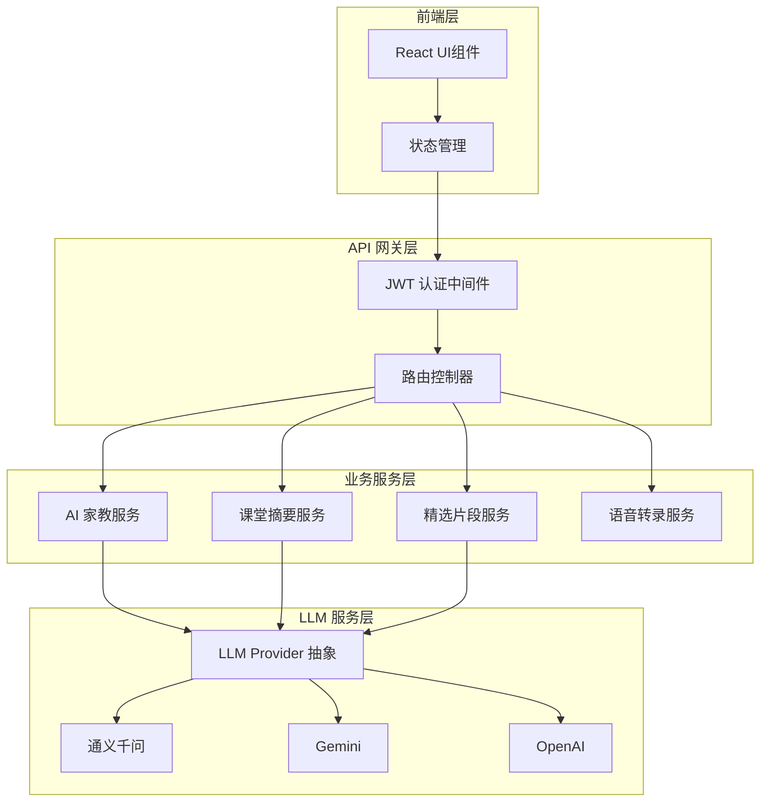
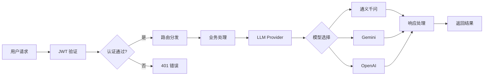

## 产品概述

将 origin_education_demo 项目全面升级，与 meetmind 项目的 API 接口和模型能力对齐。实现多模型 LLM 服务架构（通义千问、Gemini、OpenAI），引入 AI 家教、课堂摘要、精选片段等核心教育 AI 能力，并全面升级前端交互体验。

## 核心功能

- **多模型 LLM 服务**：支持通义千问（qwen3-vl-plus）、Gemini（gemini-3-pro）、OpenAI（gpt-5.2）等多模型切换
- **AI 家教系统**：困惑点智能解释、追问对话、引导问题生成
- **课堂内容处理**：语音转录、课堂摘要自动生成、精选片段提取
- **用户认证体系**：JWT 认证机制、用户角色权限管理
- **API 标准化**：统一 RESTful API 设计风格和数据模型规范

## 技术栈

- **前端框架**：React + TypeScript + Tailwind CSS
- **后端框架**：Node.js + Express.js（TypeScript）
- **LLM 服务**：通义千问 API、Google Gemini API、OpenAI API
- **认证方案**：JWT Token
- **数据存储**：复用现有存储方案

## 技术架构

### 系统架构

采用分层架构模式，将系统划分为表现层、业务逻辑层、LLM 服务层和数据层。核心是构建统一的 LLM 服务抽象层，支持多模型无缝切换。



### 模块划分

| 模块 | 职责 | 关键技术 | 依赖 |
| --- | --- | --- | --- |
| LLM Provider | 统一多模型调用接口 | TypeScript 抽象类 | 各厂商 SDK |
| AI 家教模块 | 困惑解释、追问对话 | Prompt Engineering | LLM Provider |
| 课堂摘要模块 | 内容摘要生成 | 文本处理 | LLM Provider |
| 精选片段模块 | 关键内容提取 | 内容分析 | LLM Provider |
| 认证模块 | JWT 生成与验证 | jsonwebtoken | - |
| API 路由模块 | RESTful 接口定义 | Express Router | 各业务模块 |


### 数据流



## 实现细节

### 核心目录结构

```
project-root/
├── src/
│   ├── api/
│   │   ├── routes/
│   │   │   ├── tutor.ts          # AI 家教路由
│   │   │   ├── summary.ts        # 课堂摘要路由
│   │   │   ├── clips.ts          # 精选片段路由
│   │   │   └── auth.ts           # 认证路由
│   │   └── middleware/
│   │       └── auth.ts           # JWT 认证中间件
│   ├── services/
│   │   ├── llm/
│   │   │   ├── provider.ts       # LLM Provider 抽象基类
│   │   │   ├── qwen.ts           # 通义千问实现
│   │   │   ├── gemini.ts         # Gemini 实现
│   │   │   ├── openai.ts         # OpenAI 实现
│   │   │   └── factory.ts        # Provider 工厂
│   │   ├── tutor.ts              # AI 家教服务
│   │   ├── summary.ts            # 摘要服务
│   │   └── clips.ts              # 片段服务
│   ├── types/
│   │   ├── llm.ts                # LLM 相关类型
│   │   ├── tutor.ts              # 家教相关类型
│   │   └── api.ts                # API 响应类型
│   └── components/
│       ├── TutorChat/            # AI 家教对话组件
│       ├── SummaryView/          # 摘要展示组件
│       └── ClipsList/            # 精选片段组件
```

### 关键代码结构

**LLM Provider 抽象接口**：定义统一的多模型调用接口，支持文本生成和流式响应。

```typescript
interface LLMConfig {
  model: string;
  temperature?: number;
  maxTokens?: number;
}

interface LLMMessage {
  role: 'system' | 'user' | 'assistant';
  content: string;
}

interface LLMResponse {
  content: string;
  model: string;
  usage: { promptTokens: number; completionTokens: number };
}

abstract class LLMProvider {
  abstract chat(messages: LLMMessage[], config?: LLMConfig): Promise<LLMResponse>;
  abstract streamChat(messages: LLMMessage[], config?: LLMConfig): AsyncIterable<string>;
}
```

**AI 家教服务接口**：处理困惑点解释、追问对话和引导问题生成。

```typescript
interface TutorRequest {
  confusionPoint: string;
  context?: string;
  conversationHistory?: LLMMessage[];
}

interface TutorResponse {
  explanation: string;
  guidingQuestions: string[];
  relatedTopics: string[];
}

class TutorService {
  constructor(private llmProvider: LLMProvider) {}
  async explainConfusion(request: TutorRequest): Promise<TutorResponse>;
  async followUpChat(message: string, history: LLMMessage[]): Promise<string>;
  async generateGuidingQuestions(topic: string): Promise<string[]>;
}
```

**API 响应标准格式**：统一的 RESTful API 响应结构。

```typescript
interface ApiResponse<T> {
  code: number;
  message: string;
  data: T;
  timestamp: number;
}

interface PaginatedResponse<T> extends ApiResponse<T[]> {
  pagination: {
    page: number;
    pageSize: number;
    total: number;
  };
}
```

### 技术实现方案

**1. 多模型 LLM 服务实现**

- 问题：需要支持多个 LLM 提供商的统一调用
- 方案：采用工厂模式 + 策略模式，通过 LLMProvider 抽象类定义统一接口
- 技术：TypeScript 抽象类、各厂商官方 SDK
- 步骤：定义抽象接口 → 实现各提供商适配器 → 创建工厂类 → 配置环境变量
- 测试：单元测试各 Provider、集成测试模型切换

**2. JWT 认证机制**

- 问题：需要安全的用户认证和权限控制
- 方案：基于 jsonwebtoken 实现 Token 生成与验证中间件
- 技术：jsonwebtoken、Express 中间件
- 步骤：实现 Token 生成 → 创建验证中间件 → 集成到路由 → 处理刷新逻辑
- 测试：验证 Token 有效性、过期处理、权限校验

### 集成点

- **LLM API 集成**：通过环境变量配置各厂商 API Key
- **前后端通信**：JSON 格式，统一响应结构
- **认证流程**：请求头携带 Bearer Token

## 设计风格

采用现代教育科技风格，以清晰的信息层级和流畅的交互体验为核心。界面设计融合专业感与亲和力，使用柔和的渐变色彩和圆润的卡片设计，营造智能、可信赖的学习助手形象。

## 页面规划

### 1. AI 家教对话页

- **顶部导航栏**：Logo、当前模型选择器、用户头像下拉菜单
- **对话主区域**：气泡式对话界面，支持 Markdown 渲染，代码高亮显示
- **困惑点输入区**：底部固定输入框，支持语音输入按钮，发送按钮带加载动画
- **引导问题面板**：右侧可折叠面板，展示 AI 生成的引导问题卡片

### 2. 课堂摘要页

- **顶部导航栏**：返回按钮、课程标题、分享操作
- **摘要卡片区**：大卡片展示核心摘要内容，支持折叠展开
- **时间线视图**：左侧时间轴，右侧对应内容片段
- **操作工具栏**：导出、编辑、重新生成按钮

### 3. 精选片段页

- **筛选栏**：课程筛选、时间筛选、标签筛选
- **片段网格**：卡片式布局展示精选片段，悬停显示预览
- **片段详情弹窗**：点击展开完整内容，支持播放、收藏、分享
- **底部导航**：首页、课程、片段、我的四个标签

### 4. 模型设置页

- **模型选择区**：三列卡片展示可用模型，当前选中高亮
- **参数配置区**：滑块调节 temperature、max tokens 等参数
- **测试对话区**：快速测试当前配置效果
- **保存提示**：底部固定保存按钮，修改后显示未保存提示

## Agent Extensions

### SubAgent

- **code-explorer**
- 用途：深入分析 origin_education_demo 现有代码结构和 meetmind 项目架构，理解现有 API 设计和数据模型
- 预期结果：获取完整的项目结构、现有接口定义、数据模型，为对齐工作提供准确的代码基础

### Skill

- **frontend-design**
- 用途：设计和实现 AI 家教对话界面、课堂摘要展示、精选片段列表等核心前端组件
- 预期结果：生成高质量、现代化的 React 组件代码，提升用户交互体验

- **webapp-testing**
- 用途：测试升级后的前端功能和 API 接口，验证多模型切换、对话交互等核心流程
- 预期结果：确保各功能模块正常运行，捕获并修复潜在问题