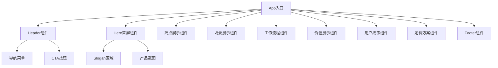

## 产品概述

MeetMind 是一款面向 K12 教育市场的"家校同频"智能助教系统官方网站。该产品为孩子配备"听过课"的AI同桌，旨在解决家长与学校之间的信息断层问题，让家长能够真正了解孩子的学习情况并提供有效辅导。

## 核心功能模块

- **Header导航**：固定顶部导航栏，包含Logo、核心功能入口和CTA按钮
- **Hero首屏**：主视觉区域，展示主副Slogan、核心价值主张和行动召唤按钮
- **三重断层痛点区**：可视化展示家长辅导中面临的信息断层、能力断层、时间断层
- **典型场景区**：展示产品在实际家庭教育场景中的应用案例
- **AI同桌工作流程**：清晰展示产品如何运作的四步流程图
- **三方价值区**：分别展示对学生、家长、教师三方的核心价值
- **信任证明/用户故事**：真实用户反馈和成功案例展示
- **定价方案区**：清晰的套餐对比和价格展示
- **Footer底部**：联系方式、快速链接、社交媒体入口

## 技术选型

- **前端框架**：React + TypeScript
- **样式方案**：Tailwind CSS
- **组件库**：shadcn/ui
- **构建工具**：Vite

## 技术架构

### 系统架构

采用单页面应用架构，组件化开发模式，实现模块化的Landing Page。



### 模块划分

- **布局模块**：Header、Footer、整体页面布局
- **营销模块**：Hero、痛点、场景、价值展示
- **功能展示模块**：AI同桌工作流程、产品特性
- **转化模块**：定价方案、用户故事、CTA组件
- **通用组件**：按钮、卡片、图标、动画效果

### 数据流

用户浏览页面 → 滚动触发动画 → 组件进入视口 → 执行入场动画 → 用户交互（点击CTA）→ 跳转或展开详情

## 实现细节

### 核心目录结构

```
webui/
├── src/
│   ├── components/
│   │   ├── ui/              # shadcn/ui 组件
│   │   ├── layout/          # Header, Footer
│   │   ├── sections/        # 各内容区块组件
│   │   │   ├── Hero.tsx
│   │   │   ├── PainPoints.tsx
│   │   │   ├── Scenarios.tsx
│   │   │   ├── Workflow.tsx
│   │   │   ├── Values.tsx
│   │   │   ├── Testimonials.tsx
│   │   │   └── Pricing.tsx
│   │   └── common/          # 通用组件
│   ├── lib/
│   │   └── utils.ts         # 工具函数
│   ├── App.tsx
│   ├── index.css
│   └── main.tsx
├── public/
│   └── images/              # 产品截图和素材图片
├── index.html
├── package.json
├── tailwind.config.js
├── tsconfig.json
└── vite.config.ts
```

### 关键代码结构

**Section组件接口**：定义统一的内容区块组件结构

```typescript
interface SectionProps {
  id: string;
  className?: string;
  children: React.ReactNode;
}

interface PainPointItem {
  icon: React.ReactNode;
  title: string;
  description: string;
  solution: string;
}

interface PricingPlan {
  name: string;
  price: string;
  period: string;
  features: string[];
  highlighted?: boolean;
  cta: string;
}
```

### 技术实现要点

1. **响应式设计**：使用Tailwind CSS的响应式断点，确保移动端和桌面端的良好体验
2. **滚动动画**：使用CSS动画配合Intersection Observer实现滚动入场效果
3. **组件复用**：抽取通用的卡片、按钮、标题组件
4. **图片优化**：使用适当的图片格式和懒加载策略

## 设计风格

采用温暖亲和的教育风格设计，传递信任感和专业度。整体视觉以柔和的渐变色为主，搭配圆润的卡片设计和友好的插画元素，营造温馨的家庭教育氛围。

## 页面设计

### Header导航

- 固定顶部，背景采用毛玻璃效果
- 左侧Logo + 产品名称，中部导航链接，右侧"免费试用"CTA按钮
- 滚动时添加阴影效果增强层次感

### Hero首屏

- 左侧文案区：主Slogan大标题 + 副标题描述 + 双CTA按钮组
- 右侧视觉区：产品界面截图，悬浮卡片动画效果
- 背景采用柔和渐变 + 抽象几何装饰元素

### 三重断层痛点区

- 三列卡片布局，每张卡片展示一种断层类型
- 使用图标 + 标题 + 描述的结构
- 卡片悬停时有轻微上浮和阴影变化效果

### 典型场景区

- 左右交替布局，图文结合
- 场景插图配合文字说明
- 使用标签/徽章突出关键词

### AI同桌工作流程

- 横向四步流程图，使用连接线串联
- 每步包含序号、图标、标题、简述
- 支持响应式折叠为纵向布局

### 三方价值区

- 三列等宽卡片，分别对应学生、家长、教师
- 顶部人物头像/图标，下方价值点列表
- 使用不同的主题色区分三方

### 用户故事/信任证明

- 轮播或网格布局展示用户评价
- 包含头像、姓名、身份、评价内容
- 五星评分和引号装饰元素

### 定价方案区

- 三列价格卡片对比
- 推荐套餐使用高亮边框和"推荐"标签
- 清晰的功能对比列表和CTA按钮

### Footer底部

- 深色背景，多列布局
- 包含产品链接、联系方式、社交媒体图标
- 底部版权信息

## Agent Extensions

### Skill

- **frontend-design**
- 用途：创建高质量、专业级的前端界面设计
- 预期成果：生成符合教育行业特点的温暖亲和风格UI，避免泛泛的AI美学

- **ui-ux-pro-max**
- 用途：提供专业的UI/UX设计指导，包括配色方案、字体搭配、布局优化
- 预期成果：输出符合现代设计趋势的Landing Page，包含合适的动画效果和交互细节

- **web-artifacts-builder**
- 用途：构建使用React + Tailwind CSS + shadcn/ui的复杂多组件页面
- 预期成果：生成结构清晰、组件化的完整Landing Page代码