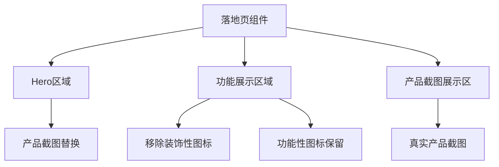

## 产品概述

MeetMind 落地页视觉升级项目，通过替换占位图为真实产品截图、移除装饰性图标，提升整体视觉品质和专业感。

## 核心功能

- 使用 MeetMind 产品真实截图替换当前落地页中的占位图
- 截取更多产品界面截图以丰富展示内容
- 移除所有装饰性 lucide-react 图标，仅保留功能性图标
- 用产品截图和自定义设计元素替代图标展示
- 优化视觉呈现，消除"AI slop"感，提升高级感

## 技术栈

- 框架：Next.js（现有项目）
- 样式：沿用项目现有样式方案
- 图标库：lucide-react（保留功能性图标，移除装饰性图标）

## 技术架构

### 系统架构

基于现有 Next.js 项目结构进行修改，主要涉及落地页组件和静态资源的调整。



### 模块划分

- **截图采集模块**：使用 webapp-testing 截取更多产品界面
- **图片资源模块**：管理和优化产品截图
- **组件修改模块**：落地页组件的图标清理和图片替换

### 数据流

截图采集 → 图片优化处理 → 替换落地页占位图 → 移除装饰性图标 → 视觉效果验证

## 实现细节

### 核心目录结构

基于现有项目，涉及修改的文件：

```
meetmind/
├── screenshots/              # 已有截图目录
│   ├── desktop_new_ui.png
│   └── mobile_new_ui.png
├── public/
│   └── images/              # 落地页图片资源（待更新）
└── src/
    └── components/          # 落地页组件（待修改）
```

### 技术实现计划

1. **截图采集**

- 使用 webapp-testing 启动 MeetMind 产品
- 截取关键功能界面截图
- 确保截图尺寸和质量符合落地页需求

2. **图标审计与清理**

- 识别所有 lucide-react 图标使用位置
- 区分功能性图标（导航、交互）和装饰性图标
- 移除装饰性图标，保留必要的功能性图标

3. **图片资源替换**

- 将产品截图优化后放置到 public 目录
- 更新组件中的图片引用路径
- 确保响应式图片加载

## Agent Extensions

### SubAgent

- **code-explorer**
- 用途：探索 MeetMind 落地页项目结构，定位所有使用 lucide-react 图标的组件文件
- 预期结果：获取完整的图标使用清单，区分功能性和装饰性图标

### Skill

- **webapp-testing**
- 用途：启动 MeetMind 产品并截取更多产品界面截图
- 预期结果：获取高质量的产品功能界面截图，用于替换落地页占位图

- **frontend-design**
- 用途：优化落地页视觉设计，确保产品截图展示效果专业
- 预期结果：提升整体视觉品质，消除"AI slop"感