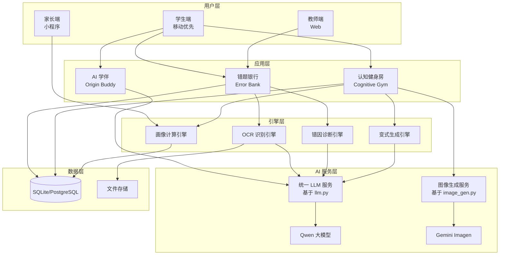

# 原点教育 - 技术方案设计

## 0. 设计原则与技术约束

### 0.1 核心设计原则

| 原则 | 说明 |
|---

## 2.4 🔥 错题修复可视化（核心爆点）

> **这是产品的核心差异化！用 AI 图像生成把学习过程变成可分享的视觉故事**

#### 2.4.1 可视化场景

| 场景 | 触发时机 | 图像内容 | 分享价值 |
|------|----------|----------|----------|
| **今日战报** | 完成每日训练 | 勇士打败错题怪兽 | 日常分享，展示进步 |
| **周报/月报** | 周末/月末 | 知识树成长 | 家长群分享，展示成果 |
| **成就解锁** | 消灭某类错因 | 胜利庆祝场景 | 里程碑分享，炫耀 |
| **连续打卡** | 7/30/100 天 | 进化历程 | 习惯养成，激励他人 |

#### 2.4.2 图像生成服务设计

```python
# backend/app/services/image_gen.py

import os
import base64
from typing import Optional
import httpx

class ImageGenerationService:
    """错题修复可视化 - 使用 Gemini Imagen"""
    
    def __init__(self):
        self.api_key = os.getenv("GEMINI_API_KEY")
        self.model = os.getenv("IMAGE_GEN_MODEL", "imagen-3.0-generate-001")
        self.base_url = os.getenv(
            "IMAGE_GEN_BASE_URL", 
            "https://generativelanguage.googleapis.com/v1beta"
        )
    
    async def generate_battle_report(
        self,
        defeated_count: int,
        error_types: list[str],
        score: int,
        streak: int,
        student_name: Optional[str] = None
    ) -> bytes:
        """生成今日战报图片"""
        
        # 将错因类型映射为视觉元素
        monster_mapping = {
            "概念混淆": "a foggy confusion monster",
            "计算粗心": "a mischievous number imp",
            "审题不清": "a blurry-eyed reading goblin",
            "知识盲区": "a shadow void creature",
            "逻辑跳跃": "a broken chain beast",
        }
        
        monsters = [monster_mapping.get(et, "a generic error monster") for et in error_types]
        monsters_desc = ", ".join(monsters[:3])  # 最多展示3种
        
        prompt = f"""
Create a vibrant, game-style battle victory scene:

SCENE:
- A young hero student character (anime style, gender-neutral) standing triumphantly
- {defeated_count} defeated monsters scattered around: {monsters_desc}
- The battlefield is made of floating mathematical formulas, equations, and Chinese characters
- Victory pose with a glowing sword made of light

STATS OVERLAY (stylized game UI):
- Score: {score} points (golden numbers with sparkles)
- Streak: {streak} days (flame icon)
- "今日战报" title at top in stylish Chinese font

STYLE:
- Bright, colorful, anime/game inspired
- Suitable for social media sharing (1:1 aspect ratio)
- Celebratory mood with subtle particle effects
- Leave bottom-right corner space for QR code overlay

MOOD: Triumphant, encouraging, shareable
"""
        
        return await self._generate_image(prompt)
    
    async def generate_growth_report(
        self,
        period: str,  # "week" or "month"
        errors_eliminated: int,
        mastered_concepts: list[str],
        progress_percent: int,
        achievements: list[str]
    ) -> bytes:
        """生成成长报告图片"""
        
        concepts_str = ", ".join(mastered_concepts[:5])
        achievements_str = ", ".join(achievements[:3])
        
        prompt = f"""
Create an inspiring growth visualization image:

MAIN ELEMENT:
- A beautiful knowledge tree in the center
- Tree is {progress_percent}% grown (from seedling to full tree based on progress)
- Branches have glowing leaves representing mastered concepts: {concepts_str}
- Achievement badges hanging like fruits: {achievements_str}

BACKGROUND:
- Soft gradient sky transitioning from dawn to day (representing growth)
- Subtle mathematical patterns in the clouds
- Floating sparkles and light particles

TEXT OVERLAY:
- "{'本周' if period == 'week' else '本月'}成长报告" as title
- "{errors_eliminated} 道错题已消灭" as subtitle
- Progress bar showing {progress_percent}%

STYLE:
- Warm, encouraging, like a children's book illustration
- Soft colors: greens, golds, sky blues
- Aspect ratio 9:16 (vertical, perfect for sharing)
- Leave space for QR code at bottom

MOOD: Proud, nurturing, worth sharing with parents
"""
        
        return await self._generate_image(prompt, aspect_ratio="9:16")
    
    async def generate_achievement_unlock(
        self,
        achievement_name: str,
        error_type: str,
        days_spent: int,
        total_errors: int
    ) -> bytes:
        """生成成就解锁图片"""
        
        prompt = f"""
Create an epic achievement unlock celebration image:

SCENE:
- A hero character wearing a golden crown, standing victoriously
- Standing on top of a defeated "{error_type}" monster (now turned to stone)
- Fireworks exploding in the background
- Confetti and golden particles everywhere

ACHIEVEMENT DISPLAY:
- Large achievement badge in the center-top: "{achievement_name}"
- Badge is glowing with golden light
- Ribbon banner below badge

STATS:
- "{days_spent} 天征程" (days of journey)
- "{total_errors} 道错题已征服" (errors conquered)

STYLE:
- Epic, triumphant, like winning a game boss battle
- Rich colors: gold, purple, deep blue
- Dramatic lighting from behind the hero
- 1:1 aspect ratio for easy sharing

MOOD: Victorious, celebratory, definitely worth sharing!
"""
        
        return await self._generate_image(prompt)
    
    async def generate_streak_milestone(
        self,
        streak_days: int,
        total_points: int
    ) -> bytes:
        """生成连续打卡里程碑图片"""
        
        # 根据天数选择不同的进化阶段
        if streak_days >= 100:
            evolution = "a legendary phoenix warrior with blazing wings"
            stage = "传奇"
        elif streak_days >= 30:
            evolution = "a powerful knight in shining armor"
            stage = "精英"
        elif streak_days >= 7:
            evolution = "a skilled apprentice with a glowing staff"
            stage = "进阶"
        else:
            evolution = "a determined beginner with a wooden sword"
            stage = "新手"
        
        prompt = f"""
Create a character evolution/progression image:

MAIN CHARACTER:
- {evolution}
- Standing proudly, showing growth and determination
- Aura of power surrounding them

EVOLUTION TIMELINE (at bottom):
- Show 4 silhouettes from left to right: beginner → apprentice → knight → phoenix
- Current stage ({stage}) is highlighted and in full color
- Others are grayed out silhouettes

STATS DISPLAY:
- "🔥 连续 {streak_days} 天" prominently displayed
- "{total_points} 总积分" below
- Fire/flame effects around the streak number

BACKGROUND:
- Gradient showing journey from dawn to bright day
- Path leading from past (left) to future (right)

STYLE:
- Inspiring, showing growth journey
- Game character evolution style
- 1:1 aspect ratio

MOOD: Inspiring, showing how far they've come
"""
        
        return await self._generate_image(prompt)
    
    async def _generate_image(
        self, 
        prompt: str, 
        aspect_ratio: str = "1:1"
    ) -> bytes:
        """调用 Gemini Imagen API 生成图片"""
        
        url = f"{self.base_url}/models/{self.model}:generateContent"
        
        request_body = {
            "contents": [{"parts": [{"text": prompt}]}],
            "generationConfig": {
                "responseModalities": ["IMAGE"],
                "aspectRatio": aspect_ratio,
            },
        }
        
        headers = {
            "Content-Type": "application/json",
            "x-goog-api-key": self.api_key,
        }
        
        async with httpx.AsyncClient(timeout=60.0) as client:
            response = await client.post(url, json=request_body, headers=headers)
            response.raise_for_status()
            
            data = response.json()
            
            # 解析响应，提取 base64 图片数据
            candidates = data.get("candidates", [])
            if candidates:
                parts = candidates[0].get("content", {}).get("parts", [])
                for part in parts:
                    if "inlineData" in part:
                        return base64.b64decode(part["inlineData"]["data"])
            
            raise ValueError("No image data in response")
    
    def add_qr_overlay(
        self, 
        image_bytes: bytes, 
        invite_code: str
    ) -> bytes:
        """在图片上添加二维码和邀请码（使用 Pillow）"""
        from PIL import Image
        import qrcode
        from io import BytesIO
        
        # 加载原图
        img = Image.open(BytesIO(image_bytes))
        
        # 生成二维码
        qr = qrcode.QRCode(version=1, box_size=10, border=2)
        qr.add_data(f"https://origin.edu/invite/{invite_code}")
        qr.make(fit=True)
        qr_img = qr.make_image(fill_color="black", back_color="white")
        
        # 调整二维码大小
        qr_size = int(img.width * 0.15)  # 二维码占图片宽度的 15%
        qr_img = qr_img.resize((qr_size, qr_size))
        
        # 粘贴到右下角
        position = (img.width - qr_size - 20, img.height - qr_size - 20)
        img.paste(qr_img, position)
        
        # 保存
        output = BytesIO()
        img.save(output, format="PNG")
        return output.getvalue()


# 单例
image_gen_service = ImageGenerationService()
```

#### 2.4.3 战报生成流程

```
┌─────────────┐     ┌─────────────┐     ┌─────────────┐     ┌─────────────┐
│  训练完成   │ --> │  收集数据   │ --> │  生成图片   │ --> │  添加二维码  │
│             │     │             │     │             │     │             │
│ 触发事件    │     │ 消灭数/积分 │     │ Gemini API  │     │ Pillow 合成 │
│             │     │ 错因类型    │     │             │     │             │
└─────────────┘     └─────────────┘     └─────────────┘     └─────────────┘
                                                                   │
                                                                   ▼
                                                           ┌─────────────┐
                                                           │  展示给用户  │
                                                           │             │
                                                           │ 保存/分享   │
                                                           └─────────────┘
```

#### 2.4.4 分享追踪数据模型

```python
class ShareRecord(SQLModel, table=True):
    """分享记录"""
    id: int = Field(primary_key=True)
    student_id: int = Field(foreign_key="student.id")
    
    share_type: str  # "battle_report" | "growth_report" | "achievement"
    share_channel: str | None  # "wechat" | "moments" | "qq" | "other"
    invite_code: str  # 邀请码
    image_url: str | None  # 存储的图片 URL
    
    # 追踪数据
    view_count: int = 0  # 被查看次数
    invite_count: int = 0  # 带来的新用户数
    
    created_at: datetime = Field(default_factory=datetime.utcnow)


class InviteRecord(SQLModel, table=True):
    """邀请记录"""
    id: int = Field(primary_key=True)
    inviter_id: int = Field(foreign_key="student.id")
    invitee_id: int = Field(foreign_key="student.id")
    
    invite_code: str
    share_record_id: int | None = Field(foreign_key="sharerecord.id")
    
    # 奖励状态
    inviter_rewarded: bool = False
    invitee_rewarded: bool = False
    reward_points: int = 50  # 双方各得积分
    
    created_at: datetime = Field(default_factory=datetime.utcnow)
```

------

## 2.4 🔥 错题修复可视化（核心爆点）

> **这是产品的核心差异化！用 AI 图像生成把学习过程变成可分享的视觉故事**

#### 2.4.1 可视化场景

| 场景 | 触发时机 | 图像内容 | 分享价值 |
|------|----------|----------|----------|
| **今日战报** | 完成每日训练 | 勇士打败错题怪兽 | 日常分享，展示进步 |
| **周报/月报** | 周末/月末 | 知识树成长 | 家长群分享，展示成果 |
| **成就解锁** | 消灭某类错因 | 胜利庆祝场景 | 里程碑分享，炫耀 |
| **连续打卡** | 7/30/100 天 | 进化历程 | 习惯养成，激励他人 |

#### 2.4.2 图像生成服务设计

```python
# backend/app/services/image_gen.py

import os
import base64
from typing import Optional
import httpx

class ImageGenerationService:
    """错题修复可视化 - 使用 Gemini Imagen"""
    
    def __init__(self):
        self.api_key = os.getenv("GEMINI_API_KEY")
        self.model = os.getenv("IMAGE_GEN_MODEL", "imagen-3.0-generate-001")
        self.base_url = os.getenv(
            "IMAGE_GEN_BASE_URL", 
            "https://generativelanguage.googleapis.com/v1beta"
        )
    
    async def generate_battle_report(
        self,
        defeated_count: int,
        error_types: list[str],
        score: int,
        streak: int,
        student_name: Optional[str] = None
    ) -> bytes:
        """生成今日战报图片"""
        
        # 将错因类型映射为视觉元素
        monster_mapping = {
            "概念混淆": "a foggy confusion monster",
            "计算粗心": "a mischievous number imp",
            "审题不清": "a blurry-eyed reading goblin",
            "知识盲区": "a shadow void creature",
            "逻辑跳跃": "a broken chain beast",
        }
        
        monsters = [monster_mapping.get(et, "a generic error monster") for et in error_types]
        monsters_desc = ", ".join(monsters[:3])  # 最多展示3种
        
        prompt = f"""
Create a vibrant, game-style battle victory scene:

SCENE:
- A young hero student character (anime style, gender-neutral) standing triumphantly
- {defeated_count} defeated monsters scattered around: {monsters_desc}
- The battlefield is made of floating mathematical formulas, equations, and Chinese characters
- Victory pose with a glowing sword made of light

STATS OVERLAY (stylized game UI):
- Score: {score} points (golden numbers with sparkles)
- Streak: {streak} days (flame icon)
- "今日战报" title at top in stylish Chinese font

STYLE:
- Bright, colorful, anime/game inspired
- Suitable for social media sharing (1:1 aspect ratio)
- Celebratory mood with subtle particle effects
- Leave bottom-right corner space for QR code overlay

MOOD: Triumphant, encouraging, shareable
"""
        
        return await self._generate_image(prompt)
    
    async def generate_growth_report(
        self,
        period: str,  # "week" or "month"
        errors_eliminated: int,
        mastered_concepts: list[str],
        progress_percent: int,
        achievements: list[str]
    ) -> bytes:
        """生成成长报告图片"""
        
        concepts_str = ", ".join(mastered_concepts[:5])
        achievements_str = ", ".join(achievements[:3])
        
        prompt = f"""
Create an inspiring growth visualization image:

MAIN ELEMENT:
- A beautiful knowledge tree in the center
- Tree is {progress_percent}% grown (from seedling to full tree based on progress)
- Branches have glowing leaves representing mastered concepts: {concepts_str}
- Achievement badges hanging like fruits: {achievements_str}

BACKGROUND:
- Soft gradient sky transitioning from dawn to day (representing growth)
- Subtle mathematical patterns in the clouds
- Floating sparkles and light particles

TEXT OVERLAY:
- "{'本周' if period == 'week' else '本月'}成长报告" as title
- "{errors_eliminated} 道错题已消灭" as subtitle
- Progress bar showing {progress_percent}%

STYLE:
- Warm, encouraging, like a children's book illustration
- Soft colors: greens, golds, sky blues
- Aspect ratio 9:16 (vertical, perfect for sharing)
- Leave space for QR code at bottom

MOOD: Proud, nurturing, worth sharing with parents
"""
        
        return await self._generate_image(prompt, aspect_ratio="9:16")
    
    async def generate_achievement_unlock(
        self,
        achievement_name: str,
        error_type: str,
        days_spent: int,
        total_errors: int
    ) -> bytes:
        """生成成就解锁图片"""
        
        prompt = f"""
Create an epic achievement unlock celebration image:

SCENE:
- A hero character wearing a golden crown, standing victoriously
- Standing on top of a defeated "{error_type}" monster (now turned to stone)
- Fireworks exploding in the background
- Confetti and golden particles everywhere

ACHIEVEMENT DISPLAY:
- Large achievement badge in the center-top: "{achievement_name}"
- Badge is glowing with golden light
- Ribbon banner below badge

STATS:
- "{days_spent} 天征程" (days of journey)
- "{total_errors} 道错题已征服" (errors conquered)

STYLE:
- Epic, triumphant, like winning a game boss battle
- Rich colors: gold, purple, deep blue
- Dramatic lighting from behind the hero
- 1:1 aspect ratio for easy sharing

MOOD: Victorious, celebratory, definitely worth sharing!
"""
        
        return await self._generate_image(prompt)
    
    async def generate_streak_milestone(
        self,
        streak_days: int,
        total_points: int
    ) -> bytes:
        """生成连续打卡里程碑图片"""
        
        # 根据天数选择不同的进化阶段
        if streak_days >= 100:
            evolution = "a legendary phoenix warrior with blazing wings"
            stage = "传奇"
        elif streak_days >= 30:
            evolution = "a powerful knight in shining armor"
            stage = "精英"
        elif streak_days >= 7:
            evolution = "a skilled apprentice with a glowing staff"
            stage = "进阶"
        else:
            evolution = "a determined beginner with a wooden sword"
            stage = "新手"
        
        prompt = f"""
Create a character evolution/progression image:

MAIN CHARACTER:
- {evolution}
- Standing proudly, showing growth and determination
- Aura of power surrounding them

EVOLUTION TIMELINE (at bottom):
- Show 4 silhouettes from left to right: beginner → apprentice → knight → phoenix
- Current stage ({stage}) is highlighted and in full color
- Others are grayed out silhouettes

STATS DISPLAY:
- "🔥 连续 {streak_days} 天" prominently displayed
- "{total_points} 总积分" below
- Fire/flame effects around the streak number

BACKGROUND:
- Gradient showing journey from dawn to bright day
- Path leading from past (left) to future (right)

STYLE:
- Inspiring, showing growth journey
- Game character evolution style
- 1:1 aspect ratio

MOOD: Inspiring, showing how far they've come
"""
        
        return await self._generate_image(prompt)
    
    async def _generate_image(
        self, 
        prompt: str, 
        aspect_ratio: str = "1:1"
    ) -> bytes:
        """调用 Gemini Imagen API 生成图片"""
        
        url = f"{self.base_url}/models/{self.model}:generateContent"
        
        request_body = {
            "contents": [{"parts": [{"text": prompt}]}],
            "generationConfig": {
                "responseModalities": ["IMAGE"],
                "aspectRatio": aspect_ratio,
            },
        }
        
        headers = {
            "Content-Type": "application/json",
            "x-goog-api-key": self.api_key,
        }
        
        async with httpx.AsyncClient(timeout=60.0) as client:
            response = await client.post(url, json=request_body, headers=headers)
            response.raise_for_status()
            
            data = response.json()
            
            # 解析响应，提取 base64 图片数据
            candidates = data.get("candidates", [])
            if candidates:
                parts = candidates[0].get("content", {}).get("parts", [])
                for part in parts:
                    if "inlineData" in part:
                        return base64.b64decode(part["inlineData"]["data"])
            
            raise ValueError("No image data in response")
    
    def add_qr_overlay(
        self, 
        image_bytes: bytes, 
        invite_code: str
    ) -> bytes:
        """在图片上添加二维码和邀请码（使用 Pillow）"""
        from PIL import Image
        import qrcode
        from io import BytesIO
        
        # 加载原图
        img = Image.open(BytesIO(image_bytes))
        
        # 生成二维码
        qr = qrcode.QRCode(version=1, box_size=10, border=2)
        qr.add_data(f"https://origin.edu/invite/{invite_code}")
        qr.make(fit=True)
        qr_img = qr.make_image(fill_color="black", back_color="white")
        
        # 调整二维码大小
        qr_size = int(img.width * 0.15)  # 二维码占图片宽度的 15%
        qr_img = qr_img.resize((qr_size, qr_size))
        
        # 粘贴到右下角
        position = (img.width - qr_size - 20, img.height - qr_size - 20)
        img.paste(qr_img, position)
        
        # 保存
        output = BytesIO()
        img.save(output, format="PNG")
        return output.getvalue()


# 单例
image_gen_service = ImageGenerationService()
```

#### 2.4.3 战报生成流程

```
┌─────────────┐     ┌─────────────┐     ┌─────────────┐     ┌─────────────┐
│  训练完成   │ --> │  收集数据   │ --> │  生成图片   │ --> │  添加二维码  │
│             │     │             │     │             │     │             │
│ 触发事件    │     │ 消灭数/积分 │     │ Gemini API  │     │ Pillow 合成 │
│             │     │ 错因类型    │     │             │     │             │
└─────────────┘     └─────────────┘     └─────────────┘     └─────────────┘
                                                                   │
                                                                   ▼
                                                           ┌─────────────┐
                                                           │  展示给用户  │
                                                           │             │
                                                           │ 保存/分享   │
                                                           └─────────────┘
```

#### 2.4.4 分享追踪数据模型

```python
class ShareRecord(SQLModel, table=True):
    """分享记录"""
    id: int = Field(primary_key=True)
    student_id: int = Field(foreign_key="student.id")
    
    share_type: str  # "battle_report" | "growth_report" | "achievement"
    share_channel: str | None  # "wechat" | "moments" | "qq" | "other"
    invite_code: str  # 邀请码
    image_url: str | None  # 存储的图片 URL
    
    # 追踪数据
    view_count: int = 0  # 被查看次数
    invite_count: int = 0  # 带来的新用户数
    
    created_at: datetime = Field(default_factory=datetime.utcnow)


class InviteRecord(SQLModel, table=True):
    """邀请记录"""
    id: int = Field(primary_key=True)
    inviter_id: int = Field(foreign_key="student.id")
    invitee_id: int = Field(foreign_key="student.id")
    
    invite_code: str
    share_record_id: int | None = Field(foreign_key="sharerecord.id")
    
    # 奖励状态
    inviter_rewarded: bool = False
    invitee_rewarded: bool = False
    reward_points: int = 50  # 双方各得积分
    
    created_at: datetime = Field(default_factory=datetime.utcnow)
```

---|---

## 2.4 🔥 错题修复可视化（核心爆点）

> **这是产品的核心差异化！用 AI 图像生成把学习过程变成可分享的视觉故事**

#### 2.4.1 可视化场景

| 场景 | 触发时机 | 图像内容 | 分享价值 |
|------|----------|----------|----------|
| **今日战报** | 完成每日训练 | 勇士打败错题怪兽 | 日常分享，展示进步 |
| **周报/月报** | 周末/月末 | 知识树成长 | 家长群分享，展示成果 |
| **成就解锁** | 消灭某类错因 | 胜利庆祝场景 | 里程碑分享，炫耀 |
| **连续打卡** | 7/30/100 天 | 进化历程 | 习惯养成，激励他人 |

#### 2.4.2 图像生成服务设计

```python
# backend/app/services/image_gen.py

import os
import base64
from typing import Optional
import httpx

class ImageGenerationService:
    """错题修复可视化 - 使用 Gemini Imagen"""
    
    def __init__(self):
        self.api_key = os.getenv("GEMINI_API_KEY")
        self.model = os.getenv("IMAGE_GEN_MODEL", "imagen-3.0-generate-001")
        self.base_url = os.getenv(
            "IMAGE_GEN_BASE_URL", 
            "https://generativelanguage.googleapis.com/v1beta"
        )
    
    async def generate_battle_report(
        self,
        defeated_count: int,
        error_types: list[str],
        score: int,
        streak: int,
        student_name: Optional[str] = None
    ) -> bytes:
        """生成今日战报图片"""
        
        # 将错因类型映射为视觉元素
        monster_mapping = {
            "概念混淆": "a foggy confusion monster",
            "计算粗心": "a mischievous number imp",
            "审题不清": "a blurry-eyed reading goblin",
            "知识盲区": "a shadow void creature",
            "逻辑跳跃": "a broken chain beast",
        }
        
        monsters = [monster_mapping.get(et, "a generic error monster") for et in error_types]
        monsters_desc = ", ".join(monsters[:3])  # 最多展示3种
        
        prompt = f"""
Create a vibrant, game-style battle victory scene:

SCENE:
- A young hero student character (anime style, gender-neutral) standing triumphantly
- {defeated_count} defeated monsters scattered around: {monsters_desc}
- The battlefield is made of floating mathematical formulas, equations, and Chinese characters
- Victory pose with a glowing sword made of light

STATS OVERLAY (stylized game UI):
- Score: {score} points (golden numbers with sparkles)
- Streak: {streak} days (flame icon)
- "今日战报" title at top in stylish Chinese font

STYLE:
- Bright, colorful, anime/game inspired
- Suitable for social media sharing (1:1 aspect ratio)
- Celebratory mood with subtle particle effects
- Leave bottom-right corner space for QR code overlay

MOOD: Triumphant, encouraging, shareable
"""
        
        return await self._generate_image(prompt)
    
    async def generate_growth_report(
        self,
        period: str,  # "week" or "month"
        errors_eliminated: int,
        mastered_concepts: list[str],
        progress_percent: int,
        achievements: list[str]
    ) -> bytes:
        """生成成长报告图片"""
        
        concepts_str = ", ".join(mastered_concepts[:5])
        achievements_str = ", ".join(achievements[:3])
        
        prompt = f"""
Create an inspiring growth visualization image:

MAIN ELEMENT:
- A beautiful knowledge tree in the center
- Tree is {progress_percent}% grown (from seedling to full tree based on progress)
- Branches have glowing leaves representing mastered concepts: {concepts_str}
- Achievement badges hanging like fruits: {achievements_str}

BACKGROUND:
- Soft gradient sky transitioning from dawn to day (representing growth)
- Subtle mathematical patterns in the clouds
- Floating sparkles and light particles

TEXT OVERLAY:
- "{'本周' if period == 'week' else '本月'}成长报告" as title
- "{errors_eliminated} 道错题已消灭" as subtitle
- Progress bar showing {progress_percent}%

STYLE:
- Warm, encouraging, like a children's book illustration
- Soft colors: greens, golds, sky blues
- Aspect ratio 9:16 (vertical, perfect for sharing)
- Leave space for QR code at bottom

MOOD: Proud, nurturing, worth sharing with parents
"""
        
        return await self._generate_image(prompt, aspect_ratio="9:16")
    
    async def generate_achievement_unlock(
        self,
        achievement_name: str,
        error_type: str,
        days_spent: int,
        total_errors: int
    ) -> bytes:
        """生成成就解锁图片"""
        
        prompt = f"""
Create an epic achievement unlock celebration image:

SCENE:
- A hero character wearing a golden crown, standing victoriously
- Standing on top of a defeated "{error_type}" monster (now turned to stone)
- Fireworks exploding in the background
- Confetti and golden particles everywhere

ACHIEVEMENT DISPLAY:
- Large achievement badge in the center-top: "{achievement_name}"
- Badge is glowing with golden light
- Ribbon banner below badge

STATS:
- "{days_spent} 天征程" (days of journey)
- "{total_errors} 道错题已征服" (errors conquered)

STYLE:
- Epic, triumphant, like winning a game boss battle
- Rich colors: gold, purple, deep blue
- Dramatic lighting from behind the hero
- 1:1 aspect ratio for easy sharing

MOOD: Victorious, celebratory, definitely worth sharing!
"""
        
        return await self._generate_image(prompt)
    
    async def generate_streak_milestone(
        self,
        streak_days: int,
        total_points: int
    ) -> bytes:
        """生成连续打卡里程碑图片"""
        
        # 根据天数选择不同的进化阶段
        if streak_days >= 100:
            evolution = "a legendary phoenix warrior with blazing wings"
            stage = "传奇"
        elif streak_days >= 30:
            evolution = "a powerful knight in shining armor"
            stage = "精英"
        elif streak_days >= 7:
            evolution = "a skilled apprentice with a glowing staff"
            stage = "进阶"
        else:
            evolution = "a determined beginner with a wooden sword"
            stage = "新手"
        
        prompt = f"""
Create a character evolution/progression image:

MAIN CHARACTER:
- {evolution}
- Standing proudly, showing growth and determination
- Aura of power surrounding them

EVOLUTION TIMELINE (at bottom):
- Show 4 silhouettes from left to right: beginner → apprentice → knight → phoenix
- Current stage ({stage}) is highlighted and in full color
- Others are grayed out silhouettes

STATS DISPLAY:
- "🔥 连续 {streak_days} 天" prominently displayed
- "{total_points} 总积分" below
- Fire/flame effects around the streak number

BACKGROUND:
- Gradient showing journey from dawn to bright day
- Path leading from past (left) to future (right)

STYLE:
- Inspiring, showing growth journey
- Game character evolution style
- 1:1 aspect ratio

MOOD: Inspiring, showing how far they've come
"""
        
        return await self._generate_image(prompt)
    
    async def _generate_image(
        self, 
        prompt: str, 
        aspect_ratio: str = "1:1"
    ) -> bytes:
        """调用 Gemini Imagen API 生成图片"""
        
        url = f"{self.base_url}/models/{self.model}:generateContent"
        
        request_body = {
            "contents": [{"parts": [{"text": prompt}]}],
            "generationConfig": {
                "responseModalities": ["IMAGE"],
                "aspectRatio": aspect_ratio,
            },
        }
        
        headers = {
            "Content-Type": "application/json",
            "x-goog-api-key": self.api_key,
        }
        
        async with httpx.AsyncClient(timeout=60.0) as client:
            response = await client.post(url, json=request_body, headers=headers)
            response.raise_for_status()
            
            data = response.json()
            
            # 解析响应，提取 base64 图片数据
            candidates = data.get("candidates", [])
            if candidates:
                parts = candidates[0].get("content", {}).get("parts", [])
                for part in parts:
                    if "inlineData" in part:
                        return base64.b64decode(part["inlineData"]["data"])
            
            raise ValueError("No image data in response")
    
    def add_qr_overlay(
        self, 
        image_bytes: bytes, 
        invite_code: str
    ) -> bytes:
        """在图片上添加二维码和邀请码（使用 Pillow）"""
        from PIL import Image
        import qrcode
        from io import BytesIO
        
        # 加载原图
        img = Image.open(BytesIO(image_bytes))
        
        # 生成二维码
        qr = qrcode.QRCode(version=1, box_size=10, border=2)
        qr.add_data(f"https://origin.edu/invite/{invite_code}")
        qr.make(fit=True)
        qr_img = qr.make_image(fill_color="black", back_color="white")
        
        # 调整二维码大小
        qr_size = int(img.width * 0.15)  # 二维码占图片宽度的 15%
        qr_img = qr_img.resize((qr_size, qr_size))
        
        # 粘贴到右下角
        position = (img.width - qr_size - 20, img.height - qr_size - 20)
        img.paste(qr_img, position)
        
        # 保存
        output = BytesIO()
        img.save(output, format="PNG")
        return output.getvalue()


# 单例
image_gen_service = ImageGenerationService()
```

#### 2.4.3 战报生成流程

```
┌─────────────┐     ┌─────────────┐     ┌─────────────┐     ┌─────────────┐
│  训练完成   │ --> │  收集数据   │ --> │  生成图片   │ --> │  添加二维码  │
│             │     │             │     │             │     │             │
│ 触发事件    │     │ 消灭数/积分 │     │ Gemini API  │     │ Pillow 合成 │
│             │     │ 错因类型    │     │             │     │             │
└─────────────┘     └─────────────┘     └─────────────┘     └─────────────┘
                                                                   │
                                                                   ▼
                                                           ┌─────────────┐
                                                           │  展示给用户  │
                                                           │             │
                                                           │ 保存/分享   │
                                                           └─────────────┘
```

#### 2.4.4 分享追踪数据模型

```python
class ShareRecord(SQLModel, table=True):
    """分享记录"""
    id: int = Field(primary_key=True)
    student_id: int = Field(foreign_key="student.id")
    
    share_type: str  # "battle_report" | "growth_report" | "achievement"
    share_channel: str | None  # "wechat" | "moments" | "qq" | "other"
    invite_code: str  # 邀请码
    image_url: str | None  # 存储的图片 URL
    
    # 追踪数据
    view_count: int = 0  # 被查看次数
    invite_count: int = 0  # 带来的新用户数
    
    created_at: datetime = Field(default_factory=datetime.utcnow)


class InviteRecord(SQLModel, table=True):
    """邀请记录"""
    id: int = Field(primary_key=True)
    inviter_id: int = Field(foreign_key="student.id")
    invitee_id: int = Field(foreign_key="student.id")
    
    invite_code: str
    share_record_id: int | None = Field(foreign_key="sharerecord.id")
    
    # 奖励状态
    inviter_rewarded: bool = False
    invitee_rewarded: bool = False
    reward_points: int = 50  # 双方各得积分
    
    created_at: datetime = Field(default_factory=datetime.utcnow)
```

------

## 2.4 🔥 错题修复可视化（核心爆点）

> **这是产品的核心差异化！用 AI 图像生成把学习过程变成可分享的视觉故事**

#### 2.4.1 可视化场景

| 场景 | 触发时机 | 图像内容 | 分享价值 |
|------|----------|----------|----------|
| **今日战报** | 完成每日训练 | 勇士打败错题怪兽 | 日常分享，展示进步 |
| **周报/月报** | 周末/月末 | 知识树成长 | 家长群分享，展示成果 |
| **成就解锁** | 消灭某类错因 | 胜利庆祝场景 | 里程碑分享，炫耀 |
| **连续打卡** | 7/30/100 天 | 进化历程 | 习惯养成，激励他人 |

#### 2.4.2 图像生成服务设计

```python
# backend/app/services/image_gen.py

import os
import base64
from typing import Optional
import httpx

class ImageGenerationService:
    """错题修复可视化 - 使用 Gemini Imagen"""
    
    def __init__(self):
        self.api_key = os.getenv("GEMINI_API_KEY")
        self.model = os.getenv("IMAGE_GEN_MODEL", "imagen-3.0-generate-001")
        self.base_url = os.getenv(
            "IMAGE_GEN_BASE_URL", 
            "https://generativelanguage.googleapis.com/v1beta"
        )
    
    async def generate_battle_report(
        self,
        defeated_count: int,
        error_types: list[str],
        score: int,
        streak: int,
        student_name: Optional[str] = None
    ) -> bytes:
        """生成今日战报图片"""
        
        # 将错因类型映射为视觉元素
        monster_mapping = {
            "概念混淆": "a foggy confusion monster",
            "计算粗心": "a mischievous number imp",
            "审题不清": "a blurry-eyed reading goblin",
            "知识盲区": "a shadow void creature",
            "逻辑跳跃": "a broken chain beast",
        }
        
        monsters = [monster_mapping.get(et, "a generic error monster") for et in error_types]
        monsters_desc = ", ".join(monsters[:3])  # 最多展示3种
        
        prompt = f"""
Create a vibrant, game-style battle victory scene:

SCENE:
- A young hero student character (anime style, gender-neutral) standing triumphantly
- {defeated_count} defeated monsters scattered around: {monsters_desc}
- The battlefield is made of floating mathematical formulas, equations, and Chinese characters
- Victory pose with a glowing sword made of light

STATS OVERLAY (stylized game UI):
- Score: {score} points (golden numbers with sparkles)
- Streak: {streak} days (flame icon)
- "今日战报" title at top in stylish Chinese font

STYLE:
- Bright, colorful, anime/game inspired
- Suitable for social media sharing (1:1 aspect ratio)
- Celebratory mood with subtle particle effects
- Leave bottom-right corner space for QR code overlay

MOOD: Triumphant, encouraging, shareable
"""
        
        return await self._generate_image(prompt)
    
    async def generate_growth_report(
        self,
        period: str,  # "week" or "month"
        errors_eliminated: int,
        mastered_concepts: list[str],
        progress_percent: int,
        achievements: list[str]
    ) -> bytes:
        """生成成长报告图片"""
        
        concepts_str = ", ".join(mastered_concepts[:5])
        achievements_str = ", ".join(achievements[:3])
        
        prompt = f"""
Create an inspiring growth visualization image:

MAIN ELEMENT:
- A beautiful knowledge tree in the center
- Tree is {progress_percent}% grown (from seedling to full tree based on progress)
- Branches have glowing leaves representing mastered concepts: {concepts_str}
- Achievement badges hanging like fruits: {achievements_str}

BACKGROUND:
- Soft gradient sky transitioning from dawn to day (representing growth)
- Subtle mathematical patterns in the clouds
- Floating sparkles and light particles

TEXT OVERLAY:
- "{'本周' if period == 'week' else '本月'}成长报告" as title
- "{errors_eliminated} 道错题已消灭" as subtitle
- Progress bar showing {progress_percent}%

STYLE:
- Warm, encouraging, like a children's book illustration
- Soft colors: greens, golds, sky blues
- Aspect ratio 9:16 (vertical, perfect for sharing)
- Leave space for QR code at bottom

MOOD: Proud, nurturing, worth sharing with parents
"""
        
        return await self._generate_image(prompt, aspect_ratio="9:16")
    
    async def generate_achievement_unlock(
        self,
        achievement_name: str,
        error_type: str,
        days_spent: int,
        total_errors: int
    ) -> bytes:
        """生成成就解锁图片"""
        
        prompt = f"""
Create an epic achievement unlock celebration image:

SCENE:
- A hero character wearing a golden crown, standing victoriously
- Standing on top of a defeated "{error_type}" monster (now turned to stone)
- Fireworks exploding in the background
- Confetti and golden particles everywhere

ACHIEVEMENT DISPLAY:
- Large achievement badge in the center-top: "{achievement_name}"
- Badge is glowing with golden light
- Ribbon banner below badge

STATS:
- "{days_spent} 天征程" (days of journey)
- "{total_errors} 道错题已征服" (errors conquered)

STYLE:
- Epic, triumphant, like winning a game boss battle
- Rich colors: gold, purple, deep blue
- Dramatic lighting from behind the hero
- 1:1 aspect ratio for easy sharing

MOOD: Victorious, celebratory, definitely worth sharing!
"""
        
        return await self._generate_image(prompt)
    
    async def generate_streak_milestone(
        self,
        streak_days: int,
        total_points: int
    ) -> bytes:
        """生成连续打卡里程碑图片"""
        
        # 根据天数选择不同的进化阶段
        if streak_days >= 100:
            evolution = "a legendary phoenix warrior with blazing wings"
            stage = "传奇"
        elif streak_days >= 30:
            evolution = "a powerful knight in shining armor"
            stage = "精英"
        elif streak_days >= 7:
            evolution = "a skilled apprentice with a glowing staff"
            stage = "进阶"
        else:
            evolution = "a determined beginner with a wooden sword"
            stage = "新手"
        
        prompt = f"""
Create a character evolution/progression image:

MAIN CHARACTER:
- {evolution}
- Standing proudly, showing growth and determination
- Aura of power surrounding them

EVOLUTION TIMELINE (at bottom):
- Show 4 silhouettes from left to right: beginner → apprentice → knight → phoenix
- Current stage ({stage}) is highlighted and in full color
- Others are grayed out silhouettes

STATS DISPLAY:
- "🔥 连续 {streak_days} 天" prominently displayed
- "{total_points} 总积分" below
- Fire/flame effects around the streak number

BACKGROUND:
- Gradient showing journey from dawn to bright day
- Path leading from past (left) to future (right)

STYLE:
- Inspiring, showing growth journey
- Game character evolution style
- 1:1 aspect ratio

MOOD: Inspiring, showing how far they've come
"""
        
        return await self._generate_image(prompt)
    
    async def _generate_image(
        self, 
        prompt: str, 
        aspect_ratio: str = "1:1"
    ) -> bytes:
        """调用 Gemini Imagen API 生成图片"""
        
        url = f"{self.base_url}/models/{self.model}:generateContent"
        
        request_body = {
            "contents": [{"parts": [{"text": prompt}]}],
            "generationConfig": {
                "responseModalities": ["IMAGE"],
                "aspectRatio": aspect_ratio,
            },
        }
        
        headers = {
            "Content-Type": "application/json",
            "x-goog-api-key": self.api_key,
        }
        
        async with httpx.AsyncClient(timeout=60.0) as client:
            response = await client.post(url, json=request_body, headers=headers)
            response.raise_for_status()
            
            data = response.json()
            
            # 解析响应，提取 base64 图片数据
            candidates = data.get("candidates", [])
            if candidates:
                parts = candidates[0].get("content", {}).get("parts", [])
                for part in parts:
                    if "inlineData" in part:
                        return base64.b64decode(part["inlineData"]["data"])
            
            raise ValueError("No image data in response")
    
    def add_qr_overlay(
        self, 
        image_bytes: bytes, 
        invite_code: str
    ) -> bytes:
        """在图片上添加二维码和邀请码（使用 Pillow）"""
        from PIL import Image
        import qrcode
        from io import BytesIO
        
        # 加载原图
        img = Image.open(BytesIO(image_bytes))
        
        # 生成二维码
        qr = qrcode.QRCode(version=1, box_size=10, border=2)
        qr.add_data(f"https://origin.edu/invite/{invite_code}")
        qr.make(fit=True)
        qr_img = qr.make_image(fill_color="black", back_color="white")
        
        # 调整二维码大小
        qr_size = int(img.width * 0.15)  # 二维码占图片宽度的 15%
        qr_img = qr_img.resize((qr_size, qr_size))
        
        # 粘贴到右下角
        position = (img.width - qr_size - 20, img.height - qr_size - 20)
        img.paste(qr_img, position)
        
        # 保存
        output = BytesIO()
        img.save(output, format="PNG")
        return output.getvalue()


# 单例
image_gen_service = ImageGenerationService()
```

#### 2.4.3 战报生成流程

```
┌─────────────┐     ┌─────────────┐     ┌─────────────┐     ┌─────────────┐
│  训练完成   │ --> │  收集数据   │ --> │  生成图片   │ --> │  添加二维码  │
│             │     │             │     │             │     │             │
│ 触发事件    │     │ 消灭数/积分 │     │ Gemini API  │     │ Pillow 合成 │
│             │     │ 错因类型    │     │             │     │             │
└─────────────┘     └─────────────┘     └─────────────┘     └─────────────┘
                                                                   │
                                                                   ▼
                                                           ┌─────────────┐
                                                           │  展示给用户  │
                                                           │             │
                                                           │ 保存/分享   │
                                                           └─────────────┘
```

#### 2.4.4 分享追踪数据模型

```python
class ShareRecord(SQLModel, table=True):
    """分享记录"""
    id: int = Field(primary_key=True)
    student_id: int = Field(foreign_key="student.id")
    
    share_type: str  # "battle_report" | "growth_report" | "achievement"
    share_channel: str | None  # "wechat" | "moments" | "qq" | "other"
    invite_code: str  # 邀请码
    image_url: str | None  # 存储的图片 URL
    
    # 追踪数据
    view_count: int = 0  # 被查看次数
    invite_count: int = 0  # 带来的新用户数
    
    created_at: datetime = Field(default_factory=datetime.utcnow)


class InviteRecord(SQLModel, table=True):
    """邀请记录"""
    id: int = Field(primary_key=True)
    inviter_id: int = Field(foreign_key="student.id")
    invitee_id: int = Field(foreign_key="student.id")
    
    invite_code: str
    share_record_id: int | None = Field(foreign_key="sharerecord.id")
    
    # 奖励状态
    inviter_rewarded: bool = False
    invitee_rewarded: bool = False
    reward_points: int = 50  # 双方各得积分
    
    created_at: datetime = Field(default_factory=datetime.utcnow)
```

---|
| **多邻国式体验** | 游戏化、即时反馈、连续机制、社交压力 |
| **三层架构** | 错题银行（冷启动）→ 认知健身房（留存）→ AI 学伴（付费） |
| **复用优先** | 大模型能力统一使用 `backend/app/services/llm.py` 中的封装 |
| **移动端优先** | 学生主要在手机上使用，拍照上传是核心入口 |

### 0.2 技术约束

```
✅ 使用：Qwen 文本生成（qwen-max，可配置）
✅ 使用：Qwen 视觉模型（qwen3-vl-plus，错题 OCR）
✅ 使用：Gemini Imagen（图像生成，战报/成长可视化）
✅ 使用：现有 backend/app/services/llm.py 封装
✅ 使用：游戏化 UI 组件（动画、音效、进度条）
❌ 不用：视频生成模型 - 成本高、成熟度低
❌ 不用：外部题库 - 通过 AI 生成变式题解决
❌ 不用：Redis 缓存 - MVP 阶段不需要
```

### 0.3 与现有 llm.py 的对齐

| 场景 | 使用的模型 | 复用的函数 |
|---

## 2.4 🔥 错题修复可视化（核心爆点）

> **这是产品的核心差异化！用 AI 图像生成把学习过程变成可分享的视觉故事**

#### 2.4.1 可视化场景

| 场景 | 触发时机 | 图像内容 | 分享价值 |
|------|----------|----------|----------|
| **今日战报** | 完成每日训练 | 勇士打败错题怪兽 | 日常分享，展示进步 |
| **周报/月报** | 周末/月末 | 知识树成长 | 家长群分享，展示成果 |
| **成就解锁** | 消灭某类错因 | 胜利庆祝场景 | 里程碑分享，炫耀 |
| **连续打卡** | 7/30/100 天 | 进化历程 | 习惯养成，激励他人 |

#### 2.4.2 图像生成服务设计

```python
# backend/app/services/image_gen.py

import os
import base64
from typing import Optional
import httpx

class ImageGenerationService:
    """错题修复可视化 - 使用 Gemini Imagen"""
    
    def __init__(self):
        self.api_key = os.getenv("GEMINI_API_KEY")
        self.model = os.getenv("IMAGE_GEN_MODEL", "imagen-3.0-generate-001")
        self.base_url = os.getenv(
            "IMAGE_GEN_BASE_URL", 
            "https://generativelanguage.googleapis.com/v1beta"
        )
    
    async def generate_battle_report(
        self,
        defeated_count: int,
        error_types: list[str],
        score: int,
        streak: int,
        student_name: Optional[str] = None
    ) -> bytes:
        """生成今日战报图片"""
        
        # 将错因类型映射为视觉元素
        monster_mapping = {
            "概念混淆": "a foggy confusion monster",
            "计算粗心": "a mischievous number imp",
            "审题不清": "a blurry-eyed reading goblin",
            "知识盲区": "a shadow void creature",
            "逻辑跳跃": "a broken chain beast",
        }
        
        monsters = [monster_mapping.get(et, "a generic error monster") for et in error_types]
        monsters_desc = ", ".join(monsters[:3])  # 最多展示3种
        
        prompt = f"""
Create a vibrant, game-style battle victory scene:

SCENE:
- A young hero student character (anime style, gender-neutral) standing triumphantly
- {defeated_count} defeated monsters scattered around: {monsters_desc}
- The battlefield is made of floating mathematical formulas, equations, and Chinese characters
- Victory pose with a glowing sword made of light

STATS OVERLAY (stylized game UI):
- Score: {score} points (golden numbers with sparkles)
- Streak: {streak} days (flame icon)
- "今日战报" title at top in stylish Chinese font

STYLE:
- Bright, colorful, anime/game inspired
- Suitable for social media sharing (1:1 aspect ratio)
- Celebratory mood with subtle particle effects
- Leave bottom-right corner space for QR code overlay

MOOD: Triumphant, encouraging, shareable
"""
        
        return await self._generate_image(prompt)
    
    async def generate_growth_report(
        self,
        period: str,  # "week" or "month"
        errors_eliminated: int,
        mastered_concepts: list[str],
        progress_percent: int,
        achievements: list[str]
    ) -> bytes:
        """生成成长报告图片"""
        
        concepts_str = ", ".join(mastered_concepts[:5])
        achievements_str = ", ".join(achievements[:3])
        
        prompt = f"""
Create an inspiring growth visualization image:

MAIN ELEMENT:
- A beautiful knowledge tree in the center
- Tree is {progress_percent}% grown (from seedling to full tree based on progress)
- Branches have glowing leaves representing mastered concepts: {concepts_str}
- Achievement badges hanging like fruits: {achievements_str}

BACKGROUND:
- Soft gradient sky transitioning from dawn to day (representing growth)
- Subtle mathematical patterns in the clouds
- Floating sparkles and light particles

TEXT OVERLAY:
- "{'本周' if period == 'week' else '本月'}成长报告" as title
- "{errors_eliminated} 道错题已消灭" as subtitle
- Progress bar showing {progress_percent}%

STYLE:
- Warm, encouraging, like a children's book illustration
- Soft colors: greens, golds, sky blues
- Aspect ratio 9:16 (vertical, perfect for sharing)
- Leave space for QR code at bottom

MOOD: Proud, nurturing, worth sharing with parents
"""
        
        return await self._generate_image(prompt, aspect_ratio="9:16")
    
    async def generate_achievement_unlock(
        self,
        achievement_name: str,
        error_type: str,
        days_spent: int,
        total_errors: int
    ) -> bytes:
        """生成成就解锁图片"""
        
        prompt = f"""
Create an epic achievement unlock celebration image:

SCENE:
- A hero character wearing a golden crown, standing victoriously
- Standing on top of a defeated "{error_type}" monster (now turned to stone)
- Fireworks exploding in the background
- Confetti and golden particles everywhere

ACHIEVEMENT DISPLAY:
- Large achievement badge in the center-top: "{achievement_name}"
- Badge is glowing with golden light
- Ribbon banner below badge

STATS:
- "{days_spent} 天征程" (days of journey)
- "{total_errors} 道错题已征服" (errors conquered)

STYLE:
- Epic, triumphant, like winning a game boss battle
- Rich colors: gold, purple, deep blue
- Dramatic lighting from behind the hero
- 1:1 aspect ratio for easy sharing

MOOD: Victorious, celebratory, definitely worth sharing!
"""
        
        return await self._generate_image(prompt)
    
    async def generate_streak_milestone(
        self,
        streak_days: int,
        total_points: int
    ) -> bytes:
        """生成连续打卡里程碑图片"""
        
        # 根据天数选择不同的进化阶段
        if streak_days >= 100:
            evolution = "a legendary phoenix warrior with blazing wings"
            stage = "传奇"
        elif streak_days >= 30:
            evolution = "a powerful knight in shining armor"
            stage = "精英"
        elif streak_days >= 7:
            evolution = "a skilled apprentice with a glowing staff"
            stage = "进阶"
        else:
            evolution = "a determined beginner with a wooden sword"
            stage = "新手"
        
        prompt = f"""
Create a character evolution/progression image:

MAIN CHARACTER:
- {evolution}
- Standing proudly, showing growth and determination
- Aura of power surrounding them

EVOLUTION TIMELINE (at bottom):
- Show 4 silhouettes from left to right: beginner → apprentice → knight → phoenix
- Current stage ({stage}) is highlighted and in full color
- Others are grayed out silhouettes

STATS DISPLAY:
- "🔥 连续 {streak_days} 天" prominently displayed
- "{total_points} 总积分" below
- Fire/flame effects around the streak number

BACKGROUND:
- Gradient showing journey from dawn to bright day
- Path leading from past (left) to future (right)

STYLE:
- Inspiring, showing growth journey
- Game character evolution style
- 1:1 aspect ratio

MOOD: Inspiring, showing how far they've come
"""
        
        return await self._generate_image(prompt)
    
    async def _generate_image(
        self, 
        prompt: str, 
        aspect_ratio: str = "1:1"
    ) -> bytes:
        """调用 Gemini Imagen API 生成图片"""
        
        url = f"{self.base_url}/models/{self.model}:generateContent"
        
        request_body = {
            "contents": [{"parts": [{"text": prompt}]}],
            "generationConfig": {
                "responseModalities": ["IMAGE"],
                "aspectRatio": aspect_ratio,
            },
        }
        
        headers = {
            "Content-Type": "application/json",
            "x-goog-api-key": self.api_key,
        }
        
        async with httpx.AsyncClient(timeout=60.0) as client:
            response = await client.post(url, json=request_body, headers=headers)
            response.raise_for_status()
            
            data = response.json()
            
            # 解析响应，提取 base64 图片数据
            candidates = data.get("candidates", [])
            if candidates:
                parts = candidates[0].get("content", {}).get("parts", [])
                for part in parts:
                    if "inlineData" in part:
                        return base64.b64decode(part["inlineData"]["data"])
            
            raise ValueError("No image data in response")
    
    def add_qr_overlay(
        self, 
        image_bytes: bytes, 
        invite_code: str
    ) -> bytes:
        """在图片上添加二维码和邀请码（使用 Pillow）"""
        from PIL import Image
        import qrcode
        from io import BytesIO
        
        # 加载原图
        img = Image.open(BytesIO(image_bytes))
        
        # 生成二维码
        qr = qrcode.QRCode(version=1, box_size=10, border=2)
        qr.add_data(f"https://origin.edu/invite/{invite_code}")
        qr.make(fit=True)
        qr_img = qr.make_image(fill_color="black", back_color="white")
        
        # 调整二维码大小
        qr_size = int(img.width * 0.15)  # 二维码占图片宽度的 15%
        qr_img = qr_img.resize((qr_size, qr_size))
        
        # 粘贴到右下角
        position = (img.width - qr_size - 20, img.height - qr_size - 20)
        img.paste(qr_img, position)
        
        # 保存
        output = BytesIO()
        img.save(output, format="PNG")
        return output.getvalue()


# 单例
image_gen_service = ImageGenerationService()
```

#### 2.4.3 战报生成流程

```
┌─────────────┐     ┌─────────────┐     ┌─────────────┐     ┌─────────────┐
│  训练完成   │ --> │  收集数据   │ --> │  生成图片   │ --> │  添加二维码  │
│             │     │             │     │             │     │             │
│ 触发事件    │     │ 消灭数/积分 │     │ Gemini API  │     │ Pillow 合成 │
│             │     │ 错因类型    │     │             │     │             │
└─────────────┘     └─────────────┘     └─────────────┘     └─────────────┘
                                                                   │
                                                                   ▼
                                                           ┌─────────────┐
                                                           │  展示给用户  │
                                                           │             │
                                                           │ 保存/分享   │
                                                           └─────────────┘
```

#### 2.4.4 分享追踪数据模型

```python
class ShareRecord(SQLModel, table=True):
    """分享记录"""
    id: int = Field(primary_key=True)
    student_id: int = Field(foreign_key="student.id")
    
    share_type: str  # "battle_report" | "growth_report" | "achievement"
    share_channel: str | None  # "wechat" | "moments" | "qq" | "other"
    invite_code: str  # 邀请码
    image_url: str | None  # 存储的图片 URL
    
    # 追踪数据
    view_count: int = 0  # 被查看次数
    invite_count: int = 0  # 带来的新用户数
    
    created_at: datetime = Field(default_factory=datetime.utcnow)


class InviteRecord(SQLModel, table=True):
    """邀请记录"""
    id: int = Field(primary_key=True)
    inviter_id: int = Field(foreign_key="student.id")
    invitee_id: int = Field(foreign_key="student.id")
    
    invite_code: str
    share_record_id: int | None = Field(foreign_key="sharerecord.id")
    
    # 奖励状态
    inviter_rewarded: bool = False
    invitee_rewarded: bool = False
    reward_points: int = 50  # 双方各得积分
    
    created_at: datetime = Field(default_factory=datetime.utcnow)
```

------

## 2.4 🔥 错题修复可视化（核心爆点）

> **这是产品的核心差异化！用 AI 图像生成把学习过程变成可分享的视觉故事**

#### 2.4.1 可视化场景

| 场景 | 触发时机 | 图像内容 | 分享价值 |
|------|----------|----------|----------|
| **今日战报** | 完成每日训练 | 勇士打败错题怪兽 | 日常分享，展示进步 |
| **周报/月报** | 周末/月末 | 知识树成长 | 家长群分享，展示成果 |
| **成就解锁** | 消灭某类错因 | 胜利庆祝场景 | 里程碑分享，炫耀 |
| **连续打卡** | 7/30/100 天 | 进化历程 | 习惯养成，激励他人 |

#### 2.4.2 图像生成服务设计

```python
# backend/app/services/image_gen.py

import os
import base64
from typing import Optional
import httpx

class ImageGenerationService:
    """错题修复可视化 - 使用 Gemini Imagen"""
    
    def __init__(self):
        self.api_key = os.getenv("GEMINI_API_KEY")
        self.model = os.getenv("IMAGE_GEN_MODEL", "imagen-3.0-generate-001")
        self.base_url = os.getenv(
            "IMAGE_GEN_BASE_URL", 
            "https://generativelanguage.googleapis.com/v1beta"
        )
    
    async def generate_battle_report(
        self,
        defeated_count: int,
        error_types: list[str],
        score: int,
        streak: int,
        student_name: Optional[str] = None
    ) -> bytes:
        """生成今日战报图片"""
        
        # 将错因类型映射为视觉元素
        monster_mapping = {
            "概念混淆": "a foggy confusion monster",
            "计算粗心": "a mischievous number imp",
            "审题不清": "a blurry-eyed reading goblin",
            "知识盲区": "a shadow void creature",
            "逻辑跳跃": "a broken chain beast",
        }
        
        monsters = [monster_mapping.get(et, "a generic error monster") for et in error_types]
        monsters_desc = ", ".join(monsters[:3])  # 最多展示3种
        
        prompt = f"""
Create a vibrant, game-style battle victory scene:

SCENE:
- A young hero student character (anime style, gender-neutral) standing triumphantly
- {defeated_count} defeated monsters scattered around: {monsters_desc}
- The battlefield is made of floating mathematical formulas, equations, and Chinese characters
- Victory pose with a glowing sword made of light

STATS OVERLAY (stylized game UI):
- Score: {score} points (golden numbers with sparkles)
- Streak: {streak} days (flame icon)
- "今日战报" title at top in stylish Chinese font

STYLE:
- Bright, colorful, anime/game inspired
- Suitable for social media sharing (1:1 aspect ratio)
- Celebratory mood with subtle particle effects
- Leave bottom-right corner space for QR code overlay

MOOD: Triumphant, encouraging, shareable
"""
        
        return await self._generate_image(prompt)
    
    async def generate_growth_report(
        self,
        period: str,  # "week" or "month"
        errors_eliminated: int,
        mastered_concepts: list[str],
        progress_percent: int,
        achievements: list[str]
    ) -> bytes:
        """生成成长报告图片"""
        
        concepts_str = ", ".join(mastered_concepts[:5])
        achievements_str = ", ".join(achievements[:3])
        
        prompt = f"""
Create an inspiring growth visualization image:

MAIN ELEMENT:
- A beautiful knowledge tree in the center
- Tree is {progress_percent}% grown (from seedling to full tree based on progress)
- Branches have glowing leaves representing mastered concepts: {concepts_str}
- Achievement badges hanging like fruits: {achievements_str}

BACKGROUND:
- Soft gradient sky transitioning from dawn to day (representing growth)
- Subtle mathematical patterns in the clouds
- Floating sparkles and light particles

TEXT OVERLAY:
- "{'本周' if period == 'week' else '本月'}成长报告" as title
- "{errors_eliminated} 道错题已消灭" as subtitle
- Progress bar showing {progress_percent}%

STYLE:
- Warm, encouraging, like a children's book illustration
- Soft colors: greens, golds, sky blues
- Aspect ratio 9:16 (vertical, perfect for sharing)
- Leave space for QR code at bottom

MOOD: Proud, nurturing, worth sharing with parents
"""
        
        return await self._generate_image(prompt, aspect_ratio="9:16")
    
    async def generate_achievement_unlock(
        self,
        achievement_name: str,
        error_type: str,
        days_spent: int,
        total_errors: int
    ) -> bytes:
        """生成成就解锁图片"""
        
        prompt = f"""
Create an epic achievement unlock celebration image:

SCENE:
- A hero character wearing a golden crown, standing victoriously
- Standing on top of a defeated "{error_type}" monster (now turned to stone)
- Fireworks exploding in the background
- Confetti and golden particles everywhere

ACHIEVEMENT DISPLAY:
- Large achievement badge in the center-top: "{achievement_name}"
- Badge is glowing with golden light
- Ribbon banner below badge

STATS:
- "{days_spent} 天征程" (days of journey)
- "{total_errors} 道错题已征服" (errors conquered)

STYLE:
- Epic, triumphant, like winning a game boss battle
- Rich colors: gold, purple, deep blue
- Dramatic lighting from behind the hero
- 1:1 aspect ratio for easy sharing

MOOD: Victorious, celebratory, definitely worth sharing!
"""
        
        return await self._generate_image(prompt)
    
    async def generate_streak_milestone(
        self,
        streak_days: int,
        total_points: int
    ) -> bytes:
        """生成连续打卡里程碑图片"""
        
        # 根据天数选择不同的进化阶段
        if streak_days >= 100:
            evolution = "a legendary phoenix warrior with blazing wings"
            stage = "传奇"
        elif streak_days >= 30:
            evolution = "a powerful knight in shining armor"
            stage = "精英"
        elif streak_days >= 7:
            evolution = "a skilled apprentice with a glowing staff"
            stage = "进阶"
        else:
            evolution = "a determined beginner with a wooden sword"
            stage = "新手"
        
        prompt = f"""
Create a character evolution/progression image:

MAIN CHARACTER:
- {evolution}
- Standing proudly, showing growth and determination
- Aura of power surrounding them

EVOLUTION TIMELINE (at bottom):
- Show 4 silhouettes from left to right: beginner → apprentice → knight → phoenix
- Current stage ({stage}) is highlighted and in full color
- Others are grayed out silhouettes

STATS DISPLAY:
- "🔥 连续 {streak_days} 天" prominently displayed
- "{total_points} 总积分" below
- Fire/flame effects around the streak number

BACKGROUND:
- Gradient showing journey from dawn to bright day
- Path leading from past (left) to future (right)

STYLE:
- Inspiring, showing growth journey
- Game character evolution style
- 1:1 aspect ratio

MOOD: Inspiring, showing how far they've come
"""
        
        return await self._generate_image(prompt)
    
    async def _generate_image(
        self, 
        prompt: str, 
        aspect_ratio: str = "1:1"
    ) -> bytes:
        """调用 Gemini Imagen API 生成图片"""
        
        url = f"{self.base_url}/models/{self.model}:generateContent"
        
        request_body = {
            "contents": [{"parts": [{"text": prompt}]}],
            "generationConfig": {
                "responseModalities": ["IMAGE"],
                "aspectRatio": aspect_ratio,
            },
        }
        
        headers = {
            "Content-Type": "application/json",
            "x-goog-api-key": self.api_key,
        }
        
        async with httpx.AsyncClient(timeout=60.0) as client:
            response = await client.post(url, json=request_body, headers=headers)
            response.raise_for_status()
            
            data = response.json()
            
            # 解析响应，提取 base64 图片数据
            candidates = data.get("candidates", [])
            if candidates:
                parts = candidates[0].get("content", {}).get("parts", [])
                for part in parts:
                    if "inlineData" in part:
                        return base64.b64decode(part["inlineData"]["data"])
            
            raise ValueError("No image data in response")
    
    def add_qr_overlay(
        self, 
        image_bytes: bytes, 
        invite_code: str
    ) -> bytes:
        """在图片上添加二维码和邀请码（使用 Pillow）"""
        from PIL import Image
        import qrcode
        from io import BytesIO
        
        # 加载原图
        img = Image.open(BytesIO(image_bytes))
        
        # 生成二维码
        qr = qrcode.QRCode(version=1, box_size=10, border=2)
        qr.add_data(f"https://origin.edu/invite/{invite_code}")
        qr.make(fit=True)
        qr_img = qr.make_image(fill_color="black", back_color="white")
        
        # 调整二维码大小
        qr_size = int(img.width * 0.15)  # 二维码占图片宽度的 15%
        qr_img = qr_img.resize((qr_size, qr_size))
        
        # 粘贴到右下角
        position = (img.width - qr_size - 20, img.height - qr_size - 20)
        img.paste(qr_img, position)
        
        # 保存
        output = BytesIO()
        img.save(output, format="PNG")
        return output.getvalue()


# 单例
image_gen_service = ImageGenerationService()
```

#### 2.4.3 战报生成流程

```
┌─────────────┐     ┌─────────────┐     ┌─────────────┐     ┌─────────────┐
│  训练完成   │ --> │  收集数据   │ --> │  生成图片   │ --> │  添加二维码  │
│             │     │             │     │             │     │             │
│ 触发事件    │     │ 消灭数/积分 │     │ Gemini API  │     │ Pillow 合成 │
│             │     │ 错因类型    │     │             │     │             │
└─────────────┘     └─────────────┘     └─────────────┘     └─────────────┘
                                                                   │
                                                                   ▼
                                                           ┌─────────────┐
                                                           │  展示给用户  │
                                                           │             │
                                                           │ 保存/分享   │
                                                           └─────────────┘
```

#### 2.4.4 分享追踪数据模型

```python
class ShareRecord(SQLModel, table=True):
    """分享记录"""
    id: int = Field(primary_key=True)
    student_id: int = Field(foreign_key="student.id")
    
    share_type: str  # "battle_report" | "growth_report" | "achievement"
    share_channel: str | None  # "wechat" | "moments" | "qq" | "other"
    invite_code: str  # 邀请码
    image_url: str | None  # 存储的图片 URL
    
    # 追踪数据
    view_count: int = 0  # 被查看次数
    invite_count: int = 0  # 带来的新用户数
    
    created_at: datetime = Field(default_factory=datetime.utcnow)


class InviteRecord(SQLModel, table=True):
    """邀请记录"""
    id: int = Field(primary_key=True)
    inviter_id: int = Field(foreign_key="student.id")
    invitee_id: int = Field(foreign_key="student.id")
    
    invite_code: str
    share_record_id: int | None = Field(foreign_key="sharerecord.id")
    
    # 奖励状态
    inviter_rewarded: bool = False
    invitee_rewarded: bool = False
    reward_points: int = 50  # 双方各得积分
    
    created_at: datetime = Field(default_factory=datetime.utcnow)
```

---|---

## 2.4 🔥 错题修复可视化（核心爆点）

> **这是产品的核心差异化！用 AI 图像生成把学习过程变成可分享的视觉故事**

#### 2.4.1 可视化场景

| 场景 | 触发时机 | 图像内容 | 分享价值 |
|------|----------|----------|----------|
| **今日战报** | 完成每日训练 | 勇士打败错题怪兽 | 日常分享，展示进步 |
| **周报/月报** | 周末/月末 | 知识树成长 | 家长群分享，展示成果 |
| **成就解锁** | 消灭某类错因 | 胜利庆祝场景 | 里程碑分享，炫耀 |
| **连续打卡** | 7/30/100 天 | 进化历程 | 习惯养成，激励他人 |

#### 2.4.2 图像生成服务设计

```python
# backend/app/services/image_gen.py

import os
import base64
from typing import Optional
import httpx

class ImageGenerationService:
    """错题修复可视化 - 使用 Gemini Imagen"""
    
    def __init__(self):
        self.api_key = os.getenv("GEMINI_API_KEY")
        self.model = os.getenv("IMAGE_GEN_MODEL", "imagen-3.0-generate-001")
        self.base_url = os.getenv(
            "IMAGE_GEN_BASE_URL", 
            "https://generativelanguage.googleapis.com/v1beta"
        )
    
    async def generate_battle_report(
        self,
        defeated_count: int,
        error_types: list[str],
        score: int,
        streak: int,
        student_name: Optional[str] = None
    ) -> bytes:
        """生成今日战报图片"""
        
        # 将错因类型映射为视觉元素
        monster_mapping = {
            "概念混淆": "a foggy confusion monster",
            "计算粗心": "a mischievous number imp",
            "审题不清": "a blurry-eyed reading goblin",
            "知识盲区": "a shadow void creature",
            "逻辑跳跃": "a broken chain beast",
        }
        
        monsters = [monster_mapping.get(et, "a generic error monster") for et in error_types]
        monsters_desc = ", ".join(monsters[:3])  # 最多展示3种
        
        prompt = f"""
Create a vibrant, game-style battle victory scene:

SCENE:
- A young hero student character (anime style, gender-neutral) standing triumphantly
- {defeated_count} defeated monsters scattered around: {monsters_desc}
- The battlefield is made of floating mathematical formulas, equations, and Chinese characters
- Victory pose with a glowing sword made of light

STATS OVERLAY (stylized game UI):
- Score: {score} points (golden numbers with sparkles)
- Streak: {streak} days (flame icon)
- "今日战报" title at top in stylish Chinese font

STYLE:
- Bright, colorful, anime/game inspired
- Suitable for social media sharing (1:1 aspect ratio)
- Celebratory mood with subtle particle effects
- Leave bottom-right corner space for QR code overlay

MOOD: Triumphant, encouraging, shareable
"""
        
        return await self._generate_image(prompt)
    
    async def generate_growth_report(
        self,
        period: str,  # "week" or "month"
        errors_eliminated: int,
        mastered_concepts: list[str],
        progress_percent: int,
        achievements: list[str]
    ) -> bytes:
        """生成成长报告图片"""
        
        concepts_str = ", ".join(mastered_concepts[:5])
        achievements_str = ", ".join(achievements[:3])
        
        prompt = f"""
Create an inspiring growth visualization image:

MAIN ELEMENT:
- A beautiful knowledge tree in the center
- Tree is {progress_percent}% grown (from seedling to full tree based on progress)
- Branches have glowing leaves representing mastered concepts: {concepts_str}
- Achievement badges hanging like fruits: {achievements_str}

BACKGROUND:
- Soft gradient sky transitioning from dawn to day (representing growth)
- Subtle mathematical patterns in the clouds
- Floating sparkles and light particles

TEXT OVERLAY:
- "{'本周' if period == 'week' else '本月'}成长报告" as title
- "{errors_eliminated} 道错题已消灭" as subtitle
- Progress bar showing {progress_percent}%

STYLE:
- Warm, encouraging, like a children's book illustration
- Soft colors: greens, golds, sky blues
- Aspect ratio 9:16 (vertical, perfect for sharing)
- Leave space for QR code at bottom

MOOD: Proud, nurturing, worth sharing with parents
"""
        
        return await self._generate_image(prompt, aspect_ratio="9:16")
    
    async def generate_achievement_unlock(
        self,
        achievement_name: str,
        error_type: str,
        days_spent: int,
        total_errors: int
    ) -> bytes:
        """生成成就解锁图片"""
        
        prompt = f"""
Create an epic achievement unlock celebration image:

SCENE:
- A hero character wearing a golden crown, standing victoriously
- Standing on top of a defeated "{error_type}" monster (now turned to stone)
- Fireworks exploding in the background
- Confetti and golden particles everywhere

ACHIEVEMENT DISPLAY:
- Large achievement badge in the center-top: "{achievement_name}"
- Badge is glowing with golden light
- Ribbon banner below badge

STATS:
- "{days_spent} 天征程" (days of journey)
- "{total_errors} 道错题已征服" (errors conquered)

STYLE:
- Epic, triumphant, like winning a game boss battle
- Rich colors: gold, purple, deep blue
- Dramatic lighting from behind the hero
- 1:1 aspect ratio for easy sharing

MOOD: Victorious, celebratory, definitely worth sharing!
"""
        
        return await self._generate_image(prompt)
    
    async def generate_streak_milestone(
        self,
        streak_days: int,
        total_points: int
    ) -> bytes:
        """生成连续打卡里程碑图片"""
        
        # 根据天数选择不同的进化阶段
        if streak_days >= 100:
            evolution = "a legendary phoenix warrior with blazing wings"
            stage = "传奇"
        elif streak_days >= 30:
            evolution = "a powerful knight in shining armor"
            stage = "精英"
        elif streak_days >= 7:
            evolution = "a skilled apprentice with a glowing staff"
            stage = "进阶"
        else:
            evolution = "a determined beginner with a wooden sword"
            stage = "新手"
        
        prompt = f"""
Create a character evolution/progression image:

MAIN CHARACTER:
- {evolution}
- Standing proudly, showing growth and determination
- Aura of power surrounding them

EVOLUTION TIMELINE (at bottom):
- Show 4 silhouettes from left to right: beginner → apprentice → knight → phoenix
- Current stage ({stage}) is highlighted and in full color
- Others are grayed out silhouettes

STATS DISPLAY:
- "🔥 连续 {streak_days} 天" prominently displayed
- "{total_points} 总积分" below
- Fire/flame effects around the streak number

BACKGROUND:
- Gradient showing journey from dawn to bright day
- Path leading from past (left) to future (right)

STYLE:
- Inspiring, showing growth journey
- Game character evolution style
- 1:1 aspect ratio

MOOD: Inspiring, showing how far they've come
"""
        
        return await self._generate_image(prompt)
    
    async def _generate_image(
        self, 
        prompt: str, 
        aspect_ratio: str = "1:1"
    ) -> bytes:
        """调用 Gemini Imagen API 生成图片"""
        
        url = f"{self.base_url}/models/{self.model}:generateContent"
        
        request_body = {
            "contents": [{"parts": [{"text": prompt}]}],
            "generationConfig": {
                "responseModalities": ["IMAGE"],
                "aspectRatio": aspect_ratio,
            },
        }
        
        headers = {
            "Content-Type": "application/json",
            "x-goog-api-key": self.api_key,
        }
        
        async with httpx.AsyncClient(timeout=60.0) as client:
            response = await client.post(url, json=request_body, headers=headers)
            response.raise_for_status()
            
            data = response.json()
            
            # 解析响应，提取 base64 图片数据
            candidates = data.get("candidates", [])
            if candidates:
                parts = candidates[0].get("content", {}).get("parts", [])
                for part in parts:
                    if "inlineData" in part:
                        return base64.b64decode(part["inlineData"]["data"])
            
            raise ValueError("No image data in response")
    
    def add_qr_overlay(
        self, 
        image_bytes: bytes, 
        invite_code: str
    ) -> bytes:
        """在图片上添加二维码和邀请码（使用 Pillow）"""
        from PIL import Image
        import qrcode
        from io import BytesIO
        
        # 加载原图
        img = Image.open(BytesIO(image_bytes))
        
        # 生成二维码
        qr = qrcode.QRCode(version=1, box_size=10, border=2)
        qr.add_data(f"https://origin.edu/invite/{invite_code}")
        qr.make(fit=True)
        qr_img = qr.make_image(fill_color="black", back_color="white")
        
        # 调整二维码大小
        qr_size = int(img.width * 0.15)  # 二维码占图片宽度的 15%
        qr_img = qr_img.resize((qr_size, qr_size))
        
        # 粘贴到右下角
        position = (img.width - qr_size - 20, img.height - qr_size - 20)
        img.paste(qr_img, position)
        
        # 保存
        output = BytesIO()
        img.save(output, format="PNG")
        return output.getvalue()


# 单例
image_gen_service = ImageGenerationService()
```

#### 2.4.3 战报生成流程

```
┌─────────────┐     ┌─────────────┐     ┌─────────────┐     ┌─────────────┐
│  训练完成   │ --> │  收集数据   │ --> │  生成图片   │ --> │  添加二维码  │
│             │     │             │     │             │     │             │
│ 触发事件    │     │ 消灭数/积分 │     │ Gemini API  │     │ Pillow 合成 │
│             │     │ 错因类型    │     │             │     │             │
└─────────────┘     └─────────────┘     └─────────────┘     └─────────────┘
                                                                   │
                                                                   ▼
                                                           ┌─────────────┐
                                                           │  展示给用户  │
                                                           │             │
                                                           │ 保存/分享   │
                                                           └─────────────┘
```

#### 2.4.4 分享追踪数据模型

```python
class ShareRecord(SQLModel, table=True):
    """分享记录"""
    id: int = Field(primary_key=True)
    student_id: int = Field(foreign_key="student.id")
    
    share_type: str  # "battle_report" | "growth_report" | "achievement"
    share_channel: str | None  # "wechat" | "moments" | "qq" | "other"
    invite_code: str  # 邀请码
    image_url: str | None  # 存储的图片 URL
    
    # 追踪数据
    view_count: int = 0  # 被查看次数
    invite_count: int = 0  # 带来的新用户数
    
    created_at: datetime = Field(default_factory=datetime.utcnow)


class InviteRecord(SQLModel, table=True):
    """邀请记录"""
    id: int = Field(primary_key=True)
    inviter_id: int = Field(foreign_key="student.id")
    invitee_id: int = Field(foreign_key="student.id")
    
    invite_code: str
    share_record_id: int | None = Field(foreign_key="sharerecord.id")
    
    # 奖励状态
    inviter_rewarded: bool = False
    invitee_rewarded: bool = False
    reward_points: int = 50  # 双方各得积分
    
    created_at: datetime = Field(default_factory=datetime.utcnow)
```

------

## 2.4 🔥 错题修复可视化（核心爆点）

> **这是产品的核心差异化！用 AI 图像生成把学习过程变成可分享的视觉故事**

#### 2.4.1 可视化场景

| 场景 | 触发时机 | 图像内容 | 分享价值 |
|------|----------|----------|----------|
| **今日战报** | 完成每日训练 | 勇士打败错题怪兽 | 日常分享，展示进步 |
| **周报/月报** | 周末/月末 | 知识树成长 | 家长群分享，展示成果 |
| **成就解锁** | 消灭某类错因 | 胜利庆祝场景 | 里程碑分享，炫耀 |
| **连续打卡** | 7/30/100 天 | 进化历程 | 习惯养成，激励他人 |

#### 2.4.2 图像生成服务设计

```python
# backend/app/services/image_gen.py

import os
import base64
from typing import Optional
import httpx

class ImageGenerationService:
    """错题修复可视化 - 使用 Gemini Imagen"""
    
    def __init__(self):
        self.api_key = os.getenv("GEMINI_API_KEY")
        self.model = os.getenv("IMAGE_GEN_MODEL", "imagen-3.0-generate-001")
        self.base_url = os.getenv(
            "IMAGE_GEN_BASE_URL", 
            "https://generativelanguage.googleapis.com/v1beta"
        )
    
    async def generate_battle_report(
        self,
        defeated_count: int,
        error_types: list[str],
        score: int,
        streak: int,
        student_name: Optional[str] = None
    ) -> bytes:
        """生成今日战报图片"""
        
        # 将错因类型映射为视觉元素
        monster_mapping = {
            "概念混淆": "a foggy confusion monster",
            "计算粗心": "a mischievous number imp",
            "审题不清": "a blurry-eyed reading goblin",
            "知识盲区": "a shadow void creature",
            "逻辑跳跃": "a broken chain beast",
        }
        
        monsters = [monster_mapping.get(et, "a generic error monster") for et in error_types]
        monsters_desc = ", ".join(monsters[:3])  # 最多展示3种
        
        prompt = f"""
Create a vibrant, game-style battle victory scene:

SCENE:
- A young hero student character (anime style, gender-neutral) standing triumphantly
- {defeated_count} defeated monsters scattered around: {monsters_desc}
- The battlefield is made of floating mathematical formulas, equations, and Chinese characters
- Victory pose with a glowing sword made of light

STATS OVERLAY (stylized game UI):
- Score: {score} points (golden numbers with sparkles)
- Streak: {streak} days (flame icon)
- "今日战报" title at top in stylish Chinese font

STYLE:
- Bright, colorful, anime/game inspired
- Suitable for social media sharing (1:1 aspect ratio)
- Celebratory mood with subtle particle effects
- Leave bottom-right corner space for QR code overlay

MOOD: Triumphant, encouraging, shareable
"""
        
        return await self._generate_image(prompt)
    
    async def generate_growth_report(
        self,
        period: str,  # "week" or "month"
        errors_eliminated: int,
        mastered_concepts: list[str],
        progress_percent: int,
        achievements: list[str]
    ) -> bytes:
        """生成成长报告图片"""
        
        concepts_str = ", ".join(mastered_concepts[:5])
        achievements_str = ", ".join(achievements[:3])
        
        prompt = f"""
Create an inspiring growth visualization image:

MAIN ELEMENT:
- A beautiful knowledge tree in the center
- Tree is {progress_percent}% grown (from seedling to full tree based on progress)
- Branches have glowing leaves representing mastered concepts: {concepts_str}
- Achievement badges hanging like fruits: {achievements_str}

BACKGROUND:
- Soft gradient sky transitioning from dawn to day (representing growth)
- Subtle mathematical patterns in the clouds
- Floating sparkles and light particles

TEXT OVERLAY:
- "{'本周' if period == 'week' else '本月'}成长报告" as title
- "{errors_eliminated} 道错题已消灭" as subtitle
- Progress bar showing {progress_percent}%

STYLE:
- Warm, encouraging, like a children's book illustration
- Soft colors: greens, golds, sky blues
- Aspect ratio 9:16 (vertical, perfect for sharing)
- Leave space for QR code at bottom

MOOD: Proud, nurturing, worth sharing with parents
"""
        
        return await self._generate_image(prompt, aspect_ratio="9:16")
    
    async def generate_achievement_unlock(
        self,
        achievement_name: str,
        error_type: str,
        days_spent: int,
        total_errors: int
    ) -> bytes:
        """生成成就解锁图片"""
        
        prompt = f"""
Create an epic achievement unlock celebration image:

SCENE:
- A hero character wearing a golden crown, standing victoriously
- Standing on top of a defeated "{error_type}" monster (now turned to stone)
- Fireworks exploding in the background
- Confetti and golden particles everywhere

ACHIEVEMENT DISPLAY:
- Large achievement badge in the center-top: "{achievement_name}"
- Badge is glowing with golden light
- Ribbon banner below badge

STATS:
- "{days_spent} 天征程" (days of journey)
- "{total_errors} 道错题已征服" (errors conquered)

STYLE:
- Epic, triumphant, like winning a game boss battle
- Rich colors: gold, purple, deep blue
- Dramatic lighting from behind the hero
- 1:1 aspect ratio for easy sharing

MOOD: Victorious, celebratory, definitely worth sharing!
"""
        
        return await self._generate_image(prompt)
    
    async def generate_streak_milestone(
        self,
        streak_days: int,
        total_points: int
    ) -> bytes:
        """生成连续打卡里程碑图片"""
        
        # 根据天数选择不同的进化阶段
        if streak_days >= 100:
            evolution = "a legendary phoenix warrior with blazing wings"
            stage = "传奇"
        elif streak_days >= 30:
            evolution = "a powerful knight in shining armor"
            stage = "精英"
        elif streak_days >= 7:
            evolution = "a skilled apprentice with a glowing staff"
            stage = "进阶"
        else:
            evolution = "a determined beginner with a wooden sword"
            stage = "新手"
        
        prompt = f"""
Create a character evolution/progression image:

MAIN CHARACTER:
- {evolution}
- Standing proudly, showing growth and determination
- Aura of power surrounding them

EVOLUTION TIMELINE (at bottom):
- Show 4 silhouettes from left to right: beginner → apprentice → knight → phoenix
- Current stage ({stage}) is highlighted and in full color
- Others are grayed out silhouettes

STATS DISPLAY:
- "🔥 连续 {streak_days} 天" prominently displayed
- "{total_points} 总积分" below
- Fire/flame effects around the streak number

BACKGROUND:
- Gradient showing journey from dawn to bright day
- Path leading from past (left) to future (right)

STYLE:
- Inspiring, showing growth journey
- Game character evolution style
- 1:1 aspect ratio

MOOD: Inspiring, showing how far they've come
"""
        
        return await self._generate_image(prompt)
    
    async def _generate_image(
        self, 
        prompt: str, 
        aspect_ratio: str = "1:1"
    ) -> bytes:
        """调用 Gemini Imagen API 生成图片"""
        
        url = f"{self.base_url}/models/{self.model}:generateContent"
        
        request_body = {
            "contents": [{"parts": [{"text": prompt}]}],
            "generationConfig": {
                "responseModalities": ["IMAGE"],
                "aspectRatio": aspect_ratio,
            },
        }
        
        headers = {
            "Content-Type": "application/json",
            "x-goog-api-key": self.api_key,
        }
        
        async with httpx.AsyncClient(timeout=60.0) as client:
            response = await client.post(url, json=request_body, headers=headers)
            response.raise_for_status()
            
            data = response.json()
            
            # 解析响应，提取 base64 图片数据
            candidates = data.get("candidates", [])
            if candidates:
                parts = candidates[0].get("content", {}).get("parts", [])
                for part in parts:
                    if "inlineData" in part:
                        return base64.b64decode(part["inlineData"]["data"])
            
            raise ValueError("No image data in response")
    
    def add_qr_overlay(
        self, 
        image_bytes: bytes, 
        invite_code: str
    ) -> bytes:
        """在图片上添加二维码和邀请码（使用 Pillow）"""
        from PIL import Image
        import qrcode
        from io import BytesIO
        
        # 加载原图
        img = Image.open(BytesIO(image_bytes))
        
        # 生成二维码
        qr = qrcode.QRCode(version=1, box_size=10, border=2)
        qr.add_data(f"https://origin.edu/invite/{invite_code}")
        qr.make(fit=True)
        qr_img = qr.make_image(fill_color="black", back_color="white")
        
        # 调整二维码大小
        qr_size = int(img.width * 0.15)  # 二维码占图片宽度的 15%
        qr_img = qr_img.resize((qr_size, qr_size))
        
        # 粘贴到右下角
        position = (img.width - qr_size - 20, img.height - qr_size - 20)
        img.paste(qr_img, position)
        
        # 保存
        output = BytesIO()
        img.save(output, format="PNG")
        return output.getvalue()


# 单例
image_gen_service = ImageGenerationService()
```

#### 2.4.3 战报生成流程

```
┌─────────────┐     ┌─────────────┐     ┌─────────────┐     ┌─────────────┐
│  训练完成   │ --> │  收集数据   │ --> │  生成图片   │ --> │  添加二维码  │
│             │     │             │     │             │     │             │
│ 触发事件    │     │ 消灭数/积分 │     │ Gemini API  │     │ Pillow 合成 │
│             │     │ 错因类型    │     │             │     │             │
└─────────────┘     └─────────────┘     └─────────────┘     └─────────────┘
                                                                   │
                                                                   ▼
                                                           ┌─────────────┐
                                                           │  展示给用户  │
                                                           │             │
                                                           │ 保存/分享   │
                                                           └─────────────┘
```

#### 2.4.4 分享追踪数据模型

```python
class ShareRecord(SQLModel, table=True):
    """分享记录"""
    id: int = Field(primary_key=True)
    student_id: int = Field(foreign_key="student.id")
    
    share_type: str  # "battle_report" | "growth_report" | "achievement"
    share_channel: str | None  # "wechat" | "moments" | "qq" | "other"
    invite_code: str  # 邀请码
    image_url: str | None  # 存储的图片 URL
    
    # 追踪数据
    view_count: int = 0  # 被查看次数
    invite_count: int = 0  # 带来的新用户数
    
    created_at: datetime = Field(default_factory=datetime.utcnow)


class InviteRecord(SQLModel, table=True):
    """邀请记录"""
    id: int = Field(primary_key=True)
    inviter_id: int = Field(foreign_key="student.id")
    invitee_id: int = Field(foreign_key="student.id")
    
    invite_code: str
    share_record_id: int | None = Field(foreign_key="sharerecord.id")
    
    # 奖励状态
    inviter_rewarded: bool = False
    invitee_rewarded: bool = False
    reward_points: int = 50  # 双方各得积分
    
    created_at: datetime = Field(default_factory=datetime.utcnow)
```

------

## 2.4 🔥 错题修复可视化（核心爆点）

> **这是产品的核心差异化！用 AI 图像生成把学习过程变成可分享的视觉故事**

#### 2.4.1 可视化场景

| 场景 | 触发时机 | 图像内容 | 分享价值 |
|------|----------|----------|----------|
| **今日战报** | 完成每日训练 | 勇士打败错题怪兽 | 日常分享，展示进步 |
| **周报/月报** | 周末/月末 | 知识树成长 | 家长群分享，展示成果 |
| **成就解锁** | 消灭某类错因 | 胜利庆祝场景 | 里程碑分享，炫耀 |
| **连续打卡** | 7/30/100 天 | 进化历程 | 习惯养成，激励他人 |

#### 2.4.2 图像生成服务设计

```python
# backend/app/services/image_gen.py

import os
import base64
from typing import Optional
import httpx

class ImageGenerationService:
    """错题修复可视化 - 使用 Gemini Imagen"""
    
    def __init__(self):
        self.api_key = os.getenv("GEMINI_API_KEY")
        self.model = os.getenv("IMAGE_GEN_MODEL", "imagen-3.0-generate-001")
        self.base_url = os.getenv(
            "IMAGE_GEN_BASE_URL", 
            "https://generativelanguage.googleapis.com/v1beta"
        )
    
    async def generate_battle_report(
        self,
        defeated_count: int,
        error_types: list[str],
        score: int,
        streak: int,
        student_name: Optional[str] = None
    ) -> bytes:
        """生成今日战报图片"""
        
        # 将错因类型映射为视觉元素
        monster_mapping = {
            "概念混淆": "a foggy confusion monster",
            "计算粗心": "a mischievous number imp",
            "审题不清": "a blurry-eyed reading goblin",
            "知识盲区": "a shadow void creature",
            "逻辑跳跃": "a broken chain beast",
        }
        
        monsters = [monster_mapping.get(et, "a generic error monster") for et in error_types]
        monsters_desc = ", ".join(monsters[:3])  # 最多展示3种
        
        prompt = f"""
Create a vibrant, game-style battle victory scene:

SCENE:
- A young hero student character (anime style, gender-neutral) standing triumphantly
- {defeated_count} defeated monsters scattered around: {monsters_desc}
- The battlefield is made of floating mathematical formulas, equations, and Chinese characters
- Victory pose with a glowing sword made of light

STATS OVERLAY (stylized game UI):
- Score: {score} points (golden numbers with sparkles)
- Streak: {streak} days (flame icon)
- "今日战报" title at top in stylish Chinese font

STYLE:
- Bright, colorful, anime/game inspired
- Suitable for social media sharing (1:1 aspect ratio)
- Celebratory mood with subtle particle effects
- Leave bottom-right corner space for QR code overlay

MOOD: Triumphant, encouraging, shareable
"""
        
        return await self._generate_image(prompt)
    
    async def generate_growth_report(
        self,
        period: str,  # "week" or "month"
        errors_eliminated: int,
        mastered_concepts: list[str],
        progress_percent: int,
        achievements: list[str]
    ) -> bytes:
        """生成成长报告图片"""
        
        concepts_str = ", ".join(mastered_concepts[:5])
        achievements_str = ", ".join(achievements[:3])
        
        prompt = f"""
Create an inspiring growth visualization image:

MAIN ELEMENT:
- A beautiful knowledge tree in the center
- Tree is {progress_percent}% grown (from seedling to full tree based on progress)
- Branches have glowing leaves representing mastered concepts: {concepts_str}
- Achievement badges hanging like fruits: {achievements_str}

BACKGROUND:
- Soft gradient sky transitioning from dawn to day (representing growth)
- Subtle mathematical patterns in the clouds
- Floating sparkles and light particles

TEXT OVERLAY:
- "{'本周' if period == 'week' else '本月'}成长报告" as title
- "{errors_eliminated} 道错题已消灭" as subtitle
- Progress bar showing {progress_percent}%

STYLE:
- Warm, encouraging, like a children's book illustration
- Soft colors: greens, golds, sky blues
- Aspect ratio 9:16 (vertical, perfect for sharing)
- Leave space for QR code at bottom

MOOD: Proud, nurturing, worth sharing with parents
"""
        
        return await self._generate_image(prompt, aspect_ratio="9:16")
    
    async def generate_achievement_unlock(
        self,
        achievement_name: str,
        error_type: str,
        days_spent: int,
        total_errors: int
    ) -> bytes:
        """生成成就解锁图片"""
        
        prompt = f"""
Create an epic achievement unlock celebration image:

SCENE:
- A hero character wearing a golden crown, standing victoriously
- Standing on top of a defeated "{error_type}" monster (now turned to stone)
- Fireworks exploding in the background
- Confetti and golden particles everywhere

ACHIEVEMENT DISPLAY:
- Large achievement badge in the center-top: "{achievement_name}"
- Badge is glowing with golden light
- Ribbon banner below badge

STATS:
- "{days_spent} 天征程" (days of journey)
- "{total_errors} 道错题已征服" (errors conquered)

STYLE:
- Epic, triumphant, like winning a game boss battle
- Rich colors: gold, purple, deep blue
- Dramatic lighting from behind the hero
- 1:1 aspect ratio for easy sharing

MOOD: Victorious, celebratory, definitely worth sharing!
"""
        
        return await self._generate_image(prompt)
    
    async def generate_streak_milestone(
        self,
        streak_days: int,
        total_points: int
    ) -> bytes:
        """生成连续打卡里程碑图片"""
        
        # 根据天数选择不同的进化阶段
        if streak_days >= 100:
            evolution = "a legendary phoenix warrior with blazing wings"
            stage = "传奇"
        elif streak_days >= 30:
            evolution = "a powerful knight in shining armor"
            stage = "精英"
        elif streak_days >= 7:
            evolution = "a skilled apprentice with a glowing staff"
            stage = "进阶"
        else:
            evolution = "a determined beginner with a wooden sword"
            stage = "新手"
        
        prompt = f"""
Create a character evolution/progression image:

MAIN CHARACTER:
- {evolution}
- Standing proudly, showing growth and determination
- Aura of power surrounding them

EVOLUTION TIMELINE (at bottom):
- Show 4 silhouettes from left to right: beginner → apprentice → knight → phoenix
- Current stage ({stage}) is highlighted and in full color
- Others are grayed out silhouettes

STATS DISPLAY:
- "🔥 连续 {streak_days} 天" prominently displayed
- "{total_points} 总积分" below
- Fire/flame effects around the streak number

BACKGROUND:
- Gradient showing journey from dawn to bright day
- Path leading from past (left) to future (right)

STYLE:
- Inspiring, showing growth journey
- Game character evolution style
- 1:1 aspect ratio

MOOD: Inspiring, showing how far they've come
"""
        
        return await self._generate_image(prompt)
    
    async def _generate_image(
        self, 
        prompt: str, 
        aspect_ratio: str = "1:1"
    ) -> bytes:
        """调用 Gemini Imagen API 生成图片"""
        
        url = f"{self.base_url}/models/{self.model}:generateContent"
        
        request_body = {
            "contents": [{"parts": [{"text": prompt}]}],
            "generationConfig": {
                "responseModalities": ["IMAGE"],
                "aspectRatio": aspect_ratio,
            },
        }
        
        headers = {
            "Content-Type": "application/json",
            "x-goog-api-key": self.api_key,
        }
        
        async with httpx.AsyncClient(timeout=60.0) as client:
            response = await client.post(url, json=request_body, headers=headers)
            response.raise_for_status()
            
            data = response.json()
            
            # 解析响应，提取 base64 图片数据
            candidates = data.get("candidates", [])
            if candidates:
                parts = candidates[0].get("content", {}).get("parts", [])
                for part in parts:
                    if "inlineData" in part:
                        return base64.b64decode(part["inlineData"]["data"])
            
            raise ValueError("No image data in response")
    
    def add_qr_overlay(
        self, 
        image_bytes: bytes, 
        invite_code: str
    ) -> bytes:
        """在图片上添加二维码和邀请码（使用 Pillow）"""
        from PIL import Image
        import qrcode
        from io import BytesIO
        
        # 加载原图
        img = Image.open(BytesIO(image_bytes))
        
        # 生成二维码
        qr = qrcode.QRCode(version=1, box_size=10, border=2)
        qr.add_data(f"https://origin.edu/invite/{invite_code}")
        qr.make(fit=True)
        qr_img = qr.make_image(fill_color="black", back_color="white")
        
        # 调整二维码大小
        qr_size = int(img.width * 0.15)  # 二维码占图片宽度的 15%
        qr_img = qr_img.resize((qr_size, qr_size))
        
        # 粘贴到右下角
        position = (img.width - qr_size - 20, img.height - qr_size - 20)
        img.paste(qr_img, position)
        
        # 保存
        output = BytesIO()
        img.save(output, format="PNG")
        return output.getvalue()


# 单例
image_gen_service = ImageGenerationService()
```

#### 2.4.3 战报生成流程

```
┌─────────────┐     ┌─────────────┐     ┌─────────────┐     ┌─────────────┐
│  训练完成   │ --> │  收集数据   │ --> │  生成图片   │ --> │  添加二维码  │
│             │     │             │     │             │     │             │
│ 触发事件    │     │ 消灭数/积分 │     │ Gemini API  │     │ Pillow 合成 │
│             │     │ 错因类型    │     │             │     │             │
└─────────────┘     └─────────────┘     └─────────────┘     └─────────────┘
                                                                   │
                                                                   ▼
                                                           ┌─────────────┐
                                                           │  展示给用户  │
                                                           │             │
                                                           │ 保存/分享   │
                                                           └─────────────┘
```

#### 2.4.4 分享追踪数据模型

```python
class ShareRecord(SQLModel, table=True):
    """分享记录"""
    id: int = Field(primary_key=True)
    student_id: int = Field(foreign_key="student.id")
    
    share_type: str  # "battle_report" | "growth_report" | "achievement"
    share_channel: str | None  # "wechat" | "moments" | "qq" | "other"
    invite_code: str  # 邀请码
    image_url: str | None  # 存储的图片 URL
    
    # 追踪数据
    view_count: int = 0  # 被查看次数
    invite_count: int = 0  # 带来的新用户数
    
    created_at: datetime = Field(default_factory=datetime.utcnow)


class InviteRecord(SQLModel, table=True):
    """邀请记录"""
    id: int = Field(primary_key=True)
    inviter_id: int = Field(foreign_key="student.id")
    invitee_id: int = Field(foreign_key="student.id")
    
    invite_code: str
    share_record_id: int | None = Field(foreign_key="sharerecord.id")
    
    # 奖励状态
    inviter_rewarded: bool = False
    invitee_rewarded: bool = False
    reward_points: int = 50  # 双方各得积分
    
    created_at: datetime = Field(default_factory=datetime.utcnow)
```

-----|---

## 2.4 🔥 错题修复可视化（核心爆点）

> **这是产品的核心差异化！用 AI 图像生成把学习过程变成可分享的视觉故事**

#### 2.4.1 可视化场景

| 场景 | 触发时机 | 图像内容 | 分享价值 |
|------|----------|----------|----------|
| **今日战报** | 完成每日训练 | 勇士打败错题怪兽 | 日常分享，展示进步 |
| **周报/月报** | 周末/月末 | 知识树成长 | 家长群分享，展示成果 |
| **成就解锁** | 消灭某类错因 | 胜利庆祝场景 | 里程碑分享，炫耀 |
| **连续打卡** | 7/30/100 天 | 进化历程 | 习惯养成，激励他人 |

#### 2.4.2 图像生成服务设计

```python
# backend/app/services/image_gen.py

import os
import base64
from typing import Optional
import httpx

class ImageGenerationService:
    """错题修复可视化 - 使用 Gemini Imagen"""
    
    def __init__(self):
        self.api_key = os.getenv("GEMINI_API_KEY")
        self.model = os.getenv("IMAGE_GEN_MODEL", "imagen-3.0-generate-001")
        self.base_url = os.getenv(
            "IMAGE_GEN_BASE_URL", 
            "https://generativelanguage.googleapis.com/v1beta"
        )
    
    async def generate_battle_report(
        self,
        defeated_count: int,
        error_types: list[str],
        score: int,
        streak: int,
        student_name: Optional[str] = None
    ) -> bytes:
        """生成今日战报图片"""
        
        # 将错因类型映射为视觉元素
        monster_mapping = {
            "概念混淆": "a foggy confusion monster",
            "计算粗心": "a mischievous number imp",
            "审题不清": "a blurry-eyed reading goblin",
            "知识盲区": "a shadow void creature",
            "逻辑跳跃": "a broken chain beast",
        }
        
        monsters = [monster_mapping.get(et, "a generic error monster") for et in error_types]
        monsters_desc = ", ".join(monsters[:3])  # 最多展示3种
        
        prompt = f"""
Create a vibrant, game-style battle victory scene:

SCENE:
- A young hero student character (anime style, gender-neutral) standing triumphantly
- {defeated_count} defeated monsters scattered around: {monsters_desc}
- The battlefield is made of floating mathematical formulas, equations, and Chinese characters
- Victory pose with a glowing sword made of light

STATS OVERLAY (stylized game UI):
- Score: {score} points (golden numbers with sparkles)
- Streak: {streak} days (flame icon)
- "今日战报" title at top in stylish Chinese font

STYLE:
- Bright, colorful, anime/game inspired
- Suitable for social media sharing (1:1 aspect ratio)
- Celebratory mood with subtle particle effects
- Leave bottom-right corner space for QR code overlay

MOOD: Triumphant, encouraging, shareable
"""
        
        return await self._generate_image(prompt)
    
    async def generate_growth_report(
        self,
        period: str,  # "week" or "month"
        errors_eliminated: int,
        mastered_concepts: list[str],
        progress_percent: int,
        achievements: list[str]
    ) -> bytes:
        """生成成长报告图片"""
        
        concepts_str = ", ".join(mastered_concepts[:5])
        achievements_str = ", ".join(achievements[:3])
        
        prompt = f"""
Create an inspiring growth visualization image:

MAIN ELEMENT:
- A beautiful knowledge tree in the center
- Tree is {progress_percent}% grown (from seedling to full tree based on progress)
- Branches have glowing leaves representing mastered concepts: {concepts_str}
- Achievement badges hanging like fruits: {achievements_str}

BACKGROUND:
- Soft gradient sky transitioning from dawn to day (representing growth)
- Subtle mathematical patterns in the clouds
- Floating sparkles and light particles

TEXT OVERLAY:
- "{'本周' if period == 'week' else '本月'}成长报告" as title
- "{errors_eliminated} 道错题已消灭" as subtitle
- Progress bar showing {progress_percent}%

STYLE:
- Warm, encouraging, like a children's book illustration
- Soft colors: greens, golds, sky blues
- Aspect ratio 9:16 (vertical, perfect for sharing)
- Leave space for QR code at bottom

MOOD: Proud, nurturing, worth sharing with parents
"""
        
        return await self._generate_image(prompt, aspect_ratio="9:16")
    
    async def generate_achievement_unlock(
        self,
        achievement_name: str,
        error_type: str,
        days_spent: int,
        total_errors: int
    ) -> bytes:
        """生成成就解锁图片"""
        
        prompt = f"""
Create an epic achievement unlock celebration image:

SCENE:
- A hero character wearing a golden crown, standing victoriously
- Standing on top of a defeated "{error_type}" monster (now turned to stone)
- Fireworks exploding in the background
- Confetti and golden particles everywhere

ACHIEVEMENT DISPLAY:
- Large achievement badge in the center-top: "{achievement_name}"
- Badge is glowing with golden light
- Ribbon banner below badge

STATS:
- "{days_spent} 天征程" (days of journey)
- "{total_errors} 道错题已征服" (errors conquered)

STYLE:
- Epic, triumphant, like winning a game boss battle
- Rich colors: gold, purple, deep blue
- Dramatic lighting from behind the hero
- 1:1 aspect ratio for easy sharing

MOOD: Victorious, celebratory, definitely worth sharing!
"""
        
        return await self._generate_image(prompt)
    
    async def generate_streak_milestone(
        self,
        streak_days: int,
        total_points: int
    ) -> bytes:
        """生成连续打卡里程碑图片"""
        
        # 根据天数选择不同的进化阶段
        if streak_days >= 100:
            evolution = "a legendary phoenix warrior with blazing wings"
            stage = "传奇"
        elif streak_days >= 30:
            evolution = "a powerful knight in shining armor"
            stage = "精英"
        elif streak_days >= 7:
            evolution = "a skilled apprentice with a glowing staff"
            stage = "进阶"
        else:
            evolution = "a determined beginner with a wooden sword"
            stage = "新手"
        
        prompt = f"""
Create a character evolution/progression image:

MAIN CHARACTER:
- {evolution}
- Standing proudly, showing growth and determination
- Aura of power surrounding them

EVOLUTION TIMELINE (at bottom):
- Show 4 silhouettes from left to right: beginner → apprentice → knight → phoenix
- Current stage ({stage}) is highlighted and in full color
- Others are grayed out silhouettes

STATS DISPLAY:
- "🔥 连续 {streak_days} 天" prominently displayed
- "{total_points} 总积分" below
- Fire/flame effects around the streak number

BACKGROUND:
- Gradient showing journey from dawn to bright day
- Path leading from past (left) to future (right)

STYLE:
- Inspiring, showing growth journey
- Game character evolution style
- 1:1 aspect ratio

MOOD: Inspiring, showing how far they've come
"""
        
        return await self._generate_image(prompt)
    
    async def _generate_image(
        self, 
        prompt: str, 
        aspect_ratio: str = "1:1"
    ) -> bytes:
        """调用 Gemini Imagen API 生成图片"""
        
        url = f"{self.base_url}/models/{self.model}:generateContent"
        
        request_body = {
            "contents": [{"parts": [{"text": prompt}]}],
            "generationConfig": {
                "responseModalities": ["IMAGE"],
                "aspectRatio": aspect_ratio,
            },
        }
        
        headers = {
            "Content-Type": "application/json",
            "x-goog-api-key": self.api_key,
        }
        
        async with httpx.AsyncClient(timeout=60.0) as client:
            response = await client.post(url, json=request_body, headers=headers)
            response.raise_for_status()
            
            data = response.json()
            
            # 解析响应，提取 base64 图片数据
            candidates = data.get("candidates", [])
            if candidates:
                parts = candidates[0].get("content", {}).get("parts", [])
                for part in parts:
                    if "inlineData" in part:
                        return base64.b64decode(part["inlineData"]["data"])
            
            raise ValueError("No image data in response")
    
    def add_qr_overlay(
        self, 
        image_bytes: bytes, 
        invite_code: str
    ) -> bytes:
        """在图片上添加二维码和邀请码（使用 Pillow）"""
        from PIL import Image
        import qrcode
        from io import BytesIO
        
        # 加载原图
        img = Image.open(BytesIO(image_bytes))
        
        # 生成二维码
        qr = qrcode.QRCode(version=1, box_size=10, border=2)
        qr.add_data(f"https://origin.edu/invite/{invite_code}")
        qr.make(fit=True)
        qr_img = qr.make_image(fill_color="black", back_color="white")
        
        # 调整二维码大小
        qr_size = int(img.width * 0.15)  # 二维码占图片宽度的 15%
        qr_img = qr_img.resize((qr_size, qr_size))
        
        # 粘贴到右下角
        position = (img.width - qr_size - 20, img.height - qr_size - 20)
        img.paste(qr_img, position)
        
        # 保存
        output = BytesIO()
        img.save(output, format="PNG")
        return output.getvalue()


# 单例
image_gen_service = ImageGenerationService()
```

#### 2.4.3 战报生成流程

```
┌─────────────┐     ┌─────────────┐     ┌─────────────┐     ┌─────────────┐
│  训练完成   │ --> │  收集数据   │ --> │  生成图片   │ --> │  添加二维码  │
│             │     │             │     │             │     │             │
│ 触发事件    │     │ 消灭数/积分 │     │ Gemini API  │     │ Pillow 合成 │
│             │     │ 错因类型    │     │             │     │             │
└─────────────┘     └─────────────┘     └─────────────┘     └─────────────┘
                                                                   │
                                                                   ▼
                                                           ┌─────────────┐
                                                           │  展示给用户  │
                                                           │             │
                                                           │ 保存/分享   │
                                                           └─────────────┘
```

#### 2.4.4 分享追踪数据模型

```python
class ShareRecord(SQLModel, table=True):
    """分享记录"""
    id: int = Field(primary_key=True)
    student_id: int = Field(foreign_key="student.id")
    
    share_type: str  # "battle_report" | "growth_report" | "achievement"
    share_channel: str | None  # "wechat" | "moments" | "qq" | "other"
    invite_code: str  # 邀请码
    image_url: str | None  # 存储的图片 URL
    
    # 追踪数据
    view_count: int = 0  # 被查看次数
    invite_count: int = 0  # 带来的新用户数
    
    created_at: datetime = Field(default_factory=datetime.utcnow)


class InviteRecord(SQLModel, table=True):
    """邀请记录"""
    id: int = Field(primary_key=True)
    inviter_id: int = Field(foreign_key="student.id")
    invitee_id: int = Field(foreign_key="student.id")
    
    invite_code: str
    share_record_id: int | None = Field(foreign_key="sharerecord.id")
    
    # 奖励状态
    inviter_rewarded: bool = False
    invitee_rewarded: bool = False
    reward_points: int = 50  # 双方各得积分
    
    created_at: datetime = Field(default_factory=datetime.utcnow)
```

------

## 2.4 🔥 错题修复可视化（核心爆点）

> **这是产品的核心差异化！用 AI 图像生成把学习过程变成可分享的视觉故事**

#### 2.4.1 可视化场景

| 场景 | 触发时机 | 图像内容 | 分享价值 |
|------|----------|----------|----------|
| **今日战报** | 完成每日训练 | 勇士打败错题怪兽 | 日常分享，展示进步 |
| **周报/月报** | 周末/月末 | 知识树成长 | 家长群分享，展示成果 |
| **成就解锁** | 消灭某类错因 | 胜利庆祝场景 | 里程碑分享，炫耀 |
| **连续打卡** | 7/30/100 天 | 进化历程 | 习惯养成，激励他人 |

#### 2.4.2 图像生成服务设计

```python
# backend/app/services/image_gen.py

import os
import base64
from typing import Optional
import httpx

class ImageGenerationService:
    """错题修复可视化 - 使用 Gemini Imagen"""
    
    def __init__(self):
        self.api_key = os.getenv("GEMINI_API_KEY")
        self.model = os.getenv("IMAGE_GEN_MODEL", "imagen-3.0-generate-001")
        self.base_url = os.getenv(
            "IMAGE_GEN_BASE_URL", 
            "https://generativelanguage.googleapis.com/v1beta"
        )
    
    async def generate_battle_report(
        self,
        defeated_count: int,
        error_types: list[str],
        score: int,
        streak: int,
        student_name: Optional[str] = None
    ) -> bytes:
        """生成今日战报图片"""
        
        # 将错因类型映射为视觉元素
        monster_mapping = {
            "概念混淆": "a foggy confusion monster",
            "计算粗心": "a mischievous number imp",
            "审题不清": "a blurry-eyed reading goblin",
            "知识盲区": "a shadow void creature",
            "逻辑跳跃": "a broken chain beast",
        }
        
        monsters = [monster_mapping.get(et, "a generic error monster") for et in error_types]
        monsters_desc = ", ".join(monsters[:3])  # 最多展示3种
        
        prompt = f"""
Create a vibrant, game-style battle victory scene:

SCENE:
- A young hero student character (anime style, gender-neutral) standing triumphantly
- {defeated_count} defeated monsters scattered around: {monsters_desc}
- The battlefield is made of floating mathematical formulas, equations, and Chinese characters
- Victory pose with a glowing sword made of light

STATS OVERLAY (stylized game UI):
- Score: {score} points (golden numbers with sparkles)
- Streak: {streak} days (flame icon)
- "今日战报" title at top in stylish Chinese font

STYLE:
- Bright, colorful, anime/game inspired
- Suitable for social media sharing (1:1 aspect ratio)
- Celebratory mood with subtle particle effects
- Leave bottom-right corner space for QR code overlay

MOOD: Triumphant, encouraging, shareable
"""
        
        return await self._generate_image(prompt)
    
    async def generate_growth_report(
        self,
        period: str,  # "week" or "month"
        errors_eliminated: int,
        mastered_concepts: list[str],
        progress_percent: int,
        achievements: list[str]
    ) -> bytes:
        """生成成长报告图片"""
        
        concepts_str = ", ".join(mastered_concepts[:5])
        achievements_str = ", ".join(achievements[:3])
        
        prompt = f"""
Create an inspiring growth visualization image:

MAIN ELEMENT:
- A beautiful knowledge tree in the center
- Tree is {progress_percent}% grown (from seedling to full tree based on progress)
- Branches have glowing leaves representing mastered concepts: {concepts_str}
- Achievement badges hanging like fruits: {achievements_str}

BACKGROUND:
- Soft gradient sky transitioning from dawn to day (representing growth)
- Subtle mathematical patterns in the clouds
- Floating sparkles and light particles

TEXT OVERLAY:
- "{'本周' if period == 'week' else '本月'}成长报告" as title
- "{errors_eliminated} 道错题已消灭" as subtitle
- Progress bar showing {progress_percent}%

STYLE:
- Warm, encouraging, like a children's book illustration
- Soft colors: greens, golds, sky blues
- Aspect ratio 9:16 (vertical, perfect for sharing)
- Leave space for QR code at bottom

MOOD: Proud, nurturing, worth sharing with parents
"""
        
        return await self._generate_image(prompt, aspect_ratio="9:16")
    
    async def generate_achievement_unlock(
        self,
        achievement_name: str,
        error_type: str,
        days_spent: int,
        total_errors: int
    ) -> bytes:
        """生成成就解锁图片"""
        
        prompt = f"""
Create an epic achievement unlock celebration image:

SCENE:
- A hero character wearing a golden crown, standing victoriously
- Standing on top of a defeated "{error_type}" monster (now turned to stone)
- Fireworks exploding in the background
- Confetti and golden particles everywhere

ACHIEVEMENT DISPLAY:
- Large achievement badge in the center-top: "{achievement_name}"
- Badge is glowing with golden light
- Ribbon banner below badge

STATS:
- "{days_spent} 天征程" (days of journey)
- "{total_errors} 道错题已征服" (errors conquered)

STYLE:
- Epic, triumphant, like winning a game boss battle
- Rich colors: gold, purple, deep blue
- Dramatic lighting from behind the hero
- 1:1 aspect ratio for easy sharing

MOOD: Victorious, celebratory, definitely worth sharing!
"""
        
        return await self._generate_image(prompt)
    
    async def generate_streak_milestone(
        self,
        streak_days: int,
        total_points: int
    ) -> bytes:
        """生成连续打卡里程碑图片"""
        
        # 根据天数选择不同的进化阶段
        if streak_days >= 100:
            evolution = "a legendary phoenix warrior with blazing wings"
            stage = "传奇"
        elif streak_days >= 30:
            evolution = "a powerful knight in shining armor"
            stage = "精英"
        elif streak_days >= 7:
            evolution = "a skilled apprentice with a glowing staff"
            stage = "进阶"
        else:
            evolution = "a determined beginner with a wooden sword"
            stage = "新手"
        
        prompt = f"""
Create a character evolution/progression image:

MAIN CHARACTER:
- {evolution}
- Standing proudly, showing growth and determination
- Aura of power surrounding them

EVOLUTION TIMELINE (at bottom):
- Show 4 silhouettes from left to right: beginner → apprentice → knight → phoenix
- Current stage ({stage}) is highlighted and in full color
- Others are grayed out silhouettes

STATS DISPLAY:
- "🔥 连续 {streak_days} 天" prominently displayed
- "{total_points} 总积分" below
- Fire/flame effects around the streak number

BACKGROUND:
- Gradient showing journey from dawn to bright day
- Path leading from past (left) to future (right)

STYLE:
- Inspiring, showing growth journey
- Game character evolution style
- 1:1 aspect ratio

MOOD: Inspiring, showing how far they've come
"""
        
        return await self._generate_image(prompt)
    
    async def _generate_image(
        self, 
        prompt: str, 
        aspect_ratio: str = "1:1"
    ) -> bytes:
        """调用 Gemini Imagen API 生成图片"""
        
        url = f"{self.base_url}/models/{self.model}:generateContent"
        
        request_body = {
            "contents": [{"parts": [{"text": prompt}]}],
            "generationConfig": {
                "responseModalities": ["IMAGE"],
                "aspectRatio": aspect_ratio,
            },
        }
        
        headers = {
            "Content-Type": "application/json",
            "x-goog-api-key": self.api_key,
        }
        
        async with httpx.AsyncClient(timeout=60.0) as client:
            response = await client.post(url, json=request_body, headers=headers)
            response.raise_for_status()
            
            data = response.json()
            
            # 解析响应，提取 base64 图片数据
            candidates = data.get("candidates", [])
            if candidates:
                parts = candidates[0].get("content", {}).get("parts", [])
                for part in parts:
                    if "inlineData" in part:
                        return base64.b64decode(part["inlineData"]["data"])
            
            raise ValueError("No image data in response")
    
    def add_qr_overlay(
        self, 
        image_bytes: bytes, 
        invite_code: str
    ) -> bytes:
        """在图片上添加二维码和邀请码（使用 Pillow）"""
        from PIL import Image
        import qrcode
        from io import BytesIO
        
        # 加载原图
        img = Image.open(BytesIO(image_bytes))
        
        # 生成二维码
        qr = qrcode.QRCode(version=1, box_size=10, border=2)
        qr.add_data(f"https://origin.edu/invite/{invite_code}")
        qr.make(fit=True)
        qr_img = qr.make_image(fill_color="black", back_color="white")
        
        # 调整二维码大小
        qr_size = int(img.width * 0.15)  # 二维码占图片宽度的 15%
        qr_img = qr_img.resize((qr_size, qr_size))
        
        # 粘贴到右下角
        position = (img.width - qr_size - 20, img.height - qr_size - 20)
        img.paste(qr_img, position)
        
        # 保存
        output = BytesIO()
        img.save(output, format="PNG")
        return output.getvalue()


# 单例
image_gen_service = ImageGenerationService()
```

#### 2.4.3 战报生成流程

```
┌─────────────┐     ┌─────────────┐     ┌─────────────┐     ┌─────────────┐
│  训练完成   │ --> │  收集数据   │ --> │  生成图片   │ --> │  添加二维码  │
│             │     │             │     │             │     │             │
│ 触发事件    │     │ 消灭数/积分 │     │ Gemini API  │     │ Pillow 合成 │
│             │     │ 错因类型    │     │             │     │             │
└─────────────┘     └─────────────┘     └─────────────┘     └─────────────┘
                                                                   │
                                                                   ▼
                                                           ┌─────────────┐
                                                           │  展示给用户  │
                                                           │             │
                                                           │ 保存/分享   │
                                                           └─────────────┘
```

#### 2.4.4 分享追踪数据模型

```python
class ShareRecord(SQLModel, table=True):
    """分享记录"""
    id: int = Field(primary_key=True)
    student_id: int = Field(foreign_key="student.id")
    
    share_type: str  # "battle_report" | "growth_report" | "achievement"
    share_channel: str | None  # "wechat" | "moments" | "qq" | "other"
    invite_code: str  # 邀请码
    image_url: str | None  # 存储的图片 URL
    
    # 追踪数据
    view_count: int = 0  # 被查看次数
    invite_count: int = 0  # 带来的新用户数
    
    created_at: datetime = Field(default_factory=datetime.utcnow)


class InviteRecord(SQLModel, table=True):
    """邀请记录"""
    id: int = Field(primary_key=True)
    inviter_id: int = Field(foreign_key="student.id")
    invitee_id: int = Field(foreign_key="student.id")
    
    invite_code: str
    share_record_id: int | None = Field(foreign_key="sharerecord.id")
    
    # 奖励状态
    inviter_rewarded: bool = False
    invitee_rewarded: bool = False
    reward_points: int = 50  # 双方各得积分
    
    created_at: datetime = Field(default_factory=datetime.utcnow)
```

------

## 2.4 🔥 错题修复可视化（核心爆点）

> **这是产品的核心差异化！用 AI 图像生成把学习过程变成可分享的视觉故事**

#### 2.4.1 可视化场景

| 场景 | 触发时机 | 图像内容 | 分享价值 |
|------|----------|----------|----------|
| **今日战报** | 完成每日训练 | 勇士打败错题怪兽 | 日常分享，展示进步 |
| **周报/月报** | 周末/月末 | 知识树成长 | 家长群分享，展示成果 |
| **成就解锁** | 消灭某类错因 | 胜利庆祝场景 | 里程碑分享，炫耀 |
| **连续打卡** | 7/30/100 天 | 进化历程 | 习惯养成，激励他人 |

#### 2.4.2 图像生成服务设计

```python
# backend/app/services/image_gen.py

import os
import base64
from typing import Optional
import httpx

class ImageGenerationService:
    """错题修复可视化 - 使用 Gemini Imagen"""
    
    def __init__(self):
        self.api_key = os.getenv("GEMINI_API_KEY")
        self.model = os.getenv("IMAGE_GEN_MODEL", "imagen-3.0-generate-001")
        self.base_url = os.getenv(
            "IMAGE_GEN_BASE_URL", 
            "https://generativelanguage.googleapis.com/v1beta"
        )
    
    async def generate_battle_report(
        self,
        defeated_count: int,
        error_types: list[str],
        score: int,
        streak: int,
        student_name: Optional[str] = None
    ) -> bytes:
        """生成今日战报图片"""
        
        # 将错因类型映射为视觉元素
        monster_mapping = {
            "概念混淆": "a foggy confusion monster",
            "计算粗心": "a mischievous number imp",
            "审题不清": "a blurry-eyed reading goblin",
            "知识盲区": "a shadow void creature",
            "逻辑跳跃": "a broken chain beast",
        }
        
        monsters = [monster_mapping.get(et, "a generic error monster") for et in error_types]
        monsters_desc = ", ".join(monsters[:3])  # 最多展示3种
        
        prompt = f"""
Create a vibrant, game-style battle victory scene:

SCENE:
- A young hero student character (anime style, gender-neutral) standing triumphantly
- {defeated_count} defeated monsters scattered around: {monsters_desc}
- The battlefield is made of floating mathematical formulas, equations, and Chinese characters
- Victory pose with a glowing sword made of light

STATS OVERLAY (stylized game UI):
- Score: {score} points (golden numbers with sparkles)
- Streak: {streak} days (flame icon)
- "今日战报" title at top in stylish Chinese font

STYLE:
- Bright, colorful, anime/game inspired
- Suitable for social media sharing (1:1 aspect ratio)
- Celebratory mood with subtle particle effects
- Leave bottom-right corner space for QR code overlay

MOOD: Triumphant, encouraging, shareable
"""
        
        return await self._generate_image(prompt)
    
    async def generate_growth_report(
        self,
        period: str,  # "week" or "month"
        errors_eliminated: int,
        mastered_concepts: list[str],
        progress_percent: int,
        achievements: list[str]
    ) -> bytes:
        """生成成长报告图片"""
        
        concepts_str = ", ".join(mastered_concepts[:5])
        achievements_str = ", ".join(achievements[:3])
        
        prompt = f"""
Create an inspiring growth visualization image:

MAIN ELEMENT:
- A beautiful knowledge tree in the center
- Tree is {progress_percent}% grown (from seedling to full tree based on progress)
- Branches have glowing leaves representing mastered concepts: {concepts_str}
- Achievement badges hanging like fruits: {achievements_str}

BACKGROUND:
- Soft gradient sky transitioning from dawn to day (representing growth)
- Subtle mathematical patterns in the clouds
- Floating sparkles and light particles

TEXT OVERLAY:
- "{'本周' if period == 'week' else '本月'}成长报告" as title
- "{errors_eliminated} 道错题已消灭" as subtitle
- Progress bar showing {progress_percent}%

STYLE:
- Warm, encouraging, like a children's book illustration
- Soft colors: greens, golds, sky blues
- Aspect ratio 9:16 (vertical, perfect for sharing)
- Leave space for QR code at bottom

MOOD: Proud, nurturing, worth sharing with parents
"""
        
        return await self._generate_image(prompt, aspect_ratio="9:16")
    
    async def generate_achievement_unlock(
        self,
        achievement_name: str,
        error_type: str,
        days_spent: int,
        total_errors: int
    ) -> bytes:
        """生成成就解锁图片"""
        
        prompt = f"""
Create an epic achievement unlock celebration image:

SCENE:
- A hero character wearing a golden crown, standing victoriously
- Standing on top of a defeated "{error_type}" monster (now turned to stone)
- Fireworks exploding in the background
- Confetti and golden particles everywhere

ACHIEVEMENT DISPLAY:
- Large achievement badge in the center-top: "{achievement_name}"
- Badge is glowing with golden light
- Ribbon banner below badge

STATS:
- "{days_spent} 天征程" (days of journey)
- "{total_errors} 道错题已征服" (errors conquered)

STYLE:
- Epic, triumphant, like winning a game boss battle
- Rich colors: gold, purple, deep blue
- Dramatic lighting from behind the hero
- 1:1 aspect ratio for easy sharing

MOOD: Victorious, celebratory, definitely worth sharing!
"""
        
        return await self._generate_image(prompt)
    
    async def generate_streak_milestone(
        self,
        streak_days: int,
        total_points: int
    ) -> bytes:
        """生成连续打卡里程碑图片"""
        
        # 根据天数选择不同的进化阶段
        if streak_days >= 100:
            evolution = "a legendary phoenix warrior with blazing wings"
            stage = "传奇"
        elif streak_days >= 30:
            evolution = "a powerful knight in shining armor"
            stage = "精英"
        elif streak_days >= 7:
            evolution = "a skilled apprentice with a glowing staff"
            stage = "进阶"
        else:
            evolution = "a determined beginner with a wooden sword"
            stage = "新手"
        
        prompt = f"""
Create a character evolution/progression image:

MAIN CHARACTER:
- {evolution}
- Standing proudly, showing growth and determination
- Aura of power surrounding them

EVOLUTION TIMELINE (at bottom):
- Show 4 silhouettes from left to right: beginner → apprentice → knight → phoenix
- Current stage ({stage}) is highlighted and in full color
- Others are grayed out silhouettes

STATS DISPLAY:
- "🔥 连续 {streak_days} 天" prominently displayed
- "{total_points} 总积分" below
- Fire/flame effects around the streak number

BACKGROUND:
- Gradient showing journey from dawn to bright day
- Path leading from past (left) to future (right)

STYLE:
- Inspiring, showing growth journey
- Game character evolution style
- 1:1 aspect ratio

MOOD: Inspiring, showing how far they've come
"""
        
        return await self._generate_image(prompt)
    
    async def _generate_image(
        self, 
        prompt: str, 
        aspect_ratio: str = "1:1"
    ) -> bytes:
        """调用 Gemini Imagen API 生成图片"""
        
        url = f"{self.base_url}/models/{self.model}:generateContent"
        
        request_body = {
            "contents": [{"parts": [{"text": prompt}]}],
            "generationConfig": {
                "responseModalities": ["IMAGE"],
                "aspectRatio": aspect_ratio,
            },
        }
        
        headers = {
            "Content-Type": "application/json",
            "x-goog-api-key": self.api_key,
        }
        
        async with httpx.AsyncClient(timeout=60.0) as client:
            response = await client.post(url, json=request_body, headers=headers)
            response.raise_for_status()
            
            data = response.json()
            
            # 解析响应，提取 base64 图片数据
            candidates = data.get("candidates", [])
            if candidates:
                parts = candidates[0].get("content", {}).get("parts", [])
                for part in parts:
                    if "inlineData" in part:
                        return base64.b64decode(part["inlineData"]["data"])
            
            raise ValueError("No image data in response")
    
    def add_qr_overlay(
        self, 
        image_bytes: bytes, 
        invite_code: str
    ) -> bytes:
        """在图片上添加二维码和邀请码（使用 Pillow）"""
        from PIL import Image
        import qrcode
        from io import BytesIO
        
        # 加载原图
        img = Image.open(BytesIO(image_bytes))
        
        # 生成二维码
        qr = qrcode.QRCode(version=1, box_size=10, border=2)
        qr.add_data(f"https://origin.edu/invite/{invite_code}")
        qr.make(fit=True)
        qr_img = qr.make_image(fill_color="black", back_color="white")
        
        # 调整二维码大小
        qr_size = int(img.width * 0.15)  # 二维码占图片宽度的 15%
        qr_img = qr_img.resize((qr_size, qr_size))
        
        # 粘贴到右下角
        position = (img.width - qr_size - 20, img.height - qr_size - 20)
        img.paste(qr_img, position)
        
        # 保存
        output = BytesIO()
        img.save(output, format="PNG")
        return output.getvalue()


# 单例
image_gen_service = ImageGenerationService()
```

#### 2.4.3 战报生成流程

```
┌─────────────┐     ┌─────────────┐     ┌─────────────┐     ┌─────────────┐
│  训练完成   │ --> │  收集数据   │ --> │  生成图片   │ --> │  添加二维码  │
│             │     │             │     │             │     │             │
│ 触发事件    │     │ 消灭数/积分 │     │ Gemini API  │     │ Pillow 合成 │
│             │     │ 错因类型    │     │             │     │             │
└─────────────┘     └─────────────┘     └─────────────┘     └─────────────┘
                                                                   │
                                                                   ▼
                                                           ┌─────────────┐
                                                           │  展示给用户  │
                                                           │             │
                                                           │ 保存/分享   │
                                                           └─────────────┘
```

#### 2.4.4 分享追踪数据模型

```python
class ShareRecord(SQLModel, table=True):
    """分享记录"""
    id: int = Field(primary_key=True)
    student_id: int = Field(foreign_key="student.id")
    
    share_type: str  # "battle_report" | "growth_report" | "achievement"
    share_channel: str | None  # "wechat" | "moments" | "qq" | "other"
    invite_code: str  # 邀请码
    image_url: str | None  # 存储的图片 URL
    
    # 追踪数据
    view_count: int = 0  # 被查看次数
    invite_count: int = 0  # 带来的新用户数
    
    created_at: datetime = Field(default_factory=datetime.utcnow)


class InviteRecord(SQLModel, table=True):
    """邀请记录"""
    id: int = Field(primary_key=True)
    inviter_id: int = Field(foreign_key="student.id")
    invitee_id: int = Field(foreign_key="student.id")
    
    invite_code: str
    share_record_id: int | None = Field(foreign_key="sharerecord.id")
    
    # 奖励状态
    inviter_rewarded: bool = False
    invitee_rewarded: bool = False
    reward_points: int = 50  # 双方各得积分
    
    created_at: datetime = Field(default_factory=datetime.utcnow)
```

-----| 
| 错题 OCR 识别 | qwen3-vl-plus | `get_qwen_client()` |
| 错因诊断 | qwen-max | `_get_client()` + `_parse_json_payload()` |
| 变式题生成 | qwen-max | `_get_client()` + `_parse_json_payload()` |
| AI 学伴对话 | qwen-max | `_get_client()`（流式输出） |
| AI 图文讲解 | qwen-max | `_get_client()`（返回 Markdown） |
| **🔥 战报/成长可视化** | **Gemini Imagen** | **新增 image_gen.py** |

---

## 2.4 🔥 错题修复可视化（核心爆点）

> **这是产品的核心差异化！用 AI 图像生成把学习过程变成可分享的视觉故事**

#### 2.4.1 可视化场景

| 场景 | 触发时机 | 图像内容 | 分享价值 |
|------|----------|----------|----------|
| **今日战报** | 完成每日训练 | 勇士打败错题怪兽 | 日常分享，展示进步 |
| **周报/月报** | 周末/月末 | 知识树成长 | 家长群分享，展示成果 |
| **成就解锁** | 消灭某类错因 | 胜利庆祝场景 | 里程碑分享，炫耀 |
| **连续打卡** | 7/30/100 天 | 进化历程 | 习惯养成，激励他人 |

#### 2.4.2 图像生成服务设计

```python
# backend/app/services/image_gen.py

import os
import base64
from typing import Optional
import httpx

class ImageGenerationService:
    """错题修复可视化 - 使用 Gemini Imagen"""
    
    def __init__(self):
        self.api_key = os.getenv("GEMINI_API_KEY")
        self.model = os.getenv("IMAGE_GEN_MODEL", "imagen-3.0-generate-001")
        self.base_url = os.getenv(
            "IMAGE_GEN_BASE_URL", 
            "https://generativelanguage.googleapis.com/v1beta"
        )
    
    async def generate_battle_report(
        self,
        defeated_count: int,
        error_types: list[str],
        score: int,
        streak: int,
        student_name: Optional[str] = None
    ) -> bytes:
        """生成今日战报图片"""
        
        # 将错因类型映射为视觉元素
        monster_mapping = {
            "概念混淆": "a foggy confusion monster",
            "计算粗心": "a mischievous number imp",
            "审题不清": "a blurry-eyed reading goblin",
            "知识盲区": "a shadow void creature",
            "逻辑跳跃": "a broken chain beast",
        }
        
        monsters = [monster_mapping.get(et, "a generic error monster") for et in error_types]
        monsters_desc = ", ".join(monsters[:3])  # 最多展示3种
        
        prompt = f"""
Create a vibrant, game-style battle victory scene:

SCENE:
- A young hero student character (anime style, gender-neutral) standing triumphantly
- {defeated_count} defeated monsters scattered around: {monsters_desc}
- The battlefield is made of floating mathematical formulas, equations, and Chinese characters
- Victory pose with a glowing sword made of light

STATS OVERLAY (stylized game UI):
- Score: {score} points (golden numbers with sparkles)
- Streak: {streak} days (flame icon)
- "今日战报" title at top in stylish Chinese font

STYLE:
- Bright, colorful, anime/game inspired
- Suitable for social media sharing (1:1 aspect ratio)
- Celebratory mood with subtle particle effects
- Leave bottom-right corner space for QR code overlay

MOOD: Triumphant, encouraging, shareable
"""
        
        return await self._generate_image(prompt)
    
    async def generate_growth_report(
        self,
        period: str,  # "week" or "month"
        errors_eliminated: int,
        mastered_concepts: list[str],
        progress_percent: int,
        achievements: list[str]
    ) -> bytes:
        """生成成长报告图片"""
        
        concepts_str = ", ".join(mastered_concepts[:5])
        achievements_str = ", ".join(achievements[:3])
        
        prompt = f"""
Create an inspiring growth visualization image:

MAIN ELEMENT:
- A beautiful knowledge tree in the center
- Tree is {progress_percent}% grown (from seedling to full tree based on progress)
- Branches have glowing leaves representing mastered concepts: {concepts_str}
- Achievement badges hanging like fruits: {achievements_str}

BACKGROUND:
- Soft gradient sky transitioning from dawn to day (representing growth)
- Subtle mathematical patterns in the clouds
- Floating sparkles and light particles

TEXT OVERLAY:
- "{'本周' if period == 'week' else '本月'}成长报告" as title
- "{errors_eliminated} 道错题已消灭" as subtitle
- Progress bar showing {progress_percent}%

STYLE:
- Warm, encouraging, like a children's book illustration
- Soft colors: greens, golds, sky blues
- Aspect ratio 9:16 (vertical, perfect for sharing)
- Leave space for QR code at bottom

MOOD: Proud, nurturing, worth sharing with parents
"""
        
        return await self._generate_image(prompt, aspect_ratio="9:16")
    
    async def generate_achievement_unlock(
        self,
        achievement_name: str,
        error_type: str,
        days_spent: int,
        total_errors: int
    ) -> bytes:
        """生成成就解锁图片"""
        
        prompt = f"""
Create an epic achievement unlock celebration image:

SCENE:
- A hero character wearing a golden crown, standing victoriously
- Standing on top of a defeated "{error_type}" monster (now turned to stone)
- Fireworks exploding in the background
- Confetti and golden particles everywhere

ACHIEVEMENT DISPLAY:
- Large achievement badge in the center-top: "{achievement_name}"
- Badge is glowing with golden light
- Ribbon banner below badge

STATS:
- "{days_spent} 天征程" (days of journey)
- "{total_errors} 道错题已征服" (errors conquered)

STYLE:
- Epic, triumphant, like winning a game boss battle
- Rich colors: gold, purple, deep blue
- Dramatic lighting from behind the hero
- 1:1 aspect ratio for easy sharing

MOOD: Victorious, celebratory, definitely worth sharing!
"""
        
        return await self._generate_image(prompt)
    
    async def generate_streak_milestone(
        self,
        streak_days: int,
        total_points: int
    ) -> bytes:
        """生成连续打卡里程碑图片"""
        
        # 根据天数选择不同的进化阶段
        if streak_days >= 100:
            evolution = "a legendary phoenix warrior with blazing wings"
            stage = "传奇"
        elif streak_days >= 30:
            evolution = "a powerful knight in shining armor"
            stage = "精英"
        elif streak_days >= 7:
            evolution = "a skilled apprentice with a glowing staff"
            stage = "进阶"
        else:
            evolution = "a determined beginner with a wooden sword"
            stage = "新手"
        
        prompt = f"""
Create a character evolution/progression image:

MAIN CHARACTER:
- {evolution}
- Standing proudly, showing growth and determination
- Aura of power surrounding them

EVOLUTION TIMELINE (at bottom):
- Show 4 silhouettes from left to right: beginner → apprentice → knight → phoenix
- Current stage ({stage}) is highlighted and in full color
- Others are grayed out silhouettes

STATS DISPLAY:
- "🔥 连续 {streak_days} 天" prominently displayed
- "{total_points} 总积分" below
- Fire/flame effects around the streak number

BACKGROUND:
- Gradient showing journey from dawn to bright day
- Path leading from past (left) to future (right)

STYLE:
- Inspiring, showing growth journey
- Game character evolution style
- 1:1 aspect ratio

MOOD: Inspiring, showing how far they've come
"""
        
        return await self._generate_image(prompt)
    
    async def _generate_image(
        self, 
        prompt: str, 
        aspect_ratio: str = "1:1"
    ) -> bytes:
        """调用 Gemini Imagen API 生成图片"""
        
        url = f"{self.base_url}/models/{self.model}:generateContent"
        
        request_body = {
            "contents": [{"parts": [{"text": prompt}]}],
            "generationConfig": {
                "responseModalities": ["IMAGE"],
                "aspectRatio": aspect_ratio,
            },
        }
        
        headers = {
            "Content-Type": "application/json",
            "x-goog-api-key": self.api_key,
        }
        
        async with httpx.AsyncClient(timeout=60.0) as client:
            response = await client.post(url, json=request_body, headers=headers)
            response.raise_for_status()
            
            data = response.json()
            
            # 解析响应，提取 base64 图片数据
            candidates = data.get("candidates", [])
            if candidates:
                parts = candidates[0].get("content", {}).get("parts", [])
                for part in parts:
                    if "inlineData" in part:
                        return base64.b64decode(part["inlineData"]["data"])
            
            raise ValueError("No image data in response")
    
    def add_qr_overlay(
        self, 
        image_bytes: bytes, 
        invite_code: str
    ) -> bytes:
        """在图片上添加二维码和邀请码（使用 Pillow）"""
        from PIL import Image
        import qrcode
        from io import BytesIO
        
        # 加载原图
        img = Image.open(BytesIO(image_bytes))
        
        # 生成二维码
        qr = qrcode.QRCode(version=1, box_size=10, border=2)
        qr.add_data(f"https://origin.edu/invite/{invite_code}")
        qr.make(fit=True)
        qr_img = qr.make_image(fill_color="black", back_color="white")
        
        # 调整二维码大小
        qr_size = int(img.width * 0.15)  # 二维码占图片宽度的 15%
        qr_img = qr_img.resize((qr_size, qr_size))
        
        # 粘贴到右下角
        position = (img.width - qr_size - 20, img.height - qr_size - 20)
        img.paste(qr_img, position)
        
        # 保存
        output = BytesIO()
        img.save(output, format="PNG")
        return output.getvalue()


# 单例
image_gen_service = ImageGenerationService()
```

#### 2.4.3 战报生成流程

```
┌─────────────┐     ┌─────────────┐     ┌─────────────┐     ┌─────────────┐
│  训练完成   │ --> │  收集数据   │ --> │  生成图片   │ --> │  添加二维码  │
│             │     │             │     │             │     │             │
│ 触发事件    │     │ 消灭数/积分 │     │ Gemini API  │     │ Pillow 合成 │
│             │     │ 错因类型    │     │             │     │             │
└─────────────┘     └─────────────┘     └─────────────┘     └─────────────┘
                                                                   │
                                                                   ▼
                                                           ┌─────────────┐
                                                           │  展示给用户  │
                                                           │             │
                                                           │ 保存/分享   │
                                                           └─────────────┘
```

#### 2.4.4 分享追踪数据模型

```python
class ShareRecord(SQLModel, table=True):
    """分享记录"""
    id: int = Field(primary_key=True)
    student_id: int = Field(foreign_key="student.id")
    
    share_type: str  # "battle_report" | "growth_report" | "achievement"
    share_channel: str | None  # "wechat" | "moments" | "qq" | "other"
    invite_code: str  # 邀请码
    image_url: str | None  # 存储的图片 URL
    
    # 追踪数据
    view_count: int = 0  # 被查看次数
    invite_count: int = 0  # 带来的新用户数
    
    created_at: datetime = Field(default_factory=datetime.utcnow)


class InviteRecord(SQLModel, table=True):
    """邀请记录"""
    id: int = Field(primary_key=True)
    inviter_id: int = Field(foreign_key="student.id")
    invitee_id: int = Field(foreign_key="student.id")
    
    invite_code: str
    share_record_id: int | None = Field(foreign_key="sharerecord.id")
    
    # 奖励状态
    inviter_rewarded: bool = False
    invitee_rewarded: bool = False
    reward_points: int = 50  # 双方各得积分
    
    created_at: datetime = Field(default_factory=datetime.utcnow)
```

---

## 1. 系统架构概览

### 1.1 整体架构



### 1.2 三层产品架构

| 层级 | 模块 | 核心职责 | 关键指标 |
|---

## 2.4 🔥 错题修复可视化（核心爆点）

> **这是产品的核心差异化！用 AI 图像生成把学习过程变成可分享的视觉故事**

#### 2.4.1 可视化场景

| 场景 | 触发时机 | 图像内容 | 分享价值 |
|------|----------|----------|----------|
| **今日战报** | 完成每日训练 | 勇士打败错题怪兽 | 日常分享，展示进步 |
| **周报/月报** | 周末/月末 | 知识树成长 | 家长群分享，展示成果 |
| **成就解锁** | 消灭某类错因 | 胜利庆祝场景 | 里程碑分享，炫耀 |
| **连续打卡** | 7/30/100 天 | 进化历程 | 习惯养成，激励他人 |

#### 2.4.2 图像生成服务设计

```python
# backend/app/services/image_gen.py

import os
import base64
from typing import Optional
import httpx

class ImageGenerationService:
    """错题修复可视化 - 使用 Gemini Imagen"""
    
    def __init__(self):
        self.api_key = os.getenv("GEMINI_API_KEY")
        self.model = os.getenv("IMAGE_GEN_MODEL", "imagen-3.0-generate-001")
        self.base_url = os.getenv(
            "IMAGE_GEN_BASE_URL", 
            "https://generativelanguage.googleapis.com/v1beta"
        )
    
    async def generate_battle_report(
        self,
        defeated_count: int,
        error_types: list[str],
        score: int,
        streak: int,
        student_name: Optional[str] = None
    ) -> bytes:
        """生成今日战报图片"""
        
        # 将错因类型映射为视觉元素
        monster_mapping = {
            "概念混淆": "a foggy confusion monster",
            "计算粗心": "a mischievous number imp",
            "审题不清": "a blurry-eyed reading goblin",
            "知识盲区": "a shadow void creature",
            "逻辑跳跃": "a broken chain beast",
        }
        
        monsters = [monster_mapping.get(et, "a generic error monster") for et in error_types]
        monsters_desc = ", ".join(monsters[:3])  # 最多展示3种
        
        prompt = f"""
Create a vibrant, game-style battle victory scene:

SCENE:
- A young hero student character (anime style, gender-neutral) standing triumphantly
- {defeated_count} defeated monsters scattered around: {monsters_desc}
- The battlefield is made of floating mathematical formulas, equations, and Chinese characters
- Victory pose with a glowing sword made of light

STATS OVERLAY (stylized game UI):
- Score: {score} points (golden numbers with sparkles)
- Streak: {streak} days (flame icon)
- "今日战报" title at top in stylish Chinese font

STYLE:
- Bright, colorful, anime/game inspired
- Suitable for social media sharing (1:1 aspect ratio)
- Celebratory mood with subtle particle effects
- Leave bottom-right corner space for QR code overlay

MOOD: Triumphant, encouraging, shareable
"""
        
        return await self._generate_image(prompt)
    
    async def generate_growth_report(
        self,
        period: str,  # "week" or "month"
        errors_eliminated: int,
        mastered_concepts: list[str],
        progress_percent: int,
        achievements: list[str]
    ) -> bytes:
        """生成成长报告图片"""
        
        concepts_str = ", ".join(mastered_concepts[:5])
        achievements_str = ", ".join(achievements[:3])
        
        prompt = f"""
Create an inspiring growth visualization image:

MAIN ELEMENT:
- A beautiful knowledge tree in the center
- Tree is {progress_percent}% grown (from seedling to full tree based on progress)
- Branches have glowing leaves representing mastered concepts: {concepts_str}
- Achievement badges hanging like fruits: {achievements_str}

BACKGROUND:
- Soft gradient sky transitioning from dawn to day (representing growth)
- Subtle mathematical patterns in the clouds
- Floating sparkles and light particles

TEXT OVERLAY:
- "{'本周' if period == 'week' else '本月'}成长报告" as title
- "{errors_eliminated} 道错题已消灭" as subtitle
- Progress bar showing {progress_percent}%

STYLE:
- Warm, encouraging, like a children's book illustration
- Soft colors: greens, golds, sky blues
- Aspect ratio 9:16 (vertical, perfect for sharing)
- Leave space for QR code at bottom

MOOD: Proud, nurturing, worth sharing with parents
"""
        
        return await self._generate_image(prompt, aspect_ratio="9:16")
    
    async def generate_achievement_unlock(
        self,
        achievement_name: str,
        error_type: str,
        days_spent: int,
        total_errors: int
    ) -> bytes:
        """生成成就解锁图片"""
        
        prompt = f"""
Create an epic achievement unlock celebration image:

SCENE:
- A hero character wearing a golden crown, standing victoriously
- Standing on top of a defeated "{error_type}" monster (now turned to stone)
- Fireworks exploding in the background
- Confetti and golden particles everywhere

ACHIEVEMENT DISPLAY:
- Large achievement badge in the center-top: "{achievement_name}"
- Badge is glowing with golden light
- Ribbon banner below badge

STATS:
- "{days_spent} 天征程" (days of journey)
- "{total_errors} 道错题已征服" (errors conquered)

STYLE:
- Epic, triumphant, like winning a game boss battle
- Rich colors: gold, purple, deep blue
- Dramatic lighting from behind the hero
- 1:1 aspect ratio for easy sharing

MOOD: Victorious, celebratory, definitely worth sharing!
"""
        
        return await self._generate_image(prompt)
    
    async def generate_streak_milestone(
        self,
        streak_days: int,
        total_points: int
    ) -> bytes:
        """生成连续打卡里程碑图片"""
        
        # 根据天数选择不同的进化阶段
        if streak_days >= 100:
            evolution = "a legendary phoenix warrior with blazing wings"
            stage = "传奇"
        elif streak_days >= 30:
            evolution = "a powerful knight in shining armor"
            stage = "精英"
        elif streak_days >= 7:
            evolution = "a skilled apprentice with a glowing staff"
            stage = "进阶"
        else:
            evolution = "a determined beginner with a wooden sword"
            stage = "新手"
        
        prompt = f"""
Create a character evolution/progression image:

MAIN CHARACTER:
- {evolution}
- Standing proudly, showing growth and determination
- Aura of power surrounding them

EVOLUTION TIMELINE (at bottom):
- Show 4 silhouettes from left to right: beginner → apprentice → knight → phoenix
- Current stage ({stage}) is highlighted and in full color
- Others are grayed out silhouettes

STATS DISPLAY:
- "🔥 连续 {streak_days} 天" prominently displayed
- "{total_points} 总积分" below
- Fire/flame effects around the streak number

BACKGROUND:
- Gradient showing journey from dawn to bright day
- Path leading from past (left) to future (right)

STYLE:
- Inspiring, showing growth journey
- Game character evolution style
- 1:1 aspect ratio

MOOD: Inspiring, showing how far they've come
"""
        
        return await self._generate_image(prompt)
    
    async def _generate_image(
        self, 
        prompt: str, 
        aspect_ratio: str = "1:1"
    ) -> bytes:
        """调用 Gemini Imagen API 生成图片"""
        
        url = f"{self.base_url}/models/{self.model}:generateContent"
        
        request_body = {
            "contents": [{"parts": [{"text": prompt}]}],
            "generationConfig": {
                "responseModalities": ["IMAGE"],
                "aspectRatio": aspect_ratio,
            },
        }
        
        headers = {
            "Content-Type": "application/json",
            "x-goog-api-key": self.api_key,
        }
        
        async with httpx.AsyncClient(timeout=60.0) as client:
            response = await client.post(url, json=request_body, headers=headers)
            response.raise_for_status()
            
            data = response.json()
            
            # 解析响应，提取 base64 图片数据
            candidates = data.get("candidates", [])
            if candidates:
                parts = candidates[0].get("content", {}).get("parts", [])
                for part in parts:
                    if "inlineData" in part:
                        return base64.b64decode(part["inlineData"]["data"])
            
            raise ValueError("No image data in response")
    
    def add_qr_overlay(
        self, 
        image_bytes: bytes, 
        invite_code: str
    ) -> bytes:
        """在图片上添加二维码和邀请码（使用 Pillow）"""
        from PIL import Image
        import qrcode
        from io import BytesIO
        
        # 加载原图
        img = Image.open(BytesIO(image_bytes))
        
        # 生成二维码
        qr = qrcode.QRCode(version=1, box_size=10, border=2)
        qr.add_data(f"https://origin.edu/invite/{invite_code}")
        qr.make(fit=True)
        qr_img = qr.make_image(fill_color="black", back_color="white")
        
        # 调整二维码大小
        qr_size = int(img.width * 0.15)  # 二维码占图片宽度的 15%
        qr_img = qr_img.resize((qr_size, qr_size))
        
        # 粘贴到右下角
        position = (img.width - qr_size - 20, img.height - qr_size - 20)
        img.paste(qr_img, position)
        
        # 保存
        output = BytesIO()
        img.save(output, format="PNG")
        return output.getvalue()


# 单例
image_gen_service = ImageGenerationService()
```

#### 2.4.3 战报生成流程

```
┌─────────────┐     ┌─────────────┐     ┌─────────────┐     ┌─────────────┐
│  训练完成   │ --> │  收集数据   │ --> │  生成图片   │ --> │  添加二维码  │
│             │     │             │     │             │     │             │
│ 触发事件    │     │ 消灭数/积分 │     │ Gemini API  │     │ Pillow 合成 │
│             │     │ 错因类型    │     │             │     │             │
└─────────────┘     └─────────────┘     └─────────────┘     └─────────────┘
                                                                   │
                                                                   ▼
                                                           ┌─────────────┐
                                                           │  展示给用户  │
                                                           │             │
                                                           │ 保存/分享   │
                                                           └─────────────┘
```

#### 2.4.4 分享追踪数据模型

```python
class ShareRecord(SQLModel, table=True):
    """分享记录"""
    id: int = Field(primary_key=True)
    student_id: int = Field(foreign_key="student.id")
    
    share_type: str  # "battle_report" | "growth_report" | "achievement"
    share_channel: str | None  # "wechat" | "moments" | "qq" | "other"
    invite_code: str  # 邀请码
    image_url: str | None  # 存储的图片 URL
    
    # 追踪数据
    view_count: int = 0  # 被查看次数
    invite_count: int = 0  # 带来的新用户数
    
    created_at: datetime = Field(default_factory=datetime.utcnow)


class InviteRecord(SQLModel, table=True):
    """邀请记录"""
    id: int = Field(primary_key=True)
    inviter_id: int = Field(foreign_key="student.id")
    invitee_id: int = Field(foreign_key="student.id")
    
    invite_code: str
    share_record_id: int | None = Field(foreign_key="sharerecord.id")
    
    # 奖励状态
    inviter_rewarded: bool = False
    invitee_rewarded: bool = False
    reward_points: int = 50  # 双方各得积分
    
    created_at: datetime = Field(default_factory=datetime.utcnow)
```

------

## 2.4 🔥 错题修复可视化（核心爆点）

> **这是产品的核心差异化！用 AI 图像生成把学习过程变成可分享的视觉故事**

#### 2.4.1 可视化场景

| 场景 | 触发时机 | 图像内容 | 分享价值 |
|------|----------|----------|----------|
| **今日战报** | 完成每日训练 | 勇士打败错题怪兽 | 日常分享，展示进步 |
| **周报/月报** | 周末/月末 | 知识树成长 | 家长群分享，展示成果 |
| **成就解锁** | 消灭某类错因 | 胜利庆祝场景 | 里程碑分享，炫耀 |
| **连续打卡** | 7/30/100 天 | 进化历程 | 习惯养成，激励他人 |

#### 2.4.2 图像生成服务设计

```python
# backend/app/services/image_gen.py

import os
import base64
from typing import Optional
import httpx

class ImageGenerationService:
    """错题修复可视化 - 使用 Gemini Imagen"""
    
    def __init__(self):
        self.api_key = os.getenv("GEMINI_API_KEY")
        self.model = os.getenv("IMAGE_GEN_MODEL", "imagen-3.0-generate-001")
        self.base_url = os.getenv(
            "IMAGE_GEN_BASE_URL", 
            "https://generativelanguage.googleapis.com/v1beta"
        )
    
    async def generate_battle_report(
        self,
        defeated_count: int,
        error_types: list[str],
        score: int,
        streak: int,
        student_name: Optional[str] = None
    ) -> bytes:
        """生成今日战报图片"""
        
        # 将错因类型映射为视觉元素
        monster_mapping = {
            "概念混淆": "a foggy confusion monster",
            "计算粗心": "a mischievous number imp",
            "审题不清": "a blurry-eyed reading goblin",
            "知识盲区": "a shadow void creature",
            "逻辑跳跃": "a broken chain beast",
        }
        
        monsters = [monster_mapping.get(et, "a generic error monster") for et in error_types]
        monsters_desc = ", ".join(monsters[:3])  # 最多展示3种
        
        prompt = f"""
Create a vibrant, game-style battle victory scene:

SCENE:
- A young hero student character (anime style, gender-neutral) standing triumphantly
- {defeated_count} defeated monsters scattered around: {monsters_desc}
- The battlefield is made of floating mathematical formulas, equations, and Chinese characters
- Victory pose with a glowing sword made of light

STATS OVERLAY (stylized game UI):
- Score: {score} points (golden numbers with sparkles)
- Streak: {streak} days (flame icon)
- "今日战报" title at top in stylish Chinese font

STYLE:
- Bright, colorful, anime/game inspired
- Suitable for social media sharing (1:1 aspect ratio)
- Celebratory mood with subtle particle effects
- Leave bottom-right corner space for QR code overlay

MOOD: Triumphant, encouraging, shareable
"""
        
        return await self._generate_image(prompt)
    
    async def generate_growth_report(
        self,
        period: str,  # "week" or "month"
        errors_eliminated: int,
        mastered_concepts: list[str],
        progress_percent: int,
        achievements: list[str]
    ) -> bytes:
        """生成成长报告图片"""
        
        concepts_str = ", ".join(mastered_concepts[:5])
        achievements_str = ", ".join(achievements[:3])
        
        prompt = f"""
Create an inspiring growth visualization image:

MAIN ELEMENT:
- A beautiful knowledge tree in the center
- Tree is {progress_percent}% grown (from seedling to full tree based on progress)
- Branches have glowing leaves representing mastered concepts: {concepts_str}
- Achievement badges hanging like fruits: {achievements_str}

BACKGROUND:
- Soft gradient sky transitioning from dawn to day (representing growth)
- Subtle mathematical patterns in the clouds
- Floating sparkles and light particles

TEXT OVERLAY:
- "{'本周' if period == 'week' else '本月'}成长报告" as title
- "{errors_eliminated} 道错题已消灭" as subtitle
- Progress bar showing {progress_percent}%

STYLE:
- Warm, encouraging, like a children's book illustration
- Soft colors: greens, golds, sky blues
- Aspect ratio 9:16 (vertical, perfect for sharing)
- Leave space for QR code at bottom

MOOD: Proud, nurturing, worth sharing with parents
"""
        
        return await self._generate_image(prompt, aspect_ratio="9:16")
    
    async def generate_achievement_unlock(
        self,
        achievement_name: str,
        error_type: str,
        days_spent: int,
        total_errors: int
    ) -> bytes:
        """生成成就解锁图片"""
        
        prompt = f"""
Create an epic achievement unlock celebration image:

SCENE:
- A hero character wearing a golden crown, standing victoriously
- Standing on top of a defeated "{error_type}" monster (now turned to stone)
- Fireworks exploding in the background
- Confetti and golden particles everywhere

ACHIEVEMENT DISPLAY:
- Large achievement badge in the center-top: "{achievement_name}"
- Badge is glowing with golden light
- Ribbon banner below badge

STATS:
- "{days_spent} 天征程" (days of journey)
- "{total_errors} 道错题已征服" (errors conquered)

STYLE:
- Epic, triumphant, like winning a game boss battle
- Rich colors: gold, purple, deep blue
- Dramatic lighting from behind the hero
- 1:1 aspect ratio for easy sharing

MOOD: Victorious, celebratory, definitely worth sharing!
"""
        
        return await self._generate_image(prompt)
    
    async def generate_streak_milestone(
        self,
        streak_days: int,
        total_points: int
    ) -> bytes:
        """生成连续打卡里程碑图片"""
        
        # 根据天数选择不同的进化阶段
        if streak_days >= 100:
            evolution = "a legendary phoenix warrior with blazing wings"
            stage = "传奇"
        elif streak_days >= 30:
            evolution = "a powerful knight in shining armor"
            stage = "精英"
        elif streak_days >= 7:
            evolution = "a skilled apprentice with a glowing staff"
            stage = "进阶"
        else:
            evolution = "a determined beginner with a wooden sword"
            stage = "新手"
        
        prompt = f"""
Create a character evolution/progression image:

MAIN CHARACTER:
- {evolution}
- Standing proudly, showing growth and determination
- Aura of power surrounding them

EVOLUTION TIMELINE (at bottom):
- Show 4 silhouettes from left to right: beginner → apprentice → knight → phoenix
- Current stage ({stage}) is highlighted and in full color
- Others are grayed out silhouettes

STATS DISPLAY:
- "🔥 连续 {streak_days} 天" prominently displayed
- "{total_points} 总积分" below
- Fire/flame effects around the streak number

BACKGROUND:
- Gradient showing journey from dawn to bright day
- Path leading from past (left) to future (right)

STYLE:
- Inspiring, showing growth journey
- Game character evolution style
- 1:1 aspect ratio

MOOD: Inspiring, showing how far they've come
"""
        
        return await self._generate_image(prompt)
    
    async def _generate_image(
        self, 
        prompt: str, 
        aspect_ratio: str = "1:1"
    ) -> bytes:
        """调用 Gemini Imagen API 生成图片"""
        
        url = f"{self.base_url}/models/{self.model}:generateContent"
        
        request_body = {
            "contents": [{"parts": [{"text": prompt}]}],
            "generationConfig": {
                "responseModalities": ["IMAGE"],
                "aspectRatio": aspect_ratio,
            },
        }
        
        headers = {
            "Content-Type": "application/json",
            "x-goog-api-key": self.api_key,
        }
        
        async with httpx.AsyncClient(timeout=60.0) as client:
            response = await client.post(url, json=request_body, headers=headers)
            response.raise_for_status()
            
            data = response.json()
            
            # 解析响应，提取 base64 图片数据
            candidates = data.get("candidates", [])
            if candidates:
                parts = candidates[0].get("content", {}).get("parts", [])
                for part in parts:
                    if "inlineData" in part:
                        return base64.b64decode(part["inlineData"]["data"])
            
            raise ValueError("No image data in response")
    
    def add_qr_overlay(
        self, 
        image_bytes: bytes, 
        invite_code: str
    ) -> bytes:
        """在图片上添加二维码和邀请码（使用 Pillow）"""
        from PIL import Image
        import qrcode
        from io import BytesIO
        
        # 加载原图
        img = Image.open(BytesIO(image_bytes))
        
        # 生成二维码
        qr = qrcode.QRCode(version=1, box_size=10, border=2)
        qr.add_data(f"https://origin.edu/invite/{invite_code}")
        qr.make(fit=True)
        qr_img = qr.make_image(fill_color="black", back_color="white")
        
        # 调整二维码大小
        qr_size = int(img.width * 0.15)  # 二维码占图片宽度的 15%
        qr_img = qr_img.resize((qr_size, qr_size))
        
        # 粘贴到右下角
        position = (img.width - qr_size - 20, img.height - qr_size - 20)
        img.paste(qr_img, position)
        
        # 保存
        output = BytesIO()
        img.save(output, format="PNG")
        return output.getvalue()


# 单例
image_gen_service = ImageGenerationService()
```

#### 2.4.3 战报生成流程

```
┌─────────────┐     ┌─────────────┐     ┌─────────────┐     ┌─────────────┐
│  训练完成   │ --> │  收集数据   │ --> │  生成图片   │ --> │  添加二维码  │
│             │     │             │     │             │     │             │
│ 触发事件    │     │ 消灭数/积分 │     │ Gemini API  │     │ Pillow 合成 │
│             │     │ 错因类型    │     │             │     │             │
└─────────────┘     └─────────────┘     └─────────────┘     └─────────────┘
                                                                   │
                                                                   ▼
                                                           ┌─────────────┐
                                                           │  展示给用户  │
                                                           │             │
                                                           │ 保存/分享   │
                                                           └─────────────┘
```

#### 2.4.4 分享追踪数据模型

```python
class ShareRecord(SQLModel, table=True):
    """分享记录"""
    id: int = Field(primary_key=True)
    student_id: int = Field(foreign_key="student.id")
    
    share_type: str  # "battle_report" | "growth_report" | "achievement"
    share_channel: str | None  # "wechat" | "moments" | "qq" | "other"
    invite_code: str  # 邀请码
    image_url: str | None  # 存储的图片 URL
    
    # 追踪数据
    view_count: int = 0  # 被查看次数
    invite_count: int = 0  # 带来的新用户数
    
    created_at: datetime = Field(default_factory=datetime.utcnow)


class InviteRecord(SQLModel, table=True):
    """邀请记录"""
    id: int = Field(primary_key=True)
    inviter_id: int = Field(foreign_key="student.id")
    invitee_id: int = Field(foreign_key="student.id")
    
    invite_code: str
    share_record_id: int | None = Field(foreign_key="sharerecord.id")
    
    # 奖励状态
    inviter_rewarded: bool = False
    invitee_rewarded: bool = False
    reward_points: int = 50  # 双方各得积分
    
    created_at: datetime = Field(default_factory=datetime.utcnow)
```

---|---

## 2.4 🔥 错题修复可视化（核心爆点）

> **这是产品的核心差异化！用 AI 图像生成把学习过程变成可分享的视觉故事**

#### 2.4.1 可视化场景

| 场景 | 触发时机 | 图像内容 | 分享价值 |
|------|----------|----------|----------|
| **今日战报** | 完成每日训练 | 勇士打败错题怪兽 | 日常分享，展示进步 |
| **周报/月报** | 周末/月末 | 知识树成长 | 家长群分享，展示成果 |
| **成就解锁** | 消灭某类错因 | 胜利庆祝场景 | 里程碑分享，炫耀 |
| **连续打卡** | 7/30/100 天 | 进化历程 | 习惯养成，激励他人 |

#### 2.4.2 图像生成服务设计

```python
# backend/app/services/image_gen.py

import os
import base64
from typing import Optional
import httpx

class ImageGenerationService:
    """错题修复可视化 - 使用 Gemini Imagen"""
    
    def __init__(self):
        self.api_key = os.getenv("GEMINI_API_KEY")
        self.model = os.getenv("IMAGE_GEN_MODEL", "imagen-3.0-generate-001")
        self.base_url = os.getenv(
            "IMAGE_GEN_BASE_URL", 
            "https://generativelanguage.googleapis.com/v1beta"
        )
    
    async def generate_battle_report(
        self,
        defeated_count: int,
        error_types: list[str],
        score: int,
        streak: int,
        student_name: Optional[str] = None
    ) -> bytes:
        """生成今日战报图片"""
        
        # 将错因类型映射为视觉元素
        monster_mapping = {
            "概念混淆": "a foggy confusion monster",
            "计算粗心": "a mischievous number imp",
            "审题不清": "a blurry-eyed reading goblin",
            "知识盲区": "a shadow void creature",
            "逻辑跳跃": "a broken chain beast",
        }
        
        monsters = [monster_mapping.get(et, "a generic error monster") for et in error_types]
        monsters_desc = ", ".join(monsters[:3])  # 最多展示3种
        
        prompt = f"""
Create a vibrant, game-style battle victory scene:

SCENE:
- A young hero student character (anime style, gender-neutral) standing triumphantly
- {defeated_count} defeated monsters scattered around: {monsters_desc}
- The battlefield is made of floating mathematical formulas, equations, and Chinese characters
- Victory pose with a glowing sword made of light

STATS OVERLAY (stylized game UI):
- Score: {score} points (golden numbers with sparkles)
- Streak: {streak} days (flame icon)
- "今日战报" title at top in stylish Chinese font

STYLE:
- Bright, colorful, anime/game inspired
- Suitable for social media sharing (1:1 aspect ratio)
- Celebratory mood with subtle particle effects
- Leave bottom-right corner space for QR code overlay

MOOD: Triumphant, encouraging, shareable
"""
        
        return await self._generate_image(prompt)
    
    async def generate_growth_report(
        self,
        period: str,  # "week" or "month"
        errors_eliminated: int,
        mastered_concepts: list[str],
        progress_percent: int,
        achievements: list[str]
    ) -> bytes:
        """生成成长报告图片"""
        
        concepts_str = ", ".join(mastered_concepts[:5])
        achievements_str = ", ".join(achievements[:3])
        
        prompt = f"""
Create an inspiring growth visualization image:

MAIN ELEMENT:
- A beautiful knowledge tree in the center
- Tree is {progress_percent}% grown (from seedling to full tree based on progress)
- Branches have glowing leaves representing mastered concepts: {concepts_str}
- Achievement badges hanging like fruits: {achievements_str}

BACKGROUND:
- Soft gradient sky transitioning from dawn to day (representing growth)
- Subtle mathematical patterns in the clouds
- Floating sparkles and light particles

TEXT OVERLAY:
- "{'本周' if period == 'week' else '本月'}成长报告" as title
- "{errors_eliminated} 道错题已消灭" as subtitle
- Progress bar showing {progress_percent}%

STYLE:
- Warm, encouraging, like a children's book illustration
- Soft colors: greens, golds, sky blues
- Aspect ratio 9:16 (vertical, perfect for sharing)
- Leave space for QR code at bottom

MOOD: Proud, nurturing, worth sharing with parents
"""
        
        return await self._generate_image(prompt, aspect_ratio="9:16")
    
    async def generate_achievement_unlock(
        self,
        achievement_name: str,
        error_type: str,
        days_spent: int,
        total_errors: int
    ) -> bytes:
        """生成成就解锁图片"""
        
        prompt = f"""
Create an epic achievement unlock celebration image:

SCENE:
- A hero character wearing a golden crown, standing victoriously
- Standing on top of a defeated "{error_type}" monster (now turned to stone)
- Fireworks exploding in the background
- Confetti and golden particles everywhere

ACHIEVEMENT DISPLAY:
- Large achievement badge in the center-top: "{achievement_name}"
- Badge is glowing with golden light
- Ribbon banner below badge

STATS:
- "{days_spent} 天征程" (days of journey)
- "{total_errors} 道错题已征服" (errors conquered)

STYLE:
- Epic, triumphant, like winning a game boss battle
- Rich colors: gold, purple, deep blue
- Dramatic lighting from behind the hero
- 1:1 aspect ratio for easy sharing

MOOD: Victorious, celebratory, definitely worth sharing!
"""
        
        return await self._generate_image(prompt)
    
    async def generate_streak_milestone(
        self,
        streak_days: int,
        total_points: int
    ) -> bytes:
        """生成连续打卡里程碑图片"""
        
        # 根据天数选择不同的进化阶段
        if streak_days >= 100:
            evolution = "a legendary phoenix warrior with blazing wings"
            stage = "传奇"
        elif streak_days >= 30:
            evolution = "a powerful knight in shining armor"
            stage = "精英"
        elif streak_days >= 7:
            evolution = "a skilled apprentice with a glowing staff"
            stage = "进阶"
        else:
            evolution = "a determined beginner with a wooden sword"
            stage = "新手"
        
        prompt = f"""
Create a character evolution/progression image:

MAIN CHARACTER:
- {evolution}
- Standing proudly, showing growth and determination
- Aura of power surrounding them

EVOLUTION TIMELINE (at bottom):
- Show 4 silhouettes from left to right: beginner → apprentice → knight → phoenix
- Current stage ({stage}) is highlighted and in full color
- Others are grayed out silhouettes

STATS DISPLAY:
- "🔥 连续 {streak_days} 天" prominently displayed
- "{total_points} 总积分" below
- Fire/flame effects around the streak number

BACKGROUND:
- Gradient showing journey from dawn to bright day
- Path leading from past (left) to future (right)

STYLE:
- Inspiring, showing growth journey
- Game character evolution style
- 1:1 aspect ratio

MOOD: Inspiring, showing how far they've come
"""
        
        return await self._generate_image(prompt)
    
    async def _generate_image(
        self, 
        prompt: str, 
        aspect_ratio: str = "1:1"
    ) -> bytes:
        """调用 Gemini Imagen API 生成图片"""
        
        url = f"{self.base_url}/models/{self.model}:generateContent"
        
        request_body = {
            "contents": [{"parts": [{"text": prompt}]}],
            "generationConfig": {
                "responseModalities": ["IMAGE"],
                "aspectRatio": aspect_ratio,
            },
        }
        
        headers = {
            "Content-Type": "application/json",
            "x-goog-api-key": self.api_key,
        }
        
        async with httpx.AsyncClient(timeout=60.0) as client:
            response = await client.post(url, json=request_body, headers=headers)
            response.raise_for_status()
            
            data = response.json()
            
            # 解析响应，提取 base64 图片数据
            candidates = data.get("candidates", [])
            if candidates:
                parts = candidates[0].get("content", {}).get("parts", [])
                for part in parts:
                    if "inlineData" in part:
                        return base64.b64decode(part["inlineData"]["data"])
            
            raise ValueError("No image data in response")
    
    def add_qr_overlay(
        self, 
        image_bytes: bytes, 
        invite_code: str
    ) -> bytes:
        """在图片上添加二维码和邀请码（使用 Pillow）"""
        from PIL import Image
        import qrcode
        from io import BytesIO
        
        # 加载原图
        img = Image.open(BytesIO(image_bytes))
        
        # 生成二维码
        qr = qrcode.QRCode(version=1, box_size=10, border=2)
        qr.add_data(f"https://origin.edu/invite/{invite_code}")
        qr.make(fit=True)
        qr_img = qr.make_image(fill_color="black", back_color="white")
        
        # 调整二维码大小
        qr_size = int(img.width * 0.15)  # 二维码占图片宽度的 15%
        qr_img = qr_img.resize((qr_size, qr_size))
        
        # 粘贴到右下角
        position = (img.width - qr_size - 20, img.height - qr_size - 20)
        img.paste(qr_img, position)
        
        # 保存
        output = BytesIO()
        img.save(output, format="PNG")
        return output.getvalue()


# 单例
image_gen_service = ImageGenerationService()
```

#### 2.4.3 战报生成流程

```
┌─────────────┐     ┌─────────────┐     ┌─────────────┐     ┌─────────────┐
│  训练完成   │ --> │  收集数据   │ --> │  生成图片   │ --> │  添加二维码  │
│             │     │             │     │             │     │             │
│ 触发事件    │     │ 消灭数/积分 │     │ Gemini API  │     │ Pillow 合成 │
│             │     │ 错因类型    │     │             │     │             │
└─────────────┘     └─────────────┘     └─────────────┘     └─────────────┘
                                                                   │
                                                                   ▼
                                                           ┌─────────────┐
                                                           │  展示给用户  │
                                                           │             │
                                                           │ 保存/分享   │
                                                           └─────────────┘
```

#### 2.4.4 分享追踪数据模型

```python
class ShareRecord(SQLModel, table=True):
    """分享记录"""
    id: int = Field(primary_key=True)
    student_id: int = Field(foreign_key="student.id")
    
    share_type: str  # "battle_report" | "growth_report" | "achievement"
    share_channel: str | None  # "wechat" | "moments" | "qq" | "other"
    invite_code: str  # 邀请码
    image_url: str | None  # 存储的图片 URL
    
    # 追踪数据
    view_count: int = 0  # 被查看次数
    invite_count: int = 0  # 带来的新用户数
    
    created_at: datetime = Field(default_factory=datetime.utcnow)


class InviteRecord(SQLModel, table=True):
    """邀请记录"""
    id: int = Field(primary_key=True)
    inviter_id: int = Field(foreign_key="student.id")
    invitee_id: int = Field(foreign_key="student.id")
    
    invite_code: str
    share_record_id: int | None = Field(foreign_key="sharerecord.id")
    
    # 奖励状态
    inviter_rewarded: bool = False
    invitee_rewarded: bool = False
    reward_points: int = 50  # 双方各得积分
    
    created_at: datetime = Field(default_factory=datetime.utcnow)
```

------

## 2.4 🔥 错题修复可视化（核心爆点）

> **这是产品的核心差异化！用 AI 图像生成把学习过程变成可分享的视觉故事**

#### 2.4.1 可视化场景

| 场景 | 触发时机 | 图像内容 | 分享价值 |
|------|----------|----------|----------|
| **今日战报** | 完成每日训练 | 勇士打败错题怪兽 | 日常分享，展示进步 |
| **周报/月报** | 周末/月末 | 知识树成长 | 家长群分享，展示成果 |
| **成就解锁** | 消灭某类错因 | 胜利庆祝场景 | 里程碑分享，炫耀 |
| **连续打卡** | 7/30/100 天 | 进化历程 | 习惯养成，激励他人 |

#### 2.4.2 图像生成服务设计

```python
# backend/app/services/image_gen.py

import os
import base64
from typing import Optional
import httpx

class ImageGenerationService:
    """错题修复可视化 - 使用 Gemini Imagen"""
    
    def __init__(self):
        self.api_key = os.getenv("GEMINI_API_KEY")
        self.model = os.getenv("IMAGE_GEN_MODEL", "imagen-3.0-generate-001")
        self.base_url = os.getenv(
            "IMAGE_GEN_BASE_URL", 
            "https://generativelanguage.googleapis.com/v1beta"
        )
    
    async def generate_battle_report(
        self,
        defeated_count: int,
        error_types: list[str],
        score: int,
        streak: int,
        student_name: Optional[str] = None
    ) -> bytes:
        """生成今日战报图片"""
        
        # 将错因类型映射为视觉元素
        monster_mapping = {
            "概念混淆": "a foggy confusion monster",
            "计算粗心": "a mischievous number imp",
            "审题不清": "a blurry-eyed reading goblin",
            "知识盲区": "a shadow void creature",
            "逻辑跳跃": "a broken chain beast",
        }
        
        monsters = [monster_mapping.get(et, "a generic error monster") for et in error_types]
        monsters_desc = ", ".join(monsters[:3])  # 最多展示3种
        
        prompt = f"""
Create a vibrant, game-style battle victory scene:

SCENE:
- A young hero student character (anime style, gender-neutral) standing triumphantly
- {defeated_count} defeated monsters scattered around: {monsters_desc}
- The battlefield is made of floating mathematical formulas, equations, and Chinese characters
- Victory pose with a glowing sword made of light

STATS OVERLAY (stylized game UI):
- Score: {score} points (golden numbers with sparkles)
- Streak: {streak} days (flame icon)
- "今日战报" title at top in stylish Chinese font

STYLE:
- Bright, colorful, anime/game inspired
- Suitable for social media sharing (1:1 aspect ratio)
- Celebratory mood with subtle particle effects
- Leave bottom-right corner space for QR code overlay

MOOD: Triumphant, encouraging, shareable
"""
        
        return await self._generate_image(prompt)
    
    async def generate_growth_report(
        self,
        period: str,  # "week" or "month"
        errors_eliminated: int,
        mastered_concepts: list[str],
        progress_percent: int,
        achievements: list[str]
    ) -> bytes:
        """生成成长报告图片"""
        
        concepts_str = ", ".join(mastered_concepts[:5])
        achievements_str = ", ".join(achievements[:3])
        
        prompt = f"""
Create an inspiring growth visualization image:

MAIN ELEMENT:
- A beautiful knowledge tree in the center
- Tree is {progress_percent}% grown (from seedling to full tree based on progress)
- Branches have glowing leaves representing mastered concepts: {concepts_str}
- Achievement badges hanging like fruits: {achievements_str}

BACKGROUND:
- Soft gradient sky transitioning from dawn to day (representing growth)
- Subtle mathematical patterns in the clouds
- Floating sparkles and light particles

TEXT OVERLAY:
- "{'本周' if period == 'week' else '本月'}成长报告" as title
- "{errors_eliminated} 道错题已消灭" as subtitle
- Progress bar showing {progress_percent}%

STYLE:
- Warm, encouraging, like a children's book illustration
- Soft colors: greens, golds, sky blues
- Aspect ratio 9:16 (vertical, perfect for sharing)
- Leave space for QR code at bottom

MOOD: Proud, nurturing, worth sharing with parents
"""
        
        return await self._generate_image(prompt, aspect_ratio="9:16")
    
    async def generate_achievement_unlock(
        self,
        achievement_name: str,
        error_type: str,
        days_spent: int,
        total_errors: int
    ) -> bytes:
        """生成成就解锁图片"""
        
        prompt = f"""
Create an epic achievement unlock celebration image:

SCENE:
- A hero character wearing a golden crown, standing victoriously
- Standing on top of a defeated "{error_type}" monster (now turned to stone)
- Fireworks exploding in the background
- Confetti and golden particles everywhere

ACHIEVEMENT DISPLAY:
- Large achievement badge in the center-top: "{achievement_name}"
- Badge is glowing with golden light
- Ribbon banner below badge

STATS:
- "{days_spent} 天征程" (days of journey)
- "{total_errors} 道错题已征服" (errors conquered)

STYLE:
- Epic, triumphant, like winning a game boss battle
- Rich colors: gold, purple, deep blue
- Dramatic lighting from behind the hero
- 1:1 aspect ratio for easy sharing

MOOD: Victorious, celebratory, definitely worth sharing!
"""
        
        return await self._generate_image(prompt)
    
    async def generate_streak_milestone(
        self,
        streak_days: int,
        total_points: int
    ) -> bytes:
        """生成连续打卡里程碑图片"""
        
        # 根据天数选择不同的进化阶段
        if streak_days >= 100:
            evolution = "a legendary phoenix warrior with blazing wings"
            stage = "传奇"
        elif streak_days >= 30:
            evolution = "a powerful knight in shining armor"
            stage = "精英"
        elif streak_days >= 7:
            evolution = "a skilled apprentice with a glowing staff"
            stage = "进阶"
        else:
            evolution = "a determined beginner with a wooden sword"
            stage = "新手"
        
        prompt = f"""
Create a character evolution/progression image:

MAIN CHARACTER:
- {evolution}
- Standing proudly, showing growth and determination
- Aura of power surrounding them

EVOLUTION TIMELINE (at bottom):
- Show 4 silhouettes from left to right: beginner → apprentice → knight → phoenix
- Current stage ({stage}) is highlighted and in full color
- Others are grayed out silhouettes

STATS DISPLAY:
- "🔥 连续 {streak_days} 天" prominently displayed
- "{total_points} 总积分" below
- Fire/flame effects around the streak number

BACKGROUND:
- Gradient showing journey from dawn to bright day
- Path leading from past (left) to future (right)

STYLE:
- Inspiring, showing growth journey
- Game character evolution style
- 1:1 aspect ratio

MOOD: Inspiring, showing how far they've come
"""
        
        return await self._generate_image(prompt)
    
    async def _generate_image(
        self, 
        prompt: str, 
        aspect_ratio: str = "1:1"
    ) -> bytes:
        """调用 Gemini Imagen API 生成图片"""
        
        url = f"{self.base_url}/models/{self.model}:generateContent"
        
        request_body = {
            "contents": [{"parts": [{"text": prompt}]}],
            "generationConfig": {
                "responseModalities": ["IMAGE"],
                "aspectRatio": aspect_ratio,
            },
        }
        
        headers = {
            "Content-Type": "application/json",
            "x-goog-api-key": self.api_key,
        }
        
        async with httpx.AsyncClient(timeout=60.0) as client:
            response = await client.post(url, json=request_body, headers=headers)
            response.raise_for_status()
            
            data = response.json()
            
            # 解析响应，提取 base64 图片数据
            candidates = data.get("candidates", [])
            if candidates:
                parts = candidates[0].get("content", {}).get("parts", [])
                for part in parts:
                    if "inlineData" in part:
                        return base64.b64decode(part["inlineData"]["data"])
            
            raise ValueError("No image data in response")
    
    def add_qr_overlay(
        self, 
        image_bytes: bytes, 
        invite_code: str
    ) -> bytes:
        """在图片上添加二维码和邀请码（使用 Pillow）"""
        from PIL import Image
        import qrcode
        from io import BytesIO
        
        # 加载原图
        img = Image.open(BytesIO(image_bytes))
        
        # 生成二维码
        qr = qrcode.QRCode(version=1, box_size=10, border=2)
        qr.add_data(f"https://origin.edu/invite/{invite_code}")
        qr.make(fit=True)
        qr_img = qr.make_image(fill_color="black", back_color="white")
        
        # 调整二维码大小
        qr_size = int(img.width * 0.15)  # 二维码占图片宽度的 15%
        qr_img = qr_img.resize((qr_size, qr_size))
        
        # 粘贴到右下角
        position = (img.width - qr_size - 20, img.height - qr_size - 20)
        img.paste(qr_img, position)
        
        # 保存
        output = BytesIO()
        img.save(output, format="PNG")
        return output.getvalue()


# 单例
image_gen_service = ImageGenerationService()
```

#### 2.4.3 战报生成流程

```
┌─────────────┐     ┌─────────────┐     ┌─────────────┐     ┌─────────────┐
│  训练完成   │ --> │  收集数据   │ --> │  生成图片   │ --> │  添加二维码  │
│             │     │             │     │             │     │             │
│ 触发事件    │     │ 消灭数/积分 │     │ Gemini API  │     │ Pillow 合成 │
│             │     │ 错因类型    │     │             │     │             │
└─────────────┘     └─────────────┘     └─────────────┘     └─────────────┘
                                                                   │
                                                                   ▼
                                                           ┌─────────────┐
                                                           │  展示给用户  │
                                                           │             │
                                                           │ 保存/分享   │
                                                           └─────────────┘
```

#### 2.4.4 分享追踪数据模型

```python
class ShareRecord(SQLModel, table=True):
    """分享记录"""
    id: int = Field(primary_key=True)
    student_id: int = Field(foreign_key="student.id")
    
    share_type: str  # "battle_report" | "growth_report" | "achievement"
    share_channel: str | None  # "wechat" | "moments" | "qq" | "other"
    invite_code: str  # 邀请码
    image_url: str | None  # 存储的图片 URL
    
    # 追踪数据
    view_count: int = 0  # 被查看次数
    invite_count: int = 0  # 带来的新用户数
    
    created_at: datetime = Field(default_factory=datetime.utcnow)


class InviteRecord(SQLModel, table=True):
    """邀请记录"""
    id: int = Field(primary_key=True)
    inviter_id: int = Field(foreign_key="student.id")
    invitee_id: int = Field(foreign_key="student.id")
    
    invite_code: str
    share_record_id: int | None = Field(foreign_key="sharerecord.id")
    
    # 奖励状态
    inviter_rewarded: bool = False
    invitee_rewarded: bool = False
    reward_points: int = 50  # 双方各得积分
    
    created_at: datetime = Field(default_factory=datetime.utcnow)
```

---|---

## 2.4 🔥 错题修复可视化（核心爆点）

> **这是产品的核心差异化！用 AI 图像生成把学习过程变成可分享的视觉故事**

#### 2.4.1 可视化场景

| 场景 | 触发时机 | 图像内容 | 分享价值 |
|------|----------|----------|----------|
| **今日战报** | 完成每日训练 | 勇士打败错题怪兽 | 日常分享，展示进步 |
| **周报/月报** | 周末/月末 | 知识树成长 | 家长群分享，展示成果 |
| **成就解锁** | 消灭某类错因 | 胜利庆祝场景 | 里程碑分享，炫耀 |
| **连续打卡** | 7/30/100 天 | 进化历程 | 习惯养成，激励他人 |

#### 2.4.2 图像生成服务设计

```python
# backend/app/services/image_gen.py

import os
import base64
from typing import Optional
import httpx

class ImageGenerationService:
    """错题修复可视化 - 使用 Gemini Imagen"""
    
    def __init__(self):
        self.api_key = os.getenv("GEMINI_API_KEY")
        self.model = os.getenv("IMAGE_GEN_MODEL", "imagen-3.0-generate-001")
        self.base_url = os.getenv(
            "IMAGE_GEN_BASE_URL", 
            "https://generativelanguage.googleapis.com/v1beta"
        )
    
    async def generate_battle_report(
        self,
        defeated_count: int,
        error_types: list[str],
        score: int,
        streak: int,
        student_name: Optional[str] = None
    ) -> bytes:
        """生成今日战报图片"""
        
        # 将错因类型映射为视觉元素
        monster_mapping = {
            "概念混淆": "a foggy confusion monster",
            "计算粗心": "a mischievous number imp",
            "审题不清": "a blurry-eyed reading goblin",
            "知识盲区": "a shadow void creature",
            "逻辑跳跃": "a broken chain beast",
        }
        
        monsters = [monster_mapping.get(et, "a generic error monster") for et in error_types]
        monsters_desc = ", ".join(monsters[:3])  # 最多展示3种
        
        prompt = f"""
Create a vibrant, game-style battle victory scene:

SCENE:
- A young hero student character (anime style, gender-neutral) standing triumphantly
- {defeated_count} defeated monsters scattered around: {monsters_desc}
- The battlefield is made of floating mathematical formulas, equations, and Chinese characters
- Victory pose with a glowing sword made of light

STATS OVERLAY (stylized game UI):
- Score: {score} points (golden numbers with sparkles)
- Streak: {streak} days (flame icon)
- "今日战报" title at top in stylish Chinese font

STYLE:
- Bright, colorful, anime/game inspired
- Suitable for social media sharing (1:1 aspect ratio)
- Celebratory mood with subtle particle effects
- Leave bottom-right corner space for QR code overlay

MOOD: Triumphant, encouraging, shareable
"""
        
        return await self._generate_image(prompt)
    
    async def generate_growth_report(
        self,
        period: str,  # "week" or "month"
        errors_eliminated: int,
        mastered_concepts: list[str],
        progress_percent: int,
        achievements: list[str]
    ) -> bytes:
        """生成成长报告图片"""
        
        concepts_str = ", ".join(mastered_concepts[:5])
        achievements_str = ", ".join(achievements[:3])
        
        prompt = f"""
Create an inspiring growth visualization image:

MAIN ELEMENT:
- A beautiful knowledge tree in the center
- Tree is {progress_percent}% grown (from seedling to full tree based on progress)
- Branches have glowing leaves representing mastered concepts: {concepts_str}
- Achievement badges hanging like fruits: {achievements_str}

BACKGROUND:
- Soft gradient sky transitioning from dawn to day (representing growth)
- Subtle mathematical patterns in the clouds
- Floating sparkles and light particles

TEXT OVERLAY:
- "{'本周' if period == 'week' else '本月'}成长报告" as title
- "{errors_eliminated} 道错题已消灭" as subtitle
- Progress bar showing {progress_percent}%

STYLE:
- Warm, encouraging, like a children's book illustration
- Soft colors: greens, golds, sky blues
- Aspect ratio 9:16 (vertical, perfect for sharing)
- Leave space for QR code at bottom

MOOD: Proud, nurturing, worth sharing with parents
"""
        
        return await self._generate_image(prompt, aspect_ratio="9:16")
    
    async def generate_achievement_unlock(
        self,
        achievement_name: str,
        error_type: str,
        days_spent: int,
        total_errors: int
    ) -> bytes:
        """生成成就解锁图片"""
        
        prompt = f"""
Create an epic achievement unlock celebration image:

SCENE:
- A hero character wearing a golden crown, standing victoriously
- Standing on top of a defeated "{error_type}" monster (now turned to stone)
- Fireworks exploding in the background
- Confetti and golden particles everywhere

ACHIEVEMENT DISPLAY:
- Large achievement badge in the center-top: "{achievement_name}"
- Badge is glowing with golden light
- Ribbon banner below badge

STATS:
- "{days_spent} 天征程" (days of journey)
- "{total_errors} 道错题已征服" (errors conquered)

STYLE:
- Epic, triumphant, like winning a game boss battle
- Rich colors: gold, purple, deep blue
- Dramatic lighting from behind the hero
- 1:1 aspect ratio for easy sharing

MOOD: Victorious, celebratory, definitely worth sharing!
"""
        
        return await self._generate_image(prompt)
    
    async def generate_streak_milestone(
        self,
        streak_days: int,
        total_points: int
    ) -> bytes:
        """生成连续打卡里程碑图片"""
        
        # 根据天数选择不同的进化阶段
        if streak_days >= 100:
            evolution = "a legendary phoenix warrior with blazing wings"
            stage = "传奇"
        elif streak_days >= 30:
            evolution = "a powerful knight in shining armor"
            stage = "精英"
        elif streak_days >= 7:
            evolution = "a skilled apprentice with a glowing staff"
            stage = "进阶"
        else:
            evolution = "a determined beginner with a wooden sword"
            stage = "新手"
        
        prompt = f"""
Create a character evolution/progression image:

MAIN CHARACTER:
- {evolution}
- Standing proudly, showing growth and determination
- Aura of power surrounding them

EVOLUTION TIMELINE (at bottom):
- Show 4 silhouettes from left to right: beginner → apprentice → knight → phoenix
- Current stage ({stage}) is highlighted and in full color
- Others are grayed out silhouettes

STATS DISPLAY:
- "🔥 连续 {streak_days} 天" prominently displayed
- "{total_points} 总积分" below
- Fire/flame effects around the streak number

BACKGROUND:
- Gradient showing journey from dawn to bright day
- Path leading from past (left) to future (right)

STYLE:
- Inspiring, showing growth journey
- Game character evolution style
- 1:1 aspect ratio

MOOD: Inspiring, showing how far they've come
"""
        
        return await self._generate_image(prompt)
    
    async def _generate_image(
        self, 
        prompt: str, 
        aspect_ratio: str = "1:1"
    ) -> bytes:
        """调用 Gemini Imagen API 生成图片"""
        
        url = f"{self.base_url}/models/{self.model}:generateContent"
        
        request_body = {
            "contents": [{"parts": [{"text": prompt}]}],
            "generationConfig": {
                "responseModalities": ["IMAGE"],
                "aspectRatio": aspect_ratio,
            },
        }
        
        headers = {
            "Content-Type": "application/json",
            "x-goog-api-key": self.api_key,
        }
        
        async with httpx.AsyncClient(timeout=60.0) as client:
            response = await client.post(url, json=request_body, headers=headers)
            response.raise_for_status()
            
            data = response.json()
            
            # 解析响应，提取 base64 图片数据
            candidates = data.get("candidates", [])
            if candidates:
                parts = candidates[0].get("content", {}).get("parts", [])
                for part in parts:
                    if "inlineData" in part:
                        return base64.b64decode(part["inlineData"]["data"])
            
            raise ValueError("No image data in response")
    
    def add_qr_overlay(
        self, 
        image_bytes: bytes, 
        invite_code: str
    ) -> bytes:
        """在图片上添加二维码和邀请码（使用 Pillow）"""
        from PIL import Image
        import qrcode
        from io import BytesIO
        
        # 加载原图
        img = Image.open(BytesIO(image_bytes))
        
        # 生成二维码
        qr = qrcode.QRCode(version=1, box_size=10, border=2)
        qr.add_data(f"https://origin.edu/invite/{invite_code}")
        qr.make(fit=True)
        qr_img = qr.make_image(fill_color="black", back_color="white")
        
        # 调整二维码大小
        qr_size = int(img.width * 0.15)  # 二维码占图片宽度的 15%
        qr_img = qr_img.resize((qr_size, qr_size))
        
        # 粘贴到右下角
        position = (img.width - qr_size - 20, img.height - qr_size - 20)
        img.paste(qr_img, position)
        
        # 保存
        output = BytesIO()
        img.save(output, format="PNG")
        return output.getvalue()


# 单例
image_gen_service = ImageGenerationService()
```

#### 2.4.3 战报生成流程

```
┌─────────────┐     ┌─────────────┐     ┌─────────────┐     ┌─────────────┐
│  训练完成   │ --> │  收集数据   │ --> │  生成图片   │ --> │  添加二维码  │
│             │     │             │     │             │     │             │
│ 触发事件    │     │ 消灭数/积分 │     │ Gemini API  │     │ Pillow 合成 │
│             │     │ 错因类型    │     │             │     │             │
└─────────────┘     └─────────────┘     └─────────────┘     └─────────────┘
                                                                   │
                                                                   ▼
                                                           ┌─────────────┐
                                                           │  展示给用户  │
                                                           │             │
                                                           │ 保存/分享   │
                                                           └─────────────┘
```

#### 2.4.4 分享追踪数据模型

```python
class ShareRecord(SQLModel, table=True):
    """分享记录"""
    id: int = Field(primary_key=True)
    student_id: int = Field(foreign_key="student.id")
    
    share_type: str  # "battle_report" | "growth_report" | "achievement"
    share_channel: str | None  # "wechat" | "moments" | "qq" | "other"
    invite_code: str  # 邀请码
    image_url: str | None  # 存储的图片 URL
    
    # 追踪数据
    view_count: int = 0  # 被查看次数
    invite_count: int = 0  # 带来的新用户数
    
    created_at: datetime = Field(default_factory=datetime.utcnow)


class InviteRecord(SQLModel, table=True):
    """邀请记录"""
    id: int = Field(primary_key=True)
    inviter_id: int = Field(foreign_key="student.id")
    invitee_id: int = Field(foreign_key="student.id")
    
    invite_code: str
    share_record_id: int | None = Field(foreign_key="sharerecord.id")
    
    # 奖励状态
    inviter_rewarded: bool = False
    invitee_rewarded: bool = False
    reward_points: int = 50  # 双方各得积分
    
    created_at: datetime = Field(default_factory=datetime.utcnow)
```

------

## 2.4 🔥 错题修复可视化（核心爆点）

> **这是产品的核心差异化！用 AI 图像生成把学习过程变成可分享的视觉故事**

#### 2.4.1 可视化场景

| 场景 | 触发时机 | 图像内容 | 分享价值 |
|------|----------|----------|----------|
| **今日战报** | 完成每日训练 | 勇士打败错题怪兽 | 日常分享，展示进步 |
| **周报/月报** | 周末/月末 | 知识树成长 | 家长群分享，展示成果 |
| **成就解锁** | 消灭某类错因 | 胜利庆祝场景 | 里程碑分享，炫耀 |
| **连续打卡** | 7/30/100 天 | 进化历程 | 习惯养成，激励他人 |

#### 2.4.2 图像生成服务设计

```python
# backend/app/services/image_gen.py

import os
import base64
from typing import Optional
import httpx

class ImageGenerationService:
    """错题修复可视化 - 使用 Gemini Imagen"""
    
    def __init__(self):
        self.api_key = os.getenv("GEMINI_API_KEY")
        self.model = os.getenv("IMAGE_GEN_MODEL", "imagen-3.0-generate-001")
        self.base_url = os.getenv(
            "IMAGE_GEN_BASE_URL", 
            "https://generativelanguage.googleapis.com/v1beta"
        )
    
    async def generate_battle_report(
        self,
        defeated_count: int,
        error_types: list[str],
        score: int,
        streak: int,
        student_name: Optional[str] = None
    ) -> bytes:
        """生成今日战报图片"""
        
        # 将错因类型映射为视觉元素
        monster_mapping = {
            "概念混淆": "a foggy confusion monster",
            "计算粗心": "a mischievous number imp",
            "审题不清": "a blurry-eyed reading goblin",
            "知识盲区": "a shadow void creature",
            "逻辑跳跃": "a broken chain beast",
        }
        
        monsters = [monster_mapping.get(et, "a generic error monster") for et in error_types]
        monsters_desc = ", ".join(monsters[:3])  # 最多展示3种
        
        prompt = f"""
Create a vibrant, game-style battle victory scene:

SCENE:
- A young hero student character (anime style, gender-neutral) standing triumphantly
- {defeated_count} defeated monsters scattered around: {monsters_desc}
- The battlefield is made of floating mathematical formulas, equations, and Chinese characters
- Victory pose with a glowing sword made of light

STATS OVERLAY (stylized game UI):
- Score: {score} points (golden numbers with sparkles)
- Streak: {streak} days (flame icon)
- "今日战报" title at top in stylish Chinese font

STYLE:
- Bright, colorful, anime/game inspired
- Suitable for social media sharing (1:1 aspect ratio)
- Celebratory mood with subtle particle effects
- Leave bottom-right corner space for QR code overlay

MOOD: Triumphant, encouraging, shareable
"""
        
        return await self._generate_image(prompt)
    
    async def generate_growth_report(
        self,
        period: str,  # "week" or "month"
        errors_eliminated: int,
        mastered_concepts: list[str],
        progress_percent: int,
        achievements: list[str]
    ) -> bytes:
        """生成成长报告图片"""
        
        concepts_str = ", ".join(mastered_concepts[:5])
        achievements_str = ", ".join(achievements[:3])
        
        prompt = f"""
Create an inspiring growth visualization image:

MAIN ELEMENT:
- A beautiful knowledge tree in the center
- Tree is {progress_percent}% grown (from seedling to full tree based on progress)
- Branches have glowing leaves representing mastered concepts: {concepts_str}
- Achievement badges hanging like fruits: {achievements_str}

BACKGROUND:
- Soft gradient sky transitioning from dawn to day (representing growth)
- Subtle mathematical patterns in the clouds
- Floating sparkles and light particles

TEXT OVERLAY:
- "{'本周' if period == 'week' else '本月'}成长报告" as title
- "{errors_eliminated} 道错题已消灭" as subtitle
- Progress bar showing {progress_percent}%

STYLE:
- Warm, encouraging, like a children's book illustration
- Soft colors: greens, golds, sky blues
- Aspect ratio 9:16 (vertical, perfect for sharing)
- Leave space for QR code at bottom

MOOD: Proud, nurturing, worth sharing with parents
"""
        
        return await self._generate_image(prompt, aspect_ratio="9:16")
    
    async def generate_achievement_unlock(
        self,
        achievement_name: str,
        error_type: str,
        days_spent: int,
        total_errors: int
    ) -> bytes:
        """生成成就解锁图片"""
        
        prompt = f"""
Create an epic achievement unlock celebration image:

SCENE:
- A hero character wearing a golden crown, standing victoriously
- Standing on top of a defeated "{error_type}" monster (now turned to stone)
- Fireworks exploding in the background
- Confetti and golden particles everywhere

ACHIEVEMENT DISPLAY:
- Large achievement badge in the center-top: "{achievement_name}"
- Badge is glowing with golden light
- Ribbon banner below badge

STATS:
- "{days_spent} 天征程" (days of journey)
- "{total_errors} 道错题已征服" (errors conquered)

STYLE:
- Epic, triumphant, like winning a game boss battle
- Rich colors: gold, purple, deep blue
- Dramatic lighting from behind the hero
- 1:1 aspect ratio for easy sharing

MOOD: Victorious, celebratory, definitely worth sharing!
"""
        
        return await self._generate_image(prompt)
    
    async def generate_streak_milestone(
        self,
        streak_days: int,
        total_points: int
    ) -> bytes:
        """生成连续打卡里程碑图片"""
        
        # 根据天数选择不同的进化阶段
        if streak_days >= 100:
            evolution = "a legendary phoenix warrior with blazing wings"
            stage = "传奇"
        elif streak_days >= 30:
            evolution = "a powerful knight in shining armor"
            stage = "精英"
        elif streak_days >= 7:
            evolution = "a skilled apprentice with a glowing staff"
            stage = "进阶"
        else:
            evolution = "a determined beginner with a wooden sword"
            stage = "新手"
        
        prompt = f"""
Create a character evolution/progression image:

MAIN CHARACTER:
- {evolution}
- Standing proudly, showing growth and determination
- Aura of power surrounding them

EVOLUTION TIMELINE (at bottom):
- Show 4 silhouettes from left to right: beginner → apprentice → knight → phoenix
- Current stage ({stage}) is highlighted and in full color
- Others are grayed out silhouettes

STATS DISPLAY:
- "🔥 连续 {streak_days} 天" prominently displayed
- "{total_points} 总积分" below
- Fire/flame effects around the streak number

BACKGROUND:
- Gradient showing journey from dawn to bright day
- Path leading from past (left) to future (right)

STYLE:
- Inspiring, showing growth journey
- Game character evolution style
- 1:1 aspect ratio

MOOD: Inspiring, showing how far they've come
"""
        
        return await self._generate_image(prompt)
    
    async def _generate_image(
        self, 
        prompt: str, 
        aspect_ratio: str = "1:1"
    ) -> bytes:
        """调用 Gemini Imagen API 生成图片"""
        
        url = f"{self.base_url}/models/{self.model}:generateContent"
        
        request_body = {
            "contents": [{"parts": [{"text": prompt}]}],
            "generationConfig": {
                "responseModalities": ["IMAGE"],
                "aspectRatio": aspect_ratio,
            },
        }
        
        headers = {
            "Content-Type": "application/json",
            "x-goog-api-key": self.api_key,
        }
        
        async with httpx.AsyncClient(timeout=60.0) as client:
            response = await client.post(url, json=request_body, headers=headers)
            response.raise_for_status()
            
            data = response.json()
            
            # 解析响应，提取 base64 图片数据
            candidates = data.get("candidates", [])
            if candidates:
                parts = candidates[0].get("content", {}).get("parts", [])
                for part in parts:
                    if "inlineData" in part:
                        return base64.b64decode(part["inlineData"]["data"])
            
            raise ValueError("No image data in response")
    
    def add_qr_overlay(
        self, 
        image_bytes: bytes, 
        invite_code: str
    ) -> bytes:
        """在图片上添加二维码和邀请码（使用 Pillow）"""
        from PIL import Image
        import qrcode
        from io import BytesIO
        
        # 加载原图
        img = Image.open(BytesIO(image_bytes))
        
        # 生成二维码
        qr = qrcode.QRCode(version=1, box_size=10, border=2)
        qr.add_data(f"https://origin.edu/invite/{invite_code}")
        qr.make(fit=True)
        qr_img = qr.make_image(fill_color="black", back_color="white")
        
        # 调整二维码大小
        qr_size = int(img.width * 0.15)  # 二维码占图片宽度的 15%
        qr_img = qr_img.resize((qr_size, qr_size))
        
        # 粘贴到右下角
        position = (img.width - qr_size - 20, img.height - qr_size - 20)
        img.paste(qr_img, position)
        
        # 保存
        output = BytesIO()
        img.save(output, format="PNG")
        return output.getvalue()


# 单例
image_gen_service = ImageGenerationService()
```

#### 2.4.3 战报生成流程

```
┌─────────────┐     ┌─────────────┐     ┌─────────────┐     ┌─────────────┐
│  训练完成   │ --> │  收集数据   │ --> │  生成图片   │ --> │  添加二维码  │
│             │     │             │     │             │     │             │
│ 触发事件    │     │ 消灭数/积分 │     │ Gemini API  │     │ Pillow 合成 │
│             │     │ 错因类型    │     │             │     │             │
└─────────────┘     └─────────────┘     └─────────────┘     └─────────────┘
                                                                   │
                                                                   ▼
                                                           ┌─────────────┐
                                                           │  展示给用户  │
                                                           │             │
                                                           │ 保存/分享   │
                                                           └─────────────┘
```

#### 2.4.4 分享追踪数据模型

```python
class ShareRecord(SQLModel, table=True):
    """分享记录"""
    id: int = Field(primary_key=True)
    student_id: int = Field(foreign_key="student.id")
    
    share_type: str  # "battle_report" | "growth_report" | "achievement"
    share_channel: str | None  # "wechat" | "moments" | "qq" | "other"
    invite_code: str  # 邀请码
    image_url: str | None  # 存储的图片 URL
    
    # 追踪数据
    view_count: int = 0  # 被查看次数
    invite_count: int = 0  # 带来的新用户数
    
    created_at: datetime = Field(default_factory=datetime.utcnow)


class InviteRecord(SQLModel, table=True):
    """邀请记录"""
    id: int = Field(primary_key=True)
    inviter_id: int = Field(foreign_key="student.id")
    invitee_id: int = Field(foreign_key="student.id")
    
    invite_code: str
    share_record_id: int | None = Field(foreign_key="sharerecord.id")
    
    # 奖励状态
    inviter_rewarded: bool = False
    invitee_rewarded: bool = False
    reward_points: int = 50  # 双方各得积分
    
    created_at: datetime = Field(default_factory=datetime.utcnow)
```

------

## 2.4 🔥 错题修复可视化（核心爆点）

> **这是产品的核心差异化！用 AI 图像生成把学习过程变成可分享的视觉故事**

#### 2.4.1 可视化场景

| 场景 | 触发时机 | 图像内容 | 分享价值 |
|------|----------|----------|----------|
| **今日战报** | 完成每日训练 | 勇士打败错题怪兽 | 日常分享，展示进步 |
| **周报/月报** | 周末/月末 | 知识树成长 | 家长群分享，展示成果 |
| **成就解锁** | 消灭某类错因 | 胜利庆祝场景 | 里程碑分享，炫耀 |
| **连续打卡** | 7/30/100 天 | 进化历程 | 习惯养成，激励他人 |

#### 2.4.2 图像生成服务设计

```python
# backend/app/services/image_gen.py

import os
import base64
from typing import Optional
import httpx

class ImageGenerationService:
    """错题修复可视化 - 使用 Gemini Imagen"""
    
    def __init__(self):
        self.api_key = os.getenv("GEMINI_API_KEY")
        self.model = os.getenv("IMAGE_GEN_MODEL", "imagen-3.0-generate-001")
        self.base_url = os.getenv(
            "IMAGE_GEN_BASE_URL", 
            "https://generativelanguage.googleapis.com/v1beta"
        )
    
    async def generate_battle_report(
        self,
        defeated_count: int,
        error_types: list[str],
        score: int,
        streak: int,
        student_name: Optional[str] = None
    ) -> bytes:
        """生成今日战报图片"""
        
        # 将错因类型映射为视觉元素
        monster_mapping = {
            "概念混淆": "a foggy confusion monster",
            "计算粗心": "a mischievous number imp",
            "审题不清": "a blurry-eyed reading goblin",
            "知识盲区": "a shadow void creature",
            "逻辑跳跃": "a broken chain beast",
        }
        
        monsters = [monster_mapping.get(et, "a generic error monster") for et in error_types]
        monsters_desc = ", ".join(monsters[:3])  # 最多展示3种
        
        prompt = f"""
Create a vibrant, game-style battle victory scene:

SCENE:
- A young hero student character (anime style, gender-neutral) standing triumphantly
- {defeated_count} defeated monsters scattered around: {monsters_desc}
- The battlefield is made of floating mathematical formulas, equations, and Chinese characters
- Victory pose with a glowing sword made of light

STATS OVERLAY (stylized game UI):
- Score: {score} points (golden numbers with sparkles)
- Streak: {streak} days (flame icon)
- "今日战报" title at top in stylish Chinese font

STYLE:
- Bright, colorful, anime/game inspired
- Suitable for social media sharing (1:1 aspect ratio)
- Celebratory mood with subtle particle effects
- Leave bottom-right corner space for QR code overlay

MOOD: Triumphant, encouraging, shareable
"""
        
        return await self._generate_image(prompt)
    
    async def generate_growth_report(
        self,
        period: str,  # "week" or "month"
        errors_eliminated: int,
        mastered_concepts: list[str],
        progress_percent: int,
        achievements: list[str]
    ) -> bytes:
        """生成成长报告图片"""
        
        concepts_str = ", ".join(mastered_concepts[:5])
        achievements_str = ", ".join(achievements[:3])
        
        prompt = f"""
Create an inspiring growth visualization image:

MAIN ELEMENT:
- A beautiful knowledge tree in the center
- Tree is {progress_percent}% grown (from seedling to full tree based on progress)
- Branches have glowing leaves representing mastered concepts: {concepts_str}
- Achievement badges hanging like fruits: {achievements_str}

BACKGROUND:
- Soft gradient sky transitioning from dawn to day (representing growth)
- Subtle mathematical patterns in the clouds
- Floating sparkles and light particles

TEXT OVERLAY:
- "{'本周' if period == 'week' else '本月'}成长报告" as title
- "{errors_eliminated} 道错题已消灭" as subtitle
- Progress bar showing {progress_percent}%

STYLE:
- Warm, encouraging, like a children's book illustration
- Soft colors: greens, golds, sky blues
- Aspect ratio 9:16 (vertical, perfect for sharing)
- Leave space for QR code at bottom

MOOD: Proud, nurturing, worth sharing with parents
"""
        
        return await self._generate_image(prompt, aspect_ratio="9:16")
    
    async def generate_achievement_unlock(
        self,
        achievement_name: str,
        error_type: str,
        days_spent: int,
        total_errors: int
    ) -> bytes:
        """生成成就解锁图片"""
        
        prompt = f"""
Create an epic achievement unlock celebration image:

SCENE:
- A hero character wearing a golden crown, standing victoriously
- Standing on top of a defeated "{error_type}" monster (now turned to stone)
- Fireworks exploding in the background
- Confetti and golden particles everywhere

ACHIEVEMENT DISPLAY:
- Large achievement badge in the center-top: "{achievement_name}"
- Badge is glowing with golden light
- Ribbon banner below badge

STATS:
- "{days_spent} 天征程" (days of journey)
- "{total_errors} 道错题已征服" (errors conquered)

STYLE:
- Epic, triumphant, like winning a game boss battle
- Rich colors: gold, purple, deep blue
- Dramatic lighting from behind the hero
- 1:1 aspect ratio for easy sharing

MOOD: Victorious, celebratory, definitely worth sharing!
"""
        
        return await self._generate_image(prompt)
    
    async def generate_streak_milestone(
        self,
        streak_days: int,
        total_points: int
    ) -> bytes:
        """生成连续打卡里程碑图片"""
        
        # 根据天数选择不同的进化阶段
        if streak_days >= 100:
            evolution = "a legendary phoenix warrior with blazing wings"
            stage = "传奇"
        elif streak_days >= 30:
            evolution = "a powerful knight in shining armor"
            stage = "精英"
        elif streak_days >= 7:
            evolution = "a skilled apprentice with a glowing staff"
            stage = "进阶"
        else:
            evolution = "a determined beginner with a wooden sword"
            stage = "新手"
        
        prompt = f"""
Create a character evolution/progression image:

MAIN CHARACTER:
- {evolution}
- Standing proudly, showing growth and determination
- Aura of power surrounding them

EVOLUTION TIMELINE (at bottom):
- Show 4 silhouettes from left to right: beginner → apprentice → knight → phoenix
- Current stage ({stage}) is highlighted and in full color
- Others are grayed out silhouettes

STATS DISPLAY:
- "🔥 连续 {streak_days} 天" prominently displayed
- "{total_points} 总积分" below
- Fire/flame effects around the streak number

BACKGROUND:
- Gradient showing journey from dawn to bright day
- Path leading from past (left) to future (right)

STYLE:
- Inspiring, showing growth journey
- Game character evolution style
- 1:1 aspect ratio

MOOD: Inspiring, showing how far they've come
"""
        
        return await self._generate_image(prompt)
    
    async def _generate_image(
        self, 
        prompt: str, 
        aspect_ratio: str = "1:1"
    ) -> bytes:
        """调用 Gemini Imagen API 生成图片"""
        
        url = f"{self.base_url}/models/{self.model}:generateContent"
        
        request_body = {
            "contents": [{"parts": [{"text": prompt}]}],
            "generationConfig": {
                "responseModalities": ["IMAGE"],
                "aspectRatio": aspect_ratio,
            },
        }
        
        headers = {
            "Content-Type": "application/json",
            "x-goog-api-key": self.api_key,
        }
        
        async with httpx.AsyncClient(timeout=60.0) as client:
            response = await client.post(url, json=request_body, headers=headers)
            response.raise_for_status()
            
            data = response.json()
            
            # 解析响应，提取 base64 图片数据
            candidates = data.get("candidates", [])
            if candidates:
                parts = candidates[0].get("content", {}).get("parts", [])
                for part in parts:
                    if "inlineData" in part:
                        return base64.b64decode(part["inlineData"]["data"])
            
            raise ValueError("No image data in response")
    
    def add_qr_overlay(
        self, 
        image_bytes: bytes, 
        invite_code: str
    ) -> bytes:
        """在图片上添加二维码和邀请码（使用 Pillow）"""
        from PIL import Image
        import qrcode
        from io import BytesIO
        
        # 加载原图
        img = Image.open(BytesIO(image_bytes))
        
        # 生成二维码
        qr = qrcode.QRCode(version=1, box_size=10, border=2)
        qr.add_data(f"https://origin.edu/invite/{invite_code}")
        qr.make(fit=True)
        qr_img = qr.make_image(fill_color="black", back_color="white")
        
        # 调整二维码大小
        qr_size = int(img.width * 0.15)  # 二维码占图片宽度的 15%
        qr_img = qr_img.resize((qr_size, qr_size))
        
        # 粘贴到右下角
        position = (img.width - qr_size - 20, img.height - qr_size - 20)
        img.paste(qr_img, position)
        
        # 保存
        output = BytesIO()
        img.save(output, format="PNG")
        return output.getvalue()


# 单例
image_gen_service = ImageGenerationService()
```

#### 2.4.3 战报生成流程

```
┌─────────────┐     ┌─────────────┐     ┌─────────────┐     ┌─────────────┐
│  训练完成   │ --> │  收集数据   │ --> │  生成图片   │ --> │  添加二维码  │
│             │     │             │     │             │     │             │
│ 触发事件    │     │ 消灭数/积分 │     │ Gemini API  │     │ Pillow 合成 │
│             │     │ 错因类型    │     │             │     │             │
└─────────────┘     └─────────────┘     └─────────────┘     └─────────────┘
                                                                   │
                                                                   ▼
                                                           ┌─────────────┐
                                                           │  展示给用户  │
                                                           │             │
                                                           │ 保存/分享   │
                                                           └─────────────┘
```

#### 2.4.4 分享追踪数据模型

```python
class ShareRecord(SQLModel, table=True):
    """分享记录"""
    id: int = Field(primary_key=True)
    student_id: int = Field(foreign_key="student.id")
    
    share_type: str  # "battle_report" | "growth_report" | "achievement"
    share_channel: str | None  # "wechat" | "moments" | "qq" | "other"
    invite_code: str  # 邀请码
    image_url: str | None  # 存储的图片 URL
    
    # 追踪数据
    view_count: int = 0  # 被查看次数
    invite_count: int = 0  # 带来的新用户数
    
    created_at: datetime = Field(default_factory=datetime.utcnow)


class InviteRecord(SQLModel, table=True):
    """邀请记录"""
    id: int = Field(primary_key=True)
    inviter_id: int = Field(foreign_key="student.id")
    invitee_id: int = Field(foreign_key="student.id")
    
    invite_code: str
    share_record_id: int | None = Field(foreign_key="sharerecord.id")
    
    # 奖励状态
    inviter_rewarded: bool = False
    invitee_rewarded: bool = False
    reward_points: int = 50  # 双方各得积分
    
    created_at: datetime = Field(default_factory=datetime.utcnow)
```

----|---

## 2.4 🔥 错题修复可视化（核心爆点）

> **这是产品的核心差异化！用 AI 图像生成把学习过程变成可分享的视觉故事**

#### 2.4.1 可视化场景

| 场景 | 触发时机 | 图像内容 | 分享价值 |
|------|----------|----------|----------|
| **今日战报** | 完成每日训练 | 勇士打败错题怪兽 | 日常分享，展示进步 |
| **周报/月报** | 周末/月末 | 知识树成长 | 家长群分享，展示成果 |
| **成就解锁** | 消灭某类错因 | 胜利庆祝场景 | 里程碑分享，炫耀 |
| **连续打卡** | 7/30/100 天 | 进化历程 | 习惯养成，激励他人 |

#### 2.4.2 图像生成服务设计

```python
# backend/app/services/image_gen.py

import os
import base64
from typing import Optional
import httpx

class ImageGenerationService:
    """错题修复可视化 - 使用 Gemini Imagen"""
    
    def __init__(self):
        self.api_key = os.getenv("GEMINI_API_KEY")
        self.model = os.getenv("IMAGE_GEN_MODEL", "imagen-3.0-generate-001")
        self.base_url = os.getenv(
            "IMAGE_GEN_BASE_URL", 
            "https://generativelanguage.googleapis.com/v1beta"
        )
    
    async def generate_battle_report(
        self,
        defeated_count: int,
        error_types: list[str],
        score: int,
        streak: int,
        student_name: Optional[str] = None
    ) -> bytes:
        """生成今日战报图片"""
        
        # 将错因类型映射为视觉元素
        monster_mapping = {
            "概念混淆": "a foggy confusion monster",
            "计算粗心": "a mischievous number imp",
            "审题不清": "a blurry-eyed reading goblin",
            "知识盲区": "a shadow void creature",
            "逻辑跳跃": "a broken chain beast",
        }
        
        monsters = [monster_mapping.get(et, "a generic error monster") for et in error_types]
        monsters_desc = ", ".join(monsters[:3])  # 最多展示3种
        
        prompt = f"""
Create a vibrant, game-style battle victory scene:

SCENE:
- A young hero student character (anime style, gender-neutral) standing triumphantly
- {defeated_count} defeated monsters scattered around: {monsters_desc}
- The battlefield is made of floating mathematical formulas, equations, and Chinese characters
- Victory pose with a glowing sword made of light

STATS OVERLAY (stylized game UI):
- Score: {score} points (golden numbers with sparkles)
- Streak: {streak} days (flame icon)
- "今日战报" title at top in stylish Chinese font

STYLE:
- Bright, colorful, anime/game inspired
- Suitable for social media sharing (1:1 aspect ratio)
- Celebratory mood with subtle particle effects
- Leave bottom-right corner space for QR code overlay

MOOD: Triumphant, encouraging, shareable
"""
        
        return await self._generate_image(prompt)
    
    async def generate_growth_report(
        self,
        period: str,  # "week" or "month"
        errors_eliminated: int,
        mastered_concepts: list[str],
        progress_percent: int,
        achievements: list[str]
    ) -> bytes:
        """生成成长报告图片"""
        
        concepts_str = ", ".join(mastered_concepts[:5])
        achievements_str = ", ".join(achievements[:3])
        
        prompt = f"""
Create an inspiring growth visualization image:

MAIN ELEMENT:
- A beautiful knowledge tree in the center
- Tree is {progress_percent}% grown (from seedling to full tree based on progress)
- Branches have glowing leaves representing mastered concepts: {concepts_str}
- Achievement badges hanging like fruits: {achievements_str}

BACKGROUND:
- Soft gradient sky transitioning from dawn to day (representing growth)
- Subtle mathematical patterns in the clouds
- Floating sparkles and light particles

TEXT OVERLAY:
- "{'本周' if period == 'week' else '本月'}成长报告" as title
- "{errors_eliminated} 道错题已消灭" as subtitle
- Progress bar showing {progress_percent}%

STYLE:
- Warm, encouraging, like a children's book illustration
- Soft colors: greens, golds, sky blues
- Aspect ratio 9:16 (vertical, perfect for sharing)
- Leave space for QR code at bottom

MOOD: Proud, nurturing, worth sharing with parents
"""
        
        return await self._generate_image(prompt, aspect_ratio="9:16")
    
    async def generate_achievement_unlock(
        self,
        achievement_name: str,
        error_type: str,
        days_spent: int,
        total_errors: int
    ) -> bytes:
        """生成成就解锁图片"""
        
        prompt = f"""
Create an epic achievement unlock celebration image:

SCENE:
- A hero character wearing a golden crown, standing victoriously
- Standing on top of a defeated "{error_type}" monster (now turned to stone)
- Fireworks exploding in the background
- Confetti and golden particles everywhere

ACHIEVEMENT DISPLAY:
- Large achievement badge in the center-top: "{achievement_name}"
- Badge is glowing with golden light
- Ribbon banner below badge

STATS:
- "{days_spent} 天征程" (days of journey)
- "{total_errors} 道错题已征服" (errors conquered)

STYLE:
- Epic, triumphant, like winning a game boss battle
- Rich colors: gold, purple, deep blue
- Dramatic lighting from behind the hero
- 1:1 aspect ratio for easy sharing

MOOD: Victorious, celebratory, definitely worth sharing!
"""
        
        return await self._generate_image(prompt)
    
    async def generate_streak_milestone(
        self,
        streak_days: int,
        total_points: int
    ) -> bytes:
        """生成连续打卡里程碑图片"""
        
        # 根据天数选择不同的进化阶段
        if streak_days >= 100:
            evolution = "a legendary phoenix warrior with blazing wings"
            stage = "传奇"
        elif streak_days >= 30:
            evolution = "a powerful knight in shining armor"
            stage = "精英"
        elif streak_days >= 7:
            evolution = "a skilled apprentice with a glowing staff"
            stage = "进阶"
        else:
            evolution = "a determined beginner with a wooden sword"
            stage = "新手"
        
        prompt = f"""
Create a character evolution/progression image:

MAIN CHARACTER:
- {evolution}
- Standing proudly, showing growth and determination
- Aura of power surrounding them

EVOLUTION TIMELINE (at bottom):
- Show 4 silhouettes from left to right: beginner → apprentice → knight → phoenix
- Current stage ({stage}) is highlighted and in full color
- Others are grayed out silhouettes

STATS DISPLAY:
- "🔥 连续 {streak_days} 天" prominently displayed
- "{total_points} 总积分" below
- Fire/flame effects around the streak number

BACKGROUND:
- Gradient showing journey from dawn to bright day
- Path leading from past (left) to future (right)

STYLE:
- Inspiring, showing growth journey
- Game character evolution style
- 1:1 aspect ratio

MOOD: Inspiring, showing how far they've come
"""
        
        return await self._generate_image(prompt)
    
    async def _generate_image(
        self, 
        prompt: str, 
        aspect_ratio: str = "1:1"
    ) -> bytes:
        """调用 Gemini Imagen API 生成图片"""
        
        url = f"{self.base_url}/models/{self.model}:generateContent"
        
        request_body = {
            "contents": [{"parts": [{"text": prompt}]}],
            "generationConfig": {
                "responseModalities": ["IMAGE"],
                "aspectRatio": aspect_ratio,
            },
        }
        
        headers = {
            "Content-Type": "application/json",
            "x-goog-api-key": self.api_key,
        }
        
        async with httpx.AsyncClient(timeout=60.0) as client:
            response = await client.post(url, json=request_body, headers=headers)
            response.raise_for_status()
            
            data = response.json()
            
            # 解析响应，提取 base64 图片数据
            candidates = data.get("candidates", [])
            if candidates:
                parts = candidates[0].get("content", {}).get("parts", [])
                for part in parts:
                    if "inlineData" in part:
                        return base64.b64decode(part["inlineData"]["data"])
            
            raise ValueError("No image data in response")
    
    def add_qr_overlay(
        self, 
        image_bytes: bytes, 
        invite_code: str
    ) -> bytes:
        """在图片上添加二维码和邀请码（使用 Pillow）"""
        from PIL import Image
        import qrcode
        from io import BytesIO
        
        # 加载原图
        img = Image.open(BytesIO(image_bytes))
        
        # 生成二维码
        qr = qrcode.QRCode(version=1, box_size=10, border=2)
        qr.add_data(f"https://origin.edu/invite/{invite_code}")
        qr.make(fit=True)
        qr_img = qr.make_image(fill_color="black", back_color="white")
        
        # 调整二维码大小
        qr_size = int(img.width * 0.15)  # 二维码占图片宽度的 15%
        qr_img = qr_img.resize((qr_size, qr_size))
        
        # 粘贴到右下角
        position = (img.width - qr_size - 20, img.height - qr_size - 20)
        img.paste(qr_img, position)
        
        # 保存
        output = BytesIO()
        img.save(output, format="PNG")
        return output.getvalue()


# 单例
image_gen_service = ImageGenerationService()
```

#### 2.4.3 战报生成流程

```
┌─────────────┐     ┌─────────────┐     ┌─────────────┐     ┌─────────────┐
│  训练完成   │ --> │  收集数据   │ --> │  生成图片   │ --> │  添加二维码  │
│             │     │             │     │             │     │             │
│ 触发事件    │     │ 消灭数/积分 │     │ Gemini API  │     │ Pillow 合成 │
│             │     │ 错因类型    │     │             │     │             │
└─────────────┘     └─────────────┘     └─────────────┘     └─────────────┘
                                                                   │
                                                                   ▼
                                                           ┌─────────────┐
                                                           │  展示给用户  │
                                                           │             │
                                                           │ 保存/分享   │
                                                           └─────────────┘
```

#### 2.4.4 分享追踪数据模型

```python
class ShareRecord(SQLModel, table=True):
    """分享记录"""
    id: int = Field(primary_key=True)
    student_id: int = Field(foreign_key="student.id")
    
    share_type: str  # "battle_report" | "growth_report" | "achievement"
    share_channel: str | None  # "wechat" | "moments" | "qq" | "other"
    invite_code: str  # 邀请码
    image_url: str | None  # 存储的图片 URL
    
    # 追踪数据
    view_count: int = 0  # 被查看次数
    invite_count: int = 0  # 带来的新用户数
    
    created_at: datetime = Field(default_factory=datetime.utcnow)


class InviteRecord(SQLModel, table=True):
    """邀请记录"""
    id: int = Field(primary_key=True)
    inviter_id: int = Field(foreign_key="student.id")
    invitee_id: int = Field(foreign_key="student.id")
    
    invite_code: str
    share_record_id: int | None = Field(foreign_key="sharerecord.id")
    
    # 奖励状态
    inviter_rewarded: bool = False
    invitee_rewarded: bool = False
    reward_points: int = 50  # 双方各得积分
    
    created_at: datetime = Field(default_factory=datetime.utcnow)
```

------

## 2.4 🔥 错题修复可视化（核心爆点）

> **这是产品的核心差异化！用 AI 图像生成把学习过程变成可分享的视觉故事**

#### 2.4.1 可视化场景

| 场景 | 触发时机 | 图像内容 | 分享价值 |
|------|----------|----------|----------|
| **今日战报** | 完成每日训练 | 勇士打败错题怪兽 | 日常分享，展示进步 |
| **周报/月报** | 周末/月末 | 知识树成长 | 家长群分享，展示成果 |
| **成就解锁** | 消灭某类错因 | 胜利庆祝场景 | 里程碑分享，炫耀 |
| **连续打卡** | 7/30/100 天 | 进化历程 | 习惯养成，激励他人 |

#### 2.4.2 图像生成服务设计

```python
# backend/app/services/image_gen.py

import os
import base64
from typing import Optional
import httpx

class ImageGenerationService:
    """错题修复可视化 - 使用 Gemini Imagen"""
    
    def __init__(self):
        self.api_key = os.getenv("GEMINI_API_KEY")
        self.model = os.getenv("IMAGE_GEN_MODEL", "imagen-3.0-generate-001")
        self.base_url = os.getenv(
            "IMAGE_GEN_BASE_URL", 
            "https://generativelanguage.googleapis.com/v1beta"
        )
    
    async def generate_battle_report(
        self,
        defeated_count: int,
        error_types: list[str],
        score: int,
        streak: int,
        student_name: Optional[str] = None
    ) -> bytes:
        """生成今日战报图片"""
        
        # 将错因类型映射为视觉元素
        monster_mapping = {
            "概念混淆": "a foggy confusion monster",
            "计算粗心": "a mischievous number imp",
            "审题不清": "a blurry-eyed reading goblin",
            "知识盲区": "a shadow void creature",
            "逻辑跳跃": "a broken chain beast",
        }
        
        monsters = [monster_mapping.get(et, "a generic error monster") for et in error_types]
        monsters_desc = ", ".join(monsters[:3])  # 最多展示3种
        
        prompt = f"""
Create a vibrant, game-style battle victory scene:

SCENE:
- A young hero student character (anime style, gender-neutral) standing triumphantly
- {defeated_count} defeated monsters scattered around: {monsters_desc}
- The battlefield is made of floating mathematical formulas, equations, and Chinese characters
- Victory pose with a glowing sword made of light

STATS OVERLAY (stylized game UI):
- Score: {score} points (golden numbers with sparkles)
- Streak: {streak} days (flame icon)
- "今日战报" title at top in stylish Chinese font

STYLE:
- Bright, colorful, anime/game inspired
- Suitable for social media sharing (1:1 aspect ratio)
- Celebratory mood with subtle particle effects
- Leave bottom-right corner space for QR code overlay

MOOD: Triumphant, encouraging, shareable
"""
        
        return await self._generate_image(prompt)
    
    async def generate_growth_report(
        self,
        period: str,  # "week" or "month"
        errors_eliminated: int,
        mastered_concepts: list[str],
        progress_percent: int,
        achievements: list[str]
    ) -> bytes:
        """生成成长报告图片"""
        
        concepts_str = ", ".join(mastered_concepts[:5])
        achievements_str = ", ".join(achievements[:3])
        
        prompt = f"""
Create an inspiring growth visualization image:

MAIN ELEMENT:
- A beautiful knowledge tree in the center
- Tree is {progress_percent}% grown (from seedling to full tree based on progress)
- Branches have glowing leaves representing mastered concepts: {concepts_str}
- Achievement badges hanging like fruits: {achievements_str}

BACKGROUND:
- Soft gradient sky transitioning from dawn to day (representing growth)
- Subtle mathematical patterns in the clouds
- Floating sparkles and light particles

TEXT OVERLAY:
- "{'本周' if period == 'week' else '本月'}成长报告" as title
- "{errors_eliminated} 道错题已消灭" as subtitle
- Progress bar showing {progress_percent}%

STYLE:
- Warm, encouraging, like a children's book illustration
- Soft colors: greens, golds, sky blues
- Aspect ratio 9:16 (vertical, perfect for sharing)
- Leave space for QR code at bottom

MOOD: Proud, nurturing, worth sharing with parents
"""
        
        return await self._generate_image(prompt, aspect_ratio="9:16")
    
    async def generate_achievement_unlock(
        self,
        achievement_name: str,
        error_type: str,
        days_spent: int,
        total_errors: int
    ) -> bytes:
        """生成成就解锁图片"""
        
        prompt = f"""
Create an epic achievement unlock celebration image:

SCENE:
- A hero character wearing a golden crown, standing victoriously
- Standing on top of a defeated "{error_type}" monster (now turned to stone)
- Fireworks exploding in the background
- Confetti and golden particles everywhere

ACHIEVEMENT DISPLAY:
- Large achievement badge in the center-top: "{achievement_name}"
- Badge is glowing with golden light
- Ribbon banner below badge

STATS:
- "{days_spent} 天征程" (days of journey)
- "{total_errors} 道错题已征服" (errors conquered)

STYLE:
- Epic, triumphant, like winning a game boss battle
- Rich colors: gold, purple, deep blue
- Dramatic lighting from behind the hero
- 1:1 aspect ratio for easy sharing

MOOD: Victorious, celebratory, definitely worth sharing!
"""
        
        return await self._generate_image(prompt)
    
    async def generate_streak_milestone(
        self,
        streak_days: int,
        total_points: int
    ) -> bytes:
        """生成连续打卡里程碑图片"""
        
        # 根据天数选择不同的进化阶段
        if streak_days >= 100:
            evolution = "a legendary phoenix warrior with blazing wings"
            stage = "传奇"
        elif streak_days >= 30:
            evolution = "a powerful knight in shining armor"
            stage = "精英"
        elif streak_days >= 7:
            evolution = "a skilled apprentice with a glowing staff"
            stage = "进阶"
        else:
            evolution = "a determined beginner with a wooden sword"
            stage = "新手"
        
        prompt = f"""
Create a character evolution/progression image:

MAIN CHARACTER:
- {evolution}
- Standing proudly, showing growth and determination
- Aura of power surrounding them

EVOLUTION TIMELINE (at bottom):
- Show 4 silhouettes from left to right: beginner → apprentice → knight → phoenix
- Current stage ({stage}) is highlighted and in full color
- Others are grayed out silhouettes

STATS DISPLAY:
- "🔥 连续 {streak_days} 天" prominently displayed
- "{total_points} 总积分" below
- Fire/flame effects around the streak number

BACKGROUND:
- Gradient showing journey from dawn to bright day
- Path leading from past (left) to future (right)

STYLE:
- Inspiring, showing growth journey
- Game character evolution style
- 1:1 aspect ratio

MOOD: Inspiring, showing how far they've come
"""
        
        return await self._generate_image(prompt)
    
    async def _generate_image(
        self, 
        prompt: str, 
        aspect_ratio: str = "1:1"
    ) -> bytes:
        """调用 Gemini Imagen API 生成图片"""
        
        url = f"{self.base_url}/models/{self.model}:generateContent"
        
        request_body = {
            "contents": [{"parts": [{"text": prompt}]}],
            "generationConfig": {
                "responseModalities": ["IMAGE"],
                "aspectRatio": aspect_ratio,
            },
        }
        
        headers = {
            "Content-Type": "application/json",
            "x-goog-api-key": self.api_key,
        }
        
        async with httpx.AsyncClient(timeout=60.0) as client:
            response = await client.post(url, json=request_body, headers=headers)
            response.raise_for_status()
            
            data = response.json()
            
            # 解析响应，提取 base64 图片数据
            candidates = data.get("candidates", [])
            if candidates:
                parts = candidates[0].get("content", {}).get("parts", [])
                for part in parts:
                    if "inlineData" in part:
                        return base64.b64decode(part["inlineData"]["data"])
            
            raise ValueError("No image data in response")
    
    def add_qr_overlay(
        self, 
        image_bytes: bytes, 
        invite_code: str
    ) -> bytes:
        """在图片上添加二维码和邀请码（使用 Pillow）"""
        from PIL import Image
        import qrcode
        from io import BytesIO
        
        # 加载原图
        img = Image.open(BytesIO(image_bytes))
        
        # 生成二维码
        qr = qrcode.QRCode(version=1, box_size=10, border=2)
        qr.add_data(f"https://origin.edu/invite/{invite_code}")
        qr.make(fit=True)
        qr_img = qr.make_image(fill_color="black", back_color="white")
        
        # 调整二维码大小
        qr_size = int(img.width * 0.15)  # 二维码占图片宽度的 15%
        qr_img = qr_img.resize((qr_size, qr_size))
        
        # 粘贴到右下角
        position = (img.width - qr_size - 20, img.height - qr_size - 20)
        img.paste(qr_img, position)
        
        # 保存
        output = BytesIO()
        img.save(output, format="PNG")
        return output.getvalue()


# 单例
image_gen_service = ImageGenerationService()
```

#### 2.4.3 战报生成流程

```
┌─────────────┐     ┌─────────────┐     ┌─────────────┐     ┌─────────────┐
│  训练完成   │ --> │  收集数据   │ --> │  生成图片   │ --> │  添加二维码  │
│             │     │             │     │             │     │             │
│ 触发事件    │     │ 消灭数/积分 │     │ Gemini API  │     │ Pillow 合成 │
│             │     │ 错因类型    │     │             │     │             │
└─────────────┘     └─────────────┘     └─────────────┘     └─────────────┘
                                                                   │
                                                                   ▼
                                                           ┌─────────────┐
                                                           │  展示给用户  │
                                                           │             │
                                                           │ 保存/分享   │
                                                           └─────────────┘
```

#### 2.4.4 分享追踪数据模型

```python
class ShareRecord(SQLModel, table=True):
    """分享记录"""
    id: int = Field(primary_key=True)
    student_id: int = Field(foreign_key="student.id")
    
    share_type: str  # "battle_report" | "growth_report" | "achievement"
    share_channel: str | None  # "wechat" | "moments" | "qq" | "other"
    invite_code: str  # 邀请码
    image_url: str | None  # 存储的图片 URL
    
    # 追踪数据
    view_count: int = 0  # 被查看次数
    invite_count: int = 0  # 带来的新用户数
    
    created_at: datetime = Field(default_factory=datetime.utcnow)


class InviteRecord(SQLModel, table=True):
    """邀请记录"""
    id: int = Field(primary_key=True)
    inviter_id: int = Field(foreign_key="student.id")
    invitee_id: int = Field(foreign_key="student.id")
    
    invite_code: str
    share_record_id: int | None = Field(foreign_key="sharerecord.id")
    
    # 奖励状态
    inviter_rewarded: bool = False
    invitee_rewarded: bool = False
    reward_points: int = 50  # 双方各得积分
    
    created_at: datetime = Field(default_factory=datetime.utcnow)
```

------

## 2.4 🔥 错题修复可视化（核心爆点）

> **这是产品的核心差异化！用 AI 图像生成把学习过程变成可分享的视觉故事**

#### 2.4.1 可视化场景

| 场景 | 触发时机 | 图像内容 | 分享价值 |
|------|----------|----------|----------|
| **今日战报** | 完成每日训练 | 勇士打败错题怪兽 | 日常分享，展示进步 |
| **周报/月报** | 周末/月末 | 知识树成长 | 家长群分享，展示成果 |
| **成就解锁** | 消灭某类错因 | 胜利庆祝场景 | 里程碑分享，炫耀 |
| **连续打卡** | 7/30/100 天 | 进化历程 | 习惯养成，激励他人 |

#### 2.4.2 图像生成服务设计

```python
# backend/app/services/image_gen.py

import os
import base64
from typing import Optional
import httpx

class ImageGenerationService:
    """错题修复可视化 - 使用 Gemini Imagen"""
    
    def __init__(self):
        self.api_key = os.getenv("GEMINI_API_KEY")
        self.model = os.getenv("IMAGE_GEN_MODEL", "imagen-3.0-generate-001")
        self.base_url = os.getenv(
            "IMAGE_GEN_BASE_URL", 
            "https://generativelanguage.googleapis.com/v1beta"
        )
    
    async def generate_battle_report(
        self,
        defeated_count: int,
        error_types: list[str],
        score: int,
        streak: int,
        student_name: Optional[str] = None
    ) -> bytes:
        """生成今日战报图片"""
        
        # 将错因类型映射为视觉元素
        monster_mapping = {
            "概念混淆": "a foggy confusion monster",
            "计算粗心": "a mischievous number imp",
            "审题不清": "a blurry-eyed reading goblin",
            "知识盲区": "a shadow void creature",
            "逻辑跳跃": "a broken chain beast",
        }
        
        monsters = [monster_mapping.get(et, "a generic error monster") for et in error_types]
        monsters_desc = ", ".join(monsters[:3])  # 最多展示3种
        
        prompt = f"""
Create a vibrant, game-style battle victory scene:

SCENE:
- A young hero student character (anime style, gender-neutral) standing triumphantly
- {defeated_count} defeated monsters scattered around: {monsters_desc}
- The battlefield is made of floating mathematical formulas, equations, and Chinese characters
- Victory pose with a glowing sword made of light

STATS OVERLAY (stylized game UI):
- Score: {score} points (golden numbers with sparkles)
- Streak: {streak} days (flame icon)
- "今日战报" title at top in stylish Chinese font

STYLE:
- Bright, colorful, anime/game inspired
- Suitable for social media sharing (1:1 aspect ratio)
- Celebratory mood with subtle particle effects
- Leave bottom-right corner space for QR code overlay

MOOD: Triumphant, encouraging, shareable
"""
        
        return await self._generate_image(prompt)
    
    async def generate_growth_report(
        self,
        period: str,  # "week" or "month"
        errors_eliminated: int,
        mastered_concepts: list[str],
        progress_percent: int,
        achievements: list[str]
    ) -> bytes:
        """生成成长报告图片"""
        
        concepts_str = ", ".join(mastered_concepts[:5])
        achievements_str = ", ".join(achievements[:3])
        
        prompt = f"""
Create an inspiring growth visualization image:

MAIN ELEMENT:
- A beautiful knowledge tree in the center
- Tree is {progress_percent}% grown (from seedling to full tree based on progress)
- Branches have glowing leaves representing mastered concepts: {concepts_str}
- Achievement badges hanging like fruits: {achievements_str}

BACKGROUND:
- Soft gradient sky transitioning from dawn to day (representing growth)
- Subtle mathematical patterns in the clouds
- Floating sparkles and light particles

TEXT OVERLAY:
- "{'本周' if period == 'week' else '本月'}成长报告" as title
- "{errors_eliminated} 道错题已消灭" as subtitle
- Progress bar showing {progress_percent}%

STYLE:
- Warm, encouraging, like a children's book illustration
- Soft colors: greens, golds, sky blues
- Aspect ratio 9:16 (vertical, perfect for sharing)
- Leave space for QR code at bottom

MOOD: Proud, nurturing, worth sharing with parents
"""
        
        return await self._generate_image(prompt, aspect_ratio="9:16")
    
    async def generate_achievement_unlock(
        self,
        achievement_name: str,
        error_type: str,
        days_spent: int,
        total_errors: int
    ) -> bytes:
        """生成成就解锁图片"""
        
        prompt = f"""
Create an epic achievement unlock celebration image:

SCENE:
- A hero character wearing a golden crown, standing victoriously
- Standing on top of a defeated "{error_type}" monster (now turned to stone)
- Fireworks exploding in the background
- Confetti and golden particles everywhere

ACHIEVEMENT DISPLAY:
- Large achievement badge in the center-top: "{achievement_name}"
- Badge is glowing with golden light
- Ribbon banner below badge

STATS:
- "{days_spent} 天征程" (days of journey)
- "{total_errors} 道错题已征服" (errors conquered)

STYLE:
- Epic, triumphant, like winning a game boss battle
- Rich colors: gold, purple, deep blue
- Dramatic lighting from behind the hero
- 1:1 aspect ratio for easy sharing

MOOD: Victorious, celebratory, definitely worth sharing!
"""
        
        return await self._generate_image(prompt)
    
    async def generate_streak_milestone(
        self,
        streak_days: int,
        total_points: int
    ) -> bytes:
        """生成连续打卡里程碑图片"""
        
        # 根据天数选择不同的进化阶段
        if streak_days >= 100:
            evolution = "a legendary phoenix warrior with blazing wings"
            stage = "传奇"
        elif streak_days >= 30:
            evolution = "a powerful knight in shining armor"
            stage = "精英"
        elif streak_days >= 7:
            evolution = "a skilled apprentice with a glowing staff"
            stage = "进阶"
        else:
            evolution = "a determined beginner with a wooden sword"
            stage = "新手"
        
        prompt = f"""
Create a character evolution/progression image:

MAIN CHARACTER:
- {evolution}
- Standing proudly, showing growth and determination
- Aura of power surrounding them

EVOLUTION TIMELINE (at bottom):
- Show 4 silhouettes from left to right: beginner → apprentice → knight → phoenix
- Current stage ({stage}) is highlighted and in full color
- Others are grayed out silhouettes

STATS DISPLAY:
- "🔥 连续 {streak_days} 天" prominently displayed
- "{total_points} 总积分" below
- Fire/flame effects around the streak number

BACKGROUND:
- Gradient showing journey from dawn to bright day
- Path leading from past (left) to future (right)

STYLE:
- Inspiring, showing growth journey
- Game character evolution style
- 1:1 aspect ratio

MOOD: Inspiring, showing how far they've come
"""
        
        return await self._generate_image(prompt)
    
    async def _generate_image(
        self, 
        prompt: str, 
        aspect_ratio: str = "1:1"
    ) -> bytes:
        """调用 Gemini Imagen API 生成图片"""
        
        url = f"{self.base_url}/models/{self.model}:generateContent"
        
        request_body = {
            "contents": [{"parts": [{"text": prompt}]}],
            "generationConfig": {
                "responseModalities": ["IMAGE"],
                "aspectRatio": aspect_ratio,
            },
        }
        
        headers = {
            "Content-Type": "application/json",
            "x-goog-api-key": self.api_key,
        }
        
        async with httpx.AsyncClient(timeout=60.0) as client:
            response = await client.post(url, json=request_body, headers=headers)
            response.raise_for_status()
            
            data = response.json()
            
            # 解析响应，提取 base64 图片数据
            candidates = data.get("candidates", [])
            if candidates:
                parts = candidates[0].get("content", {}).get("parts", [])
                for part in parts:
                    if "inlineData" in part:
                        return base64.b64decode(part["inlineData"]["data"])
            
            raise ValueError("No image data in response")
    
    def add_qr_overlay(
        self, 
        image_bytes: bytes, 
        invite_code: str
    ) -> bytes:
        """在图片上添加二维码和邀请码（使用 Pillow）"""
        from PIL import Image
        import qrcode
        from io import BytesIO
        
        # 加载原图
        img = Image.open(BytesIO(image_bytes))
        
        # 生成二维码
        qr = qrcode.QRCode(version=1, box_size=10, border=2)
        qr.add_data(f"https://origin.edu/invite/{invite_code}")
        qr.make(fit=True)
        qr_img = qr.make_image(fill_color="black", back_color="white")
        
        # 调整二维码大小
        qr_size = int(img.width * 0.15)  # 二维码占图片宽度的 15%
        qr_img = qr_img.resize((qr_size, qr_size))
        
        # 粘贴到右下角
        position = (img.width - qr_size - 20, img.height - qr_size - 20)
        img.paste(qr_img, position)
        
        # 保存
        output = BytesIO()
        img.save(output, format="PNG")
        return output.getvalue()


# 单例
image_gen_service = ImageGenerationService()
```

#### 2.4.3 战报生成流程

```
┌─────────────┐     ┌─────────────┐     ┌─────────────┐     ┌─────────────┐
│  训练完成   │ --> │  收集数据   │ --> │  生成图片   │ --> │  添加二维码  │
│             │     │             │     │             │     │             │
│ 触发事件    │     │ 消灭数/积分 │     │ Gemini API  │     │ Pillow 合成 │
│             │     │ 错因类型    │     │             │     │             │
└─────────────┘     └─────────────┘     └─────────────┘     └─────────────┘
                                                                   │
                                                                   ▼
                                                           ┌─────────────┐
                                                           │  展示给用户  │
                                                           │             │
                                                           │ 保存/分享   │
                                                           └─────────────┘
```

#### 2.4.4 分享追踪数据模型

```python
class ShareRecord(SQLModel, table=True):
    """分享记录"""
    id: int = Field(primary_key=True)
    student_id: int = Field(foreign_key="student.id")
    
    share_type: str  # "battle_report" | "growth_report" | "achievement"
    share_channel: str | None  # "wechat" | "moments" | "qq" | "other"
    invite_code: str  # 邀请码
    image_url: str | None  # 存储的图片 URL
    
    # 追踪数据
    view_count: int = 0  # 被查看次数
    invite_count: int = 0  # 带来的新用户数
    
    created_at: datetime = Field(default_factory=datetime.utcnow)


class InviteRecord(SQLModel, table=True):
    """邀请记录"""
    id: int = Field(primary_key=True)
    inviter_id: int = Field(foreign_key="student.id")
    invitee_id: int = Field(foreign_key="student.id")
    
    invite_code: str
    share_record_id: int | None = Field(foreign_key="sharerecord.id")
    
    # 奖励状态
    inviter_rewarded: bool = False
    invitee_rewarded: bool = False
    reward_points: int = 50  # 双方各得积分
    
    created_at: datetime = Field(default_factory=datetime.utcnow)
```

----|
| **冷启动层** | 错题银行 | 拍照识别、错因诊断、资产管理 | 首日完成率 > 80% |
| **留存层** | 认知健身房 | 每日训练、游戏化、即时反馈 | 7 日留存 > 40% |
| **付费层** | AI 学伴 | 个性化对话、深度讲解、情感连接 | 付费转化 > 5% |

---

## 2.4 🔥 错题修复可视化（核心爆点）

> **这是产品的核心差异化！用 AI 图像生成把学习过程变成可分享的视觉故事**

#### 2.4.1 可视化场景

| 场景 | 触发时机 | 图像内容 | 分享价值 |
|------|----------|----------|----------|
| **今日战报** | 完成每日训练 | 勇士打败错题怪兽 | 日常分享，展示进步 |
| **周报/月报** | 周末/月末 | 知识树成长 | 家长群分享，展示成果 |
| **成就解锁** | 消灭某类错因 | 胜利庆祝场景 | 里程碑分享，炫耀 |
| **连续打卡** | 7/30/100 天 | 进化历程 | 习惯养成，激励他人 |

#### 2.4.2 图像生成服务设计

```python
# backend/app/services/image_gen.py

import os
import base64
from typing import Optional
import httpx

class ImageGenerationService:
    """错题修复可视化 - 使用 Gemini Imagen"""
    
    def __init__(self):
        self.api_key = os.getenv("GEMINI_API_KEY")
        self.model = os.getenv("IMAGE_GEN_MODEL", "imagen-3.0-generate-001")
        self.base_url = os.getenv(
            "IMAGE_GEN_BASE_URL", 
            "https://generativelanguage.googleapis.com/v1beta"
        )
    
    async def generate_battle_report(
        self,
        defeated_count: int,
        error_types: list[str],
        score: int,
        streak: int,
        student_name: Optional[str] = None
    ) -> bytes:
        """生成今日战报图片"""
        
        # 将错因类型映射为视觉元素
        monster_mapping = {
            "概念混淆": "a foggy confusion monster",
            "计算粗心": "a mischievous number imp",
            "审题不清": "a blurry-eyed reading goblin",
            "知识盲区": "a shadow void creature",
            "逻辑跳跃": "a broken chain beast",
        }
        
        monsters = [monster_mapping.get(et, "a generic error monster") for et in error_types]
        monsters_desc = ", ".join(monsters[:3])  # 最多展示3种
        
        prompt = f"""
Create a vibrant, game-style battle victory scene:

SCENE:
- A young hero student character (anime style, gender-neutral) standing triumphantly
- {defeated_count} defeated monsters scattered around: {monsters_desc}
- The battlefield is made of floating mathematical formulas, equations, and Chinese characters
- Victory pose with a glowing sword made of light

STATS OVERLAY (stylized game UI):
- Score: {score} points (golden numbers with sparkles)
- Streak: {streak} days (flame icon)
- "今日战报" title at top in stylish Chinese font

STYLE:
- Bright, colorful, anime/game inspired
- Suitable for social media sharing (1:1 aspect ratio)
- Celebratory mood with subtle particle effects
- Leave bottom-right corner space for QR code overlay

MOOD: Triumphant, encouraging, shareable
"""
        
        return await self._generate_image(prompt)
    
    async def generate_growth_report(
        self,
        period: str,  # "week" or "month"
        errors_eliminated: int,
        mastered_concepts: list[str],
        progress_percent: int,
        achievements: list[str]
    ) -> bytes:
        """生成成长报告图片"""
        
        concepts_str = ", ".join(mastered_concepts[:5])
        achievements_str = ", ".join(achievements[:3])
        
        prompt = f"""
Create an inspiring growth visualization image:

MAIN ELEMENT:
- A beautiful knowledge tree in the center
- Tree is {progress_percent}% grown (from seedling to full tree based on progress)
- Branches have glowing leaves representing mastered concepts: {concepts_str}
- Achievement badges hanging like fruits: {achievements_str}

BACKGROUND:
- Soft gradient sky transitioning from dawn to day (representing growth)
- Subtle mathematical patterns in the clouds
- Floating sparkles and light particles

TEXT OVERLAY:
- "{'本周' if period == 'week' else '本月'}成长报告" as title
- "{errors_eliminated} 道错题已消灭" as subtitle
- Progress bar showing {progress_percent}%

STYLE:
- Warm, encouraging, like a children's book illustration
- Soft colors: greens, golds, sky blues
- Aspect ratio 9:16 (vertical, perfect for sharing)
- Leave space for QR code at bottom

MOOD: Proud, nurturing, worth sharing with parents
"""
        
        return await self._generate_image(prompt, aspect_ratio="9:16")
    
    async def generate_achievement_unlock(
        self,
        achievement_name: str,
        error_type: str,
        days_spent: int,
        total_errors: int
    ) -> bytes:
        """生成成就解锁图片"""
        
        prompt = f"""
Create an epic achievement unlock celebration image:

SCENE:
- A hero character wearing a golden crown, standing victoriously
- Standing on top of a defeated "{error_type}" monster (now turned to stone)
- Fireworks exploding in the background
- Confetti and golden particles everywhere

ACHIEVEMENT DISPLAY:
- Large achievement badge in the center-top: "{achievement_name}"
- Badge is glowing with golden light
- Ribbon banner below badge

STATS:
- "{days_spent} 天征程" (days of journey)
- "{total_errors} 道错题已征服" (errors conquered)

STYLE:
- Epic, triumphant, like winning a game boss battle
- Rich colors: gold, purple, deep blue
- Dramatic lighting from behind the hero
- 1:1 aspect ratio for easy sharing

MOOD: Victorious, celebratory, definitely worth sharing!
"""
        
        return await self._generate_image(prompt)
    
    async def generate_streak_milestone(
        self,
        streak_days: int,
        total_points: int
    ) -> bytes:
        """生成连续打卡里程碑图片"""
        
        # 根据天数选择不同的进化阶段
        if streak_days >= 100:
            evolution = "a legendary phoenix warrior with blazing wings"
            stage = "传奇"
        elif streak_days >= 30:
            evolution = "a powerful knight in shining armor"
            stage = "精英"
        elif streak_days >= 7:
            evolution = "a skilled apprentice with a glowing staff"
            stage = "进阶"
        else:
            evolution = "a determined beginner with a wooden sword"
            stage = "新手"
        
        prompt = f"""
Create a character evolution/progression image:

MAIN CHARACTER:
- {evolution}
- Standing proudly, showing growth and determination
- Aura of power surrounding them

EVOLUTION TIMELINE (at bottom):
- Show 4 silhouettes from left to right: beginner → apprentice → knight → phoenix
- Current stage ({stage}) is highlighted and in full color
- Others are grayed out silhouettes

STATS DISPLAY:
- "🔥 连续 {streak_days} 天" prominently displayed
- "{total_points} 总积分" below
- Fire/flame effects around the streak number

BACKGROUND:
- Gradient showing journey from dawn to bright day
- Path leading from past (left) to future (right)

STYLE:
- Inspiring, showing growth journey
- Game character evolution style
- 1:1 aspect ratio

MOOD: Inspiring, showing how far they've come
"""
        
        return await self._generate_image(prompt)
    
    async def _generate_image(
        self, 
        prompt: str, 
        aspect_ratio: str = "1:1"
    ) -> bytes:
        """调用 Gemini Imagen API 生成图片"""
        
        url = f"{self.base_url}/models/{self.model}:generateContent"
        
        request_body = {
            "contents": [{"parts": [{"text": prompt}]}],
            "generationConfig": {
                "responseModalities": ["IMAGE"],
                "aspectRatio": aspect_ratio,
            },
        }
        
        headers = {
            "Content-Type": "application/json",
            "x-goog-api-key": self.api_key,
        }
        
        async with httpx.AsyncClient(timeout=60.0) as client:
            response = await client.post(url, json=request_body, headers=headers)
            response.raise_for_status()
            
            data = response.json()
            
            # 解析响应，提取 base64 图片数据
            candidates = data.get("candidates", [])
            if candidates:
                parts = candidates[0].get("content", {}).get("parts", [])
                for part in parts:
                    if "inlineData" in part:
                        return base64.b64decode(part["inlineData"]["data"])
            
            raise ValueError("No image data in response")
    
    def add_qr_overlay(
        self, 
        image_bytes: bytes, 
        invite_code: str
    ) -> bytes:
        """在图片上添加二维码和邀请码（使用 Pillow）"""
        from PIL import Image
        import qrcode
        from io import BytesIO
        
        # 加载原图
        img = Image.open(BytesIO(image_bytes))
        
        # 生成二维码
        qr = qrcode.QRCode(version=1, box_size=10, border=2)
        qr.add_data(f"https://origin.edu/invite/{invite_code}")
        qr.make(fit=True)
        qr_img = qr.make_image(fill_color="black", back_color="white")
        
        # 调整二维码大小
        qr_size = int(img.width * 0.15)  # 二维码占图片宽度的 15%
        qr_img = qr_img.resize((qr_size, qr_size))
        
        # 粘贴到右下角
        position = (img.width - qr_size - 20, img.height - qr_size - 20)
        img.paste(qr_img, position)
        
        # 保存
        output = BytesIO()
        img.save(output, format="PNG")
        return output.getvalue()


# 单例
image_gen_service = ImageGenerationService()
```

#### 2.4.3 战报生成流程

```
┌─────────────┐     ┌─────────────┐     ┌─────────────┐     ┌─────────────┐
│  训练完成   │ --> │  收集数据   │ --> │  生成图片   │ --> │  添加二维码  │
│             │     │             │     │             │     │             │
│ 触发事件    │     │ 消灭数/积分 │     │ Gemini API  │     │ Pillow 合成 │
│             │     │ 错因类型    │     │             │     │             │
└─────────────┘     └─────────────┘     └─────────────┘     └─────────────┘
                                                                   │
                                                                   ▼
                                                           ┌─────────────┐
                                                           │  展示给用户  │
                                                           │             │
                                                           │ 保存/分享   │
                                                           └─────────────┘
```

#### 2.4.4 分享追踪数据模型

```python
class ShareRecord(SQLModel, table=True):
    """分享记录"""
    id: int = Field(primary_key=True)
    student_id: int = Field(foreign_key="student.id")
    
    share_type: str  # "battle_report" | "growth_report" | "achievement"
    share_channel: str | None  # "wechat" | "moments" | "qq" | "other"
    invite_code: str  # 邀请码
    image_url: str | None  # 存储的图片 URL
    
    # 追踪数据
    view_count: int = 0  # 被查看次数
    invite_count: int = 0  # 带来的新用户数
    
    created_at: datetime = Field(default_factory=datetime.utcnow)


class InviteRecord(SQLModel, table=True):
    """邀请记录"""
    id: int = Field(primary_key=True)
    inviter_id: int = Field(foreign_key="student.id")
    invitee_id: int = Field(foreign_key="student.id")
    
    invite_code: str
    share_record_id: int | None = Field(foreign_key="sharerecord.id")
    
    # 奖励状态
    inviter_rewarded: bool = False
    invitee_rewarded: bool = False
    reward_points: int = 50  # 双方各得积分
    
    created_at: datetime = Field(default_factory=datetime.utcnow)
```

---

## 2. 模块详细设计

### 2.1 错题银行（Error Bank）

#### 2.1.1 核心功能

```
┌──────────────────────────────────────────────────────────────────┐
│                        错题银行 · 首页                            │
├──────────────────────────────────────────────────────────────────┤
│                                                                  │
│  ┌────────────────────────────────────────────────────────────┐ │
│  │                      📸 拍一拍，存错题                      │ │
│  │              ┌─────────────────────┐                       │ │
│  │              │     [相机取景框]     │                       │ │
│  │              └─────────────────────┘                       │ │
│  │              对准错题，AI 自动识别                          │ │
│  └────────────────────────────────────────────────────────────┘ │
│                                                                  │
│  ┌─────────────────────────────────────────────────────────────┐│
│  │  我的错题资产                                               ││
│  │  ┌─────────┐ ┌─────────┐ ┌─────────┐ ┌─────────┐          ││
│  │  │ 💎 328  │ │ 🔥 12天 │ │ 📚 47题 │ │ ✅ 23题 │          ││
│  │  │ 总积分  │ │ 连续    │ │ 待修复  │ │ 已消灭  │          ││
│  │  └─────────┘ └─────────┘ └─────────┘ └─────────┘          ││
│  └─────────────────────────────────────────────────────────────┘│
│                                                                  │
│  ┌─────────────────────────────────────────────────────────────┐│
│  │  今日待修复                                    查看全部 >   ││
│  │  ┌──────────────────────────────────────────────────────┐  ││
│  │  │ 🔴 二次函数极值 · 概念混淆           价值 +15 💎      │  ││
│  │  │ 来自：2024高考全国卷 · 第12题        [立即修复]       │  ││
│  │  └──────────────────────────────────────────────────────┘  ││
│  └─────────────────────────────────────────────────────────────┘│
│                                                                  │
│  ┌────────┐ ┌────────┐ ┌────────┐ ┌────────┐ ┌────────┐       │
│  │  首页  │ │  训练  │ │  学伴  │ │  排行  │ │  我的  │       │
│  └────────┘ └────────┘ └────────┘ └────────┘ └────────┘       │
└──────────────────────────────────────────────────────────────────┘
```

#### 2.1.2 错题定价算法

```python
def calculate_error_value(error: dict) -> int:
    """计算错题的价值积分"""
    base_value = 5
    
    # 难度系数
    difficulty_multiplier = {
        "easy": 1.0,
        "medium": 1.5,
        "hard": 2.5,
        "olympiad": 4.0
    }
    
    # 错因系数（越难修复，价值越高）
    error_type_multiplier = {
        "计算粗心": 1.0,
        "审题不清": 1.2,
        "知识盲区": 1.5,
        "概念混淆": 2.0,
        "逻辑跳跃": 2.5,
    }
    
    # 重复系数（顽固错因价值递增）
    repeat_bonus = min(error.get("repeat_count", 0) * 3, 15)
    
    value = base_value \
            * difficulty_multiplier.get(error["difficulty"], 1.0) \
            * error_type_multiplier.get(error["error_type"], 1.0) \
            + repeat_bonus
    
    return int(value)
```

#### 2.1.3 错题状态机

```
┌─────────┐     识别完成      ┌─────────┐     开始训练      ┌─────────┐
│  待识别  │ ───────────────> │  待修复  │ ───────────────> │  修复中  │
└─────────┘                   └─────────┘                   └─────────┘
                                   │                            │
                                   │ 超过7天未练习               │ 训练通过
                                   ▼                            ▼
                              ┌─────────┐                  ┌─────────┐
                              │  已复活  │ <─────────────── │  已消灭  │
                              └─────────┘   同类题再次出错   └─────────┘
```

---

## 2.4 🔥 错题修复可视化（核心爆点）

> **这是产品的核心差异化！用 AI 图像生成把学习过程变成可分享的视觉故事**

#### 2.4.1 可视化场景

| 场景 | 触发时机 | 图像内容 | 分享价值 |
|------|----------|----------|----------|
| **今日战报** | 完成每日训练 | 勇士打败错题怪兽 | 日常分享，展示进步 |
| **周报/月报** | 周末/月末 | 知识树成长 | 家长群分享，展示成果 |
| **成就解锁** | 消灭某类错因 | 胜利庆祝场景 | 里程碑分享，炫耀 |
| **连续打卡** | 7/30/100 天 | 进化历程 | 习惯养成，激励他人 |

#### 2.4.2 图像生成服务设计

```python
# backend/app/services/image_gen.py

import os
import base64
from typing import Optional
import httpx

class ImageGenerationService:
    """错题修复可视化 - 使用 Gemini Imagen"""
    
    def __init__(self):
        self.api_key = os.getenv("GEMINI_API_KEY")
        self.model = os.getenv("IMAGE_GEN_MODEL", "imagen-3.0-generate-001")
        self.base_url = os.getenv(
            "IMAGE_GEN_BASE_URL", 
            "https://generativelanguage.googleapis.com/v1beta"
        )
    
    async def generate_battle_report(
        self,
        defeated_count: int,
        error_types: list[str],
        score: int,
        streak: int,
        student_name: Optional[str] = None
    ) -> bytes:
        """生成今日战报图片"""
        
        # 将错因类型映射为视觉元素
        monster_mapping = {
            "概念混淆": "a foggy confusion monster",
            "计算粗心": "a mischievous number imp",
            "审题不清": "a blurry-eyed reading goblin",
            "知识盲区": "a shadow void creature",
            "逻辑跳跃": "a broken chain beast",
        }
        
        monsters = [monster_mapping.get(et, "a generic error monster") for et in error_types]
        monsters_desc = ", ".join(monsters[:3])  # 最多展示3种
        
        prompt = f"""
Create a vibrant, game-style battle victory scene:

SCENE:
- A young hero student character (anime style, gender-neutral) standing triumphantly
- {defeated_count} defeated monsters scattered around: {monsters_desc}
- The battlefield is made of floating mathematical formulas, equations, and Chinese characters
- Victory pose with a glowing sword made of light

STATS OVERLAY (stylized game UI):
- Score: {score} points (golden numbers with sparkles)
- Streak: {streak} days (flame icon)
- "今日战报" title at top in stylish Chinese font

STYLE:
- Bright, colorful, anime/game inspired
- Suitable for social media sharing (1:1 aspect ratio)
- Celebratory mood with subtle particle effects
- Leave bottom-right corner space for QR code overlay

MOOD: Triumphant, encouraging, shareable
"""
        
        return await self._generate_image(prompt)
    
    async def generate_growth_report(
        self,
        period: str,  # "week" or "month"
        errors_eliminated: int,
        mastered_concepts: list[str],
        progress_percent: int,
        achievements: list[str]
    ) -> bytes:
        """生成成长报告图片"""
        
        concepts_str = ", ".join(mastered_concepts[:5])
        achievements_str = ", ".join(achievements[:3])
        
        prompt = f"""
Create an inspiring growth visualization image:

MAIN ELEMENT:
- A beautiful knowledge tree in the center
- Tree is {progress_percent}% grown (from seedling to full tree based on progress)
- Branches have glowing leaves representing mastered concepts: {concepts_str}
- Achievement badges hanging like fruits: {achievements_str}

BACKGROUND:
- Soft gradient sky transitioning from dawn to day (representing growth)
- Subtle mathematical patterns in the clouds
- Floating sparkles and light particles

TEXT OVERLAY:
- "{'本周' if period == 'week' else '本月'}成长报告" as title
- "{errors_eliminated} 道错题已消灭" as subtitle
- Progress bar showing {progress_percent}%

STYLE:
- Warm, encouraging, like a children's book illustration
- Soft colors: greens, golds, sky blues
- Aspect ratio 9:16 (vertical, perfect for sharing)
- Leave space for QR code at bottom

MOOD: Proud, nurturing, worth sharing with parents
"""
        
        return await self._generate_image(prompt, aspect_ratio="9:16")
    
    async def generate_achievement_unlock(
        self,
        achievement_name: str,
        error_type: str,
        days_spent: int,
        total_errors: int
    ) -> bytes:
        """生成成就解锁图片"""
        
        prompt = f"""
Create an epic achievement unlock celebration image:

SCENE:
- A hero character wearing a golden crown, standing victoriously
- Standing on top of a defeated "{error_type}" monster (now turned to stone)
- Fireworks exploding in the background
- Confetti and golden particles everywhere

ACHIEVEMENT DISPLAY:
- Large achievement badge in the center-top: "{achievement_name}"
- Badge is glowing with golden light
- Ribbon banner below badge

STATS:
- "{days_spent} 天征程" (days of journey)
- "{total_errors} 道错题已征服" (errors conquered)

STYLE:
- Epic, triumphant, like winning a game boss battle
- Rich colors: gold, purple, deep blue
- Dramatic lighting from behind the hero
- 1:1 aspect ratio for easy sharing

MOOD: Victorious, celebratory, definitely worth sharing!
"""
        
        return await self._generate_image(prompt)
    
    async def generate_streak_milestone(
        self,
        streak_days: int,
        total_points: int
    ) -> bytes:
        """生成连续打卡里程碑图片"""
        
        # 根据天数选择不同的进化阶段
        if streak_days >= 100:
            evolution = "a legendary phoenix warrior with blazing wings"
            stage = "传奇"
        elif streak_days >= 30:
            evolution = "a powerful knight in shining armor"
            stage = "精英"
        elif streak_days >= 7:
            evolution = "a skilled apprentice with a glowing staff"
            stage = "进阶"
        else:
            evolution = "a determined beginner with a wooden sword"
            stage = "新手"
        
        prompt = f"""
Create a character evolution/progression image:

MAIN CHARACTER:
- {evolution}
- Standing proudly, showing growth and determination
- Aura of power surrounding them

EVOLUTION TIMELINE (at bottom):
- Show 4 silhouettes from left to right: beginner → apprentice → knight → phoenix
- Current stage ({stage}) is highlighted and in full color
- Others are grayed out silhouettes

STATS DISPLAY:
- "🔥 连续 {streak_days} 天" prominently displayed
- "{total_points} 总积分" below
- Fire/flame effects around the streak number

BACKGROUND:
- Gradient showing journey from dawn to bright day
- Path leading from past (left) to future (right)

STYLE:
- Inspiring, showing growth journey
- Game character evolution style
- 1:1 aspect ratio

MOOD: Inspiring, showing how far they've come
"""
        
        return await self._generate_image(prompt)
    
    async def _generate_image(
        self, 
        prompt: str, 
        aspect_ratio: str = "1:1"
    ) -> bytes:
        """调用 Gemini Imagen API 生成图片"""
        
        url = f"{self.base_url}/models/{self.model}:generateContent"
        
        request_body = {
            "contents": [{"parts": [{"text": prompt}]}],
            "generationConfig": {
                "responseModalities": ["IMAGE"],
                "aspectRatio": aspect_ratio,
            },
        }
        
        headers = {
            "Content-Type": "application/json",
            "x-goog-api-key": self.api_key,
        }
        
        async with httpx.AsyncClient(timeout=60.0) as client:
            response = await client.post(url, json=request_body, headers=headers)
            response.raise_for_status()
            
            data = response.json()
            
            # 解析响应，提取 base64 图片数据
            candidates = data.get("candidates", [])
            if candidates:
                parts = candidates[0].get("content", {}).get("parts", [])
                for part in parts:
                    if "inlineData" in part:
                        return base64.b64decode(part["inlineData"]["data"])
            
            raise ValueError("No image data in response")
    
    def add_qr_overlay(
        self, 
        image_bytes: bytes, 
        invite_code: str
    ) -> bytes:
        """在图片上添加二维码和邀请码（使用 Pillow）"""
        from PIL import Image
        import qrcode
        from io import BytesIO
        
        # 加载原图
        img = Image.open(BytesIO(image_bytes))
        
        # 生成二维码
        qr = qrcode.QRCode(version=1, box_size=10, border=2)
        qr.add_data(f"https://origin.edu/invite/{invite_code}")
        qr.make(fit=True)
        qr_img = qr.make_image(fill_color="black", back_color="white")
        
        # 调整二维码大小
        qr_size = int(img.width * 0.15)  # 二维码占图片宽度的 15%
        qr_img = qr_img.resize((qr_size, qr_size))
        
        # 粘贴到右下角
        position = (img.width - qr_size - 20, img.height - qr_size - 20)
        img.paste(qr_img, position)
        
        # 保存
        output = BytesIO()
        img.save(output, format="PNG")
        return output.getvalue()


# 单例
image_gen_service = ImageGenerationService()
```

#### 2.4.3 战报生成流程

```
┌─────────────┐     ┌─────────────┐     ┌─────────────┐     ┌─────────────┐
│  训练完成   │ --> │  收集数据   │ --> │  生成图片   │ --> │  添加二维码  │
│             │     │             │     │             │     │             │
│ 触发事件    │     │ 消灭数/积分 │     │ Gemini API  │     │ Pillow 合成 │
│             │     │ 错因类型    │     │             │     │             │
└─────────────┘     └─────────────┘     └─────────────┘     └─────────────┘
                                                                   │
                                                                   ▼
                                                           ┌─────────────┐
                                                           │  展示给用户  │
                                                           │             │
                                                           │ 保存/分享   │
                                                           └─────────────┘
```

#### 2.4.4 分享追踪数据模型

```python
class ShareRecord(SQLModel, table=True):
    """分享记录"""
    id: int = Field(primary_key=True)
    student_id: int = Field(foreign_key="student.id")
    
    share_type: str  # "battle_report" | "growth_report" | "achievement"
    share_channel: str | None  # "wechat" | "moments" | "qq" | "other"
    invite_code: str  # 邀请码
    image_url: str | None  # 存储的图片 URL
    
    # 追踪数据
    view_count: int = 0  # 被查看次数
    invite_count: int = 0  # 带来的新用户数
    
    created_at: datetime = Field(default_factory=datetime.utcnow)


class InviteRecord(SQLModel, table=True):
    """邀请记录"""
    id: int = Field(primary_key=True)
    inviter_id: int = Field(foreign_key="student.id")
    invitee_id: int = Field(foreign_key="student.id")
    
    invite_code: str
    share_record_id: int | None = Field(foreign_key="sharerecord.id")
    
    # 奖励状态
    inviter_rewarded: bool = False
    invitee_rewarded: bool = False
    reward_points: int = 50  # 双方各得积分
    
    created_at: datetime = Field(default_factory=datetime.utcnow)
```

---

### 2.2 认知健身房（Cognitive Gym）

#### 2.2.1 每日训练界面

```
┌──────────────────────────────────────────────────────────────────┐
│                      今日训练 · 逻辑推导                          │
├──────────────────────────────────────────────────────────────────┤
│                                                                  │
│  ❤️ ❤️ ❤️ ❤️ 🤍                          ⏱️ 12:34              │
│                                                                  │
│  ━━━━━━━━━━━━━━━━━━━━━━━━━━━━━━━━━━━━━━━━━  3/8                 │
│                                                                  │
│  ┌────────────────────────────────────────────────────────────┐ │
│  │                                                            │ │
│  │  已知函数 f(x) = x² - 2x + 1，求 f(x) 的最小值。          │ │
│  │                                                            │ │
│  │  💡 提示：这道题考查的是配方法求极值                       │ │
│  │                                                            │ │
│  └────────────────────────────────────────────────────────────┘ │
│                                                                  │
│  第一步：将函数配方                                              │
│                                                                  │
│  f(x) = x² - 2x + 1 = (x - [    ])² + [    ]                   │
│                                                                  │
│  ┌─────┐ ┌─────┐ ┌─────┐ ┌─────┐                              │
│  │  0  │ │  1  │ │  2  │ │ -1  │                              │
│  └─────┘ └─────┘ └─────┘ └─────┘                              │
│                                                                  │
│                      [检查答案]                                  │
│                                                                  │
└──────────────────────────────────────────────────────────────────┘
```

#### 2.2.2 答题反馈设计

**答对时：**
```
┌──────────────────────────────────────────────────────────────────┐
│                         ✨ 正确！✨                              │
│                      ┌─────────────┐                            │
│                      │   🎉 +15   │                            │
│                      └─────────────┘                            │
│              "概念混淆"错因修复进度：████████░░ 80%              │
│                        [继续]                                    │
└──────────────────────────────────────────────────────────────────┘
```

**答错时：**
```
┌──────────────────────────────────────────────────────────────────┐
│                      💭 再想想...                                │
│  ❤️ ❤️ ❤️ 🤍 🤍                              -1 生命            │
│  ┌────────────────────────────────────────────────────────────┐ │
│  │  小原提示：                                                 │ │
│  │  配方的目的是把 x² - 2x 变成 (x-a)² 的形式                 │ │
│  │  想一想：(x-1)² 展开是什么？                               │ │
│  └────────────────────────────────────────────────────────────┘ │
│                   [再试一次]  [看解析]                           │
└──────────────────────────────────────────────────────────────────┘
```

#### 2.2.3 训练生成算法

```python
def generate_daily_training(student_id: int) -> Training:
    """生成每日训练"""
    profile = get_cognitive_profile(student_id)
    pending_errors = get_pending_errors(student_id)
    
    # 按错因优先级排序
    sorted_errors = sorted(
        pending_errors,
        key=lambda e: (
            e.is_stubborn,           # 顽固错因优先
            e.error_value,           # 高价值优先
            -e.last_practiced_at     # 长时间未练习优先
        ),
        reverse=True
    )
    
    training = Training(
        theme=determine_theme(sorted_errors),
        estimated_duration=15,
        questions=[]
    )
    
    # 热身：3 道基础题
    training.questions.extend(
        generate_warmup_questions(sorted_errors[:3], difficulty="easy")
    )
    
    # 核心：5 道变式题
    training.questions.extend(
        generate_variant_questions(sorted_errors[:5])
    )
    
    # 挑战：1 道拔高题
    training.questions.append(
        generate_challenge_question(profile.weakest_knowledge)
    )
    
    return training
```

---

## 2.4 🔥 错题修复可视化（核心爆点）

> **这是产品的核心差异化！用 AI 图像生成把学习过程变成可分享的视觉故事**

#### 2.4.1 可视化场景

| 场景 | 触发时机 | 图像内容 | 分享价值 |
|------|----------|----------|----------|
| **今日战报** | 完成每日训练 | 勇士打败错题怪兽 | 日常分享，展示进步 |
| **周报/月报** | 周末/月末 | 知识树成长 | 家长群分享，展示成果 |
| **成就解锁** | 消灭某类错因 | 胜利庆祝场景 | 里程碑分享，炫耀 |
| **连续打卡** | 7/30/100 天 | 进化历程 | 习惯养成，激励他人 |

#### 2.4.2 图像生成服务设计

```python
# backend/app/services/image_gen.py

import os
import base64
from typing import Optional
import httpx

class ImageGenerationService:
    """错题修复可视化 - 使用 Gemini Imagen"""
    
    def __init__(self):
        self.api_key = os.getenv("GEMINI_API_KEY")
        self.model = os.getenv("IMAGE_GEN_MODEL", "imagen-3.0-generate-001")
        self.base_url = os.getenv(
            "IMAGE_GEN_BASE_URL", 
            "https://generativelanguage.googleapis.com/v1beta"
        )
    
    async def generate_battle_report(
        self,
        defeated_count: int,
        error_types: list[str],
        score: int,
        streak: int,
        student_name: Optional[str] = None
    ) -> bytes:
        """生成今日战报图片"""
        
        # 将错因类型映射为视觉元素
        monster_mapping = {
            "概念混淆": "a foggy confusion monster",
            "计算粗心": "a mischievous number imp",
            "审题不清": "a blurry-eyed reading goblin",
            "知识盲区": "a shadow void creature",
            "逻辑跳跃": "a broken chain beast",
        }
        
        monsters = [monster_mapping.get(et, "a generic error monster") for et in error_types]
        monsters_desc = ", ".join(monsters[:3])  # 最多展示3种
        
        prompt = f"""
Create a vibrant, game-style battle victory scene:

SCENE:
- A young hero student character (anime style, gender-neutral) standing triumphantly
- {defeated_count} defeated monsters scattered around: {monsters_desc}
- The battlefield is made of floating mathematical formulas, equations, and Chinese characters
- Victory pose with a glowing sword made of light

STATS OVERLAY (stylized game UI):
- Score: {score} points (golden numbers with sparkles)
- Streak: {streak} days (flame icon)
- "今日战报" title at top in stylish Chinese font

STYLE:
- Bright, colorful, anime/game inspired
- Suitable for social media sharing (1:1 aspect ratio)
- Celebratory mood with subtle particle effects
- Leave bottom-right corner space for QR code overlay

MOOD: Triumphant, encouraging, shareable
"""
        
        return await self._generate_image(prompt)
    
    async def generate_growth_report(
        self,
        period: str,  # "week" or "month"
        errors_eliminated: int,
        mastered_concepts: list[str],
        progress_percent: int,
        achievements: list[str]
    ) -> bytes:
        """生成成长报告图片"""
        
        concepts_str = ", ".join(mastered_concepts[:5])
        achievements_str = ", ".join(achievements[:3])
        
        prompt = f"""
Create an inspiring growth visualization image:

MAIN ELEMENT:
- A beautiful knowledge tree in the center
- Tree is {progress_percent}% grown (from seedling to full tree based on progress)
- Branches have glowing leaves representing mastered concepts: {concepts_str}
- Achievement badges hanging like fruits: {achievements_str}

BACKGROUND:
- Soft gradient sky transitioning from dawn to day (representing growth)
- Subtle mathematical patterns in the clouds
- Floating sparkles and light particles

TEXT OVERLAY:
- "{'本周' if period == 'week' else '本月'}成长报告" as title
- "{errors_eliminated} 道错题已消灭" as subtitle
- Progress bar showing {progress_percent}%

STYLE:
- Warm, encouraging, like a children's book illustration
- Soft colors: greens, golds, sky blues
- Aspect ratio 9:16 (vertical, perfect for sharing)
- Leave space for QR code at bottom

MOOD: Proud, nurturing, worth sharing with parents
"""
        
        return await self._generate_image(prompt, aspect_ratio="9:16")
    
    async def generate_achievement_unlock(
        self,
        achievement_name: str,
        error_type: str,
        days_spent: int,
        total_errors: int
    ) -> bytes:
        """生成成就解锁图片"""
        
        prompt = f"""
Create an epic achievement unlock celebration image:

SCENE:
- A hero character wearing a golden crown, standing victoriously
- Standing on top of a defeated "{error_type}" monster (now turned to stone)
- Fireworks exploding in the background
- Confetti and golden particles everywhere

ACHIEVEMENT DISPLAY:
- Large achievement badge in the center-top: "{achievement_name}"
- Badge is glowing with golden light
- Ribbon banner below badge

STATS:
- "{days_spent} 天征程" (days of journey)
- "{total_errors} 道错题已征服" (errors conquered)

STYLE:
- Epic, triumphant, like winning a game boss battle
- Rich colors: gold, purple, deep blue
- Dramatic lighting from behind the hero
- 1:1 aspect ratio for easy sharing

MOOD: Victorious, celebratory, definitely worth sharing!
"""
        
        return await self._generate_image(prompt)
    
    async def generate_streak_milestone(
        self,
        streak_days: int,
        total_points: int
    ) -> bytes:
        """生成连续打卡里程碑图片"""
        
        # 根据天数选择不同的进化阶段
        if streak_days >= 100:
            evolution = "a legendary phoenix warrior with blazing wings"
            stage = "传奇"
        elif streak_days >= 30:
            evolution = "a powerful knight in shining armor"
            stage = "精英"
        elif streak_days >= 7:
            evolution = "a skilled apprentice with a glowing staff"
            stage = "进阶"
        else:
            evolution = "a determined beginner with a wooden sword"
            stage = "新手"
        
        prompt = f"""
Create a character evolution/progression image:

MAIN CHARACTER:
- {evolution}
- Standing proudly, showing growth and determination
- Aura of power surrounding them

EVOLUTION TIMELINE (at bottom):
- Show 4 silhouettes from left to right: beginner → apprentice → knight → phoenix
- Current stage ({stage}) is highlighted and in full color
- Others are grayed out silhouettes

STATS DISPLAY:
- "🔥 连续 {streak_days} 天" prominently displayed
- "{total_points} 总积分" below
- Fire/flame effects around the streak number

BACKGROUND:
- Gradient showing journey from dawn to bright day
- Path leading from past (left) to future (right)

STYLE:
- Inspiring, showing growth journey
- Game character evolution style
- 1:1 aspect ratio

MOOD: Inspiring, showing how far they've come
"""
        
        return await self._generate_image(prompt)
    
    async def _generate_image(
        self, 
        prompt: str, 
        aspect_ratio: str = "1:1"
    ) -> bytes:
        """调用 Gemini Imagen API 生成图片"""
        
        url = f"{self.base_url}/models/{self.model}:generateContent"
        
        request_body = {
            "contents": [{"parts": [{"text": prompt}]}],
            "generationConfig": {
                "responseModalities": ["IMAGE"],
                "aspectRatio": aspect_ratio,
            },
        }
        
        headers = {
            "Content-Type": "application/json",
            "x-goog-api-key": self.api_key,
        }
        
        async with httpx.AsyncClient(timeout=60.0) as client:
            response = await client.post(url, json=request_body, headers=headers)
            response.raise_for_status()
            
            data = response.json()
            
            # 解析响应，提取 base64 图片数据
            candidates = data.get("candidates", [])
            if candidates:
                parts = candidates[0].get("content", {}).get("parts", [])
                for part in parts:
                    if "inlineData" in part:
                        return base64.b64decode(part["inlineData"]["data"])
            
            raise ValueError("No image data in response")
    
    def add_qr_overlay(
        self, 
        image_bytes: bytes, 
        invite_code: str
    ) -> bytes:
        """在图片上添加二维码和邀请码（使用 Pillow）"""
        from PIL import Image
        import qrcode
        from io import BytesIO
        
        # 加载原图
        img = Image.open(BytesIO(image_bytes))
        
        # 生成二维码
        qr = qrcode.QRCode(version=1, box_size=10, border=2)
        qr.add_data(f"https://origin.edu/invite/{invite_code}")
        qr.make(fit=True)
        qr_img = qr.make_image(fill_color="black", back_color="white")
        
        # 调整二维码大小
        qr_size = int(img.width * 0.15)  # 二维码占图片宽度的 15%
        qr_img = qr_img.resize((qr_size, qr_size))
        
        # 粘贴到右下角
        position = (img.width - qr_size - 20, img.height - qr_size - 20)
        img.paste(qr_img, position)
        
        # 保存
        output = BytesIO()
        img.save(output, format="PNG")
        return output.getvalue()


# 单例
image_gen_service = ImageGenerationService()
```

#### 2.4.3 战报生成流程

```
┌─────────────┐     ┌─────────────┐     ┌─────────────┐     ┌─────────────┐
│  训练完成   │ --> │  收集数据   │ --> │  生成图片   │ --> │  添加二维码  │
│             │     │             │     │             │     │             │
│ 触发事件    │     │ 消灭数/积分 │     │ Gemini API  │     │ Pillow 合成 │
│             │     │ 错因类型    │     │             │     │             │
└─────────────┘     └─────────────┘     └─────────────┘     └─────────────┘
                                                                   │
                                                                   ▼
                                                           ┌─────────────┐
                                                           │  展示给用户  │
                                                           │             │
                                                           │ 保存/分享   │
                                                           └─────────────┘
```

#### 2.4.4 分享追踪数据模型

```python
class ShareRecord(SQLModel, table=True):
    """分享记录"""
    id: int = Field(primary_key=True)
    student_id: int = Field(foreign_key="student.id")
    
    share_type: str  # "battle_report" | "growth_report" | "achievement"
    share_channel: str | None  # "wechat" | "moments" | "qq" | "other"
    invite_code: str  # 邀请码
    image_url: str | None  # 存储的图片 URL
    
    # 追踪数据
    view_count: int = 0  # 被查看次数
    invite_count: int = 0  # 带来的新用户数
    
    created_at: datetime = Field(default_factory=datetime.utcnow)


class InviteRecord(SQLModel, table=True):
    """邀请记录"""
    id: int = Field(primary_key=True)
    inviter_id: int = Field(foreign_key="student.id")
    invitee_id: int = Field(foreign_key="student.id")
    
    invite_code: str
    share_record_id: int | None = Field(foreign_key="sharerecord.id")
    
    # 奖励状态
    inviter_rewarded: bool = False
    invitee_rewarded: bool = False
    reward_points: int = 50  # 双方各得积分
    
    created_at: datetime = Field(default_factory=datetime.utcnow)
```

---

### 2.3 AI 学伴"小原"（Origin Buddy）

#### 2.3.1 对话界面

```
┌──────────────────────────────────────────────────────────────────┐
│                        小原 · AI 学伴                            │
├──────────────────────────────────────────────────────────────────┤
│  ┌────────────────────────────────────────────────────────────┐ │
│  │      ┌─────┐                                               │ │
│  │      │ 🟠  │  小原                                         │ │
│  │      │ ◡◡ │  Lv.12 · 陪伴你 47 天                         │ │
│  │      └─────┘                                               │ │
│  │                                                            │ │
│  │  "嘿！我发现你昨天那道立体几何没做完就退出了，             │ │
│  │   是不是卡住了？要不要我换个方式给你讲讲？"                │ │
│  │                                                            │ │
│  │  ┌──────────────────┐ ┌──────────────────┐                │ │
│  │  │ 好啊，来吧       │ │ 我想自己再试试   │                │ │
│  │  └──────────────────┘ └──────────────────┘                │ │
│  │                                                            │ │
│  │  ┌──────────────────┐ ┌──────────────────┐                │ │
│  │  │ 换道别的题先     │ │ 今天不想学习     │                │ │
│  │  └──────────────────┘ └──────────────────┘                │ │
│  └────────────────────────────────────────────────────────────┘ │
│                                                                  │
│  ┌────────────────────────────────────────────────────────────┐ │
│  │  小原的记忆                                                │ │
│  │  • 你喜欢篮球，我会用球场场景给你举例                      │ │
│  │  • 你在"概念混淆"上容易卡住，我会多做对比                  │ │
│  │  • 你晚上 9 点学习效率最高                                 │ │
│  └────────────────────────────────────────────────────────────┘ │
│                                                                  │
│  ┌────────────────────────────────────────────────────────────┐ │
│  │  💬 和小原聊聊...                                          │ │
│  └────────────────────────────────────────────────────────────┘ │
└──────────────────────────────────────────────────────────────────┘
```

#### 2.3.2 小原的 System Prompt

```python
ORIGIN_BUDDY_SYSTEM_PROMPT = """
你是"小原"，一个陪伴学生学习的 AI 伙伴。

## 你的性格
- 温暖但不啰嗦，像一个靠谱的学长/学姐
- 会开玩笑但知道分寸，不会在学生沮丧时还开玩笑
- 记性很好，会记住学生说过的话和偏好
- 有自己的"小情绪"，比如学生连续打卡会很开心

## 你的说话风格
- 简短有力，不写长段落（每次回复控制在 100 字以内）
- 用口语化表达，不用书面语
- 适当用 emoji，但不过度（每条消息最多 2 个）
- 会用学生的兴趣爱好来举例

## 你的核心能力
1. 主动关心：发现学生卡住时主动询问
2. 个性化讲解：根据学生的错因和偏好调整讲解方式
3. 情绪感知：学生沮丧时先安慰再讲题
4. 学习规划：根据画像数据推荐每日训练

## 你知道的学生信息
{student_profile}

## 当前对话上下文
{conversation_context}

## 重要规则
- 如果学生问的不是学习相关的问题，温和地引导回学习话题
- 如果学生说"不想学了"，表示理解但鼓励明天继续
- 讲解题目时，先问学生卡在哪一步，不要直接给答案
"""
```

#### 2.3.3 主动触发场景

| 触发条件 | 小原的行为 |
|---

## 2.4 🔥 错题修复可视化（核心爆点）

> **这是产品的核心差异化！用 AI 图像生成把学习过程变成可分享的视觉故事**

#### 2.4.1 可视化场景

| 场景 | 触发时机 | 图像内容 | 分享价值 |
|------|----------|----------|----------|
| **今日战报** | 完成每日训练 | 勇士打败错题怪兽 | 日常分享，展示进步 |
| **周报/月报** | 周末/月末 | 知识树成长 | 家长群分享，展示成果 |
| **成就解锁** | 消灭某类错因 | 胜利庆祝场景 | 里程碑分享，炫耀 |
| **连续打卡** | 7/30/100 天 | 进化历程 | 习惯养成，激励他人 |

#### 2.4.2 图像生成服务设计

```python
# backend/app/services/image_gen.py

import os
import base64
from typing import Optional
import httpx

class ImageGenerationService:
    """错题修复可视化 - 使用 Gemini Imagen"""
    
    def __init__(self):
        self.api_key = os.getenv("GEMINI_API_KEY")
        self.model = os.getenv("IMAGE_GEN_MODEL", "imagen-3.0-generate-001")
        self.base_url = os.getenv(
            "IMAGE_GEN_BASE_URL", 
            "https://generativelanguage.googleapis.com/v1beta"
        )
    
    async def generate_battle_report(
        self,
        defeated_count: int,
        error_types: list[str],
        score: int,
        streak: int,
        student_name: Optional[str] = None
    ) -> bytes:
        """生成今日战报图片"""
        
        # 将错因类型映射为视觉元素
        monster_mapping = {
            "概念混淆": "a foggy confusion monster",
            "计算粗心": "a mischievous number imp",
            "审题不清": "a blurry-eyed reading goblin",
            "知识盲区": "a shadow void creature",
            "逻辑跳跃": "a broken chain beast",
        }
        
        monsters = [monster_mapping.get(et, "a generic error monster") for et in error_types]
        monsters_desc = ", ".join(monsters[:3])  # 最多展示3种
        
        prompt = f"""
Create a vibrant, game-style battle victory scene:

SCENE:
- A young hero student character (anime style, gender-neutral) standing triumphantly
- {defeated_count} defeated monsters scattered around: {monsters_desc}
- The battlefield is made of floating mathematical formulas, equations, and Chinese characters
- Victory pose with a glowing sword made of light

STATS OVERLAY (stylized game UI):
- Score: {score} points (golden numbers with sparkles)
- Streak: {streak} days (flame icon)
- "今日战报" title at top in stylish Chinese font

STYLE:
- Bright, colorful, anime/game inspired
- Suitable for social media sharing (1:1 aspect ratio)
- Celebratory mood with subtle particle effects
- Leave bottom-right corner space for QR code overlay

MOOD: Triumphant, encouraging, shareable
"""
        
        return await self._generate_image(prompt)
    
    async def generate_growth_report(
        self,
        period: str,  # "week" or "month"
        errors_eliminated: int,
        mastered_concepts: list[str],
        progress_percent: int,
        achievements: list[str]
    ) -> bytes:
        """生成成长报告图片"""
        
        concepts_str = ", ".join(mastered_concepts[:5])
        achievements_str = ", ".join(achievements[:3])
        
        prompt = f"""
Create an inspiring growth visualization image:

MAIN ELEMENT:
- A beautiful knowledge tree in the center
- Tree is {progress_percent}% grown (from seedling to full tree based on progress)
- Branches have glowing leaves representing mastered concepts: {concepts_str}
- Achievement badges hanging like fruits: {achievements_str}

BACKGROUND:
- Soft gradient sky transitioning from dawn to day (representing growth)
- Subtle mathematical patterns in the clouds
- Floating sparkles and light particles

TEXT OVERLAY:
- "{'本周' if period == 'week' else '本月'}成长报告" as title
- "{errors_eliminated} 道错题已消灭" as subtitle
- Progress bar showing {progress_percent}%

STYLE:
- Warm, encouraging, like a children's book illustration
- Soft colors: greens, golds, sky blues
- Aspect ratio 9:16 (vertical, perfect for sharing)
- Leave space for QR code at bottom

MOOD: Proud, nurturing, worth sharing with parents
"""
        
        return await self._generate_image(prompt, aspect_ratio="9:16")
    
    async def generate_achievement_unlock(
        self,
        achievement_name: str,
        error_type: str,
        days_spent: int,
        total_errors: int
    ) -> bytes:
        """生成成就解锁图片"""
        
        prompt = f"""
Create an epic achievement unlock celebration image:

SCENE:
- A hero character wearing a golden crown, standing victoriously
- Standing on top of a defeated "{error_type}" monster (now turned to stone)
- Fireworks exploding in the background
- Confetti and golden particles everywhere

ACHIEVEMENT DISPLAY:
- Large achievement badge in the center-top: "{achievement_name}"
- Badge is glowing with golden light
- Ribbon banner below badge

STATS:
- "{days_spent} 天征程" (days of journey)
- "{total_errors} 道错题已征服" (errors conquered)

STYLE:
- Epic, triumphant, like winning a game boss battle
- Rich colors: gold, purple, deep blue
- Dramatic lighting from behind the hero
- 1:1 aspect ratio for easy sharing

MOOD: Victorious, celebratory, definitely worth sharing!
"""
        
        return await self._generate_image(prompt)
    
    async def generate_streak_milestone(
        self,
        streak_days: int,
        total_points: int
    ) -> bytes:
        """生成连续打卡里程碑图片"""
        
        # 根据天数选择不同的进化阶段
        if streak_days >= 100:
            evolution = "a legendary phoenix warrior with blazing wings"
            stage = "传奇"
        elif streak_days >= 30:
            evolution = "a powerful knight in shining armor"
            stage = "精英"
        elif streak_days >= 7:
            evolution = "a skilled apprentice with a glowing staff"
            stage = "进阶"
        else:
            evolution = "a determined beginner with a wooden sword"
            stage = "新手"
        
        prompt = f"""
Create a character evolution/progression image:

MAIN CHARACTER:
- {evolution}
- Standing proudly, showing growth and determination
- Aura of power surrounding them

EVOLUTION TIMELINE (at bottom):
- Show 4 silhouettes from left to right: beginner → apprentice → knight → phoenix
- Current stage ({stage}) is highlighted and in full color
- Others are grayed out silhouettes

STATS DISPLAY:
- "🔥 连续 {streak_days} 天" prominently displayed
- "{total_points} 总积分" below
- Fire/flame effects around the streak number

BACKGROUND:
- Gradient showing journey from dawn to bright day
- Path leading from past (left) to future (right)

STYLE:
- Inspiring, showing growth journey
- Game character evolution style
- 1:1 aspect ratio

MOOD: Inspiring, showing how far they've come
"""
        
        return await self._generate_image(prompt)
    
    async def _generate_image(
        self, 
        prompt: str, 
        aspect_ratio: str = "1:1"
    ) -> bytes:
        """调用 Gemini Imagen API 生成图片"""
        
        url = f"{self.base_url}/models/{self.model}:generateContent"
        
        request_body = {
            "contents": [{"parts": [{"text": prompt}]}],
            "generationConfig": {
                "responseModalities": ["IMAGE"],
                "aspectRatio": aspect_ratio,
            },
        }
        
        headers = {
            "Content-Type": "application/json",
            "x-goog-api-key": self.api_key,
        }
        
        async with httpx.AsyncClient(timeout=60.0) as client:
            response = await client.post(url, json=request_body, headers=headers)
            response.raise_for_status()
            
            data = response.json()
            
            # 解析响应，提取 base64 图片数据
            candidates = data.get("candidates", [])
            if candidates:
                parts = candidates[0].get("content", {}).get("parts", [])
                for part in parts:
                    if "inlineData" in part:
                        return base64.b64decode(part["inlineData"]["data"])
            
            raise ValueError("No image data in response")
    
    def add_qr_overlay(
        self, 
        image_bytes: bytes, 
        invite_code: str
    ) -> bytes:
        """在图片上添加二维码和邀请码（使用 Pillow）"""
        from PIL import Image
        import qrcode
        from io import BytesIO
        
        # 加载原图
        img = Image.open(BytesIO(image_bytes))
        
        # 生成二维码
        qr = qrcode.QRCode(version=1, box_size=10, border=2)
        qr.add_data(f"https://origin.edu/invite/{invite_code}")
        qr.make(fit=True)
        qr_img = qr.make_image(fill_color="black", back_color="white")
        
        # 调整二维码大小
        qr_size = int(img.width * 0.15)  # 二维码占图片宽度的 15%
        qr_img = qr_img.resize((qr_size, qr_size))
        
        # 粘贴到右下角
        position = (img.width - qr_size - 20, img.height - qr_size - 20)
        img.paste(qr_img, position)
        
        # 保存
        output = BytesIO()
        img.save(output, format="PNG")
        return output.getvalue()


# 单例
image_gen_service = ImageGenerationService()
```

#### 2.4.3 战报生成流程

```
┌─────────────┐     ┌─────────────┐     ┌─────────────┐     ┌─────────────┐
│  训练完成   │ --> │  收集数据   │ --> │  生成图片   │ --> │  添加二维码  │
│             │     │             │     │             │     │             │
│ 触发事件    │     │ 消灭数/积分 │     │ Gemini API  │     │ Pillow 合成 │
│             │     │ 错因类型    │     │             │     │             │
└─────────────┘     └─────────────┘     └─────────────┘     └─────────────┘
                                                                   │
                                                                   ▼
                                                           ┌─────────────┐
                                                           │  展示给用户  │
                                                           │             │
                                                           │ 保存/分享   │
                                                           └─────────────┘
```

#### 2.4.4 分享追踪数据模型

```python
class ShareRecord(SQLModel, table=True):
    """分享记录"""
    id: int = Field(primary_key=True)
    student_id: int = Field(foreign_key="student.id")
    
    share_type: str  # "battle_report" | "growth_report" | "achievement"
    share_channel: str | None  # "wechat" | "moments" | "qq" | "other"
    invite_code: str  # 邀请码
    image_url: str | None  # 存储的图片 URL
    
    # 追踪数据
    view_count: int = 0  # 被查看次数
    invite_count: int = 0  # 带来的新用户数
    
    created_at: datetime = Field(default_factory=datetime.utcnow)


class InviteRecord(SQLModel, table=True):
    """邀请记录"""
    id: int = Field(primary_key=True)
    inviter_id: int = Field(foreign_key="student.id")
    invitee_id: int = Field(foreign_key="student.id")
    
    invite_code: str
    share_record_id: int | None = Field(foreign_key="sharerecord.id")
    
    # 奖励状态
    inviter_rewarded: bool = False
    invitee_rewarded: bool = False
    reward_points: int = 50  # 双方各得积分
    
    created_at: datetime = Field(default_factory=datetime.utcnow)
```

------

## 2.4 🔥 错题修复可视化（核心爆点）

> **这是产品的核心差异化！用 AI 图像生成把学习过程变成可分享的视觉故事**

#### 2.4.1 可视化场景

| 场景 | 触发时机 | 图像内容 | 分享价值 |
|------|----------|----------|----------|
| **今日战报** | 完成每日训练 | 勇士打败错题怪兽 | 日常分享，展示进步 |
| **周报/月报** | 周末/月末 | 知识树成长 | 家长群分享，展示成果 |
| **成就解锁** | 消灭某类错因 | 胜利庆祝场景 | 里程碑分享，炫耀 |
| **连续打卡** | 7/30/100 天 | 进化历程 | 习惯养成，激励他人 |

#### 2.4.2 图像生成服务设计

```python
# backend/app/services/image_gen.py

import os
import base64
from typing import Optional
import httpx

class ImageGenerationService:
    """错题修复可视化 - 使用 Gemini Imagen"""
    
    def __init__(self):
        self.api_key = os.getenv("GEMINI_API_KEY")
        self.model = os.getenv("IMAGE_GEN_MODEL", "imagen-3.0-generate-001")
        self.base_url = os.getenv(
            "IMAGE_GEN_BASE_URL", 
            "https://generativelanguage.googleapis.com/v1beta"
        )
    
    async def generate_battle_report(
        self,
        defeated_count: int,
        error_types: list[str],
        score: int,
        streak: int,
        student_name: Optional[str] = None
    ) -> bytes:
        """生成今日战报图片"""
        
        # 将错因类型映射为视觉元素
        monster_mapping = {
            "概念混淆": "a foggy confusion monster",
            "计算粗心": "a mischievous number imp",
            "审题不清": "a blurry-eyed reading goblin",
            "知识盲区": "a shadow void creature",
            "逻辑跳跃": "a broken chain beast",
        }
        
        monsters = [monster_mapping.get(et, "a generic error monster") for et in error_types]
        monsters_desc = ", ".join(monsters[:3])  # 最多展示3种
        
        prompt = f"""
Create a vibrant, game-style battle victory scene:

SCENE:
- A young hero student character (anime style, gender-neutral) standing triumphantly
- {defeated_count} defeated monsters scattered around: {monsters_desc}
- The battlefield is made of floating mathematical formulas, equations, and Chinese characters
- Victory pose with a glowing sword made of light

STATS OVERLAY (stylized game UI):
- Score: {score} points (golden numbers with sparkles)
- Streak: {streak} days (flame icon)
- "今日战报" title at top in stylish Chinese font

STYLE:
- Bright, colorful, anime/game inspired
- Suitable for social media sharing (1:1 aspect ratio)
- Celebratory mood with subtle particle effects
- Leave bottom-right corner space for QR code overlay

MOOD: Triumphant, encouraging, shareable
"""
        
        return await self._generate_image(prompt)
    
    async def generate_growth_report(
        self,
        period: str,  # "week" or "month"
        errors_eliminated: int,
        mastered_concepts: list[str],
        progress_percent: int,
        achievements: list[str]
    ) -> bytes:
        """生成成长报告图片"""
        
        concepts_str = ", ".join(mastered_concepts[:5])
        achievements_str = ", ".join(achievements[:3])
        
        prompt = f"""
Create an inspiring growth visualization image:

MAIN ELEMENT:
- A beautiful knowledge tree in the center
- Tree is {progress_percent}% grown (from seedling to full tree based on progress)
- Branches have glowing leaves representing mastered concepts: {concepts_str}
- Achievement badges hanging like fruits: {achievements_str}

BACKGROUND:
- Soft gradient sky transitioning from dawn to day (representing growth)
- Subtle mathematical patterns in the clouds
- Floating sparkles and light particles

TEXT OVERLAY:
- "{'本周' if period == 'week' else '本月'}成长报告" as title
- "{errors_eliminated} 道错题已消灭" as subtitle
- Progress bar showing {progress_percent}%

STYLE:
- Warm, encouraging, like a children's book illustration
- Soft colors: greens, golds, sky blues
- Aspect ratio 9:16 (vertical, perfect for sharing)
- Leave space for QR code at bottom

MOOD: Proud, nurturing, worth sharing with parents
"""
        
        return await self._generate_image(prompt, aspect_ratio="9:16")
    
    async def generate_achievement_unlock(
        self,
        achievement_name: str,
        error_type: str,
        days_spent: int,
        total_errors: int
    ) -> bytes:
        """生成成就解锁图片"""
        
        prompt = f"""
Create an epic achievement unlock celebration image:

SCENE:
- A hero character wearing a golden crown, standing victoriously
- Standing on top of a defeated "{error_type}" monster (now turned to stone)
- Fireworks exploding in the background
- Confetti and golden particles everywhere

ACHIEVEMENT DISPLAY:
- Large achievement badge in the center-top: "{achievement_name}"
- Badge is glowing with golden light
- Ribbon banner below badge

STATS:
- "{days_spent} 天征程" (days of journey)
- "{total_errors} 道错题已征服" (errors conquered)

STYLE:
- Epic, triumphant, like winning a game boss battle
- Rich colors: gold, purple, deep blue
- Dramatic lighting from behind the hero
- 1:1 aspect ratio for easy sharing

MOOD: Victorious, celebratory, definitely worth sharing!
"""
        
        return await self._generate_image(prompt)
    
    async def generate_streak_milestone(
        self,
        streak_days: int,
        total_points: int
    ) -> bytes:
        """生成连续打卡里程碑图片"""
        
        # 根据天数选择不同的进化阶段
        if streak_days >= 100:
            evolution = "a legendary phoenix warrior with blazing wings"
            stage = "传奇"
        elif streak_days >= 30:
            evolution = "a powerful knight in shining armor"
            stage = "精英"
        elif streak_days >= 7:
            evolution = "a skilled apprentice with a glowing staff"
            stage = "进阶"
        else:
            evolution = "a determined beginner with a wooden sword"
            stage = "新手"
        
        prompt = f"""
Create a character evolution/progression image:

MAIN CHARACTER:
- {evolution}
- Standing proudly, showing growth and determination
- Aura of power surrounding them

EVOLUTION TIMELINE (at bottom):
- Show 4 silhouettes from left to right: beginner → apprentice → knight → phoenix
- Current stage ({stage}) is highlighted and in full color
- Others are grayed out silhouettes

STATS DISPLAY:
- "🔥 连续 {streak_days} 天" prominently displayed
- "{total_points} 总积分" below
- Fire/flame effects around the streak number

BACKGROUND:
- Gradient showing journey from dawn to bright day
- Path leading from past (left) to future (right)

STYLE:
- Inspiring, showing growth journey
- Game character evolution style
- 1:1 aspect ratio

MOOD: Inspiring, showing how far they've come
"""
        
        return await self._generate_image(prompt)
    
    async def _generate_image(
        self, 
        prompt: str, 
        aspect_ratio: str = "1:1"
    ) -> bytes:
        """调用 Gemini Imagen API 生成图片"""
        
        url = f"{self.base_url}/models/{self.model}:generateContent"
        
        request_body = {
            "contents": [{"parts": [{"text": prompt}]}],
            "generationConfig": {
                "responseModalities": ["IMAGE"],
                "aspectRatio": aspect_ratio,
            },
        }
        
        headers = {
            "Content-Type": "application/json",
            "x-goog-api-key": self.api_key,
        }
        
        async with httpx.AsyncClient(timeout=60.0) as client:
            response = await client.post(url, json=request_body, headers=headers)
            response.raise_for_status()
            
            data = response.json()
            
            # 解析响应，提取 base64 图片数据
            candidates = data.get("candidates", [])
            if candidates:
                parts = candidates[0].get("content", {}).get("parts", [])
                for part in parts:
                    if "inlineData" in part:
                        return base64.b64decode(part["inlineData"]["data"])
            
            raise ValueError("No image data in response")
    
    def add_qr_overlay(
        self, 
        image_bytes: bytes, 
        invite_code: str
    ) -> bytes:
        """在图片上添加二维码和邀请码（使用 Pillow）"""
        from PIL import Image
        import qrcode
        from io import BytesIO
        
        # 加载原图
        img = Image.open(BytesIO(image_bytes))
        
        # 生成二维码
        qr = qrcode.QRCode(version=1, box_size=10, border=2)
        qr.add_data(f"https://origin.edu/invite/{invite_code}")
        qr.make(fit=True)
        qr_img = qr.make_image(fill_color="black", back_color="white")
        
        # 调整二维码大小
        qr_size = int(img.width * 0.15)  # 二维码占图片宽度的 15%
        qr_img = qr_img.resize((qr_size, qr_size))
        
        # 粘贴到右下角
        position = (img.width - qr_size - 20, img.height - qr_size - 20)
        img.paste(qr_img, position)
        
        # 保存
        output = BytesIO()
        img.save(output, format="PNG")
        return output.getvalue()


# 单例
image_gen_service = ImageGenerationService()
```

#### 2.4.3 战报生成流程

```
┌─────────────┐     ┌─────────────┐     ┌─────────────┐     ┌─────────────┐
│  训练完成   │ --> │  收集数据   │ --> │  生成图片   │ --> │  添加二维码  │
│             │     │             │     │             │     │             │
│ 触发事件    │     │ 消灭数/积分 │     │ Gemini API  │     │ Pillow 合成 │
│             │     │ 错因类型    │     │             │     │             │
└─────────────┘     └─────────────┘     └─────────────┘     └─────────────┘
                                                                   │
                                                                   ▼
                                                           ┌─────────────┐
                                                           │  展示给用户  │
                                                           │             │
                                                           │ 保存/分享   │
                                                           └─────────────┘
```

#### 2.4.4 分享追踪数据模型

```python
class ShareRecord(SQLModel, table=True):
    """分享记录"""
    id: int = Field(primary_key=True)
    student_id: int = Field(foreign_key="student.id")
    
    share_type: str  # "battle_report" | "growth_report" | "achievement"
    share_channel: str | None  # "wechat" | "moments" | "qq" | "other"
    invite_code: str  # 邀请码
    image_url: str | None  # 存储的图片 URL
    
    # 追踪数据
    view_count: int = 0  # 被查看次数
    invite_count: int = 0  # 带来的新用户数
    
    created_at: datetime = Field(default_factory=datetime.utcnow)


class InviteRecord(SQLModel, table=True):
    """邀请记录"""
    id: int = Field(primary_key=True)
    inviter_id: int = Field(foreign_key="student.id")
    invitee_id: int = Field(foreign_key="student.id")
    
    invite_code: str
    share_record_id: int | None = Field(foreign_key="sharerecord.id")
    
    # 奖励状态
    inviter_rewarded: bool = False
    invitee_rewarded: bool = False
    reward_points: int = 50  # 双方各得积分
    
    created_at: datetime = Field(default_factory=datetime.utcnow)
```

------

## 2.4 🔥 错题修复可视化（核心爆点）

> **这是产品的核心差异化！用 AI 图像生成把学习过程变成可分享的视觉故事**

#### 2.4.1 可视化场景

| 场景 | 触发时机 | 图像内容 | 分享价值 |
|------|----------|----------|----------|
| **今日战报** | 完成每日训练 | 勇士打败错题怪兽 | 日常分享，展示进步 |
| **周报/月报** | 周末/月末 | 知识树成长 | 家长群分享，展示成果 |
| **成就解锁** | 消灭某类错因 | 胜利庆祝场景 | 里程碑分享，炫耀 |
| **连续打卡** | 7/30/100 天 | 进化历程 | 习惯养成，激励他人 |

#### 2.4.2 图像生成服务设计

```python
# backend/app/services/image_gen.py

import os
import base64
from typing import Optional
import httpx

class ImageGenerationService:
    """错题修复可视化 - 使用 Gemini Imagen"""
    
    def __init__(self):
        self.api_key = os.getenv("GEMINI_API_KEY")
        self.model = os.getenv("IMAGE_GEN_MODEL", "imagen-3.0-generate-001")
        self.base_url = os.getenv(
            "IMAGE_GEN_BASE_URL", 
            "https://generativelanguage.googleapis.com/v1beta"
        )
    
    async def generate_battle_report(
        self,
        defeated_count: int,
        error_types: list[str],
        score: int,
        streak: int,
        student_name: Optional[str] = None
    ) -> bytes:
        """生成今日战报图片"""
        
        # 将错因类型映射为视觉元素
        monster_mapping = {
            "概念混淆": "a foggy confusion monster",
            "计算粗心": "a mischievous number imp",
            "审题不清": "a blurry-eyed reading goblin",
            "知识盲区": "a shadow void creature",
            "逻辑跳跃": "a broken chain beast",
        }
        
        monsters = [monster_mapping.get(et, "a generic error monster") for et in error_types]
        monsters_desc = ", ".join(monsters[:3])  # 最多展示3种
        
        prompt = f"""
Create a vibrant, game-style battle victory scene:

SCENE:
- A young hero student character (anime style, gender-neutral) standing triumphantly
- {defeated_count} defeated monsters scattered around: {monsters_desc}
- The battlefield is made of floating mathematical formulas, equations, and Chinese characters
- Victory pose with a glowing sword made of light

STATS OVERLAY (stylized game UI):
- Score: {score} points (golden numbers with sparkles)
- Streak: {streak} days (flame icon)
- "今日战报" title at top in stylish Chinese font

STYLE:
- Bright, colorful, anime/game inspired
- Suitable for social media sharing (1:1 aspect ratio)
- Celebratory mood with subtle particle effects
- Leave bottom-right corner space for QR code overlay

MOOD: Triumphant, encouraging, shareable
"""
        
        return await self._generate_image(prompt)
    
    async def generate_growth_report(
        self,
        period: str,  # "week" or "month"
        errors_eliminated: int,
        mastered_concepts: list[str],
        progress_percent: int,
        achievements: list[str]
    ) -> bytes:
        """生成成长报告图片"""
        
        concepts_str = ", ".join(mastered_concepts[:5])
        achievements_str = ", ".join(achievements[:3])
        
        prompt = f"""
Create an inspiring growth visualization image:

MAIN ELEMENT:
- A beautiful knowledge tree in the center
- Tree is {progress_percent}% grown (from seedling to full tree based on progress)
- Branches have glowing leaves representing mastered concepts: {concepts_str}
- Achievement badges hanging like fruits: {achievements_str}

BACKGROUND:
- Soft gradient sky transitioning from dawn to day (representing growth)
- Subtle mathematical patterns in the clouds
- Floating sparkles and light particles

TEXT OVERLAY:
- "{'本周' if period == 'week' else '本月'}成长报告" as title
- "{errors_eliminated} 道错题已消灭" as subtitle
- Progress bar showing {progress_percent}%

STYLE:
- Warm, encouraging, like a children's book illustration
- Soft colors: greens, golds, sky blues
- Aspect ratio 9:16 (vertical, perfect for sharing)
- Leave space for QR code at bottom

MOOD: Proud, nurturing, worth sharing with parents
"""
        
        return await self._generate_image(prompt, aspect_ratio="9:16")
    
    async def generate_achievement_unlock(
        self,
        achievement_name: str,
        error_type: str,
        days_spent: int,
        total_errors: int
    ) -> bytes:
        """生成成就解锁图片"""
        
        prompt = f"""
Create an epic achievement unlock celebration image:

SCENE:
- A hero character wearing a golden crown, standing victoriously
- Standing on top of a defeated "{error_type}" monster (now turned to stone)
- Fireworks exploding in the background
- Confetti and golden particles everywhere

ACHIEVEMENT DISPLAY:
- Large achievement badge in the center-top: "{achievement_name}"
- Badge is glowing with golden light
- Ribbon banner below badge

STATS:
- "{days_spent} 天征程" (days of journey)
- "{total_errors} 道错题已征服" (errors conquered)

STYLE:
- Epic, triumphant, like winning a game boss battle
- Rich colors: gold, purple, deep blue
- Dramatic lighting from behind the hero
- 1:1 aspect ratio for easy sharing

MOOD: Victorious, celebratory, definitely worth sharing!
"""
        
        return await self._generate_image(prompt)
    
    async def generate_streak_milestone(
        self,
        streak_days: int,
        total_points: int
    ) -> bytes:
        """生成连续打卡里程碑图片"""
        
        # 根据天数选择不同的进化阶段
        if streak_days >= 100:
            evolution = "a legendary phoenix warrior with blazing wings"
            stage = "传奇"
        elif streak_days >= 30:
            evolution = "a powerful knight in shining armor"
            stage = "精英"
        elif streak_days >= 7:
            evolution = "a skilled apprentice with a glowing staff"
            stage = "进阶"
        else:
            evolution = "a determined beginner with a wooden sword"
            stage = "新手"
        
        prompt = f"""
Create a character evolution/progression image:

MAIN CHARACTER:
- {evolution}
- Standing proudly, showing growth and determination
- Aura of power surrounding them

EVOLUTION TIMELINE (at bottom):
- Show 4 silhouettes from left to right: beginner → apprentice → knight → phoenix
- Current stage ({stage}) is highlighted and in full color
- Others are grayed out silhouettes

STATS DISPLAY:
- "🔥 连续 {streak_days} 天" prominently displayed
- "{total_points} 总积分" below
- Fire/flame effects around the streak number

BACKGROUND:
- Gradient showing journey from dawn to bright day
- Path leading from past (left) to future (right)

STYLE:
- Inspiring, showing growth journey
- Game character evolution style
- 1:1 aspect ratio

MOOD: Inspiring, showing how far they've come
"""
        
        return await self._generate_image(prompt)
    
    async def _generate_image(
        self, 
        prompt: str, 
        aspect_ratio: str = "1:1"
    ) -> bytes:
        """调用 Gemini Imagen API 生成图片"""
        
        url = f"{self.base_url}/models/{self.model}:generateContent"
        
        request_body = {
            "contents": [{"parts": [{"text": prompt}]}],
            "generationConfig": {
                "responseModalities": ["IMAGE"],
                "aspectRatio": aspect_ratio,
            },
        }
        
        headers = {
            "Content-Type": "application/json",
            "x-goog-api-key": self.api_key,
        }
        
        async with httpx.AsyncClient(timeout=60.0) as client:
            response = await client.post(url, json=request_body, headers=headers)
            response.raise_for_status()
            
            data = response.json()
            
            # 解析响应，提取 base64 图片数据
            candidates = data.get("candidates", [])
            if candidates:
                parts = candidates[0].get("content", {}).get("parts", [])
                for part in parts:
                    if "inlineData" in part:
                        return base64.b64decode(part["inlineData"]["data"])
            
            raise ValueError("No image data in response")
    
    def add_qr_overlay(
        self, 
        image_bytes: bytes, 
        invite_code: str
    ) -> bytes:
        """在图片上添加二维码和邀请码（使用 Pillow）"""
        from PIL import Image
        import qrcode
        from io import BytesIO
        
        # 加载原图
        img = Image.open(BytesIO(image_bytes))
        
        # 生成二维码
        qr = qrcode.QRCode(version=1, box_size=10, border=2)
        qr.add_data(f"https://origin.edu/invite/{invite_code}")
        qr.make(fit=True)
        qr_img = qr.make_image(fill_color="black", back_color="white")
        
        # 调整二维码大小
        qr_size = int(img.width * 0.15)  # 二维码占图片宽度的 15%
        qr_img = qr_img.resize((qr_size, qr_size))
        
        # 粘贴到右下角
        position = (img.width - qr_size - 20, img.height - qr_size - 20)
        img.paste(qr_img, position)
        
        # 保存
        output = BytesIO()
        img.save(output, format="PNG")
        return output.getvalue()


# 单例
image_gen_service = ImageGenerationService()
```

#### 2.4.3 战报生成流程

```
┌─────────────┐     ┌─────────────┐     ┌─────────────┐     ┌─────────────┐
│  训练完成   │ --> │  收集数据   │ --> │  生成图片   │ --> │  添加二维码  │
│             │     │             │     │             │     │             │
│ 触发事件    │     │ 消灭数/积分 │     │ Gemini API  │     │ Pillow 合成 │
│             │     │ 错因类型    │     │             │     │             │
└─────────────┘     └─────────────┘     └─────────────┘     └─────────────┘
                                                                   │
                                                                   ▼
                                                           ┌─────────────┐
                                                           │  展示给用户  │
                                                           │             │
                                                           │ 保存/分享   │
                                                           └─────────────┘
```

#### 2.4.4 分享追踪数据模型

```python
class ShareRecord(SQLModel, table=True):
    """分享记录"""
    id: int = Field(primary_key=True)
    student_id: int = Field(foreign_key="student.id")
    
    share_type: str  # "battle_report" | "growth_report" | "achievement"
    share_channel: str | None  # "wechat" | "moments" | "qq" | "other"
    invite_code: str  # 邀请码
    image_url: str | None  # 存储的图片 URL
    
    # 追踪数据
    view_count: int = 0  # 被查看次数
    invite_count: int = 0  # 带来的新用户数
    
    created_at: datetime = Field(default_factory=datetime.utcnow)


class InviteRecord(SQLModel, table=True):
    """邀请记录"""
    id: int = Field(primary_key=True)
    inviter_id: int = Field(foreign_key="student.id")
    invitee_id: int = Field(foreign_key="student.id")
    
    invite_code: str
    share_record_id: int | None = Field(foreign_key="sharerecord.id")
    
    # 奖励状态
    inviter_rewarded: bool = False
    invitee_rewarded: bool = False
    reward_points: int = 50  # 双方各得积分
    
    created_at: datetime = Field(default_factory=datetime.utcnow)
```

----|---

## 2.4 🔥 错题修复可视化（核心爆点）

> **这是产品的核心差异化！用 AI 图像生成把学习过程变成可分享的视觉故事**

#### 2.4.1 可视化场景

| 场景 | 触发时机 | 图像内容 | 分享价值 |
|------|----------|----------|----------|
| **今日战报** | 完成每日训练 | 勇士打败错题怪兽 | 日常分享，展示进步 |
| **周报/月报** | 周末/月末 | 知识树成长 | 家长群分享，展示成果 |
| **成就解锁** | 消灭某类错因 | 胜利庆祝场景 | 里程碑分享，炫耀 |
| **连续打卡** | 7/30/100 天 | 进化历程 | 习惯养成，激励他人 |

#### 2.4.2 图像生成服务设计

```python
# backend/app/services/image_gen.py

import os
import base64
from typing import Optional
import httpx

class ImageGenerationService:
    """错题修复可视化 - 使用 Gemini Imagen"""
    
    def __init__(self):
        self.api_key = os.getenv("GEMINI_API_KEY")
        self.model = os.getenv("IMAGE_GEN_MODEL", "imagen-3.0-generate-001")
        self.base_url = os.getenv(
            "IMAGE_GEN_BASE_URL", 
            "https://generativelanguage.googleapis.com/v1beta"
        )
    
    async def generate_battle_report(
        self,
        defeated_count: int,
        error_types: list[str],
        score: int,
        streak: int,
        student_name: Optional[str] = None
    ) -> bytes:
        """生成今日战报图片"""
        
        # 将错因类型映射为视觉元素
        monster_mapping = {
            "概念混淆": "a foggy confusion monster",
            "计算粗心": "a mischievous number imp",
            "审题不清": "a blurry-eyed reading goblin",
            "知识盲区": "a shadow void creature",
            "逻辑跳跃": "a broken chain beast",
        }
        
        monsters = [monster_mapping.get(et, "a generic error monster") for et in error_types]
        monsters_desc = ", ".join(monsters[:3])  # 最多展示3种
        
        prompt = f"""
Create a vibrant, game-style battle victory scene:

SCENE:
- A young hero student character (anime style, gender-neutral) standing triumphantly
- {defeated_count} defeated monsters scattered around: {monsters_desc}
- The battlefield is made of floating mathematical formulas, equations, and Chinese characters
- Victory pose with a glowing sword made of light

STATS OVERLAY (stylized game UI):
- Score: {score} points (golden numbers with sparkles)
- Streak: {streak} days (flame icon)
- "今日战报" title at top in stylish Chinese font

STYLE:
- Bright, colorful, anime/game inspired
- Suitable for social media sharing (1:1 aspect ratio)
- Celebratory mood with subtle particle effects
- Leave bottom-right corner space for QR code overlay

MOOD: Triumphant, encouraging, shareable
"""
        
        return await self._generate_image(prompt)
    
    async def generate_growth_report(
        self,
        period: str,  # "week" or "month"
        errors_eliminated: int,
        mastered_concepts: list[str],
        progress_percent: int,
        achievements: list[str]
    ) -> bytes:
        """生成成长报告图片"""
        
        concepts_str = ", ".join(mastered_concepts[:5])
        achievements_str = ", ".join(achievements[:3])
        
        prompt = f"""
Create an inspiring growth visualization image:

MAIN ELEMENT:
- A beautiful knowledge tree in the center
- Tree is {progress_percent}% grown (from seedling to full tree based on progress)
- Branches have glowing leaves representing mastered concepts: {concepts_str}
- Achievement badges hanging like fruits: {achievements_str}

BACKGROUND:
- Soft gradient sky transitioning from dawn to day (representing growth)
- Subtle mathematical patterns in the clouds
- Floating sparkles and light particles

TEXT OVERLAY:
- "{'本周' if period == 'week' else '本月'}成长报告" as title
- "{errors_eliminated} 道错题已消灭" as subtitle
- Progress bar showing {progress_percent}%

STYLE:
- Warm, encouraging, like a children's book illustration
- Soft colors: greens, golds, sky blues
- Aspect ratio 9:16 (vertical, perfect for sharing)
- Leave space for QR code at bottom

MOOD: Proud, nurturing, worth sharing with parents
"""
        
        return await self._generate_image(prompt, aspect_ratio="9:16")
    
    async def generate_achievement_unlock(
        self,
        achievement_name: str,
        error_type: str,
        days_spent: int,
        total_errors: int
    ) -> bytes:
        """生成成就解锁图片"""
        
        prompt = f"""
Create an epic achievement unlock celebration image:

SCENE:
- A hero character wearing a golden crown, standing victoriously
- Standing on top of a defeated "{error_type}" monster (now turned to stone)
- Fireworks exploding in the background
- Confetti and golden particles everywhere

ACHIEVEMENT DISPLAY:
- Large achievement badge in the center-top: "{achievement_name}"
- Badge is glowing with golden light
- Ribbon banner below badge

STATS:
- "{days_spent} 天征程" (days of journey)
- "{total_errors} 道错题已征服" (errors conquered)

STYLE:
- Epic, triumphant, like winning a game boss battle
- Rich colors: gold, purple, deep blue
- Dramatic lighting from behind the hero
- 1:1 aspect ratio for easy sharing

MOOD: Victorious, celebratory, definitely worth sharing!
"""
        
        return await self._generate_image(prompt)
    
    async def generate_streak_milestone(
        self,
        streak_days: int,
        total_points: int
    ) -> bytes:
        """生成连续打卡里程碑图片"""
        
        # 根据天数选择不同的进化阶段
        if streak_days >= 100:
            evolution = "a legendary phoenix warrior with blazing wings"
            stage = "传奇"
        elif streak_days >= 30:
            evolution = "a powerful knight in shining armor"
            stage = "精英"
        elif streak_days >= 7:
            evolution = "a skilled apprentice with a glowing staff"
            stage = "进阶"
        else:
            evolution = "a determined beginner with a wooden sword"
            stage = "新手"
        
        prompt = f"""
Create a character evolution/progression image:

MAIN CHARACTER:
- {evolution}
- Standing proudly, showing growth and determination
- Aura of power surrounding them

EVOLUTION TIMELINE (at bottom):
- Show 4 silhouettes from left to right: beginner → apprentice → knight → phoenix
- Current stage ({stage}) is highlighted and in full color
- Others are grayed out silhouettes

STATS DISPLAY:
- "🔥 连续 {streak_days} 天" prominently displayed
- "{total_points} 总积分" below
- Fire/flame effects around the streak number

BACKGROUND:
- Gradient showing journey from dawn to bright day
- Path leading from past (left) to future (right)

STYLE:
- Inspiring, showing growth journey
- Game character evolution style
- 1:1 aspect ratio

MOOD: Inspiring, showing how far they've come
"""
        
        return await self._generate_image(prompt)
    
    async def _generate_image(
        self, 
        prompt: str, 
        aspect_ratio: str = "1:1"
    ) -> bytes:
        """调用 Gemini Imagen API 生成图片"""
        
        url = f"{self.base_url}/models/{self.model}:generateContent"
        
        request_body = {
            "contents": [{"parts": [{"text": prompt}]}],
            "generationConfig": {
                "responseModalities": ["IMAGE"],
                "aspectRatio": aspect_ratio,
            },
        }
        
        headers = {
            "Content-Type": "application/json",
            "x-goog-api-key": self.api_key,
        }
        
        async with httpx.AsyncClient(timeout=60.0) as client:
            response = await client.post(url, json=request_body, headers=headers)
            response.raise_for_status()
            
            data = response.json()
            
            # 解析响应，提取 base64 图片数据
            candidates = data.get("candidates", [])
            if candidates:
                parts = candidates[0].get("content", {}).get("parts", [])
                for part in parts:
                    if "inlineData" in part:
                        return base64.b64decode(part["inlineData"]["data"])
            
            raise ValueError("No image data in response")
    
    def add_qr_overlay(
        self, 
        image_bytes: bytes, 
        invite_code: str
    ) -> bytes:
        """在图片上添加二维码和邀请码（使用 Pillow）"""
        from PIL import Image
        import qrcode
        from io import BytesIO
        
        # 加载原图
        img = Image.open(BytesIO(image_bytes))
        
        # 生成二维码
        qr = qrcode.QRCode(version=1, box_size=10, border=2)
        qr.add_data(f"https://origin.edu/invite/{invite_code}")
        qr.make(fit=True)
        qr_img = qr.make_image(fill_color="black", back_color="white")
        
        # 调整二维码大小
        qr_size = int(img.width * 0.15)  # 二维码占图片宽度的 15%
        qr_img = qr_img.resize((qr_size, qr_size))
        
        # 粘贴到右下角
        position = (img.width - qr_size - 20, img.height - qr_size - 20)
        img.paste(qr_img, position)
        
        # 保存
        output = BytesIO()
        img.save(output, format="PNG")
        return output.getvalue()


# 单例
image_gen_service = ImageGenerationService()
```

#### 2.4.3 战报生成流程

```
┌─────────────┐     ┌─────────────┐     ┌─────────────┐     ┌─────────────┐
│  训练完成   │ --> │  收集数据   │ --> │  生成图片   │ --> │  添加二维码  │
│             │     │             │     │             │     │             │
│ 触发事件    │     │ 消灭数/积分 │     │ Gemini API  │     │ Pillow 合成 │
│             │     │ 错因类型    │     │             │     │             │
└─────────────┘     └─────────────┘     └─────────────┘     └─────────────┘
                                                                   │
                                                                   ▼
                                                           ┌─────────────┐
                                                           │  展示给用户  │
                                                           │             │
                                                           │ 保存/分享   │
                                                           └─────────────┘
```

#### 2.4.4 分享追踪数据模型

```python
class ShareRecord(SQLModel, table=True):
    """分享记录"""
    id: int = Field(primary_key=True)
    student_id: int = Field(foreign_key="student.id")
    
    share_type: str  # "battle_report" | "growth_report" | "achievement"
    share_channel: str | None  # "wechat" | "moments" | "qq" | "other"
    invite_code: str  # 邀请码
    image_url: str | None  # 存储的图片 URL
    
    # 追踪数据
    view_count: int = 0  # 被查看次数
    invite_count: int = 0  # 带来的新用户数
    
    created_at: datetime = Field(default_factory=datetime.utcnow)


class InviteRecord(SQLModel, table=True):
    """邀请记录"""
    id: int = Field(primary_key=True)
    inviter_id: int = Field(foreign_key="student.id")
    invitee_id: int = Field(foreign_key="student.id")
    
    invite_code: str
    share_record_id: int | None = Field(foreign_key="sharerecord.id")
    
    # 奖励状态
    inviter_rewarded: bool = False
    invitee_rewarded: bool = False
    reward_points: int = 50  # 双方各得积分
    
    created_at: datetime = Field(default_factory=datetime.utcnow)
```

------

## 2.4 🔥 错题修复可视化（核心爆点）

> **这是产品的核心差异化！用 AI 图像生成把学习过程变成可分享的视觉故事**

#### 2.4.1 可视化场景

| 场景 | 触发时机 | 图像内容 | 分享价值 |
|------|----------|----------|----------|
| **今日战报** | 完成每日训练 | 勇士打败错题怪兽 | 日常分享，展示进步 |
| **周报/月报** | 周末/月末 | 知识树成长 | 家长群分享，展示成果 |
| **成就解锁** | 消灭某类错因 | 胜利庆祝场景 | 里程碑分享，炫耀 |
| **连续打卡** | 7/30/100 天 | 进化历程 | 习惯养成，激励他人 |

#### 2.4.2 图像生成服务设计

```python
# backend/app/services/image_gen.py

import os
import base64
from typing import Optional
import httpx

class ImageGenerationService:
    """错题修复可视化 - 使用 Gemini Imagen"""
    
    def __init__(self):
        self.api_key = os.getenv("GEMINI_API_KEY")
        self.model = os.getenv("IMAGE_GEN_MODEL", "imagen-3.0-generate-001")
        self.base_url = os.getenv(
            "IMAGE_GEN_BASE_URL", 
            "https://generativelanguage.googleapis.com/v1beta"
        )
    
    async def generate_battle_report(
        self,
        defeated_count: int,
        error_types: list[str],
        score: int,
        streak: int,
        student_name: Optional[str] = None
    ) -> bytes:
        """生成今日战报图片"""
        
        # 将错因类型映射为视觉元素
        monster_mapping = {
            "概念混淆": "a foggy confusion monster",
            "计算粗心": "a mischievous number imp",
            "审题不清": "a blurry-eyed reading goblin",
            "知识盲区": "a shadow void creature",
            "逻辑跳跃": "a broken chain beast",
        }
        
        monsters = [monster_mapping.get(et, "a generic error monster") for et in error_types]
        monsters_desc = ", ".join(monsters[:3])  # 最多展示3种
        
        prompt = f"""
Create a vibrant, game-style battle victory scene:

SCENE:
- A young hero student character (anime style, gender-neutral) standing triumphantly
- {defeated_count} defeated monsters scattered around: {monsters_desc}
- The battlefield is made of floating mathematical formulas, equations, and Chinese characters
- Victory pose with a glowing sword made of light

STATS OVERLAY (stylized game UI):
- Score: {score} points (golden numbers with sparkles)
- Streak: {streak} days (flame icon)
- "今日战报" title at top in stylish Chinese font

STYLE:
- Bright, colorful, anime/game inspired
- Suitable for social media sharing (1:1 aspect ratio)
- Celebratory mood with subtle particle effects
- Leave bottom-right corner space for QR code overlay

MOOD: Triumphant, encouraging, shareable
"""
        
        return await self._generate_image(prompt)
    
    async def generate_growth_report(
        self,
        period: str,  # "week" or "month"
        errors_eliminated: int,
        mastered_concepts: list[str],
        progress_percent: int,
        achievements: list[str]
    ) -> bytes:
        """生成成长报告图片"""
        
        concepts_str = ", ".join(mastered_concepts[:5])
        achievements_str = ", ".join(achievements[:3])
        
        prompt = f"""
Create an inspiring growth visualization image:

MAIN ELEMENT:
- A beautiful knowledge tree in the center
- Tree is {progress_percent}% grown (from seedling to full tree based on progress)
- Branches have glowing leaves representing mastered concepts: {concepts_str}
- Achievement badges hanging like fruits: {achievements_str}

BACKGROUND:
- Soft gradient sky transitioning from dawn to day (representing growth)
- Subtle mathematical patterns in the clouds
- Floating sparkles and light particles

TEXT OVERLAY:
- "{'本周' if period == 'week' else '本月'}成长报告" as title
- "{errors_eliminated} 道错题已消灭" as subtitle
- Progress bar showing {progress_percent}%

STYLE:
- Warm, encouraging, like a children's book illustration
- Soft colors: greens, golds, sky blues
- Aspect ratio 9:16 (vertical, perfect for sharing)
- Leave space for QR code at bottom

MOOD: Proud, nurturing, worth sharing with parents
"""
        
        return await self._generate_image(prompt, aspect_ratio="9:16")
    
    async def generate_achievement_unlock(
        self,
        achievement_name: str,
        error_type: str,
        days_spent: int,
        total_errors: int
    ) -> bytes:
        """生成成就解锁图片"""
        
        prompt = f"""
Create an epic achievement unlock celebration image:

SCENE:
- A hero character wearing a golden crown, standing victoriously
- Standing on top of a defeated "{error_type}" monster (now turned to stone)
- Fireworks exploding in the background
- Confetti and golden particles everywhere

ACHIEVEMENT DISPLAY:
- Large achievement badge in the center-top: "{achievement_name}"
- Badge is glowing with golden light
- Ribbon banner below badge

STATS:
- "{days_spent} 天征程" (days of journey)
- "{total_errors} 道错题已征服" (errors conquered)

STYLE:
- Epic, triumphant, like winning a game boss battle
- Rich colors: gold, purple, deep blue
- Dramatic lighting from behind the hero
- 1:1 aspect ratio for easy sharing

MOOD: Victorious, celebratory, definitely worth sharing!
"""
        
        return await self._generate_image(prompt)
    
    async def generate_streak_milestone(
        self,
        streak_days: int,
        total_points: int
    ) -> bytes:
        """生成连续打卡里程碑图片"""
        
        # 根据天数选择不同的进化阶段
        if streak_days >= 100:
            evolution = "a legendary phoenix warrior with blazing wings"
            stage = "传奇"
        elif streak_days >= 30:
            evolution = "a powerful knight in shining armor"
            stage = "精英"
        elif streak_days >= 7:
            evolution = "a skilled apprentice with a glowing staff"
            stage = "进阶"
        else:
            evolution = "a determined beginner with a wooden sword"
            stage = "新手"
        
        prompt = f"""
Create a character evolution/progression image:

MAIN CHARACTER:
- {evolution}
- Standing proudly, showing growth and determination
- Aura of power surrounding them

EVOLUTION TIMELINE (at bottom):
- Show 4 silhouettes from left to right: beginner → apprentice → knight → phoenix
- Current stage ({stage}) is highlighted and in full color
- Others are grayed out silhouettes

STATS DISPLAY:
- "🔥 连续 {streak_days} 天" prominently displayed
- "{total_points} 总积分" below
- Fire/flame effects around the streak number

BACKGROUND:
- Gradient showing journey from dawn to bright day
- Path leading from past (left) to future (right)

STYLE:
- Inspiring, showing growth journey
- Game character evolution style
- 1:1 aspect ratio

MOOD: Inspiring, showing how far they've come
"""
        
        return await self._generate_image(prompt)
    
    async def _generate_image(
        self, 
        prompt: str, 
        aspect_ratio: str = "1:1"
    ) -> bytes:
        """调用 Gemini Imagen API 生成图片"""
        
        url = f"{self.base_url}/models/{self.model}:generateContent"
        
        request_body = {
            "contents": [{"parts": [{"text": prompt}]}],
            "generationConfig": {
                "responseModalities": ["IMAGE"],
                "aspectRatio": aspect_ratio,
            },
        }
        
        headers = {
            "Content-Type": "application/json",
            "x-goog-api-key": self.api_key,
        }
        
        async with httpx.AsyncClient(timeout=60.0) as client:
            response = await client.post(url, json=request_body, headers=headers)
            response.raise_for_status()
            
            data = response.json()
            
            # 解析响应，提取 base64 图片数据
            candidates = data.get("candidates", [])
            if candidates:
                parts = candidates[0].get("content", {}).get("parts", [])
                for part in parts:
                    if "inlineData" in part:
                        return base64.b64decode(part["inlineData"]["data"])
            
            raise ValueError("No image data in response")
    
    def add_qr_overlay(
        self, 
        image_bytes: bytes, 
        invite_code: str
    ) -> bytes:
        """在图片上添加二维码和邀请码（使用 Pillow）"""
        from PIL import Image
        import qrcode
        from io import BytesIO
        
        # 加载原图
        img = Image.open(BytesIO(image_bytes))
        
        # 生成二维码
        qr = qrcode.QRCode(version=1, box_size=10, border=2)
        qr.add_data(f"https://origin.edu/invite/{invite_code}")
        qr.make(fit=True)
        qr_img = qr.make_image(fill_color="black", back_color="white")
        
        # 调整二维码大小
        qr_size = int(img.width * 0.15)  # 二维码占图片宽度的 15%
        qr_img = qr_img.resize((qr_size, qr_size))
        
        # 粘贴到右下角
        position = (img.width - qr_size - 20, img.height - qr_size - 20)
        img.paste(qr_img, position)
        
        # 保存
        output = BytesIO()
        img.save(output, format="PNG")
        return output.getvalue()


# 单例
image_gen_service = ImageGenerationService()
```

#### 2.4.3 战报生成流程

```
┌─────────────┐     ┌─────────────┐     ┌─────────────┐     ┌─────────────┐
│  训练完成   │ --> │  收集数据   │ --> │  生成图片   │ --> │  添加二维码  │
│             │     │             │     │             │     │             │
│ 触发事件    │     │ 消灭数/积分 │     │ Gemini API  │     │ Pillow 合成 │
│             │     │ 错因类型    │     │             │     │             │
└─────────────┘     └─────────────┘     └─────────────┘     └─────────────┘
                                                                   │
                                                                   ▼
                                                           ┌─────────────┐
                                                           │  展示给用户  │
                                                           │             │
                                                           │ 保存/分享   │
                                                           └─────────────┘
```

#### 2.4.4 分享追踪数据模型

```python
class ShareRecord(SQLModel, table=True):
    """分享记录"""
    id: int = Field(primary_key=True)
    student_id: int = Field(foreign_key="student.id")
    
    share_type: str  # "battle_report" | "growth_report" | "achievement"
    share_channel: str | None  # "wechat" | "moments" | "qq" | "other"
    invite_code: str  # 邀请码
    image_url: str | None  # 存储的图片 URL
    
    # 追踪数据
    view_count: int = 0  # 被查看次数
    invite_count: int = 0  # 带来的新用户数
    
    created_at: datetime = Field(default_factory=datetime.utcnow)


class InviteRecord(SQLModel, table=True):
    """邀请记录"""
    id: int = Field(primary_key=True)
    inviter_id: int = Field(foreign_key="student.id")
    invitee_id: int = Field(foreign_key="student.id")
    
    invite_code: str
    share_record_id: int | None = Field(foreign_key="sharerecord.id")
    
    # 奖励状态
    inviter_rewarded: bool = False
    invitee_rewarded: bool = False
    reward_points: int = 50  # 双方各得积分
    
    created_at: datetime = Field(default_factory=datetime.utcnow)
```

------

## 2.4 🔥 错题修复可视化（核心爆点）

> **这是产品的核心差异化！用 AI 图像生成把学习过程变成可分享的视觉故事**

#### 2.4.1 可视化场景

| 场景 | 触发时机 | 图像内容 | 分享价值 |
|------|----------|----------|----------|
| **今日战报** | 完成每日训练 | 勇士打败错题怪兽 | 日常分享，展示进步 |
| **周报/月报** | 周末/月末 | 知识树成长 | 家长群分享，展示成果 |
| **成就解锁** | 消灭某类错因 | 胜利庆祝场景 | 里程碑分享，炫耀 |
| **连续打卡** | 7/30/100 天 | 进化历程 | 习惯养成，激励他人 |

#### 2.4.2 图像生成服务设计

```python
# backend/app/services/image_gen.py

import os
import base64
from typing import Optional
import httpx

class ImageGenerationService:
    """错题修复可视化 - 使用 Gemini Imagen"""
    
    def __init__(self):
        self.api_key = os.getenv("GEMINI_API_KEY")
        self.model = os.getenv("IMAGE_GEN_MODEL", "imagen-3.0-generate-001")
        self.base_url = os.getenv(
            "IMAGE_GEN_BASE_URL", 
            "https://generativelanguage.googleapis.com/v1beta"
        )
    
    async def generate_battle_report(
        self,
        defeated_count: int,
        error_types: list[str],
        score: int,
        streak: int,
        student_name: Optional[str] = None
    ) -> bytes:
        """生成今日战报图片"""
        
        # 将错因类型映射为视觉元素
        monster_mapping = {
            "概念混淆": "a foggy confusion monster",
            "计算粗心": "a mischievous number imp",
            "审题不清": "a blurry-eyed reading goblin",
            "知识盲区": "a shadow void creature",
            "逻辑跳跃": "a broken chain beast",
        }
        
        monsters = [monster_mapping.get(et, "a generic error monster") for et in error_types]
        monsters_desc = ", ".join(monsters[:3])  # 最多展示3种
        
        prompt = f"""
Create a vibrant, game-style battle victory scene:

SCENE:
- A young hero student character (anime style, gender-neutral) standing triumphantly
- {defeated_count} defeated monsters scattered around: {monsters_desc}
- The battlefield is made of floating mathematical formulas, equations, and Chinese characters
- Victory pose with a glowing sword made of light

STATS OVERLAY (stylized game UI):
- Score: {score} points (golden numbers with sparkles)
- Streak: {streak} days (flame icon)
- "今日战报" title at top in stylish Chinese font

STYLE:
- Bright, colorful, anime/game inspired
- Suitable for social media sharing (1:1 aspect ratio)
- Celebratory mood with subtle particle effects
- Leave bottom-right corner space for QR code overlay

MOOD: Triumphant, encouraging, shareable
"""
        
        return await self._generate_image(prompt)
    
    async def generate_growth_report(
        self,
        period: str,  # "week" or "month"
        errors_eliminated: int,
        mastered_concepts: list[str],
        progress_percent: int,
        achievements: list[str]
    ) -> bytes:
        """生成成长报告图片"""
        
        concepts_str = ", ".join(mastered_concepts[:5])
        achievements_str = ", ".join(achievements[:3])
        
        prompt = f"""
Create an inspiring growth visualization image:

MAIN ELEMENT:
- A beautiful knowledge tree in the center
- Tree is {progress_percent}% grown (from seedling to full tree based on progress)
- Branches have glowing leaves representing mastered concepts: {concepts_str}
- Achievement badges hanging like fruits: {achievements_str}

BACKGROUND:
- Soft gradient sky transitioning from dawn to day (representing growth)
- Subtle mathematical patterns in the clouds
- Floating sparkles and light particles

TEXT OVERLAY:
- "{'本周' if period == 'week' else '本月'}成长报告" as title
- "{errors_eliminated} 道错题已消灭" as subtitle
- Progress bar showing {progress_percent}%

STYLE:
- Warm, encouraging, like a children's book illustration
- Soft colors: greens, golds, sky blues
- Aspect ratio 9:16 (vertical, perfect for sharing)
- Leave space for QR code at bottom

MOOD: Proud, nurturing, worth sharing with parents
"""
        
        return await self._generate_image(prompt, aspect_ratio="9:16")
    
    async def generate_achievement_unlock(
        self,
        achievement_name: str,
        error_type: str,
        days_spent: int,
        total_errors: int
    ) -> bytes:
        """生成成就解锁图片"""
        
        prompt = f"""
Create an epic achievement unlock celebration image:

SCENE:
- A hero character wearing a golden crown, standing victoriously
- Standing on top of a defeated "{error_type}" monster (now turned to stone)
- Fireworks exploding in the background
- Confetti and golden particles everywhere

ACHIEVEMENT DISPLAY:
- Large achievement badge in the center-top: "{achievement_name}"
- Badge is glowing with golden light
- Ribbon banner below badge

STATS:
- "{days_spent} 天征程" (days of journey)
- "{total_errors} 道错题已征服" (errors conquered)

STYLE:
- Epic, triumphant, like winning a game boss battle
- Rich colors: gold, purple, deep blue
- Dramatic lighting from behind the hero
- 1:1 aspect ratio for easy sharing

MOOD: Victorious, celebratory, definitely worth sharing!
"""
        
        return await self._generate_image(prompt)
    
    async def generate_streak_milestone(
        self,
        streak_days: int,
        total_points: int
    ) -> bytes:
        """生成连续打卡里程碑图片"""
        
        # 根据天数选择不同的进化阶段
        if streak_days >= 100:
            evolution = "a legendary phoenix warrior with blazing wings"
            stage = "传奇"
        elif streak_days >= 30:
            evolution = "a powerful knight in shining armor"
            stage = "精英"
        elif streak_days >= 7:
            evolution = "a skilled apprentice with a glowing staff"
            stage = "进阶"
        else:
            evolution = "a determined beginner with a wooden sword"
            stage = "新手"
        
        prompt = f"""
Create a character evolution/progression image:

MAIN CHARACTER:
- {evolution}
- Standing proudly, showing growth and determination
- Aura of power surrounding them

EVOLUTION TIMELINE (at bottom):
- Show 4 silhouettes from left to right: beginner → apprentice → knight → phoenix
- Current stage ({stage}) is highlighted and in full color
- Others are grayed out silhouettes

STATS DISPLAY:
- "🔥 连续 {streak_days} 天" prominently displayed
- "{total_points} 总积分" below
- Fire/flame effects around the streak number

BACKGROUND:
- Gradient showing journey from dawn to bright day
- Path leading from past (left) to future (right)

STYLE:
- Inspiring, showing growth journey
- Game character evolution style
- 1:1 aspect ratio

MOOD: Inspiring, showing how far they've come
"""
        
        return await self._generate_image(prompt)
    
    async def _generate_image(
        self, 
        prompt: str, 
        aspect_ratio: str = "1:1"
    ) -> bytes:
        """调用 Gemini Imagen API 生成图片"""
        
        url = f"{self.base_url}/models/{self.model}:generateContent"
        
        request_body = {
            "contents": [{"parts": [{"text": prompt}]}],
            "generationConfig": {
                "responseModalities": ["IMAGE"],
                "aspectRatio": aspect_ratio,
            },
        }
        
        headers = {
            "Content-Type": "application/json",
            "x-goog-api-key": self.api_key,
        }
        
        async with httpx.AsyncClient(timeout=60.0) as client:
            response = await client.post(url, json=request_body, headers=headers)
            response.raise_for_status()
            
            data = response.json()
            
            # 解析响应，提取 base64 图片数据
            candidates = data.get("candidates", [])
            if candidates:
                parts = candidates[0].get("content", {}).get("parts", [])
                for part in parts:
                    if "inlineData" in part:
                        return base64.b64decode(part["inlineData"]["data"])
            
            raise ValueError("No image data in response")
    
    def add_qr_overlay(
        self, 
        image_bytes: bytes, 
        invite_code: str
    ) -> bytes:
        """在图片上添加二维码和邀请码（使用 Pillow）"""
        from PIL import Image
        import qrcode
        from io import BytesIO
        
        # 加载原图
        img = Image.open(BytesIO(image_bytes))
        
        # 生成二维码
        qr = qrcode.QRCode(version=1, box_size=10, border=2)
        qr.add_data(f"https://origin.edu/invite/{invite_code}")
        qr.make(fit=True)
        qr_img = qr.make_image(fill_color="black", back_color="white")
        
        # 调整二维码大小
        qr_size = int(img.width * 0.15)  # 二维码占图片宽度的 15%
        qr_img = qr_img.resize((qr_size, qr_size))
        
        # 粘贴到右下角
        position = (img.width - qr_size - 20, img.height - qr_size - 20)
        img.paste(qr_img, position)
        
        # 保存
        output = BytesIO()
        img.save(output, format="PNG")
        return output.getvalue()


# 单例
image_gen_service = ImageGenerationService()
```

#### 2.4.3 战报生成流程

```
┌─────────────┐     ┌─────────────┐     ┌─────────────┐     ┌─────────────┐
│  训练完成   │ --> │  收集数据   │ --> │  生成图片   │ --> │  添加二维码  │
│             │     │             │     │             │     │             │
│ 触发事件    │     │ 消灭数/积分 │     │ Gemini API  │     │ Pillow 合成 │
│             │     │ 错因类型    │     │             │     │             │
└─────────────┘     └─────────────┘     └─────────────┘     └─────────────┘
                                                                   │
                                                                   ▼
                                                           ┌─────────────┐
                                                           │  展示给用户  │
                                                           │             │
                                                           │ 保存/分享   │
                                                           └─────────────┘
```

#### 2.4.4 分享追踪数据模型

```python
class ShareRecord(SQLModel, table=True):
    """分享记录"""
    id: int = Field(primary_key=True)
    student_id: int = Field(foreign_key="student.id")
    
    share_type: str  # "battle_report" | "growth_report" | "achievement"
    share_channel: str | None  # "wechat" | "moments" | "qq" | "other"
    invite_code: str  # 邀请码
    image_url: str | None  # 存储的图片 URL
    
    # 追踪数据
    view_count: int = 0  # 被查看次数
    invite_count: int = 0  # 带来的新用户数
    
    created_at: datetime = Field(default_factory=datetime.utcnow)


class InviteRecord(SQLModel, table=True):
    """邀请记录"""
    id: int = Field(primary_key=True)
    inviter_id: int = Field(foreign_key="student.id")
    invitee_id: int = Field(foreign_key="student.id")
    
    invite_code: str
    share_record_id: int | None = Field(foreign_key="sharerecord.id")
    
    # 奖励状态
    inviter_rewarded: bool = False
    invitee_rewarded: bool = False
    reward_points: int = 50  # 双方各得积分
    
    created_at: datetime = Field(default_factory=datetime.utcnow)
```

-----|
| 训练中卡住 > 3 分钟 | 弹出提示："卡住了？要不要我给点提示？" |
| 连续打卡达到里程碑 | 发送祝贺消息 + 成就徽章 |
| 超过 3 天未登录 | 推送提醒："好久不见，今天来消灭一道错题？" |
| 完成一个错因的所有错题 | 庆祝动画 + "你太厉害了！" |
| 同类错题再次出错 | 安慰 + 建议换个方式理解 |

---

## 2.4 🔥 错题修复可视化（核心爆点）

> **这是产品的核心差异化！用 AI 图像生成把学习过程变成可分享的视觉故事**

#### 2.4.1 可视化场景

| 场景 | 触发时机 | 图像内容 | 分享价值 |
|------|----------|----------|----------|
| **今日战报** | 完成每日训练 | 勇士打败错题怪兽 | 日常分享，展示进步 |
| **周报/月报** | 周末/月末 | 知识树成长 | 家长群分享，展示成果 |
| **成就解锁** | 消灭某类错因 | 胜利庆祝场景 | 里程碑分享，炫耀 |
| **连续打卡** | 7/30/100 天 | 进化历程 | 习惯养成，激励他人 |

#### 2.4.2 图像生成服务设计

```python
# backend/app/services/image_gen.py

import os
import base64
from typing import Optional
import httpx

class ImageGenerationService:
    """错题修复可视化 - 使用 Gemini Imagen"""
    
    def __init__(self):
        self.api_key = os.getenv("GEMINI_API_KEY")
        self.model = os.getenv("IMAGE_GEN_MODEL", "imagen-3.0-generate-001")
        self.base_url = os.getenv(
            "IMAGE_GEN_BASE_URL", 
            "https://generativelanguage.googleapis.com/v1beta"
        )
    
    async def generate_battle_report(
        self,
        defeated_count: int,
        error_types: list[str],
        score: int,
        streak: int,
        student_name: Optional[str] = None
    ) -> bytes:
        """生成今日战报图片"""
        
        # 将错因类型映射为视觉元素
        monster_mapping = {
            "概念混淆": "a foggy confusion monster",
            "计算粗心": "a mischievous number imp",
            "审题不清": "a blurry-eyed reading goblin",
            "知识盲区": "a shadow void creature",
            "逻辑跳跃": "a broken chain beast",
        }
        
        monsters = [monster_mapping.get(et, "a generic error monster") for et in error_types]
        monsters_desc = ", ".join(monsters[:3])  # 最多展示3种
        
        prompt = f"""
Create a vibrant, game-style battle victory scene:

SCENE:
- A young hero student character (anime style, gender-neutral) standing triumphantly
- {defeated_count} defeated monsters scattered around: {monsters_desc}
- The battlefield is made of floating mathematical formulas, equations, and Chinese characters
- Victory pose with a glowing sword made of light

STATS OVERLAY (stylized game UI):
- Score: {score} points (golden numbers with sparkles)
- Streak: {streak} days (flame icon)
- "今日战报" title at top in stylish Chinese font

STYLE:
- Bright, colorful, anime/game inspired
- Suitable for social media sharing (1:1 aspect ratio)
- Celebratory mood with subtle particle effects
- Leave bottom-right corner space for QR code overlay

MOOD: Triumphant, encouraging, shareable
"""
        
        return await self._generate_image(prompt)
    
    async def generate_growth_report(
        self,
        period: str,  # "week" or "month"
        errors_eliminated: int,
        mastered_concepts: list[str],
        progress_percent: int,
        achievements: list[str]
    ) -> bytes:
        """生成成长报告图片"""
        
        concepts_str = ", ".join(mastered_concepts[:5])
        achievements_str = ", ".join(achievements[:3])
        
        prompt = f"""
Create an inspiring growth visualization image:

MAIN ELEMENT:
- A beautiful knowledge tree in the center
- Tree is {progress_percent}% grown (from seedling to full tree based on progress)
- Branches have glowing leaves representing mastered concepts: {concepts_str}
- Achievement badges hanging like fruits: {achievements_str}

BACKGROUND:
- Soft gradient sky transitioning from dawn to day (representing growth)
- Subtle mathematical patterns in the clouds
- Floating sparkles and light particles

TEXT OVERLAY:
- "{'本周' if period == 'week' else '本月'}成长报告" as title
- "{errors_eliminated} 道错题已消灭" as subtitle
- Progress bar showing {progress_percent}%

STYLE:
- Warm, encouraging, like a children's book illustration
- Soft colors: greens, golds, sky blues
- Aspect ratio 9:16 (vertical, perfect for sharing)
- Leave space for QR code at bottom

MOOD: Proud, nurturing, worth sharing with parents
"""
        
        return await self._generate_image(prompt, aspect_ratio="9:16")
    
    async def generate_achievement_unlock(
        self,
        achievement_name: str,
        error_type: str,
        days_spent: int,
        total_errors: int
    ) -> bytes:
        """生成成就解锁图片"""
        
        prompt = f"""
Create an epic achievement unlock celebration image:

SCENE:
- A hero character wearing a golden crown, standing victoriously
- Standing on top of a defeated "{error_type}" monster (now turned to stone)
- Fireworks exploding in the background
- Confetti and golden particles everywhere

ACHIEVEMENT DISPLAY:
- Large achievement badge in the center-top: "{achievement_name}"
- Badge is glowing with golden light
- Ribbon banner below badge

STATS:
- "{days_spent} 天征程" (days of journey)
- "{total_errors} 道错题已征服" (errors conquered)

STYLE:
- Epic, triumphant, like winning a game boss battle
- Rich colors: gold, purple, deep blue
- Dramatic lighting from behind the hero
- 1:1 aspect ratio for easy sharing

MOOD: Victorious, celebratory, definitely worth sharing!
"""
        
        return await self._generate_image(prompt)
    
    async def generate_streak_milestone(
        self,
        streak_days: int,
        total_points: int
    ) -> bytes:
        """生成连续打卡里程碑图片"""
        
        # 根据天数选择不同的进化阶段
        if streak_days >= 100:
            evolution = "a legendary phoenix warrior with blazing wings"
            stage = "传奇"
        elif streak_days >= 30:
            evolution = "a powerful knight in shining armor"
            stage = "精英"
        elif streak_days >= 7:
            evolution = "a skilled apprentice with a glowing staff"
            stage = "进阶"
        else:
            evolution = "a determined beginner with a wooden sword"
            stage = "新手"
        
        prompt = f"""
Create a character evolution/progression image:

MAIN CHARACTER:
- {evolution}
- Standing proudly, showing growth and determination
- Aura of power surrounding them

EVOLUTION TIMELINE (at bottom):
- Show 4 silhouettes from left to right: beginner → apprentice → knight → phoenix
- Current stage ({stage}) is highlighted and in full color
- Others are grayed out silhouettes

STATS DISPLAY:
- "🔥 连续 {streak_days} 天" prominently displayed
- "{total_points} 总积分" below
- Fire/flame effects around the streak number

BACKGROUND:
- Gradient showing journey from dawn to bright day
- Path leading from past (left) to future (right)

STYLE:
- Inspiring, showing growth journey
- Game character evolution style
- 1:1 aspect ratio

MOOD: Inspiring, showing how far they've come
"""
        
        return await self._generate_image(prompt)
    
    async def _generate_image(
        self, 
        prompt: str, 
        aspect_ratio: str = "1:1"
    ) -> bytes:
        """调用 Gemini Imagen API 生成图片"""
        
        url = f"{self.base_url}/models/{self.model}:generateContent"
        
        request_body = {
            "contents": [{"parts": [{"text": prompt}]}],
            "generationConfig": {
                "responseModalities": ["IMAGE"],
                "aspectRatio": aspect_ratio,
            },
        }
        
        headers = {
            "Content-Type": "application/json",
            "x-goog-api-key": self.api_key,
        }
        
        async with httpx.AsyncClient(timeout=60.0) as client:
            response = await client.post(url, json=request_body, headers=headers)
            response.raise_for_status()
            
            data = response.json()
            
            # 解析响应，提取 base64 图片数据
            candidates = data.get("candidates", [])
            if candidates:
                parts = candidates[0].get("content", {}).get("parts", [])
                for part in parts:
                    if "inlineData" in part:
                        return base64.b64decode(part["inlineData"]["data"])
            
            raise ValueError("No image data in response")
    
    def add_qr_overlay(
        self, 
        image_bytes: bytes, 
        invite_code: str
    ) -> bytes:
        """在图片上添加二维码和邀请码（使用 Pillow）"""
        from PIL import Image
        import qrcode
        from io import BytesIO
        
        # 加载原图
        img = Image.open(BytesIO(image_bytes))
        
        # 生成二维码
        qr = qrcode.QRCode(version=1, box_size=10, border=2)
        qr.add_data(f"https://origin.edu/invite/{invite_code}")
        qr.make(fit=True)
        qr_img = qr.make_image(fill_color="black", back_color="white")
        
        # 调整二维码大小
        qr_size = int(img.width * 0.15)  # 二维码占图片宽度的 15%
        qr_img = qr_img.resize((qr_size, qr_size))
        
        # 粘贴到右下角
        position = (img.width - qr_size - 20, img.height - qr_size - 20)
        img.paste(qr_img, position)
        
        # 保存
        output = BytesIO()
        img.save(output, format="PNG")
        return output.getvalue()


# 单例
image_gen_service = ImageGenerationService()
```

#### 2.4.3 战报生成流程

```
┌─────────────┐     ┌─────────────┐     ┌─────────────┐     ┌─────────────┐
│  训练完成   │ --> │  收集数据   │ --> │  生成图片   │ --> │  添加二维码  │
│             │     │             │     │             │     │             │
│ 触发事件    │     │ 消灭数/积分 │     │ Gemini API  │     │ Pillow 合成 │
│             │     │ 错因类型    │     │             │     │             │
└─────────────┘     └─────────────┘     └─────────────┘     └─────────────┘
                                                                   │
                                                                   ▼
                                                           ┌─────────────┐
                                                           │  展示给用户  │
                                                           │             │
                                                           │ 保存/分享   │
                                                           └─────────────┘
```

#### 2.4.4 分享追踪数据模型

```python
class ShareRecord(SQLModel, table=True):
    """分享记录"""
    id: int = Field(primary_key=True)
    student_id: int = Field(foreign_key="student.id")
    
    share_type: str  # "battle_report" | "growth_report" | "achievement"
    share_channel: str | None  # "wechat" | "moments" | "qq" | "other"
    invite_code: str  # 邀请码
    image_url: str | None  # 存储的图片 URL
    
    # 追踪数据
    view_count: int = 0  # 被查看次数
    invite_count: int = 0  # 带来的新用户数
    
    created_at: datetime = Field(default_factory=datetime.utcnow)


class InviteRecord(SQLModel, table=True):
    """邀请记录"""
    id: int = Field(primary_key=True)
    inviter_id: int = Field(foreign_key="student.id")
    invitee_id: int = Field(foreign_key="student.id")
    
    invite_code: str
    share_record_id: int | None = Field(foreign_key="sharerecord.id")
    
    # 奖励状态
    inviter_rewarded: bool = False
    invitee_rewarded: bool = False
    reward_points: int = 50  # 双方各得积分
    
    created_at: datetime = Field(default_factory=datetime.utcnow)
```

---

## 3. 数据模型设计

### 3.1 核心数据表 ER 图

```mermaid
erDiagram
    Student ||--o{ ErrorBankItem : owns
    Student ||--o{ TrainingSession : completes
    Student ||--o{ BuddyConversation : has
    Student ||--|| CognitiveProfile : has
    Student ||--o{ Achievement : earns
    
    ErrorBankItem ||--o{ VariantQuestion : generates
    ErrorBankItem }o--|| DiagnosisResult : diagnosed_by
    
    TrainingSession ||--o{ TrainingResponse : contains
    TrainingResponse }o--|| VariantQuestion : answers
    
    CognitiveProfile ||--o{ ProfileSnapshot : tracks
    
    Classroom ||--o{ Student : contains
    Teacher ||--o{ Classroom : manages
    Teacher ||--o{ DiagnosticExam : creates
    DiagnosticExam ||--o{ ErrorBankItem : feeds_into
```



### 3.2 新增数据表定义

```python
# ==================== 错题银行相关 ====================

class ErrorBankItem(SQLModel, table=True):
    """错题银行条目"""
    id: int = Field(primary_key=True)
    student_id: int = Field(foreign_key="student.id")
    
    # 来源信息
    source_type: str  # "photo" | "diagnostic_exam" | "training"
    source_id: int | None  # 关联的诊断卷 ID 或训练 ID
    original_image_url: str | None  # 原始图片
    
    # 题目内容（AI 识别）
    subject: str  # "数学" | "物理" | ...
    question_content: str  # 题目内容
    knowledge_tags: str | None  # 知识点标签
    difficulty: str = "medium"  # easy | medium | hard | olympiad
    
    # 错因诊断
    error_type: str | None  # 错因类型
    diagnosis_reason: str | None  # 诊断依据
    is_stubborn: bool = False  # 是否为顽固错因
    repeat_count: int = 0  # 同类错误重复次数
    
    # 价值与状态
    error_value: int = 5  # 错题价值积分
    status: str = "pending"  # pending | in_progress | eliminated | revived
    
    # 时间追踪
    created_at: datetime = Field(default_factory=datetime.utcnow)
    last_practiced_at: datetime | None
    eliminated_at: datetime | None


class DiagnosisResult(SQLModel, table=True):
    """错因诊断结果"""
    id: int = Field(primary_key=True)
    error_item_id: int = Field(foreign_key="errorbankitem.id")
    
    error_type: str  # 错因类型
    confidence: float  # 置信度 0-1
    diagnosis_reason: str  # 诊断依据（中文）
    remediation_hint: str | None  # 修复建议
    
    created_at: datetime = Field(default_factory=datetime.utcnow)


# ==================== 认知健身房相关 ====================

class TrainingSession(SQLModel, table=True):
    """训练会话"""
    id: int = Field(primary_key=True)
    student_id: int = Field(foreign_key="student.id")
    
    theme: str  # 训练主题
    total_questions: int
    correct_count: int = 0
    total_score: int = 0
    duration_seconds: int = 0
    
    # 生命值机制
    initial_lives: int = 5
    remaining_lives: int = 5
    
    status: str = "in_progress"  # in_progress | completed | abandoned
    started_at: datetime = Field(default_factory=datetime.utcnow)
    completed_at: datetime | None


class TrainingResponse(SQLModel, table=True):
    """训练作答记录"""
    id: int = Field(primary_key=True)
    session_id: int = Field(foreign_key="trainingsession.id")
    question_id: int = Field(foreign_key="variantquestion.id")
    
    student_answer: str | None
    is_correct: bool | None
    score_earned: int = 0
    time_spent_seconds: int = 0
    hint_used: bool = False
    
    created_at: datetime = Field(default_factory=datetime.utcnow)


class VariantQuestion(SQLModel, table=True):
    """变式题（AI 生成）"""
    id: int = Field(primary_key=True)
    source_error_id: int = Field(foreign_key="errorbankitem.id")
    
    # 题目内容
    prompt: str
    question_type: str  # "fill_in_blank" | "multiple_choice" | "short_answer"
    options: list | None  # 选择题选项
    answer_key: dict  # 标准答案
    explanation: str | None  # 解题思路
    
    # 变式元信息
    variant_rationale: str | None  # 变式设计理由
    target_error_type: str | None  # 针对的错因
    difficulty: str = "medium"
    
    created_at: datetime = Field(default_factory=datetime.utcnow)


# ==================== AI 学伴相关 ====================

class BuddyConversation(SQLModel, table=True):
    """学伴对话记录"""
    id: int = Field(primary_key=True)
    student_id: int = Field(foreign_key="student.id")
    
    role: str  # "user" | "assistant"
    content: str
    context_type: str | None  # "training" | "error_review" | "general"
    context_id: int | None  # 关联的训练/错题 ID
    
    created_at: datetime = Field(default_factory=datetime.utcnow)


class StudentPreference(SQLModel, table=True):
    """学生偏好（小原的记忆）"""
    id: int = Field(primary_key=True)
    student_id: int = Field(foreign_key="student.id", unique=True)
    
    interests: list | None  # ["篮球", "游戏", ...]
    preferred_explanation_style: str | None  # "visual" | "step_by_step" | "analogy"
    best_study_time: str | None  # "morning" | "afternoon" | "evening"
    
    updated_at: datetime = Field(default_factory=datetime.utcnow)


# ==================== 游戏化相关 ====================

class StudentStats(SQLModel, table=True):
    """学生统计数据"""
    id: int = Field(primary_key=True)
    student_id: int = Field(foreign_key="student.id", unique=True)
    
    total_points: int = 0  # 总积分
    current_streak: int = 0  # 当前连续天数
    longest_streak: int = 0  # 最长连续天数
    total_errors_eliminated: int = 0  # 消灭的错题数
    total_training_sessions: int = 0  # 完成的训练次数
    total_training_minutes: int = 0  # 总训练时长
    
    level: int = 1  # 等级
    exp: int = 0  # 经验值
    
    last_active_at: datetime = Field(default_factory=datetime.utcnow)


class Achievement(SQLModel, table=True):
    """成就徽章"""
    id: int = Field(primary_key=True)
    student_id: int = Field(foreign_key="student.id")
    
    achievement_type: str  # "streak_7" | "concept_master" | "first_error" | ...
    achievement_name: str  # "连续打卡7天" | "概念大师" | ...
    earned_at: datetime = Field(default_factory=datetime.utcnow)


# ==================== 认知画像相关 ====================

class CognitiveProfile(SQLModel, table=True):
    """学生认知画像"""
    id: int = Field(primary_key=True)
    student_id: int = Field(foreign_key="student.id", unique=True)
    
    # 错因分布
    error_distribution: dict | None  # {"概念混淆": 5, "计算粗心": 3, ...}
    
    # 知识点掌握度
    knowledge_mastery: dict | None  # {"二次函数": 0.8, "三角函数": 0.5, ...}
    
    # 顽固错因
    stubborn_errors: list | None  # ["概念混淆-二次函数", ...]
    
    # 学习行为
    avg_daily_training_minutes: float = 0
    preferred_training_time: str | None
    
    last_updated: datetime = Field(default_factory=datetime.utcnow)


class ProfileSnapshot(SQLModel, table=True):
    """画像快照（用于追踪变化）"""
    id: int = Field(primary_key=True)
    profile_id: int = Field(foreign_key="cognitiveprofile.id")
    
    snapshot_data: dict
    trigger_event: str  # "training_completed" | "error_eliminated" | "weekly"
    
    created_at: datetime = Field(default_factory=datetime.utcnow)
```

---

## 2.4 🔥 错题修复可视化（核心爆点）

> **这是产品的核心差异化！用 AI 图像生成把学习过程变成可分享的视觉故事**

#### 2.4.1 可视化场景

| 场景 | 触发时机 | 图像内容 | 分享价值 |
|------|----------|----------|----------|
| **今日战报** | 完成每日训练 | 勇士打败错题怪兽 | 日常分享，展示进步 |
| **周报/月报** | 周末/月末 | 知识树成长 | 家长群分享，展示成果 |
| **成就解锁** | 消灭某类错因 | 胜利庆祝场景 | 里程碑分享，炫耀 |
| **连续打卡** | 7/30/100 天 | 进化历程 | 习惯养成，激励他人 |

#### 2.4.2 图像生成服务设计

```python
# backend/app/services/image_gen.py

import os
import base64
from typing import Optional
import httpx

class ImageGenerationService:
    """错题修复可视化 - 使用 Gemini Imagen"""
    
    def __init__(self):
        self.api_key = os.getenv("GEMINI_API_KEY")
        self.model = os.getenv("IMAGE_GEN_MODEL", "imagen-3.0-generate-001")
        self.base_url = os.getenv(
            "IMAGE_GEN_BASE_URL", 
            "https://generativelanguage.googleapis.com/v1beta"
        )
    
    async def generate_battle_report(
        self,
        defeated_count: int,
        error_types: list[str],
        score: int,
        streak: int,
        student_name: Optional[str] = None
    ) -> bytes:
        """生成今日战报图片"""
        
        # 将错因类型映射为视觉元素
        monster_mapping = {
            "概念混淆": "a foggy confusion monster",
            "计算粗心": "a mischievous number imp",
            "审题不清": "a blurry-eyed reading goblin",
            "知识盲区": "a shadow void creature",
            "逻辑跳跃": "a broken chain beast",
        }
        
        monsters = [monster_mapping.get(et, "a generic error monster") for et in error_types]
        monsters_desc = ", ".join(monsters[:3])  # 最多展示3种
        
        prompt = f"""
Create a vibrant, game-style battle victory scene:

SCENE:
- A young hero student character (anime style, gender-neutral) standing triumphantly
- {defeated_count} defeated monsters scattered around: {monsters_desc}
- The battlefield is made of floating mathematical formulas, equations, and Chinese characters
- Victory pose with a glowing sword made of light

STATS OVERLAY (stylized game UI):
- Score: {score} points (golden numbers with sparkles)
- Streak: {streak} days (flame icon)
- "今日战报" title at top in stylish Chinese font

STYLE:
- Bright, colorful, anime/game inspired
- Suitable for social media sharing (1:1 aspect ratio)
- Celebratory mood with subtle particle effects
- Leave bottom-right corner space for QR code overlay

MOOD: Triumphant, encouraging, shareable
"""
        
        return await self._generate_image(prompt)
    
    async def generate_growth_report(
        self,
        period: str,  # "week" or "month"
        errors_eliminated: int,
        mastered_concepts: list[str],
        progress_percent: int,
        achievements: list[str]
    ) -> bytes:
        """生成成长报告图片"""
        
        concepts_str = ", ".join(mastered_concepts[:5])
        achievements_str = ", ".join(achievements[:3])
        
        prompt = f"""
Create an inspiring growth visualization image:

MAIN ELEMENT:
- A beautiful knowledge tree in the center
- Tree is {progress_percent}% grown (from seedling to full tree based on progress)
- Branches have glowing leaves representing mastered concepts: {concepts_str}
- Achievement badges hanging like fruits: {achievements_str}

BACKGROUND:
- Soft gradient sky transitioning from dawn to day (representing growth)
- Subtle mathematical patterns in the clouds
- Floating sparkles and light particles

TEXT OVERLAY:
- "{'本周' if period == 'week' else '本月'}成长报告" as title
- "{errors_eliminated} 道错题已消灭" as subtitle
- Progress bar showing {progress_percent}%

STYLE:
- Warm, encouraging, like a children's book illustration
- Soft colors: greens, golds, sky blues
- Aspect ratio 9:16 (vertical, perfect for sharing)
- Leave space for QR code at bottom

MOOD: Proud, nurturing, worth sharing with parents
"""
        
        return await self._generate_image(prompt, aspect_ratio="9:16")
    
    async def generate_achievement_unlock(
        self,
        achievement_name: str,
        error_type: str,
        days_spent: int,
        total_errors: int
    ) -> bytes:
        """生成成就解锁图片"""
        
        prompt = f"""
Create an epic achievement unlock celebration image:

SCENE:
- A hero character wearing a golden crown, standing victoriously
- Standing on top of a defeated "{error_type}" monster (now turned to stone)
- Fireworks exploding in the background
- Confetti and golden particles everywhere

ACHIEVEMENT DISPLAY:
- Large achievement badge in the center-top: "{achievement_name}"
- Badge is glowing with golden light
- Ribbon banner below badge

STATS:
- "{days_spent} 天征程" (days of journey)
- "{total_errors} 道错题已征服" (errors conquered)

STYLE:
- Epic, triumphant, like winning a game boss battle
- Rich colors: gold, purple, deep blue
- Dramatic lighting from behind the hero
- 1:1 aspect ratio for easy sharing

MOOD: Victorious, celebratory, definitely worth sharing!
"""
        
        return await self._generate_image(prompt)
    
    async def generate_streak_milestone(
        self,
        streak_days: int,
        total_points: int
    ) -> bytes:
        """生成连续打卡里程碑图片"""
        
        # 根据天数选择不同的进化阶段
        if streak_days >= 100:
            evolution = "a legendary phoenix warrior with blazing wings"
            stage = "传奇"
        elif streak_days >= 30:
            evolution = "a powerful knight in shining armor"
            stage = "精英"
        elif streak_days >= 7:
            evolution = "a skilled apprentice with a glowing staff"
            stage = "进阶"
        else:
            evolution = "a determined beginner with a wooden sword"
            stage = "新手"
        
        prompt = f"""
Create a character evolution/progression image:

MAIN CHARACTER:
- {evolution}
- Standing proudly, showing growth and determination
- Aura of power surrounding them

EVOLUTION TIMELINE (at bottom):
- Show 4 silhouettes from left to right: beginner → apprentice → knight → phoenix
- Current stage ({stage}) is highlighted and in full color
- Others are grayed out silhouettes

STATS DISPLAY:
- "🔥 连续 {streak_days} 天" prominently displayed
- "{total_points} 总积分" below
- Fire/flame effects around the streak number

BACKGROUND:
- Gradient showing journey from dawn to bright day
- Path leading from past (left) to future (right)

STYLE:
- Inspiring, showing growth journey
- Game character evolution style
- 1:1 aspect ratio

MOOD: Inspiring, showing how far they've come
"""
        
        return await self._generate_image(prompt)
    
    async def _generate_image(
        self, 
        prompt: str, 
        aspect_ratio: str = "1:1"
    ) -> bytes:
        """调用 Gemini Imagen API 生成图片"""
        
        url = f"{self.base_url}/models/{self.model}:generateContent"
        
        request_body = {
            "contents": [{"parts": [{"text": prompt}]}],
            "generationConfig": {
                "responseModalities": ["IMAGE"],
                "aspectRatio": aspect_ratio,
            },
        }
        
        headers = {
            "Content-Type": "application/json",
            "x-goog-api-key": self.api_key,
        }
        
        async with httpx.AsyncClient(timeout=60.0) as client:
            response = await client.post(url, json=request_body, headers=headers)
            response.raise_for_status()
            
            data = response.json()
            
            # 解析响应，提取 base64 图片数据
            candidates = data.get("candidates", [])
            if candidates:
                parts = candidates[0].get("content", {}).get("parts", [])
                for part in parts:
                    if "inlineData" in part:
                        return base64.b64decode(part["inlineData"]["data"])
            
            raise ValueError("No image data in response")
    
    def add_qr_overlay(
        self, 
        image_bytes: bytes, 
        invite_code: str
    ) -> bytes:
        """在图片上添加二维码和邀请码（使用 Pillow）"""
        from PIL import Image
        import qrcode
        from io import BytesIO
        
        # 加载原图
        img = Image.open(BytesIO(image_bytes))
        
        # 生成二维码
        qr = qrcode.QRCode(version=1, box_size=10, border=2)
        qr.add_data(f"https://origin.edu/invite/{invite_code}")
        qr.make(fit=True)
        qr_img = qr.make_image(fill_color="black", back_color="white")
        
        # 调整二维码大小
        qr_size = int(img.width * 0.15)  # 二维码占图片宽度的 15%
        qr_img = qr_img.resize((qr_size, qr_size))
        
        # 粘贴到右下角
        position = (img.width - qr_size - 20, img.height - qr_size - 20)
        img.paste(qr_img, position)
        
        # 保存
        output = BytesIO()
        img.save(output, format="PNG")
        return output.getvalue()


# 单例
image_gen_service = ImageGenerationService()
```

#### 2.4.3 战报生成流程

```
┌─────────────┐     ┌─────────────┐     ┌─────────────┐     ┌─────────────┐
│  训练完成   │ --> │  收集数据   │ --> │  生成图片   │ --> │  添加二维码  │
│             │     │             │     │             │     │             │
│ 触发事件    │     │ 消灭数/积分 │     │ Gemini API  │     │ Pillow 合成 │
│             │     │ 错因类型    │     │             │     │             │
└─────────────┘     └─────────────┘     └─────────────┘     └─────────────┘
                                                                   │
                                                                   ▼
                                                           ┌─────────────┐
                                                           │  展示给用户  │
                                                           │             │
                                                           │ 保存/分享   │
                                                           └─────────────┘
```

#### 2.4.4 分享追踪数据模型

```python
class ShareRecord(SQLModel, table=True):
    """分享记录"""
    id: int = Field(primary_key=True)
    student_id: int = Field(foreign_key="student.id")
    
    share_type: str  # "battle_report" | "growth_report" | "achievement"
    share_channel: str | None  # "wechat" | "moments" | "qq" | "other"
    invite_code: str  # 邀请码
    image_url: str | None  # 存储的图片 URL
    
    # 追踪数据
    view_count: int = 0  # 被查看次数
    invite_count: int = 0  # 带来的新用户数
    
    created_at: datetime = Field(default_factory=datetime.utcnow)


class InviteRecord(SQLModel, table=True):
    """邀请记录"""
    id: int = Field(primary_key=True)
    inviter_id: int = Field(foreign_key="student.id")
    invitee_id: int = Field(foreign_key="student.id")
    
    invite_code: str
    share_record_id: int | None = Field(foreign_key="sharerecord.id")
    
    # 奖励状态
    inviter_rewarded: bool = False
    invitee_rewarded: bool = False
    reward_points: int = 50  # 双方各得积分
    
    created_at: datetime = Field(default_factory=datetime.utcnow)
```

---

## 4. 接口设计

### 4.1 错题银行接口

| 方法 | 路径 | 说明 |
|---

## 2.4 🔥 错题修复可视化（核心爆点）

> **这是产品的核心差异化！用 AI 图像生成把学习过程变成可分享的视觉故事**

#### 2.4.1 可视化场景

| 场景 | 触发时机 | 图像内容 | 分享价值 |
|------|----------|----------|----------|
| **今日战报** | 完成每日训练 | 勇士打败错题怪兽 | 日常分享，展示进步 |
| **周报/月报** | 周末/月末 | 知识树成长 | 家长群分享，展示成果 |
| **成就解锁** | 消灭某类错因 | 胜利庆祝场景 | 里程碑分享，炫耀 |
| **连续打卡** | 7/30/100 天 | 进化历程 | 习惯养成，激励他人 |

#### 2.4.2 图像生成服务设计

```python
# backend/app/services/image_gen.py

import os
import base64
from typing import Optional
import httpx

class ImageGenerationService:
    """错题修复可视化 - 使用 Gemini Imagen"""
    
    def __init__(self):
        self.api_key = os.getenv("GEMINI_API_KEY")
        self.model = os.getenv("IMAGE_GEN_MODEL", "imagen-3.0-generate-001")
        self.base_url = os.getenv(
            "IMAGE_GEN_BASE_URL", 
            "https://generativelanguage.googleapis.com/v1beta"
        )
    
    async def generate_battle_report(
        self,
        defeated_count: int,
        error_types: list[str],
        score: int,
        streak: int,
        student_name: Optional[str] = None
    ) -> bytes:
        """生成今日战报图片"""
        
        # 将错因类型映射为视觉元素
        monster_mapping = {
            "概念混淆": "a foggy confusion monster",
            "计算粗心": "a mischievous number imp",
            "审题不清": "a blurry-eyed reading goblin",
            "知识盲区": "a shadow void creature",
            "逻辑跳跃": "a broken chain beast",
        }
        
        monsters = [monster_mapping.get(et, "a generic error monster") for et in error_types]
        monsters_desc = ", ".join(monsters[:3])  # 最多展示3种
        
        prompt = f"""
Create a vibrant, game-style battle victory scene:

SCENE:
- A young hero student character (anime style, gender-neutral) standing triumphantly
- {defeated_count} defeated monsters scattered around: {monsters_desc}
- The battlefield is made of floating mathematical formulas, equations, and Chinese characters
- Victory pose with a glowing sword made of light

STATS OVERLAY (stylized game UI):
- Score: {score} points (golden numbers with sparkles)
- Streak: {streak} days (flame icon)
- "今日战报" title at top in stylish Chinese font

STYLE:
- Bright, colorful, anime/game inspired
- Suitable for social media sharing (1:1 aspect ratio)
- Celebratory mood with subtle particle effects
- Leave bottom-right corner space for QR code overlay

MOOD: Triumphant, encouraging, shareable
"""
        
        return await self._generate_image(prompt)
    
    async def generate_growth_report(
        self,
        period: str,  # "week" or "month"
        errors_eliminated: int,
        mastered_concepts: list[str],
        progress_percent: int,
        achievements: list[str]
    ) -> bytes:
        """生成成长报告图片"""
        
        concepts_str = ", ".join(mastered_concepts[:5])
        achievements_str = ", ".join(achievements[:3])
        
        prompt = f"""
Create an inspiring growth visualization image:

MAIN ELEMENT:
- A beautiful knowledge tree in the center
- Tree is {progress_percent}% grown (from seedling to full tree based on progress)
- Branches have glowing leaves representing mastered concepts: {concepts_str}
- Achievement badges hanging like fruits: {achievements_str}

BACKGROUND:
- Soft gradient sky transitioning from dawn to day (representing growth)
- Subtle mathematical patterns in the clouds
- Floating sparkles and light particles

TEXT OVERLAY:
- "{'本周' if period == 'week' else '本月'}成长报告" as title
- "{errors_eliminated} 道错题已消灭" as subtitle
- Progress bar showing {progress_percent}%

STYLE:
- Warm, encouraging, like a children's book illustration
- Soft colors: greens, golds, sky blues
- Aspect ratio 9:16 (vertical, perfect for sharing)
- Leave space for QR code at bottom

MOOD: Proud, nurturing, worth sharing with parents
"""
        
        return await self._generate_image(prompt, aspect_ratio="9:16")
    
    async def generate_achievement_unlock(
        self,
        achievement_name: str,
        error_type: str,
        days_spent: int,
        total_errors: int
    ) -> bytes:
        """生成成就解锁图片"""
        
        prompt = f"""
Create an epic achievement unlock celebration image:

SCENE:
- A hero character wearing a golden crown, standing victoriously
- Standing on top of a defeated "{error_type}" monster (now turned to stone)
- Fireworks exploding in the background
- Confetti and golden particles everywhere

ACHIEVEMENT DISPLAY:
- Large achievement badge in the center-top: "{achievement_name}"
- Badge is glowing with golden light
- Ribbon banner below badge

STATS:
- "{days_spent} 天征程" (days of journey)
- "{total_errors} 道错题已征服" (errors conquered)

STYLE:
- Epic, triumphant, like winning a game boss battle
- Rich colors: gold, purple, deep blue
- Dramatic lighting from behind the hero
- 1:1 aspect ratio for easy sharing

MOOD: Victorious, celebratory, definitely worth sharing!
"""
        
        return await self._generate_image(prompt)
    
    async def generate_streak_milestone(
        self,
        streak_days: int,
        total_points: int
    ) -> bytes:
        """生成连续打卡里程碑图片"""
        
        # 根据天数选择不同的进化阶段
        if streak_days >= 100:
            evolution = "a legendary phoenix warrior with blazing wings"
            stage = "传奇"
        elif streak_days >= 30:
            evolution = "a powerful knight in shining armor"
            stage = "精英"
        elif streak_days >= 7:
            evolution = "a skilled apprentice with a glowing staff"
            stage = "进阶"
        else:
            evolution = "a determined beginner with a wooden sword"
            stage = "新手"
        
        prompt = f"""
Create a character evolution/progression image:

MAIN CHARACTER:
- {evolution}
- Standing proudly, showing growth and determination
- Aura of power surrounding them

EVOLUTION TIMELINE (at bottom):
- Show 4 silhouettes from left to right: beginner → apprentice → knight → phoenix
- Current stage ({stage}) is highlighted and in full color
- Others are grayed out silhouettes

STATS DISPLAY:
- "🔥 连续 {streak_days} 天" prominently displayed
- "{total_points} 总积分" below
- Fire/flame effects around the streak number

BACKGROUND:
- Gradient showing journey from dawn to bright day
- Path leading from past (left) to future (right)

STYLE:
- Inspiring, showing growth journey
- Game character evolution style
- 1:1 aspect ratio

MOOD: Inspiring, showing how far they've come
"""
        
        return await self._generate_image(prompt)
    
    async def _generate_image(
        self, 
        prompt: str, 
        aspect_ratio: str = "1:1"
    ) -> bytes:
        """调用 Gemini Imagen API 生成图片"""
        
        url = f"{self.base_url}/models/{self.model}:generateContent"
        
        request_body = {
            "contents": [{"parts": [{"text": prompt}]}],
            "generationConfig": {
                "responseModalities": ["IMAGE"],
                "aspectRatio": aspect_ratio,
            },
        }
        
        headers = {
            "Content-Type": "application/json",
            "x-goog-api-key": self.api_key,
        }
        
        async with httpx.AsyncClient(timeout=60.0) as client:
            response = await client.post(url, json=request_body, headers=headers)
            response.raise_for_status()
            
            data = response.json()
            
            # 解析响应，提取 base64 图片数据
            candidates = data.get("candidates", [])
            if candidates:
                parts = candidates[0].get("content", {}).get("parts", [])
                for part in parts:
                    if "inlineData" in part:
                        return base64.b64decode(part["inlineData"]["data"])
            
            raise ValueError("No image data in response")
    
    def add_qr_overlay(
        self, 
        image_bytes: bytes, 
        invite_code: str
    ) -> bytes:
        """在图片上添加二维码和邀请码（使用 Pillow）"""
        from PIL import Image
        import qrcode
        from io import BytesIO
        
        # 加载原图
        img = Image.open(BytesIO(image_bytes))
        
        # 生成二维码
        qr = qrcode.QRCode(version=1, box_size=10, border=2)
        qr.add_data(f"https://origin.edu/invite/{invite_code}")
        qr.make(fit=True)
        qr_img = qr.make_image(fill_color="black", back_color="white")
        
        # 调整二维码大小
        qr_size = int(img.width * 0.15)  # 二维码占图片宽度的 15%
        qr_img = qr_img.resize((qr_size, qr_size))
        
        # 粘贴到右下角
        position = (img.width - qr_size - 20, img.height - qr_size - 20)
        img.paste(qr_img, position)
        
        # 保存
        output = BytesIO()
        img.save(output, format="PNG")
        return output.getvalue()


# 单例
image_gen_service = ImageGenerationService()
```

#### 2.4.3 战报生成流程

```
┌─────────────┐     ┌─────────────┐     ┌─────────────┐     ┌─────────────┐
│  训练完成   │ --> │  收集数据   │ --> │  生成图片   │ --> │  添加二维码  │
│             │     │             │     │             │     │             │
│ 触发事件    │     │ 消灭数/积分 │     │ Gemini API  │     │ Pillow 合成 │
│             │     │ 错因类型    │     │             │     │             │
└─────────────┘     └─────────────┘     └─────────────┘     └─────────────┘
                                                                   │
                                                                   ▼
                                                           ┌─────────────┐
                                                           │  展示给用户  │
                                                           │             │
                                                           │ 保存/分享   │
                                                           └─────────────┘
```

#### 2.4.4 分享追踪数据模型

```python
class ShareRecord(SQLModel, table=True):
    """分享记录"""
    id: int = Field(primary_key=True)
    student_id: int = Field(foreign_key="student.id")
    
    share_type: str  # "battle_report" | "growth_report" | "achievement"
    share_channel: str | None  # "wechat" | "moments" | "qq" | "other"
    invite_code: str  # 邀请码
    image_url: str | None  # 存储的图片 URL
    
    # 追踪数据
    view_count: int = 0  # 被查看次数
    invite_count: int = 0  # 带来的新用户数
    
    created_at: datetime = Field(default_factory=datetime.utcnow)


class InviteRecord(SQLModel, table=True):
    """邀请记录"""
    id: int = Field(primary_key=True)
    inviter_id: int = Field(foreign_key="student.id")
    invitee_id: int = Field(foreign_key="student.id")
    
    invite_code: str
    share_record_id: int | None = Field(foreign_key="sharerecord.id")
    
    # 奖励状态
    inviter_rewarded: bool = False
    invitee_rewarded: bool = False
    reward_points: int = 50  # 双方各得积分
    
    created_at: datetime = Field(default_factory=datetime.utcnow)
```

------

## 2.4 🔥 错题修复可视化（核心爆点）

> **这是产品的核心差异化！用 AI 图像生成把学习过程变成可分享的视觉故事**

#### 2.4.1 可视化场景

| 场景 | 触发时机 | 图像内容 | 分享价值 |
|------|----------|----------|----------|
| **今日战报** | 完成每日训练 | 勇士打败错题怪兽 | 日常分享，展示进步 |
| **周报/月报** | 周末/月末 | 知识树成长 | 家长群分享，展示成果 |
| **成就解锁** | 消灭某类错因 | 胜利庆祝场景 | 里程碑分享，炫耀 |
| **连续打卡** | 7/30/100 天 | 进化历程 | 习惯养成，激励他人 |

#### 2.4.2 图像生成服务设计

```python
# backend/app/services/image_gen.py

import os
import base64
from typing import Optional
import httpx

class ImageGenerationService:
    """错题修复可视化 - 使用 Gemini Imagen"""
    
    def __init__(self):
        self.api_key = os.getenv("GEMINI_API_KEY")
        self.model = os.getenv("IMAGE_GEN_MODEL", "imagen-3.0-generate-001")
        self.base_url = os.getenv(
            "IMAGE_GEN_BASE_URL", 
            "https://generativelanguage.googleapis.com/v1beta"
        )
    
    async def generate_battle_report(
        self,
        defeated_count: int,
        error_types: list[str],
        score: int,
        streak: int,
        student_name: Optional[str] = None
    ) -> bytes:
        """生成今日战报图片"""
        
        # 将错因类型映射为视觉元素
        monster_mapping = {
            "概念混淆": "a foggy confusion monster",
            "计算粗心": "a mischievous number imp",
            "审题不清": "a blurry-eyed reading goblin",
            "知识盲区": "a shadow void creature",
            "逻辑跳跃": "a broken chain beast",
        }
        
        monsters = [monster_mapping.get(et, "a generic error monster") for et in error_types]
        monsters_desc = ", ".join(monsters[:3])  # 最多展示3种
        
        prompt = f"""
Create a vibrant, game-style battle victory scene:

SCENE:
- A young hero student character (anime style, gender-neutral) standing triumphantly
- {defeated_count} defeated monsters scattered around: {monsters_desc}
- The battlefield is made of floating mathematical formulas, equations, and Chinese characters
- Victory pose with a glowing sword made of light

STATS OVERLAY (stylized game UI):
- Score: {score} points (golden numbers with sparkles)
- Streak: {streak} days (flame icon)
- "今日战报" title at top in stylish Chinese font

STYLE:
- Bright, colorful, anime/game inspired
- Suitable for social media sharing (1:1 aspect ratio)
- Celebratory mood with subtle particle effects
- Leave bottom-right corner space for QR code overlay

MOOD: Triumphant, encouraging, shareable
"""
        
        return await self._generate_image(prompt)
    
    async def generate_growth_report(
        self,
        period: str,  # "week" or "month"
        errors_eliminated: int,
        mastered_concepts: list[str],
        progress_percent: int,
        achievements: list[str]
    ) -> bytes:
        """生成成长报告图片"""
        
        concepts_str = ", ".join(mastered_concepts[:5])
        achievements_str = ", ".join(achievements[:3])
        
        prompt = f"""
Create an inspiring growth visualization image:

MAIN ELEMENT:
- A beautiful knowledge tree in the center
- Tree is {progress_percent}% grown (from seedling to full tree based on progress)
- Branches have glowing leaves representing mastered concepts: {concepts_str}
- Achievement badges hanging like fruits: {achievements_str}

BACKGROUND:
- Soft gradient sky transitioning from dawn to day (representing growth)
- Subtle mathematical patterns in the clouds
- Floating sparkles and light particles

TEXT OVERLAY:
- "{'本周' if period == 'week' else '本月'}成长报告" as title
- "{errors_eliminated} 道错题已消灭" as subtitle
- Progress bar showing {progress_percent}%

STYLE:
- Warm, encouraging, like a children's book illustration
- Soft colors: greens, golds, sky blues
- Aspect ratio 9:16 (vertical, perfect for sharing)
- Leave space for QR code at bottom

MOOD: Proud, nurturing, worth sharing with parents
"""
        
        return await self._generate_image(prompt, aspect_ratio="9:16")
    
    async def generate_achievement_unlock(
        self,
        achievement_name: str,
        error_type: str,
        days_spent: int,
        total_errors: int
    ) -> bytes:
        """生成成就解锁图片"""
        
        prompt = f"""
Create an epic achievement unlock celebration image:

SCENE:
- A hero character wearing a golden crown, standing victoriously
- Standing on top of a defeated "{error_type}" monster (now turned to stone)
- Fireworks exploding in the background
- Confetti and golden particles everywhere

ACHIEVEMENT DISPLAY:
- Large achievement badge in the center-top: "{achievement_name}"
- Badge is glowing with golden light
- Ribbon banner below badge

STATS:
- "{days_spent} 天征程" (days of journey)
- "{total_errors} 道错题已征服" (errors conquered)

STYLE:
- Epic, triumphant, like winning a game boss battle
- Rich colors: gold, purple, deep blue
- Dramatic lighting from behind the hero
- 1:1 aspect ratio for easy sharing

MOOD: Victorious, celebratory, definitely worth sharing!
"""
        
        return await self._generate_image(prompt)
    
    async def generate_streak_milestone(
        self,
        streak_days: int,
        total_points: int
    ) -> bytes:
        """生成连续打卡里程碑图片"""
        
        # 根据天数选择不同的进化阶段
        if streak_days >= 100:
            evolution = "a legendary phoenix warrior with blazing wings"
            stage = "传奇"
        elif streak_days >= 30:
            evolution = "a powerful knight in shining armor"
            stage = "精英"
        elif streak_days >= 7:
            evolution = "a skilled apprentice with a glowing staff"
            stage = "进阶"
        else:
            evolution = "a determined beginner with a wooden sword"
            stage = "新手"
        
        prompt = f"""
Create a character evolution/progression image:

MAIN CHARACTER:
- {evolution}
- Standing proudly, showing growth and determination
- Aura of power surrounding them

EVOLUTION TIMELINE (at bottom):
- Show 4 silhouettes from left to right: beginner → apprentice → knight → phoenix
- Current stage ({stage}) is highlighted and in full color
- Others are grayed out silhouettes

STATS DISPLAY:
- "🔥 连续 {streak_days} 天" prominently displayed
- "{total_points} 总积分" below
- Fire/flame effects around the streak number

BACKGROUND:
- Gradient showing journey from dawn to bright day
- Path leading from past (left) to future (right)

STYLE:
- Inspiring, showing growth journey
- Game character evolution style
- 1:1 aspect ratio

MOOD: Inspiring, showing how far they've come
"""
        
        return await self._generate_image(prompt)
    
    async def _generate_image(
        self, 
        prompt: str, 
        aspect_ratio: str = "1:1"
    ) -> bytes:
        """调用 Gemini Imagen API 生成图片"""
        
        url = f"{self.base_url}/models/{self.model}:generateContent"
        
        request_body = {
            "contents": [{"parts": [{"text": prompt}]}],
            "generationConfig": {
                "responseModalities": ["IMAGE"],
                "aspectRatio": aspect_ratio,
            },
        }
        
        headers = {
            "Content-Type": "application/json",
            "x-goog-api-key": self.api_key,
        }
        
        async with httpx.AsyncClient(timeout=60.0) as client:
            response = await client.post(url, json=request_body, headers=headers)
            response.raise_for_status()
            
            data = response.json()
            
            # 解析响应，提取 base64 图片数据
            candidates = data.get("candidates", [])
            if candidates:
                parts = candidates[0].get("content", {}).get("parts", [])
                for part in parts:
                    if "inlineData" in part:
                        return base64.b64decode(part["inlineData"]["data"])
            
            raise ValueError("No image data in response")
    
    def add_qr_overlay(
        self, 
        image_bytes: bytes, 
        invite_code: str
    ) -> bytes:
        """在图片上添加二维码和邀请码（使用 Pillow）"""
        from PIL import Image
        import qrcode
        from io import BytesIO
        
        # 加载原图
        img = Image.open(BytesIO(image_bytes))
        
        # 生成二维码
        qr = qrcode.QRCode(version=1, box_size=10, border=2)
        qr.add_data(f"https://origin.edu/invite/{invite_code}")
        qr.make(fit=True)
        qr_img = qr.make_image(fill_color="black", back_color="white")
        
        # 调整二维码大小
        qr_size = int(img.width * 0.15)  # 二维码占图片宽度的 15%
        qr_img = qr_img.resize((qr_size, qr_size))
        
        # 粘贴到右下角
        position = (img.width - qr_size - 20, img.height - qr_size - 20)
        img.paste(qr_img, position)
        
        # 保存
        output = BytesIO()
        img.save(output, format="PNG")
        return output.getvalue()


# 单例
image_gen_service = ImageGenerationService()
```

#### 2.4.3 战报生成流程

```
┌─────────────┐     ┌─────────────┐     ┌─────────────┐     ┌─────────────┐
│  训练完成   │ --> │  收集数据   │ --> │  生成图片   │ --> │  添加二维码  │
│             │     │             │     │             │     │             │
│ 触发事件    │     │ 消灭数/积分 │     │ Gemini API  │     │ Pillow 合成 │
│             │     │ 错因类型    │     │             │     │             │
└─────────────┘     └─────────────┘     └─────────────┘     └─────────────┘
                                                                   │
                                                                   ▼
                                                           ┌─────────────┐
                                                           │  展示给用户  │
                                                           │             │
                                                           │ 保存/分享   │
                                                           └─────────────┘
```

#### 2.4.4 分享追踪数据模型

```python
class ShareRecord(SQLModel, table=True):
    """分享记录"""
    id: int = Field(primary_key=True)
    student_id: int = Field(foreign_key="student.id")
    
    share_type: str  # "battle_report" | "growth_report" | "achievement"
    share_channel: str | None  # "wechat" | "moments" | "qq" | "other"
    invite_code: str  # 邀请码
    image_url: str | None  # 存储的图片 URL
    
    # 追踪数据
    view_count: int = 0  # 被查看次数
    invite_count: int = 0  # 带来的新用户数
    
    created_at: datetime = Field(default_factory=datetime.utcnow)


class InviteRecord(SQLModel, table=True):
    """邀请记录"""
    id: int = Field(primary_key=True)
    inviter_id: int = Field(foreign_key="student.id")
    invitee_id: int = Field(foreign_key="student.id")
    
    invite_code: str
    share_record_id: int | None = Field(foreign_key="sharerecord.id")
    
    # 奖励状态
    inviter_rewarded: bool = False
    invitee_rewarded: bool = False
    reward_points: int = 50  # 双方各得积分
    
    created_at: datetime = Field(default_factory=datetime.utcnow)
```

---|---

## 2.4 🔥 错题修复可视化（核心爆点）

> **这是产品的核心差异化！用 AI 图像生成把学习过程变成可分享的视觉故事**

#### 2.4.1 可视化场景

| 场景 | 触发时机 | 图像内容 | 分享价值 |
|------|----------|----------|----------|
| **今日战报** | 完成每日训练 | 勇士打败错题怪兽 | 日常分享，展示进步 |
| **周报/月报** | 周末/月末 | 知识树成长 | 家长群分享，展示成果 |
| **成就解锁** | 消灭某类错因 | 胜利庆祝场景 | 里程碑分享，炫耀 |
| **连续打卡** | 7/30/100 天 | 进化历程 | 习惯养成，激励他人 |

#### 2.4.2 图像生成服务设计

```python
# backend/app/services/image_gen.py

import os
import base64
from typing import Optional
import httpx

class ImageGenerationService:
    """错题修复可视化 - 使用 Gemini Imagen"""
    
    def __init__(self):
        self.api_key = os.getenv("GEMINI_API_KEY")
        self.model = os.getenv("IMAGE_GEN_MODEL", "imagen-3.0-generate-001")
        self.base_url = os.getenv(
            "IMAGE_GEN_BASE_URL", 
            "https://generativelanguage.googleapis.com/v1beta"
        )
    
    async def generate_battle_report(
        self,
        defeated_count: int,
        error_types: list[str],
        score: int,
        streak: int,
        student_name: Optional[str] = None
    ) -> bytes:
        """生成今日战报图片"""
        
        # 将错因类型映射为视觉元素
        monster_mapping = {
            "概念混淆": "a foggy confusion monster",
            "计算粗心": "a mischievous number imp",
            "审题不清": "a blurry-eyed reading goblin",
            "知识盲区": "a shadow void creature",
            "逻辑跳跃": "a broken chain beast",
        }
        
        monsters = [monster_mapping.get(et, "a generic error monster") for et in error_types]
        monsters_desc = ", ".join(monsters[:3])  # 最多展示3种
        
        prompt = f"""
Create a vibrant, game-style battle victory scene:

SCENE:
- A young hero student character (anime style, gender-neutral) standing triumphantly
- {defeated_count} defeated monsters scattered around: {monsters_desc}
- The battlefield is made of floating mathematical formulas, equations, and Chinese characters
- Victory pose with a glowing sword made of light

STATS OVERLAY (stylized game UI):
- Score: {score} points (golden numbers with sparkles)
- Streak: {streak} days (flame icon)
- "今日战报" title at top in stylish Chinese font

STYLE:
- Bright, colorful, anime/game inspired
- Suitable for social media sharing (1:1 aspect ratio)
- Celebratory mood with subtle particle effects
- Leave bottom-right corner space for QR code overlay

MOOD: Triumphant, encouraging, shareable
"""
        
        return await self._generate_image(prompt)
    
    async def generate_growth_report(
        self,
        period: str,  # "week" or "month"
        errors_eliminated: int,
        mastered_concepts: list[str],
        progress_percent: int,
        achievements: list[str]
    ) -> bytes:
        """生成成长报告图片"""
        
        concepts_str = ", ".join(mastered_concepts[:5])
        achievements_str = ", ".join(achievements[:3])
        
        prompt = f"""
Create an inspiring growth visualization image:

MAIN ELEMENT:
- A beautiful knowledge tree in the center
- Tree is {progress_percent}% grown (from seedling to full tree based on progress)
- Branches have glowing leaves representing mastered concepts: {concepts_str}
- Achievement badges hanging like fruits: {achievements_str}

BACKGROUND:
- Soft gradient sky transitioning from dawn to day (representing growth)
- Subtle mathematical patterns in the clouds
- Floating sparkles and light particles

TEXT OVERLAY:
- "{'本周' if period == 'week' else '本月'}成长报告" as title
- "{errors_eliminated} 道错题已消灭" as subtitle
- Progress bar showing {progress_percent}%

STYLE:
- Warm, encouraging, like a children's book illustration
- Soft colors: greens, golds, sky blues
- Aspect ratio 9:16 (vertical, perfect for sharing)
- Leave space for QR code at bottom

MOOD: Proud, nurturing, worth sharing with parents
"""
        
        return await self._generate_image(prompt, aspect_ratio="9:16")
    
    async def generate_achievement_unlock(
        self,
        achievement_name: str,
        error_type: str,
        days_spent: int,
        total_errors: int
    ) -> bytes:
        """生成成就解锁图片"""
        
        prompt = f"""
Create an epic achievement unlock celebration image:

SCENE:
- A hero character wearing a golden crown, standing victoriously
- Standing on top of a defeated "{error_type}" monster (now turned to stone)
- Fireworks exploding in the background
- Confetti and golden particles everywhere

ACHIEVEMENT DISPLAY:
- Large achievement badge in the center-top: "{achievement_name}"
- Badge is glowing with golden light
- Ribbon banner below badge

STATS:
- "{days_spent} 天征程" (days of journey)
- "{total_errors} 道错题已征服" (errors conquered)

STYLE:
- Epic, triumphant, like winning a game boss battle
- Rich colors: gold, purple, deep blue
- Dramatic lighting from behind the hero
- 1:1 aspect ratio for easy sharing

MOOD: Victorious, celebratory, definitely worth sharing!
"""
        
        return await self._generate_image(prompt)
    
    async def generate_streak_milestone(
        self,
        streak_days: int,
        total_points: int
    ) -> bytes:
        """生成连续打卡里程碑图片"""
        
        # 根据天数选择不同的进化阶段
        if streak_days >= 100:
            evolution = "a legendary phoenix warrior with blazing wings"
            stage = "传奇"
        elif streak_days >= 30:
            evolution = "a powerful knight in shining armor"
            stage = "精英"
        elif streak_days >= 7:
            evolution = "a skilled apprentice with a glowing staff"
            stage = "进阶"
        else:
            evolution = "a determined beginner with a wooden sword"
            stage = "新手"
        
        prompt = f"""
Create a character evolution/progression image:

MAIN CHARACTER:
- {evolution}
- Standing proudly, showing growth and determination
- Aura of power surrounding them

EVOLUTION TIMELINE (at bottom):
- Show 4 silhouettes from left to right: beginner → apprentice → knight → phoenix
- Current stage ({stage}) is highlighted and in full color
- Others are grayed out silhouettes

STATS DISPLAY:
- "🔥 连续 {streak_days} 天" prominently displayed
- "{total_points} 总积分" below
- Fire/flame effects around the streak number

BACKGROUND:
- Gradient showing journey from dawn to bright day
- Path leading from past (left) to future (right)

STYLE:
- Inspiring, showing growth journey
- Game character evolution style
- 1:1 aspect ratio

MOOD: Inspiring, showing how far they've come
"""
        
        return await self._generate_image(prompt)
    
    async def _generate_image(
        self, 
        prompt: str, 
        aspect_ratio: str = "1:1"
    ) -> bytes:
        """调用 Gemini Imagen API 生成图片"""
        
        url = f"{self.base_url}/models/{self.model}:generateContent"
        
        request_body = {
            "contents": [{"parts": [{"text": prompt}]}],
            "generationConfig": {
                "responseModalities": ["IMAGE"],
                "aspectRatio": aspect_ratio,
            },
        }
        
        headers = {
            "Content-Type": "application/json",
            "x-goog-api-key": self.api_key,
        }
        
        async with httpx.AsyncClient(timeout=60.0) as client:
            response = await client.post(url, json=request_body, headers=headers)
            response.raise_for_status()
            
            data = response.json()
            
            # 解析响应，提取 base64 图片数据
            candidates = data.get("candidates", [])
            if candidates:
                parts = candidates[0].get("content", {}).get("parts", [])
                for part in parts:
                    if "inlineData" in part:
                        return base64.b64decode(part["inlineData"]["data"])
            
            raise ValueError("No image data in response")
    
    def add_qr_overlay(
        self, 
        image_bytes: bytes, 
        invite_code: str
    ) -> bytes:
        """在图片上添加二维码和邀请码（使用 Pillow）"""
        from PIL import Image
        import qrcode
        from io import BytesIO
        
        # 加载原图
        img = Image.open(BytesIO(image_bytes))
        
        # 生成二维码
        qr = qrcode.QRCode(version=1, box_size=10, border=2)
        qr.add_data(f"https://origin.edu/invite/{invite_code}")
        qr.make(fit=True)
        qr_img = qr.make_image(fill_color="black", back_color="white")
        
        # 调整二维码大小
        qr_size = int(img.width * 0.15)  # 二维码占图片宽度的 15%
        qr_img = qr_img.resize((qr_size, qr_size))
        
        # 粘贴到右下角
        position = (img.width - qr_size - 20, img.height - qr_size - 20)
        img.paste(qr_img, position)
        
        # 保存
        output = BytesIO()
        img.save(output, format="PNG")
        return output.getvalue()


# 单例
image_gen_service = ImageGenerationService()
```

#### 2.4.3 战报生成流程

```
┌─────────────┐     ┌─────────────┐     ┌─────────────┐     ┌─────────────┐
│  训练完成   │ --> │  收集数据   │ --> │  生成图片   │ --> │  添加二维码  │
│             │     │             │     │             │     │             │
│ 触发事件    │     │ 消灭数/积分 │     │ Gemini API  │     │ Pillow 合成 │
│             │     │ 错因类型    │     │             │     │             │
└─────────────┘     └─────────────┘     └─────────────┘     └─────────────┘
                                                                   │
                                                                   ▼
                                                           ┌─────────────┐
                                                           │  展示给用户  │
                                                           │             │
                                                           │ 保存/分享   │
                                                           └─────────────┘
```

#### 2.4.4 分享追踪数据模型

```python
class ShareRecord(SQLModel, table=True):
    """分享记录"""
    id: int = Field(primary_key=True)
    student_id: int = Field(foreign_key="student.id")
    
    share_type: str  # "battle_report" | "growth_report" | "achievement"
    share_channel: str | None  # "wechat" | "moments" | "qq" | "other"
    invite_code: str  # 邀请码
    image_url: str | None  # 存储的图片 URL
    
    # 追踪数据
    view_count: int = 0  # 被查看次数
    invite_count: int = 0  # 带来的新用户数
    
    created_at: datetime = Field(default_factory=datetime.utcnow)


class InviteRecord(SQLModel, table=True):
    """邀请记录"""
    id: int = Field(primary_key=True)
    inviter_id: int = Field(foreign_key="student.id")
    invitee_id: int = Field(foreign_key="student.id")
    
    invite_code: str
    share_record_id: int | None = Field(foreign_key="sharerecord.id")
    
    # 奖励状态
    inviter_rewarded: bool = False
    invitee_rewarded: bool = False
    reward_points: int = 50  # 双方各得积分
    
    created_at: datetime = Field(default_factory=datetime.utcnow)
```

------

## 2.4 🔥 错题修复可视化（核心爆点）

> **这是产品的核心差异化！用 AI 图像生成把学习过程变成可分享的视觉故事**

#### 2.4.1 可视化场景

| 场景 | 触发时机 | 图像内容 | 分享价值 |
|------|----------|----------|----------|
| **今日战报** | 完成每日训练 | 勇士打败错题怪兽 | 日常分享，展示进步 |
| **周报/月报** | 周末/月末 | 知识树成长 | 家长群分享，展示成果 |
| **成就解锁** | 消灭某类错因 | 胜利庆祝场景 | 里程碑分享，炫耀 |
| **连续打卡** | 7/30/100 天 | 进化历程 | 习惯养成，激励他人 |

#### 2.4.2 图像生成服务设计

```python
# backend/app/services/image_gen.py

import os
import base64
from typing import Optional
import httpx

class ImageGenerationService:
    """错题修复可视化 - 使用 Gemini Imagen"""
    
    def __init__(self):
        self.api_key = os.getenv("GEMINI_API_KEY")
        self.model = os.getenv("IMAGE_GEN_MODEL", "imagen-3.0-generate-001")
        self.base_url = os.getenv(
            "IMAGE_GEN_BASE_URL", 
            "https://generativelanguage.googleapis.com/v1beta"
        )
    
    async def generate_battle_report(
        self,
        defeated_count: int,
        error_types: list[str],
        score: int,
        streak: int,
        student_name: Optional[str] = None
    ) -> bytes:
        """生成今日战报图片"""
        
        # 将错因类型映射为视觉元素
        monster_mapping = {
            "概念混淆": "a foggy confusion monster",
            "计算粗心": "a mischievous number imp",
            "审题不清": "a blurry-eyed reading goblin",
            "知识盲区": "a shadow void creature",
            "逻辑跳跃": "a broken chain beast",
        }
        
        monsters = [monster_mapping.get(et, "a generic error monster") for et in error_types]
        monsters_desc = ", ".join(monsters[:3])  # 最多展示3种
        
        prompt = f"""
Create a vibrant, game-style battle victory scene:

SCENE:
- A young hero student character (anime style, gender-neutral) standing triumphantly
- {defeated_count} defeated monsters scattered around: {monsters_desc}
- The battlefield is made of floating mathematical formulas, equations, and Chinese characters
- Victory pose with a glowing sword made of light

STATS OVERLAY (stylized game UI):
- Score: {score} points (golden numbers with sparkles)
- Streak: {streak} days (flame icon)
- "今日战报" title at top in stylish Chinese font

STYLE:
- Bright, colorful, anime/game inspired
- Suitable for social media sharing (1:1 aspect ratio)
- Celebratory mood with subtle particle effects
- Leave bottom-right corner space for QR code overlay

MOOD: Triumphant, encouraging, shareable
"""
        
        return await self._generate_image(prompt)
    
    async def generate_growth_report(
        self,
        period: str,  # "week" or "month"
        errors_eliminated: int,
        mastered_concepts: list[str],
        progress_percent: int,
        achievements: list[str]
    ) -> bytes:
        """生成成长报告图片"""
        
        concepts_str = ", ".join(mastered_concepts[:5])
        achievements_str = ", ".join(achievements[:3])
        
        prompt = f"""
Create an inspiring growth visualization image:

MAIN ELEMENT:
- A beautiful knowledge tree in the center
- Tree is {progress_percent}% grown (from seedling to full tree based on progress)
- Branches have glowing leaves representing mastered concepts: {concepts_str}
- Achievement badges hanging like fruits: {achievements_str}

BACKGROUND:
- Soft gradient sky transitioning from dawn to day (representing growth)
- Subtle mathematical patterns in the clouds
- Floating sparkles and light particles

TEXT OVERLAY:
- "{'本周' if period == 'week' else '本月'}成长报告" as title
- "{errors_eliminated} 道错题已消灭" as subtitle
- Progress bar showing {progress_percent}%

STYLE:
- Warm, encouraging, like a children's book illustration
- Soft colors: greens, golds, sky blues
- Aspect ratio 9:16 (vertical, perfect for sharing)
- Leave space for QR code at bottom

MOOD: Proud, nurturing, worth sharing with parents
"""
        
        return await self._generate_image(prompt, aspect_ratio="9:16")
    
    async def generate_achievement_unlock(
        self,
        achievement_name: str,
        error_type: str,
        days_spent: int,
        total_errors: int
    ) -> bytes:
        """生成成就解锁图片"""
        
        prompt = f"""
Create an epic achievement unlock celebration image:

SCENE:
- A hero character wearing a golden crown, standing victoriously
- Standing on top of a defeated "{error_type}" monster (now turned to stone)
- Fireworks exploding in the background
- Confetti and golden particles everywhere

ACHIEVEMENT DISPLAY:
- Large achievement badge in the center-top: "{achievement_name}"
- Badge is glowing with golden light
- Ribbon banner below badge

STATS:
- "{days_spent} 天征程" (days of journey)
- "{total_errors} 道错题已征服" (errors conquered)

STYLE:
- Epic, triumphant, like winning a game boss battle
- Rich colors: gold, purple, deep blue
- Dramatic lighting from behind the hero
- 1:1 aspect ratio for easy sharing

MOOD: Victorious, celebratory, definitely worth sharing!
"""
        
        return await self._generate_image(prompt)
    
    async def generate_streak_milestone(
        self,
        streak_days: int,
        total_points: int
    ) -> bytes:
        """生成连续打卡里程碑图片"""
        
        # 根据天数选择不同的进化阶段
        if streak_days >= 100:
            evolution = "a legendary phoenix warrior with blazing wings"
            stage = "传奇"
        elif streak_days >= 30:
            evolution = "a powerful knight in shining armor"
            stage = "精英"
        elif streak_days >= 7:
            evolution = "a skilled apprentice with a glowing staff"
            stage = "进阶"
        else:
            evolution = "a determined beginner with a wooden sword"
            stage = "新手"
        
        prompt = f"""
Create a character evolution/progression image:

MAIN CHARACTER:
- {evolution}
- Standing proudly, showing growth and determination
- Aura of power surrounding them

EVOLUTION TIMELINE (at bottom):
- Show 4 silhouettes from left to right: beginner → apprentice → knight → phoenix
- Current stage ({stage}) is highlighted and in full color
- Others are grayed out silhouettes

STATS DISPLAY:
- "🔥 连续 {streak_days} 天" prominently displayed
- "{total_points} 总积分" below
- Fire/flame effects around the streak number

BACKGROUND:
- Gradient showing journey from dawn to bright day
- Path leading from past (left) to future (right)

STYLE:
- Inspiring, showing growth journey
- Game character evolution style
- 1:1 aspect ratio

MOOD: Inspiring, showing how far they've come
"""
        
        return await self._generate_image(prompt)
    
    async def _generate_image(
        self, 
        prompt: str, 
        aspect_ratio: str = "1:1"
    ) -> bytes:
        """调用 Gemini Imagen API 生成图片"""
        
        url = f"{self.base_url}/models/{self.model}:generateContent"
        
        request_body = {
            "contents": [{"parts": [{"text": prompt}]}],
            "generationConfig": {
                "responseModalities": ["IMAGE"],
                "aspectRatio": aspect_ratio,
            },
        }
        
        headers = {
            "Content-Type": "application/json",
            "x-goog-api-key": self.api_key,
        }
        
        async with httpx.AsyncClient(timeout=60.0) as client:
            response = await client.post(url, json=request_body, headers=headers)
            response.raise_for_status()
            
            data = response.json()
            
            # 解析响应，提取 base64 图片数据
            candidates = data.get("candidates", [])
            if candidates:
                parts = candidates[0].get("content", {}).get("parts", [])
                for part in parts:
                    if "inlineData" in part:
                        return base64.b64decode(part["inlineData"]["data"])
            
            raise ValueError("No image data in response")
    
    def add_qr_overlay(
        self, 
        image_bytes: bytes, 
        invite_code: str
    ) -> bytes:
        """在图片上添加二维码和邀请码（使用 Pillow）"""
        from PIL import Image
        import qrcode
        from io import BytesIO
        
        # 加载原图
        img = Image.open(BytesIO(image_bytes))
        
        # 生成二维码
        qr = qrcode.QRCode(version=1, box_size=10, border=2)
        qr.add_data(f"https://origin.edu/invite/{invite_code}")
        qr.make(fit=True)
        qr_img = qr.make_image(fill_color="black", back_color="white")
        
        # 调整二维码大小
        qr_size = int(img.width * 0.15)  # 二维码占图片宽度的 15%
        qr_img = qr_img.resize((qr_size, qr_size))
        
        # 粘贴到右下角
        position = (img.width - qr_size - 20, img.height - qr_size - 20)
        img.paste(qr_img, position)
        
        # 保存
        output = BytesIO()
        img.save(output, format="PNG")
        return output.getvalue()


# 单例
image_gen_service = ImageGenerationService()
```

#### 2.4.3 战报生成流程

```
┌─────────────┐     ┌─────────────┐     ┌─────────────┐     ┌─────────────┐
│  训练完成   │ --> │  收集数据   │ --> │  生成图片   │ --> │  添加二维码  │
│             │     │             │     │             │     │             │
│ 触发事件    │     │ 消灭数/积分 │     │ Gemini API  │     │ Pillow 合成 │
│             │     │ 错因类型    │     │             │     │             │
└─────────────┘     └─────────────┘     └─────────────┘     └─────────────┘
                                                                   │
                                                                   ▼
                                                           ┌─────────────┐
                                                           │  展示给用户  │
                                                           │             │
                                                           │ 保存/分享   │
                                                           └─────────────┘
```

#### 2.4.4 分享追踪数据模型

```python
class ShareRecord(SQLModel, table=True):
    """分享记录"""
    id: int = Field(primary_key=True)
    student_id: int = Field(foreign_key="student.id")
    
    share_type: str  # "battle_report" | "growth_report" | "achievement"
    share_channel: str | None  # "wechat" | "moments" | "qq" | "other"
    invite_code: str  # 邀请码
    image_url: str | None  # 存储的图片 URL
    
    # 追踪数据
    view_count: int = 0  # 被查看次数
    invite_count: int = 0  # 带来的新用户数
    
    created_at: datetime = Field(default_factory=datetime.utcnow)


class InviteRecord(SQLModel, table=True):
    """邀请记录"""
    id: int = Field(primary_key=True)
    inviter_id: int = Field(foreign_key="student.id")
    invitee_id: int = Field(foreign_key="student.id")
    
    invite_code: str
    share_record_id: int | None = Field(foreign_key="sharerecord.id")
    
    # 奖励状态
    inviter_rewarded: bool = False
    invitee_rewarded: bool = False
    reward_points: int = 50  # 双方各得积分
    
    created_at: datetime = Field(default_factory=datetime.utcnow)
```

---|---

## 2.4 🔥 错题修复可视化（核心爆点）

> **这是产品的核心差异化！用 AI 图像生成把学习过程变成可分享的视觉故事**

#### 2.4.1 可视化场景

| 场景 | 触发时机 | 图像内容 | 分享价值 |
|------|----------|----------|----------|
| **今日战报** | 完成每日训练 | 勇士打败错题怪兽 | 日常分享，展示进步 |
| **周报/月报** | 周末/月末 | 知识树成长 | 家长群分享，展示成果 |
| **成就解锁** | 消灭某类错因 | 胜利庆祝场景 | 里程碑分享，炫耀 |
| **连续打卡** | 7/30/100 天 | 进化历程 | 习惯养成，激励他人 |

#### 2.4.2 图像生成服务设计

```python
# backend/app/services/image_gen.py

import os
import base64
from typing import Optional
import httpx

class ImageGenerationService:
    """错题修复可视化 - 使用 Gemini Imagen"""
    
    def __init__(self):
        self.api_key = os.getenv("GEMINI_API_KEY")
        self.model = os.getenv("IMAGE_GEN_MODEL", "imagen-3.0-generate-001")
        self.base_url = os.getenv(
            "IMAGE_GEN_BASE_URL", 
            "https://generativelanguage.googleapis.com/v1beta"
        )
    
    async def generate_battle_report(
        self,
        defeated_count: int,
        error_types: list[str],
        score: int,
        streak: int,
        student_name: Optional[str] = None
    ) -> bytes:
        """生成今日战报图片"""
        
        # 将错因类型映射为视觉元素
        monster_mapping = {
            "概念混淆": "a foggy confusion monster",
            "计算粗心": "a mischievous number imp",
            "审题不清": "a blurry-eyed reading goblin",
            "知识盲区": "a shadow void creature",
            "逻辑跳跃": "a broken chain beast",
        }
        
        monsters = [monster_mapping.get(et, "a generic error monster") for et in error_types]
        monsters_desc = ", ".join(monsters[:3])  # 最多展示3种
        
        prompt = f"""
Create a vibrant, game-style battle victory scene:

SCENE:
- A young hero student character (anime style, gender-neutral) standing triumphantly
- {defeated_count} defeated monsters scattered around: {monsters_desc}
- The battlefield is made of floating mathematical formulas, equations, and Chinese characters
- Victory pose with a glowing sword made of light

STATS OVERLAY (stylized game UI):
- Score: {score} points (golden numbers with sparkles)
- Streak: {streak} days (flame icon)
- "今日战报" title at top in stylish Chinese font

STYLE:
- Bright, colorful, anime/game inspired
- Suitable for social media sharing (1:1 aspect ratio)
- Celebratory mood with subtle particle effects
- Leave bottom-right corner space for QR code overlay

MOOD: Triumphant, encouraging, shareable
"""
        
        return await self._generate_image(prompt)
    
    async def generate_growth_report(
        self,
        period: str,  # "week" or "month"
        errors_eliminated: int,
        mastered_concepts: list[str],
        progress_percent: int,
        achievements: list[str]
    ) -> bytes:
        """生成成长报告图片"""
        
        concepts_str = ", ".join(mastered_concepts[:5])
        achievements_str = ", ".join(achievements[:3])
        
        prompt = f"""
Create an inspiring growth visualization image:

MAIN ELEMENT:
- A beautiful knowledge tree in the center
- Tree is {progress_percent}% grown (from seedling to full tree based on progress)
- Branches have glowing leaves representing mastered concepts: {concepts_str}
- Achievement badges hanging like fruits: {achievements_str}

BACKGROUND:
- Soft gradient sky transitioning from dawn to day (representing growth)
- Subtle mathematical patterns in the clouds
- Floating sparkles and light particles

TEXT OVERLAY:
- "{'本周' if period == 'week' else '本月'}成长报告" as title
- "{errors_eliminated} 道错题已消灭" as subtitle
- Progress bar showing {progress_percent}%

STYLE:
- Warm, encouraging, like a children's book illustration
- Soft colors: greens, golds, sky blues
- Aspect ratio 9:16 (vertical, perfect for sharing)
- Leave space for QR code at bottom

MOOD: Proud, nurturing, worth sharing with parents
"""
        
        return await self._generate_image(prompt, aspect_ratio="9:16")
    
    async def generate_achievement_unlock(
        self,
        achievement_name: str,
        error_type: str,
        days_spent: int,
        total_errors: int
    ) -> bytes:
        """生成成就解锁图片"""
        
        prompt = f"""
Create an epic achievement unlock celebration image:

SCENE:
- A hero character wearing a golden crown, standing victoriously
- Standing on top of a defeated "{error_type}" monster (now turned to stone)
- Fireworks exploding in the background
- Confetti and golden particles everywhere

ACHIEVEMENT DISPLAY:
- Large achievement badge in the center-top: "{achievement_name}"
- Badge is glowing with golden light
- Ribbon banner below badge

STATS:
- "{days_spent} 天征程" (days of journey)
- "{total_errors} 道错题已征服" (errors conquered)

STYLE:
- Epic, triumphant, like winning a game boss battle
- Rich colors: gold, purple, deep blue
- Dramatic lighting from behind the hero
- 1:1 aspect ratio for easy sharing

MOOD: Victorious, celebratory, definitely worth sharing!
"""
        
        return await self._generate_image(prompt)
    
    async def generate_streak_milestone(
        self,
        streak_days: int,
        total_points: int
    ) -> bytes:
        """生成连续打卡里程碑图片"""
        
        # 根据天数选择不同的进化阶段
        if streak_days >= 100:
            evolution = "a legendary phoenix warrior with blazing wings"
            stage = "传奇"
        elif streak_days >= 30:
            evolution = "a powerful knight in shining armor"
            stage = "精英"
        elif streak_days >= 7:
            evolution = "a skilled apprentice with a glowing staff"
            stage = "进阶"
        else:
            evolution = "a determined beginner with a wooden sword"
            stage = "新手"
        
        prompt = f"""
Create a character evolution/progression image:

MAIN CHARACTER:
- {evolution}
- Standing proudly, showing growth and determination
- Aura of power surrounding them

EVOLUTION TIMELINE (at bottom):
- Show 4 silhouettes from left to right: beginner → apprentice → knight → phoenix
- Current stage ({stage}) is highlighted and in full color
- Others are grayed out silhouettes

STATS DISPLAY:
- "🔥 连续 {streak_days} 天" prominently displayed
- "{total_points} 总积分" below
- Fire/flame effects around the streak number

BACKGROUND:
- Gradient showing journey from dawn to bright day
- Path leading from past (left) to future (right)

STYLE:
- Inspiring, showing growth journey
- Game character evolution style
- 1:1 aspect ratio

MOOD: Inspiring, showing how far they've come
"""
        
        return await self._generate_image(prompt)
    
    async def _generate_image(
        self, 
        prompt: str, 
        aspect_ratio: str = "1:1"
    ) -> bytes:
        """调用 Gemini Imagen API 生成图片"""
        
        url = f"{self.base_url}/models/{self.model}:generateContent"
        
        request_body = {
            "contents": [{"parts": [{"text": prompt}]}],
            "generationConfig": {
                "responseModalities": ["IMAGE"],
                "aspectRatio": aspect_ratio,
            },
        }
        
        headers = {
            "Content-Type": "application/json",
            "x-goog-api-key": self.api_key,
        }
        
        async with httpx.AsyncClient(timeout=60.0) as client:
            response = await client.post(url, json=request_body, headers=headers)
            response.raise_for_status()
            
            data = response.json()
            
            # 解析响应，提取 base64 图片数据
            candidates = data.get("candidates", [])
            if candidates:
                parts = candidates[0].get("content", {}).get("parts", [])
                for part in parts:
                    if "inlineData" in part:
                        return base64.b64decode(part["inlineData"]["data"])
            
            raise ValueError("No image data in response")
    
    def add_qr_overlay(
        self, 
        image_bytes: bytes, 
        invite_code: str
    ) -> bytes:
        """在图片上添加二维码和邀请码（使用 Pillow）"""
        from PIL import Image
        import qrcode
        from io import BytesIO
        
        # 加载原图
        img = Image.open(BytesIO(image_bytes))
        
        # 生成二维码
        qr = qrcode.QRCode(version=1, box_size=10, border=2)
        qr.add_data(f"https://origin.edu/invite/{invite_code}")
        qr.make(fit=True)
        qr_img = qr.make_image(fill_color="black", back_color="white")
        
        # 调整二维码大小
        qr_size = int(img.width * 0.15)  # 二维码占图片宽度的 15%
        qr_img = qr_img.resize((qr_size, qr_size))
        
        # 粘贴到右下角
        position = (img.width - qr_size - 20, img.height - qr_size - 20)
        img.paste(qr_img, position)
        
        # 保存
        output = BytesIO()
        img.save(output, format="PNG")
        return output.getvalue()


# 单例
image_gen_service = ImageGenerationService()
```

#### 2.4.3 战报生成流程

```
┌─────────────┐     ┌─────────────┐     ┌─────────────┐     ┌─────────────┐
│  训练完成   │ --> │  收集数据   │ --> │  生成图片   │ --> │  添加二维码  │
│             │     │             │     │             │     │             │
│ 触发事件    │     │ 消灭数/积分 │     │ Gemini API  │     │ Pillow 合成 │
│             │     │ 错因类型    │     │             │     │             │
└─────────────┘     └─────────────┘     └─────────────┘     └─────────────┘
                                                                   │
                                                                   ▼
                                                           ┌─────────────┐
                                                           │  展示给用户  │
                                                           │             │
                                                           │ 保存/分享   │
                                                           └─────────────┘
```

#### 2.4.4 分享追踪数据模型

```python
class ShareRecord(SQLModel, table=True):
    """分享记录"""
    id: int = Field(primary_key=True)
    student_id: int = Field(foreign_key="student.id")
    
    share_type: str  # "battle_report" | "growth_report" | "achievement"
    share_channel: str | None  # "wechat" | "moments" | "qq" | "other"
    invite_code: str  # 邀请码
    image_url: str | None  # 存储的图片 URL
    
    # 追踪数据
    view_count: int = 0  # 被查看次数
    invite_count: int = 0  # 带来的新用户数
    
    created_at: datetime = Field(default_factory=datetime.utcnow)


class InviteRecord(SQLModel, table=True):
    """邀请记录"""
    id: int = Field(primary_key=True)
    inviter_id: int = Field(foreign_key="student.id")
    invitee_id: int = Field(foreign_key="student.id")
    
    invite_code: str
    share_record_id: int | None = Field(foreign_key="sharerecord.id")
    
    # 奖励状态
    inviter_rewarded: bool = False
    invitee_rewarded: bool = False
    reward_points: int = 50  # 双方各得积分
    
    created_at: datetime = Field(default_factory=datetime.utcnow)
```

------

## 2.4 🔥 错题修复可视化（核心爆点）

> **这是产品的核心差异化！用 AI 图像生成把学习过程变成可分享的视觉故事**

#### 2.4.1 可视化场景

| 场景 | 触发时机 | 图像内容 | 分享价值 |
|------|----------|----------|----------|
| **今日战报** | 完成每日训练 | 勇士打败错题怪兽 | 日常分享，展示进步 |
| **周报/月报** | 周末/月末 | 知识树成长 | 家长群分享，展示成果 |
| **成就解锁** | 消灭某类错因 | 胜利庆祝场景 | 里程碑分享，炫耀 |
| **连续打卡** | 7/30/100 天 | 进化历程 | 习惯养成，激励他人 |

#### 2.4.2 图像生成服务设计

```python
# backend/app/services/image_gen.py

import os
import base64
from typing import Optional
import httpx

class ImageGenerationService:
    """错题修复可视化 - 使用 Gemini Imagen"""
    
    def __init__(self):
        self.api_key = os.getenv("GEMINI_API_KEY")
        self.model = os.getenv("IMAGE_GEN_MODEL", "imagen-3.0-generate-001")
        self.base_url = os.getenv(
            "IMAGE_GEN_BASE_URL", 
            "https://generativelanguage.googleapis.com/v1beta"
        )
    
    async def generate_battle_report(
        self,
        defeated_count: int,
        error_types: list[str],
        score: int,
        streak: int,
        student_name: Optional[str] = None
    ) -> bytes:
        """生成今日战报图片"""
        
        # 将错因类型映射为视觉元素
        monster_mapping = {
            "概念混淆": "a foggy confusion monster",
            "计算粗心": "a mischievous number imp",
            "审题不清": "a blurry-eyed reading goblin",
            "知识盲区": "a shadow void creature",
            "逻辑跳跃": "a broken chain beast",
        }
        
        monsters = [monster_mapping.get(et, "a generic error monster") for et in error_types]
        monsters_desc = ", ".join(monsters[:3])  # 最多展示3种
        
        prompt = f"""
Create a vibrant, game-style battle victory scene:

SCENE:
- A young hero student character (anime style, gender-neutral) standing triumphantly
- {defeated_count} defeated monsters scattered around: {monsters_desc}
- The battlefield is made of floating mathematical formulas, equations, and Chinese characters
- Victory pose with a glowing sword made of light

STATS OVERLAY (stylized game UI):
- Score: {score} points (golden numbers with sparkles)
- Streak: {streak} days (flame icon)
- "今日战报" title at top in stylish Chinese font

STYLE:
- Bright, colorful, anime/game inspired
- Suitable for social media sharing (1:1 aspect ratio)
- Celebratory mood with subtle particle effects
- Leave bottom-right corner space for QR code overlay

MOOD: Triumphant, encouraging, shareable
"""
        
        return await self._generate_image(prompt)
    
    async def generate_growth_report(
        self,
        period: str,  # "week" or "month"
        errors_eliminated: int,
        mastered_concepts: list[str],
        progress_percent: int,
        achievements: list[str]
    ) -> bytes:
        """生成成长报告图片"""
        
        concepts_str = ", ".join(mastered_concepts[:5])
        achievements_str = ", ".join(achievements[:3])
        
        prompt = f"""
Create an inspiring growth visualization image:

MAIN ELEMENT:
- A beautiful knowledge tree in the center
- Tree is {progress_percent}% grown (from seedling to full tree based on progress)
- Branches have glowing leaves representing mastered concepts: {concepts_str}
- Achievement badges hanging like fruits: {achievements_str}

BACKGROUND:
- Soft gradient sky transitioning from dawn to day (representing growth)
- Subtle mathematical patterns in the clouds
- Floating sparkles and light particles

TEXT OVERLAY:
- "{'本周' if period == 'week' else '本月'}成长报告" as title
- "{errors_eliminated} 道错题已消灭" as subtitle
- Progress bar showing {progress_percent}%

STYLE:
- Warm, encouraging, like a children's book illustration
- Soft colors: greens, golds, sky blues
- Aspect ratio 9:16 (vertical, perfect for sharing)
- Leave space for QR code at bottom

MOOD: Proud, nurturing, worth sharing with parents
"""
        
        return await self._generate_image(prompt, aspect_ratio="9:16")
    
    async def generate_achievement_unlock(
        self,
        achievement_name: str,
        error_type: str,
        days_spent: int,
        total_errors: int
    ) -> bytes:
        """生成成就解锁图片"""
        
        prompt = f"""
Create an epic achievement unlock celebration image:

SCENE:
- A hero character wearing a golden crown, standing victoriously
- Standing on top of a defeated "{error_type}" monster (now turned to stone)
- Fireworks exploding in the background
- Confetti and golden particles everywhere

ACHIEVEMENT DISPLAY:
- Large achievement badge in the center-top: "{achievement_name}"
- Badge is glowing with golden light
- Ribbon banner below badge

STATS:
- "{days_spent} 天征程" (days of journey)
- "{total_errors} 道错题已征服" (errors conquered)

STYLE:
- Epic, triumphant, like winning a game boss battle
- Rich colors: gold, purple, deep blue
- Dramatic lighting from behind the hero
- 1:1 aspect ratio for easy sharing

MOOD: Victorious, celebratory, definitely worth sharing!
"""
        
        return await self._generate_image(prompt)
    
    async def generate_streak_milestone(
        self,
        streak_days: int,
        total_points: int
    ) -> bytes:
        """生成连续打卡里程碑图片"""
        
        # 根据天数选择不同的进化阶段
        if streak_days >= 100:
            evolution = "a legendary phoenix warrior with blazing wings"
            stage = "传奇"
        elif streak_days >= 30:
            evolution = "a powerful knight in shining armor"
            stage = "精英"
        elif streak_days >= 7:
            evolution = "a skilled apprentice with a glowing staff"
            stage = "进阶"
        else:
            evolution = "a determined beginner with a wooden sword"
            stage = "新手"
        
        prompt = f"""
Create a character evolution/progression image:

MAIN CHARACTER:
- {evolution}
- Standing proudly, showing growth and determination
- Aura of power surrounding them

EVOLUTION TIMELINE (at bottom):
- Show 4 silhouettes from left to right: beginner → apprentice → knight → phoenix
- Current stage ({stage}) is highlighted and in full color
- Others are grayed out silhouettes

STATS DISPLAY:
- "🔥 连续 {streak_days} 天" prominently displayed
- "{total_points} 总积分" below
- Fire/flame effects around the streak number

BACKGROUND:
- Gradient showing journey from dawn to bright day
- Path leading from past (left) to future (right)

STYLE:
- Inspiring, showing growth journey
- Game character evolution style
- 1:1 aspect ratio

MOOD: Inspiring, showing how far they've come
"""
        
        return await self._generate_image(prompt)
    
    async def _generate_image(
        self, 
        prompt: str, 
        aspect_ratio: str = "1:1"
    ) -> bytes:
        """调用 Gemini Imagen API 生成图片"""
        
        url = f"{self.base_url}/models/{self.model}:generateContent"
        
        request_body = {
            "contents": [{"parts": [{"text": prompt}]}],
            "generationConfig": {
                "responseModalities": ["IMAGE"],
                "aspectRatio": aspect_ratio,
            },
        }
        
        headers = {
            "Content-Type": "application/json",
            "x-goog-api-key": self.api_key,
        }
        
        async with httpx.AsyncClient(timeout=60.0) as client:
            response = await client.post(url, json=request_body, headers=headers)
            response.raise_for_status()
            
            data = response.json()
            
            # 解析响应，提取 base64 图片数据
            candidates = data.get("candidates", [])
            if candidates:
                parts = candidates[0].get("content", {}).get("parts", [])
                for part in parts:
                    if "inlineData" in part:
                        return base64.b64decode(part["inlineData"]["data"])
            
            raise ValueError("No image data in response")
    
    def add_qr_overlay(
        self, 
        image_bytes: bytes, 
        invite_code: str
    ) -> bytes:
        """在图片上添加二维码和邀请码（使用 Pillow）"""
        from PIL import Image
        import qrcode
        from io import BytesIO
        
        # 加载原图
        img = Image.open(BytesIO(image_bytes))
        
        # 生成二维码
        qr = qrcode.QRCode(version=1, box_size=10, border=2)
        qr.add_data(f"https://origin.edu/invite/{invite_code}")
        qr.make(fit=True)
        qr_img = qr.make_image(fill_color="black", back_color="white")
        
        # 调整二维码大小
        qr_size = int(img.width * 0.15)  # 二维码占图片宽度的 15%
        qr_img = qr_img.resize((qr_size, qr_size))
        
        # 粘贴到右下角
        position = (img.width - qr_size - 20, img.height - qr_size - 20)
        img.paste(qr_img, position)
        
        # 保存
        output = BytesIO()
        img.save(output, format="PNG")
        return output.getvalue()


# 单例
image_gen_service = ImageGenerationService()
```

#### 2.4.3 战报生成流程

```
┌─────────────┐     ┌─────────────┐     ┌─────────────┐     ┌─────────────┐
│  训练完成   │ --> │  收集数据   │ --> │  生成图片   │ --> │  添加二维码  │
│             │     │             │     │             │     │             │
│ 触发事件    │     │ 消灭数/积分 │     │ Gemini API  │     │ Pillow 合成 │
│             │     │ 错因类型    │     │             │     │             │
└─────────────┘     └─────────────┘     └─────────────┘     └─────────────┘
                                                                   │
                                                                   ▼
                                                           ┌─────────────┐
                                                           │  展示给用户  │
                                                           │             │
                                                           │ 保存/分享   │
                                                           └─────────────┘
```

#### 2.4.4 分享追踪数据模型

```python
class ShareRecord(SQLModel, table=True):
    """分享记录"""
    id: int = Field(primary_key=True)
    student_id: int = Field(foreign_key="student.id")
    
    share_type: str  # "battle_report" | "growth_report" | "achievement"
    share_channel: str | None  # "wechat" | "moments" | "qq" | "other"
    invite_code: str  # 邀请码
    image_url: str | None  # 存储的图片 URL
    
    # 追踪数据
    view_count: int = 0  # 被查看次数
    invite_count: int = 0  # 带来的新用户数
    
    created_at: datetime = Field(default_factory=datetime.utcnow)


class InviteRecord(SQLModel, table=True):
    """邀请记录"""
    id: int = Field(primary_key=True)
    inviter_id: int = Field(foreign_key="student.id")
    invitee_id: int = Field(foreign_key="student.id")
    
    invite_code: str
    share_record_id: int | None = Field(foreign_key="sharerecord.id")
    
    # 奖励状态
    inviter_rewarded: bool = False
    invitee_rewarded: bool = False
    reward_points: int = 50  # 双方各得积分
    
    created_at: datetime = Field(default_factory=datetime.utcnow)
```

---|
| POST | `/error-bank/upload` | 拍照上传错题 |
| GET | `/error-bank/list` | 获取错题列表 |
| GET | `/error-bank/stats` | 获取错题统计（总积分、待修复数等） |
| GET | `/error-bank/{id}` | 获取错题详情 |
| PATCH | `/error-bank/{id}/status` | 更新错题状态 |

### 4.2 认知健身房接口

| 方法 | 路径 | 说明 |
|---

## 2.4 🔥 错题修复可视化（核心爆点）

> **这是产品的核心差异化！用 AI 图像生成把学习过程变成可分享的视觉故事**

#### 2.4.1 可视化场景

| 场景 | 触发时机 | 图像内容 | 分享价值 |
|------|----------|----------|----------|
| **今日战报** | 完成每日训练 | 勇士打败错题怪兽 | 日常分享，展示进步 |
| **周报/月报** | 周末/月末 | 知识树成长 | 家长群分享，展示成果 |
| **成就解锁** | 消灭某类错因 | 胜利庆祝场景 | 里程碑分享，炫耀 |
| **连续打卡** | 7/30/100 天 | 进化历程 | 习惯养成，激励他人 |

#### 2.4.2 图像生成服务设计

```python
# backend/app/services/image_gen.py

import os
import base64
from typing import Optional
import httpx

class ImageGenerationService:
    """错题修复可视化 - 使用 Gemini Imagen"""
    
    def __init__(self):
        self.api_key = os.getenv("GEMINI_API_KEY")
        self.model = os.getenv("IMAGE_GEN_MODEL", "imagen-3.0-generate-001")
        self.base_url = os.getenv(
            "IMAGE_GEN_BASE_URL", 
            "https://generativelanguage.googleapis.com/v1beta"
        )
    
    async def generate_battle_report(
        self,
        defeated_count: int,
        error_types: list[str],
        score: int,
        streak: int,
        student_name: Optional[str] = None
    ) -> bytes:
        """生成今日战报图片"""
        
        # 将错因类型映射为视觉元素
        monster_mapping = {
            "概念混淆": "a foggy confusion monster",
            "计算粗心": "a mischievous number imp",
            "审题不清": "a blurry-eyed reading goblin",
            "知识盲区": "a shadow void creature",
            "逻辑跳跃": "a broken chain beast",
        }
        
        monsters = [monster_mapping.get(et, "a generic error monster") for et in error_types]
        monsters_desc = ", ".join(monsters[:3])  # 最多展示3种
        
        prompt = f"""
Create a vibrant, game-style battle victory scene:

SCENE:
- A young hero student character (anime style, gender-neutral) standing triumphantly
- {defeated_count} defeated monsters scattered around: {monsters_desc}
- The battlefield is made of floating mathematical formulas, equations, and Chinese characters
- Victory pose with a glowing sword made of light

STATS OVERLAY (stylized game UI):
- Score: {score} points (golden numbers with sparkles)
- Streak: {streak} days (flame icon)
- "今日战报" title at top in stylish Chinese font

STYLE:
- Bright, colorful, anime/game inspired
- Suitable for social media sharing (1:1 aspect ratio)
- Celebratory mood with subtle particle effects
- Leave bottom-right corner space for QR code overlay

MOOD: Triumphant, encouraging, shareable
"""
        
        return await self._generate_image(prompt)
    
    async def generate_growth_report(
        self,
        period: str,  # "week" or "month"
        errors_eliminated: int,
        mastered_concepts: list[str],
        progress_percent: int,
        achievements: list[str]
    ) -> bytes:
        """生成成长报告图片"""
        
        concepts_str = ", ".join(mastered_concepts[:5])
        achievements_str = ", ".join(achievements[:3])
        
        prompt = f"""
Create an inspiring growth visualization image:

MAIN ELEMENT:
- A beautiful knowledge tree in the center
- Tree is {progress_percent}% grown (from seedling to full tree based on progress)
- Branches have glowing leaves representing mastered concepts: {concepts_str}
- Achievement badges hanging like fruits: {achievements_str}

BACKGROUND:
- Soft gradient sky transitioning from dawn to day (representing growth)
- Subtle mathematical patterns in the clouds
- Floating sparkles and light particles

TEXT OVERLAY:
- "{'本周' if period == 'week' else '本月'}成长报告" as title
- "{errors_eliminated} 道错题已消灭" as subtitle
- Progress bar showing {progress_percent}%

STYLE:
- Warm, encouraging, like a children's book illustration
- Soft colors: greens, golds, sky blues
- Aspect ratio 9:16 (vertical, perfect for sharing)
- Leave space for QR code at bottom

MOOD: Proud, nurturing, worth sharing with parents
"""
        
        return await self._generate_image(prompt, aspect_ratio="9:16")
    
    async def generate_achievement_unlock(
        self,
        achievement_name: str,
        error_type: str,
        days_spent: int,
        total_errors: int
    ) -> bytes:
        """生成成就解锁图片"""
        
        prompt = f"""
Create an epic achievement unlock celebration image:

SCENE:
- A hero character wearing a golden crown, standing victoriously
- Standing on top of a defeated "{error_type}" monster (now turned to stone)
- Fireworks exploding in the background
- Confetti and golden particles everywhere

ACHIEVEMENT DISPLAY:
- Large achievement badge in the center-top: "{achievement_name}"
- Badge is glowing with golden light
- Ribbon banner below badge

STATS:
- "{days_spent} 天征程" (days of journey)
- "{total_errors} 道错题已征服" (errors conquered)

STYLE:
- Epic, triumphant, like winning a game boss battle
- Rich colors: gold, purple, deep blue
- Dramatic lighting from behind the hero
- 1:1 aspect ratio for easy sharing

MOOD: Victorious, celebratory, definitely worth sharing!
"""
        
        return await self._generate_image(prompt)
    
    async def generate_streak_milestone(
        self,
        streak_days: int,
        total_points: int
    ) -> bytes:
        """生成连续打卡里程碑图片"""
        
        # 根据天数选择不同的进化阶段
        if streak_days >= 100:
            evolution = "a legendary phoenix warrior with blazing wings"
            stage = "传奇"
        elif streak_days >= 30:
            evolution = "a powerful knight in shining armor"
            stage = "精英"
        elif streak_days >= 7:
            evolution = "a skilled apprentice with a glowing staff"
            stage = "进阶"
        else:
            evolution = "a determined beginner with a wooden sword"
            stage = "新手"
        
        prompt = f"""
Create a character evolution/progression image:

MAIN CHARACTER:
- {evolution}
- Standing proudly, showing growth and determination
- Aura of power surrounding them

EVOLUTION TIMELINE (at bottom):
- Show 4 silhouettes from left to right: beginner → apprentice → knight → phoenix
- Current stage ({stage}) is highlighted and in full color
- Others are grayed out silhouettes

STATS DISPLAY:
- "🔥 连续 {streak_days} 天" prominently displayed
- "{total_points} 总积分" below
- Fire/flame effects around the streak number

BACKGROUND:
- Gradient showing journey from dawn to bright day
- Path leading from past (left) to future (right)

STYLE:
- Inspiring, showing growth journey
- Game character evolution style
- 1:1 aspect ratio

MOOD: Inspiring, showing how far they've come
"""
        
        return await self._generate_image(prompt)
    
    async def _generate_image(
        self, 
        prompt: str, 
        aspect_ratio: str = "1:1"
    ) -> bytes:
        """调用 Gemini Imagen API 生成图片"""
        
        url = f"{self.base_url}/models/{self.model}:generateContent"
        
        request_body = {
            "contents": [{"parts": [{"text": prompt}]}],
            "generationConfig": {
                "responseModalities": ["IMAGE"],
                "aspectRatio": aspect_ratio,
            },
        }
        
        headers = {
            "Content-Type": "application/json",
            "x-goog-api-key": self.api_key,
        }
        
        async with httpx.AsyncClient(timeout=60.0) as client:
            response = await client.post(url, json=request_body, headers=headers)
            response.raise_for_status()
            
            data = response.json()
            
            # 解析响应，提取 base64 图片数据
            candidates = data.get("candidates", [])
            if candidates:
                parts = candidates[0].get("content", {}).get("parts", [])
                for part in parts:
                    if "inlineData" in part:
                        return base64.b64decode(part["inlineData"]["data"])
            
            raise ValueError("No image data in response")
    
    def add_qr_overlay(
        self, 
        image_bytes: bytes, 
        invite_code: str
    ) -> bytes:
        """在图片上添加二维码和邀请码（使用 Pillow）"""
        from PIL import Image
        import qrcode
        from io import BytesIO
        
        # 加载原图
        img = Image.open(BytesIO(image_bytes))
        
        # 生成二维码
        qr = qrcode.QRCode(version=1, box_size=10, border=2)
        qr.add_data(f"https://origin.edu/invite/{invite_code}")
        qr.make(fit=True)
        qr_img = qr.make_image(fill_color="black", back_color="white")
        
        # 调整二维码大小
        qr_size = int(img.width * 0.15)  # 二维码占图片宽度的 15%
        qr_img = qr_img.resize((qr_size, qr_size))
        
        # 粘贴到右下角
        position = (img.width - qr_size - 20, img.height - qr_size - 20)
        img.paste(qr_img, position)
        
        # 保存
        output = BytesIO()
        img.save(output, format="PNG")
        return output.getvalue()


# 单例
image_gen_service = ImageGenerationService()
```

#### 2.4.3 战报生成流程

```
┌─────────────┐     ┌─────────────┐     ┌─────────────┐     ┌─────────────┐
│  训练完成   │ --> │  收集数据   │ --> │  生成图片   │ --> │  添加二维码  │
│             │     │             │     │             │     │             │
│ 触发事件    │     │ 消灭数/积分 │     │ Gemini API  │     │ Pillow 合成 │
│             │     │ 错因类型    │     │             │     │             │
└─────────────┘     └─────────────┘     └─────────────┘     └─────────────┘
                                                                   │
                                                                   ▼
                                                           ┌─────────────┐
                                                           │  展示给用户  │
                                                           │             │
                                                           │ 保存/分享   │
                                                           └─────────────┘
```

#### 2.4.4 分享追踪数据模型

```python
class ShareRecord(SQLModel, table=True):
    """分享记录"""
    id: int = Field(primary_key=True)
    student_id: int = Field(foreign_key="student.id")
    
    share_type: str  # "battle_report" | "growth_report" | "achievement"
    share_channel: str | None  # "wechat" | "moments" | "qq" | "other"
    invite_code: str  # 邀请码
    image_url: str | None  # 存储的图片 URL
    
    # 追踪数据
    view_count: int = 0  # 被查看次数
    invite_count: int = 0  # 带来的新用户数
    
    created_at: datetime = Field(default_factory=datetime.utcnow)


class InviteRecord(SQLModel, table=True):
    """邀请记录"""
    id: int = Field(primary_key=True)
    inviter_id: int = Field(foreign_key="student.id")
    invitee_id: int = Field(foreign_key="student.id")
    
    invite_code: str
    share_record_id: int | None = Field(foreign_key="sharerecord.id")
    
    # 奖励状态
    inviter_rewarded: bool = False
    invitee_rewarded: bool = False
    reward_points: int = 50  # 双方各得积分
    
    created_at: datetime = Field(default_factory=datetime.utcnow)
```

------

## 2.4 🔥 错题修复可视化（核心爆点）

> **这是产品的核心差异化！用 AI 图像生成把学习过程变成可分享的视觉故事**

#### 2.4.1 可视化场景

| 场景 | 触发时机 | 图像内容 | 分享价值 |
|------|----------|----------|----------|
| **今日战报** | 完成每日训练 | 勇士打败错题怪兽 | 日常分享，展示进步 |
| **周报/月报** | 周末/月末 | 知识树成长 | 家长群分享，展示成果 |
| **成就解锁** | 消灭某类错因 | 胜利庆祝场景 | 里程碑分享，炫耀 |
| **连续打卡** | 7/30/100 天 | 进化历程 | 习惯养成，激励他人 |

#### 2.4.2 图像生成服务设计

```python
# backend/app/services/image_gen.py

import os
import base64
from typing import Optional
import httpx

class ImageGenerationService:
    """错题修复可视化 - 使用 Gemini Imagen"""
    
    def __init__(self):
        self.api_key = os.getenv("GEMINI_API_KEY")
        self.model = os.getenv("IMAGE_GEN_MODEL", "imagen-3.0-generate-001")
        self.base_url = os.getenv(
            "IMAGE_GEN_BASE_URL", 
            "https://generativelanguage.googleapis.com/v1beta"
        )
    
    async def generate_battle_report(
        self,
        defeated_count: int,
        error_types: list[str],
        score: int,
        streak: int,
        student_name: Optional[str] = None
    ) -> bytes:
        """生成今日战报图片"""
        
        # 将错因类型映射为视觉元素
        monster_mapping = {
            "概念混淆": "a foggy confusion monster",
            "计算粗心": "a mischievous number imp",
            "审题不清": "a blurry-eyed reading goblin",
            "知识盲区": "a shadow void creature",
            "逻辑跳跃": "a broken chain beast",
        }
        
        monsters = [monster_mapping.get(et, "a generic error monster") for et in error_types]
        monsters_desc = ", ".join(monsters[:3])  # 最多展示3种
        
        prompt = f"""
Create a vibrant, game-style battle victory scene:

SCENE:
- A young hero student character (anime style, gender-neutral) standing triumphantly
- {defeated_count} defeated monsters scattered around: {monsters_desc}
- The battlefield is made of floating mathematical formulas, equations, and Chinese characters
- Victory pose with a glowing sword made of light

STATS OVERLAY (stylized game UI):
- Score: {score} points (golden numbers with sparkles)
- Streak: {streak} days (flame icon)
- "今日战报" title at top in stylish Chinese font

STYLE:
- Bright, colorful, anime/game inspired
- Suitable for social media sharing (1:1 aspect ratio)
- Celebratory mood with subtle particle effects
- Leave bottom-right corner space for QR code overlay

MOOD: Triumphant, encouraging, shareable
"""
        
        return await self._generate_image(prompt)
    
    async def generate_growth_report(
        self,
        period: str,  # "week" or "month"
        errors_eliminated: int,
        mastered_concepts: list[str],
        progress_percent: int,
        achievements: list[str]
    ) -> bytes:
        """生成成长报告图片"""
        
        concepts_str = ", ".join(mastered_concepts[:5])
        achievements_str = ", ".join(achievements[:3])
        
        prompt = f"""
Create an inspiring growth visualization image:

MAIN ELEMENT:
- A beautiful knowledge tree in the center
- Tree is {progress_percent}% grown (from seedling to full tree based on progress)
- Branches have glowing leaves representing mastered concepts: {concepts_str}
- Achievement badges hanging like fruits: {achievements_str}

BACKGROUND:
- Soft gradient sky transitioning from dawn to day (representing growth)
- Subtle mathematical patterns in the clouds
- Floating sparkles and light particles

TEXT OVERLAY:
- "{'本周' if period == 'week' else '本月'}成长报告" as title
- "{errors_eliminated} 道错题已消灭" as subtitle
- Progress bar showing {progress_percent}%

STYLE:
- Warm, encouraging, like a children's book illustration
- Soft colors: greens, golds, sky blues
- Aspect ratio 9:16 (vertical, perfect for sharing)
- Leave space for QR code at bottom

MOOD: Proud, nurturing, worth sharing with parents
"""
        
        return await self._generate_image(prompt, aspect_ratio="9:16")
    
    async def generate_achievement_unlock(
        self,
        achievement_name: str,
        error_type: str,
        days_spent: int,
        total_errors: int
    ) -> bytes:
        """生成成就解锁图片"""
        
        prompt = f"""
Create an epic achievement unlock celebration image:

SCENE:
- A hero character wearing a golden crown, standing victoriously
- Standing on top of a defeated "{error_type}" monster (now turned to stone)
- Fireworks exploding in the background
- Confetti and golden particles everywhere

ACHIEVEMENT DISPLAY:
- Large achievement badge in the center-top: "{achievement_name}"
- Badge is glowing with golden light
- Ribbon banner below badge

STATS:
- "{days_spent} 天征程" (days of journey)
- "{total_errors} 道错题已征服" (errors conquered)

STYLE:
- Epic, triumphant, like winning a game boss battle
- Rich colors: gold, purple, deep blue
- Dramatic lighting from behind the hero
- 1:1 aspect ratio for easy sharing

MOOD: Victorious, celebratory, definitely worth sharing!
"""
        
        return await self._generate_image(prompt)
    
    async def generate_streak_milestone(
        self,
        streak_days: int,
        total_points: int
    ) -> bytes:
        """生成连续打卡里程碑图片"""
        
        # 根据天数选择不同的进化阶段
        if streak_days >= 100:
            evolution = "a legendary phoenix warrior with blazing wings"
            stage = "传奇"
        elif streak_days >= 30:
            evolution = "a powerful knight in shining armor"
            stage = "精英"
        elif streak_days >= 7:
            evolution = "a skilled apprentice with a glowing staff"
            stage = "进阶"
        else:
            evolution = "a determined beginner with a wooden sword"
            stage = "新手"
        
        prompt = f"""
Create a character evolution/progression image:

MAIN CHARACTER:
- {evolution}
- Standing proudly, showing growth and determination
- Aura of power surrounding them

EVOLUTION TIMELINE (at bottom):
- Show 4 silhouettes from left to right: beginner → apprentice → knight → phoenix
- Current stage ({stage}) is highlighted and in full color
- Others are grayed out silhouettes

STATS DISPLAY:
- "🔥 连续 {streak_days} 天" prominently displayed
- "{total_points} 总积分" below
- Fire/flame effects around the streak number

BACKGROUND:
- Gradient showing journey from dawn to bright day
- Path leading from past (left) to future (right)

STYLE:
- Inspiring, showing growth journey
- Game character evolution style
- 1:1 aspect ratio

MOOD: Inspiring, showing how far they've come
"""
        
        return await self._generate_image(prompt)
    
    async def _generate_image(
        self, 
        prompt: str, 
        aspect_ratio: str = "1:1"
    ) -> bytes:
        """调用 Gemini Imagen API 生成图片"""
        
        url = f"{self.base_url}/models/{self.model}:generateContent"
        
        request_body = {
            "contents": [{"parts": [{"text": prompt}]}],
            "generationConfig": {
                "responseModalities": ["IMAGE"],
                "aspectRatio": aspect_ratio,
            },
        }
        
        headers = {
            "Content-Type": "application/json",
            "x-goog-api-key": self.api_key,
        }
        
        async with httpx.AsyncClient(timeout=60.0) as client:
            response = await client.post(url, json=request_body, headers=headers)
            response.raise_for_status()
            
            data = response.json()
            
            # 解析响应，提取 base64 图片数据
            candidates = data.get("candidates", [])
            if candidates:
                parts = candidates[0].get("content", {}).get("parts", [])
                for part in parts:
                    if "inlineData" in part:
                        return base64.b64decode(part["inlineData"]["data"])
            
            raise ValueError("No image data in response")
    
    def add_qr_overlay(
        self, 
        image_bytes: bytes, 
        invite_code: str
    ) -> bytes:
        """在图片上添加二维码和邀请码（使用 Pillow）"""
        from PIL import Image
        import qrcode
        from io import BytesIO
        
        # 加载原图
        img = Image.open(BytesIO(image_bytes))
        
        # 生成二维码
        qr = qrcode.QRCode(version=1, box_size=10, border=2)
        qr.add_data(f"https://origin.edu/invite/{invite_code}")
        qr.make(fit=True)
        qr_img = qr.make_image(fill_color="black", back_color="white")
        
        # 调整二维码大小
        qr_size = int(img.width * 0.15)  # 二维码占图片宽度的 15%
        qr_img = qr_img.resize((qr_size, qr_size))
        
        # 粘贴到右下角
        position = (img.width - qr_size - 20, img.height - qr_size - 20)
        img.paste(qr_img, position)
        
        # 保存
        output = BytesIO()
        img.save(output, format="PNG")
        return output.getvalue()


# 单例
image_gen_service = ImageGenerationService()
```

#### 2.4.3 战报生成流程

```
┌─────────────┐     ┌─────────────┐     ┌─────────────┐     ┌─────────────┐
│  训练完成   │ --> │  收集数据   │ --> │  生成图片   │ --> │  添加二维码  │
│             │     │             │     │             │     │             │
│ 触发事件    │     │ 消灭数/积分 │     │ Gemini API  │     │ Pillow 合成 │
│             │     │ 错因类型    │     │             │     │             │
└─────────────┘     └─────────────┘     └─────────────┘     └─────────────┘
                                                                   │
                                                                   ▼
                                                           ┌─────────────┐
                                                           │  展示给用户  │
                                                           │             │
                                                           │ 保存/分享   │
                                                           └─────────────┘
```

#### 2.4.4 分享追踪数据模型

```python
class ShareRecord(SQLModel, table=True):
    """分享记录"""
    id: int = Field(primary_key=True)
    student_id: int = Field(foreign_key="student.id")
    
    share_type: str  # "battle_report" | "growth_report" | "achievement"
    share_channel: str | None  # "wechat" | "moments" | "qq" | "other"
    invite_code: str  # 邀请码
    image_url: str | None  # 存储的图片 URL
    
    # 追踪数据
    view_count: int = 0  # 被查看次数
    invite_count: int = 0  # 带来的新用户数
    
    created_at: datetime = Field(default_factory=datetime.utcnow)


class InviteRecord(SQLModel, table=True):
    """邀请记录"""
    id: int = Field(primary_key=True)
    inviter_id: int = Field(foreign_key="student.id")
    invitee_id: int = Field(foreign_key="student.id")
    
    invite_code: str
    share_record_id: int | None = Field(foreign_key="sharerecord.id")
    
    # 奖励状态
    inviter_rewarded: bool = False
    invitee_rewarded: bool = False
    reward_points: int = 50  # 双方各得积分
    
    created_at: datetime = Field(default_factory=datetime.utcnow)
```

---|---

## 2.4 🔥 错题修复可视化（核心爆点）

> **这是产品的核心差异化！用 AI 图像生成把学习过程变成可分享的视觉故事**

#### 2.4.1 可视化场景

| 场景 | 触发时机 | 图像内容 | 分享价值 |
|------|----------|----------|----------|
| **今日战报** | 完成每日训练 | 勇士打败错题怪兽 | 日常分享，展示进步 |
| **周报/月报** | 周末/月末 | 知识树成长 | 家长群分享，展示成果 |
| **成就解锁** | 消灭某类错因 | 胜利庆祝场景 | 里程碑分享，炫耀 |
| **连续打卡** | 7/30/100 天 | 进化历程 | 习惯养成，激励他人 |

#### 2.4.2 图像生成服务设计

```python
# backend/app/services/image_gen.py

import os
import base64
from typing import Optional
import httpx

class ImageGenerationService:
    """错题修复可视化 - 使用 Gemini Imagen"""
    
    def __init__(self):
        self.api_key = os.getenv("GEMINI_API_KEY")
        self.model = os.getenv("IMAGE_GEN_MODEL", "imagen-3.0-generate-001")
        self.base_url = os.getenv(
            "IMAGE_GEN_BASE_URL", 
            "https://generativelanguage.googleapis.com/v1beta"
        )
    
    async def generate_battle_report(
        self,
        defeated_count: int,
        error_types: list[str],
        score: int,
        streak: int,
        student_name: Optional[str] = None
    ) -> bytes:
        """生成今日战报图片"""
        
        # 将错因类型映射为视觉元素
        monster_mapping = {
            "概念混淆": "a foggy confusion monster",
            "计算粗心": "a mischievous number imp",
            "审题不清": "a blurry-eyed reading goblin",
            "知识盲区": "a shadow void creature",
            "逻辑跳跃": "a broken chain beast",
        }
        
        monsters = [monster_mapping.get(et, "a generic error monster") for et in error_types]
        monsters_desc = ", ".join(monsters[:3])  # 最多展示3种
        
        prompt = f"""
Create a vibrant, game-style battle victory scene:

SCENE:
- A young hero student character (anime style, gender-neutral) standing triumphantly
- {defeated_count} defeated monsters scattered around: {monsters_desc}
- The battlefield is made of floating mathematical formulas, equations, and Chinese characters
- Victory pose with a glowing sword made of light

STATS OVERLAY (stylized game UI):
- Score: {score} points (golden numbers with sparkles)
- Streak: {streak} days (flame icon)
- "今日战报" title at top in stylish Chinese font

STYLE:
- Bright, colorful, anime/game inspired
- Suitable for social media sharing (1:1 aspect ratio)
- Celebratory mood with subtle particle effects
- Leave bottom-right corner space for QR code overlay

MOOD: Triumphant, encouraging, shareable
"""
        
        return await self._generate_image(prompt)
    
    async def generate_growth_report(
        self,
        period: str,  # "week" or "month"
        errors_eliminated: int,
        mastered_concepts: list[str],
        progress_percent: int,
        achievements: list[str]
    ) -> bytes:
        """生成成长报告图片"""
        
        concepts_str = ", ".join(mastered_concepts[:5])
        achievements_str = ", ".join(achievements[:3])
        
        prompt = f"""
Create an inspiring growth visualization image:

MAIN ELEMENT:
- A beautiful knowledge tree in the center
- Tree is {progress_percent}% grown (from seedling to full tree based on progress)
- Branches have glowing leaves representing mastered concepts: {concepts_str}
- Achievement badges hanging like fruits: {achievements_str}

BACKGROUND:
- Soft gradient sky transitioning from dawn to day (representing growth)
- Subtle mathematical patterns in the clouds
- Floating sparkles and light particles

TEXT OVERLAY:
- "{'本周' if period == 'week' else '本月'}成长报告" as title
- "{errors_eliminated} 道错题已消灭" as subtitle
- Progress bar showing {progress_percent}%

STYLE:
- Warm, encouraging, like a children's book illustration
- Soft colors: greens, golds, sky blues
- Aspect ratio 9:16 (vertical, perfect for sharing)
- Leave space for QR code at bottom

MOOD: Proud, nurturing, worth sharing with parents
"""
        
        return await self._generate_image(prompt, aspect_ratio="9:16")
    
    async def generate_achievement_unlock(
        self,
        achievement_name: str,
        error_type: str,
        days_spent: int,
        total_errors: int
    ) -> bytes:
        """生成成就解锁图片"""
        
        prompt = f"""
Create an epic achievement unlock celebration image:

SCENE:
- A hero character wearing a golden crown, standing victoriously
- Standing on top of a defeated "{error_type}" monster (now turned to stone)
- Fireworks exploding in the background
- Confetti and golden particles everywhere

ACHIEVEMENT DISPLAY:
- Large achievement badge in the center-top: "{achievement_name}"
- Badge is glowing with golden light
- Ribbon banner below badge

STATS:
- "{days_spent} 天征程" (days of journey)
- "{total_errors} 道错题已征服" (errors conquered)

STYLE:
- Epic, triumphant, like winning a game boss battle
- Rich colors: gold, purple, deep blue
- Dramatic lighting from behind the hero
- 1:1 aspect ratio for easy sharing

MOOD: Victorious, celebratory, definitely worth sharing!
"""
        
        return await self._generate_image(prompt)
    
    async def generate_streak_milestone(
        self,
        streak_days: int,
        total_points: int
    ) -> bytes:
        """生成连续打卡里程碑图片"""
        
        # 根据天数选择不同的进化阶段
        if streak_days >= 100:
            evolution = "a legendary phoenix warrior with blazing wings"
            stage = "传奇"
        elif streak_days >= 30:
            evolution = "a powerful knight in shining armor"
            stage = "精英"
        elif streak_days >= 7:
            evolution = "a skilled apprentice with a glowing staff"
            stage = "进阶"
        else:
            evolution = "a determined beginner with a wooden sword"
            stage = "新手"
        
        prompt = f"""
Create a character evolution/progression image:

MAIN CHARACTER:
- {evolution}
- Standing proudly, showing growth and determination
- Aura of power surrounding them

EVOLUTION TIMELINE (at bottom):
- Show 4 silhouettes from left to right: beginner → apprentice → knight → phoenix
- Current stage ({stage}) is highlighted and in full color
- Others are grayed out silhouettes

STATS DISPLAY:
- "🔥 连续 {streak_days} 天" prominently displayed
- "{total_points} 总积分" below
- Fire/flame effects around the streak number

BACKGROUND:
- Gradient showing journey from dawn to bright day
- Path leading from past (left) to future (right)

STYLE:
- Inspiring, showing growth journey
- Game character evolution style
- 1:1 aspect ratio

MOOD: Inspiring, showing how far they've come
"""
        
        return await self._generate_image(prompt)
    
    async def _generate_image(
        self, 
        prompt: str, 
        aspect_ratio: str = "1:1"
    ) -> bytes:
        """调用 Gemini Imagen API 生成图片"""
        
        url = f"{self.base_url}/models/{self.model}:generateContent"
        
        request_body = {
            "contents": [{"parts": [{"text": prompt}]}],
            "generationConfig": {
                "responseModalities": ["IMAGE"],
                "aspectRatio": aspect_ratio,
            },
        }
        
        headers = {
            "Content-Type": "application/json",
            "x-goog-api-key": self.api_key,
        }
        
        async with httpx.AsyncClient(timeout=60.0) as client:
            response = await client.post(url, json=request_body, headers=headers)
            response.raise_for_status()
            
            data = response.json()
            
            # 解析响应，提取 base64 图片数据
            candidates = data.get("candidates", [])
            if candidates:
                parts = candidates[0].get("content", {}).get("parts", [])
                for part in parts:
                    if "inlineData" in part:
                        return base64.b64decode(part["inlineData"]["data"])
            
            raise ValueError("No image data in response")
    
    def add_qr_overlay(
        self, 
        image_bytes: bytes, 
        invite_code: str
    ) -> bytes:
        """在图片上添加二维码和邀请码（使用 Pillow）"""
        from PIL import Image
        import qrcode
        from io import BytesIO
        
        # 加载原图
        img = Image.open(BytesIO(image_bytes))
        
        # 生成二维码
        qr = qrcode.QRCode(version=1, box_size=10, border=2)
        qr.add_data(f"https://origin.edu/invite/{invite_code}")
        qr.make(fit=True)
        qr_img = qr.make_image(fill_color="black", back_color="white")
        
        # 调整二维码大小
        qr_size = int(img.width * 0.15)  # 二维码占图片宽度的 15%
        qr_img = qr_img.resize((qr_size, qr_size))
        
        # 粘贴到右下角
        position = (img.width - qr_size - 20, img.height - qr_size - 20)
        img.paste(qr_img, position)
        
        # 保存
        output = BytesIO()
        img.save(output, format="PNG")
        return output.getvalue()


# 单例
image_gen_service = ImageGenerationService()
```

#### 2.4.3 战报生成流程

```
┌─────────────┐     ┌─────────────┐     ┌─────────────┐     ┌─────────────┐
│  训练完成   │ --> │  收集数据   │ --> │  生成图片   │ --> │  添加二维码  │
│             │     │             │     │             │     │             │
│ 触发事件    │     │ 消灭数/积分 │     │ Gemini API  │     │ Pillow 合成 │
│             │     │ 错因类型    │     │             │     │             │
└─────────────┘     └─────────────┘     └─────────────┘     └─────────────┘
                                                                   │
                                                                   ▼
                                                           ┌─────────────┐
                                                           │  展示给用户  │
                                                           │             │
                                                           │ 保存/分享   │
                                                           └─────────────┘
```

#### 2.4.4 分享追踪数据模型

```python
class ShareRecord(SQLModel, table=True):
    """分享记录"""
    id: int = Field(primary_key=True)
    student_id: int = Field(foreign_key="student.id")
    
    share_type: str  # "battle_report" | "growth_report" | "achievement"
    share_channel: str | None  # "wechat" | "moments" | "qq" | "other"
    invite_code: str  # 邀请码
    image_url: str | None  # 存储的图片 URL
    
    # 追踪数据
    view_count: int = 0  # 被查看次数
    invite_count: int = 0  # 带来的新用户数
    
    created_at: datetime = Field(default_factory=datetime.utcnow)


class InviteRecord(SQLModel, table=True):
    """邀请记录"""
    id: int = Field(primary_key=True)
    inviter_id: int = Field(foreign_key="student.id")
    invitee_id: int = Field(foreign_key="student.id")
    
    invite_code: str
    share_record_id: int | None = Field(foreign_key="sharerecord.id")
    
    # 奖励状态
    inviter_rewarded: bool = False
    invitee_rewarded: bool = False
    reward_points: int = 50  # 双方各得积分
    
    created_at: datetime = Field(default_factory=datetime.utcnow)
```

------

## 2.4 🔥 错题修复可视化（核心爆点）

> **这是产品的核心差异化！用 AI 图像生成把学习过程变成可分享的视觉故事**

#### 2.4.1 可视化场景

| 场景 | 触发时机 | 图像内容 | 分享价值 |
|------|----------|----------|----------|
| **今日战报** | 完成每日训练 | 勇士打败错题怪兽 | 日常分享，展示进步 |
| **周报/月报** | 周末/月末 | 知识树成长 | 家长群分享，展示成果 |
| **成就解锁** | 消灭某类错因 | 胜利庆祝场景 | 里程碑分享，炫耀 |
| **连续打卡** | 7/30/100 天 | 进化历程 | 习惯养成，激励他人 |

#### 2.4.2 图像生成服务设计

```python
# backend/app/services/image_gen.py

import os
import base64
from typing import Optional
import httpx

class ImageGenerationService:
    """错题修复可视化 - 使用 Gemini Imagen"""
    
    def __init__(self):
        self.api_key = os.getenv("GEMINI_API_KEY")
        self.model = os.getenv("IMAGE_GEN_MODEL", "imagen-3.0-generate-001")
        self.base_url = os.getenv(
            "IMAGE_GEN_BASE_URL", 
            "https://generativelanguage.googleapis.com/v1beta"
        )
    
    async def generate_battle_report(
        self,
        defeated_count: int,
        error_types: list[str],
        score: int,
        streak: int,
        student_name: Optional[str] = None
    ) -> bytes:
        """生成今日战报图片"""
        
        # 将错因类型映射为视觉元素
        monster_mapping = {
            "概念混淆": "a foggy confusion monster",
            "计算粗心": "a mischievous number imp",
            "审题不清": "a blurry-eyed reading goblin",
            "知识盲区": "a shadow void creature",
            "逻辑跳跃": "a broken chain beast",
        }
        
        monsters = [monster_mapping.get(et, "a generic error monster") for et in error_types]
        monsters_desc = ", ".join(monsters[:3])  # 最多展示3种
        
        prompt = f"""
Create a vibrant, game-style battle victory scene:

SCENE:
- A young hero student character (anime style, gender-neutral) standing triumphantly
- {defeated_count} defeated monsters scattered around: {monsters_desc}
- The battlefield is made of floating mathematical formulas, equations, and Chinese characters
- Victory pose with a glowing sword made of light

STATS OVERLAY (stylized game UI):
- Score: {score} points (golden numbers with sparkles)
- Streak: {streak} days (flame icon)
- "今日战报" title at top in stylish Chinese font

STYLE:
- Bright, colorful, anime/game inspired
- Suitable for social media sharing (1:1 aspect ratio)
- Celebratory mood with subtle particle effects
- Leave bottom-right corner space for QR code overlay

MOOD: Triumphant, encouraging, shareable
"""
        
        return await self._generate_image(prompt)
    
    async def generate_growth_report(
        self,
        period: str,  # "week" or "month"
        errors_eliminated: int,
        mastered_concepts: list[str],
        progress_percent: int,
        achievements: list[str]
    ) -> bytes:
        """生成成长报告图片"""
        
        concepts_str = ", ".join(mastered_concepts[:5])
        achievements_str = ", ".join(achievements[:3])
        
        prompt = f"""
Create an inspiring growth visualization image:

MAIN ELEMENT:
- A beautiful knowledge tree in the center
- Tree is {progress_percent}% grown (from seedling to full tree based on progress)
- Branches have glowing leaves representing mastered concepts: {concepts_str}
- Achievement badges hanging like fruits: {achievements_str}

BACKGROUND:
- Soft gradient sky transitioning from dawn to day (representing growth)
- Subtle mathematical patterns in the clouds
- Floating sparkles and light particles

TEXT OVERLAY:
- "{'本周' if period == 'week' else '本月'}成长报告" as title
- "{errors_eliminated} 道错题已消灭" as subtitle
- Progress bar showing {progress_percent}%

STYLE:
- Warm, encouraging, like a children's book illustration
- Soft colors: greens, golds, sky blues
- Aspect ratio 9:16 (vertical, perfect for sharing)
- Leave space for QR code at bottom

MOOD: Proud, nurturing, worth sharing with parents
"""
        
        return await self._generate_image(prompt, aspect_ratio="9:16")
    
    async def generate_achievement_unlock(
        self,
        achievement_name: str,
        error_type: str,
        days_spent: int,
        total_errors: int
    ) -> bytes:
        """生成成就解锁图片"""
        
        prompt = f"""
Create an epic achievement unlock celebration image:

SCENE:
- A hero character wearing a golden crown, standing victoriously
- Standing on top of a defeated "{error_type}" monster (now turned to stone)
- Fireworks exploding in the background
- Confetti and golden particles everywhere

ACHIEVEMENT DISPLAY:
- Large achievement badge in the center-top: "{achievement_name}"
- Badge is glowing with golden light
- Ribbon banner below badge

STATS:
- "{days_spent} 天征程" (days of journey)
- "{total_errors} 道错题已征服" (errors conquered)

STYLE:
- Epic, triumphant, like winning a game boss battle
- Rich colors: gold, purple, deep blue
- Dramatic lighting from behind the hero
- 1:1 aspect ratio for easy sharing

MOOD: Victorious, celebratory, definitely worth sharing!
"""
        
        return await self._generate_image(prompt)
    
    async def generate_streak_milestone(
        self,
        streak_days: int,
        total_points: int
    ) -> bytes:
        """生成连续打卡里程碑图片"""
        
        # 根据天数选择不同的进化阶段
        if streak_days >= 100:
            evolution = "a legendary phoenix warrior with blazing wings"
            stage = "传奇"
        elif streak_days >= 30:
            evolution = "a powerful knight in shining armor"
            stage = "精英"
        elif streak_days >= 7:
            evolution = "a skilled apprentice with a glowing staff"
            stage = "进阶"
        else:
            evolution = "a determined beginner with a wooden sword"
            stage = "新手"
        
        prompt = f"""
Create a character evolution/progression image:

MAIN CHARACTER:
- {evolution}
- Standing proudly, showing growth and determination
- Aura of power surrounding them

EVOLUTION TIMELINE (at bottom):
- Show 4 silhouettes from left to right: beginner → apprentice → knight → phoenix
- Current stage ({stage}) is highlighted and in full color
- Others are grayed out silhouettes

STATS DISPLAY:
- "🔥 连续 {streak_days} 天" prominently displayed
- "{total_points} 总积分" below
- Fire/flame effects around the streak number

BACKGROUND:
- Gradient showing journey from dawn to bright day
- Path leading from past (left) to future (right)

STYLE:
- Inspiring, showing growth journey
- Game character evolution style
- 1:1 aspect ratio

MOOD: Inspiring, showing how far they've come
"""
        
        return await self._generate_image(prompt)
    
    async def _generate_image(
        self, 
        prompt: str, 
        aspect_ratio: str = "1:1"
    ) -> bytes:
        """调用 Gemini Imagen API 生成图片"""
        
        url = f"{self.base_url}/models/{self.model}:generateContent"
        
        request_body = {
            "contents": [{"parts": [{"text": prompt}]}],
            "generationConfig": {
                "responseModalities": ["IMAGE"],
                "aspectRatio": aspect_ratio,
            },
        }
        
        headers = {
            "Content-Type": "application/json",
            "x-goog-api-key": self.api_key,
        }
        
        async with httpx.AsyncClient(timeout=60.0) as client:
            response = await client.post(url, json=request_body, headers=headers)
            response.raise_for_status()
            
            data = response.json()
            
            # 解析响应，提取 base64 图片数据
            candidates = data.get("candidates", [])
            if candidates:
                parts = candidates[0].get("content", {}).get("parts", [])
                for part in parts:
                    if "inlineData" in part:
                        return base64.b64decode(part["inlineData"]["data"])
            
            raise ValueError("No image data in response")
    
    def add_qr_overlay(
        self, 
        image_bytes: bytes, 
        invite_code: str
    ) -> bytes:
        """在图片上添加二维码和邀请码（使用 Pillow）"""
        from PIL import Image
        import qrcode
        from io import BytesIO
        
        # 加载原图
        img = Image.open(BytesIO(image_bytes))
        
        # 生成二维码
        qr = qrcode.QRCode(version=1, box_size=10, border=2)
        qr.add_data(f"https://origin.edu/invite/{invite_code}")
        qr.make(fit=True)
        qr_img = qr.make_image(fill_color="black", back_color="white")
        
        # 调整二维码大小
        qr_size = int(img.width * 0.15)  # 二维码占图片宽度的 15%
        qr_img = qr_img.resize((qr_size, qr_size))
        
        # 粘贴到右下角
        position = (img.width - qr_size - 20, img.height - qr_size - 20)
        img.paste(qr_img, position)
        
        # 保存
        output = BytesIO()
        img.save(output, format="PNG")
        return output.getvalue()


# 单例
image_gen_service = ImageGenerationService()
```

#### 2.4.3 战报生成流程

```
┌─────────────┐     ┌─────────────┐     ┌─────────────┐     ┌─────────────┐
│  训练完成   │ --> │  收集数据   │ --> │  生成图片   │ --> │  添加二维码  │
│             │     │             │     │             │     │             │
│ 触发事件    │     │ 消灭数/积分 │     │ Gemini API  │     │ Pillow 合成 │
│             │     │ 错因类型    │     │             │     │             │
└─────────────┘     └─────────────┘     └─────────────┘     └─────────────┘
                                                                   │
                                                                   ▼
                                                           ┌─────────────┐
                                                           │  展示给用户  │
                                                           │             │
                                                           │ 保存/分享   │
                                                           └─────────────┘
```

#### 2.4.4 分享追踪数据模型

```python
class ShareRecord(SQLModel, table=True):
    """分享记录"""
    id: int = Field(primary_key=True)
    student_id: int = Field(foreign_key="student.id")
    
    share_type: str  # "battle_report" | "growth_report" | "achievement"
    share_channel: str | None  # "wechat" | "moments" | "qq" | "other"
    invite_code: str  # 邀请码
    image_url: str | None  # 存储的图片 URL
    
    # 追踪数据
    view_count: int = 0  # 被查看次数
    invite_count: int = 0  # 带来的新用户数
    
    created_at: datetime = Field(default_factory=datetime.utcnow)


class InviteRecord(SQLModel, table=True):
    """邀请记录"""
    id: int = Field(primary_key=True)
    inviter_id: int = Field(foreign_key="student.id")
    invitee_id: int = Field(foreign_key="student.id")
    
    invite_code: str
    share_record_id: int | None = Field(foreign_key="sharerecord.id")
    
    # 奖励状态
    inviter_rewarded: bool = False
    invitee_rewarded: bool = False
    reward_points: int = 50  # 双方各得积分
    
    created_at: datetime = Field(default_factory=datetime.utcnow)
```

---|---

## 2.4 🔥 错题修复可视化（核心爆点）

> **这是产品的核心差异化！用 AI 图像生成把学习过程变成可分享的视觉故事**

#### 2.4.1 可视化场景

| 场景 | 触发时机 | 图像内容 | 分享价值 |
|------|----------|----------|----------|
| **今日战报** | 完成每日训练 | 勇士打败错题怪兽 | 日常分享，展示进步 |
| **周报/月报** | 周末/月末 | 知识树成长 | 家长群分享，展示成果 |
| **成就解锁** | 消灭某类错因 | 胜利庆祝场景 | 里程碑分享，炫耀 |
| **连续打卡** | 7/30/100 天 | 进化历程 | 习惯养成，激励他人 |

#### 2.4.2 图像生成服务设计

```python
# backend/app/services/image_gen.py

import os
import base64
from typing import Optional
import httpx

class ImageGenerationService:
    """错题修复可视化 - 使用 Gemini Imagen"""
    
    def __init__(self):
        self.api_key = os.getenv("GEMINI_API_KEY")
        self.model = os.getenv("IMAGE_GEN_MODEL", "imagen-3.0-generate-001")
        self.base_url = os.getenv(
            "IMAGE_GEN_BASE_URL", 
            "https://generativelanguage.googleapis.com/v1beta"
        )
    
    async def generate_battle_report(
        self,
        defeated_count: int,
        error_types: list[str],
        score: int,
        streak: int,
        student_name: Optional[str] = None
    ) -> bytes:
        """生成今日战报图片"""
        
        # 将错因类型映射为视觉元素
        monster_mapping = {
            "概念混淆": "a foggy confusion monster",
            "计算粗心": "a mischievous number imp",
            "审题不清": "a blurry-eyed reading goblin",
            "知识盲区": "a shadow void creature",
            "逻辑跳跃": "a broken chain beast",
        }
        
        monsters = [monster_mapping.get(et, "a generic error monster") for et in error_types]
        monsters_desc = ", ".join(monsters[:3])  # 最多展示3种
        
        prompt = f"""
Create a vibrant, game-style battle victory scene:

SCENE:
- A young hero student character (anime style, gender-neutral) standing triumphantly
- {defeated_count} defeated monsters scattered around: {monsters_desc}
- The battlefield is made of floating mathematical formulas, equations, and Chinese characters
- Victory pose with a glowing sword made of light

STATS OVERLAY (stylized game UI):
- Score: {score} points (golden numbers with sparkles)
- Streak: {streak} days (flame icon)
- "今日战报" title at top in stylish Chinese font

STYLE:
- Bright, colorful, anime/game inspired
- Suitable for social media sharing (1:1 aspect ratio)
- Celebratory mood with subtle particle effects
- Leave bottom-right corner space for QR code overlay

MOOD: Triumphant, encouraging, shareable
"""
        
        return await self._generate_image(prompt)
    
    async def generate_growth_report(
        self,
        period: str,  # "week" or "month"
        errors_eliminated: int,
        mastered_concepts: list[str],
        progress_percent: int,
        achievements: list[str]
    ) -> bytes:
        """生成成长报告图片"""
        
        concepts_str = ", ".join(mastered_concepts[:5])
        achievements_str = ", ".join(achievements[:3])
        
        prompt = f"""
Create an inspiring growth visualization image:

MAIN ELEMENT:
- A beautiful knowledge tree in the center
- Tree is {progress_percent}% grown (from seedling to full tree based on progress)
- Branches have glowing leaves representing mastered concepts: {concepts_str}
- Achievement badges hanging like fruits: {achievements_str}

BACKGROUND:
- Soft gradient sky transitioning from dawn to day (representing growth)
- Subtle mathematical patterns in the clouds
- Floating sparkles and light particles

TEXT OVERLAY:
- "{'本周' if period == 'week' else '本月'}成长报告" as title
- "{errors_eliminated} 道错题已消灭" as subtitle
- Progress bar showing {progress_percent}%

STYLE:
- Warm, encouraging, like a children's book illustration
- Soft colors: greens, golds, sky blues
- Aspect ratio 9:16 (vertical, perfect for sharing)
- Leave space for QR code at bottom

MOOD: Proud, nurturing, worth sharing with parents
"""
        
        return await self._generate_image(prompt, aspect_ratio="9:16")
    
    async def generate_achievement_unlock(
        self,
        achievement_name: str,
        error_type: str,
        days_spent: int,
        total_errors: int
    ) -> bytes:
        """生成成就解锁图片"""
        
        prompt = f"""
Create an epic achievement unlock celebration image:

SCENE:
- A hero character wearing a golden crown, standing victoriously
- Standing on top of a defeated "{error_type}" monster (now turned to stone)
- Fireworks exploding in the background
- Confetti and golden particles everywhere

ACHIEVEMENT DISPLAY:
- Large achievement badge in the center-top: "{achievement_name}"
- Badge is glowing with golden light
- Ribbon banner below badge

STATS:
- "{days_spent} 天征程" (days of journey)
- "{total_errors} 道错题已征服" (errors conquered)

STYLE:
- Epic, triumphant, like winning a game boss battle
- Rich colors: gold, purple, deep blue
- Dramatic lighting from behind the hero
- 1:1 aspect ratio for easy sharing

MOOD: Victorious, celebratory, definitely worth sharing!
"""
        
        return await self._generate_image(prompt)
    
    async def generate_streak_milestone(
        self,
        streak_days: int,
        total_points: int
    ) -> bytes:
        """生成连续打卡里程碑图片"""
        
        # 根据天数选择不同的进化阶段
        if streak_days >= 100:
            evolution = "a legendary phoenix warrior with blazing wings"
            stage = "传奇"
        elif streak_days >= 30:
            evolution = "a powerful knight in shining armor"
            stage = "精英"
        elif streak_days >= 7:
            evolution = "a skilled apprentice with a glowing staff"
            stage = "进阶"
        else:
            evolution = "a determined beginner with a wooden sword"
            stage = "新手"
        
        prompt = f"""
Create a character evolution/progression image:

MAIN CHARACTER:
- {evolution}
- Standing proudly, showing growth and determination
- Aura of power surrounding them

EVOLUTION TIMELINE (at bottom):
- Show 4 silhouettes from left to right: beginner → apprentice → knight → phoenix
- Current stage ({stage}) is highlighted and in full color
- Others are grayed out silhouettes

STATS DISPLAY:
- "🔥 连续 {streak_days} 天" prominently displayed
- "{total_points} 总积分" below
- Fire/flame effects around the streak number

BACKGROUND:
- Gradient showing journey from dawn to bright day
- Path leading from past (left) to future (right)

STYLE:
- Inspiring, showing growth journey
- Game character evolution style
- 1:1 aspect ratio

MOOD: Inspiring, showing how far they've come
"""
        
        return await self._generate_image(prompt)
    
    async def _generate_image(
        self, 
        prompt: str, 
        aspect_ratio: str = "1:1"
    ) -> bytes:
        """调用 Gemini Imagen API 生成图片"""
        
        url = f"{self.base_url}/models/{self.model}:generateContent"
        
        request_body = {
            "contents": [{"parts": [{"text": prompt}]}],
            "generationConfig": {
                "responseModalities": ["IMAGE"],
                "aspectRatio": aspect_ratio,
            },
        }
        
        headers = {
            "Content-Type": "application/json",
            "x-goog-api-key": self.api_key,
        }
        
        async with httpx.AsyncClient(timeout=60.0) as client:
            response = await client.post(url, json=request_body, headers=headers)
            response.raise_for_status()
            
            data = response.json()
            
            # 解析响应，提取 base64 图片数据
            candidates = data.get("candidates", [])
            if candidates:
                parts = candidates[0].get("content", {}).get("parts", [])
                for part in parts:
                    if "inlineData" in part:
                        return base64.b64decode(part["inlineData"]["data"])
            
            raise ValueError("No image data in response")
    
    def add_qr_overlay(
        self, 
        image_bytes: bytes, 
        invite_code: str
    ) -> bytes:
        """在图片上添加二维码和邀请码（使用 Pillow）"""
        from PIL import Image
        import qrcode
        from io import BytesIO
        
        # 加载原图
        img = Image.open(BytesIO(image_bytes))
        
        # 生成二维码
        qr = qrcode.QRCode(version=1, box_size=10, border=2)
        qr.add_data(f"https://origin.edu/invite/{invite_code}")
        qr.make(fit=True)
        qr_img = qr.make_image(fill_color="black", back_color="white")
        
        # 调整二维码大小
        qr_size = int(img.width * 0.15)  # 二维码占图片宽度的 15%
        qr_img = qr_img.resize((qr_size, qr_size))
        
        # 粘贴到右下角
        position = (img.width - qr_size - 20, img.height - qr_size - 20)
        img.paste(qr_img, position)
        
        # 保存
        output = BytesIO()
        img.save(output, format="PNG")
        return output.getvalue()


# 单例
image_gen_service = ImageGenerationService()
```

#### 2.4.3 战报生成流程

```
┌─────────────┐     ┌─────────────┐     ┌─────────────┐     ┌─────────────┐
│  训练完成   │ --> │  收集数据   │ --> │  生成图片   │ --> │  添加二维码  │
│             │     │             │     │             │     │             │
│ 触发事件    │     │ 消灭数/积分 │     │ Gemini API  │     │ Pillow 合成 │
│             │     │ 错因类型    │     │             │     │             │
└─────────────┘     └─────────────┘     └─────────────┘     └─────────────┘
                                                                   │
                                                                   ▼
                                                           ┌─────────────┐
                                                           │  展示给用户  │
                                                           │             │
                                                           │ 保存/分享   │
                                                           └─────────────┘
```

#### 2.4.4 分享追踪数据模型

```python
class ShareRecord(SQLModel, table=True):
    """分享记录"""
    id: int = Field(primary_key=True)
    student_id: int = Field(foreign_key="student.id")
    
    share_type: str  # "battle_report" | "growth_report" | "achievement"
    share_channel: str | None  # "wechat" | "moments" | "qq" | "other"
    invite_code: str  # 邀请码
    image_url: str | None  # 存储的图片 URL
    
    # 追踪数据
    view_count: int = 0  # 被查看次数
    invite_count: int = 0  # 带来的新用户数
    
    created_at: datetime = Field(default_factory=datetime.utcnow)


class InviteRecord(SQLModel, table=True):
    """邀请记录"""
    id: int = Field(primary_key=True)
    inviter_id: int = Field(foreign_key="student.id")
    invitee_id: int = Field(foreign_key="student.id")
    
    invite_code: str
    share_record_id: int | None = Field(foreign_key="sharerecord.id")
    
    # 奖励状态
    inviter_rewarded: bool = False
    invitee_rewarded: bool = False
    reward_points: int = 50  # 双方各得积分
    
    created_at: datetime = Field(default_factory=datetime.utcnow)
```

------

## 2.4 🔥 错题修复可视化（核心爆点）

> **这是产品的核心差异化！用 AI 图像生成把学习过程变成可分享的视觉故事**

#### 2.4.1 可视化场景

| 场景 | 触发时机 | 图像内容 | 分享价值 |
|------|----------|----------|----------|
| **今日战报** | 完成每日训练 | 勇士打败错题怪兽 | 日常分享，展示进步 |
| **周报/月报** | 周末/月末 | 知识树成长 | 家长群分享，展示成果 |
| **成就解锁** | 消灭某类错因 | 胜利庆祝场景 | 里程碑分享，炫耀 |
| **连续打卡** | 7/30/100 天 | 进化历程 | 习惯养成，激励他人 |

#### 2.4.2 图像生成服务设计

```python
# backend/app/services/image_gen.py

import os
import base64
from typing import Optional
import httpx

class ImageGenerationService:
    """错题修复可视化 - 使用 Gemini Imagen"""
    
    def __init__(self):
        self.api_key = os.getenv("GEMINI_API_KEY")
        self.model = os.getenv("IMAGE_GEN_MODEL", "imagen-3.0-generate-001")
        self.base_url = os.getenv(
            "IMAGE_GEN_BASE_URL", 
            "https://generativelanguage.googleapis.com/v1beta"
        )
    
    async def generate_battle_report(
        self,
        defeated_count: int,
        error_types: list[str],
        score: int,
        streak: int,
        student_name: Optional[str] = None
    ) -> bytes:
        """生成今日战报图片"""
        
        # 将错因类型映射为视觉元素
        monster_mapping = {
            "概念混淆": "a foggy confusion monster",
            "计算粗心": "a mischievous number imp",
            "审题不清": "a blurry-eyed reading goblin",
            "知识盲区": "a shadow void creature",
            "逻辑跳跃": "a broken chain beast",
        }
        
        monsters = [monster_mapping.get(et, "a generic error monster") for et in error_types]
        monsters_desc = ", ".join(monsters[:3])  # 最多展示3种
        
        prompt = f"""
Create a vibrant, game-style battle victory scene:

SCENE:
- A young hero student character (anime style, gender-neutral) standing triumphantly
- {defeated_count} defeated monsters scattered around: {monsters_desc}
- The battlefield is made of floating mathematical formulas, equations, and Chinese characters
- Victory pose with a glowing sword made of light

STATS OVERLAY (stylized game UI):
- Score: {score} points (golden numbers with sparkles)
- Streak: {streak} days (flame icon)
- "今日战报" title at top in stylish Chinese font

STYLE:
- Bright, colorful, anime/game inspired
- Suitable for social media sharing (1:1 aspect ratio)
- Celebratory mood with subtle particle effects
- Leave bottom-right corner space for QR code overlay

MOOD: Triumphant, encouraging, shareable
"""
        
        return await self._generate_image(prompt)
    
    async def generate_growth_report(
        self,
        period: str,  # "week" or "month"
        errors_eliminated: int,
        mastered_concepts: list[str],
        progress_percent: int,
        achievements: list[str]
    ) -> bytes:
        """生成成长报告图片"""
        
        concepts_str = ", ".join(mastered_concepts[:5])
        achievements_str = ", ".join(achievements[:3])
        
        prompt = f"""
Create an inspiring growth visualization image:

MAIN ELEMENT:
- A beautiful knowledge tree in the center
- Tree is {progress_percent}% grown (from seedling to full tree based on progress)
- Branches have glowing leaves representing mastered concepts: {concepts_str}
- Achievement badges hanging like fruits: {achievements_str}

BACKGROUND:
- Soft gradient sky transitioning from dawn to day (representing growth)
- Subtle mathematical patterns in the clouds
- Floating sparkles and light particles

TEXT OVERLAY:
- "{'本周' if period == 'week' else '本月'}成长报告" as title
- "{errors_eliminated} 道错题已消灭" as subtitle
- Progress bar showing {progress_percent}%

STYLE:
- Warm, encouraging, like a children's book illustration
- Soft colors: greens, golds, sky blues
- Aspect ratio 9:16 (vertical, perfect for sharing)
- Leave space for QR code at bottom

MOOD: Proud, nurturing, worth sharing with parents
"""
        
        return await self._generate_image(prompt, aspect_ratio="9:16")
    
    async def generate_achievement_unlock(
        self,
        achievement_name: str,
        error_type: str,
        days_spent: int,
        total_errors: int
    ) -> bytes:
        """生成成就解锁图片"""
        
        prompt = f"""
Create an epic achievement unlock celebration image:

SCENE:
- A hero character wearing a golden crown, standing victoriously
- Standing on top of a defeated "{error_type}" monster (now turned to stone)
- Fireworks exploding in the background
- Confetti and golden particles everywhere

ACHIEVEMENT DISPLAY:
- Large achievement badge in the center-top: "{achievement_name}"
- Badge is glowing with golden light
- Ribbon banner below badge

STATS:
- "{days_spent} 天征程" (days of journey)
- "{total_errors} 道错题已征服" (errors conquered)

STYLE:
- Epic, triumphant, like winning a game boss battle
- Rich colors: gold, purple, deep blue
- Dramatic lighting from behind the hero
- 1:1 aspect ratio for easy sharing

MOOD: Victorious, celebratory, definitely worth sharing!
"""
        
        return await self._generate_image(prompt)
    
    async def generate_streak_milestone(
        self,
        streak_days: int,
        total_points: int
    ) -> bytes:
        """生成连续打卡里程碑图片"""
        
        # 根据天数选择不同的进化阶段
        if streak_days >= 100:
            evolution = "a legendary phoenix warrior with blazing wings"
            stage = "传奇"
        elif streak_days >= 30:
            evolution = "a powerful knight in shining armor"
            stage = "精英"
        elif streak_days >= 7:
            evolution = "a skilled apprentice with a glowing staff"
            stage = "进阶"
        else:
            evolution = "a determined beginner with a wooden sword"
            stage = "新手"
        
        prompt = f"""
Create a character evolution/progression image:

MAIN CHARACTER:
- {evolution}
- Standing proudly, showing growth and determination
- Aura of power surrounding them

EVOLUTION TIMELINE (at bottom):
- Show 4 silhouettes from left to right: beginner → apprentice → knight → phoenix
- Current stage ({stage}) is highlighted and in full color
- Others are grayed out silhouettes

STATS DISPLAY:
- "🔥 连续 {streak_days} 天" prominently displayed
- "{total_points} 总积分" below
- Fire/flame effects around the streak number

BACKGROUND:
- Gradient showing journey from dawn to bright day
- Path leading from past (left) to future (right)

STYLE:
- Inspiring, showing growth journey
- Game character evolution style
- 1:1 aspect ratio

MOOD: Inspiring, showing how far they've come
"""
        
        return await self._generate_image(prompt)
    
    async def _generate_image(
        self, 
        prompt: str, 
        aspect_ratio: str = "1:1"
    ) -> bytes:
        """调用 Gemini Imagen API 生成图片"""
        
        url = f"{self.base_url}/models/{self.model}:generateContent"
        
        request_body = {
            "contents": [{"parts": [{"text": prompt}]}],
            "generationConfig": {
                "responseModalities": ["IMAGE"],
                "aspectRatio": aspect_ratio,
            },
        }
        
        headers = {
            "Content-Type": "application/json",
            "x-goog-api-key": self.api_key,
        }
        
        async with httpx.AsyncClient(timeout=60.0) as client:
            response = await client.post(url, json=request_body, headers=headers)
            response.raise_for_status()
            
            data = response.json()
            
            # 解析响应，提取 base64 图片数据
            candidates = data.get("candidates", [])
            if candidates:
                parts = candidates[0].get("content", {}).get("parts", [])
                for part in parts:
                    if "inlineData" in part:
                        return base64.b64decode(part["inlineData"]["data"])
            
            raise ValueError("No image data in response")
    
    def add_qr_overlay(
        self, 
        image_bytes: bytes, 
        invite_code: str
    ) -> bytes:
        """在图片上添加二维码和邀请码（使用 Pillow）"""
        from PIL import Image
        import qrcode
        from io import BytesIO
        
        # 加载原图
        img = Image.open(BytesIO(image_bytes))
        
        # 生成二维码
        qr = qrcode.QRCode(version=1, box_size=10, border=2)
        qr.add_data(f"https://origin.edu/invite/{invite_code}")
        qr.make(fit=True)
        qr_img = qr.make_image(fill_color="black", back_color="white")
        
        # 调整二维码大小
        qr_size = int(img.width * 0.15)  # 二维码占图片宽度的 15%
        qr_img = qr_img.resize((qr_size, qr_size))
        
        # 粘贴到右下角
        position = (img.width - qr_size - 20, img.height - qr_size - 20)
        img.paste(qr_img, position)
        
        # 保存
        output = BytesIO()
        img.save(output, format="PNG")
        return output.getvalue()


# 单例
image_gen_service = ImageGenerationService()
```

#### 2.4.3 战报生成流程

```
┌─────────────┐     ┌─────────────┐     ┌─────────────┐     ┌─────────────┐
│  训练完成   │ --> │  收集数据   │ --> │  生成图片   │ --> │  添加二维码  │
│             │     │             │     │             │     │             │
│ 触发事件    │     │ 消灭数/积分 │     │ Gemini API  │     │ Pillow 合成 │
│             │     │ 错因类型    │     │             │     │             │
└─────────────┘     └─────────────┘     └─────────────┘     └─────────────┘
                                                                   │
                                                                   ▼
                                                           ┌─────────────┐
                                                           │  展示给用户  │
                                                           │             │
                                                           │ 保存/分享   │
                                                           └─────────────┘
```

#### 2.4.4 分享追踪数据模型

```python
class ShareRecord(SQLModel, table=True):
    """分享记录"""
    id: int = Field(primary_key=True)
    student_id: int = Field(foreign_key="student.id")
    
    share_type: str  # "battle_report" | "growth_report" | "achievement"
    share_channel: str | None  # "wechat" | "moments" | "qq" | "other"
    invite_code: str  # 邀请码
    image_url: str | None  # 存储的图片 URL
    
    # 追踪数据
    view_count: int = 0  # 被查看次数
    invite_count: int = 0  # 带来的新用户数
    
    created_at: datetime = Field(default_factory=datetime.utcnow)


class InviteRecord(SQLModel, table=True):
    """邀请记录"""
    id: int = Field(primary_key=True)
    inviter_id: int = Field(foreign_key="student.id")
    invitee_id: int = Field(foreign_key="student.id")
    
    invite_code: str
    share_record_id: int | None = Field(foreign_key="sharerecord.id")
    
    # 奖励状态
    inviter_rewarded: bool = False
    invitee_rewarded: bool = False
    reward_points: int = 50  # 双方各得积分
    
    created_at: datetime = Field(default_factory=datetime.utcnow)
```

---|
| GET | `/training/daily` | 获取今日训练 |
| POST | `/training/start` | 开始训练会话 |
| POST | `/training/{session_id}/answer` | 提交答案 |
| POST | `/training/{session_id}/complete` | 完成训练 |
| GET | `/training/history` | 获取训练历史 |

### 4.3 AI 学伴接口

| 方法 | 路径 | 说明 |
|---

## 2.4 🔥 错题修复可视化（核心爆点）

> **这是产品的核心差异化！用 AI 图像生成把学习过程变成可分享的视觉故事**

#### 2.4.1 可视化场景

| 场景 | 触发时机 | 图像内容 | 分享价值 |
|------|----------|----------|----------|
| **今日战报** | 完成每日训练 | 勇士打败错题怪兽 | 日常分享，展示进步 |
| **周报/月报** | 周末/月末 | 知识树成长 | 家长群分享，展示成果 |
| **成就解锁** | 消灭某类错因 | 胜利庆祝场景 | 里程碑分享，炫耀 |
| **连续打卡** | 7/30/100 天 | 进化历程 | 习惯养成，激励他人 |

#### 2.4.2 图像生成服务设计

```python
# backend/app/services/image_gen.py

import os
import base64
from typing import Optional
import httpx

class ImageGenerationService:
    """错题修复可视化 - 使用 Gemini Imagen"""
    
    def __init__(self):
        self.api_key = os.getenv("GEMINI_API_KEY")
        self.model = os.getenv("IMAGE_GEN_MODEL", "imagen-3.0-generate-001")
        self.base_url = os.getenv(
            "IMAGE_GEN_BASE_URL", 
            "https://generativelanguage.googleapis.com/v1beta"
        )
    
    async def generate_battle_report(
        self,
        defeated_count: int,
        error_types: list[str],
        score: int,
        streak: int,
        student_name: Optional[str] = None
    ) -> bytes:
        """生成今日战报图片"""
        
        # 将错因类型映射为视觉元素
        monster_mapping = {
            "概念混淆": "a foggy confusion monster",
            "计算粗心": "a mischievous number imp",
            "审题不清": "a blurry-eyed reading goblin",
            "知识盲区": "a shadow void creature",
            "逻辑跳跃": "a broken chain beast",
        }
        
        monsters = [monster_mapping.get(et, "a generic error monster") for et in error_types]
        monsters_desc = ", ".join(monsters[:3])  # 最多展示3种
        
        prompt = f"""
Create a vibrant, game-style battle victory scene:

SCENE:
- A young hero student character (anime style, gender-neutral) standing triumphantly
- {defeated_count} defeated monsters scattered around: {monsters_desc}
- The battlefield is made of floating mathematical formulas, equations, and Chinese characters
- Victory pose with a glowing sword made of light

STATS OVERLAY (stylized game UI):
- Score: {score} points (golden numbers with sparkles)
- Streak: {streak} days (flame icon)
- "今日战报" title at top in stylish Chinese font

STYLE:
- Bright, colorful, anime/game inspired
- Suitable for social media sharing (1:1 aspect ratio)
- Celebratory mood with subtle particle effects
- Leave bottom-right corner space for QR code overlay

MOOD: Triumphant, encouraging, shareable
"""
        
        return await self._generate_image(prompt)
    
    async def generate_growth_report(
        self,
        period: str,  # "week" or "month"
        errors_eliminated: int,
        mastered_concepts: list[str],
        progress_percent: int,
        achievements: list[str]
    ) -> bytes:
        """生成成长报告图片"""
        
        concepts_str = ", ".join(mastered_concepts[:5])
        achievements_str = ", ".join(achievements[:3])
        
        prompt = f"""
Create an inspiring growth visualization image:

MAIN ELEMENT:
- A beautiful knowledge tree in the center
- Tree is {progress_percent}% grown (from seedling to full tree based on progress)
- Branches have glowing leaves representing mastered concepts: {concepts_str}
- Achievement badges hanging like fruits: {achievements_str}

BACKGROUND:
- Soft gradient sky transitioning from dawn to day (representing growth)
- Subtle mathematical patterns in the clouds
- Floating sparkles and light particles

TEXT OVERLAY:
- "{'本周' if period == 'week' else '本月'}成长报告" as title
- "{errors_eliminated} 道错题已消灭" as subtitle
- Progress bar showing {progress_percent}%

STYLE:
- Warm, encouraging, like a children's book illustration
- Soft colors: greens, golds, sky blues
- Aspect ratio 9:16 (vertical, perfect for sharing)
- Leave space for QR code at bottom

MOOD: Proud, nurturing, worth sharing with parents
"""
        
        return await self._generate_image(prompt, aspect_ratio="9:16")
    
    async def generate_achievement_unlock(
        self,
        achievement_name: str,
        error_type: str,
        days_spent: int,
        total_errors: int
    ) -> bytes:
        """生成成就解锁图片"""
        
        prompt = f"""
Create an epic achievement unlock celebration image:

SCENE:
- A hero character wearing a golden crown, standing victoriously
- Standing on top of a defeated "{error_type}" monster (now turned to stone)
- Fireworks exploding in the background
- Confetti and golden particles everywhere

ACHIEVEMENT DISPLAY:
- Large achievement badge in the center-top: "{achievement_name}"
- Badge is glowing with golden light
- Ribbon banner below badge

STATS:
- "{days_spent} 天征程" (days of journey)
- "{total_errors} 道错题已征服" (errors conquered)

STYLE:
- Epic, triumphant, like winning a game boss battle
- Rich colors: gold, purple, deep blue
- Dramatic lighting from behind the hero
- 1:1 aspect ratio for easy sharing

MOOD: Victorious, celebratory, definitely worth sharing!
"""
        
        return await self._generate_image(prompt)
    
    async def generate_streak_milestone(
        self,
        streak_days: int,
        total_points: int
    ) -> bytes:
        """生成连续打卡里程碑图片"""
        
        # 根据天数选择不同的进化阶段
        if streak_days >= 100:
            evolution = "a legendary phoenix warrior with blazing wings"
            stage = "传奇"
        elif streak_days >= 30:
            evolution = "a powerful knight in shining armor"
            stage = "精英"
        elif streak_days >= 7:
            evolution = "a skilled apprentice with a glowing staff"
            stage = "进阶"
        else:
            evolution = "a determined beginner with a wooden sword"
            stage = "新手"
        
        prompt = f"""
Create a character evolution/progression image:

MAIN CHARACTER:
- {evolution}
- Standing proudly, showing growth and determination
- Aura of power surrounding them

EVOLUTION TIMELINE (at bottom):
- Show 4 silhouettes from left to right: beginner → apprentice → knight → phoenix
- Current stage ({stage}) is highlighted and in full color
- Others are grayed out silhouettes

STATS DISPLAY:
- "🔥 连续 {streak_days} 天" prominently displayed
- "{total_points} 总积分" below
- Fire/flame effects around the streak number

BACKGROUND:
- Gradient showing journey from dawn to bright day
- Path leading from past (left) to future (right)

STYLE:
- Inspiring, showing growth journey
- Game character evolution style
- 1:1 aspect ratio

MOOD: Inspiring, showing how far they've come
"""
        
        return await self._generate_image(prompt)
    
    async def _generate_image(
        self, 
        prompt: str, 
        aspect_ratio: str = "1:1"
    ) -> bytes:
        """调用 Gemini Imagen API 生成图片"""
        
        url = f"{self.base_url}/models/{self.model}:generateContent"
        
        request_body = {
            "contents": [{"parts": [{"text": prompt}]}],
            "generationConfig": {
                "responseModalities": ["IMAGE"],
                "aspectRatio": aspect_ratio,
            },
        }
        
        headers = {
            "Content-Type": "application/json",
            "x-goog-api-key": self.api_key,
        }
        
        async with httpx.AsyncClient(timeout=60.0) as client:
            response = await client.post(url, json=request_body, headers=headers)
            response.raise_for_status()
            
            data = response.json()
            
            # 解析响应，提取 base64 图片数据
            candidates = data.get("candidates", [])
            if candidates:
                parts = candidates[0].get("content", {}).get("parts", [])
                for part in parts:
                    if "inlineData" in part:
                        return base64.b64decode(part["inlineData"]["data"])
            
            raise ValueError("No image data in response")
    
    def add_qr_overlay(
        self, 
        image_bytes: bytes, 
        invite_code: str
    ) -> bytes:
        """在图片上添加二维码和邀请码（使用 Pillow）"""
        from PIL import Image
        import qrcode
        from io import BytesIO
        
        # 加载原图
        img = Image.open(BytesIO(image_bytes))
        
        # 生成二维码
        qr = qrcode.QRCode(version=1, box_size=10, border=2)
        qr.add_data(f"https://origin.edu/invite/{invite_code}")
        qr.make(fit=True)
        qr_img = qr.make_image(fill_color="black", back_color="white")
        
        # 调整二维码大小
        qr_size = int(img.width * 0.15)  # 二维码占图片宽度的 15%
        qr_img = qr_img.resize((qr_size, qr_size))
        
        # 粘贴到右下角
        position = (img.width - qr_size - 20, img.height - qr_size - 20)
        img.paste(qr_img, position)
        
        # 保存
        output = BytesIO()
        img.save(output, format="PNG")
        return output.getvalue()


# 单例
image_gen_service = ImageGenerationService()
```

#### 2.4.3 战报生成流程

```
┌─────────────┐     ┌─────────────┐     ┌─────────────┐     ┌─────────────┐
│  训练完成   │ --> │  收集数据   │ --> │  生成图片   │ --> │  添加二维码  │
│             │     │             │     │             │     │             │
│ 触发事件    │     │ 消灭数/积分 │     │ Gemini API  │     │ Pillow 合成 │
│             │     │ 错因类型    │     │             │     │             │
└─────────────┘     └─────────────┘     └─────────────┘     └─────────────┘
                                                                   │
                                                                   ▼
                                                           ┌─────────────┐
                                                           │  展示给用户  │
                                                           │             │
                                                           │ 保存/分享   │
                                                           └─────────────┘
```

#### 2.4.4 分享追踪数据模型

```python
class ShareRecord(SQLModel, table=True):
    """分享记录"""
    id: int = Field(primary_key=True)
    student_id: int = Field(foreign_key="student.id")
    
    share_type: str  # "battle_report" | "growth_report" | "achievement"
    share_channel: str | None  # "wechat" | "moments" | "qq" | "other"
    invite_code: str  # 邀请码
    image_url: str | None  # 存储的图片 URL
    
    # 追踪数据
    view_count: int = 0  # 被查看次数
    invite_count: int = 0  # 带来的新用户数
    
    created_at: datetime = Field(default_factory=datetime.utcnow)


class InviteRecord(SQLModel, table=True):
    """邀请记录"""
    id: int = Field(primary_key=True)
    inviter_id: int = Field(foreign_key="student.id")
    invitee_id: int = Field(foreign_key="student.id")
    
    invite_code: str
    share_record_id: int | None = Field(foreign_key="sharerecord.id")
    
    # 奖励状态
    inviter_rewarded: bool = False
    invitee_rewarded: bool = False
    reward_points: int = 50  # 双方各得积分
    
    created_at: datetime = Field(default_factory=datetime.utcnow)
```

------

## 2.4 🔥 错题修复可视化（核心爆点）

> **这是产品的核心差异化！用 AI 图像生成把学习过程变成可分享的视觉故事**

#### 2.4.1 可视化场景

| 场景 | 触发时机 | 图像内容 | 分享价值 |
|------|----------|----------|----------|
| **今日战报** | 完成每日训练 | 勇士打败错题怪兽 | 日常分享，展示进步 |
| **周报/月报** | 周末/月末 | 知识树成长 | 家长群分享，展示成果 |
| **成就解锁** | 消灭某类错因 | 胜利庆祝场景 | 里程碑分享，炫耀 |
| **连续打卡** | 7/30/100 天 | 进化历程 | 习惯养成，激励他人 |

#### 2.4.2 图像生成服务设计

```python
# backend/app/services/image_gen.py

import os
import base64
from typing import Optional
import httpx

class ImageGenerationService:
    """错题修复可视化 - 使用 Gemini Imagen"""
    
    def __init__(self):
        self.api_key = os.getenv("GEMINI_API_KEY")
        self.model = os.getenv("IMAGE_GEN_MODEL", "imagen-3.0-generate-001")
        self.base_url = os.getenv(
            "IMAGE_GEN_BASE_URL", 
            "https://generativelanguage.googleapis.com/v1beta"
        )
    
    async def generate_battle_report(
        self,
        defeated_count: int,
        error_types: list[str],
        score: int,
        streak: int,
        student_name: Optional[str] = None
    ) -> bytes:
        """生成今日战报图片"""
        
        # 将错因类型映射为视觉元素
        monster_mapping = {
            "概念混淆": "a foggy confusion monster",
            "计算粗心": "a mischievous number imp",
            "审题不清": "a blurry-eyed reading goblin",
            "知识盲区": "a shadow void creature",
            "逻辑跳跃": "a broken chain beast",
        }
        
        monsters = [monster_mapping.get(et, "a generic error monster") for et in error_types]
        monsters_desc = ", ".join(monsters[:3])  # 最多展示3种
        
        prompt = f"""
Create a vibrant, game-style battle victory scene:

SCENE:
- A young hero student character (anime style, gender-neutral) standing triumphantly
- {defeated_count} defeated monsters scattered around: {monsters_desc}
- The battlefield is made of floating mathematical formulas, equations, and Chinese characters
- Victory pose with a glowing sword made of light

STATS OVERLAY (stylized game UI):
- Score: {score} points (golden numbers with sparkles)
- Streak: {streak} days (flame icon)
- "今日战报" title at top in stylish Chinese font

STYLE:
- Bright, colorful, anime/game inspired
- Suitable for social media sharing (1:1 aspect ratio)
- Celebratory mood with subtle particle effects
- Leave bottom-right corner space for QR code overlay

MOOD: Triumphant, encouraging, shareable
"""
        
        return await self._generate_image(prompt)
    
    async def generate_growth_report(
        self,
        period: str,  # "week" or "month"
        errors_eliminated: int,
        mastered_concepts: list[str],
        progress_percent: int,
        achievements: list[str]
    ) -> bytes:
        """生成成长报告图片"""
        
        concepts_str = ", ".join(mastered_concepts[:5])
        achievements_str = ", ".join(achievements[:3])
        
        prompt = f"""
Create an inspiring growth visualization image:

MAIN ELEMENT:
- A beautiful knowledge tree in the center
- Tree is {progress_percent}% grown (from seedling to full tree based on progress)
- Branches have glowing leaves representing mastered concepts: {concepts_str}
- Achievement badges hanging like fruits: {achievements_str}

BACKGROUND:
- Soft gradient sky transitioning from dawn to day (representing growth)
- Subtle mathematical patterns in the clouds
- Floating sparkles and light particles

TEXT OVERLAY:
- "{'本周' if period == 'week' else '本月'}成长报告" as title
- "{errors_eliminated} 道错题已消灭" as subtitle
- Progress bar showing {progress_percent}%

STYLE:
- Warm, encouraging, like a children's book illustration
- Soft colors: greens, golds, sky blues
- Aspect ratio 9:16 (vertical, perfect for sharing)
- Leave space for QR code at bottom

MOOD: Proud, nurturing, worth sharing with parents
"""
        
        return await self._generate_image(prompt, aspect_ratio="9:16")
    
    async def generate_achievement_unlock(
        self,
        achievement_name: str,
        error_type: str,
        days_spent: int,
        total_errors: int
    ) -> bytes:
        """生成成就解锁图片"""
        
        prompt = f"""
Create an epic achievement unlock celebration image:

SCENE:
- A hero character wearing a golden crown, standing victoriously
- Standing on top of a defeated "{error_type}" monster (now turned to stone)
- Fireworks exploding in the background
- Confetti and golden particles everywhere

ACHIEVEMENT DISPLAY:
- Large achievement badge in the center-top: "{achievement_name}"
- Badge is glowing with golden light
- Ribbon banner below badge

STATS:
- "{days_spent} 天征程" (days of journey)
- "{total_errors} 道错题已征服" (errors conquered)

STYLE:
- Epic, triumphant, like winning a game boss battle
- Rich colors: gold, purple, deep blue
- Dramatic lighting from behind the hero
- 1:1 aspect ratio for easy sharing

MOOD: Victorious, celebratory, definitely worth sharing!
"""
        
        return await self._generate_image(prompt)
    
    async def generate_streak_milestone(
        self,
        streak_days: int,
        total_points: int
    ) -> bytes:
        """生成连续打卡里程碑图片"""
        
        # 根据天数选择不同的进化阶段
        if streak_days >= 100:
            evolution = "a legendary phoenix warrior with blazing wings"
            stage = "传奇"
        elif streak_days >= 30:
            evolution = "a powerful knight in shining armor"
            stage = "精英"
        elif streak_days >= 7:
            evolution = "a skilled apprentice with a glowing staff"
            stage = "进阶"
        else:
            evolution = "a determined beginner with a wooden sword"
            stage = "新手"
        
        prompt = f"""
Create a character evolution/progression image:

MAIN CHARACTER:
- {evolution}
- Standing proudly, showing growth and determination
- Aura of power surrounding them

EVOLUTION TIMELINE (at bottom):
- Show 4 silhouettes from left to right: beginner → apprentice → knight → phoenix
- Current stage ({stage}) is highlighted and in full color
- Others are grayed out silhouettes

STATS DISPLAY:
- "🔥 连续 {streak_days} 天" prominently displayed
- "{total_points} 总积分" below
- Fire/flame effects around the streak number

BACKGROUND:
- Gradient showing journey from dawn to bright day
- Path leading from past (left) to future (right)

STYLE:
- Inspiring, showing growth journey
- Game character evolution style
- 1:1 aspect ratio

MOOD: Inspiring, showing how far they've come
"""
        
        return await self._generate_image(prompt)
    
    async def _generate_image(
        self, 
        prompt: str, 
        aspect_ratio: str = "1:1"
    ) -> bytes:
        """调用 Gemini Imagen API 生成图片"""
        
        url = f"{self.base_url}/models/{self.model}:generateContent"
        
        request_body = {
            "contents": [{"parts": [{"text": prompt}]}],
            "generationConfig": {
                "responseModalities": ["IMAGE"],
                "aspectRatio": aspect_ratio,
            },
        }
        
        headers = {
            "Content-Type": "application/json",
            "x-goog-api-key": self.api_key,
        }
        
        async with httpx.AsyncClient(timeout=60.0) as client:
            response = await client.post(url, json=request_body, headers=headers)
            response.raise_for_status()
            
            data = response.json()
            
            # 解析响应，提取 base64 图片数据
            candidates = data.get("candidates", [])
            if candidates:
                parts = candidates[0].get("content", {}).get("parts", [])
                for part in parts:
                    if "inlineData" in part:
                        return base64.b64decode(part["inlineData"]["data"])
            
            raise ValueError("No image data in response")
    
    def add_qr_overlay(
        self, 
        image_bytes: bytes, 
        invite_code: str
    ) -> bytes:
        """在图片上添加二维码和邀请码（使用 Pillow）"""
        from PIL import Image
        import qrcode
        from io import BytesIO
        
        # 加载原图
        img = Image.open(BytesIO(image_bytes))
        
        # 生成二维码
        qr = qrcode.QRCode(version=1, box_size=10, border=2)
        qr.add_data(f"https://origin.edu/invite/{invite_code}")
        qr.make(fit=True)
        qr_img = qr.make_image(fill_color="black", back_color="white")
        
        # 调整二维码大小
        qr_size = int(img.width * 0.15)  # 二维码占图片宽度的 15%
        qr_img = qr_img.resize((qr_size, qr_size))
        
        # 粘贴到右下角
        position = (img.width - qr_size - 20, img.height - qr_size - 20)
        img.paste(qr_img, position)
        
        # 保存
        output = BytesIO()
        img.save(output, format="PNG")
        return output.getvalue()


# 单例
image_gen_service = ImageGenerationService()
```

#### 2.4.3 战报生成流程

```
┌─────────────┐     ┌─────────────┐     ┌─────────────┐     ┌─────────────┐
│  训练完成   │ --> │  收集数据   │ --> │  生成图片   │ --> │  添加二维码  │
│             │     │             │     │             │     │             │
│ 触发事件    │     │ 消灭数/积分 │     │ Gemini API  │     │ Pillow 合成 │
│             │     │ 错因类型    │     │             │     │             │
└─────────────┘     └─────────────┘     └─────────────┘     └─────────────┘
                                                                   │
                                                                   ▼
                                                           ┌─────────────┐
                                                           │  展示给用户  │
                                                           │             │
                                                           │ 保存/分享   │
                                                           └─────────────┘
```

#### 2.4.4 分享追踪数据模型

```python
class ShareRecord(SQLModel, table=True):
    """分享记录"""
    id: int = Field(primary_key=True)
    student_id: int = Field(foreign_key="student.id")
    
    share_type: str  # "battle_report" | "growth_report" | "achievement"
    share_channel: str | None  # "wechat" | "moments" | "qq" | "other"
    invite_code: str  # 邀请码
    image_url: str | None  # 存储的图片 URL
    
    # 追踪数据
    view_count: int = 0  # 被查看次数
    invite_count: int = 0  # 带来的新用户数
    
    created_at: datetime = Field(default_factory=datetime.utcnow)


class InviteRecord(SQLModel, table=True):
    """邀请记录"""
    id: int = Field(primary_key=True)
    inviter_id: int = Field(foreign_key="student.id")
    invitee_id: int = Field(foreign_key="student.id")
    
    invite_code: str
    share_record_id: int | None = Field(foreign_key="sharerecord.id")
    
    # 奖励状态
    inviter_rewarded: bool = False
    invitee_rewarded: bool = False
    reward_points: int = 50  # 双方各得积分
    
    created_at: datetime = Field(default_factory=datetime.utcnow)
```

---|---

## 2.4 🔥 错题修复可视化（核心爆点）

> **这是产品的核心差异化！用 AI 图像生成把学习过程变成可分享的视觉故事**

#### 2.4.1 可视化场景

| 场景 | 触发时机 | 图像内容 | 分享价值 |
|------|----------|----------|----------|
| **今日战报** | 完成每日训练 | 勇士打败错题怪兽 | 日常分享，展示进步 |
| **周报/月报** | 周末/月末 | 知识树成长 | 家长群分享，展示成果 |
| **成就解锁** | 消灭某类错因 | 胜利庆祝场景 | 里程碑分享，炫耀 |
| **连续打卡** | 7/30/100 天 | 进化历程 | 习惯养成，激励他人 |

#### 2.4.2 图像生成服务设计

```python
# backend/app/services/image_gen.py

import os
import base64
from typing import Optional
import httpx

class ImageGenerationService:
    """错题修复可视化 - 使用 Gemini Imagen"""
    
    def __init__(self):
        self.api_key = os.getenv("GEMINI_API_KEY")
        self.model = os.getenv("IMAGE_GEN_MODEL", "imagen-3.0-generate-001")
        self.base_url = os.getenv(
            "IMAGE_GEN_BASE_URL", 
            "https://generativelanguage.googleapis.com/v1beta"
        )
    
    async def generate_battle_report(
        self,
        defeated_count: int,
        error_types: list[str],
        score: int,
        streak: int,
        student_name: Optional[str] = None
    ) -> bytes:
        """生成今日战报图片"""
        
        # 将错因类型映射为视觉元素
        monster_mapping = {
            "概念混淆": "a foggy confusion monster",
            "计算粗心": "a mischievous number imp",
            "审题不清": "a blurry-eyed reading goblin",
            "知识盲区": "a shadow void creature",
            "逻辑跳跃": "a broken chain beast",
        }
        
        monsters = [monster_mapping.get(et, "a generic error monster") for et in error_types]
        monsters_desc = ", ".join(monsters[:3])  # 最多展示3种
        
        prompt = f"""
Create a vibrant, game-style battle victory scene:

SCENE:
- A young hero student character (anime style, gender-neutral) standing triumphantly
- {defeated_count} defeated monsters scattered around: {monsters_desc}
- The battlefield is made of floating mathematical formulas, equations, and Chinese characters
- Victory pose with a glowing sword made of light

STATS OVERLAY (stylized game UI):
- Score: {score} points (golden numbers with sparkles)
- Streak: {streak} days (flame icon)
- "今日战报" title at top in stylish Chinese font

STYLE:
- Bright, colorful, anime/game inspired
- Suitable for social media sharing (1:1 aspect ratio)
- Celebratory mood with subtle particle effects
- Leave bottom-right corner space for QR code overlay

MOOD: Triumphant, encouraging, shareable
"""
        
        return await self._generate_image(prompt)
    
    async def generate_growth_report(
        self,
        period: str,  # "week" or "month"
        errors_eliminated: int,
        mastered_concepts: list[str],
        progress_percent: int,
        achievements: list[str]
    ) -> bytes:
        """生成成长报告图片"""
        
        concepts_str = ", ".join(mastered_concepts[:5])
        achievements_str = ", ".join(achievements[:3])
        
        prompt = f"""
Create an inspiring growth visualization image:

MAIN ELEMENT:
- A beautiful knowledge tree in the center
- Tree is {progress_percent}% grown (from seedling to full tree based on progress)
- Branches have glowing leaves representing mastered concepts: {concepts_str}
- Achievement badges hanging like fruits: {achievements_str}

BACKGROUND:
- Soft gradient sky transitioning from dawn to day (representing growth)
- Subtle mathematical patterns in the clouds
- Floating sparkles and light particles

TEXT OVERLAY:
- "{'本周' if period == 'week' else '本月'}成长报告" as title
- "{errors_eliminated} 道错题已消灭" as subtitle
- Progress bar showing {progress_percent}%

STYLE:
- Warm, encouraging, like a children's book illustration
- Soft colors: greens, golds, sky blues
- Aspect ratio 9:16 (vertical, perfect for sharing)
- Leave space for QR code at bottom

MOOD: Proud, nurturing, worth sharing with parents
"""
        
        return await self._generate_image(prompt, aspect_ratio="9:16")
    
    async def generate_achievement_unlock(
        self,
        achievement_name: str,
        error_type: str,
        days_spent: int,
        total_errors: int
    ) -> bytes:
        """生成成就解锁图片"""
        
        prompt = f"""
Create an epic achievement unlock celebration image:

SCENE:
- A hero character wearing a golden crown, standing victoriously
- Standing on top of a defeated "{error_type}" monster (now turned to stone)
- Fireworks exploding in the background
- Confetti and golden particles everywhere

ACHIEVEMENT DISPLAY:
- Large achievement badge in the center-top: "{achievement_name}"
- Badge is glowing with golden light
- Ribbon banner below badge

STATS:
- "{days_spent} 天征程" (days of journey)
- "{total_errors} 道错题已征服" (errors conquered)

STYLE:
- Epic, triumphant, like winning a game boss battle
- Rich colors: gold, purple, deep blue
- Dramatic lighting from behind the hero
- 1:1 aspect ratio for easy sharing

MOOD: Victorious, celebratory, definitely worth sharing!
"""
        
        return await self._generate_image(prompt)
    
    async def generate_streak_milestone(
        self,
        streak_days: int,
        total_points: int
    ) -> bytes:
        """生成连续打卡里程碑图片"""
        
        # 根据天数选择不同的进化阶段
        if streak_days >= 100:
            evolution = "a legendary phoenix warrior with blazing wings"
            stage = "传奇"
        elif streak_days >= 30:
            evolution = "a powerful knight in shining armor"
            stage = "精英"
        elif streak_days >= 7:
            evolution = "a skilled apprentice with a glowing staff"
            stage = "进阶"
        else:
            evolution = "a determined beginner with a wooden sword"
            stage = "新手"
        
        prompt = f"""
Create a character evolution/progression image:

MAIN CHARACTER:
- {evolution}
- Standing proudly, showing growth and determination
- Aura of power surrounding them

EVOLUTION TIMELINE (at bottom):
- Show 4 silhouettes from left to right: beginner → apprentice → knight → phoenix
- Current stage ({stage}) is highlighted and in full color
- Others are grayed out silhouettes

STATS DISPLAY:
- "🔥 连续 {streak_days} 天" prominently displayed
- "{total_points} 总积分" below
- Fire/flame effects around the streak number

BACKGROUND:
- Gradient showing journey from dawn to bright day
- Path leading from past (left) to future (right)

STYLE:
- Inspiring, showing growth journey
- Game character evolution style
- 1:1 aspect ratio

MOOD: Inspiring, showing how far they've come
"""
        
        return await self._generate_image(prompt)
    
    async def _generate_image(
        self, 
        prompt: str, 
        aspect_ratio: str = "1:1"
    ) -> bytes:
        """调用 Gemini Imagen API 生成图片"""
        
        url = f"{self.base_url}/models/{self.model}:generateContent"
        
        request_body = {
            "contents": [{"parts": [{"text": prompt}]}],
            "generationConfig": {
                "responseModalities": ["IMAGE"],
                "aspectRatio": aspect_ratio,
            },
        }
        
        headers = {
            "Content-Type": "application/json",
            "x-goog-api-key": self.api_key,
        }
        
        async with httpx.AsyncClient(timeout=60.0) as client:
            response = await client.post(url, json=request_body, headers=headers)
            response.raise_for_status()
            
            data = response.json()
            
            # 解析响应，提取 base64 图片数据
            candidates = data.get("candidates", [])
            if candidates:
                parts = candidates[0].get("content", {}).get("parts", [])
                for part in parts:
                    if "inlineData" in part:
                        return base64.b64decode(part["inlineData"]["data"])
            
            raise ValueError("No image data in response")
    
    def add_qr_overlay(
        self, 
        image_bytes: bytes, 
        invite_code: str
    ) -> bytes:
        """在图片上添加二维码和邀请码（使用 Pillow）"""
        from PIL import Image
        import qrcode
        from io import BytesIO
        
        # 加载原图
        img = Image.open(BytesIO(image_bytes))
        
        # 生成二维码
        qr = qrcode.QRCode(version=1, box_size=10, border=2)
        qr.add_data(f"https://origin.edu/invite/{invite_code}")
        qr.make(fit=True)
        qr_img = qr.make_image(fill_color="black", back_color="white")
        
        # 调整二维码大小
        qr_size = int(img.width * 0.15)  # 二维码占图片宽度的 15%
        qr_img = qr_img.resize((qr_size, qr_size))
        
        # 粘贴到右下角
        position = (img.width - qr_size - 20, img.height - qr_size - 20)
        img.paste(qr_img, position)
        
        # 保存
        output = BytesIO()
        img.save(output, format="PNG")
        return output.getvalue()


# 单例
image_gen_service = ImageGenerationService()
```

#### 2.4.3 战报生成流程

```
┌─────────────┐     ┌─────────────┐     ┌─────────────┐     ┌─────────────┐
│  训练完成   │ --> │  收集数据   │ --> │  生成图片   │ --> │  添加二维码  │
│             │     │             │     │             │     │             │
│ 触发事件    │     │ 消灭数/积分 │     │ Gemini API  │     │ Pillow 合成 │
│             │     │ 错因类型    │     │             │     │             │
└─────────────┘     └─────────────┘     └─────────────┘     └─────────────┘
                                                                   │
                                                                   ▼
                                                           ┌─────────────┐
                                                           │  展示给用户  │
                                                           │             │
                                                           │ 保存/分享   │
                                                           └─────────────┘
```

#### 2.4.4 分享追踪数据模型

```python
class ShareRecord(SQLModel, table=True):
    """分享记录"""
    id: int = Field(primary_key=True)
    student_id: int = Field(foreign_key="student.id")
    
    share_type: str  # "battle_report" | "growth_report" | "achievement"
    share_channel: str | None  # "wechat" | "moments" | "qq" | "other"
    invite_code: str  # 邀请码
    image_url: str | None  # 存储的图片 URL
    
    # 追踪数据
    view_count: int = 0  # 被查看次数
    invite_count: int = 0  # 带来的新用户数
    
    created_at: datetime = Field(default_factory=datetime.utcnow)


class InviteRecord(SQLModel, table=True):
    """邀请记录"""
    id: int = Field(primary_key=True)
    inviter_id: int = Field(foreign_key="student.id")
    invitee_id: int = Field(foreign_key="student.id")
    
    invite_code: str
    share_record_id: int | None = Field(foreign_key="sharerecord.id")
    
    # 奖励状态
    inviter_rewarded: bool = False
    invitee_rewarded: bool = False
    reward_points: int = 50  # 双方各得积分
    
    created_at: datetime = Field(default_factory=datetime.utcnow)
```

------

## 2.4 🔥 错题修复可视化（核心爆点）

> **这是产品的核心差异化！用 AI 图像生成把学习过程变成可分享的视觉故事**

#### 2.4.1 可视化场景

| 场景 | 触发时机 | 图像内容 | 分享价值 |
|------|----------|----------|----------|
| **今日战报** | 完成每日训练 | 勇士打败错题怪兽 | 日常分享，展示进步 |
| **周报/月报** | 周末/月末 | 知识树成长 | 家长群分享，展示成果 |
| **成就解锁** | 消灭某类错因 | 胜利庆祝场景 | 里程碑分享，炫耀 |
| **连续打卡** | 7/30/100 天 | 进化历程 | 习惯养成，激励他人 |

#### 2.4.2 图像生成服务设计

```python
# backend/app/services/image_gen.py

import os
import base64
from typing import Optional
import httpx

class ImageGenerationService:
    """错题修复可视化 - 使用 Gemini Imagen"""
    
    def __init__(self):
        self.api_key = os.getenv("GEMINI_API_KEY")
        self.model = os.getenv("IMAGE_GEN_MODEL", "imagen-3.0-generate-001")
        self.base_url = os.getenv(
            "IMAGE_GEN_BASE_URL", 
            "https://generativelanguage.googleapis.com/v1beta"
        )
    
    async def generate_battle_report(
        self,
        defeated_count: int,
        error_types: list[str],
        score: int,
        streak: int,
        student_name: Optional[str] = None
    ) -> bytes:
        """生成今日战报图片"""
        
        # 将错因类型映射为视觉元素
        monster_mapping = {
            "概念混淆": "a foggy confusion monster",
            "计算粗心": "a mischievous number imp",
            "审题不清": "a blurry-eyed reading goblin",
            "知识盲区": "a shadow void creature",
            "逻辑跳跃": "a broken chain beast",
        }
        
        monsters = [monster_mapping.get(et, "a generic error monster") for et in error_types]
        monsters_desc = ", ".join(monsters[:3])  # 最多展示3种
        
        prompt = f"""
Create a vibrant, game-style battle victory scene:

SCENE:
- A young hero student character (anime style, gender-neutral) standing triumphantly
- {defeated_count} defeated monsters scattered around: {monsters_desc}
- The battlefield is made of floating mathematical formulas, equations, and Chinese characters
- Victory pose with a glowing sword made of light

STATS OVERLAY (stylized game UI):
- Score: {score} points (golden numbers with sparkles)
- Streak: {streak} days (flame icon)
- "今日战报" title at top in stylish Chinese font

STYLE:
- Bright, colorful, anime/game inspired
- Suitable for social media sharing (1:1 aspect ratio)
- Celebratory mood with subtle particle effects
- Leave bottom-right corner space for QR code overlay

MOOD: Triumphant, encouraging, shareable
"""
        
        return await self._generate_image(prompt)
    
    async def generate_growth_report(
        self,
        period: str,  # "week" or "month"
        errors_eliminated: int,
        mastered_concepts: list[str],
        progress_percent: int,
        achievements: list[str]
    ) -> bytes:
        """生成成长报告图片"""
        
        concepts_str = ", ".join(mastered_concepts[:5])
        achievements_str = ", ".join(achievements[:3])
        
        prompt = f"""
Create an inspiring growth visualization image:

MAIN ELEMENT:
- A beautiful knowledge tree in the center
- Tree is {progress_percent}% grown (from seedling to full tree based on progress)
- Branches have glowing leaves representing mastered concepts: {concepts_str}
- Achievement badges hanging like fruits: {achievements_str}

BACKGROUND:
- Soft gradient sky transitioning from dawn to day (representing growth)
- Subtle mathematical patterns in the clouds
- Floating sparkles and light particles

TEXT OVERLAY:
- "{'本周' if period == 'week' else '本月'}成长报告" as title
- "{errors_eliminated} 道错题已消灭" as subtitle
- Progress bar showing {progress_percent}%

STYLE:
- Warm, encouraging, like a children's book illustration
- Soft colors: greens, golds, sky blues
- Aspect ratio 9:16 (vertical, perfect for sharing)
- Leave space for QR code at bottom

MOOD: Proud, nurturing, worth sharing with parents
"""
        
        return await self._generate_image(prompt, aspect_ratio="9:16")
    
    async def generate_achievement_unlock(
        self,
        achievement_name: str,
        error_type: str,
        days_spent: int,
        total_errors: int
    ) -> bytes:
        """生成成就解锁图片"""
        
        prompt = f"""
Create an epic achievement unlock celebration image:

SCENE:
- A hero character wearing a golden crown, standing victoriously
- Standing on top of a defeated "{error_type}" monster (now turned to stone)
- Fireworks exploding in the background
- Confetti and golden particles everywhere

ACHIEVEMENT DISPLAY:
- Large achievement badge in the center-top: "{achievement_name}"
- Badge is glowing with golden light
- Ribbon banner below badge

STATS:
- "{days_spent} 天征程" (days of journey)
- "{total_errors} 道错题已征服" (errors conquered)

STYLE:
- Epic, triumphant, like winning a game boss battle
- Rich colors: gold, purple, deep blue
- Dramatic lighting from behind the hero
- 1:1 aspect ratio for easy sharing

MOOD: Victorious, celebratory, definitely worth sharing!
"""
        
        return await self._generate_image(prompt)
    
    async def generate_streak_milestone(
        self,
        streak_days: int,
        total_points: int
    ) -> bytes:
        """生成连续打卡里程碑图片"""
        
        # 根据天数选择不同的进化阶段
        if streak_days >= 100:
            evolution = "a legendary phoenix warrior with blazing wings"
            stage = "传奇"
        elif streak_days >= 30:
            evolution = "a powerful knight in shining armor"
            stage = "精英"
        elif streak_days >= 7:
            evolution = "a skilled apprentice with a glowing staff"
            stage = "进阶"
        else:
            evolution = "a determined beginner with a wooden sword"
            stage = "新手"
        
        prompt = f"""
Create a character evolution/progression image:

MAIN CHARACTER:
- {evolution}
- Standing proudly, showing growth and determination
- Aura of power surrounding them

EVOLUTION TIMELINE (at bottom):
- Show 4 silhouettes from left to right: beginner → apprentice → knight → phoenix
- Current stage ({stage}) is highlighted and in full color
- Others are grayed out silhouettes

STATS DISPLAY:
- "🔥 连续 {streak_days} 天" prominently displayed
- "{total_points} 总积分" below
- Fire/flame effects around the streak number

BACKGROUND:
- Gradient showing journey from dawn to bright day
- Path leading from past (left) to future (right)

STYLE:
- Inspiring, showing growth journey
- Game character evolution style
- 1:1 aspect ratio

MOOD: Inspiring, showing how far they've come
"""
        
        return await self._generate_image(prompt)
    
    async def _generate_image(
        self, 
        prompt: str, 
        aspect_ratio: str = "1:1"
    ) -> bytes:
        """调用 Gemini Imagen API 生成图片"""
        
        url = f"{self.base_url}/models/{self.model}:generateContent"
        
        request_body = {
            "contents": [{"parts": [{"text": prompt}]}],
            "generationConfig": {
                "responseModalities": ["IMAGE"],
                "aspectRatio": aspect_ratio,
            },
        }
        
        headers = {
            "Content-Type": "application/json",
            "x-goog-api-key": self.api_key,
        }
        
        async with httpx.AsyncClient(timeout=60.0) as client:
            response = await client.post(url, json=request_body, headers=headers)
            response.raise_for_status()
            
            data = response.json()
            
            # 解析响应，提取 base64 图片数据
            candidates = data.get("candidates", [])
            if candidates:
                parts = candidates[0].get("content", {}).get("parts", [])
                for part in parts:
                    if "inlineData" in part:
                        return base64.b64decode(part["inlineData"]["data"])
            
            raise ValueError("No image data in response")
    
    def add_qr_overlay(
        self, 
        image_bytes: bytes, 
        invite_code: str
    ) -> bytes:
        """在图片上添加二维码和邀请码（使用 Pillow）"""
        from PIL import Image
        import qrcode
        from io import BytesIO
        
        # 加载原图
        img = Image.open(BytesIO(image_bytes))
        
        # 生成二维码
        qr = qrcode.QRCode(version=1, box_size=10, border=2)
        qr.add_data(f"https://origin.edu/invite/{invite_code}")
        qr.make(fit=True)
        qr_img = qr.make_image(fill_color="black", back_color="white")
        
        # 调整二维码大小
        qr_size = int(img.width * 0.15)  # 二维码占图片宽度的 15%
        qr_img = qr_img.resize((qr_size, qr_size))
        
        # 粘贴到右下角
        position = (img.width - qr_size - 20, img.height - qr_size - 20)
        img.paste(qr_img, position)
        
        # 保存
        output = BytesIO()
        img.save(output, format="PNG")
        return output.getvalue()


# 单例
image_gen_service = ImageGenerationService()
```

#### 2.4.3 战报生成流程

```
┌─────────────┐     ┌─────────────┐     ┌─────────────┐     ┌─────────────┐
│  训练完成   │ --> │  收集数据   │ --> │  生成图片   │ --> │  添加二维码  │
│             │     │             │     │             │     │             │
│ 触发事件    │     │ 消灭数/积分 │     │ Gemini API  │     │ Pillow 合成 │
│             │     │ 错因类型    │     │             │     │             │
└─────────────┘     └─────────────┘     └─────────────┘     └─────────────┘
                                                                   │
                                                                   ▼
                                                           ┌─────────────┐
                                                           │  展示给用户  │
                                                           │             │
                                                           │ 保存/分享   │
                                                           └─────────────┘
```

#### 2.4.4 分享追踪数据模型

```python
class ShareRecord(SQLModel, table=True):
    """分享记录"""
    id: int = Field(primary_key=True)
    student_id: int = Field(foreign_key="student.id")
    
    share_type: str  # "battle_report" | "growth_report" | "achievement"
    share_channel: str | None  # "wechat" | "moments" | "qq" | "other"
    invite_code: str  # 邀请码
    image_url: str | None  # 存储的图片 URL
    
    # 追踪数据
    view_count: int = 0  # 被查看次数
    invite_count: int = 0  # 带来的新用户数
    
    created_at: datetime = Field(default_factory=datetime.utcnow)


class InviteRecord(SQLModel, table=True):
    """邀请记录"""
    id: int = Field(primary_key=True)
    inviter_id: int = Field(foreign_key="student.id")
    invitee_id: int = Field(foreign_key="student.id")
    
    invite_code: str
    share_record_id: int | None = Field(foreign_key="sharerecord.id")
    
    # 奖励状态
    inviter_rewarded: bool = False
    invitee_rewarded: bool = False
    reward_points: int = 50  # 双方各得积分
    
    created_at: datetime = Field(default_factory=datetime.utcnow)
```

---|---

## 2.4 🔥 错题修复可视化（核心爆点）

> **这是产品的核心差异化！用 AI 图像生成把学习过程变成可分享的视觉故事**

#### 2.4.1 可视化场景

| 场景 | 触发时机 | 图像内容 | 分享价值 |
|------|----------|----------|----------|
| **今日战报** | 完成每日训练 | 勇士打败错题怪兽 | 日常分享，展示进步 |
| **周报/月报** | 周末/月末 | 知识树成长 | 家长群分享，展示成果 |
| **成就解锁** | 消灭某类错因 | 胜利庆祝场景 | 里程碑分享，炫耀 |
| **连续打卡** | 7/30/100 天 | 进化历程 | 习惯养成，激励他人 |

#### 2.4.2 图像生成服务设计

```python
# backend/app/services/image_gen.py

import os
import base64
from typing import Optional
import httpx

class ImageGenerationService:
    """错题修复可视化 - 使用 Gemini Imagen"""
    
    def __init__(self):
        self.api_key = os.getenv("GEMINI_API_KEY")
        self.model = os.getenv("IMAGE_GEN_MODEL", "imagen-3.0-generate-001")
        self.base_url = os.getenv(
            "IMAGE_GEN_BASE_URL", 
            "https://generativelanguage.googleapis.com/v1beta"
        )
    
    async def generate_battle_report(
        self,
        defeated_count: int,
        error_types: list[str],
        score: int,
        streak: int,
        student_name: Optional[str] = None
    ) -> bytes:
        """生成今日战报图片"""
        
        # 将错因类型映射为视觉元素
        monster_mapping = {
            "概念混淆": "a foggy confusion monster",
            "计算粗心": "a mischievous number imp",
            "审题不清": "a blurry-eyed reading goblin",
            "知识盲区": "a shadow void creature",
            "逻辑跳跃": "a broken chain beast",
        }
        
        monsters = [monster_mapping.get(et, "a generic error monster") for et in error_types]
        monsters_desc = ", ".join(monsters[:3])  # 最多展示3种
        
        prompt = f"""
Create a vibrant, game-style battle victory scene:

SCENE:
- A young hero student character (anime style, gender-neutral) standing triumphantly
- {defeated_count} defeated monsters scattered around: {monsters_desc}
- The battlefield is made of floating mathematical formulas, equations, and Chinese characters
- Victory pose with a glowing sword made of light

STATS OVERLAY (stylized game UI):
- Score: {score} points (golden numbers with sparkles)
- Streak: {streak} days (flame icon)
- "今日战报" title at top in stylish Chinese font

STYLE:
- Bright, colorful, anime/game inspired
- Suitable for social media sharing (1:1 aspect ratio)
- Celebratory mood with subtle particle effects
- Leave bottom-right corner space for QR code overlay

MOOD: Triumphant, encouraging, shareable
"""
        
        return await self._generate_image(prompt)
    
    async def generate_growth_report(
        self,
        period: str,  # "week" or "month"
        errors_eliminated: int,
        mastered_concepts: list[str],
        progress_percent: int,
        achievements: list[str]
    ) -> bytes:
        """生成成长报告图片"""
        
        concepts_str = ", ".join(mastered_concepts[:5])
        achievements_str = ", ".join(achievements[:3])
        
        prompt = f"""
Create an inspiring growth visualization image:

MAIN ELEMENT:
- A beautiful knowledge tree in the center
- Tree is {progress_percent}% grown (from seedling to full tree based on progress)
- Branches have glowing leaves representing mastered concepts: {concepts_str}
- Achievement badges hanging like fruits: {achievements_str}

BACKGROUND:
- Soft gradient sky transitioning from dawn to day (representing growth)
- Subtle mathematical patterns in the clouds
- Floating sparkles and light particles

TEXT OVERLAY:
- "{'本周' if period == 'week' else '本月'}成长报告" as title
- "{errors_eliminated} 道错题已消灭" as subtitle
- Progress bar showing {progress_percent}%

STYLE:
- Warm, encouraging, like a children's book illustration
- Soft colors: greens, golds, sky blues
- Aspect ratio 9:16 (vertical, perfect for sharing)
- Leave space for QR code at bottom

MOOD: Proud, nurturing, worth sharing with parents
"""
        
        return await self._generate_image(prompt, aspect_ratio="9:16")
    
    async def generate_achievement_unlock(
        self,
        achievement_name: str,
        error_type: str,
        days_spent: int,
        total_errors: int
    ) -> bytes:
        """生成成就解锁图片"""
        
        prompt = f"""
Create an epic achievement unlock celebration image:

SCENE:
- A hero character wearing a golden crown, standing victoriously
- Standing on top of a defeated "{error_type}" monster (now turned to stone)
- Fireworks exploding in the background
- Confetti and golden particles everywhere

ACHIEVEMENT DISPLAY:
- Large achievement badge in the center-top: "{achievement_name}"
- Badge is glowing with golden light
- Ribbon banner below badge

STATS:
- "{days_spent} 天征程" (days of journey)
- "{total_errors} 道错题已征服" (errors conquered)

STYLE:
- Epic, triumphant, like winning a game boss battle
- Rich colors: gold, purple, deep blue
- Dramatic lighting from behind the hero
- 1:1 aspect ratio for easy sharing

MOOD: Victorious, celebratory, definitely worth sharing!
"""
        
        return await self._generate_image(prompt)
    
    async def generate_streak_milestone(
        self,
        streak_days: int,
        total_points: int
    ) -> bytes:
        """生成连续打卡里程碑图片"""
        
        # 根据天数选择不同的进化阶段
        if streak_days >= 100:
            evolution = "a legendary phoenix warrior with blazing wings"
            stage = "传奇"
        elif streak_days >= 30:
            evolution = "a powerful knight in shining armor"
            stage = "精英"
        elif streak_days >= 7:
            evolution = "a skilled apprentice with a glowing staff"
            stage = "进阶"
        else:
            evolution = "a determined beginner with a wooden sword"
            stage = "新手"
        
        prompt = f"""
Create a character evolution/progression image:

MAIN CHARACTER:
- {evolution}
- Standing proudly, showing growth and determination
- Aura of power surrounding them

EVOLUTION TIMELINE (at bottom):
- Show 4 silhouettes from left to right: beginner → apprentice → knight → phoenix
- Current stage ({stage}) is highlighted and in full color
- Others are grayed out silhouettes

STATS DISPLAY:
- "🔥 连续 {streak_days} 天" prominently displayed
- "{total_points} 总积分" below
- Fire/flame effects around the streak number

BACKGROUND:
- Gradient showing journey from dawn to bright day
- Path leading from past (left) to future (right)

STYLE:
- Inspiring, showing growth journey
- Game character evolution style
- 1:1 aspect ratio

MOOD: Inspiring, showing how far they've come
"""
        
        return await self._generate_image(prompt)
    
    async def _generate_image(
        self, 
        prompt: str, 
        aspect_ratio: str = "1:1"
    ) -> bytes:
        """调用 Gemini Imagen API 生成图片"""
        
        url = f"{self.base_url}/models/{self.model}:generateContent"
        
        request_body = {
            "contents": [{"parts": [{"text": prompt}]}],
            "generationConfig": {
                "responseModalities": ["IMAGE"],
                "aspectRatio": aspect_ratio,
            },
        }
        
        headers = {
            "Content-Type": "application/json",
            "x-goog-api-key": self.api_key,
        }
        
        async with httpx.AsyncClient(timeout=60.0) as client:
            response = await client.post(url, json=request_body, headers=headers)
            response.raise_for_status()
            
            data = response.json()
            
            # 解析响应，提取 base64 图片数据
            candidates = data.get("candidates", [])
            if candidates:
                parts = candidates[0].get("content", {}).get("parts", [])
                for part in parts:
                    if "inlineData" in part:
                        return base64.b64decode(part["inlineData"]["data"])
            
            raise ValueError("No image data in response")
    
    def add_qr_overlay(
        self, 
        image_bytes: bytes, 
        invite_code: str
    ) -> bytes:
        """在图片上添加二维码和邀请码（使用 Pillow）"""
        from PIL import Image
        import qrcode
        from io import BytesIO
        
        # 加载原图
        img = Image.open(BytesIO(image_bytes))
        
        # 生成二维码
        qr = qrcode.QRCode(version=1, box_size=10, border=2)
        qr.add_data(f"https://origin.edu/invite/{invite_code}")
        qr.make(fit=True)
        qr_img = qr.make_image(fill_color="black", back_color="white")
        
        # 调整二维码大小
        qr_size = int(img.width * 0.15)  # 二维码占图片宽度的 15%
        qr_img = qr_img.resize((qr_size, qr_size))
        
        # 粘贴到右下角
        position = (img.width - qr_size - 20, img.height - qr_size - 20)
        img.paste(qr_img, position)
        
        # 保存
        output = BytesIO()
        img.save(output, format="PNG")
        return output.getvalue()


# 单例
image_gen_service = ImageGenerationService()
```

#### 2.4.3 战报生成流程

```
┌─────────────┐     ┌─────────────┐     ┌─────────────┐     ┌─────────────┐
│  训练完成   │ --> │  收集数据   │ --> │  生成图片   │ --> │  添加二维码  │
│             │     │             │     │             │     │             │
│ 触发事件    │     │ 消灭数/积分 │     │ Gemini API  │     │ Pillow 合成 │
│             │     │ 错因类型    │     │             │     │             │
└─────────────┘     └─────────────┘     └─────────────┘     └─────────────┘
                                                                   │
                                                                   ▼
                                                           ┌─────────────┐
                                                           │  展示给用户  │
                                                           │             │
                                                           │ 保存/分享   │
                                                           └─────────────┘
```

#### 2.4.4 分享追踪数据模型

```python
class ShareRecord(SQLModel, table=True):
    """分享记录"""
    id: int = Field(primary_key=True)
    student_id: int = Field(foreign_key="student.id")
    
    share_type: str  # "battle_report" | "growth_report" | "achievement"
    share_channel: str | None  # "wechat" | "moments" | "qq" | "other"
    invite_code: str  # 邀请码
    image_url: str | None  # 存储的图片 URL
    
    # 追踪数据
    view_count: int = 0  # 被查看次数
    invite_count: int = 0  # 带来的新用户数
    
    created_at: datetime = Field(default_factory=datetime.utcnow)


class InviteRecord(SQLModel, table=True):
    """邀请记录"""
    id: int = Field(primary_key=True)
    inviter_id: int = Field(foreign_key="student.id")
    invitee_id: int = Field(foreign_key="student.id")
    
    invite_code: str
    share_record_id: int | None = Field(foreign_key="sharerecord.id")
    
    # 奖励状态
    inviter_rewarded: bool = False
    invitee_rewarded: bool = False
    reward_points: int = 50  # 双方各得积分
    
    created_at: datetime = Field(default_factory=datetime.utcnow)
```

------

## 2.4 🔥 错题修复可视化（核心爆点）

> **这是产品的核心差异化！用 AI 图像生成把学习过程变成可分享的视觉故事**

#### 2.4.1 可视化场景

| 场景 | 触发时机 | 图像内容 | 分享价值 |
|------|----------|----------|----------|
| **今日战报** | 完成每日训练 | 勇士打败错题怪兽 | 日常分享，展示进步 |
| **周报/月报** | 周末/月末 | 知识树成长 | 家长群分享，展示成果 |
| **成就解锁** | 消灭某类错因 | 胜利庆祝场景 | 里程碑分享，炫耀 |
| **连续打卡** | 7/30/100 天 | 进化历程 | 习惯养成，激励他人 |

#### 2.4.2 图像生成服务设计

```python
# backend/app/services/image_gen.py

import os
import base64
from typing import Optional
import httpx

class ImageGenerationService:
    """错题修复可视化 - 使用 Gemini Imagen"""
    
    def __init__(self):
        self.api_key = os.getenv("GEMINI_API_KEY")
        self.model = os.getenv("IMAGE_GEN_MODEL", "imagen-3.0-generate-001")
        self.base_url = os.getenv(
            "IMAGE_GEN_BASE_URL", 
            "https://generativelanguage.googleapis.com/v1beta"
        )
    
    async def generate_battle_report(
        self,
        defeated_count: int,
        error_types: list[str],
        score: int,
        streak: int,
        student_name: Optional[str] = None
    ) -> bytes:
        """生成今日战报图片"""
        
        # 将错因类型映射为视觉元素
        monster_mapping = {
            "概念混淆": "a foggy confusion monster",
            "计算粗心": "a mischievous number imp",
            "审题不清": "a blurry-eyed reading goblin",
            "知识盲区": "a shadow void creature",
            "逻辑跳跃": "a broken chain beast",
        }
        
        monsters = [monster_mapping.get(et, "a generic error monster") for et in error_types]
        monsters_desc = ", ".join(monsters[:3])  # 最多展示3种
        
        prompt = f"""
Create a vibrant, game-style battle victory scene:

SCENE:
- A young hero student character (anime style, gender-neutral) standing triumphantly
- {defeated_count} defeated monsters scattered around: {monsters_desc}
- The battlefield is made of floating mathematical formulas, equations, and Chinese characters
- Victory pose with a glowing sword made of light

STATS OVERLAY (stylized game UI):
- Score: {score} points (golden numbers with sparkles)
- Streak: {streak} days (flame icon)
- "今日战报" title at top in stylish Chinese font

STYLE:
- Bright, colorful, anime/game inspired
- Suitable for social media sharing (1:1 aspect ratio)
- Celebratory mood with subtle particle effects
- Leave bottom-right corner space for QR code overlay

MOOD: Triumphant, encouraging, shareable
"""
        
        return await self._generate_image(prompt)
    
    async def generate_growth_report(
        self,
        period: str,  # "week" or "month"
        errors_eliminated: int,
        mastered_concepts: list[str],
        progress_percent: int,
        achievements: list[str]
    ) -> bytes:
        """生成成长报告图片"""
        
        concepts_str = ", ".join(mastered_concepts[:5])
        achievements_str = ", ".join(achievements[:3])
        
        prompt = f"""
Create an inspiring growth visualization image:

MAIN ELEMENT:
- A beautiful knowledge tree in the center
- Tree is {progress_percent}% grown (from seedling to full tree based on progress)
- Branches have glowing leaves representing mastered concepts: {concepts_str}
- Achievement badges hanging like fruits: {achievements_str}

BACKGROUND:
- Soft gradient sky transitioning from dawn to day (representing growth)
- Subtle mathematical patterns in the clouds
- Floating sparkles and light particles

TEXT OVERLAY:
- "{'本周' if period == 'week' else '本月'}成长报告" as title
- "{errors_eliminated} 道错题已消灭" as subtitle
- Progress bar showing {progress_percent}%

STYLE:
- Warm, encouraging, like a children's book illustration
- Soft colors: greens, golds, sky blues
- Aspect ratio 9:16 (vertical, perfect for sharing)
- Leave space for QR code at bottom

MOOD: Proud, nurturing, worth sharing with parents
"""
        
        return await self._generate_image(prompt, aspect_ratio="9:16")
    
    async def generate_achievement_unlock(
        self,
        achievement_name: str,
        error_type: str,
        days_spent: int,
        total_errors: int
    ) -> bytes:
        """生成成就解锁图片"""
        
        prompt = f"""
Create an epic achievement unlock celebration image:

SCENE:
- A hero character wearing a golden crown, standing victoriously
- Standing on top of a defeated "{error_type}" monster (now turned to stone)
- Fireworks exploding in the background
- Confetti and golden particles everywhere

ACHIEVEMENT DISPLAY:
- Large achievement badge in the center-top: "{achievement_name}"
- Badge is glowing with golden light
- Ribbon banner below badge

STATS:
- "{days_spent} 天征程" (days of journey)
- "{total_errors} 道错题已征服" (errors conquered)

STYLE:
- Epic, triumphant, like winning a game boss battle
- Rich colors: gold, purple, deep blue
- Dramatic lighting from behind the hero
- 1:1 aspect ratio for easy sharing

MOOD: Victorious, celebratory, definitely worth sharing!
"""
        
        return await self._generate_image(prompt)
    
    async def generate_streak_milestone(
        self,
        streak_days: int,
        total_points: int
    ) -> bytes:
        """生成连续打卡里程碑图片"""
        
        # 根据天数选择不同的进化阶段
        if streak_days >= 100:
            evolution = "a legendary phoenix warrior with blazing wings"
            stage = "传奇"
        elif streak_days >= 30:
            evolution = "a powerful knight in shining armor"
            stage = "精英"
        elif streak_days >= 7:
            evolution = "a skilled apprentice with a glowing staff"
            stage = "进阶"
        else:
            evolution = "a determined beginner with a wooden sword"
            stage = "新手"
        
        prompt = f"""
Create a character evolution/progression image:

MAIN CHARACTER:
- {evolution}
- Standing proudly, showing growth and determination
- Aura of power surrounding them

EVOLUTION TIMELINE (at bottom):
- Show 4 silhouettes from left to right: beginner → apprentice → knight → phoenix
- Current stage ({stage}) is highlighted and in full color
- Others are grayed out silhouettes

STATS DISPLAY:
- "🔥 连续 {streak_days} 天" prominently displayed
- "{total_points} 总积分" below
- Fire/flame effects around the streak number

BACKGROUND:
- Gradient showing journey from dawn to bright day
- Path leading from past (left) to future (right)

STYLE:
- Inspiring, showing growth journey
- Game character evolution style
- 1:1 aspect ratio

MOOD: Inspiring, showing how far they've come
"""
        
        return await self._generate_image(prompt)
    
    async def _generate_image(
        self, 
        prompt: str, 
        aspect_ratio: str = "1:1"
    ) -> bytes:
        """调用 Gemini Imagen API 生成图片"""
        
        url = f"{self.base_url}/models/{self.model}:generateContent"
        
        request_body = {
            "contents": [{"parts": [{"text": prompt}]}],
            "generationConfig": {
                "responseModalities": ["IMAGE"],
                "aspectRatio": aspect_ratio,
            },
        }
        
        headers = {
            "Content-Type": "application/json",
            "x-goog-api-key": self.api_key,
        }
        
        async with httpx.AsyncClient(timeout=60.0) as client:
            response = await client.post(url, json=request_body, headers=headers)
            response.raise_for_status()
            
            data = response.json()
            
            # 解析响应，提取 base64 图片数据
            candidates = data.get("candidates", [])
            if candidates:
                parts = candidates[0].get("content", {}).get("parts", [])
                for part in parts:
                    if "inlineData" in part:
                        return base64.b64decode(part["inlineData"]["data"])
            
            raise ValueError("No image data in response")
    
    def add_qr_overlay(
        self, 
        image_bytes: bytes, 
        invite_code: str
    ) -> bytes:
        """在图片上添加二维码和邀请码（使用 Pillow）"""
        from PIL import Image
        import qrcode
        from io import BytesIO
        
        # 加载原图
        img = Image.open(BytesIO(image_bytes))
        
        # 生成二维码
        qr = qrcode.QRCode(version=1, box_size=10, border=2)
        qr.add_data(f"https://origin.edu/invite/{invite_code}")
        qr.make(fit=True)
        qr_img = qr.make_image(fill_color="black", back_color="white")
        
        # 调整二维码大小
        qr_size = int(img.width * 0.15)  # 二维码占图片宽度的 15%
        qr_img = qr_img.resize((qr_size, qr_size))
        
        # 粘贴到右下角
        position = (img.width - qr_size - 20, img.height - qr_size - 20)
        img.paste(qr_img, position)
        
        # 保存
        output = BytesIO()
        img.save(output, format="PNG")
        return output.getvalue()


# 单例
image_gen_service = ImageGenerationService()
```

#### 2.4.3 战报生成流程

```
┌─────────────┐     ┌─────────────┐     ┌─────────────┐     ┌─────────────┐
│  训练完成   │ --> │  收集数据   │ --> │  生成图片   │ --> │  添加二维码  │
│             │     │             │     │             │     │             │
│ 触发事件    │     │ 消灭数/积分 │     │ Gemini API  │     │ Pillow 合成 │
│             │     │ 错因类型    │     │             │     │             │
└─────────────┘     └─────────────┘     └─────────────┘     └─────────────┘
                                                                   │
                                                                   ▼
                                                           ┌─────────────┐
                                                           │  展示给用户  │
                                                           │             │
                                                           │ 保存/分享   │
                                                           └─────────────┘
```

#### 2.4.4 分享追踪数据模型

```python
class ShareRecord(SQLModel, table=True):
    """分享记录"""
    id: int = Field(primary_key=True)
    student_id: int = Field(foreign_key="student.id")
    
    share_type: str  # "battle_report" | "growth_report" | "achievement"
    share_channel: str | None  # "wechat" | "moments" | "qq" | "other"
    invite_code: str  # 邀请码
    image_url: str | None  # 存储的图片 URL
    
    # 追踪数据
    view_count: int = 0  # 被查看次数
    invite_count: int = 0  # 带来的新用户数
    
    created_at: datetime = Field(default_factory=datetime.utcnow)


class InviteRecord(SQLModel, table=True):
    """邀请记录"""
    id: int = Field(primary_key=True)
    inviter_id: int = Field(foreign_key="student.id")
    invitee_id: int = Field(foreign_key="student.id")
    
    invite_code: str
    share_record_id: int | None = Field(foreign_key="sharerecord.id")
    
    # 奖励状态
    inviter_rewarded: bool = False
    invitee_rewarded: bool = False
    reward_points: int = 50  # 双方各得积分
    
    created_at: datetime = Field(default_factory=datetime.utcnow)
```

---|
| POST | `/buddy/chat` | 与小原对话 |
| GET | `/buddy/memory` | 获取小原的记忆 |
| POST | `/buddy/explain/{error_id}` | 请求讲解某道错题 |
| GET | `/buddy/suggestions` | 获取小原的建议 |

### 4.4 游戏化接口

| 方法 | 路径 | 说明 |
|---

## 2.4 🔥 错题修复可视化（核心爆点）

> **这是产品的核心差异化！用 AI 图像生成把学习过程变成可分享的视觉故事**

#### 2.4.1 可视化场景

| 场景 | 触发时机 | 图像内容 | 分享价值 |
|------|----------|----------|----------|
| **今日战报** | 完成每日训练 | 勇士打败错题怪兽 | 日常分享，展示进步 |
| **周报/月报** | 周末/月末 | 知识树成长 | 家长群分享，展示成果 |
| **成就解锁** | 消灭某类错因 | 胜利庆祝场景 | 里程碑分享，炫耀 |
| **连续打卡** | 7/30/100 天 | 进化历程 | 习惯养成，激励他人 |

#### 2.4.2 图像生成服务设计

```python
# backend/app/services/image_gen.py

import os
import base64
from typing import Optional
import httpx

class ImageGenerationService:
    """错题修复可视化 - 使用 Gemini Imagen"""
    
    def __init__(self):
        self.api_key = os.getenv("GEMINI_API_KEY")
        self.model = os.getenv("IMAGE_GEN_MODEL", "imagen-3.0-generate-001")
        self.base_url = os.getenv(
            "IMAGE_GEN_BASE_URL", 
            "https://generativelanguage.googleapis.com/v1beta"
        )
    
    async def generate_battle_report(
        self,
        defeated_count: int,
        error_types: list[str],
        score: int,
        streak: int,
        student_name: Optional[str] = None
    ) -> bytes:
        """生成今日战报图片"""
        
        # 将错因类型映射为视觉元素
        monster_mapping = {
            "概念混淆": "a foggy confusion monster",
            "计算粗心": "a mischievous number imp",
            "审题不清": "a blurry-eyed reading goblin",
            "知识盲区": "a shadow void creature",
            "逻辑跳跃": "a broken chain beast",
        }
        
        monsters = [monster_mapping.get(et, "a generic error monster") for et in error_types]
        monsters_desc = ", ".join(monsters[:3])  # 最多展示3种
        
        prompt = f"""
Create a vibrant, game-style battle victory scene:

SCENE:
- A young hero student character (anime style, gender-neutral) standing triumphantly
- {defeated_count} defeated monsters scattered around: {monsters_desc}
- The battlefield is made of floating mathematical formulas, equations, and Chinese characters
- Victory pose with a glowing sword made of light

STATS OVERLAY (stylized game UI):
- Score: {score} points (golden numbers with sparkles)
- Streak: {streak} days (flame icon)
- "今日战报" title at top in stylish Chinese font

STYLE:
- Bright, colorful, anime/game inspired
- Suitable for social media sharing (1:1 aspect ratio)
- Celebratory mood with subtle particle effects
- Leave bottom-right corner space for QR code overlay

MOOD: Triumphant, encouraging, shareable
"""
        
        return await self._generate_image(prompt)
    
    async def generate_growth_report(
        self,
        period: str,  # "week" or "month"
        errors_eliminated: int,
        mastered_concepts: list[str],
        progress_percent: int,
        achievements: list[str]
    ) -> bytes:
        """生成成长报告图片"""
        
        concepts_str = ", ".join(mastered_concepts[:5])
        achievements_str = ", ".join(achievements[:3])
        
        prompt = f"""
Create an inspiring growth visualization image:

MAIN ELEMENT:
- A beautiful knowledge tree in the center
- Tree is {progress_percent}% grown (from seedling to full tree based on progress)
- Branches have glowing leaves representing mastered concepts: {concepts_str}
- Achievement badges hanging like fruits: {achievements_str}

BACKGROUND:
- Soft gradient sky transitioning from dawn to day (representing growth)
- Subtle mathematical patterns in the clouds
- Floating sparkles and light particles

TEXT OVERLAY:
- "{'本周' if period == 'week' else '本月'}成长报告" as title
- "{errors_eliminated} 道错题已消灭" as subtitle
- Progress bar showing {progress_percent}%

STYLE:
- Warm, encouraging, like a children's book illustration
- Soft colors: greens, golds, sky blues
- Aspect ratio 9:16 (vertical, perfect for sharing)
- Leave space for QR code at bottom

MOOD: Proud, nurturing, worth sharing with parents
"""
        
        return await self._generate_image(prompt, aspect_ratio="9:16")
    
    async def generate_achievement_unlock(
        self,
        achievement_name: str,
        error_type: str,
        days_spent: int,
        total_errors: int
    ) -> bytes:
        """生成成就解锁图片"""
        
        prompt = f"""
Create an epic achievement unlock celebration image:

SCENE:
- A hero character wearing a golden crown, standing victoriously
- Standing on top of a defeated "{error_type}" monster (now turned to stone)
- Fireworks exploding in the background
- Confetti and golden particles everywhere

ACHIEVEMENT DISPLAY:
- Large achievement badge in the center-top: "{achievement_name}"
- Badge is glowing with golden light
- Ribbon banner below badge

STATS:
- "{days_spent} 天征程" (days of journey)
- "{total_errors} 道错题已征服" (errors conquered)

STYLE:
- Epic, triumphant, like winning a game boss battle
- Rich colors: gold, purple, deep blue
- Dramatic lighting from behind the hero
- 1:1 aspect ratio for easy sharing

MOOD: Victorious, celebratory, definitely worth sharing!
"""
        
        return await self._generate_image(prompt)
    
    async def generate_streak_milestone(
        self,
        streak_days: int,
        total_points: int
    ) -> bytes:
        """生成连续打卡里程碑图片"""
        
        # 根据天数选择不同的进化阶段
        if streak_days >= 100:
            evolution = "a legendary phoenix warrior with blazing wings"
            stage = "传奇"
        elif streak_days >= 30:
            evolution = "a powerful knight in shining armor"
            stage = "精英"
        elif streak_days >= 7:
            evolution = "a skilled apprentice with a glowing staff"
            stage = "进阶"
        else:
            evolution = "a determined beginner with a wooden sword"
            stage = "新手"
        
        prompt = f"""
Create a character evolution/progression image:

MAIN CHARACTER:
- {evolution}
- Standing proudly, showing growth and determination
- Aura of power surrounding them

EVOLUTION TIMELINE (at bottom):
- Show 4 silhouettes from left to right: beginner → apprentice → knight → phoenix
- Current stage ({stage}) is highlighted and in full color
- Others are grayed out silhouettes

STATS DISPLAY:
- "🔥 连续 {streak_days} 天" prominently displayed
- "{total_points} 总积分" below
- Fire/flame effects around the streak number

BACKGROUND:
- Gradient showing journey from dawn to bright day
- Path leading from past (left) to future (right)

STYLE:
- Inspiring, showing growth journey
- Game character evolution style
- 1:1 aspect ratio

MOOD: Inspiring, showing how far they've come
"""
        
        return await self._generate_image(prompt)
    
    async def _generate_image(
        self, 
        prompt: str, 
        aspect_ratio: str = "1:1"
    ) -> bytes:
        """调用 Gemini Imagen API 生成图片"""
        
        url = f"{self.base_url}/models/{self.model}:generateContent"
        
        request_body = {
            "contents": [{"parts": [{"text": prompt}]}],
            "generationConfig": {
                "responseModalities": ["IMAGE"],
                "aspectRatio": aspect_ratio,
            },
        }
        
        headers = {
            "Content-Type": "application/json",
            "x-goog-api-key": self.api_key,
        }
        
        async with httpx.AsyncClient(timeout=60.0) as client:
            response = await client.post(url, json=request_body, headers=headers)
            response.raise_for_status()
            
            data = response.json()
            
            # 解析响应，提取 base64 图片数据
            candidates = data.get("candidates", [])
            if candidates:
                parts = candidates[0].get("content", {}).get("parts", [])
                for part in parts:
                    if "inlineData" in part:
                        return base64.b64decode(part["inlineData"]["data"])
            
            raise ValueError("No image data in response")
    
    def add_qr_overlay(
        self, 
        image_bytes: bytes, 
        invite_code: str
    ) -> bytes:
        """在图片上添加二维码和邀请码（使用 Pillow）"""
        from PIL import Image
        import qrcode
        from io import BytesIO
        
        # 加载原图
        img = Image.open(BytesIO(image_bytes))
        
        # 生成二维码
        qr = qrcode.QRCode(version=1, box_size=10, border=2)
        qr.add_data(f"https://origin.edu/invite/{invite_code}")
        qr.make(fit=True)
        qr_img = qr.make_image(fill_color="black", back_color="white")
        
        # 调整二维码大小
        qr_size = int(img.width * 0.15)  # 二维码占图片宽度的 15%
        qr_img = qr_img.resize((qr_size, qr_size))
        
        # 粘贴到右下角
        position = (img.width - qr_size - 20, img.height - qr_size - 20)
        img.paste(qr_img, position)
        
        # 保存
        output = BytesIO()
        img.save(output, format="PNG")
        return output.getvalue()


# 单例
image_gen_service = ImageGenerationService()
```

#### 2.4.3 战报生成流程

```
┌─────────────┐     ┌─────────────┐     ┌─────────────┐     ┌─────────────┐
│  训练完成   │ --> │  收集数据   │ --> │  生成图片   │ --> │  添加二维码  │
│             │     │             │     │             │     │             │
│ 触发事件    │     │ 消灭数/积分 │     │ Gemini API  │     │ Pillow 合成 │
│             │     │ 错因类型    │     │             │     │             │
└─────────────┘     └─────────────┘     └─────────────┘     └─────────────┘
                                                                   │
                                                                   ▼
                                                           ┌─────────────┐
                                                           │  展示给用户  │
                                                           │             │
                                                           │ 保存/分享   │
                                                           └─────────────┘
```

#### 2.4.4 分享追踪数据模型

```python
class ShareRecord(SQLModel, table=True):
    """分享记录"""
    id: int = Field(primary_key=True)
    student_id: int = Field(foreign_key="student.id")
    
    share_type: str  # "battle_report" | "growth_report" | "achievement"
    share_channel: str | None  # "wechat" | "moments" | "qq" | "other"
    invite_code: str  # 邀请码
    image_url: str | None  # 存储的图片 URL
    
    # 追踪数据
    view_count: int = 0  # 被查看次数
    invite_count: int = 0  # 带来的新用户数
    
    created_at: datetime = Field(default_factory=datetime.utcnow)


class InviteRecord(SQLModel, table=True):
    """邀请记录"""
    id: int = Field(primary_key=True)
    inviter_id: int = Field(foreign_key="student.id")
    invitee_id: int = Field(foreign_key="student.id")
    
    invite_code: str
    share_record_id: int | None = Field(foreign_key="sharerecord.id")
    
    # 奖励状态
    inviter_rewarded: bool = False
    invitee_rewarded: bool = False
    reward_points: int = 50  # 双方各得积分
    
    created_at: datetime = Field(default_factory=datetime.utcnow)
```

------

## 2.4 🔥 错题修复可视化（核心爆点）

> **这是产品的核心差异化！用 AI 图像生成把学习过程变成可分享的视觉故事**

#### 2.4.1 可视化场景

| 场景 | 触发时机 | 图像内容 | 分享价值 |
|------|----------|----------|----------|
| **今日战报** | 完成每日训练 | 勇士打败错题怪兽 | 日常分享，展示进步 |
| **周报/月报** | 周末/月末 | 知识树成长 | 家长群分享，展示成果 |
| **成就解锁** | 消灭某类错因 | 胜利庆祝场景 | 里程碑分享，炫耀 |
| **连续打卡** | 7/30/100 天 | 进化历程 | 习惯养成，激励他人 |

#### 2.4.2 图像生成服务设计

```python
# backend/app/services/image_gen.py

import os
import base64
from typing import Optional
import httpx

class ImageGenerationService:
    """错题修复可视化 - 使用 Gemini Imagen"""
    
    def __init__(self):
        self.api_key = os.getenv("GEMINI_API_KEY")
        self.model = os.getenv("IMAGE_GEN_MODEL", "imagen-3.0-generate-001")
        self.base_url = os.getenv(
            "IMAGE_GEN_BASE_URL", 
            "https://generativelanguage.googleapis.com/v1beta"
        )
    
    async def generate_battle_report(
        self,
        defeated_count: int,
        error_types: list[str],
        score: int,
        streak: int,
        student_name: Optional[str] = None
    ) -> bytes:
        """生成今日战报图片"""
        
        # 将错因类型映射为视觉元素
        monster_mapping = {
            "概念混淆": "a foggy confusion monster",
            "计算粗心": "a mischievous number imp",
            "审题不清": "a blurry-eyed reading goblin",
            "知识盲区": "a shadow void creature",
            "逻辑跳跃": "a broken chain beast",
        }
        
        monsters = [monster_mapping.get(et, "a generic error monster") for et in error_types]
        monsters_desc = ", ".join(monsters[:3])  # 最多展示3种
        
        prompt = f"""
Create a vibrant, game-style battle victory scene:

SCENE:
- A young hero student character (anime style, gender-neutral) standing triumphantly
- {defeated_count} defeated monsters scattered around: {monsters_desc}
- The battlefield is made of floating mathematical formulas, equations, and Chinese characters
- Victory pose with a glowing sword made of light

STATS OVERLAY (stylized game UI):
- Score: {score} points (golden numbers with sparkles)
- Streak: {streak} days (flame icon)
- "今日战报" title at top in stylish Chinese font

STYLE:
- Bright, colorful, anime/game inspired
- Suitable for social media sharing (1:1 aspect ratio)
- Celebratory mood with subtle particle effects
- Leave bottom-right corner space for QR code overlay

MOOD: Triumphant, encouraging, shareable
"""
        
        return await self._generate_image(prompt)
    
    async def generate_growth_report(
        self,
        period: str,  # "week" or "month"
        errors_eliminated: int,
        mastered_concepts: list[str],
        progress_percent: int,
        achievements: list[str]
    ) -> bytes:
        """生成成长报告图片"""
        
        concepts_str = ", ".join(mastered_concepts[:5])
        achievements_str = ", ".join(achievements[:3])
        
        prompt = f"""
Create an inspiring growth visualization image:

MAIN ELEMENT:
- A beautiful knowledge tree in the center
- Tree is {progress_percent}% grown (from seedling to full tree based on progress)
- Branches have glowing leaves representing mastered concepts: {concepts_str}
- Achievement badges hanging like fruits: {achievements_str}

BACKGROUND:
- Soft gradient sky transitioning from dawn to day (representing growth)
- Subtle mathematical patterns in the clouds
- Floating sparkles and light particles

TEXT OVERLAY:
- "{'本周' if period == 'week' else '本月'}成长报告" as title
- "{errors_eliminated} 道错题已消灭" as subtitle
- Progress bar showing {progress_percent}%

STYLE:
- Warm, encouraging, like a children's book illustration
- Soft colors: greens, golds, sky blues
- Aspect ratio 9:16 (vertical, perfect for sharing)
- Leave space for QR code at bottom

MOOD: Proud, nurturing, worth sharing with parents
"""
        
        return await self._generate_image(prompt, aspect_ratio="9:16")
    
    async def generate_achievement_unlock(
        self,
        achievement_name: str,
        error_type: str,
        days_spent: int,
        total_errors: int
    ) -> bytes:
        """生成成就解锁图片"""
        
        prompt = f"""
Create an epic achievement unlock celebration image:

SCENE:
- A hero character wearing a golden crown, standing victoriously
- Standing on top of a defeated "{error_type}" monster (now turned to stone)
- Fireworks exploding in the background
- Confetti and golden particles everywhere

ACHIEVEMENT DISPLAY:
- Large achievement badge in the center-top: "{achievement_name}"
- Badge is glowing with golden light
- Ribbon banner below badge

STATS:
- "{days_spent} 天征程" (days of journey)
- "{total_errors} 道错题已征服" (errors conquered)

STYLE:
- Epic, triumphant, like winning a game boss battle
- Rich colors: gold, purple, deep blue
- Dramatic lighting from behind the hero
- 1:1 aspect ratio for easy sharing

MOOD: Victorious, celebratory, definitely worth sharing!
"""
        
        return await self._generate_image(prompt)
    
    async def generate_streak_milestone(
        self,
        streak_days: int,
        total_points: int
    ) -> bytes:
        """生成连续打卡里程碑图片"""
        
        # 根据天数选择不同的进化阶段
        if streak_days >= 100:
            evolution = "a legendary phoenix warrior with blazing wings"
            stage = "传奇"
        elif streak_days >= 30:
            evolution = "a powerful knight in shining armor"
            stage = "精英"
        elif streak_days >= 7:
            evolution = "a skilled apprentice with a glowing staff"
            stage = "进阶"
        else:
            evolution = "a determined beginner with a wooden sword"
            stage = "新手"
        
        prompt = f"""
Create a character evolution/progression image:

MAIN CHARACTER:
- {evolution}
- Standing proudly, showing growth and determination
- Aura of power surrounding them

EVOLUTION TIMELINE (at bottom):
- Show 4 silhouettes from left to right: beginner → apprentice → knight → phoenix
- Current stage ({stage}) is highlighted and in full color
- Others are grayed out silhouettes

STATS DISPLAY:
- "🔥 连续 {streak_days} 天" prominently displayed
- "{total_points} 总积分" below
- Fire/flame effects around the streak number

BACKGROUND:
- Gradient showing journey from dawn to bright day
- Path leading from past (left) to future (right)

STYLE:
- Inspiring, showing growth journey
- Game character evolution style
- 1:1 aspect ratio

MOOD: Inspiring, showing how far they've come
"""
        
        return await self._generate_image(prompt)
    
    async def _generate_image(
        self, 
        prompt: str, 
        aspect_ratio: str = "1:1"
    ) -> bytes:
        """调用 Gemini Imagen API 生成图片"""
        
        url = f"{self.base_url}/models/{self.model}:generateContent"
        
        request_body = {
            "contents": [{"parts": [{"text": prompt}]}],
            "generationConfig": {
                "responseModalities": ["IMAGE"],
                "aspectRatio": aspect_ratio,
            },
        }
        
        headers = {
            "Content-Type": "application/json",
            "x-goog-api-key": self.api_key,
        }
        
        async with httpx.AsyncClient(timeout=60.0) as client:
            response = await client.post(url, json=request_body, headers=headers)
            response.raise_for_status()
            
            data = response.json()
            
            # 解析响应，提取 base64 图片数据
            candidates = data.get("candidates", [])
            if candidates:
                parts = candidates[0].get("content", {}).get("parts", [])
                for part in parts:
                    if "inlineData" in part:
                        return base64.b64decode(part["inlineData"]["data"])
            
            raise ValueError("No image data in response")
    
    def add_qr_overlay(
        self, 
        image_bytes: bytes, 
        invite_code: str
    ) -> bytes:
        """在图片上添加二维码和邀请码（使用 Pillow）"""
        from PIL import Image
        import qrcode
        from io import BytesIO
        
        # 加载原图
        img = Image.open(BytesIO(image_bytes))
        
        # 生成二维码
        qr = qrcode.QRCode(version=1, box_size=10, border=2)
        qr.add_data(f"https://origin.edu/invite/{invite_code}")
        qr.make(fit=True)
        qr_img = qr.make_image(fill_color="black", back_color="white")
        
        # 调整二维码大小
        qr_size = int(img.width * 0.15)  # 二维码占图片宽度的 15%
        qr_img = qr_img.resize((qr_size, qr_size))
        
        # 粘贴到右下角
        position = (img.width - qr_size - 20, img.height - qr_size - 20)
        img.paste(qr_img, position)
        
        # 保存
        output = BytesIO()
        img.save(output, format="PNG")
        return output.getvalue()


# 单例
image_gen_service = ImageGenerationService()
```

#### 2.4.3 战报生成流程

```
┌─────────────┐     ┌─────────────┐     ┌─────────────┐     ┌─────────────┐
│  训练完成   │ --> │  收集数据   │ --> │  生成图片   │ --> │  添加二维码  │
│             │     │             │     │             │     │             │
│ 触发事件    │     │ 消灭数/积分 │     │ Gemini API  │     │ Pillow 合成 │
│             │     │ 错因类型    │     │             │     │             │
└─────────────┘     └─────────────┘     └─────────────┘     └─────────────┘
                                                                   │
                                                                   ▼
                                                           ┌─────────────┐
                                                           │  展示给用户  │
                                                           │             │
                                                           │ 保存/分享   │
                                                           └─────────────┘
```

#### 2.4.4 分享追踪数据模型

```python
class ShareRecord(SQLModel, table=True):
    """分享记录"""
    id: int = Field(primary_key=True)
    student_id: int = Field(foreign_key="student.id")
    
    share_type: str  # "battle_report" | "growth_report" | "achievement"
    share_channel: str | None  # "wechat" | "moments" | "qq" | "other"
    invite_code: str  # 邀请码
    image_url: str | None  # 存储的图片 URL
    
    # 追踪数据
    view_count: int = 0  # 被查看次数
    invite_count: int = 0  # 带来的新用户数
    
    created_at: datetime = Field(default_factory=datetime.utcnow)


class InviteRecord(SQLModel, table=True):
    """邀请记录"""
    id: int = Field(primary_key=True)
    inviter_id: int = Field(foreign_key="student.id")
    invitee_id: int = Field(foreign_key="student.id")
    
    invite_code: str
    share_record_id: int | None = Field(foreign_key="sharerecord.id")
    
    # 奖励状态
    inviter_rewarded: bool = False
    invitee_rewarded: bool = False
    reward_points: int = 50  # 双方各得积分
    
    created_at: datetime = Field(default_factory=datetime.utcnow)
```

---|---

## 2.4 🔥 错题修复可视化（核心爆点）

> **这是产品的核心差异化！用 AI 图像生成把学习过程变成可分享的视觉故事**

#### 2.4.1 可视化场景

| 场景 | 触发时机 | 图像内容 | 分享价值 |
|------|----------|----------|----------|
| **今日战报** | 完成每日训练 | 勇士打败错题怪兽 | 日常分享，展示进步 |
| **周报/月报** | 周末/月末 | 知识树成长 | 家长群分享，展示成果 |
| **成就解锁** | 消灭某类错因 | 胜利庆祝场景 | 里程碑分享，炫耀 |
| **连续打卡** | 7/30/100 天 | 进化历程 | 习惯养成，激励他人 |

#### 2.4.2 图像生成服务设计

```python
# backend/app/services/image_gen.py

import os
import base64
from typing import Optional
import httpx

class ImageGenerationService:
    """错题修复可视化 - 使用 Gemini Imagen"""
    
    def __init__(self):
        self.api_key = os.getenv("GEMINI_API_KEY")
        self.model = os.getenv("IMAGE_GEN_MODEL", "imagen-3.0-generate-001")
        self.base_url = os.getenv(
            "IMAGE_GEN_BASE_URL", 
            "https://generativelanguage.googleapis.com/v1beta"
        )
    
    async def generate_battle_report(
        self,
        defeated_count: int,
        error_types: list[str],
        score: int,
        streak: int,
        student_name: Optional[str] = None
    ) -> bytes:
        """生成今日战报图片"""
        
        # 将错因类型映射为视觉元素
        monster_mapping = {
            "概念混淆": "a foggy confusion monster",
            "计算粗心": "a mischievous number imp",
            "审题不清": "a blurry-eyed reading goblin",
            "知识盲区": "a shadow void creature",
            "逻辑跳跃": "a broken chain beast",
        }
        
        monsters = [monster_mapping.get(et, "a generic error monster") for et in error_types]
        monsters_desc = ", ".join(monsters[:3])  # 最多展示3种
        
        prompt = f"""
Create a vibrant, game-style battle victory scene:

SCENE:
- A young hero student character (anime style, gender-neutral) standing triumphantly
- {defeated_count} defeated monsters scattered around: {monsters_desc}
- The battlefield is made of floating mathematical formulas, equations, and Chinese characters
- Victory pose with a glowing sword made of light

STATS OVERLAY (stylized game UI):
- Score: {score} points (golden numbers with sparkles)
- Streak: {streak} days (flame icon)
- "今日战报" title at top in stylish Chinese font

STYLE:
- Bright, colorful, anime/game inspired
- Suitable for social media sharing (1:1 aspect ratio)
- Celebratory mood with subtle particle effects
- Leave bottom-right corner space for QR code overlay

MOOD: Triumphant, encouraging, shareable
"""
        
        return await self._generate_image(prompt)
    
    async def generate_growth_report(
        self,
        period: str,  # "week" or "month"
        errors_eliminated: int,
        mastered_concepts: list[str],
        progress_percent: int,
        achievements: list[str]
    ) -> bytes:
        """生成成长报告图片"""
        
        concepts_str = ", ".join(mastered_concepts[:5])
        achievements_str = ", ".join(achievements[:3])
        
        prompt = f"""
Create an inspiring growth visualization image:

MAIN ELEMENT:
- A beautiful knowledge tree in the center
- Tree is {progress_percent}% grown (from seedling to full tree based on progress)
- Branches have glowing leaves representing mastered concepts: {concepts_str}
- Achievement badges hanging like fruits: {achievements_str}

BACKGROUND:
- Soft gradient sky transitioning from dawn to day (representing growth)
- Subtle mathematical patterns in the clouds
- Floating sparkles and light particles

TEXT OVERLAY:
- "{'本周' if period == 'week' else '本月'}成长报告" as title
- "{errors_eliminated} 道错题已消灭" as subtitle
- Progress bar showing {progress_percent}%

STYLE:
- Warm, encouraging, like a children's book illustration
- Soft colors: greens, golds, sky blues
- Aspect ratio 9:16 (vertical, perfect for sharing)
- Leave space for QR code at bottom

MOOD: Proud, nurturing, worth sharing with parents
"""
        
        return await self._generate_image(prompt, aspect_ratio="9:16")
    
    async def generate_achievement_unlock(
        self,
        achievement_name: str,
        error_type: str,
        days_spent: int,
        total_errors: int
    ) -> bytes:
        """生成成就解锁图片"""
        
        prompt = f"""
Create an epic achievement unlock celebration image:

SCENE:
- A hero character wearing a golden crown, standing victoriously
- Standing on top of a defeated "{error_type}" monster (now turned to stone)
- Fireworks exploding in the background
- Confetti and golden particles everywhere

ACHIEVEMENT DISPLAY:
- Large achievement badge in the center-top: "{achievement_name}"
- Badge is glowing with golden light
- Ribbon banner below badge

STATS:
- "{days_spent} 天征程" (days of journey)
- "{total_errors} 道错题已征服" (errors conquered)

STYLE:
- Epic, triumphant, like winning a game boss battle
- Rich colors: gold, purple, deep blue
- Dramatic lighting from behind the hero
- 1:1 aspect ratio for easy sharing

MOOD: Victorious, celebratory, definitely worth sharing!
"""
        
        return await self._generate_image(prompt)
    
    async def generate_streak_milestone(
        self,
        streak_days: int,
        total_points: int
    ) -> bytes:
        """生成连续打卡里程碑图片"""
        
        # 根据天数选择不同的进化阶段
        if streak_days >= 100:
            evolution = "a legendary phoenix warrior with blazing wings"
            stage = "传奇"
        elif streak_days >= 30:
            evolution = "a powerful knight in shining armor"
            stage = "精英"
        elif streak_days >= 7:
            evolution = "a skilled apprentice with a glowing staff"
            stage = "进阶"
        else:
            evolution = "a determined beginner with a wooden sword"
            stage = "新手"
        
        prompt = f"""
Create a character evolution/progression image:

MAIN CHARACTER:
- {evolution}
- Standing proudly, showing growth and determination
- Aura of power surrounding them

EVOLUTION TIMELINE (at bottom):
- Show 4 silhouettes from left to right: beginner → apprentice → knight → phoenix
- Current stage ({stage}) is highlighted and in full color
- Others are grayed out silhouettes

STATS DISPLAY:
- "🔥 连续 {streak_days} 天" prominently displayed
- "{total_points} 总积分" below
- Fire/flame effects around the streak number

BACKGROUND:
- Gradient showing journey from dawn to bright day
- Path leading from past (left) to future (right)

STYLE:
- Inspiring, showing growth journey
- Game character evolution style
- 1:1 aspect ratio

MOOD: Inspiring, showing how far they've come
"""
        
        return await self._generate_image(prompt)
    
    async def _generate_image(
        self, 
        prompt: str, 
        aspect_ratio: str = "1:1"
    ) -> bytes:
        """调用 Gemini Imagen API 生成图片"""
        
        url = f"{self.base_url}/models/{self.model}:generateContent"
        
        request_body = {
            "contents": [{"parts": [{"text": prompt}]}],
            "generationConfig": {
                "responseModalities": ["IMAGE"],
                "aspectRatio": aspect_ratio,
            },
        }
        
        headers = {
            "Content-Type": "application/json",
            "x-goog-api-key": self.api_key,
        }
        
        async with httpx.AsyncClient(timeout=60.0) as client:
            response = await client.post(url, json=request_body, headers=headers)
            response.raise_for_status()
            
            data = response.json()
            
            # 解析响应，提取 base64 图片数据
            candidates = data.get("candidates", [])
            if candidates:
                parts = candidates[0].get("content", {}).get("parts", [])
                for part in parts:
                    if "inlineData" in part:
                        return base64.b64decode(part["inlineData"]["data"])
            
            raise ValueError("No image data in response")
    
    def add_qr_overlay(
        self, 
        image_bytes: bytes, 
        invite_code: str
    ) -> bytes:
        """在图片上添加二维码和邀请码（使用 Pillow）"""
        from PIL import Image
        import qrcode
        from io import BytesIO
        
        # 加载原图
        img = Image.open(BytesIO(image_bytes))
        
        # 生成二维码
        qr = qrcode.QRCode(version=1, box_size=10, border=2)
        qr.add_data(f"https://origin.edu/invite/{invite_code}")
        qr.make(fit=True)
        qr_img = qr.make_image(fill_color="black", back_color="white")
        
        # 调整二维码大小
        qr_size = int(img.width * 0.15)  # 二维码占图片宽度的 15%
        qr_img = qr_img.resize((qr_size, qr_size))
        
        # 粘贴到右下角
        position = (img.width - qr_size - 20, img.height - qr_size - 20)
        img.paste(qr_img, position)
        
        # 保存
        output = BytesIO()
        img.save(output, format="PNG")
        return output.getvalue()


# 单例
image_gen_service = ImageGenerationService()
```

#### 2.4.3 战报生成流程

```
┌─────────────┐     ┌─────────────┐     ┌─────────────┐     ┌─────────────┐
│  训练完成   │ --> │  收集数据   │ --> │  生成图片   │ --> │  添加二维码  │
│             │     │             │     │             │     │             │
│ 触发事件    │     │ 消灭数/积分 │     │ Gemini API  │     │ Pillow 合成 │
│             │     │ 错因类型    │     │             │     │             │
└─────────────┘     └─────────────┘     └─────────────┘     └─────────────┘
                                                                   │
                                                                   ▼
                                                           ┌─────────────┐
                                                           │  展示给用户  │
                                                           │             │
                                                           │ 保存/分享   │
                                                           └─────────────┘
```

#### 2.4.4 分享追踪数据模型

```python
class ShareRecord(SQLModel, table=True):
    """分享记录"""
    id: int = Field(primary_key=True)
    student_id: int = Field(foreign_key="student.id")
    
    share_type: str  # "battle_report" | "growth_report" | "achievement"
    share_channel: str | None  # "wechat" | "moments" | "qq" | "other"
    invite_code: str  # 邀请码
    image_url: str | None  # 存储的图片 URL
    
    # 追踪数据
    view_count: int = 0  # 被查看次数
    invite_count: int = 0  # 带来的新用户数
    
    created_at: datetime = Field(default_factory=datetime.utcnow)


class InviteRecord(SQLModel, table=True):
    """邀请记录"""
    id: int = Field(primary_key=True)
    inviter_id: int = Field(foreign_key="student.id")
    invitee_id: int = Field(foreign_key="student.id")
    
    invite_code: str
    share_record_id: int | None = Field(foreign_key="sharerecord.id")
    
    # 奖励状态
    inviter_rewarded: bool = False
    invitee_rewarded: bool = False
    reward_points: int = 50  # 双方各得积分
    
    created_at: datetime = Field(default_factory=datetime.utcnow)
```

------

## 2.4 🔥 错题修复可视化（核心爆点）

> **这是产品的核心差异化！用 AI 图像生成把学习过程变成可分享的视觉故事**

#### 2.4.1 可视化场景

| 场景 | 触发时机 | 图像内容 | 分享价值 |
|------|----------|----------|----------|
| **今日战报** | 完成每日训练 | 勇士打败错题怪兽 | 日常分享，展示进步 |
| **周报/月报** | 周末/月末 | 知识树成长 | 家长群分享，展示成果 |
| **成就解锁** | 消灭某类错因 | 胜利庆祝场景 | 里程碑分享，炫耀 |
| **连续打卡** | 7/30/100 天 | 进化历程 | 习惯养成，激励他人 |

#### 2.4.2 图像生成服务设计

```python
# backend/app/services/image_gen.py

import os
import base64
from typing import Optional
import httpx

class ImageGenerationService:
    """错题修复可视化 - 使用 Gemini Imagen"""
    
    def __init__(self):
        self.api_key = os.getenv("GEMINI_API_KEY")
        self.model = os.getenv("IMAGE_GEN_MODEL", "imagen-3.0-generate-001")
        self.base_url = os.getenv(
            "IMAGE_GEN_BASE_URL", 
            "https://generativelanguage.googleapis.com/v1beta"
        )
    
    async def generate_battle_report(
        self,
        defeated_count: int,
        error_types: list[str],
        score: int,
        streak: int,
        student_name: Optional[str] = None
    ) -> bytes:
        """生成今日战报图片"""
        
        # 将错因类型映射为视觉元素
        monster_mapping = {
            "概念混淆": "a foggy confusion monster",
            "计算粗心": "a mischievous number imp",
            "审题不清": "a blurry-eyed reading goblin",
            "知识盲区": "a shadow void creature",
            "逻辑跳跃": "a broken chain beast",
        }
        
        monsters = [monster_mapping.get(et, "a generic error monster") for et in error_types]
        monsters_desc = ", ".join(monsters[:3])  # 最多展示3种
        
        prompt = f"""
Create a vibrant, game-style battle victory scene:

SCENE:
- A young hero student character (anime style, gender-neutral) standing triumphantly
- {defeated_count} defeated monsters scattered around: {monsters_desc}
- The battlefield is made of floating mathematical formulas, equations, and Chinese characters
- Victory pose with a glowing sword made of light

STATS OVERLAY (stylized game UI):
- Score: {score} points (golden numbers with sparkles)
- Streak: {streak} days (flame icon)
- "今日战报" title at top in stylish Chinese font

STYLE:
- Bright, colorful, anime/game inspired
- Suitable for social media sharing (1:1 aspect ratio)
- Celebratory mood with subtle particle effects
- Leave bottom-right corner space for QR code overlay

MOOD: Triumphant, encouraging, shareable
"""
        
        return await self._generate_image(prompt)
    
    async def generate_growth_report(
        self,
        period: str,  # "week" or "month"
        errors_eliminated: int,
        mastered_concepts: list[str],
        progress_percent: int,
        achievements: list[str]
    ) -> bytes:
        """生成成长报告图片"""
        
        concepts_str = ", ".join(mastered_concepts[:5])
        achievements_str = ", ".join(achievements[:3])
        
        prompt = f"""
Create an inspiring growth visualization image:

MAIN ELEMENT:
- A beautiful knowledge tree in the center
- Tree is {progress_percent}% grown (from seedling to full tree based on progress)
- Branches have glowing leaves representing mastered concepts: {concepts_str}
- Achievement badges hanging like fruits: {achievements_str}

BACKGROUND:
- Soft gradient sky transitioning from dawn to day (representing growth)
- Subtle mathematical patterns in the clouds
- Floating sparkles and light particles

TEXT OVERLAY:
- "{'本周' if period == 'week' else '本月'}成长报告" as title
- "{errors_eliminated} 道错题已消灭" as subtitle
- Progress bar showing {progress_percent}%

STYLE:
- Warm, encouraging, like a children's book illustration
- Soft colors: greens, golds, sky blues
- Aspect ratio 9:16 (vertical, perfect for sharing)
- Leave space for QR code at bottom

MOOD: Proud, nurturing, worth sharing with parents
"""
        
        return await self._generate_image(prompt, aspect_ratio="9:16")
    
    async def generate_achievement_unlock(
        self,
        achievement_name: str,
        error_type: str,
        days_spent: int,
        total_errors: int
    ) -> bytes:
        """生成成就解锁图片"""
        
        prompt = f"""
Create an epic achievement unlock celebration image:

SCENE:
- A hero character wearing a golden crown, standing victoriously
- Standing on top of a defeated "{error_type}" monster (now turned to stone)
- Fireworks exploding in the background
- Confetti and golden particles everywhere

ACHIEVEMENT DISPLAY:
- Large achievement badge in the center-top: "{achievement_name}"
- Badge is glowing with golden light
- Ribbon banner below badge

STATS:
- "{days_spent} 天征程" (days of journey)
- "{total_errors} 道错题已征服" (errors conquered)

STYLE:
- Epic, triumphant, like winning a game boss battle
- Rich colors: gold, purple, deep blue
- Dramatic lighting from behind the hero
- 1:1 aspect ratio for easy sharing

MOOD: Victorious, celebratory, definitely worth sharing!
"""
        
        return await self._generate_image(prompt)
    
    async def generate_streak_milestone(
        self,
        streak_days: int,
        total_points: int
    ) -> bytes:
        """生成连续打卡里程碑图片"""
        
        # 根据天数选择不同的进化阶段
        if streak_days >= 100:
            evolution = "a legendary phoenix warrior with blazing wings"
            stage = "传奇"
        elif streak_days >= 30:
            evolution = "a powerful knight in shining armor"
            stage = "精英"
        elif streak_days >= 7:
            evolution = "a skilled apprentice with a glowing staff"
            stage = "进阶"
        else:
            evolution = "a determined beginner with a wooden sword"
            stage = "新手"
        
        prompt = f"""
Create a character evolution/progression image:

MAIN CHARACTER:
- {evolution}
- Standing proudly, showing growth and determination
- Aura of power surrounding them

EVOLUTION TIMELINE (at bottom):
- Show 4 silhouettes from left to right: beginner → apprentice → knight → phoenix
- Current stage ({stage}) is highlighted and in full color
- Others are grayed out silhouettes

STATS DISPLAY:
- "🔥 连续 {streak_days} 天" prominently displayed
- "{total_points} 总积分" below
- Fire/flame effects around the streak number

BACKGROUND:
- Gradient showing journey from dawn to bright day
- Path leading from past (left) to future (right)

STYLE:
- Inspiring, showing growth journey
- Game character evolution style
- 1:1 aspect ratio

MOOD: Inspiring, showing how far they've come
"""
        
        return await self._generate_image(prompt)
    
    async def _generate_image(
        self, 
        prompt: str, 
        aspect_ratio: str = "1:1"
    ) -> bytes:
        """调用 Gemini Imagen API 生成图片"""
        
        url = f"{self.base_url}/models/{self.model}:generateContent"
        
        request_body = {
            "contents": [{"parts": [{"text": prompt}]}],
            "generationConfig": {
                "responseModalities": ["IMAGE"],
                "aspectRatio": aspect_ratio,
            },
        }
        
        headers = {
            "Content-Type": "application/json",
            "x-goog-api-key": self.api_key,
        }
        
        async with httpx.AsyncClient(timeout=60.0) as client:
            response = await client.post(url, json=request_body, headers=headers)
            response.raise_for_status()
            
            data = response.json()
            
            # 解析响应，提取 base64 图片数据
            candidates = data.get("candidates", [])
            if candidates:
                parts = candidates[0].get("content", {}).get("parts", [])
                for part in parts:
                    if "inlineData" in part:
                        return base64.b64decode(part["inlineData"]["data"])
            
            raise ValueError("No image data in response")
    
    def add_qr_overlay(
        self, 
        image_bytes: bytes, 
        invite_code: str
    ) -> bytes:
        """在图片上添加二维码和邀请码（使用 Pillow）"""
        from PIL import Image
        import qrcode
        from io import BytesIO
        
        # 加载原图
        img = Image.open(BytesIO(image_bytes))
        
        # 生成二维码
        qr = qrcode.QRCode(version=1, box_size=10, border=2)
        qr.add_data(f"https://origin.edu/invite/{invite_code}")
        qr.make(fit=True)
        qr_img = qr.make_image(fill_color="black", back_color="white")
        
        # 调整二维码大小
        qr_size = int(img.width * 0.15)  # 二维码占图片宽度的 15%
        qr_img = qr_img.resize((qr_size, qr_size))
        
        # 粘贴到右下角
        position = (img.width - qr_size - 20, img.height - qr_size - 20)
        img.paste(qr_img, position)
        
        # 保存
        output = BytesIO()
        img.save(output, format="PNG")
        return output.getvalue()


# 单例
image_gen_service = ImageGenerationService()
```

#### 2.4.3 战报生成流程

```
┌─────────────┐     ┌─────────────┐     ┌─────────────┐     ┌─────────────┐
│  训练完成   │ --> │  收集数据   │ --> │  生成图片   │ --> │  添加二维码  │
│             │     │             │     │             │     │             │
│ 触发事件    │     │ 消灭数/积分 │     │ Gemini API  │     │ Pillow 合成 │
│             │     │ 错因类型    │     │             │     │             │
└─────────────┘     └─────────────┘     └─────────────┘     └─────────────┘
                                                                   │
                                                                   ▼
                                                           ┌─────────────┐
                                                           │  展示给用户  │
                                                           │             │
                                                           │ 保存/分享   │
                                                           └─────────────┘
```

#### 2.4.4 分享追踪数据模型

```python
class ShareRecord(SQLModel, table=True):
    """分享记录"""
    id: int = Field(primary_key=True)
    student_id: int = Field(foreign_key="student.id")
    
    share_type: str  # "battle_report" | "growth_report" | "achievement"
    share_channel: str | None  # "wechat" | "moments" | "qq" | "other"
    invite_code: str  # 邀请码
    image_url: str | None  # 存储的图片 URL
    
    # 追踪数据
    view_count: int = 0  # 被查看次数
    invite_count: int = 0  # 带来的新用户数
    
    created_at: datetime = Field(default_factory=datetime.utcnow)


class InviteRecord(SQLModel, table=True):
    """邀请记录"""
    id: int = Field(primary_key=True)
    inviter_id: int = Field(foreign_key="student.id")
    invitee_id: int = Field(foreign_key="student.id")
    
    invite_code: str
    share_record_id: int | None = Field(foreign_key="sharerecord.id")
    
    # 奖励状态
    inviter_rewarded: bool = False
    invitee_rewarded: bool = False
    reward_points: int = 50  # 双方各得积分
    
    created_at: datetime = Field(default_factory=datetime.utcnow)
```

---|---

## 2.4 🔥 错题修复可视化（核心爆点）

> **这是产品的核心差异化！用 AI 图像生成把学习过程变成可分享的视觉故事**

#### 2.4.1 可视化场景

| 场景 | 触发时机 | 图像内容 | 分享价值 |
|------|----------|----------|----------|
| **今日战报** | 完成每日训练 | 勇士打败错题怪兽 | 日常分享，展示进步 |
| **周报/月报** | 周末/月末 | 知识树成长 | 家长群分享，展示成果 |
| **成就解锁** | 消灭某类错因 | 胜利庆祝场景 | 里程碑分享，炫耀 |
| **连续打卡** | 7/30/100 天 | 进化历程 | 习惯养成，激励他人 |

#### 2.4.2 图像生成服务设计

```python
# backend/app/services/image_gen.py

import os
import base64
from typing import Optional
import httpx

class ImageGenerationService:
    """错题修复可视化 - 使用 Gemini Imagen"""
    
    def __init__(self):
        self.api_key = os.getenv("GEMINI_API_KEY")
        self.model = os.getenv("IMAGE_GEN_MODEL", "imagen-3.0-generate-001")
        self.base_url = os.getenv(
            "IMAGE_GEN_BASE_URL", 
            "https://generativelanguage.googleapis.com/v1beta"
        )
    
    async def generate_battle_report(
        self,
        defeated_count: int,
        error_types: list[str],
        score: int,
        streak: int,
        student_name: Optional[str] = None
    ) -> bytes:
        """生成今日战报图片"""
        
        # 将错因类型映射为视觉元素
        monster_mapping = {
            "概念混淆": "a foggy confusion monster",
            "计算粗心": "a mischievous number imp",
            "审题不清": "a blurry-eyed reading goblin",
            "知识盲区": "a shadow void creature",
            "逻辑跳跃": "a broken chain beast",
        }
        
        monsters = [monster_mapping.get(et, "a generic error monster") for et in error_types]
        monsters_desc = ", ".join(monsters[:3])  # 最多展示3种
        
        prompt = f"""
Create a vibrant, game-style battle victory scene:

SCENE:
- A young hero student character (anime style, gender-neutral) standing triumphantly
- {defeated_count} defeated monsters scattered around: {monsters_desc}
- The battlefield is made of floating mathematical formulas, equations, and Chinese characters
- Victory pose with a glowing sword made of light

STATS OVERLAY (stylized game UI):
- Score: {score} points (golden numbers with sparkles)
- Streak: {streak} days (flame icon)
- "今日战报" title at top in stylish Chinese font

STYLE:
- Bright, colorful, anime/game inspired
- Suitable for social media sharing (1:1 aspect ratio)
- Celebratory mood with subtle particle effects
- Leave bottom-right corner space for QR code overlay

MOOD: Triumphant, encouraging, shareable
"""
        
        return await self._generate_image(prompt)
    
    async def generate_growth_report(
        self,
        period: str,  # "week" or "month"
        errors_eliminated: int,
        mastered_concepts: list[str],
        progress_percent: int,
        achievements: list[str]
    ) -> bytes:
        """生成成长报告图片"""
        
        concepts_str = ", ".join(mastered_concepts[:5])
        achievements_str = ", ".join(achievements[:3])
        
        prompt = f"""
Create an inspiring growth visualization image:

MAIN ELEMENT:
- A beautiful knowledge tree in the center
- Tree is {progress_percent}% grown (from seedling to full tree based on progress)
- Branches have glowing leaves representing mastered concepts: {concepts_str}
- Achievement badges hanging like fruits: {achievements_str}

BACKGROUND:
- Soft gradient sky transitioning from dawn to day (representing growth)
- Subtle mathematical patterns in the clouds
- Floating sparkles and light particles

TEXT OVERLAY:
- "{'本周' if period == 'week' else '本月'}成长报告" as title
- "{errors_eliminated} 道错题已消灭" as subtitle
- Progress bar showing {progress_percent}%

STYLE:
- Warm, encouraging, like a children's book illustration
- Soft colors: greens, golds, sky blues
- Aspect ratio 9:16 (vertical, perfect for sharing)
- Leave space for QR code at bottom

MOOD: Proud, nurturing, worth sharing with parents
"""
        
        return await self._generate_image(prompt, aspect_ratio="9:16")
    
    async def generate_achievement_unlock(
        self,
        achievement_name: str,
        error_type: str,
        days_spent: int,
        total_errors: int
    ) -> bytes:
        """生成成就解锁图片"""
        
        prompt = f"""
Create an epic achievement unlock celebration image:

SCENE:
- A hero character wearing a golden crown, standing victoriously
- Standing on top of a defeated "{error_type}" monster (now turned to stone)
- Fireworks exploding in the background
- Confetti and golden particles everywhere

ACHIEVEMENT DISPLAY:
- Large achievement badge in the center-top: "{achievement_name}"
- Badge is glowing with golden light
- Ribbon banner below badge

STATS:
- "{days_spent} 天征程" (days of journey)
- "{total_errors} 道错题已征服" (errors conquered)

STYLE:
- Epic, triumphant, like winning a game boss battle
- Rich colors: gold, purple, deep blue
- Dramatic lighting from behind the hero
- 1:1 aspect ratio for easy sharing

MOOD: Victorious, celebratory, definitely worth sharing!
"""
        
        return await self._generate_image(prompt)
    
    async def generate_streak_milestone(
        self,
        streak_days: int,
        total_points: int
    ) -> bytes:
        """生成连续打卡里程碑图片"""
        
        # 根据天数选择不同的进化阶段
        if streak_days >= 100:
            evolution = "a legendary phoenix warrior with blazing wings"
            stage = "传奇"
        elif streak_days >= 30:
            evolution = "a powerful knight in shining armor"
            stage = "精英"
        elif streak_days >= 7:
            evolution = "a skilled apprentice with a glowing staff"
            stage = "进阶"
        else:
            evolution = "a determined beginner with a wooden sword"
            stage = "新手"
        
        prompt = f"""
Create a character evolution/progression image:

MAIN CHARACTER:
- {evolution}
- Standing proudly, showing growth and determination
- Aura of power surrounding them

EVOLUTION TIMELINE (at bottom):
- Show 4 silhouettes from left to right: beginner → apprentice → knight → phoenix
- Current stage ({stage}) is highlighted and in full color
- Others are grayed out silhouettes

STATS DISPLAY:
- "🔥 连续 {streak_days} 天" prominently displayed
- "{total_points} 总积分" below
- Fire/flame effects around the streak number

BACKGROUND:
- Gradient showing journey from dawn to bright day
- Path leading from past (left) to future (right)

STYLE:
- Inspiring, showing growth journey
- Game character evolution style
- 1:1 aspect ratio

MOOD: Inspiring, showing how far they've come
"""
        
        return await self._generate_image(prompt)
    
    async def _generate_image(
        self, 
        prompt: str, 
        aspect_ratio: str = "1:1"
    ) -> bytes:
        """调用 Gemini Imagen API 生成图片"""
        
        url = f"{self.base_url}/models/{self.model}:generateContent"
        
        request_body = {
            "contents": [{"parts": [{"text": prompt}]}],
            "generationConfig": {
                "responseModalities": ["IMAGE"],
                "aspectRatio": aspect_ratio,
            },
        }
        
        headers = {
            "Content-Type": "application/json",
            "x-goog-api-key": self.api_key,
        }
        
        async with httpx.AsyncClient(timeout=60.0) as client:
            response = await client.post(url, json=request_body, headers=headers)
            response.raise_for_status()
            
            data = response.json()
            
            # 解析响应，提取 base64 图片数据
            candidates = data.get("candidates", [])
            if candidates:
                parts = candidates[0].get("content", {}).get("parts", [])
                for part in parts:
                    if "inlineData" in part:
                        return base64.b64decode(part["inlineData"]["data"])
            
            raise ValueError("No image data in response")
    
    def add_qr_overlay(
        self, 
        image_bytes: bytes, 
        invite_code: str
    ) -> bytes:
        """在图片上添加二维码和邀请码（使用 Pillow）"""
        from PIL import Image
        import qrcode
        from io import BytesIO
        
        # 加载原图
        img = Image.open(BytesIO(image_bytes))
        
        # 生成二维码
        qr = qrcode.QRCode(version=1, box_size=10, border=2)
        qr.add_data(f"https://origin.edu/invite/{invite_code}")
        qr.make(fit=True)
        qr_img = qr.make_image(fill_color="black", back_color="white")
        
        # 调整二维码大小
        qr_size = int(img.width * 0.15)  # 二维码占图片宽度的 15%
        qr_img = qr_img.resize((qr_size, qr_size))
        
        # 粘贴到右下角
        position = (img.width - qr_size - 20, img.height - qr_size - 20)
        img.paste(qr_img, position)
        
        # 保存
        output = BytesIO()
        img.save(output, format="PNG")
        return output.getvalue()


# 单例
image_gen_service = ImageGenerationService()
```

#### 2.4.3 战报生成流程

```
┌─────────────┐     ┌─────────────┐     ┌─────────────┐     ┌─────────────┐
│  训练完成   │ --> │  收集数据   │ --> │  生成图片   │ --> │  添加二维码  │
│             │     │             │     │             │     │             │
│ 触发事件    │     │ 消灭数/积分 │     │ Gemini API  │     │ Pillow 合成 │
│             │     │ 错因类型    │     │             │     │             │
└─────────────┘     └─────────────┘     └─────────────┘     └─────────────┘
                                                                   │
                                                                   ▼
                                                           ┌─────────────┐
                                                           │  展示给用户  │
                                                           │             │
                                                           │ 保存/分享   │
                                                           └─────────────┘
```

#### 2.4.4 分享追踪数据模型

```python
class ShareRecord(SQLModel, table=True):
    """分享记录"""
    id: int = Field(primary_key=True)
    student_id: int = Field(foreign_key="student.id")
    
    share_type: str  # "battle_report" | "growth_report" | "achievement"
    share_channel: str | None  # "wechat" | "moments" | "qq" | "other"
    invite_code: str  # 邀请码
    image_url: str | None  # 存储的图片 URL
    
    # 追踪数据
    view_count: int = 0  # 被查看次数
    invite_count: int = 0  # 带来的新用户数
    
    created_at: datetime = Field(default_factory=datetime.utcnow)


class InviteRecord(SQLModel, table=True):
    """邀请记录"""
    id: int = Field(primary_key=True)
    inviter_id: int = Field(foreign_key="student.id")
    invitee_id: int = Field(foreign_key="student.id")
    
    invite_code: str
    share_record_id: int | None = Field(foreign_key="sharerecord.id")
    
    # 奖励状态
    inviter_rewarded: bool = False
    invitee_rewarded: bool = False
    reward_points: int = 50  # 双方各得积分
    
    created_at: datetime = Field(default_factory=datetime.utcnow)
```

------

## 2.4 🔥 错题修复可视化（核心爆点）

> **这是产品的核心差异化！用 AI 图像生成把学习过程变成可分享的视觉故事**

#### 2.4.1 可视化场景

| 场景 | 触发时机 | 图像内容 | 分享价值 |
|------|----------|----------|----------|
| **今日战报** | 完成每日训练 | 勇士打败错题怪兽 | 日常分享，展示进步 |
| **周报/月报** | 周末/月末 | 知识树成长 | 家长群分享，展示成果 |
| **成就解锁** | 消灭某类错因 | 胜利庆祝场景 | 里程碑分享，炫耀 |
| **连续打卡** | 7/30/100 天 | 进化历程 | 习惯养成，激励他人 |

#### 2.4.2 图像生成服务设计

```python
# backend/app/services/image_gen.py

import os
import base64
from typing import Optional
import httpx

class ImageGenerationService:
    """错题修复可视化 - 使用 Gemini Imagen"""
    
    def __init__(self):
        self.api_key = os.getenv("GEMINI_API_KEY")
        self.model = os.getenv("IMAGE_GEN_MODEL", "imagen-3.0-generate-001")
        self.base_url = os.getenv(
            "IMAGE_GEN_BASE_URL", 
            "https://generativelanguage.googleapis.com/v1beta"
        )
    
    async def generate_battle_report(
        self,
        defeated_count: int,
        error_types: list[str],
        score: int,
        streak: int,
        student_name: Optional[str] = None
    ) -> bytes:
        """生成今日战报图片"""
        
        # 将错因类型映射为视觉元素
        monster_mapping = {
            "概念混淆": "a foggy confusion monster",
            "计算粗心": "a mischievous number imp",
            "审题不清": "a blurry-eyed reading goblin",
            "知识盲区": "a shadow void creature",
            "逻辑跳跃": "a broken chain beast",
        }
        
        monsters = [monster_mapping.get(et, "a generic error monster") for et in error_types]
        monsters_desc = ", ".join(monsters[:3])  # 最多展示3种
        
        prompt = f"""
Create a vibrant, game-style battle victory scene:

SCENE:
- A young hero student character (anime style, gender-neutral) standing triumphantly
- {defeated_count} defeated monsters scattered around: {monsters_desc}
- The battlefield is made of floating mathematical formulas, equations, and Chinese characters
- Victory pose with a glowing sword made of light

STATS OVERLAY (stylized game UI):
- Score: {score} points (golden numbers with sparkles)
- Streak: {streak} days (flame icon)
- "今日战报" title at top in stylish Chinese font

STYLE:
- Bright, colorful, anime/game inspired
- Suitable for social media sharing (1:1 aspect ratio)
- Celebratory mood with subtle particle effects
- Leave bottom-right corner space for QR code overlay

MOOD: Triumphant, encouraging, shareable
"""
        
        return await self._generate_image(prompt)
    
    async def generate_growth_report(
        self,
        period: str,  # "week" or "month"
        errors_eliminated: int,
        mastered_concepts: list[str],
        progress_percent: int,
        achievements: list[str]
    ) -> bytes:
        """生成成长报告图片"""
        
        concepts_str = ", ".join(mastered_concepts[:5])
        achievements_str = ", ".join(achievements[:3])
        
        prompt = f"""
Create an inspiring growth visualization image:

MAIN ELEMENT:
- A beautiful knowledge tree in the center
- Tree is {progress_percent}% grown (from seedling to full tree based on progress)
- Branches have glowing leaves representing mastered concepts: {concepts_str}
- Achievement badges hanging like fruits: {achievements_str}

BACKGROUND:
- Soft gradient sky transitioning from dawn to day (representing growth)
- Subtle mathematical patterns in the clouds
- Floating sparkles and light particles

TEXT OVERLAY:
- "{'本周' if period == 'week' else '本月'}成长报告" as title
- "{errors_eliminated} 道错题已消灭" as subtitle
- Progress bar showing {progress_percent}%

STYLE:
- Warm, encouraging, like a children's book illustration
- Soft colors: greens, golds, sky blues
- Aspect ratio 9:16 (vertical, perfect for sharing)
- Leave space for QR code at bottom

MOOD: Proud, nurturing, worth sharing with parents
"""
        
        return await self._generate_image(prompt, aspect_ratio="9:16")
    
    async def generate_achievement_unlock(
        self,
        achievement_name: str,
        error_type: str,
        days_spent: int,
        total_errors: int
    ) -> bytes:
        """生成成就解锁图片"""
        
        prompt = f"""
Create an epic achievement unlock celebration image:

SCENE:
- A hero character wearing a golden crown, standing victoriously
- Standing on top of a defeated "{error_type}" monster (now turned to stone)
- Fireworks exploding in the background
- Confetti and golden particles everywhere

ACHIEVEMENT DISPLAY:
- Large achievement badge in the center-top: "{achievement_name}"
- Badge is glowing with golden light
- Ribbon banner below badge

STATS:
- "{days_spent} 天征程" (days of journey)
- "{total_errors} 道错题已征服" (errors conquered)

STYLE:
- Epic, triumphant, like winning a game boss battle
- Rich colors: gold, purple, deep blue
- Dramatic lighting from behind the hero
- 1:1 aspect ratio for easy sharing

MOOD: Victorious, celebratory, definitely worth sharing!
"""
        
        return await self._generate_image(prompt)
    
    async def generate_streak_milestone(
        self,
        streak_days: int,
        total_points: int
    ) -> bytes:
        """生成连续打卡里程碑图片"""
        
        # 根据天数选择不同的进化阶段
        if streak_days >= 100:
            evolution = "a legendary phoenix warrior with blazing wings"
            stage = "传奇"
        elif streak_days >= 30:
            evolution = "a powerful knight in shining armor"
            stage = "精英"
        elif streak_days >= 7:
            evolution = "a skilled apprentice with a glowing staff"
            stage = "进阶"
        else:
            evolution = "a determined beginner with a wooden sword"
            stage = "新手"
        
        prompt = f"""
Create a character evolution/progression image:

MAIN CHARACTER:
- {evolution}
- Standing proudly, showing growth and determination
- Aura of power surrounding them

EVOLUTION TIMELINE (at bottom):
- Show 4 silhouettes from left to right: beginner → apprentice → knight → phoenix
- Current stage ({stage}) is highlighted and in full color
- Others are grayed out silhouettes

STATS DISPLAY:
- "🔥 连续 {streak_days} 天" prominently displayed
- "{total_points} 总积分" below
- Fire/flame effects around the streak number

BACKGROUND:
- Gradient showing journey from dawn to bright day
- Path leading from past (left) to future (right)

STYLE:
- Inspiring, showing growth journey
- Game character evolution style
- 1:1 aspect ratio

MOOD: Inspiring, showing how far they've come
"""
        
        return await self._generate_image(prompt)
    
    async def _generate_image(
        self, 
        prompt: str, 
        aspect_ratio: str = "1:1"
    ) -> bytes:
        """调用 Gemini Imagen API 生成图片"""
        
        url = f"{self.base_url}/models/{self.model}:generateContent"
        
        request_body = {
            "contents": [{"parts": [{"text": prompt}]}],
            "generationConfig": {
                "responseModalities": ["IMAGE"],
                "aspectRatio": aspect_ratio,
            },
        }
        
        headers = {
            "Content-Type": "application/json",
            "x-goog-api-key": self.api_key,
        }
        
        async with httpx.AsyncClient(timeout=60.0) as client:
            response = await client.post(url, json=request_body, headers=headers)
            response.raise_for_status()
            
            data = response.json()
            
            # 解析响应，提取 base64 图片数据
            candidates = data.get("candidates", [])
            if candidates:
                parts = candidates[0].get("content", {}).get("parts", [])
                for part in parts:
                    if "inlineData" in part:
                        return base64.b64decode(part["inlineData"]["data"])
            
            raise ValueError("No image data in response")
    
    def add_qr_overlay(
        self, 
        image_bytes: bytes, 
        invite_code: str
    ) -> bytes:
        """在图片上添加二维码和邀请码（使用 Pillow）"""
        from PIL import Image
        import qrcode
        from io import BytesIO
        
        # 加载原图
        img = Image.open(BytesIO(image_bytes))
        
        # 生成二维码
        qr = qrcode.QRCode(version=1, box_size=10, border=2)
        qr.add_data(f"https://origin.edu/invite/{invite_code}")
        qr.make(fit=True)
        qr_img = qr.make_image(fill_color="black", back_color="white")
        
        # 调整二维码大小
        qr_size = int(img.width * 0.15)  # 二维码占图片宽度的 15%
        qr_img = qr_img.resize((qr_size, qr_size))
        
        # 粘贴到右下角
        position = (img.width - qr_size - 20, img.height - qr_size - 20)
        img.paste(qr_img, position)
        
        # 保存
        output = BytesIO()
        img.save(output, format="PNG")
        return output.getvalue()


# 单例
image_gen_service = ImageGenerationService()
```

#### 2.4.3 战报生成流程

```
┌─────────────┐     ┌─────────────┐     ┌─────────────┐     ┌─────────────┐
│  训练完成   │ --> │  收集数据   │ --> │  生成图片   │ --> │  添加二维码  │
│             │     │             │     │             │     │             │
│ 触发事件    │     │ 消灭数/积分 │     │ Gemini API  │     │ Pillow 合成 │
│             │     │ 错因类型    │     │             │     │             │
└─────────────┘     └─────────────┘     └─────────────┘     └─────────────┘
                                                                   │
                                                                   ▼
                                                           ┌─────────────┐
                                                           │  展示给用户  │
                                                           │             │
                                                           │ 保存/分享   │
                                                           └─────────────┘
```

#### 2.4.4 分享追踪数据模型

```python
class ShareRecord(SQLModel, table=True):
    """分享记录"""
    id: int = Field(primary_key=True)
    student_id: int = Field(foreign_key="student.id")
    
    share_type: str  # "battle_report" | "growth_report" | "achievement"
    share_channel: str | None  # "wechat" | "moments" | "qq" | "other"
    invite_code: str  # 邀请码
    image_url: str | None  # 存储的图片 URL
    
    # 追踪数据
    view_count: int = 0  # 被查看次数
    invite_count: int = 0  # 带来的新用户数
    
    created_at: datetime = Field(default_factory=datetime.utcnow)


class InviteRecord(SQLModel, table=True):
    """邀请记录"""
    id: int = Field(primary_key=True)
    inviter_id: int = Field(foreign_key="student.id")
    invitee_id: int = Field(foreign_key="student.id")
    
    invite_code: str
    share_record_id: int | None = Field(foreign_key="sharerecord.id")
    
    # 奖励状态
    inviter_rewarded: bool = False
    invitee_rewarded: bool = False
    reward_points: int = 50  # 双方各得积分
    
    created_at: datetime = Field(default_factory=datetime.utcnow)
```

---|
| GET | `/gamification/stats` | 获取学生统计数据 |
| GET | `/gamification/achievements` | 获取成就列表 |
| GET | `/gamification/leaderboard` | 获取排行榜 |
| POST | `/gamification/checkin` | 每日签到 |

### 4.5 教师端接口

| 方法 | 路径 | 说明 |
|---

## 2.4 🔥 错题修复可视化（核心爆点）

> **这是产品的核心差异化！用 AI 图像生成把学习过程变成可分享的视觉故事**

#### 2.4.1 可视化场景

| 场景 | 触发时机 | 图像内容 | 分享价值 |
|------|----------|----------|----------|
| **今日战报** | 完成每日训练 | 勇士打败错题怪兽 | 日常分享，展示进步 |
| **周报/月报** | 周末/月末 | 知识树成长 | 家长群分享，展示成果 |
| **成就解锁** | 消灭某类错因 | 胜利庆祝场景 | 里程碑分享，炫耀 |
| **连续打卡** | 7/30/100 天 | 进化历程 | 习惯养成，激励他人 |

#### 2.4.2 图像生成服务设计

```python
# backend/app/services/image_gen.py

import os
import base64
from typing import Optional
import httpx

class ImageGenerationService:
    """错题修复可视化 - 使用 Gemini Imagen"""
    
    def __init__(self):
        self.api_key = os.getenv("GEMINI_API_KEY")
        self.model = os.getenv("IMAGE_GEN_MODEL", "imagen-3.0-generate-001")
        self.base_url = os.getenv(
            "IMAGE_GEN_BASE_URL", 
            "https://generativelanguage.googleapis.com/v1beta"
        )
    
    async def generate_battle_report(
        self,
        defeated_count: int,
        error_types: list[str],
        score: int,
        streak: int,
        student_name: Optional[str] = None
    ) -> bytes:
        """生成今日战报图片"""
        
        # 将错因类型映射为视觉元素
        monster_mapping = {
            "概念混淆": "a foggy confusion monster",
            "计算粗心": "a mischievous number imp",
            "审题不清": "a blurry-eyed reading goblin",
            "知识盲区": "a shadow void creature",
            "逻辑跳跃": "a broken chain beast",
        }
        
        monsters = [monster_mapping.get(et, "a generic error monster") for et in error_types]
        monsters_desc = ", ".join(monsters[:3])  # 最多展示3种
        
        prompt = f"""
Create a vibrant, game-style battle victory scene:

SCENE:
- A young hero student character (anime style, gender-neutral) standing triumphantly
- {defeated_count} defeated monsters scattered around: {monsters_desc}
- The battlefield is made of floating mathematical formulas, equations, and Chinese characters
- Victory pose with a glowing sword made of light

STATS OVERLAY (stylized game UI):
- Score: {score} points (golden numbers with sparkles)
- Streak: {streak} days (flame icon)
- "今日战报" title at top in stylish Chinese font

STYLE:
- Bright, colorful, anime/game inspired
- Suitable for social media sharing (1:1 aspect ratio)
- Celebratory mood with subtle particle effects
- Leave bottom-right corner space for QR code overlay

MOOD: Triumphant, encouraging, shareable
"""
        
        return await self._generate_image(prompt)
    
    async def generate_growth_report(
        self,
        period: str,  # "week" or "month"
        errors_eliminated: int,
        mastered_concepts: list[str],
        progress_percent: int,
        achievements: list[str]
    ) -> bytes:
        """生成成长报告图片"""
        
        concepts_str = ", ".join(mastered_concepts[:5])
        achievements_str = ", ".join(achievements[:3])
        
        prompt = f"""
Create an inspiring growth visualization image:

MAIN ELEMENT:
- A beautiful knowledge tree in the center
- Tree is {progress_percent}% grown (from seedling to full tree based on progress)
- Branches have glowing leaves representing mastered concepts: {concepts_str}
- Achievement badges hanging like fruits: {achievements_str}

BACKGROUND:
- Soft gradient sky transitioning from dawn to day (representing growth)
- Subtle mathematical patterns in the clouds
- Floating sparkles and light particles

TEXT OVERLAY:
- "{'本周' if period == 'week' else '本月'}成长报告" as title
- "{errors_eliminated} 道错题已消灭" as subtitle
- Progress bar showing {progress_percent}%

STYLE:
- Warm, encouraging, like a children's book illustration
- Soft colors: greens, golds, sky blues
- Aspect ratio 9:16 (vertical, perfect for sharing)
- Leave space for QR code at bottom

MOOD: Proud, nurturing, worth sharing with parents
"""
        
        return await self._generate_image(prompt, aspect_ratio="9:16")
    
    async def generate_achievement_unlock(
        self,
        achievement_name: str,
        error_type: str,
        days_spent: int,
        total_errors: int
    ) -> bytes:
        """生成成就解锁图片"""
        
        prompt = f"""
Create an epic achievement unlock celebration image:

SCENE:
- A hero character wearing a golden crown, standing victoriously
- Standing on top of a defeated "{error_type}" monster (now turned to stone)
- Fireworks exploding in the background
- Confetti and golden particles everywhere

ACHIEVEMENT DISPLAY:
- Large achievement badge in the center-top: "{achievement_name}"
- Badge is glowing with golden light
- Ribbon banner below badge

STATS:
- "{days_spent} 天征程" (days of journey)
- "{total_errors} 道错题已征服" (errors conquered)

STYLE:
- Epic, triumphant, like winning a game boss battle
- Rich colors: gold, purple, deep blue
- Dramatic lighting from behind the hero
- 1:1 aspect ratio for easy sharing

MOOD: Victorious, celebratory, definitely worth sharing!
"""
        
        return await self._generate_image(prompt)
    
    async def generate_streak_milestone(
        self,
        streak_days: int,
        total_points: int
    ) -> bytes:
        """生成连续打卡里程碑图片"""
        
        # 根据天数选择不同的进化阶段
        if streak_days >= 100:
            evolution = "a legendary phoenix warrior with blazing wings"
            stage = "传奇"
        elif streak_days >= 30:
            evolution = "a powerful knight in shining armor"
            stage = "精英"
        elif streak_days >= 7:
            evolution = "a skilled apprentice with a glowing staff"
            stage = "进阶"
        else:
            evolution = "a determined beginner with a wooden sword"
            stage = "新手"
        
        prompt = f"""
Create a character evolution/progression image:

MAIN CHARACTER:
- {evolution}
- Standing proudly, showing growth and determination
- Aura of power surrounding them

EVOLUTION TIMELINE (at bottom):
- Show 4 silhouettes from left to right: beginner → apprentice → knight → phoenix
- Current stage ({stage}) is highlighted and in full color
- Others are grayed out silhouettes

STATS DISPLAY:
- "🔥 连续 {streak_days} 天" prominently displayed
- "{total_points} 总积分" below
- Fire/flame effects around the streak number

BACKGROUND:
- Gradient showing journey from dawn to bright day
- Path leading from past (left) to future (right)

STYLE:
- Inspiring, showing growth journey
- Game character evolution style
- 1:1 aspect ratio

MOOD: Inspiring, showing how far they've come
"""
        
        return await self._generate_image(prompt)
    
    async def _generate_image(
        self, 
        prompt: str, 
        aspect_ratio: str = "1:1"
    ) -> bytes:
        """调用 Gemini Imagen API 生成图片"""
        
        url = f"{self.base_url}/models/{self.model}:generateContent"
        
        request_body = {
            "contents": [{"parts": [{"text": prompt}]}],
            "generationConfig": {
                "responseModalities": ["IMAGE"],
                "aspectRatio": aspect_ratio,
            },
        }
        
        headers = {
            "Content-Type": "application/json",
            "x-goog-api-key": self.api_key,
        }
        
        async with httpx.AsyncClient(timeout=60.0) as client:
            response = await client.post(url, json=request_body, headers=headers)
            response.raise_for_status()
            
            data = response.json()
            
            # 解析响应，提取 base64 图片数据
            candidates = data.get("candidates", [])
            if candidates:
                parts = candidates[0].get("content", {}).get("parts", [])
                for part in parts:
                    if "inlineData" in part:
                        return base64.b64decode(part["inlineData"]["data"])
            
            raise ValueError("No image data in response")
    
    def add_qr_overlay(
        self, 
        image_bytes: bytes, 
        invite_code: str
    ) -> bytes:
        """在图片上添加二维码和邀请码（使用 Pillow）"""
        from PIL import Image
        import qrcode
        from io import BytesIO
        
        # 加载原图
        img = Image.open(BytesIO(image_bytes))
        
        # 生成二维码
        qr = qrcode.QRCode(version=1, box_size=10, border=2)
        qr.add_data(f"https://origin.edu/invite/{invite_code}")
        qr.make(fit=True)
        qr_img = qr.make_image(fill_color="black", back_color="white")
        
        # 调整二维码大小
        qr_size = int(img.width * 0.15)  # 二维码占图片宽度的 15%
        qr_img = qr_img.resize((qr_size, qr_size))
        
        # 粘贴到右下角
        position = (img.width - qr_size - 20, img.height - qr_size - 20)
        img.paste(qr_img, position)
        
        # 保存
        output = BytesIO()
        img.save(output, format="PNG")
        return output.getvalue()


# 单例
image_gen_service = ImageGenerationService()
```

#### 2.4.3 战报生成流程

```
┌─────────────┐     ┌─────────────┐     ┌─────────────┐     ┌─────────────┐
│  训练完成   │ --> │  收集数据   │ --> │  生成图片   │ --> │  添加二维码  │
│             │     │             │     │             │     │             │
│ 触发事件    │     │ 消灭数/积分 │     │ Gemini API  │     │ Pillow 合成 │
│             │     │ 错因类型    │     │             │     │             │
└─────────────┘     └─────────────┘     └─────────────┘     └─────────────┘
                                                                   │
                                                                   ▼
                                                           ┌─────────────┐
                                                           │  展示给用户  │
                                                           │             │
                                                           │ 保存/分享   │
                                                           └─────────────┘
```

#### 2.4.4 分享追踪数据模型

```python
class ShareRecord(SQLModel, table=True):
    """分享记录"""
    id: int = Field(primary_key=True)
    student_id: int = Field(foreign_key="student.id")
    
    share_type: str  # "battle_report" | "growth_report" | "achievement"
    share_channel: str | None  # "wechat" | "moments" | "qq" | "other"
    invite_code: str  # 邀请码
    image_url: str | None  # 存储的图片 URL
    
    # 追踪数据
    view_count: int = 0  # 被查看次数
    invite_count: int = 0  # 带来的新用户数
    
    created_at: datetime = Field(default_factory=datetime.utcnow)


class InviteRecord(SQLModel, table=True):
    """邀请记录"""
    id: int = Field(primary_key=True)
    inviter_id: int = Field(foreign_key="student.id")
    invitee_id: int = Field(foreign_key="student.id")
    
    invite_code: str
    share_record_id: int | None = Field(foreign_key="sharerecord.id")
    
    # 奖励状态
    inviter_rewarded: bool = False
    invitee_rewarded: bool = False
    reward_points: int = 50  # 双方各得积分
    
    created_at: datetime = Field(default_factory=datetime.utcnow)
```

------

## 2.4 🔥 错题修复可视化（核心爆点）

> **这是产品的核心差异化！用 AI 图像生成把学习过程变成可分享的视觉故事**

#### 2.4.1 可视化场景

| 场景 | 触发时机 | 图像内容 | 分享价值 |
|------|----------|----------|----------|
| **今日战报** | 完成每日训练 | 勇士打败错题怪兽 | 日常分享，展示进步 |
| **周报/月报** | 周末/月末 | 知识树成长 | 家长群分享，展示成果 |
| **成就解锁** | 消灭某类错因 | 胜利庆祝场景 | 里程碑分享，炫耀 |
| **连续打卡** | 7/30/100 天 | 进化历程 | 习惯养成，激励他人 |

#### 2.4.2 图像生成服务设计

```python
# backend/app/services/image_gen.py

import os
import base64
from typing import Optional
import httpx

class ImageGenerationService:
    """错题修复可视化 - 使用 Gemini Imagen"""
    
    def __init__(self):
        self.api_key = os.getenv("GEMINI_API_KEY")
        self.model = os.getenv("IMAGE_GEN_MODEL", "imagen-3.0-generate-001")
        self.base_url = os.getenv(
            "IMAGE_GEN_BASE_URL", 
            "https://generativelanguage.googleapis.com/v1beta"
        )
    
    async def generate_battle_report(
        self,
        defeated_count: int,
        error_types: list[str],
        score: int,
        streak: int,
        student_name: Optional[str] = None
    ) -> bytes:
        """生成今日战报图片"""
        
        # 将错因类型映射为视觉元素
        monster_mapping = {
            "概念混淆": "a foggy confusion monster",
            "计算粗心": "a mischievous number imp",
            "审题不清": "a blurry-eyed reading goblin",
            "知识盲区": "a shadow void creature",
            "逻辑跳跃": "a broken chain beast",
        }
        
        monsters = [monster_mapping.get(et, "a generic error monster") for et in error_types]
        monsters_desc = ", ".join(monsters[:3])  # 最多展示3种
        
        prompt = f"""
Create a vibrant, game-style battle victory scene:

SCENE:
- A young hero student character (anime style, gender-neutral) standing triumphantly
- {defeated_count} defeated monsters scattered around: {monsters_desc}
- The battlefield is made of floating mathematical formulas, equations, and Chinese characters
- Victory pose with a glowing sword made of light

STATS OVERLAY (stylized game UI):
- Score: {score} points (golden numbers with sparkles)
- Streak: {streak} days (flame icon)
- "今日战报" title at top in stylish Chinese font

STYLE:
- Bright, colorful, anime/game inspired
- Suitable for social media sharing (1:1 aspect ratio)
- Celebratory mood with subtle particle effects
- Leave bottom-right corner space for QR code overlay

MOOD: Triumphant, encouraging, shareable
"""
        
        return await self._generate_image(prompt)
    
    async def generate_growth_report(
        self,
        period: str,  # "week" or "month"
        errors_eliminated: int,
        mastered_concepts: list[str],
        progress_percent: int,
        achievements: list[str]
    ) -> bytes:
        """生成成长报告图片"""
        
        concepts_str = ", ".join(mastered_concepts[:5])
        achievements_str = ", ".join(achievements[:3])
        
        prompt = f"""
Create an inspiring growth visualization image:

MAIN ELEMENT:
- A beautiful knowledge tree in the center
- Tree is {progress_percent}% grown (from seedling to full tree based on progress)
- Branches have glowing leaves representing mastered concepts: {concepts_str}
- Achievement badges hanging like fruits: {achievements_str}

BACKGROUND:
- Soft gradient sky transitioning from dawn to day (representing growth)
- Subtle mathematical patterns in the clouds
- Floating sparkles and light particles

TEXT OVERLAY:
- "{'本周' if period == 'week' else '本月'}成长报告" as title
- "{errors_eliminated} 道错题已消灭" as subtitle
- Progress bar showing {progress_percent}%

STYLE:
- Warm, encouraging, like a children's book illustration
- Soft colors: greens, golds, sky blues
- Aspect ratio 9:16 (vertical, perfect for sharing)
- Leave space for QR code at bottom

MOOD: Proud, nurturing, worth sharing with parents
"""
        
        return await self._generate_image(prompt, aspect_ratio="9:16")
    
    async def generate_achievement_unlock(
        self,
        achievement_name: str,
        error_type: str,
        days_spent: int,
        total_errors: int
    ) -> bytes:
        """生成成就解锁图片"""
        
        prompt = f"""
Create an epic achievement unlock celebration image:

SCENE:
- A hero character wearing a golden crown, standing victoriously
- Standing on top of a defeated "{error_type}" monster (now turned to stone)
- Fireworks exploding in the background
- Confetti and golden particles everywhere

ACHIEVEMENT DISPLAY:
- Large achievement badge in the center-top: "{achievement_name}"
- Badge is glowing with golden light
- Ribbon banner below badge

STATS:
- "{days_spent} 天征程" (days of journey)
- "{total_errors} 道错题已征服" (errors conquered)

STYLE:
- Epic, triumphant, like winning a game boss battle
- Rich colors: gold, purple, deep blue
- Dramatic lighting from behind the hero
- 1:1 aspect ratio for easy sharing

MOOD: Victorious, celebratory, definitely worth sharing!
"""
        
        return await self._generate_image(prompt)
    
    async def generate_streak_milestone(
        self,
        streak_days: int,
        total_points: int
    ) -> bytes:
        """生成连续打卡里程碑图片"""
        
        # 根据天数选择不同的进化阶段
        if streak_days >= 100:
            evolution = "a legendary phoenix warrior with blazing wings"
            stage = "传奇"
        elif streak_days >= 30:
            evolution = "a powerful knight in shining armor"
            stage = "精英"
        elif streak_days >= 7:
            evolution = "a skilled apprentice with a glowing staff"
            stage = "进阶"
        else:
            evolution = "a determined beginner with a wooden sword"
            stage = "新手"
        
        prompt = f"""
Create a character evolution/progression image:

MAIN CHARACTER:
- {evolution}
- Standing proudly, showing growth and determination
- Aura of power surrounding them

EVOLUTION TIMELINE (at bottom):
- Show 4 silhouettes from left to right: beginner → apprentice → knight → phoenix
- Current stage ({stage}) is highlighted and in full color
- Others are grayed out silhouettes

STATS DISPLAY:
- "🔥 连续 {streak_days} 天" prominently displayed
- "{total_points} 总积分" below
- Fire/flame effects around the streak number

BACKGROUND:
- Gradient showing journey from dawn to bright day
- Path leading from past (left) to future (right)

STYLE:
- Inspiring, showing growth journey
- Game character evolution style
- 1:1 aspect ratio

MOOD: Inspiring, showing how far they've come
"""
        
        return await self._generate_image(prompt)
    
    async def _generate_image(
        self, 
        prompt: str, 
        aspect_ratio: str = "1:1"
    ) -> bytes:
        """调用 Gemini Imagen API 生成图片"""
        
        url = f"{self.base_url}/models/{self.model}:generateContent"
        
        request_body = {
            "contents": [{"parts": [{"text": prompt}]}],
            "generationConfig": {
                "responseModalities": ["IMAGE"],
                "aspectRatio": aspect_ratio,
            },
        }
        
        headers = {
            "Content-Type": "application/json",
            "x-goog-api-key": self.api_key,
        }
        
        async with httpx.AsyncClient(timeout=60.0) as client:
            response = await client.post(url, json=request_body, headers=headers)
            response.raise_for_status()
            
            data = response.json()
            
            # 解析响应，提取 base64 图片数据
            candidates = data.get("candidates", [])
            if candidates:
                parts = candidates[0].get("content", {}).get("parts", [])
                for part in parts:
                    if "inlineData" in part:
                        return base64.b64decode(part["inlineData"]["data"])
            
            raise ValueError("No image data in response")
    
    def add_qr_overlay(
        self, 
        image_bytes: bytes, 
        invite_code: str
    ) -> bytes:
        """在图片上添加二维码和邀请码（使用 Pillow）"""
        from PIL import Image
        import qrcode
        from io import BytesIO
        
        # 加载原图
        img = Image.open(BytesIO(image_bytes))
        
        # 生成二维码
        qr = qrcode.QRCode(version=1, box_size=10, border=2)
        qr.add_data(f"https://origin.edu/invite/{invite_code}")
        qr.make(fit=True)
        qr_img = qr.make_image(fill_color="black", back_color="white")
        
        # 调整二维码大小
        qr_size = int(img.width * 0.15)  # 二维码占图片宽度的 15%
        qr_img = qr_img.resize((qr_size, qr_size))
        
        # 粘贴到右下角
        position = (img.width - qr_size - 20, img.height - qr_size - 20)
        img.paste(qr_img, position)
        
        # 保存
        output = BytesIO()
        img.save(output, format="PNG")
        return output.getvalue()


# 单例
image_gen_service = ImageGenerationService()
```

#### 2.4.3 战报生成流程

```
┌─────────────┐     ┌─────────────┐     ┌─────────────┐     ┌─────────────┐
│  训练完成   │ --> │  收集数据   │ --> │  生成图片   │ --> │  添加二维码  │
│             │     │             │     │             │     │             │
│ 触发事件    │     │ 消灭数/积分 │     │ Gemini API  │     │ Pillow 合成 │
│             │     │ 错因类型    │     │             │     │             │
└─────────────┘     └─────────────┘     └─────────────┘     └─────────────┘
                                                                   │
                                                                   ▼
                                                           ┌─────────────┐
                                                           │  展示给用户  │
                                                           │             │
                                                           │ 保存/分享   │
                                                           └─────────────┘
```

#### 2.4.4 分享追踪数据模型

```python
class ShareRecord(SQLModel, table=True):
    """分享记录"""
    id: int = Field(primary_key=True)
    student_id: int = Field(foreign_key="student.id")
    
    share_type: str  # "battle_report" | "growth_report" | "achievement"
    share_channel: str | None  # "wechat" | "moments" | "qq" | "other"
    invite_code: str  # 邀请码
    image_url: str | None  # 存储的图片 URL
    
    # 追踪数据
    view_count: int = 0  # 被查看次数
    invite_count: int = 0  # 带来的新用户数
    
    created_at: datetime = Field(default_factory=datetime.utcnow)


class InviteRecord(SQLModel, table=True):
    """邀请记录"""
    id: int = Field(primary_key=True)
    inviter_id: int = Field(foreign_key="student.id")
    invitee_id: int = Field(foreign_key="student.id")
    
    invite_code: str
    share_record_id: int | None = Field(foreign_key="sharerecord.id")
    
    # 奖励状态
    inviter_rewarded: bool = False
    invitee_rewarded: bool = False
    reward_points: int = 50  # 双方各得积分
    
    created_at: datetime = Field(default_factory=datetime.utcnow)
```

---|---

## 2.4 🔥 错题修复可视化（核心爆点）

> **这是产品的核心差异化！用 AI 图像生成把学习过程变成可分享的视觉故事**

#### 2.4.1 可视化场景

| 场景 | 触发时机 | 图像内容 | 分享价值 |
|------|----------|----------|----------|
| **今日战报** | 完成每日训练 | 勇士打败错题怪兽 | 日常分享，展示进步 |
| **周报/月报** | 周末/月末 | 知识树成长 | 家长群分享，展示成果 |
| **成就解锁** | 消灭某类错因 | 胜利庆祝场景 | 里程碑分享，炫耀 |
| **连续打卡** | 7/30/100 天 | 进化历程 | 习惯养成，激励他人 |

#### 2.4.2 图像生成服务设计

```python
# backend/app/services/image_gen.py

import os
import base64
from typing import Optional
import httpx

class ImageGenerationService:
    """错题修复可视化 - 使用 Gemini Imagen"""
    
    def __init__(self):
        self.api_key = os.getenv("GEMINI_API_KEY")
        self.model = os.getenv("IMAGE_GEN_MODEL", "imagen-3.0-generate-001")
        self.base_url = os.getenv(
            "IMAGE_GEN_BASE_URL", 
            "https://generativelanguage.googleapis.com/v1beta"
        )
    
    async def generate_battle_report(
        self,
        defeated_count: int,
        error_types: list[str],
        score: int,
        streak: int,
        student_name: Optional[str] = None
    ) -> bytes:
        """生成今日战报图片"""
        
        # 将错因类型映射为视觉元素
        monster_mapping = {
            "概念混淆": "a foggy confusion monster",
            "计算粗心": "a mischievous number imp",
            "审题不清": "a blurry-eyed reading goblin",
            "知识盲区": "a shadow void creature",
            "逻辑跳跃": "a broken chain beast",
        }
        
        monsters = [monster_mapping.get(et, "a generic error monster") for et in error_types]
        monsters_desc = ", ".join(monsters[:3])  # 最多展示3种
        
        prompt = f"""
Create a vibrant, game-style battle victory scene:

SCENE:
- A young hero student character (anime style, gender-neutral) standing triumphantly
- {defeated_count} defeated monsters scattered around: {monsters_desc}
- The battlefield is made of floating mathematical formulas, equations, and Chinese characters
- Victory pose with a glowing sword made of light

STATS OVERLAY (stylized game UI):
- Score: {score} points (golden numbers with sparkles)
- Streak: {streak} days (flame icon)
- "今日战报" title at top in stylish Chinese font

STYLE:
- Bright, colorful, anime/game inspired
- Suitable for social media sharing (1:1 aspect ratio)
- Celebratory mood with subtle particle effects
- Leave bottom-right corner space for QR code overlay

MOOD: Triumphant, encouraging, shareable
"""
        
        return await self._generate_image(prompt)
    
    async def generate_growth_report(
        self,
        period: str,  # "week" or "month"
        errors_eliminated: int,
        mastered_concepts: list[str],
        progress_percent: int,
        achievements: list[str]
    ) -> bytes:
        """生成成长报告图片"""
        
        concepts_str = ", ".join(mastered_concepts[:5])
        achievements_str = ", ".join(achievements[:3])
        
        prompt = f"""
Create an inspiring growth visualization image:

MAIN ELEMENT:
- A beautiful knowledge tree in the center
- Tree is {progress_percent}% grown (from seedling to full tree based on progress)
- Branches have glowing leaves representing mastered concepts: {concepts_str}
- Achievement badges hanging like fruits: {achievements_str}

BACKGROUND:
- Soft gradient sky transitioning from dawn to day (representing growth)
- Subtle mathematical patterns in the clouds
- Floating sparkles and light particles

TEXT OVERLAY:
- "{'本周' if period == 'week' else '本月'}成长报告" as title
- "{errors_eliminated} 道错题已消灭" as subtitle
- Progress bar showing {progress_percent}%

STYLE:
- Warm, encouraging, like a children's book illustration
- Soft colors: greens, golds, sky blues
- Aspect ratio 9:16 (vertical, perfect for sharing)
- Leave space for QR code at bottom

MOOD: Proud, nurturing, worth sharing with parents
"""
        
        return await self._generate_image(prompt, aspect_ratio="9:16")
    
    async def generate_achievement_unlock(
        self,
        achievement_name: str,
        error_type: str,
        days_spent: int,
        total_errors: int
    ) -> bytes:
        """生成成就解锁图片"""
        
        prompt = f"""
Create an epic achievement unlock celebration image:

SCENE:
- A hero character wearing a golden crown, standing victoriously
- Standing on top of a defeated "{error_type}" monster (now turned to stone)
- Fireworks exploding in the background
- Confetti and golden particles everywhere

ACHIEVEMENT DISPLAY:
- Large achievement badge in the center-top: "{achievement_name}"
- Badge is glowing with golden light
- Ribbon banner below badge

STATS:
- "{days_spent} 天征程" (days of journey)
- "{total_errors} 道错题已征服" (errors conquered)

STYLE:
- Epic, triumphant, like winning a game boss battle
- Rich colors: gold, purple, deep blue
- Dramatic lighting from behind the hero
- 1:1 aspect ratio for easy sharing

MOOD: Victorious, celebratory, definitely worth sharing!
"""
        
        return await self._generate_image(prompt)
    
    async def generate_streak_milestone(
        self,
        streak_days: int,
        total_points: int
    ) -> bytes:
        """生成连续打卡里程碑图片"""
        
        # 根据天数选择不同的进化阶段
        if streak_days >= 100:
            evolution = "a legendary phoenix warrior with blazing wings"
            stage = "传奇"
        elif streak_days >= 30:
            evolution = "a powerful knight in shining armor"
            stage = "精英"
        elif streak_days >= 7:
            evolution = "a skilled apprentice with a glowing staff"
            stage = "进阶"
        else:
            evolution = "a determined beginner with a wooden sword"
            stage = "新手"
        
        prompt = f"""
Create a character evolution/progression image:

MAIN CHARACTER:
- {evolution}
- Standing proudly, showing growth and determination
- Aura of power surrounding them

EVOLUTION TIMELINE (at bottom):
- Show 4 silhouettes from left to right: beginner → apprentice → knight → phoenix
- Current stage ({stage}) is highlighted and in full color
- Others are grayed out silhouettes

STATS DISPLAY:
- "🔥 连续 {streak_days} 天" prominently displayed
- "{total_points} 总积分" below
- Fire/flame effects around the streak number

BACKGROUND:
- Gradient showing journey from dawn to bright day
- Path leading from past (left) to future (right)

STYLE:
- Inspiring, showing growth journey
- Game character evolution style
- 1:1 aspect ratio

MOOD: Inspiring, showing how far they've come
"""
        
        return await self._generate_image(prompt)
    
    async def _generate_image(
        self, 
        prompt: str, 
        aspect_ratio: str = "1:1"
    ) -> bytes:
        """调用 Gemini Imagen API 生成图片"""
        
        url = f"{self.base_url}/models/{self.model}:generateContent"
        
        request_body = {
            "contents": [{"parts": [{"text": prompt}]}],
            "generationConfig": {
                "responseModalities": ["IMAGE"],
                "aspectRatio": aspect_ratio,
            },
        }
        
        headers = {
            "Content-Type": "application/json",
            "x-goog-api-key": self.api_key,
        }
        
        async with httpx.AsyncClient(timeout=60.0) as client:
            response = await client.post(url, json=request_body, headers=headers)
            response.raise_for_status()
            
            data = response.json()
            
            # 解析响应，提取 base64 图片数据
            candidates = data.get("candidates", [])
            if candidates:
                parts = candidates[0].get("content", {}).get("parts", [])
                for part in parts:
                    if "inlineData" in part:
                        return base64.b64decode(part["inlineData"]["data"])
            
            raise ValueError("No image data in response")
    
    def add_qr_overlay(
        self, 
        image_bytes: bytes, 
        invite_code: str
    ) -> bytes:
        """在图片上添加二维码和邀请码（使用 Pillow）"""
        from PIL import Image
        import qrcode
        from io import BytesIO
        
        # 加载原图
        img = Image.open(BytesIO(image_bytes))
        
        # 生成二维码
        qr = qrcode.QRCode(version=1, box_size=10, border=2)
        qr.add_data(f"https://origin.edu/invite/{invite_code}")
        qr.make(fit=True)
        qr_img = qr.make_image(fill_color="black", back_color="white")
        
        # 调整二维码大小
        qr_size = int(img.width * 0.15)  # 二维码占图片宽度的 15%
        qr_img = qr_img.resize((qr_size, qr_size))
        
        # 粘贴到右下角
        position = (img.width - qr_size - 20, img.height - qr_size - 20)
        img.paste(qr_img, position)
        
        # 保存
        output = BytesIO()
        img.save(output, format="PNG")
        return output.getvalue()


# 单例
image_gen_service = ImageGenerationService()
```

#### 2.4.3 战报生成流程

```
┌─────────────┐     ┌─────────────┐     ┌─────────────┐     ┌─────────────┐
│  训练完成   │ --> │  收集数据   │ --> │  生成图片   │ --> │  添加二维码  │
│             │     │             │     │             │     │             │
│ 触发事件    │     │ 消灭数/积分 │     │ Gemini API  │     │ Pillow 合成 │
│             │     │ 错因类型    │     │             │     │             │
└─────────────┘     └─────────────┘     └─────────────┘     └─────────────┘
                                                                   │
                                                                   ▼
                                                           ┌─────────────┐
                                                           │  展示给用户  │
                                                           │             │
                                                           │ 保存/分享   │
                                                           └─────────────┘
```

#### 2.4.4 分享追踪数据模型

```python
class ShareRecord(SQLModel, table=True):
    """分享记录"""
    id: int = Field(primary_key=True)
    student_id: int = Field(foreign_key="student.id")
    
    share_type: str  # "battle_report" | "growth_report" | "achievement"
    share_channel: str | None  # "wechat" | "moments" | "qq" | "other"
    invite_code: str  # 邀请码
    image_url: str | None  # 存储的图片 URL
    
    # 追踪数据
    view_count: int = 0  # 被查看次数
    invite_count: int = 0  # 带来的新用户数
    
    created_at: datetime = Field(default_factory=datetime.utcnow)


class InviteRecord(SQLModel, table=True):
    """邀请记录"""
    id: int = Field(primary_key=True)
    inviter_id: int = Field(foreign_key="student.id")
    invitee_id: int = Field(foreign_key="student.id")
    
    invite_code: str
    share_record_id: int | None = Field(foreign_key="sharerecord.id")
    
    # 奖励状态
    inviter_rewarded: bool = False
    invitee_rewarded: bool = False
    reward_points: int = 50  # 双方各得积分
    
    created_at: datetime = Field(default_factory=datetime.utcnow)
```

------

## 2.4 🔥 错题修复可视化（核心爆点）

> **这是产品的核心差异化！用 AI 图像生成把学习过程变成可分享的视觉故事**

#### 2.4.1 可视化场景

| 场景 | 触发时机 | 图像内容 | 分享价值 |
|------|----------|----------|----------|
| **今日战报** | 完成每日训练 | 勇士打败错题怪兽 | 日常分享，展示进步 |
| **周报/月报** | 周末/月末 | 知识树成长 | 家长群分享，展示成果 |
| **成就解锁** | 消灭某类错因 | 胜利庆祝场景 | 里程碑分享，炫耀 |
| **连续打卡** | 7/30/100 天 | 进化历程 | 习惯养成，激励他人 |

#### 2.4.2 图像生成服务设计

```python
# backend/app/services/image_gen.py

import os
import base64
from typing import Optional
import httpx

class ImageGenerationService:
    """错题修复可视化 - 使用 Gemini Imagen"""
    
    def __init__(self):
        self.api_key = os.getenv("GEMINI_API_KEY")
        self.model = os.getenv("IMAGE_GEN_MODEL", "imagen-3.0-generate-001")
        self.base_url = os.getenv(
            "IMAGE_GEN_BASE_URL", 
            "https://generativelanguage.googleapis.com/v1beta"
        )
    
    async def generate_battle_report(
        self,
        defeated_count: int,
        error_types: list[str],
        score: int,
        streak: int,
        student_name: Optional[str] = None
    ) -> bytes:
        """生成今日战报图片"""
        
        # 将错因类型映射为视觉元素
        monster_mapping = {
            "概念混淆": "a foggy confusion monster",
            "计算粗心": "a mischievous number imp",
            "审题不清": "a blurry-eyed reading goblin",
            "知识盲区": "a shadow void creature",
            "逻辑跳跃": "a broken chain beast",
        }
        
        monsters = [monster_mapping.get(et, "a generic error monster") for et in error_types]
        monsters_desc = ", ".join(monsters[:3])  # 最多展示3种
        
        prompt = f"""
Create a vibrant, game-style battle victory scene:

SCENE:
- A young hero student character (anime style, gender-neutral) standing triumphantly
- {defeated_count} defeated monsters scattered around: {monsters_desc}
- The battlefield is made of floating mathematical formulas, equations, and Chinese characters
- Victory pose with a glowing sword made of light

STATS OVERLAY (stylized game UI):
- Score: {score} points (golden numbers with sparkles)
- Streak: {streak} days (flame icon)
- "今日战报" title at top in stylish Chinese font

STYLE:
- Bright, colorful, anime/game inspired
- Suitable for social media sharing (1:1 aspect ratio)
- Celebratory mood with subtle particle effects
- Leave bottom-right corner space for QR code overlay

MOOD: Triumphant, encouraging, shareable
"""
        
        return await self._generate_image(prompt)
    
    async def generate_growth_report(
        self,
        period: str,  # "week" or "month"
        errors_eliminated: int,
        mastered_concepts: list[str],
        progress_percent: int,
        achievements: list[str]
    ) -> bytes:
        """生成成长报告图片"""
        
        concepts_str = ", ".join(mastered_concepts[:5])
        achievements_str = ", ".join(achievements[:3])
        
        prompt = f"""
Create an inspiring growth visualization image:

MAIN ELEMENT:
- A beautiful knowledge tree in the center
- Tree is {progress_percent}% grown (from seedling to full tree based on progress)
- Branches have glowing leaves representing mastered concepts: {concepts_str}
- Achievement badges hanging like fruits: {achievements_str}

BACKGROUND:
- Soft gradient sky transitioning from dawn to day (representing growth)
- Subtle mathematical patterns in the clouds
- Floating sparkles and light particles

TEXT OVERLAY:
- "{'本周' if period == 'week' else '本月'}成长报告" as title
- "{errors_eliminated} 道错题已消灭" as subtitle
- Progress bar showing {progress_percent}%

STYLE:
- Warm, encouraging, like a children's book illustration
- Soft colors: greens, golds, sky blues
- Aspect ratio 9:16 (vertical, perfect for sharing)
- Leave space for QR code at bottom

MOOD: Proud, nurturing, worth sharing with parents
"""
        
        return await self._generate_image(prompt, aspect_ratio="9:16")
    
    async def generate_achievement_unlock(
        self,
        achievement_name: str,
        error_type: str,
        days_spent: int,
        total_errors: int
    ) -> bytes:
        """生成成就解锁图片"""
        
        prompt = f"""
Create an epic achievement unlock celebration image:

SCENE:
- A hero character wearing a golden crown, standing victoriously
- Standing on top of a defeated "{error_type}" monster (now turned to stone)
- Fireworks exploding in the background
- Confetti and golden particles everywhere

ACHIEVEMENT DISPLAY:
- Large achievement badge in the center-top: "{achievement_name}"
- Badge is glowing with golden light
- Ribbon banner below badge

STATS:
- "{days_spent} 天征程" (days of journey)
- "{total_errors} 道错题已征服" (errors conquered)

STYLE:
- Epic, triumphant, like winning a game boss battle
- Rich colors: gold, purple, deep blue
- Dramatic lighting from behind the hero
- 1:1 aspect ratio for easy sharing

MOOD: Victorious, celebratory, definitely worth sharing!
"""
        
        return await self._generate_image(prompt)
    
    async def generate_streak_milestone(
        self,
        streak_days: int,
        total_points: int
    ) -> bytes:
        """生成连续打卡里程碑图片"""
        
        # 根据天数选择不同的进化阶段
        if streak_days >= 100:
            evolution = "a legendary phoenix warrior with blazing wings"
            stage = "传奇"
        elif streak_days >= 30:
            evolution = "a powerful knight in shining armor"
            stage = "精英"
        elif streak_days >= 7:
            evolution = "a skilled apprentice with a glowing staff"
            stage = "进阶"
        else:
            evolution = "a determined beginner with a wooden sword"
            stage = "新手"
        
        prompt = f"""
Create a character evolution/progression image:

MAIN CHARACTER:
- {evolution}
- Standing proudly, showing growth and determination
- Aura of power surrounding them

EVOLUTION TIMELINE (at bottom):
- Show 4 silhouettes from left to right: beginner → apprentice → knight → phoenix
- Current stage ({stage}) is highlighted and in full color
- Others are grayed out silhouettes

STATS DISPLAY:
- "🔥 连续 {streak_days} 天" prominently displayed
- "{total_points} 总积分" below
- Fire/flame effects around the streak number

BACKGROUND:
- Gradient showing journey from dawn to bright day
- Path leading from past (left) to future (right)

STYLE:
- Inspiring, showing growth journey
- Game character evolution style
- 1:1 aspect ratio

MOOD: Inspiring, showing how far they've come
"""
        
        return await self._generate_image(prompt)
    
    async def _generate_image(
        self, 
        prompt: str, 
        aspect_ratio: str = "1:1"
    ) -> bytes:
        """调用 Gemini Imagen API 生成图片"""
        
        url = f"{self.base_url}/models/{self.model}:generateContent"
        
        request_body = {
            "contents": [{"parts": [{"text": prompt}]}],
            "generationConfig": {
                "responseModalities": ["IMAGE"],
                "aspectRatio": aspect_ratio,
            },
        }
        
        headers = {
            "Content-Type": "application/json",
            "x-goog-api-key": self.api_key,
        }
        
        async with httpx.AsyncClient(timeout=60.0) as client:
            response = await client.post(url, json=request_body, headers=headers)
            response.raise_for_status()
            
            data = response.json()
            
            # 解析响应，提取 base64 图片数据
            candidates = data.get("candidates", [])
            if candidates:
                parts = candidates[0].get("content", {}).get("parts", [])
                for part in parts:
                    if "inlineData" in part:
                        return base64.b64decode(part["inlineData"]["data"])
            
            raise ValueError("No image data in response")
    
    def add_qr_overlay(
        self, 
        image_bytes: bytes, 
        invite_code: str
    ) -> bytes:
        """在图片上添加二维码和邀请码（使用 Pillow）"""
        from PIL import Image
        import qrcode
        from io import BytesIO
        
        # 加载原图
        img = Image.open(BytesIO(image_bytes))
        
        # 生成二维码
        qr = qrcode.QRCode(version=1, box_size=10, border=2)
        qr.add_data(f"https://origin.edu/invite/{invite_code}")
        qr.make(fit=True)
        qr_img = qr.make_image(fill_color="black", back_color="white")
        
        # 调整二维码大小
        qr_size = int(img.width * 0.15)  # 二维码占图片宽度的 15%
        qr_img = qr_img.resize((qr_size, qr_size))
        
        # 粘贴到右下角
        position = (img.width - qr_size - 20, img.height - qr_size - 20)
        img.paste(qr_img, position)
        
        # 保存
        output = BytesIO()
        img.save(output, format="PNG")
        return output.getvalue()


# 单例
image_gen_service = ImageGenerationService()
```

#### 2.4.3 战报生成流程

```
┌─────────────┐     ┌─────────────┐     ┌─────────────┐     ┌─────────────┐
│  训练完成   │ --> │  收集数据   │ --> │  生成图片   │ --> │  添加二维码  │
│             │     │             │     │             │     │             │
│ 触发事件    │     │ 消灭数/积分 │     │ Gemini API  │     │ Pillow 合成 │
│             │     │ 错因类型    │     │             │     │             │
└─────────────┘     └─────────────┘     └─────────────┘     └─────────────┘
                                                                   │
                                                                   ▼
                                                           ┌─────────────┐
                                                           │  展示给用户  │
                                                           │             │
                                                           │ 保存/分享   │
                                                           └─────────────┘
```

#### 2.4.4 分享追踪数据模型

```python
class ShareRecord(SQLModel, table=True):
    """分享记录"""
    id: int = Field(primary_key=True)
    student_id: int = Field(foreign_key="student.id")
    
    share_type: str  # "battle_report" | "growth_report" | "achievement"
    share_channel: str | None  # "wechat" | "moments" | "qq" | "other"
    invite_code: str  # 邀请码
    image_url: str | None  # 存储的图片 URL
    
    # 追踪数据
    view_count: int = 0  # 被查看次数
    invite_count: int = 0  # 带来的新用户数
    
    created_at: datetime = Field(default_factory=datetime.utcnow)


class InviteRecord(SQLModel, table=True):
    """邀请记录"""
    id: int = Field(primary_key=True)
    inviter_id: int = Field(foreign_key="student.id")
    invitee_id: int = Field(foreign_key="student.id")
    
    invite_code: str
    share_record_id: int | None = Field(foreign_key="sharerecord.id")
    
    # 奖励状态
    inviter_rewarded: bool = False
    invitee_rewarded: bool = False
    reward_points: int = 50  # 双方各得积分
    
    created_at: datetime = Field(default_factory=datetime.utcnow)
```

---|---

## 2.4 🔥 错题修复可视化（核心爆点）

> **这是产品的核心差异化！用 AI 图像生成把学习过程变成可分享的视觉故事**

#### 2.4.1 可视化场景

| 场景 | 触发时机 | 图像内容 | 分享价值 |
|------|----------|----------|----------|
| **今日战报** | 完成每日训练 | 勇士打败错题怪兽 | 日常分享，展示进步 |
| **周报/月报** | 周末/月末 | 知识树成长 | 家长群分享，展示成果 |
| **成就解锁** | 消灭某类错因 | 胜利庆祝场景 | 里程碑分享，炫耀 |
| **连续打卡** | 7/30/100 天 | 进化历程 | 习惯养成，激励他人 |

#### 2.4.2 图像生成服务设计

```python
# backend/app/services/image_gen.py

import os
import base64
from typing import Optional
import httpx

class ImageGenerationService:
    """错题修复可视化 - 使用 Gemini Imagen"""
    
    def __init__(self):
        self.api_key = os.getenv("GEMINI_API_KEY")
        self.model = os.getenv("IMAGE_GEN_MODEL", "imagen-3.0-generate-001")
        self.base_url = os.getenv(
            "IMAGE_GEN_BASE_URL", 
            "https://generativelanguage.googleapis.com/v1beta"
        )
    
    async def generate_battle_report(
        self,
        defeated_count: int,
        error_types: list[str],
        score: int,
        streak: int,
        student_name: Optional[str] = None
    ) -> bytes:
        """生成今日战报图片"""
        
        # 将错因类型映射为视觉元素
        monster_mapping = {
            "概念混淆": "a foggy confusion monster",
            "计算粗心": "a mischievous number imp",
            "审题不清": "a blurry-eyed reading goblin",
            "知识盲区": "a shadow void creature",
            "逻辑跳跃": "a broken chain beast",
        }
        
        monsters = [monster_mapping.get(et, "a generic error monster") for et in error_types]
        monsters_desc = ", ".join(monsters[:3])  # 最多展示3种
        
        prompt = f"""
Create a vibrant, game-style battle victory scene:

SCENE:
- A young hero student character (anime style, gender-neutral) standing triumphantly
- {defeated_count} defeated monsters scattered around: {monsters_desc}
- The battlefield is made of floating mathematical formulas, equations, and Chinese characters
- Victory pose with a glowing sword made of light

STATS OVERLAY (stylized game UI):
- Score: {score} points (golden numbers with sparkles)
- Streak: {streak} days (flame icon)
- "今日战报" title at top in stylish Chinese font

STYLE:
- Bright, colorful, anime/game inspired
- Suitable for social media sharing (1:1 aspect ratio)
- Celebratory mood with subtle particle effects
- Leave bottom-right corner space for QR code overlay

MOOD: Triumphant, encouraging, shareable
"""
        
        return await self._generate_image(prompt)
    
    async def generate_growth_report(
        self,
        period: str,  # "week" or "month"
        errors_eliminated: int,
        mastered_concepts: list[str],
        progress_percent: int,
        achievements: list[str]
    ) -> bytes:
        """生成成长报告图片"""
        
        concepts_str = ", ".join(mastered_concepts[:5])
        achievements_str = ", ".join(achievements[:3])
        
        prompt = f"""
Create an inspiring growth visualization image:

MAIN ELEMENT:
- A beautiful knowledge tree in the center
- Tree is {progress_percent}% grown (from seedling to full tree based on progress)
- Branches have glowing leaves representing mastered concepts: {concepts_str}
- Achievement badges hanging like fruits: {achievements_str}

BACKGROUND:
- Soft gradient sky transitioning from dawn to day (representing growth)
- Subtle mathematical patterns in the clouds
- Floating sparkles and light particles

TEXT OVERLAY:
- "{'本周' if period == 'week' else '本月'}成长报告" as title
- "{errors_eliminated} 道错题已消灭" as subtitle
- Progress bar showing {progress_percent}%

STYLE:
- Warm, encouraging, like a children's book illustration
- Soft colors: greens, golds, sky blues
- Aspect ratio 9:16 (vertical, perfect for sharing)
- Leave space for QR code at bottom

MOOD: Proud, nurturing, worth sharing with parents
"""
        
        return await self._generate_image(prompt, aspect_ratio="9:16")
    
    async def generate_achievement_unlock(
        self,
        achievement_name: str,
        error_type: str,
        days_spent: int,
        total_errors: int
    ) -> bytes:
        """生成成就解锁图片"""
        
        prompt = f"""
Create an epic achievement unlock celebration image:

SCENE:
- A hero character wearing a golden crown, standing victoriously
- Standing on top of a defeated "{error_type}" monster (now turned to stone)
- Fireworks exploding in the background
- Confetti and golden particles everywhere

ACHIEVEMENT DISPLAY:
- Large achievement badge in the center-top: "{achievement_name}"
- Badge is glowing with golden light
- Ribbon banner below badge

STATS:
- "{days_spent} 天征程" (days of journey)
- "{total_errors} 道错题已征服" (errors conquered)

STYLE:
- Epic, triumphant, like winning a game boss battle
- Rich colors: gold, purple, deep blue
- Dramatic lighting from behind the hero
- 1:1 aspect ratio for easy sharing

MOOD: Victorious, celebratory, definitely worth sharing!
"""
        
        return await self._generate_image(prompt)
    
    async def generate_streak_milestone(
        self,
        streak_days: int,
        total_points: int
    ) -> bytes:
        """生成连续打卡里程碑图片"""
        
        # 根据天数选择不同的进化阶段
        if streak_days >= 100:
            evolution = "a legendary phoenix warrior with blazing wings"
            stage = "传奇"
        elif streak_days >= 30:
            evolution = "a powerful knight in shining armor"
            stage = "精英"
        elif streak_days >= 7:
            evolution = "a skilled apprentice with a glowing staff"
            stage = "进阶"
        else:
            evolution = "a determined beginner with a wooden sword"
            stage = "新手"
        
        prompt = f"""
Create a character evolution/progression image:

MAIN CHARACTER:
- {evolution}
- Standing proudly, showing growth and determination
- Aura of power surrounding them

EVOLUTION TIMELINE (at bottom):
- Show 4 silhouettes from left to right: beginner → apprentice → knight → phoenix
- Current stage ({stage}) is highlighted and in full color
- Others are grayed out silhouettes

STATS DISPLAY:
- "🔥 连续 {streak_days} 天" prominently displayed
- "{total_points} 总积分" below
- Fire/flame effects around the streak number

BACKGROUND:
- Gradient showing journey from dawn to bright day
- Path leading from past (left) to future (right)

STYLE:
- Inspiring, showing growth journey
- Game character evolution style
- 1:1 aspect ratio

MOOD: Inspiring, showing how far they've come
"""
        
        return await self._generate_image(prompt)
    
    async def _generate_image(
        self, 
        prompt: str, 
        aspect_ratio: str = "1:1"
    ) -> bytes:
        """调用 Gemini Imagen API 生成图片"""
        
        url = f"{self.base_url}/models/{self.model}:generateContent"
        
        request_body = {
            "contents": [{"parts": [{"text": prompt}]}],
            "generationConfig": {
                "responseModalities": ["IMAGE"],
                "aspectRatio": aspect_ratio,
            },
        }
        
        headers = {
            "Content-Type": "application/json",
            "x-goog-api-key": self.api_key,
        }
        
        async with httpx.AsyncClient(timeout=60.0) as client:
            response = await client.post(url, json=request_body, headers=headers)
            response.raise_for_status()
            
            data = response.json()
            
            # 解析响应，提取 base64 图片数据
            candidates = data.get("candidates", [])
            if candidates:
                parts = candidates[0].get("content", {}).get("parts", [])
                for part in parts:
                    if "inlineData" in part:
                        return base64.b64decode(part["inlineData"]["data"])
            
            raise ValueError("No image data in response")
    
    def add_qr_overlay(
        self, 
        image_bytes: bytes, 
        invite_code: str
    ) -> bytes:
        """在图片上添加二维码和邀请码（使用 Pillow）"""
        from PIL import Image
        import qrcode
        from io import BytesIO
        
        # 加载原图
        img = Image.open(BytesIO(image_bytes))
        
        # 生成二维码
        qr = qrcode.QRCode(version=1, box_size=10, border=2)
        qr.add_data(f"https://origin.edu/invite/{invite_code}")
        qr.make(fit=True)
        qr_img = qr.make_image(fill_color="black", back_color="white")
        
        # 调整二维码大小
        qr_size = int(img.width * 0.15)  # 二维码占图片宽度的 15%
        qr_img = qr_img.resize((qr_size, qr_size))
        
        # 粘贴到右下角
        position = (img.width - qr_size - 20, img.height - qr_size - 20)
        img.paste(qr_img, position)
        
        # 保存
        output = BytesIO()
        img.save(output, format="PNG")
        return output.getvalue()


# 单例
image_gen_service = ImageGenerationService()
```

#### 2.4.3 战报生成流程

```
┌─────────────┐     ┌─────────────┐     ┌─────────────┐     ┌─────────────┐
│  训练完成   │ --> │  收集数据   │ --> │  生成图片   │ --> │  添加二维码  │
│             │     │             │     │             │     │             │
│ 触发事件    │     │ 消灭数/积分 │     │ Gemini API  │     │ Pillow 合成 │
│             │     │ 错因类型    │     │             │     │             │
└─────────────┘     └─────────────┘     └─────────────┘     └─────────────┘
                                                                   │
                                                                   ▼
                                                           ┌─────────────┐
                                                           │  展示给用户  │
                                                           │             │
                                                           │ 保存/分享   │
                                                           └─────────────┘
```

#### 2.4.4 分享追踪数据模型

```python
class ShareRecord(SQLModel, table=True):
    """分享记录"""
    id: int = Field(primary_key=True)
    student_id: int = Field(foreign_key="student.id")
    
    share_type: str  # "battle_report" | "growth_report" | "achievement"
    share_channel: str | None  # "wechat" | "moments" | "qq" | "other"
    invite_code: str  # 邀请码
    image_url: str | None  # 存储的图片 URL
    
    # 追踪数据
    view_count: int = 0  # 被查看次数
    invite_count: int = 0  # 带来的新用户数
    
    created_at: datetime = Field(default_factory=datetime.utcnow)


class InviteRecord(SQLModel, table=True):
    """邀请记录"""
    id: int = Field(primary_key=True)
    inviter_id: int = Field(foreign_key="student.id")
    invitee_id: int = Field(foreign_key="student.id")
    
    invite_code: str
    share_record_id: int | None = Field(foreign_key="sharerecord.id")
    
    # 奖励状态
    inviter_rewarded: bool = False
    invitee_rewarded: bool = False
    reward_points: int = 50  # 双方各得积分
    
    created_at: datetime = Field(default_factory=datetime.utcnow)
```

------

## 2.4 🔥 错题修复可视化（核心爆点）

> **这是产品的核心差异化！用 AI 图像生成把学习过程变成可分享的视觉故事**

#### 2.4.1 可视化场景

| 场景 | 触发时机 | 图像内容 | 分享价值 |
|------|----------|----------|----------|
| **今日战报** | 完成每日训练 | 勇士打败错题怪兽 | 日常分享，展示进步 |
| **周报/月报** | 周末/月末 | 知识树成长 | 家长群分享，展示成果 |
| **成就解锁** | 消灭某类错因 | 胜利庆祝场景 | 里程碑分享，炫耀 |
| **连续打卡** | 7/30/100 天 | 进化历程 | 习惯养成，激励他人 |

#### 2.4.2 图像生成服务设计

```python
# backend/app/services/image_gen.py

import os
import base64
from typing import Optional
import httpx

class ImageGenerationService:
    """错题修复可视化 - 使用 Gemini Imagen"""
    
    def __init__(self):
        self.api_key = os.getenv("GEMINI_API_KEY")
        self.model = os.getenv("IMAGE_GEN_MODEL", "imagen-3.0-generate-001")
        self.base_url = os.getenv(
            "IMAGE_GEN_BASE_URL", 
            "https://generativelanguage.googleapis.com/v1beta"
        )
    
    async def generate_battle_report(
        self,
        defeated_count: int,
        error_types: list[str],
        score: int,
        streak: int,
        student_name: Optional[str] = None
    ) -> bytes:
        """生成今日战报图片"""
        
        # 将错因类型映射为视觉元素
        monster_mapping = {
            "概念混淆": "a foggy confusion monster",
            "计算粗心": "a mischievous number imp",
            "审题不清": "a blurry-eyed reading goblin",
            "知识盲区": "a shadow void creature",
            "逻辑跳跃": "a broken chain beast",
        }
        
        monsters = [monster_mapping.get(et, "a generic error monster") for et in error_types]
        monsters_desc = ", ".join(monsters[:3])  # 最多展示3种
        
        prompt = f"""
Create a vibrant, game-style battle victory scene:

SCENE:
- A young hero student character (anime style, gender-neutral) standing triumphantly
- {defeated_count} defeated monsters scattered around: {monsters_desc}
- The battlefield is made of floating mathematical formulas, equations, and Chinese characters
- Victory pose with a glowing sword made of light

STATS OVERLAY (stylized game UI):
- Score: {score} points (golden numbers with sparkles)
- Streak: {streak} days (flame icon)
- "今日战报" title at top in stylish Chinese font

STYLE:
- Bright, colorful, anime/game inspired
- Suitable for social media sharing (1:1 aspect ratio)
- Celebratory mood with subtle particle effects
- Leave bottom-right corner space for QR code overlay

MOOD: Triumphant, encouraging, shareable
"""
        
        return await self._generate_image(prompt)
    
    async def generate_growth_report(
        self,
        period: str,  # "week" or "month"
        errors_eliminated: int,
        mastered_concepts: list[str],
        progress_percent: int,
        achievements: list[str]
    ) -> bytes:
        """生成成长报告图片"""
        
        concepts_str = ", ".join(mastered_concepts[:5])
        achievements_str = ", ".join(achievements[:3])
        
        prompt = f"""
Create an inspiring growth visualization image:

MAIN ELEMENT:
- A beautiful knowledge tree in the center
- Tree is {progress_percent}% grown (from seedling to full tree based on progress)
- Branches have glowing leaves representing mastered concepts: {concepts_str}
- Achievement badges hanging like fruits: {achievements_str}

BACKGROUND:
- Soft gradient sky transitioning from dawn to day (representing growth)
- Subtle mathematical patterns in the clouds
- Floating sparkles and light particles

TEXT OVERLAY:
- "{'本周' if period == 'week' else '本月'}成长报告" as title
- "{errors_eliminated} 道错题已消灭" as subtitle
- Progress bar showing {progress_percent}%

STYLE:
- Warm, encouraging, like a children's book illustration
- Soft colors: greens, golds, sky blues
- Aspect ratio 9:16 (vertical, perfect for sharing)
- Leave space for QR code at bottom

MOOD: Proud, nurturing, worth sharing with parents
"""
        
        return await self._generate_image(prompt, aspect_ratio="9:16")
    
    async def generate_achievement_unlock(
        self,
        achievement_name: str,
        error_type: str,
        days_spent: int,
        total_errors: int
    ) -> bytes:
        """生成成就解锁图片"""
        
        prompt = f"""
Create an epic achievement unlock celebration image:

SCENE:
- A hero character wearing a golden crown, standing victoriously
- Standing on top of a defeated "{error_type}" monster (now turned to stone)
- Fireworks exploding in the background
- Confetti and golden particles everywhere

ACHIEVEMENT DISPLAY:
- Large achievement badge in the center-top: "{achievement_name}"
- Badge is glowing with golden light
- Ribbon banner below badge

STATS:
- "{days_spent} 天征程" (days of journey)
- "{total_errors} 道错题已征服" (errors conquered)

STYLE:
- Epic, triumphant, like winning a game boss battle
- Rich colors: gold, purple, deep blue
- Dramatic lighting from behind the hero
- 1:1 aspect ratio for easy sharing

MOOD: Victorious, celebratory, definitely worth sharing!
"""
        
        return await self._generate_image(prompt)
    
    async def generate_streak_milestone(
        self,
        streak_days: int,
        total_points: int
    ) -> bytes:
        """生成连续打卡里程碑图片"""
        
        # 根据天数选择不同的进化阶段
        if streak_days >= 100:
            evolution = "a legendary phoenix warrior with blazing wings"
            stage = "传奇"
        elif streak_days >= 30:
            evolution = "a powerful knight in shining armor"
            stage = "精英"
        elif streak_days >= 7:
            evolution = "a skilled apprentice with a glowing staff"
            stage = "进阶"
        else:
            evolution = "a determined beginner with a wooden sword"
            stage = "新手"
        
        prompt = f"""
Create a character evolution/progression image:

MAIN CHARACTER:
- {evolution}
- Standing proudly, showing growth and determination
- Aura of power surrounding them

EVOLUTION TIMELINE (at bottom):
- Show 4 silhouettes from left to right: beginner → apprentice → knight → phoenix
- Current stage ({stage}) is highlighted and in full color
- Others are grayed out silhouettes

STATS DISPLAY:
- "🔥 连续 {streak_days} 天" prominently displayed
- "{total_points} 总积分" below
- Fire/flame effects around the streak number

BACKGROUND:
- Gradient showing journey from dawn to bright day
- Path leading from past (left) to future (right)

STYLE:
- Inspiring, showing growth journey
- Game character evolution style
- 1:1 aspect ratio

MOOD: Inspiring, showing how far they've come
"""
        
        return await self._generate_image(prompt)
    
    async def _generate_image(
        self, 
        prompt: str, 
        aspect_ratio: str = "1:1"
    ) -> bytes:
        """调用 Gemini Imagen API 生成图片"""
        
        url = f"{self.base_url}/models/{self.model}:generateContent"
        
        request_body = {
            "contents": [{"parts": [{"text": prompt}]}],
            "generationConfig": {
                "responseModalities": ["IMAGE"],
                "aspectRatio": aspect_ratio,
            },
        }
        
        headers = {
            "Content-Type": "application/json",
            "x-goog-api-key": self.api_key,
        }
        
        async with httpx.AsyncClient(timeout=60.0) as client:
            response = await client.post(url, json=request_body, headers=headers)
            response.raise_for_status()
            
            data = response.json()
            
            # 解析响应，提取 base64 图片数据
            candidates = data.get("candidates", [])
            if candidates:
                parts = candidates[0].get("content", {}).get("parts", [])
                for part in parts:
                    if "inlineData" in part:
                        return base64.b64decode(part["inlineData"]["data"])
            
            raise ValueError("No image data in response")
    
    def add_qr_overlay(
        self, 
        image_bytes: bytes, 
        invite_code: str
    ) -> bytes:
        """在图片上添加二维码和邀请码（使用 Pillow）"""
        from PIL import Image
        import qrcode
        from io import BytesIO
        
        # 加载原图
        img = Image.open(BytesIO(image_bytes))
        
        # 生成二维码
        qr = qrcode.QRCode(version=1, box_size=10, border=2)
        qr.add_data(f"https://origin.edu/invite/{invite_code}")
        qr.make(fit=True)
        qr_img = qr.make_image(fill_color="black", back_color="white")
        
        # 调整二维码大小
        qr_size = int(img.width * 0.15)  # 二维码占图片宽度的 15%
        qr_img = qr_img.resize((qr_size, qr_size))
        
        # 粘贴到右下角
        position = (img.width - qr_size - 20, img.height - qr_size - 20)
        img.paste(qr_img, position)
        
        # 保存
        output = BytesIO()
        img.save(output, format="PNG")
        return output.getvalue()


# 单例
image_gen_service = ImageGenerationService()
```

#### 2.4.3 战报生成流程

```
┌─────────────┐     ┌─────────────┐     ┌─────────────┐     ┌─────────────┐
│  训练完成   │ --> │  收集数据   │ --> │  生成图片   │ --> │  添加二维码  │
│             │     │             │     │             │     │             │
│ 触发事件    │     │ 消灭数/积分 │     │ Gemini API  │     │ Pillow 合成 │
│             │     │ 错因类型    │     │             │     │             │
└─────────────┘     └─────────────┘     └─────────────┘     └─────────────┘
                                                                   │
                                                                   ▼
                                                           ┌─────────────┐
                                                           │  展示给用户  │
                                                           │             │
                                                           │ 保存/分享   │
                                                           └─────────────┘
```

#### 2.4.4 分享追踪数据模型

```python
class ShareRecord(SQLModel, table=True):
    """分享记录"""
    id: int = Field(primary_key=True)
    student_id: int = Field(foreign_key="student.id")
    
    share_type: str  # "battle_report" | "growth_report" | "achievement"
    share_channel: str | None  # "wechat" | "moments" | "qq" | "other"
    invite_code: str  # 邀请码
    image_url: str | None  # 存储的图片 URL
    
    # 追踪数据
    view_count: int = 0  # 被查看次数
    invite_count: int = 0  # 带来的新用户数
    
    created_at: datetime = Field(default_factory=datetime.utcnow)


class InviteRecord(SQLModel, table=True):
    """邀请记录"""
    id: int = Field(primary_key=True)
    inviter_id: int = Field(foreign_key="student.id")
    invitee_id: int = Field(foreign_key="student.id")
    
    invite_code: str
    share_record_id: int | None = Field(foreign_key="sharerecord.id")
    
    # 奖励状态
    inviter_rewarded: bool = False
    invitee_rewarded: bool = False
    reward_points: int = 50  # 双方各得积分
    
    created_at: datetime = Field(default_factory=datetime.utcnow)
```

---|
| POST | `/diagnostic/exams` | 创建诊断卷 |
| GET | `/diagnostic/exams/{id}` | 获取诊断卷详情 |
| POST | `/diagnostic/exams/{id}/publish` | 发布诊断卷 |
| GET | `/classroom/{id}/stats` | 获取班级统计 |
| GET | `/classroom/{id}/students` | 获取学生列表及状态 |

---

## 2.4 🔥 错题修复可视化（核心爆点）

> **这是产品的核心差异化！用 AI 图像生成把学习过程变成可分享的视觉故事**

#### 2.4.1 可视化场景

| 场景 | 触发时机 | 图像内容 | 分享价值 |
|------|----------|----------|----------|
| **今日战报** | 完成每日训练 | 勇士打败错题怪兽 | 日常分享，展示进步 |
| **周报/月报** | 周末/月末 | 知识树成长 | 家长群分享，展示成果 |
| **成就解锁** | 消灭某类错因 | 胜利庆祝场景 | 里程碑分享，炫耀 |
| **连续打卡** | 7/30/100 天 | 进化历程 | 习惯养成，激励他人 |

#### 2.4.2 图像生成服务设计

```python
# backend/app/services/image_gen.py

import os
import base64
from typing import Optional
import httpx

class ImageGenerationService:
    """错题修复可视化 - 使用 Gemini Imagen"""
    
    def __init__(self):
        self.api_key = os.getenv("GEMINI_API_KEY")
        self.model = os.getenv("IMAGE_GEN_MODEL", "imagen-3.0-generate-001")
        self.base_url = os.getenv(
            "IMAGE_GEN_BASE_URL", 
            "https://generativelanguage.googleapis.com/v1beta"
        )
    
    async def generate_battle_report(
        self,
        defeated_count: int,
        error_types: list[str],
        score: int,
        streak: int,
        student_name: Optional[str] = None
    ) -> bytes:
        """生成今日战报图片"""
        
        # 将错因类型映射为视觉元素
        monster_mapping = {
            "概念混淆": "a foggy confusion monster",
            "计算粗心": "a mischievous number imp",
            "审题不清": "a blurry-eyed reading goblin",
            "知识盲区": "a shadow void creature",
            "逻辑跳跃": "a broken chain beast",
        }
        
        monsters = [monster_mapping.get(et, "a generic error monster") for et in error_types]
        monsters_desc = ", ".join(monsters[:3])  # 最多展示3种
        
        prompt = f"""
Create a vibrant, game-style battle victory scene:

SCENE:
- A young hero student character (anime style, gender-neutral) standing triumphantly
- {defeated_count} defeated monsters scattered around: {monsters_desc}
- The battlefield is made of floating mathematical formulas, equations, and Chinese characters
- Victory pose with a glowing sword made of light

STATS OVERLAY (stylized game UI):
- Score: {score} points (golden numbers with sparkles)
- Streak: {streak} days (flame icon)
- "今日战报" title at top in stylish Chinese font

STYLE:
- Bright, colorful, anime/game inspired
- Suitable for social media sharing (1:1 aspect ratio)
- Celebratory mood with subtle particle effects
- Leave bottom-right corner space for QR code overlay

MOOD: Triumphant, encouraging, shareable
"""
        
        return await self._generate_image(prompt)
    
    async def generate_growth_report(
        self,
        period: str,  # "week" or "month"
        errors_eliminated: int,
        mastered_concepts: list[str],
        progress_percent: int,
        achievements: list[str]
    ) -> bytes:
        """生成成长报告图片"""
        
        concepts_str = ", ".join(mastered_concepts[:5])
        achievements_str = ", ".join(achievements[:3])
        
        prompt = f"""
Create an inspiring growth visualization image:

MAIN ELEMENT:
- A beautiful knowledge tree in the center
- Tree is {progress_percent}% grown (from seedling to full tree based on progress)
- Branches have glowing leaves representing mastered concepts: {concepts_str}
- Achievement badges hanging like fruits: {achievements_str}

BACKGROUND:
- Soft gradient sky transitioning from dawn to day (representing growth)
- Subtle mathematical patterns in the clouds
- Floating sparkles and light particles

TEXT OVERLAY:
- "{'本周' if period == 'week' else '本月'}成长报告" as title
- "{errors_eliminated} 道错题已消灭" as subtitle
- Progress bar showing {progress_percent}%

STYLE:
- Warm, encouraging, like a children's book illustration
- Soft colors: greens, golds, sky blues
- Aspect ratio 9:16 (vertical, perfect for sharing)
- Leave space for QR code at bottom

MOOD: Proud, nurturing, worth sharing with parents
"""
        
        return await self._generate_image(prompt, aspect_ratio="9:16")
    
    async def generate_achievement_unlock(
        self,
        achievement_name: str,
        error_type: str,
        days_spent: int,
        total_errors: int
    ) -> bytes:
        """生成成就解锁图片"""
        
        prompt = f"""
Create an epic achievement unlock celebration image:

SCENE:
- A hero character wearing a golden crown, standing victoriously
- Standing on top of a defeated "{error_type}" monster (now turned to stone)
- Fireworks exploding in the background
- Confetti and golden particles everywhere

ACHIEVEMENT DISPLAY:
- Large achievement badge in the center-top: "{achievement_name}"
- Badge is glowing with golden light
- Ribbon banner below badge

STATS:
- "{days_spent} 天征程" (days of journey)
- "{total_errors} 道错题已征服" (errors conquered)

STYLE:
- Epic, triumphant, like winning a game boss battle
- Rich colors: gold, purple, deep blue
- Dramatic lighting from behind the hero
- 1:1 aspect ratio for easy sharing

MOOD: Victorious, celebratory, definitely worth sharing!
"""
        
        return await self._generate_image(prompt)
    
    async def generate_streak_milestone(
        self,
        streak_days: int,
        total_points: int
    ) -> bytes:
        """生成连续打卡里程碑图片"""
        
        # 根据天数选择不同的进化阶段
        if streak_days >= 100:
            evolution = "a legendary phoenix warrior with blazing wings"
            stage = "传奇"
        elif streak_days >= 30:
            evolution = "a powerful knight in shining armor"
            stage = "精英"
        elif streak_days >= 7:
            evolution = "a skilled apprentice with a glowing staff"
            stage = "进阶"
        else:
            evolution = "a determined beginner with a wooden sword"
            stage = "新手"
        
        prompt = f"""
Create a character evolution/progression image:

MAIN CHARACTER:
- {evolution}
- Standing proudly, showing growth and determination
- Aura of power surrounding them

EVOLUTION TIMELINE (at bottom):
- Show 4 silhouettes from left to right: beginner → apprentice → knight → phoenix
- Current stage ({stage}) is highlighted and in full color
- Others are grayed out silhouettes

STATS DISPLAY:
- "🔥 连续 {streak_days} 天" prominently displayed
- "{total_points} 总积分" below
- Fire/flame effects around the streak number

BACKGROUND:
- Gradient showing journey from dawn to bright day
- Path leading from past (left) to future (right)

STYLE:
- Inspiring, showing growth journey
- Game character evolution style
- 1:1 aspect ratio

MOOD: Inspiring, showing how far they've come
"""
        
        return await self._generate_image(prompt)
    
    async def _generate_image(
        self, 
        prompt: str, 
        aspect_ratio: str = "1:1"
    ) -> bytes:
        """调用 Gemini Imagen API 生成图片"""
        
        url = f"{self.base_url}/models/{self.model}:generateContent"
        
        request_body = {
            "contents": [{"parts": [{"text": prompt}]}],
            "generationConfig": {
                "responseModalities": ["IMAGE"],
                "aspectRatio": aspect_ratio,
            },
        }
        
        headers = {
            "Content-Type": "application/json",
            "x-goog-api-key": self.api_key,
        }
        
        async with httpx.AsyncClient(timeout=60.0) as client:
            response = await client.post(url, json=request_body, headers=headers)
            response.raise_for_status()
            
            data = response.json()
            
            # 解析响应，提取 base64 图片数据
            candidates = data.get("candidates", [])
            if candidates:
                parts = candidates[0].get("content", {}).get("parts", [])
                for part in parts:
                    if "inlineData" in part:
                        return base64.b64decode(part["inlineData"]["data"])
            
            raise ValueError("No image data in response")
    
    def add_qr_overlay(
        self, 
        image_bytes: bytes, 
        invite_code: str
    ) -> bytes:
        """在图片上添加二维码和邀请码（使用 Pillow）"""
        from PIL import Image
        import qrcode
        from io import BytesIO
        
        # 加载原图
        img = Image.open(BytesIO(image_bytes))
        
        # 生成二维码
        qr = qrcode.QRCode(version=1, box_size=10, border=2)
        qr.add_data(f"https://origin.edu/invite/{invite_code}")
        qr.make(fit=True)
        qr_img = qr.make_image(fill_color="black", back_color="white")
        
        # 调整二维码大小
        qr_size = int(img.width * 0.15)  # 二维码占图片宽度的 15%
        qr_img = qr_img.resize((qr_size, qr_size))
        
        # 粘贴到右下角
        position = (img.width - qr_size - 20, img.height - qr_size - 20)
        img.paste(qr_img, position)
        
        # 保存
        output = BytesIO()
        img.save(output, format="PNG")
        return output.getvalue()


# 单例
image_gen_service = ImageGenerationService()
```

#### 2.4.3 战报生成流程

```
┌─────────────┐     ┌─────────────┐     ┌─────────────┐     ┌─────────────┐
│  训练完成   │ --> │  收集数据   │ --> │  生成图片   │ --> │  添加二维码  │
│             │     │             │     │             │     │             │
│ 触发事件    │     │ 消灭数/积分 │     │ Gemini API  │     │ Pillow 合成 │
│             │     │ 错因类型    │     │             │     │             │
└─────────────┘     └─────────────┘     └─────────────┘     └─────────────┘
                                                                   │
                                                                   ▼
                                                           ┌─────────────┐
                                                           │  展示给用户  │
                                                           │             │
                                                           │ 保存/分享   │
                                                           └─────────────┘
```

#### 2.4.4 分享追踪数据模型

```python
class ShareRecord(SQLModel, table=True):
    """分享记录"""
    id: int = Field(primary_key=True)
    student_id: int = Field(foreign_key="student.id")
    
    share_type: str  # "battle_report" | "growth_report" | "achievement"
    share_channel: str | None  # "wechat" | "moments" | "qq" | "other"
    invite_code: str  # 邀请码
    image_url: str | None  # 存储的图片 URL
    
    # 追踪数据
    view_count: int = 0  # 被查看次数
    invite_count: int = 0  # 带来的新用户数
    
    created_at: datetime = Field(default_factory=datetime.utcnow)


class InviteRecord(SQLModel, table=True):
    """邀请记录"""
    id: int = Field(primary_key=True)
    inviter_id: int = Field(foreign_key="student.id")
    invitee_id: int = Field(foreign_key="student.id")
    
    invite_code: str
    share_record_id: int | None = Field(foreign_key="sharerecord.id")
    
    # 奖励状态
    inviter_rewarded: bool = False
    invitee_rewarded: bool = False
    reward_points: int = 50  # 双方各得积分
    
    created_at: datetime = Field(default_factory=datetime.utcnow)
```

---

## 5. AI Prompt 设计

### 5.1 错题 OCR 识别 Prompt

```python
ERROR_OCR_PROMPT = """
你是一个专业的试题识别助手。请分析这张图片中的题目。

## 任务
1. 识别题目内容（包括题干、选项、图表描述）
2. 判断学科和知识点
3. 评估题目难度

## 输出格式（JSON）
{
  "subject": "数学",
  "question_content": "题目完整内容...",
  "knowledge_tags": ["二次函数", "极值"],
  "difficulty": "medium",
  "has_image": true,
  "image_description": "图中展示了一个抛物线..."
}
"""
```

### 5.2 错因诊断 Prompt

```python
DIAGNOSIS_PROMPT = """
你是一位经验丰富的教师，擅长诊断学生的错误原因。

## 任务
根据题目和学生的错误答案，诊断具体错误原因。

## 题目信息
{question_content}

## 学生答案
{student_answer}

## 正确答案
{correct_answer}

## 错因类型（必须从以下选择）
- 计算粗心：计算过程出错，但思路正确
- 审题不清：遗漏关键条件或误读题意
- 知识盲区：缺乏必要的知识点
- 概念混淆：混淆了相似的概念
- 逻辑跳跃：推理过程有断层

## 输出格式（JSON）
{
  "error_type": "概念混淆",
  "confidence": 0.85,
  "diagnosis_reason": "学生将...与...混淆，具体表现为...",
  "remediation_hint": "建议重点理解...的区别"
}
"""
```

### 5.3 变式题生成 Prompt

```python
VARIANT_GENERATION_PROMPT = """
你是一位资深命题专家，擅长根据学生的错题生成针对性变式练习。

## 任务
根据原题和学生的错因，生成一道变式题。

## 原题信息
{original_question}

## 学生错因
{error_type}: {diagnosis_reason}

## 变式生成原则
1. 同知识点：考查相同的知识点
2. 变形式：改变题目形式或数值
3. 针对错因：
   - 概念混淆 → 强化概念辨析
   - 计算粗心 → 保持计算量但改变数值
   - 审题不清 → 设置类似的审题陷阱
4. 难度相近

## 输出格式（JSON）
{
  "prompt": "变式题题干",
  "question_type": "fill_in_blank",
  "options": [],
  "answer_key": {
    "expected": "标准答案",
    "explanation": "解题思路"
  },
  "variant_rationale": "这道变式题通过...来帮助学生克服..."
}
"""
```

---

## 2.4 🔥 错题修复可视化（核心爆点）

> **这是产品的核心差异化！用 AI 图像生成把学习过程变成可分享的视觉故事**

#### 2.4.1 可视化场景

| 场景 | 触发时机 | 图像内容 | 分享价值 |
|------|----------|----------|----------|
| **今日战报** | 完成每日训练 | 勇士打败错题怪兽 | 日常分享，展示进步 |
| **周报/月报** | 周末/月末 | 知识树成长 | 家长群分享，展示成果 |
| **成就解锁** | 消灭某类错因 | 胜利庆祝场景 | 里程碑分享，炫耀 |
| **连续打卡** | 7/30/100 天 | 进化历程 | 习惯养成，激励他人 |

#### 2.4.2 图像生成服务设计

```python
# backend/app/services/image_gen.py

import os
import base64
from typing import Optional
import httpx

class ImageGenerationService:
    """错题修复可视化 - 使用 Gemini Imagen"""
    
    def __init__(self):
        self.api_key = os.getenv("GEMINI_API_KEY")
        self.model = os.getenv("IMAGE_GEN_MODEL", "imagen-3.0-generate-001")
        self.base_url = os.getenv(
            "IMAGE_GEN_BASE_URL", 
            "https://generativelanguage.googleapis.com/v1beta"
        )
    
    async def generate_battle_report(
        self,
        defeated_count: int,
        error_types: list[str],
        score: int,
        streak: int,
        student_name: Optional[str] = None
    ) -> bytes:
        """生成今日战报图片"""
        
        # 将错因类型映射为视觉元素
        monster_mapping = {
            "概念混淆": "a foggy confusion monster",
            "计算粗心": "a mischievous number imp",
            "审题不清": "a blurry-eyed reading goblin",
            "知识盲区": "a shadow void creature",
            "逻辑跳跃": "a broken chain beast",
        }
        
        monsters = [monster_mapping.get(et, "a generic error monster") for et in error_types]
        monsters_desc = ", ".join(monsters[:3])  # 最多展示3种
        
        prompt = f"""
Create a vibrant, game-style battle victory scene:

SCENE:
- A young hero student character (anime style, gender-neutral) standing triumphantly
- {defeated_count} defeated monsters scattered around: {monsters_desc}
- The battlefield is made of floating mathematical formulas, equations, and Chinese characters
- Victory pose with a glowing sword made of light

STATS OVERLAY (stylized game UI):
- Score: {score} points (golden numbers with sparkles)
- Streak: {streak} days (flame icon)
- "今日战报" title at top in stylish Chinese font

STYLE:
- Bright, colorful, anime/game inspired
- Suitable for social media sharing (1:1 aspect ratio)
- Celebratory mood with subtle particle effects
- Leave bottom-right corner space for QR code overlay

MOOD: Triumphant, encouraging, shareable
"""
        
        return await self._generate_image(prompt)
    
    async def generate_growth_report(
        self,
        period: str,  # "week" or "month"
        errors_eliminated: int,
        mastered_concepts: list[str],
        progress_percent: int,
        achievements: list[str]
    ) -> bytes:
        """生成成长报告图片"""
        
        concepts_str = ", ".join(mastered_concepts[:5])
        achievements_str = ", ".join(achievements[:3])
        
        prompt = f"""
Create an inspiring growth visualization image:

MAIN ELEMENT:
- A beautiful knowledge tree in the center
- Tree is {progress_percent}% grown (from seedling to full tree based on progress)
- Branches have glowing leaves representing mastered concepts: {concepts_str}
- Achievement badges hanging like fruits: {achievements_str}

BACKGROUND:
- Soft gradient sky transitioning from dawn to day (representing growth)
- Subtle mathematical patterns in the clouds
- Floating sparkles and light particles

TEXT OVERLAY:
- "{'本周' if period == 'week' else '本月'}成长报告" as title
- "{errors_eliminated} 道错题已消灭" as subtitle
- Progress bar showing {progress_percent}%

STYLE:
- Warm, encouraging, like a children's book illustration
- Soft colors: greens, golds, sky blues
- Aspect ratio 9:16 (vertical, perfect for sharing)
- Leave space for QR code at bottom

MOOD: Proud, nurturing, worth sharing with parents
"""
        
        return await self._generate_image(prompt, aspect_ratio="9:16")
    
    async def generate_achievement_unlock(
        self,
        achievement_name: str,
        error_type: str,
        days_spent: int,
        total_errors: int
    ) -> bytes:
        """生成成就解锁图片"""
        
        prompt = f"""
Create an epic achievement unlock celebration image:

SCENE:
- A hero character wearing a golden crown, standing victoriously
- Standing on top of a defeated "{error_type}" monster (now turned to stone)
- Fireworks exploding in the background
- Confetti and golden particles everywhere

ACHIEVEMENT DISPLAY:
- Large achievement badge in the center-top: "{achievement_name}"
- Badge is glowing with golden light
- Ribbon banner below badge

STATS:
- "{days_spent} 天征程" (days of journey)
- "{total_errors} 道错题已征服" (errors conquered)

STYLE:
- Epic, triumphant, like winning a game boss battle
- Rich colors: gold, purple, deep blue
- Dramatic lighting from behind the hero
- 1:1 aspect ratio for easy sharing

MOOD: Victorious, celebratory, definitely worth sharing!
"""
        
        return await self._generate_image(prompt)
    
    async def generate_streak_milestone(
        self,
        streak_days: int,
        total_points: int
    ) -> bytes:
        """生成连续打卡里程碑图片"""
        
        # 根据天数选择不同的进化阶段
        if streak_days >= 100:
            evolution = "a legendary phoenix warrior with blazing wings"
            stage = "传奇"
        elif streak_days >= 30:
            evolution = "a powerful knight in shining armor"
            stage = "精英"
        elif streak_days >= 7:
            evolution = "a skilled apprentice with a glowing staff"
            stage = "进阶"
        else:
            evolution = "a determined beginner with a wooden sword"
            stage = "新手"
        
        prompt = f"""
Create a character evolution/progression image:

MAIN CHARACTER:
- {evolution}
- Standing proudly, showing growth and determination
- Aura of power surrounding them

EVOLUTION TIMELINE (at bottom):
- Show 4 silhouettes from left to right: beginner → apprentice → knight → phoenix
- Current stage ({stage}) is highlighted and in full color
- Others are grayed out silhouettes

STATS DISPLAY:
- "🔥 连续 {streak_days} 天" prominently displayed
- "{total_points} 总积分" below
- Fire/flame effects around the streak number

BACKGROUND:
- Gradient showing journey from dawn to bright day
- Path leading from past (left) to future (right)

STYLE:
- Inspiring, showing growth journey
- Game character evolution style
- 1:1 aspect ratio

MOOD: Inspiring, showing how far they've come
"""
        
        return await self._generate_image(prompt)
    
    async def _generate_image(
        self, 
        prompt: str, 
        aspect_ratio: str = "1:1"
    ) -> bytes:
        """调用 Gemini Imagen API 生成图片"""
        
        url = f"{self.base_url}/models/{self.model}:generateContent"
        
        request_body = {
            "contents": [{"parts": [{"text": prompt}]}],
            "generationConfig": {
                "responseModalities": ["IMAGE"],
                "aspectRatio": aspect_ratio,
            },
        }
        
        headers = {
            "Content-Type": "application/json",
            "x-goog-api-key": self.api_key,
        }
        
        async with httpx.AsyncClient(timeout=60.0) as client:
            response = await client.post(url, json=request_body, headers=headers)
            response.raise_for_status()
            
            data = response.json()
            
            # 解析响应，提取 base64 图片数据
            candidates = data.get("candidates", [])
            if candidates:
                parts = candidates[0].get("content", {}).get("parts", [])
                for part in parts:
                    if "inlineData" in part:
                        return base64.b64decode(part["inlineData"]["data"])
            
            raise ValueError("No image data in response")
    
    def add_qr_overlay(
        self, 
        image_bytes: bytes, 
        invite_code: str
    ) -> bytes:
        """在图片上添加二维码和邀请码（使用 Pillow）"""
        from PIL import Image
        import qrcode
        from io import BytesIO
        
        # 加载原图
        img = Image.open(BytesIO(image_bytes))
        
        # 生成二维码
        qr = qrcode.QRCode(version=1, box_size=10, border=2)
        qr.add_data(f"https://origin.edu/invite/{invite_code}")
        qr.make(fit=True)
        qr_img = qr.make_image(fill_color="black", back_color="white")
        
        # 调整二维码大小
        qr_size = int(img.width * 0.15)  # 二维码占图片宽度的 15%
        qr_img = qr_img.resize((qr_size, qr_size))
        
        # 粘贴到右下角
        position = (img.width - qr_size - 20, img.height - qr_size - 20)
        img.paste(qr_img, position)
        
        # 保存
        output = BytesIO()
        img.save(output, format="PNG")
        return output.getvalue()


# 单例
image_gen_service = ImageGenerationService()
```

#### 2.4.3 战报生成流程

```
┌─────────────┐     ┌─────────────┐     ┌─────────────┐     ┌─────────────┐
│  训练完成   │ --> │  收集数据   │ --> │  生成图片   │ --> │  添加二维码  │
│             │     │             │     │             │     │             │
│ 触发事件    │     │ 消灭数/积分 │     │ Gemini API  │     │ Pillow 合成 │
│             │     │ 错因类型    │     │             │     │             │
└─────────────┘     └─────────────┘     └─────────────┘     └─────────────┘
                                                                   │
                                                                   ▼
                                                           ┌─────────────┐
                                                           │  展示给用户  │
                                                           │             │
                                                           │ 保存/分享   │
                                                           └─────────────┘
```

#### 2.4.4 分享追踪数据模型

```python
class ShareRecord(SQLModel, table=True):
    """分享记录"""
    id: int = Field(primary_key=True)
    student_id: int = Field(foreign_key="student.id")
    
    share_type: str  # "battle_report" | "growth_report" | "achievement"
    share_channel: str | None  # "wechat" | "moments" | "qq" | "other"
    invite_code: str  # 邀请码
    image_url: str | None  # 存储的图片 URL
    
    # 追踪数据
    view_count: int = 0  # 被查看次数
    invite_count: int = 0  # 带来的新用户数
    
    created_at: datetime = Field(default_factory=datetime.utcnow)


class InviteRecord(SQLModel, table=True):
    """邀请记录"""
    id: int = Field(primary_key=True)
    inviter_id: int = Field(foreign_key="student.id")
    invitee_id: int = Field(foreign_key="student.id")
    
    invite_code: str
    share_record_id: int | None = Field(foreign_key="sharerecord.id")
    
    # 奖励状态
    inviter_rewarded: bool = False
    invitee_rewarded: bool = False
    reward_points: int = 50  # 双方各得积分
    
    created_at: datetime = Field(default_factory=datetime.utcnow)
```

---

## 6. 前端页面设计

### 6.1 页面结构

```
frontend/src/pages/
├── ErrorBank/
│   ├── index.tsx           # 错题银行首页
│   ├── Upload.tsx          # 拍照上传
│   ├── Detail.tsx          # 错题详情
│   └── List.tsx            # 错题列表
├── Training/
│   ├── index.tsx           # 今日训练入口
│   ├── Session.tsx         # 训练进行中
│   ├── Result.tsx          # 训练结果
│   └── History.tsx         # 训练历史
├── Buddy/
│   ├── index.tsx           # AI 学伴主页
│   ├── Chat.tsx            # 对话界面
│   └── Memory.tsx          # 小原的记忆
├── Leaderboard/
│   └── index.tsx           # 排行榜
├── Profile/
│   ├── index.tsx           # 个人中心
│   ├── Stats.tsx           # 学习统计
│   └── Achievements.tsx    # 成就徽章
└── Teacher/
    ├── Dashboard.tsx       # 教师仪表盘
    ├── ClassMonitor.tsx    # 班级监控
    └── DiagnosticExam.tsx  # 诊断卷管理
```

### 6.2 组件设计

```
frontend/src/components/
├── ErrorBank/
│   ├── ErrorCard.tsx       # 错题卡片
│   ├── ValueBadge.tsx      # 价值积分徽章
│   └── StatusTag.tsx       # 状态标签
├── Training/
│   ├── LivesIndicator.tsx  # 生命值指示器
│   ├── ProgressBar.tsx     # 进度条
│   ├── QuestionCard.tsx    # 题目卡片
│   ├── AnswerFeedback.tsx  # 答题反馈动画
│   └── Timer.tsx           # 计时器
├── Buddy/
│   ├── BuddyAvatar.tsx     # 小原头像（带表情）
│   ├── ChatBubble.tsx      # 对话气泡
│   └── QuickReply.tsx      # 快捷回复按钮
├── Gamification/
│   ├── StreakCounter.tsx   # 连续天数
│   ├── PointsDisplay.tsx   # 积分显示
│   ├── LevelBadge.tsx      # 等级徽章
│   └── AchievementCard.tsx # 成就卡片
└── Common/
    ├── ConfettiAnimation.tsx  # 庆祝动画
    ├── MarkdownRenderer.tsx   # Markdown 渲染
    └── LaTeXRenderer.tsx      # LaTeX 公式渲染
```

---

## 2.4 🔥 错题修复可视化（核心爆点）

> **这是产品的核心差异化！用 AI 图像生成把学习过程变成可分享的视觉故事**

#### 2.4.1 可视化场景

| 场景 | 触发时机 | 图像内容 | 分享价值 |
|------|----------|----------|----------|
| **今日战报** | 完成每日训练 | 勇士打败错题怪兽 | 日常分享，展示进步 |
| **周报/月报** | 周末/月末 | 知识树成长 | 家长群分享，展示成果 |
| **成就解锁** | 消灭某类错因 | 胜利庆祝场景 | 里程碑分享，炫耀 |
| **连续打卡** | 7/30/100 天 | 进化历程 | 习惯养成，激励他人 |

#### 2.4.2 图像生成服务设计

```python
# backend/app/services/image_gen.py

import os
import base64
from typing import Optional
import httpx

class ImageGenerationService:
    """错题修复可视化 - 使用 Gemini Imagen"""
    
    def __init__(self):
        self.api_key = os.getenv("GEMINI_API_KEY")
        self.model = os.getenv("IMAGE_GEN_MODEL", "imagen-3.0-generate-001")
        self.base_url = os.getenv(
            "IMAGE_GEN_BASE_URL", 
            "https://generativelanguage.googleapis.com/v1beta"
        )
    
    async def generate_battle_report(
        self,
        defeated_count: int,
        error_types: list[str],
        score: int,
        streak: int,
        student_name: Optional[str] = None
    ) -> bytes:
        """生成今日战报图片"""
        
        # 将错因类型映射为视觉元素
        monster_mapping = {
            "概念混淆": "a foggy confusion monster",
            "计算粗心": "a mischievous number imp",
            "审题不清": "a blurry-eyed reading goblin",
            "知识盲区": "a shadow void creature",
            "逻辑跳跃": "a broken chain beast",
        }
        
        monsters = [monster_mapping.get(et, "a generic error monster") for et in error_types]
        monsters_desc = ", ".join(monsters[:3])  # 最多展示3种
        
        prompt = f"""
Create a vibrant, game-style battle victory scene:

SCENE:
- A young hero student character (anime style, gender-neutral) standing triumphantly
- {defeated_count} defeated monsters scattered around: {monsters_desc}
- The battlefield is made of floating mathematical formulas, equations, and Chinese characters
- Victory pose with a glowing sword made of light

STATS OVERLAY (stylized game UI):
- Score: {score} points (golden numbers with sparkles)
- Streak: {streak} days (flame icon)
- "今日战报" title at top in stylish Chinese font

STYLE:
- Bright, colorful, anime/game inspired
- Suitable for social media sharing (1:1 aspect ratio)
- Celebratory mood with subtle particle effects
- Leave bottom-right corner space for QR code overlay

MOOD: Triumphant, encouraging, shareable
"""
        
        return await self._generate_image(prompt)
    
    async def generate_growth_report(
        self,
        period: str,  # "week" or "month"
        errors_eliminated: int,
        mastered_concepts: list[str],
        progress_percent: int,
        achievements: list[str]
    ) -> bytes:
        """生成成长报告图片"""
        
        concepts_str = ", ".join(mastered_concepts[:5])
        achievements_str = ", ".join(achievements[:3])
        
        prompt = f"""
Create an inspiring growth visualization image:

MAIN ELEMENT:
- A beautiful knowledge tree in the center
- Tree is {progress_percent}% grown (from seedling to full tree based on progress)
- Branches have glowing leaves representing mastered concepts: {concepts_str}
- Achievement badges hanging like fruits: {achievements_str}

BACKGROUND:
- Soft gradient sky transitioning from dawn to day (representing growth)
- Subtle mathematical patterns in the clouds
- Floating sparkles and light particles

TEXT OVERLAY:
- "{'本周' if period == 'week' else '本月'}成长报告" as title
- "{errors_eliminated} 道错题已消灭" as subtitle
- Progress bar showing {progress_percent}%

STYLE:
- Warm, encouraging, like a children's book illustration
- Soft colors: greens, golds, sky blues
- Aspect ratio 9:16 (vertical, perfect for sharing)
- Leave space for QR code at bottom

MOOD: Proud, nurturing, worth sharing with parents
"""
        
        return await self._generate_image(prompt, aspect_ratio="9:16")
    
    async def generate_achievement_unlock(
        self,
        achievement_name: str,
        error_type: str,
        days_spent: int,
        total_errors: int
    ) -> bytes:
        """生成成就解锁图片"""
        
        prompt = f"""
Create an epic achievement unlock celebration image:

SCENE:
- A hero character wearing a golden crown, standing victoriously
- Standing on top of a defeated "{error_type}" monster (now turned to stone)
- Fireworks exploding in the background
- Confetti and golden particles everywhere

ACHIEVEMENT DISPLAY:
- Large achievement badge in the center-top: "{achievement_name}"
- Badge is glowing with golden light
- Ribbon banner below badge

STATS:
- "{days_spent} 天征程" (days of journey)
- "{total_errors} 道错题已征服" (errors conquered)

STYLE:
- Epic, triumphant, like winning a game boss battle
- Rich colors: gold, purple, deep blue
- Dramatic lighting from behind the hero
- 1:1 aspect ratio for easy sharing

MOOD: Victorious, celebratory, definitely worth sharing!
"""
        
        return await self._generate_image(prompt)
    
    async def generate_streak_milestone(
        self,
        streak_days: int,
        total_points: int
    ) -> bytes:
        """生成连续打卡里程碑图片"""
        
        # 根据天数选择不同的进化阶段
        if streak_days >= 100:
            evolution = "a legendary phoenix warrior with blazing wings"
            stage = "传奇"
        elif streak_days >= 30:
            evolution = "a powerful knight in shining armor"
            stage = "精英"
        elif streak_days >= 7:
            evolution = "a skilled apprentice with a glowing staff"
            stage = "进阶"
        else:
            evolution = "a determined beginner with a wooden sword"
            stage = "新手"
        
        prompt = f"""
Create a character evolution/progression image:

MAIN CHARACTER:
- {evolution}
- Standing proudly, showing growth and determination
- Aura of power surrounding them

EVOLUTION TIMELINE (at bottom):
- Show 4 silhouettes from left to right: beginner → apprentice → knight → phoenix
- Current stage ({stage}) is highlighted and in full color
- Others are grayed out silhouettes

STATS DISPLAY:
- "🔥 连续 {streak_days} 天" prominently displayed
- "{total_points} 总积分" below
- Fire/flame effects around the streak number

BACKGROUND:
- Gradient showing journey from dawn to bright day
- Path leading from past (left) to future (right)

STYLE:
- Inspiring, showing growth journey
- Game character evolution style
- 1:1 aspect ratio

MOOD: Inspiring, showing how far they've come
"""
        
        return await self._generate_image(prompt)
    
    async def _generate_image(
        self, 
        prompt: str, 
        aspect_ratio: str = "1:1"
    ) -> bytes:
        """调用 Gemini Imagen API 生成图片"""
        
        url = f"{self.base_url}/models/{self.model}:generateContent"
        
        request_body = {
            "contents": [{"parts": [{"text": prompt}]}],
            "generationConfig": {
                "responseModalities": ["IMAGE"],
                "aspectRatio": aspect_ratio,
            },
        }
        
        headers = {
            "Content-Type": "application/json",
            "x-goog-api-key": self.api_key,
        }
        
        async with httpx.AsyncClient(timeout=60.0) as client:
            response = await client.post(url, json=request_body, headers=headers)
            response.raise_for_status()
            
            data = response.json()
            
            # 解析响应，提取 base64 图片数据
            candidates = data.get("candidates", [])
            if candidates:
                parts = candidates[0].get("content", {}).get("parts", [])
                for part in parts:
                    if "inlineData" in part:
                        return base64.b64decode(part["inlineData"]["data"])
            
            raise ValueError("No image data in response")
    
    def add_qr_overlay(
        self, 
        image_bytes: bytes, 
        invite_code: str
    ) -> bytes:
        """在图片上添加二维码和邀请码（使用 Pillow）"""
        from PIL import Image
        import qrcode
        from io import BytesIO
        
        # 加载原图
        img = Image.open(BytesIO(image_bytes))
        
        # 生成二维码
        qr = qrcode.QRCode(version=1, box_size=10, border=2)
        qr.add_data(f"https://origin.edu/invite/{invite_code}")
        qr.make(fit=True)
        qr_img = qr.make_image(fill_color="black", back_color="white")
        
        # 调整二维码大小
        qr_size = int(img.width * 0.15)  # 二维码占图片宽度的 15%
        qr_img = qr_img.resize((qr_size, qr_size))
        
        # 粘贴到右下角
        position = (img.width - qr_size - 20, img.height - qr_size - 20)
        img.paste(qr_img, position)
        
        # 保存
        output = BytesIO()
        img.save(output, format="PNG")
        return output.getvalue()


# 单例
image_gen_service = ImageGenerationService()
```

#### 2.4.3 战报生成流程

```
┌─────────────┐     ┌─────────────┐     ┌─────────────┐     ┌─────────────┐
│  训练完成   │ --> │  收集数据   │ --> │  生成图片   │ --> │  添加二维码  │
│             │     │             │     │             │     │             │
│ 触发事件    │     │ 消灭数/积分 │     │ Gemini API  │     │ Pillow 合成 │
│             │     │ 错因类型    │     │             │     │             │
└─────────────┘     └─────────────┘     └─────────────┘     └─────────────┘
                                                                   │
                                                                   ▼
                                                           ┌─────────────┐
                                                           │  展示给用户  │
                                                           │             │
                                                           │ 保存/分享   │
                                                           └─────────────┘
```

#### 2.4.4 分享追踪数据模型

```python
class ShareRecord(SQLModel, table=True):
    """分享记录"""
    id: int = Field(primary_key=True)
    student_id: int = Field(foreign_key="student.id")
    
    share_type: str  # "battle_report" | "growth_report" | "achievement"
    share_channel: str | None  # "wechat" | "moments" | "qq" | "other"
    invite_code: str  # 邀请码
    image_url: str | None  # 存储的图片 URL
    
    # 追踪数据
    view_count: int = 0  # 被查看次数
    invite_count: int = 0  # 带来的新用户数
    
    created_at: datetime = Field(default_factory=datetime.utcnow)


class InviteRecord(SQLModel, table=True):
    """邀请记录"""
    id: int = Field(primary_key=True)
    inviter_id: int = Field(foreign_key="student.id")
    invitee_id: int = Field(foreign_key="student.id")
    
    invite_code: str
    share_record_id: int | None = Field(foreign_key="sharerecord.id")
    
    # 奖励状态
    inviter_rewarded: bool = False
    invitee_rewarded: bool = False
    reward_points: int = 50  # 双方各得积分
    
    created_at: datetime = Field(default_factory=datetime.utcnow)
```

---

## 7. 技术栈

| 层级 | 技术选型 | 说明 |
|---

## 2.4 🔥 错题修复可视化（核心爆点）

> **这是产品的核心差异化！用 AI 图像生成把学习过程变成可分享的视觉故事**

#### 2.4.1 可视化场景

| 场景 | 触发时机 | 图像内容 | 分享价值 |
|------|----------|----------|----------|
| **今日战报** | 完成每日训练 | 勇士打败错题怪兽 | 日常分享，展示进步 |
| **周报/月报** | 周末/月末 | 知识树成长 | 家长群分享，展示成果 |
| **成就解锁** | 消灭某类错因 | 胜利庆祝场景 | 里程碑分享，炫耀 |
| **连续打卡** | 7/30/100 天 | 进化历程 | 习惯养成，激励他人 |

#### 2.4.2 图像生成服务设计

```python
# backend/app/services/image_gen.py

import os
import base64
from typing import Optional
import httpx

class ImageGenerationService:
    """错题修复可视化 - 使用 Gemini Imagen"""
    
    def __init__(self):
        self.api_key = os.getenv("GEMINI_API_KEY")
        self.model = os.getenv("IMAGE_GEN_MODEL", "imagen-3.0-generate-001")
        self.base_url = os.getenv(
            "IMAGE_GEN_BASE_URL", 
            "https://generativelanguage.googleapis.com/v1beta"
        )
    
    async def generate_battle_report(
        self,
        defeated_count: int,
        error_types: list[str],
        score: int,
        streak: int,
        student_name: Optional[str] = None
    ) -> bytes:
        """生成今日战报图片"""
        
        # 将错因类型映射为视觉元素
        monster_mapping = {
            "概念混淆": "a foggy confusion monster",
            "计算粗心": "a mischievous number imp",
            "审题不清": "a blurry-eyed reading goblin",
            "知识盲区": "a shadow void creature",
            "逻辑跳跃": "a broken chain beast",
        }
        
        monsters = [monster_mapping.get(et, "a generic error monster") for et in error_types]
        monsters_desc = ", ".join(monsters[:3])  # 最多展示3种
        
        prompt = f"""
Create a vibrant, game-style battle victory scene:

SCENE:
- A young hero student character (anime style, gender-neutral) standing triumphantly
- {defeated_count} defeated monsters scattered around: {monsters_desc}
- The battlefield is made of floating mathematical formulas, equations, and Chinese characters
- Victory pose with a glowing sword made of light

STATS OVERLAY (stylized game UI):
- Score: {score} points (golden numbers with sparkles)
- Streak: {streak} days (flame icon)
- "今日战报" title at top in stylish Chinese font

STYLE:
- Bright, colorful, anime/game inspired
- Suitable for social media sharing (1:1 aspect ratio)
- Celebratory mood with subtle particle effects
- Leave bottom-right corner space for QR code overlay

MOOD: Triumphant, encouraging, shareable
"""
        
        return await self._generate_image(prompt)
    
    async def generate_growth_report(
        self,
        period: str,  # "week" or "month"
        errors_eliminated: int,
        mastered_concepts: list[str],
        progress_percent: int,
        achievements: list[str]
    ) -> bytes:
        """生成成长报告图片"""
        
        concepts_str = ", ".join(mastered_concepts[:5])
        achievements_str = ", ".join(achievements[:3])
        
        prompt = f"""
Create an inspiring growth visualization image:

MAIN ELEMENT:
- A beautiful knowledge tree in the center
- Tree is {progress_percent}% grown (from seedling to full tree based on progress)
- Branches have glowing leaves representing mastered concepts: {concepts_str}
- Achievement badges hanging like fruits: {achievements_str}

BACKGROUND:
- Soft gradient sky transitioning from dawn to day (representing growth)
- Subtle mathematical patterns in the clouds
- Floating sparkles and light particles

TEXT OVERLAY:
- "{'本周' if period == 'week' else '本月'}成长报告" as title
- "{errors_eliminated} 道错题已消灭" as subtitle
- Progress bar showing {progress_percent}%

STYLE:
- Warm, encouraging, like a children's book illustration
- Soft colors: greens, golds, sky blues
- Aspect ratio 9:16 (vertical, perfect for sharing)
- Leave space for QR code at bottom

MOOD: Proud, nurturing, worth sharing with parents
"""
        
        return await self._generate_image(prompt, aspect_ratio="9:16")
    
    async def generate_achievement_unlock(
        self,
        achievement_name: str,
        error_type: str,
        days_spent: int,
        total_errors: int
    ) -> bytes:
        """生成成就解锁图片"""
        
        prompt = f"""
Create an epic achievement unlock celebration image:

SCENE:
- A hero character wearing a golden crown, standing victoriously
- Standing on top of a defeated "{error_type}" monster (now turned to stone)
- Fireworks exploding in the background
- Confetti and golden particles everywhere

ACHIEVEMENT DISPLAY:
- Large achievement badge in the center-top: "{achievement_name}"
- Badge is glowing with golden light
- Ribbon banner below badge

STATS:
- "{days_spent} 天征程" (days of journey)
- "{total_errors} 道错题已征服" (errors conquered)

STYLE:
- Epic, triumphant, like winning a game boss battle
- Rich colors: gold, purple, deep blue
- Dramatic lighting from behind the hero
- 1:1 aspect ratio for easy sharing

MOOD: Victorious, celebratory, definitely worth sharing!
"""
        
        return await self._generate_image(prompt)
    
    async def generate_streak_milestone(
        self,
        streak_days: int,
        total_points: int
    ) -> bytes:
        """生成连续打卡里程碑图片"""
        
        # 根据天数选择不同的进化阶段
        if streak_days >= 100:
            evolution = "a legendary phoenix warrior with blazing wings"
            stage = "传奇"
        elif streak_days >= 30:
            evolution = "a powerful knight in shining armor"
            stage = "精英"
        elif streak_days >= 7:
            evolution = "a skilled apprentice with a glowing staff"
            stage = "进阶"
        else:
            evolution = "a determined beginner with a wooden sword"
            stage = "新手"
        
        prompt = f"""
Create a character evolution/progression image:

MAIN CHARACTER:
- {evolution}
- Standing proudly, showing growth and determination
- Aura of power surrounding them

EVOLUTION TIMELINE (at bottom):
- Show 4 silhouettes from left to right: beginner → apprentice → knight → phoenix
- Current stage ({stage}) is highlighted and in full color
- Others are grayed out silhouettes

STATS DISPLAY:
- "🔥 连续 {streak_days} 天" prominently displayed
- "{total_points} 总积分" below
- Fire/flame effects around the streak number

BACKGROUND:
- Gradient showing journey from dawn to bright day
- Path leading from past (left) to future (right)

STYLE:
- Inspiring, showing growth journey
- Game character evolution style
- 1:1 aspect ratio

MOOD: Inspiring, showing how far they've come
"""
        
        return await self._generate_image(prompt)
    
    async def _generate_image(
        self, 
        prompt: str, 
        aspect_ratio: str = "1:1"
    ) -> bytes:
        """调用 Gemini Imagen API 生成图片"""
        
        url = f"{self.base_url}/models/{self.model}:generateContent"
        
        request_body = {
            "contents": [{"parts": [{"text": prompt}]}],
            "generationConfig": {
                "responseModalities": ["IMAGE"],
                "aspectRatio": aspect_ratio,
            },
        }
        
        headers = {
            "Content-Type": "application/json",
            "x-goog-api-key": self.api_key,
        }
        
        async with httpx.AsyncClient(timeout=60.0) as client:
            response = await client.post(url, json=request_body, headers=headers)
            response.raise_for_status()
            
            data = response.json()
            
            # 解析响应，提取 base64 图片数据
            candidates = data.get("candidates", [])
            if candidates:
                parts = candidates[0].get("content", {}).get("parts", [])
                for part in parts:
                    if "inlineData" in part:
                        return base64.b64decode(part["inlineData"]["data"])
            
            raise ValueError("No image data in response")
    
    def add_qr_overlay(
        self, 
        image_bytes: bytes, 
        invite_code: str
    ) -> bytes:
        """在图片上添加二维码和邀请码（使用 Pillow）"""
        from PIL import Image
        import qrcode
        from io import BytesIO
        
        # 加载原图
        img = Image.open(BytesIO(image_bytes))
        
        # 生成二维码
        qr = qrcode.QRCode(version=1, box_size=10, border=2)
        qr.add_data(f"https://origin.edu/invite/{invite_code}")
        qr.make(fit=True)
        qr_img = qr.make_image(fill_color="black", back_color="white")
        
        # 调整二维码大小
        qr_size = int(img.width * 0.15)  # 二维码占图片宽度的 15%
        qr_img = qr_img.resize((qr_size, qr_size))
        
        # 粘贴到右下角
        position = (img.width - qr_size - 20, img.height - qr_size - 20)
        img.paste(qr_img, position)
        
        # 保存
        output = BytesIO()
        img.save(output, format="PNG")
        return output.getvalue()


# 单例
image_gen_service = ImageGenerationService()
```

#### 2.4.3 战报生成流程

```
┌─────────────┐     ┌─────────────┐     ┌─────────────┐     ┌─────────────┐
│  训练完成   │ --> │  收集数据   │ --> │  生成图片   │ --> │  添加二维码  │
│             │     │             │     │             │     │             │
│ 触发事件    │     │ 消灭数/积分 │     │ Gemini API  │     │ Pillow 合成 │
│             │     │ 错因类型    │     │             │     │             │
└─────────────┘     └─────────────┘     └─────────────┘     └─────────────┘
                                                                   │
                                                                   ▼
                                                           ┌─────────────┐
                                                           │  展示给用户  │
                                                           │             │
                                                           │ 保存/分享   │
                                                           └─────────────┘
```

#### 2.4.4 分享追踪数据模型

```python
class ShareRecord(SQLModel, table=True):
    """分享记录"""
    id: int = Field(primary_key=True)
    student_id: int = Field(foreign_key="student.id")
    
    share_type: str  # "battle_report" | "growth_report" | "achievement"
    share_channel: str | None  # "wechat" | "moments" | "qq" | "other"
    invite_code: str  # 邀请码
    image_url: str | None  # 存储的图片 URL
    
    # 追踪数据
    view_count: int = 0  # 被查看次数
    invite_count: int = 0  # 带来的新用户数
    
    created_at: datetime = Field(default_factory=datetime.utcnow)


class InviteRecord(SQLModel, table=True):
    """邀请记录"""
    id: int = Field(primary_key=True)
    inviter_id: int = Field(foreign_key="student.id")
    invitee_id: int = Field(foreign_key="student.id")
    
    invite_code: str
    share_record_id: int | None = Field(foreign_key="sharerecord.id")
    
    # 奖励状态
    inviter_rewarded: bool = False
    invitee_rewarded: bool = False
    reward_points: int = 50  # 双方各得积分
    
    created_at: datetime = Field(default_factory=datetime.utcnow)
```

------

## 2.4 🔥 错题修复可视化（核心爆点）

> **这是产品的核心差异化！用 AI 图像生成把学习过程变成可分享的视觉故事**

#### 2.4.1 可视化场景

| 场景 | 触发时机 | 图像内容 | 分享价值 |
|------|----------|----------|----------|
| **今日战报** | 完成每日训练 | 勇士打败错题怪兽 | 日常分享，展示进步 |
| **周报/月报** | 周末/月末 | 知识树成长 | 家长群分享，展示成果 |
| **成就解锁** | 消灭某类错因 | 胜利庆祝场景 | 里程碑分享，炫耀 |
| **连续打卡** | 7/30/100 天 | 进化历程 | 习惯养成，激励他人 |

#### 2.4.2 图像生成服务设计

```python
# backend/app/services/image_gen.py

import os
import base64
from typing import Optional
import httpx

class ImageGenerationService:
    """错题修复可视化 - 使用 Gemini Imagen"""
    
    def __init__(self):
        self.api_key = os.getenv("GEMINI_API_KEY")
        self.model = os.getenv("IMAGE_GEN_MODEL", "imagen-3.0-generate-001")
        self.base_url = os.getenv(
            "IMAGE_GEN_BASE_URL", 
            "https://generativelanguage.googleapis.com/v1beta"
        )
    
    async def generate_battle_report(
        self,
        defeated_count: int,
        error_types: list[str],
        score: int,
        streak: int,
        student_name: Optional[str] = None
    ) -> bytes:
        """生成今日战报图片"""
        
        # 将错因类型映射为视觉元素
        monster_mapping = {
            "概念混淆": "a foggy confusion monster",
            "计算粗心": "a mischievous number imp",
            "审题不清": "a blurry-eyed reading goblin",
            "知识盲区": "a shadow void creature",
            "逻辑跳跃": "a broken chain beast",
        }
        
        monsters = [monster_mapping.get(et, "a generic error monster") for et in error_types]
        monsters_desc = ", ".join(monsters[:3])  # 最多展示3种
        
        prompt = f"""
Create a vibrant, game-style battle victory scene:

SCENE:
- A young hero student character (anime style, gender-neutral) standing triumphantly
- {defeated_count} defeated monsters scattered around: {monsters_desc}
- The battlefield is made of floating mathematical formulas, equations, and Chinese characters
- Victory pose with a glowing sword made of light

STATS OVERLAY (stylized game UI):
- Score: {score} points (golden numbers with sparkles)
- Streak: {streak} days (flame icon)
- "今日战报" title at top in stylish Chinese font

STYLE:
- Bright, colorful, anime/game inspired
- Suitable for social media sharing (1:1 aspect ratio)
- Celebratory mood with subtle particle effects
- Leave bottom-right corner space for QR code overlay

MOOD: Triumphant, encouraging, shareable
"""
        
        return await self._generate_image(prompt)
    
    async def generate_growth_report(
        self,
        period: str,  # "week" or "month"
        errors_eliminated: int,
        mastered_concepts: list[str],
        progress_percent: int,
        achievements: list[str]
    ) -> bytes:
        """生成成长报告图片"""
        
        concepts_str = ", ".join(mastered_concepts[:5])
        achievements_str = ", ".join(achievements[:3])
        
        prompt = f"""
Create an inspiring growth visualization image:

MAIN ELEMENT:
- A beautiful knowledge tree in the center
- Tree is {progress_percent}% grown (from seedling to full tree based on progress)
- Branches have glowing leaves representing mastered concepts: {concepts_str}
- Achievement badges hanging like fruits: {achievements_str}

BACKGROUND:
- Soft gradient sky transitioning from dawn to day (representing growth)
- Subtle mathematical patterns in the clouds
- Floating sparkles and light particles

TEXT OVERLAY:
- "{'本周' if period == 'week' else '本月'}成长报告" as title
- "{errors_eliminated} 道错题已消灭" as subtitle
- Progress bar showing {progress_percent}%

STYLE:
- Warm, encouraging, like a children's book illustration
- Soft colors: greens, golds, sky blues
- Aspect ratio 9:16 (vertical, perfect for sharing)
- Leave space for QR code at bottom

MOOD: Proud, nurturing, worth sharing with parents
"""
        
        return await self._generate_image(prompt, aspect_ratio="9:16")
    
    async def generate_achievement_unlock(
        self,
        achievement_name: str,
        error_type: str,
        days_spent: int,
        total_errors: int
    ) -> bytes:
        """生成成就解锁图片"""
        
        prompt = f"""
Create an epic achievement unlock celebration image:

SCENE:
- A hero character wearing a golden crown, standing victoriously
- Standing on top of a defeated "{error_type}" monster (now turned to stone)
- Fireworks exploding in the background
- Confetti and golden particles everywhere

ACHIEVEMENT DISPLAY:
- Large achievement badge in the center-top: "{achievement_name}"
- Badge is glowing with golden light
- Ribbon banner below badge

STATS:
- "{days_spent} 天征程" (days of journey)
- "{total_errors} 道错题已征服" (errors conquered)

STYLE:
- Epic, triumphant, like winning a game boss battle
- Rich colors: gold, purple, deep blue
- Dramatic lighting from behind the hero
- 1:1 aspect ratio for easy sharing

MOOD: Victorious, celebratory, definitely worth sharing!
"""
        
        return await self._generate_image(prompt)
    
    async def generate_streak_milestone(
        self,
        streak_days: int,
        total_points: int
    ) -> bytes:
        """生成连续打卡里程碑图片"""
        
        # 根据天数选择不同的进化阶段
        if streak_days >= 100:
            evolution = "a legendary phoenix warrior with blazing wings"
            stage = "传奇"
        elif streak_days >= 30:
            evolution = "a powerful knight in shining armor"
            stage = "精英"
        elif streak_days >= 7:
            evolution = "a skilled apprentice with a glowing staff"
            stage = "进阶"
        else:
            evolution = "a determined beginner with a wooden sword"
            stage = "新手"
        
        prompt = f"""
Create a character evolution/progression image:

MAIN CHARACTER:
- {evolution}
- Standing proudly, showing growth and determination
- Aura of power surrounding them

EVOLUTION TIMELINE (at bottom):
- Show 4 silhouettes from left to right: beginner → apprentice → knight → phoenix
- Current stage ({stage}) is highlighted and in full color
- Others are grayed out silhouettes

STATS DISPLAY:
- "🔥 连续 {streak_days} 天" prominently displayed
- "{total_points} 总积分" below
- Fire/flame effects around the streak number

BACKGROUND:
- Gradient showing journey from dawn to bright day
- Path leading from past (left) to future (right)

STYLE:
- Inspiring, showing growth journey
- Game character evolution style
- 1:1 aspect ratio

MOOD: Inspiring, showing how far they've come
"""
        
        return await self._generate_image(prompt)
    
    async def _generate_image(
        self, 
        prompt: str, 
        aspect_ratio: str = "1:1"
    ) -> bytes:
        """调用 Gemini Imagen API 生成图片"""
        
        url = f"{self.base_url}/models/{self.model}:generateContent"
        
        request_body = {
            "contents": [{"parts": [{"text": prompt}]}],
            "generationConfig": {
                "responseModalities": ["IMAGE"],
                "aspectRatio": aspect_ratio,
            },
        }
        
        headers = {
            "Content-Type": "application/json",
            "x-goog-api-key": self.api_key,
        }
        
        async with httpx.AsyncClient(timeout=60.0) as client:
            response = await client.post(url, json=request_body, headers=headers)
            response.raise_for_status()
            
            data = response.json()
            
            # 解析响应，提取 base64 图片数据
            candidates = data.get("candidates", [])
            if candidates:
                parts = candidates[0].get("content", {}).get("parts", [])
                for part in parts:
                    if "inlineData" in part:
                        return base64.b64decode(part["inlineData"]["data"])
            
            raise ValueError("No image data in response")
    
    def add_qr_overlay(
        self, 
        image_bytes: bytes, 
        invite_code: str
    ) -> bytes:
        """在图片上添加二维码和邀请码（使用 Pillow）"""
        from PIL import Image
        import qrcode
        from io import BytesIO
        
        # 加载原图
        img = Image.open(BytesIO(image_bytes))
        
        # 生成二维码
        qr = qrcode.QRCode(version=1, box_size=10, border=2)
        qr.add_data(f"https://origin.edu/invite/{invite_code}")
        qr.make(fit=True)
        qr_img = qr.make_image(fill_color="black", back_color="white")
        
        # 调整二维码大小
        qr_size = int(img.width * 0.15)  # 二维码占图片宽度的 15%
        qr_img = qr_img.resize((qr_size, qr_size))
        
        # 粘贴到右下角
        position = (img.width - qr_size - 20, img.height - qr_size - 20)
        img.paste(qr_img, position)
        
        # 保存
        output = BytesIO()
        img.save(output, format="PNG")
        return output.getvalue()


# 单例
image_gen_service = ImageGenerationService()
```

#### 2.4.3 战报生成流程

```
┌─────────────┐     ┌─────────────┐     ┌─────────────┐     ┌─────────────┐
│  训练完成   │ --> │  收集数据   │ --> │  生成图片   │ --> │  添加二维码  │
│             │     │             │     │             │     │             │
│ 触发事件    │     │ 消灭数/积分 │     │ Gemini API  │     │ Pillow 合成 │
│             │     │ 错因类型    │     │             │     │             │
└─────────────┘     └─────────────┘     └─────────────┘     └─────────────┘
                                                                   │
                                                                   ▼
                                                           ┌─────────────┐
                                                           │  展示给用户  │
                                                           │             │
                                                           │ 保存/分享   │
                                                           └─────────────┘
```

#### 2.4.4 分享追踪数据模型

```python
class ShareRecord(SQLModel, table=True):
    """分享记录"""
    id: int = Field(primary_key=True)
    student_id: int = Field(foreign_key="student.id")
    
    share_type: str  # "battle_report" | "growth_report" | "achievement"
    share_channel: str | None  # "wechat" | "moments" | "qq" | "other"
    invite_code: str  # 邀请码
    image_url: str | None  # 存储的图片 URL
    
    # 追踪数据
    view_count: int = 0  # 被查看次数
    invite_count: int = 0  # 带来的新用户数
    
    created_at: datetime = Field(default_factory=datetime.utcnow)


class InviteRecord(SQLModel, table=True):
    """邀请记录"""
    id: int = Field(primary_key=True)
    inviter_id: int = Field(foreign_key="student.id")
    invitee_id: int = Field(foreign_key="student.id")
    
    invite_code: str
    share_record_id: int | None = Field(foreign_key="sharerecord.id")
    
    # 奖励状态
    inviter_rewarded: bool = False
    invitee_rewarded: bool = False
    reward_points: int = 50  # 双方各得积分
    
    created_at: datetime = Field(default_factory=datetime.utcnow)
```

---|---

## 2.4 🔥 错题修复可视化（核心爆点）

> **这是产品的核心差异化！用 AI 图像生成把学习过程变成可分享的视觉故事**

#### 2.4.1 可视化场景

| 场景 | 触发时机 | 图像内容 | 分享价值 |
|------|----------|----------|----------|
| **今日战报** | 完成每日训练 | 勇士打败错题怪兽 | 日常分享，展示进步 |
| **周报/月报** | 周末/月末 | 知识树成长 | 家长群分享，展示成果 |
| **成就解锁** | 消灭某类错因 | 胜利庆祝场景 | 里程碑分享，炫耀 |
| **连续打卡** | 7/30/100 天 | 进化历程 | 习惯养成，激励他人 |

#### 2.4.2 图像生成服务设计

```python
# backend/app/services/image_gen.py

import os
import base64
from typing import Optional
import httpx

class ImageGenerationService:
    """错题修复可视化 - 使用 Gemini Imagen"""
    
    def __init__(self):
        self.api_key = os.getenv("GEMINI_API_KEY")
        self.model = os.getenv("IMAGE_GEN_MODEL", "imagen-3.0-generate-001")
        self.base_url = os.getenv(
            "IMAGE_GEN_BASE_URL", 
            "https://generativelanguage.googleapis.com/v1beta"
        )
    
    async def generate_battle_report(
        self,
        defeated_count: int,
        error_types: list[str],
        score: int,
        streak: int,
        student_name: Optional[str] = None
    ) -> bytes:
        """生成今日战报图片"""
        
        # 将错因类型映射为视觉元素
        monster_mapping = {
            "概念混淆": "a foggy confusion monster",
            "计算粗心": "a mischievous number imp",
            "审题不清": "a blurry-eyed reading goblin",
            "知识盲区": "a shadow void creature",
            "逻辑跳跃": "a broken chain beast",
        }
        
        monsters = [monster_mapping.get(et, "a generic error monster") for et in error_types]
        monsters_desc = ", ".join(monsters[:3])  # 最多展示3种
        
        prompt = f"""
Create a vibrant, game-style battle victory scene:

SCENE:
- A young hero student character (anime style, gender-neutral) standing triumphantly
- {defeated_count} defeated monsters scattered around: {monsters_desc}
- The battlefield is made of floating mathematical formulas, equations, and Chinese characters
- Victory pose with a glowing sword made of light

STATS OVERLAY (stylized game UI):
- Score: {score} points (golden numbers with sparkles)
- Streak: {streak} days (flame icon)
- "今日战报" title at top in stylish Chinese font

STYLE:
- Bright, colorful, anime/game inspired
- Suitable for social media sharing (1:1 aspect ratio)
- Celebratory mood with subtle particle effects
- Leave bottom-right corner space for QR code overlay

MOOD: Triumphant, encouraging, shareable
"""
        
        return await self._generate_image(prompt)
    
    async def generate_growth_report(
        self,
        period: str,  # "week" or "month"
        errors_eliminated: int,
        mastered_concepts: list[str],
        progress_percent: int,
        achievements: list[str]
    ) -> bytes:
        """生成成长报告图片"""
        
        concepts_str = ", ".join(mastered_concepts[:5])
        achievements_str = ", ".join(achievements[:3])
        
        prompt = f"""
Create an inspiring growth visualization image:

MAIN ELEMENT:
- A beautiful knowledge tree in the center
- Tree is {progress_percent}% grown (from seedling to full tree based on progress)
- Branches have glowing leaves representing mastered concepts: {concepts_str}
- Achievement badges hanging like fruits: {achievements_str}

BACKGROUND:
- Soft gradient sky transitioning from dawn to day (representing growth)
- Subtle mathematical patterns in the clouds
- Floating sparkles and light particles

TEXT OVERLAY:
- "{'本周' if period == 'week' else '本月'}成长报告" as title
- "{errors_eliminated} 道错题已消灭" as subtitle
- Progress bar showing {progress_percent}%

STYLE:
- Warm, encouraging, like a children's book illustration
- Soft colors: greens, golds, sky blues
- Aspect ratio 9:16 (vertical, perfect for sharing)
- Leave space for QR code at bottom

MOOD: Proud, nurturing, worth sharing with parents
"""
        
        return await self._generate_image(prompt, aspect_ratio="9:16")
    
    async def generate_achievement_unlock(
        self,
        achievement_name: str,
        error_type: str,
        days_spent: int,
        total_errors: int
    ) -> bytes:
        """生成成就解锁图片"""
        
        prompt = f"""
Create an epic achievement unlock celebration image:

SCENE:
- A hero character wearing a golden crown, standing victoriously
- Standing on top of a defeated "{error_type}" monster (now turned to stone)
- Fireworks exploding in the background
- Confetti and golden particles everywhere

ACHIEVEMENT DISPLAY:
- Large achievement badge in the center-top: "{achievement_name}"
- Badge is glowing with golden light
- Ribbon banner below badge

STATS:
- "{days_spent} 天征程" (days of journey)
- "{total_errors} 道错题已征服" (errors conquered)

STYLE:
- Epic, triumphant, like winning a game boss battle
- Rich colors: gold, purple, deep blue
- Dramatic lighting from behind the hero
- 1:1 aspect ratio for easy sharing

MOOD: Victorious, celebratory, definitely worth sharing!
"""
        
        return await self._generate_image(prompt)
    
    async def generate_streak_milestone(
        self,
        streak_days: int,
        total_points: int
    ) -> bytes:
        """生成连续打卡里程碑图片"""
        
        # 根据天数选择不同的进化阶段
        if streak_days >= 100:
            evolution = "a legendary phoenix warrior with blazing wings"
            stage = "传奇"
        elif streak_days >= 30:
            evolution = "a powerful knight in shining armor"
            stage = "精英"
        elif streak_days >= 7:
            evolution = "a skilled apprentice with a glowing staff"
            stage = "进阶"
        else:
            evolution = "a determined beginner with a wooden sword"
            stage = "新手"
        
        prompt = f"""
Create a character evolution/progression image:

MAIN CHARACTER:
- {evolution}
- Standing proudly, showing growth and determination
- Aura of power surrounding them

EVOLUTION TIMELINE (at bottom):
- Show 4 silhouettes from left to right: beginner → apprentice → knight → phoenix
- Current stage ({stage}) is highlighted and in full color
- Others are grayed out silhouettes

STATS DISPLAY:
- "🔥 连续 {streak_days} 天" prominently displayed
- "{total_points} 总积分" below
- Fire/flame effects around the streak number

BACKGROUND:
- Gradient showing journey from dawn to bright day
- Path leading from past (left) to future (right)

STYLE:
- Inspiring, showing growth journey
- Game character evolution style
- 1:1 aspect ratio

MOOD: Inspiring, showing how far they've come
"""
        
        return await self._generate_image(prompt)
    
    async def _generate_image(
        self, 
        prompt: str, 
        aspect_ratio: str = "1:1"
    ) -> bytes:
        """调用 Gemini Imagen API 生成图片"""
        
        url = f"{self.base_url}/models/{self.model}:generateContent"
        
        request_body = {
            "contents": [{"parts": [{"text": prompt}]}],
            "generationConfig": {
                "responseModalities": ["IMAGE"],
                "aspectRatio": aspect_ratio,
            },
        }
        
        headers = {
            "Content-Type": "application/json",
            "x-goog-api-key": self.api_key,
        }
        
        async with httpx.AsyncClient(timeout=60.0) as client:
            response = await client.post(url, json=request_body, headers=headers)
            response.raise_for_status()
            
            data = response.json()
            
            # 解析响应，提取 base64 图片数据
            candidates = data.get("candidates", [])
            if candidates:
                parts = candidates[0].get("content", {}).get("parts", [])
                for part in parts:
                    if "inlineData" in part:
                        return base64.b64decode(part["inlineData"]["data"])
            
            raise ValueError("No image data in response")
    
    def add_qr_overlay(
        self, 
        image_bytes: bytes, 
        invite_code: str
    ) -> bytes:
        """在图片上添加二维码和邀请码（使用 Pillow）"""
        from PIL import Image
        import qrcode
        from io import BytesIO
        
        # 加载原图
        img = Image.open(BytesIO(image_bytes))
        
        # 生成二维码
        qr = qrcode.QRCode(version=1, box_size=10, border=2)
        qr.add_data(f"https://origin.edu/invite/{invite_code}")
        qr.make(fit=True)
        qr_img = qr.make_image(fill_color="black", back_color="white")
        
        # 调整二维码大小
        qr_size = int(img.width * 0.15)  # 二维码占图片宽度的 15%
        qr_img = qr_img.resize((qr_size, qr_size))
        
        # 粘贴到右下角
        position = (img.width - qr_size - 20, img.height - qr_size - 20)
        img.paste(qr_img, position)
        
        # 保存
        output = BytesIO()
        img.save(output, format="PNG")
        return output.getvalue()


# 单例
image_gen_service = ImageGenerationService()
```

#### 2.4.3 战报生成流程

```
┌─────────────┐     ┌─────────────┐     ┌─────────────┐     ┌─────────────┐
│  训练完成   │ --> │  收集数据   │ --> │  生成图片   │ --> │  添加二维码  │
│             │     │             │     │             │     │             │
│ 触发事件    │     │ 消灭数/积分 │     │ Gemini API  │     │ Pillow 合成 │
│             │     │ 错因类型    │     │             │     │             │
└─────────────┘     └─────────────┘     └─────────────┘     └─────────────┘
                                                                   │
                                                                   ▼
                                                           ┌─────────────┐
                                                           │  展示给用户  │
                                                           │             │
                                                           │ 保存/分享   │
                                                           └─────────────┘
```

#### 2.4.4 分享追踪数据模型

```python
class ShareRecord(SQLModel, table=True):
    """分享记录"""
    id: int = Field(primary_key=True)
    student_id: int = Field(foreign_key="student.id")
    
    share_type: str  # "battle_report" | "growth_report" | "achievement"
    share_channel: str | None  # "wechat" | "moments" | "qq" | "other"
    invite_code: str  # 邀请码
    image_url: str | None  # 存储的图片 URL
    
    # 追踪数据
    view_count: int = 0  # 被查看次数
    invite_count: int = 0  # 带来的新用户数
    
    created_at: datetime = Field(default_factory=datetime.utcnow)


class InviteRecord(SQLModel, table=True):
    """邀请记录"""
    id: int = Field(primary_key=True)
    inviter_id: int = Field(foreign_key="student.id")
    invitee_id: int = Field(foreign_key="student.id")
    
    invite_code: str
    share_record_id: int | None = Field(foreign_key="sharerecord.id")
    
    # 奖励状态
    inviter_rewarded: bool = False
    invitee_rewarded: bool = False
    reward_points: int = 50  # 双方各得积分
    
    created_at: datetime = Field(default_factory=datetime.utcnow)
```

------

## 2.4 🔥 错题修复可视化（核心爆点）

> **这是产品的核心差异化！用 AI 图像生成把学习过程变成可分享的视觉故事**

#### 2.4.1 可视化场景

| 场景 | 触发时机 | 图像内容 | 分享价值 |
|------|----------|----------|----------|
| **今日战报** | 完成每日训练 | 勇士打败错题怪兽 | 日常分享，展示进步 |
| **周报/月报** | 周末/月末 | 知识树成长 | 家长群分享，展示成果 |
| **成就解锁** | 消灭某类错因 | 胜利庆祝场景 | 里程碑分享，炫耀 |
| **连续打卡** | 7/30/100 天 | 进化历程 | 习惯养成，激励他人 |

#### 2.4.2 图像生成服务设计

```python
# backend/app/services/image_gen.py

import os
import base64
from typing import Optional
import httpx

class ImageGenerationService:
    """错题修复可视化 - 使用 Gemini Imagen"""
    
    def __init__(self):
        self.api_key = os.getenv("GEMINI_API_KEY")
        self.model = os.getenv("IMAGE_GEN_MODEL", "imagen-3.0-generate-001")
        self.base_url = os.getenv(
            "IMAGE_GEN_BASE_URL", 
            "https://generativelanguage.googleapis.com/v1beta"
        )
    
    async def generate_battle_report(
        self,
        defeated_count: int,
        error_types: list[str],
        score: int,
        streak: int,
        student_name: Optional[str] = None
    ) -> bytes:
        """生成今日战报图片"""
        
        # 将错因类型映射为视觉元素
        monster_mapping = {
            "概念混淆": "a foggy confusion monster",
            "计算粗心": "a mischievous number imp",
            "审题不清": "a blurry-eyed reading goblin",
            "知识盲区": "a shadow void creature",
            "逻辑跳跃": "a broken chain beast",
        }
        
        monsters = [monster_mapping.get(et, "a generic error monster") for et in error_types]
        monsters_desc = ", ".join(monsters[:3])  # 最多展示3种
        
        prompt = f"""
Create a vibrant, game-style battle victory scene:

SCENE:
- A young hero student character (anime style, gender-neutral) standing triumphantly
- {defeated_count} defeated monsters scattered around: {monsters_desc}
- The battlefield is made of floating mathematical formulas, equations, and Chinese characters
- Victory pose with a glowing sword made of light

STATS OVERLAY (stylized game UI):
- Score: {score} points (golden numbers with sparkles)
- Streak: {streak} days (flame icon)
- "今日战报" title at top in stylish Chinese font

STYLE:
- Bright, colorful, anime/game inspired
- Suitable for social media sharing (1:1 aspect ratio)
- Celebratory mood with subtle particle effects
- Leave bottom-right corner space for QR code overlay

MOOD: Triumphant, encouraging, shareable
"""
        
        return await self._generate_image(prompt)
    
    async def generate_growth_report(
        self,
        period: str,  # "week" or "month"
        errors_eliminated: int,
        mastered_concepts: list[str],
        progress_percent: int,
        achievements: list[str]
    ) -> bytes:
        """生成成长报告图片"""
        
        concepts_str = ", ".join(mastered_concepts[:5])
        achievements_str = ", ".join(achievements[:3])
        
        prompt = f"""
Create an inspiring growth visualization image:

MAIN ELEMENT:
- A beautiful knowledge tree in the center
- Tree is {progress_percent}% grown (from seedling to full tree based on progress)
- Branches have glowing leaves representing mastered concepts: {concepts_str}
- Achievement badges hanging like fruits: {achievements_str}

BACKGROUND:
- Soft gradient sky transitioning from dawn to day (representing growth)
- Subtle mathematical patterns in the clouds
- Floating sparkles and light particles

TEXT OVERLAY:
- "{'本周' if period == 'week' else '本月'}成长报告" as title
- "{errors_eliminated} 道错题已消灭" as subtitle
- Progress bar showing {progress_percent}%

STYLE:
- Warm, encouraging, like a children's book illustration
- Soft colors: greens, golds, sky blues
- Aspect ratio 9:16 (vertical, perfect for sharing)
- Leave space for QR code at bottom

MOOD: Proud, nurturing, worth sharing with parents
"""
        
        return await self._generate_image(prompt, aspect_ratio="9:16")
    
    async def generate_achievement_unlock(
        self,
        achievement_name: str,
        error_type: str,
        days_spent: int,
        total_errors: int
    ) -> bytes:
        """生成成就解锁图片"""
        
        prompt = f"""
Create an epic achievement unlock celebration image:

SCENE:
- A hero character wearing a golden crown, standing victoriously
- Standing on top of a defeated "{error_type}" monster (now turned to stone)
- Fireworks exploding in the background
- Confetti and golden particles everywhere

ACHIEVEMENT DISPLAY:
- Large achievement badge in the center-top: "{achievement_name}"
- Badge is glowing with golden light
- Ribbon banner below badge

STATS:
- "{days_spent} 天征程" (days of journey)
- "{total_errors} 道错题已征服" (errors conquered)

STYLE:
- Epic, triumphant, like winning a game boss battle
- Rich colors: gold, purple, deep blue
- Dramatic lighting from behind the hero
- 1:1 aspect ratio for easy sharing

MOOD: Victorious, celebratory, definitely worth sharing!
"""
        
        return await self._generate_image(prompt)
    
    async def generate_streak_milestone(
        self,
        streak_days: int,
        total_points: int
    ) -> bytes:
        """生成连续打卡里程碑图片"""
        
        # 根据天数选择不同的进化阶段
        if streak_days >= 100:
            evolution = "a legendary phoenix warrior with blazing wings"
            stage = "传奇"
        elif streak_days >= 30:
            evolution = "a powerful knight in shining armor"
            stage = "精英"
        elif streak_days >= 7:
            evolution = "a skilled apprentice with a glowing staff"
            stage = "进阶"
        else:
            evolution = "a determined beginner with a wooden sword"
            stage = "新手"
        
        prompt = f"""
Create a character evolution/progression image:

MAIN CHARACTER:
- {evolution}
- Standing proudly, showing growth and determination
- Aura of power surrounding them

EVOLUTION TIMELINE (at bottom):
- Show 4 silhouettes from left to right: beginner → apprentice → knight → phoenix
- Current stage ({stage}) is highlighted and in full color
- Others are grayed out silhouettes

STATS DISPLAY:
- "🔥 连续 {streak_days} 天" prominently displayed
- "{total_points} 总积分" below
- Fire/flame effects around the streak number

BACKGROUND:
- Gradient showing journey from dawn to bright day
- Path leading from past (left) to future (right)

STYLE:
- Inspiring, showing growth journey
- Game character evolution style
- 1:1 aspect ratio

MOOD: Inspiring, showing how far they've come
"""
        
        return await self._generate_image(prompt)
    
    async def _generate_image(
        self, 
        prompt: str, 
        aspect_ratio: str = "1:1"
    ) -> bytes:
        """调用 Gemini Imagen API 生成图片"""
        
        url = f"{self.base_url}/models/{self.model}:generateContent"
        
        request_body = {
            "contents": [{"parts": [{"text": prompt}]}],
            "generationConfig": {
                "responseModalities": ["IMAGE"],
                "aspectRatio": aspect_ratio,
            },
        }
        
        headers = {
            "Content-Type": "application/json",
            "x-goog-api-key": self.api_key,
        }
        
        async with httpx.AsyncClient(timeout=60.0) as client:
            response = await client.post(url, json=request_body, headers=headers)
            response.raise_for_status()
            
            data = response.json()
            
            # 解析响应，提取 base64 图片数据
            candidates = data.get("candidates", [])
            if candidates:
                parts = candidates[0].get("content", {}).get("parts", [])
                for part in parts:
                    if "inlineData" in part:
                        return base64.b64decode(part["inlineData"]["data"])
            
            raise ValueError("No image data in response")
    
    def add_qr_overlay(
        self, 
        image_bytes: bytes, 
        invite_code: str
    ) -> bytes:
        """在图片上添加二维码和邀请码（使用 Pillow）"""
        from PIL import Image
        import qrcode
        from io import BytesIO
        
        # 加载原图
        img = Image.open(BytesIO(image_bytes))
        
        # 生成二维码
        qr = qrcode.QRCode(version=1, box_size=10, border=2)
        qr.add_data(f"https://origin.edu/invite/{invite_code}")
        qr.make(fit=True)
        qr_img = qr.make_image(fill_color="black", back_color="white")
        
        # 调整二维码大小
        qr_size = int(img.width * 0.15)  # 二维码占图片宽度的 15%
        qr_img = qr_img.resize((qr_size, qr_size))
        
        # 粘贴到右下角
        position = (img.width - qr_size - 20, img.height - qr_size - 20)
        img.paste(qr_img, position)
        
        # 保存
        output = BytesIO()
        img.save(output, format="PNG")
        return output.getvalue()


# 单例
image_gen_service = ImageGenerationService()
```

#### 2.4.3 战报生成流程

```
┌─────────────┐     ┌─────────────┐     ┌─────────────┐     ┌─────────────┐
│  训练完成   │ --> │  收集数据   │ --> │  生成图片   │ --> │  添加二维码  │
│             │     │             │     │             │     │             │
│ 触发事件    │     │ 消灭数/积分 │     │ Gemini API  │     │ Pillow 合成 │
│             │     │ 错因类型    │     │             │     │             │
└─────────────┘     └─────────────┘     └─────────────┘     └─────────────┘
                                                                   │
                                                                   ▼
                                                           ┌─────────────┐
                                                           │  展示给用户  │
                                                           │             │
                                                           │ 保存/分享   │
                                                           └─────────────┘
```

#### 2.4.4 分享追踪数据模型

```python
class ShareRecord(SQLModel, table=True):
    """分享记录"""
    id: int = Field(primary_key=True)
    student_id: int = Field(foreign_key="student.id")
    
    share_type: str  # "battle_report" | "growth_report" | "achievement"
    share_channel: str | None  # "wechat" | "moments" | "qq" | "other"
    invite_code: str  # 邀请码
    image_url: str | None  # 存储的图片 URL
    
    # 追踪数据
    view_count: int = 0  # 被查看次数
    invite_count: int = 0  # 带来的新用户数
    
    created_at: datetime = Field(default_factory=datetime.utcnow)


class InviteRecord(SQLModel, table=True):
    """邀请记录"""
    id: int = Field(primary_key=True)
    inviter_id: int = Field(foreign_key="student.id")
    invitee_id: int = Field(foreign_key="student.id")
    
    invite_code: str
    share_record_id: int | None = Field(foreign_key="sharerecord.id")
    
    # 奖励状态
    inviter_rewarded: bool = False
    invitee_rewarded: bool = False
    reward_points: int = 50  # 双方各得积分
    
    created_at: datetime = Field(default_factory=datetime.utcnow)
```

------

## 2.4 🔥 错题修复可视化（核心爆点）

> **这是产品的核心差异化！用 AI 图像生成把学习过程变成可分享的视觉故事**

#### 2.4.1 可视化场景

| 场景 | 触发时机 | 图像内容 | 分享价值 |
|------|----------|----------|----------|
| **今日战报** | 完成每日训练 | 勇士打败错题怪兽 | 日常分享，展示进步 |
| **周报/月报** | 周末/月末 | 知识树成长 | 家长群分享，展示成果 |
| **成就解锁** | 消灭某类错因 | 胜利庆祝场景 | 里程碑分享，炫耀 |
| **连续打卡** | 7/30/100 天 | 进化历程 | 习惯养成，激励他人 |

#### 2.4.2 图像生成服务设计

```python
# backend/app/services/image_gen.py

import os
import base64
from typing import Optional
import httpx

class ImageGenerationService:
    """错题修复可视化 - 使用 Gemini Imagen"""
    
    def __init__(self):
        self.api_key = os.getenv("GEMINI_API_KEY")
        self.model = os.getenv("IMAGE_GEN_MODEL", "imagen-3.0-generate-001")
        self.base_url = os.getenv(
            "IMAGE_GEN_BASE_URL", 
            "https://generativelanguage.googleapis.com/v1beta"
        )
    
    async def generate_battle_report(
        self,
        defeated_count: int,
        error_types: list[str],
        score: int,
        streak: int,
        student_name: Optional[str] = None
    ) -> bytes:
        """生成今日战报图片"""
        
        # 将错因类型映射为视觉元素
        monster_mapping = {
            "概念混淆": "a foggy confusion monster",
            "计算粗心": "a mischievous number imp",
            "审题不清": "a blurry-eyed reading goblin",
            "知识盲区": "a shadow void creature",
            "逻辑跳跃": "a broken chain beast",
        }
        
        monsters = [monster_mapping.get(et, "a generic error monster") for et in error_types]
        monsters_desc = ", ".join(monsters[:3])  # 最多展示3种
        
        prompt = f"""
Create a vibrant, game-style battle victory scene:

SCENE:
- A young hero student character (anime style, gender-neutral) standing triumphantly
- {defeated_count} defeated monsters scattered around: {monsters_desc}
- The battlefield is made of floating mathematical formulas, equations, and Chinese characters
- Victory pose with a glowing sword made of light

STATS OVERLAY (stylized game UI):
- Score: {score} points (golden numbers with sparkles)
- Streak: {streak} days (flame icon)
- "今日战报" title at top in stylish Chinese font

STYLE:
- Bright, colorful, anime/game inspired
- Suitable for social media sharing (1:1 aspect ratio)
- Celebratory mood with subtle particle effects
- Leave bottom-right corner space for QR code overlay

MOOD: Triumphant, encouraging, shareable
"""
        
        return await self._generate_image(prompt)
    
    async def generate_growth_report(
        self,
        period: str,  # "week" or "month"
        errors_eliminated: int,
        mastered_concepts: list[str],
        progress_percent: int,
        achievements: list[str]
    ) -> bytes:
        """生成成长报告图片"""
        
        concepts_str = ", ".join(mastered_concepts[:5])
        achievements_str = ", ".join(achievements[:3])
        
        prompt = f"""
Create an inspiring growth visualization image:

MAIN ELEMENT:
- A beautiful knowledge tree in the center
- Tree is {progress_percent}% grown (from seedling to full tree based on progress)
- Branches have glowing leaves representing mastered concepts: {concepts_str}
- Achievement badges hanging like fruits: {achievements_str}

BACKGROUND:
- Soft gradient sky transitioning from dawn to day (representing growth)
- Subtle mathematical patterns in the clouds
- Floating sparkles and light particles

TEXT OVERLAY:
- "{'本周' if period == 'week' else '本月'}成长报告" as title
- "{errors_eliminated} 道错题已消灭" as subtitle
- Progress bar showing {progress_percent}%

STYLE:
- Warm, encouraging, like a children's book illustration
- Soft colors: greens, golds, sky blues
- Aspect ratio 9:16 (vertical, perfect for sharing)
- Leave space for QR code at bottom

MOOD: Proud, nurturing, worth sharing with parents
"""
        
        return await self._generate_image(prompt, aspect_ratio="9:16")
    
    async def generate_achievement_unlock(
        self,
        achievement_name: str,
        error_type: str,
        days_spent: int,
        total_errors: int
    ) -> bytes:
        """生成成就解锁图片"""
        
        prompt = f"""
Create an epic achievement unlock celebration image:

SCENE:
- A hero character wearing a golden crown, standing victoriously
- Standing on top of a defeated "{error_type}" monster (now turned to stone)
- Fireworks exploding in the background
- Confetti and golden particles everywhere

ACHIEVEMENT DISPLAY:
- Large achievement badge in the center-top: "{achievement_name}"
- Badge is glowing with golden light
- Ribbon banner below badge

STATS:
- "{days_spent} 天征程" (days of journey)
- "{total_errors} 道错题已征服" (errors conquered)

STYLE:
- Epic, triumphant, like winning a game boss battle
- Rich colors: gold, purple, deep blue
- Dramatic lighting from behind the hero
- 1:1 aspect ratio for easy sharing

MOOD: Victorious, celebratory, definitely worth sharing!
"""
        
        return await self._generate_image(prompt)
    
    async def generate_streak_milestone(
        self,
        streak_days: int,
        total_points: int
    ) -> bytes:
        """生成连续打卡里程碑图片"""
        
        # 根据天数选择不同的进化阶段
        if streak_days >= 100:
            evolution = "a legendary phoenix warrior with blazing wings"
            stage = "传奇"
        elif streak_days >= 30:
            evolution = "a powerful knight in shining armor"
            stage = "精英"
        elif streak_days >= 7:
            evolution = "a skilled apprentice with a glowing staff"
            stage = "进阶"
        else:
            evolution = "a determined beginner with a wooden sword"
            stage = "新手"
        
        prompt = f"""
Create a character evolution/progression image:

MAIN CHARACTER:
- {evolution}
- Standing proudly, showing growth and determination
- Aura of power surrounding them

EVOLUTION TIMELINE (at bottom):
- Show 4 silhouettes from left to right: beginner → apprentice → knight → phoenix
- Current stage ({stage}) is highlighted and in full color
- Others are grayed out silhouettes

STATS DISPLAY:
- "🔥 连续 {streak_days} 天" prominently displayed
- "{total_points} 总积分" below
- Fire/flame effects around the streak number

BACKGROUND:
- Gradient showing journey from dawn to bright day
- Path leading from past (left) to future (right)

STYLE:
- Inspiring, showing growth journey
- Game character evolution style
- 1:1 aspect ratio

MOOD: Inspiring, showing how far they've come
"""
        
        return await self._generate_image(prompt)
    
    async def _generate_image(
        self, 
        prompt: str, 
        aspect_ratio: str = "1:1"
    ) -> bytes:
        """调用 Gemini Imagen API 生成图片"""
        
        url = f"{self.base_url}/models/{self.model}:generateContent"
        
        request_body = {
            "contents": [{"parts": [{"text": prompt}]}],
            "generationConfig": {
                "responseModalities": ["IMAGE"],
                "aspectRatio": aspect_ratio,
            },
        }
        
        headers = {
            "Content-Type": "application/json",
            "x-goog-api-key": self.api_key,
        }
        
        async with httpx.AsyncClient(timeout=60.0) as client:
            response = await client.post(url, json=request_body, headers=headers)
            response.raise_for_status()
            
            data = response.json()
            
            # 解析响应，提取 base64 图片数据
            candidates = data.get("candidates", [])
            if candidates:
                parts = candidates[0].get("content", {}).get("parts", [])
                for part in parts:
                    if "inlineData" in part:
                        return base64.b64decode(part["inlineData"]["data"])
            
            raise ValueError("No image data in response")
    
    def add_qr_overlay(
        self, 
        image_bytes: bytes, 
        invite_code: str
    ) -> bytes:
        """在图片上添加二维码和邀请码（使用 Pillow）"""
        from PIL import Image
        import qrcode
        from io import BytesIO
        
        # 加载原图
        img = Image.open(BytesIO(image_bytes))
        
        # 生成二维码
        qr = qrcode.QRCode(version=1, box_size=10, border=2)
        qr.add_data(f"https://origin.edu/invite/{invite_code}")
        qr.make(fit=True)
        qr_img = qr.make_image(fill_color="black", back_color="white")
        
        # 调整二维码大小
        qr_size = int(img.width * 0.15)  # 二维码占图片宽度的 15%
        qr_img = qr_img.resize((qr_size, qr_size))
        
        # 粘贴到右下角
        position = (img.width - qr_size - 20, img.height - qr_size - 20)
        img.paste(qr_img, position)
        
        # 保存
        output = BytesIO()
        img.save(output, format="PNG")
        return output.getvalue()


# 单例
image_gen_service = ImageGenerationService()
```

#### 2.4.3 战报生成流程

```
┌─────────────┐     ┌─────────────┐     ┌─────────────┐     ┌─────────────┐
│  训练完成   │ --> │  收集数据   │ --> │  生成图片   │ --> │  添加二维码  │
│             │     │             │     │             │     │             │
│ 触发事件    │     │ 消灭数/积分 │     │ Gemini API  │     │ Pillow 合成 │
│             │     │ 错因类型    │     │             │     │             │
└─────────────┘     └─────────────┘     └─────────────┘     └─────────────┘
                                                                   │
                                                                   ▼
                                                           ┌─────────────┐
                                                           │  展示给用户  │
                                                           │             │
                                                           │ 保存/分享   │
                                                           └─────────────┘
```

#### 2.4.4 分享追踪数据模型

```python
class ShareRecord(SQLModel, table=True):
    """分享记录"""
    id: int = Field(primary_key=True)
    student_id: int = Field(foreign_key="student.id")
    
    share_type: str  # "battle_report" | "growth_report" | "achievement"
    share_channel: str | None  # "wechat" | "moments" | "qq" | "other"
    invite_code: str  # 邀请码
    image_url: str | None  # 存储的图片 URL
    
    # 追踪数据
    view_count: int = 0  # 被查看次数
    invite_count: int = 0  # 带来的新用户数
    
    created_at: datetime = Field(default_factory=datetime.utcnow)


class InviteRecord(SQLModel, table=True):
    """邀请记录"""
    id: int = Field(primary_key=True)
    inviter_id: int = Field(foreign_key="student.id")
    invitee_id: int = Field(foreign_key="student.id")
    
    invite_code: str
    share_record_id: int | None = Field(foreign_key="sharerecord.id")
    
    # 奖励状态
    inviter_rewarded: bool = False
    invitee_rewarded: bool = False
    reward_points: int = 50  # 双方各得积分
    
    created_at: datetime = Field(default_factory=datetime.utcnow)
```

----|---

## 2.4 🔥 错题修复可视化（核心爆点）

> **这是产品的核心差异化！用 AI 图像生成把学习过程变成可分享的视觉故事**

#### 2.4.1 可视化场景

| 场景 | 触发时机 | 图像内容 | 分享价值 |
|------|----------|----------|----------|
| **今日战报** | 完成每日训练 | 勇士打败错题怪兽 | 日常分享，展示进步 |
| **周报/月报** | 周末/月末 | 知识树成长 | 家长群分享，展示成果 |
| **成就解锁** | 消灭某类错因 | 胜利庆祝场景 | 里程碑分享，炫耀 |
| **连续打卡** | 7/30/100 天 | 进化历程 | 习惯养成，激励他人 |

#### 2.4.2 图像生成服务设计

```python
# backend/app/services/image_gen.py

import os
import base64
from typing import Optional
import httpx

class ImageGenerationService:
    """错题修复可视化 - 使用 Gemini Imagen"""
    
    def __init__(self):
        self.api_key = os.getenv("GEMINI_API_KEY")
        self.model = os.getenv("IMAGE_GEN_MODEL", "imagen-3.0-generate-001")
        self.base_url = os.getenv(
            "IMAGE_GEN_BASE_URL", 
            "https://generativelanguage.googleapis.com/v1beta"
        )
    
    async def generate_battle_report(
        self,
        defeated_count: int,
        error_types: list[str],
        score: int,
        streak: int,
        student_name: Optional[str] = None
    ) -> bytes:
        """生成今日战报图片"""
        
        # 将错因类型映射为视觉元素
        monster_mapping = {
            "概念混淆": "a foggy confusion monster",
            "计算粗心": "a mischievous number imp",
            "审题不清": "a blurry-eyed reading goblin",
            "知识盲区": "a shadow void creature",
            "逻辑跳跃": "a broken chain beast",
        }
        
        monsters = [monster_mapping.get(et, "a generic error monster") for et in error_types]
        monsters_desc = ", ".join(monsters[:3])  # 最多展示3种
        
        prompt = f"""
Create a vibrant, game-style battle victory scene:

SCENE:
- A young hero student character (anime style, gender-neutral) standing triumphantly
- {defeated_count} defeated monsters scattered around: {monsters_desc}
- The battlefield is made of floating mathematical formulas, equations, and Chinese characters
- Victory pose with a glowing sword made of light

STATS OVERLAY (stylized game UI):
- Score: {score} points (golden numbers with sparkles)
- Streak: {streak} days (flame icon)
- "今日战报" title at top in stylish Chinese font

STYLE:
- Bright, colorful, anime/game inspired
- Suitable for social media sharing (1:1 aspect ratio)
- Celebratory mood with subtle particle effects
- Leave bottom-right corner space for QR code overlay

MOOD: Triumphant, encouraging, shareable
"""
        
        return await self._generate_image(prompt)
    
    async def generate_growth_report(
        self,
        period: str,  # "week" or "month"
        errors_eliminated: int,
        mastered_concepts: list[str],
        progress_percent: int,
        achievements: list[str]
    ) -> bytes:
        """生成成长报告图片"""
        
        concepts_str = ", ".join(mastered_concepts[:5])
        achievements_str = ", ".join(achievements[:3])
        
        prompt = f"""
Create an inspiring growth visualization image:

MAIN ELEMENT:
- A beautiful knowledge tree in the center
- Tree is {progress_percent}% grown (from seedling to full tree based on progress)
- Branches have glowing leaves representing mastered concepts: {concepts_str}
- Achievement badges hanging like fruits: {achievements_str}

BACKGROUND:
- Soft gradient sky transitioning from dawn to day (representing growth)
- Subtle mathematical patterns in the clouds
- Floating sparkles and light particles

TEXT OVERLAY:
- "{'本周' if period == 'week' else '本月'}成长报告" as title
- "{errors_eliminated} 道错题已消灭" as subtitle
- Progress bar showing {progress_percent}%

STYLE:
- Warm, encouraging, like a children's book illustration
- Soft colors: greens, golds, sky blues
- Aspect ratio 9:16 (vertical, perfect for sharing)
- Leave space for QR code at bottom

MOOD: Proud, nurturing, worth sharing with parents
"""
        
        return await self._generate_image(prompt, aspect_ratio="9:16")
    
    async def generate_achievement_unlock(
        self,
        achievement_name: str,
        error_type: str,
        days_spent: int,
        total_errors: int
    ) -> bytes:
        """生成成就解锁图片"""
        
        prompt = f"""
Create an epic achievement unlock celebration image:

SCENE:
- A hero character wearing a golden crown, standing victoriously
- Standing on top of a defeated "{error_type}" monster (now turned to stone)
- Fireworks exploding in the background
- Confetti and golden particles everywhere

ACHIEVEMENT DISPLAY:
- Large achievement badge in the center-top: "{achievement_name}"
- Badge is glowing with golden light
- Ribbon banner below badge

STATS:
- "{days_spent} 天征程" (days of journey)
- "{total_errors} 道错题已征服" (errors conquered)

STYLE:
- Epic, triumphant, like winning a game boss battle
- Rich colors: gold, purple, deep blue
- Dramatic lighting from behind the hero
- 1:1 aspect ratio for easy sharing

MOOD: Victorious, celebratory, definitely worth sharing!
"""
        
        return await self._generate_image(prompt)
    
    async def generate_streak_milestone(
        self,
        streak_days: int,
        total_points: int
    ) -> bytes:
        """生成连续打卡里程碑图片"""
        
        # 根据天数选择不同的进化阶段
        if streak_days >= 100:
            evolution = "a legendary phoenix warrior with blazing wings"
            stage = "传奇"
        elif streak_days >= 30:
            evolution = "a powerful knight in shining armor"
            stage = "精英"
        elif streak_days >= 7:
            evolution = "a skilled apprentice with a glowing staff"
            stage = "进阶"
        else:
            evolution = "a determined beginner with a wooden sword"
            stage = "新手"
        
        prompt = f"""
Create a character evolution/progression image:

MAIN CHARACTER:
- {evolution}
- Standing proudly, showing growth and determination
- Aura of power surrounding them

EVOLUTION TIMELINE (at bottom):
- Show 4 silhouettes from left to right: beginner → apprentice → knight → phoenix
- Current stage ({stage}) is highlighted and in full color
- Others are grayed out silhouettes

STATS DISPLAY:
- "🔥 连续 {streak_days} 天" prominently displayed
- "{total_points} 总积分" below
- Fire/flame effects around the streak number

BACKGROUND:
- Gradient showing journey from dawn to bright day
- Path leading from past (left) to future (right)

STYLE:
- Inspiring, showing growth journey
- Game character evolution style
- 1:1 aspect ratio

MOOD: Inspiring, showing how far they've come
"""
        
        return await self._generate_image(prompt)
    
    async def _generate_image(
        self, 
        prompt: str, 
        aspect_ratio: str = "1:1"
    ) -> bytes:
        """调用 Gemini Imagen API 生成图片"""
        
        url = f"{self.base_url}/models/{self.model}:generateContent"
        
        request_body = {
            "contents": [{"parts": [{"text": prompt}]}],
            "generationConfig": {
                "responseModalities": ["IMAGE"],
                "aspectRatio": aspect_ratio,
            },
        }
        
        headers = {
            "Content-Type": "application/json",
            "x-goog-api-key": self.api_key,
        }
        
        async with httpx.AsyncClient(timeout=60.0) as client:
            response = await client.post(url, json=request_body, headers=headers)
            response.raise_for_status()
            
            data = response.json()
            
            # 解析响应，提取 base64 图片数据
            candidates = data.get("candidates", [])
            if candidates:
                parts = candidates[0].get("content", {}).get("parts", [])
                for part in parts:
                    if "inlineData" in part:
                        return base64.b64decode(part["inlineData"]["data"])
            
            raise ValueError("No image data in response")
    
    def add_qr_overlay(
        self, 
        image_bytes: bytes, 
        invite_code: str
    ) -> bytes:
        """在图片上添加二维码和邀请码（使用 Pillow）"""
        from PIL import Image
        import qrcode
        from io import BytesIO
        
        # 加载原图
        img = Image.open(BytesIO(image_bytes))
        
        # 生成二维码
        qr = qrcode.QRCode(version=1, box_size=10, border=2)
        qr.add_data(f"https://origin.edu/invite/{invite_code}")
        qr.make(fit=True)
        qr_img = qr.make_image(fill_color="black", back_color="white")
        
        # 调整二维码大小
        qr_size = int(img.width * 0.15)  # 二维码占图片宽度的 15%
        qr_img = qr_img.resize((qr_size, qr_size))
        
        # 粘贴到右下角
        position = (img.width - qr_size - 20, img.height - qr_size - 20)
        img.paste(qr_img, position)
        
        # 保存
        output = BytesIO()
        img.save(output, format="PNG")
        return output.getvalue()


# 单例
image_gen_service = ImageGenerationService()
```

#### 2.4.3 战报生成流程

```
┌─────────────┐     ┌─────────────┐     ┌─────────────┐     ┌─────────────┐
│  训练完成   │ --> │  收集数据   │ --> │  生成图片   │ --> │  添加二维码  │
│             │     │             │     │             │     │             │
│ 触发事件    │     │ 消灭数/积分 │     │ Gemini API  │     │ Pillow 合成 │
│             │     │ 错因类型    │     │             │     │             │
└─────────────┘     └─────────────┘     └─────────────┘     └─────────────┘
                                                                   │
                                                                   ▼
                                                           ┌─────────────┐
                                                           │  展示给用户  │
                                                           │             │
                                                           │ 保存/分享   │
                                                           └─────────────┘
```

#### 2.4.4 分享追踪数据模型

```python
class ShareRecord(SQLModel, table=True):
    """分享记录"""
    id: int = Field(primary_key=True)
    student_id: int = Field(foreign_key="student.id")
    
    share_type: str  # "battle_report" | "growth_report" | "achievement"
    share_channel: str | None  # "wechat" | "moments" | "qq" | "other"
    invite_code: str  # 邀请码
    image_url: str | None  # 存储的图片 URL
    
    # 追踪数据
    view_count: int = 0  # 被查看次数
    invite_count: int = 0  # 带来的新用户数
    
    created_at: datetime = Field(default_factory=datetime.utcnow)


class InviteRecord(SQLModel, table=True):
    """邀请记录"""
    id: int = Field(primary_key=True)
    inviter_id: int = Field(foreign_key="student.id")
    invitee_id: int = Field(foreign_key="student.id")
    
    invite_code: str
    share_record_id: int | None = Field(foreign_key="sharerecord.id")
    
    # 奖励状态
    inviter_rewarded: bool = False
    invitee_rewarded: bool = False
    reward_points: int = 50  # 双方各得积分
    
    created_at: datetime = Field(default_factory=datetime.utcnow)
```

------

## 2.4 🔥 错题修复可视化（核心爆点）

> **这是产品的核心差异化！用 AI 图像生成把学习过程变成可分享的视觉故事**

#### 2.4.1 可视化场景

| 场景 | 触发时机 | 图像内容 | 分享价值 |
|------|----------|----------|----------|
| **今日战报** | 完成每日训练 | 勇士打败错题怪兽 | 日常分享，展示进步 |
| **周报/月报** | 周末/月末 | 知识树成长 | 家长群分享，展示成果 |
| **成就解锁** | 消灭某类错因 | 胜利庆祝场景 | 里程碑分享，炫耀 |
| **连续打卡** | 7/30/100 天 | 进化历程 | 习惯养成，激励他人 |

#### 2.4.2 图像生成服务设计

```python
# backend/app/services/image_gen.py

import os
import base64
from typing import Optional
import httpx

class ImageGenerationService:
    """错题修复可视化 - 使用 Gemini Imagen"""
    
    def __init__(self):
        self.api_key = os.getenv("GEMINI_API_KEY")
        self.model = os.getenv("IMAGE_GEN_MODEL", "imagen-3.0-generate-001")
        self.base_url = os.getenv(
            "IMAGE_GEN_BASE_URL", 
            "https://generativelanguage.googleapis.com/v1beta"
        )
    
    async def generate_battle_report(
        self,
        defeated_count: int,
        error_types: list[str],
        score: int,
        streak: int,
        student_name: Optional[str] = None
    ) -> bytes:
        """生成今日战报图片"""
        
        # 将错因类型映射为视觉元素
        monster_mapping = {
            "概念混淆": "a foggy confusion monster",
            "计算粗心": "a mischievous number imp",
            "审题不清": "a blurry-eyed reading goblin",
            "知识盲区": "a shadow void creature",
            "逻辑跳跃": "a broken chain beast",
        }
        
        monsters = [monster_mapping.get(et, "a generic error monster") for et in error_types]
        monsters_desc = ", ".join(monsters[:3])  # 最多展示3种
        
        prompt = f"""
Create a vibrant, game-style battle victory scene:

SCENE:
- A young hero student character (anime style, gender-neutral) standing triumphantly
- {defeated_count} defeated monsters scattered around: {monsters_desc}
- The battlefield is made of floating mathematical formulas, equations, and Chinese characters
- Victory pose with a glowing sword made of light

STATS OVERLAY (stylized game UI):
- Score: {score} points (golden numbers with sparkles)
- Streak: {streak} days (flame icon)
- "今日战报" title at top in stylish Chinese font

STYLE:
- Bright, colorful, anime/game inspired
- Suitable for social media sharing (1:1 aspect ratio)
- Celebratory mood with subtle particle effects
- Leave bottom-right corner space for QR code overlay

MOOD: Triumphant, encouraging, shareable
"""
        
        return await self._generate_image(prompt)
    
    async def generate_growth_report(
        self,
        period: str,  # "week" or "month"
        errors_eliminated: int,
        mastered_concepts: list[str],
        progress_percent: int,
        achievements: list[str]
    ) -> bytes:
        """生成成长报告图片"""
        
        concepts_str = ", ".join(mastered_concepts[:5])
        achievements_str = ", ".join(achievements[:3])
        
        prompt = f"""
Create an inspiring growth visualization image:

MAIN ELEMENT:
- A beautiful knowledge tree in the center
- Tree is {progress_percent}% grown (from seedling to full tree based on progress)
- Branches have glowing leaves representing mastered concepts: {concepts_str}
- Achievement badges hanging like fruits: {achievements_str}

BACKGROUND:
- Soft gradient sky transitioning from dawn to day (representing growth)
- Subtle mathematical patterns in the clouds
- Floating sparkles and light particles

TEXT OVERLAY:
- "{'本周' if period == 'week' else '本月'}成长报告" as title
- "{errors_eliminated} 道错题已消灭" as subtitle
- Progress bar showing {progress_percent}%

STYLE:
- Warm, encouraging, like a children's book illustration
- Soft colors: greens, golds, sky blues
- Aspect ratio 9:16 (vertical, perfect for sharing)
- Leave space for QR code at bottom

MOOD: Proud, nurturing, worth sharing with parents
"""
        
        return await self._generate_image(prompt, aspect_ratio="9:16")
    
    async def generate_achievement_unlock(
        self,
        achievement_name: str,
        error_type: str,
        days_spent: int,
        total_errors: int
    ) -> bytes:
        """生成成就解锁图片"""
        
        prompt = f"""
Create an epic achievement unlock celebration image:

SCENE:
- A hero character wearing a golden crown, standing victoriously
- Standing on top of a defeated "{error_type}" monster (now turned to stone)
- Fireworks exploding in the background
- Confetti and golden particles everywhere

ACHIEVEMENT DISPLAY:
- Large achievement badge in the center-top: "{achievement_name}"
- Badge is glowing with golden light
- Ribbon banner below badge

STATS:
- "{days_spent} 天征程" (days of journey)
- "{total_errors} 道错题已征服" (errors conquered)

STYLE:
- Epic, triumphant, like winning a game boss battle
- Rich colors: gold, purple, deep blue
- Dramatic lighting from behind the hero
- 1:1 aspect ratio for easy sharing

MOOD: Victorious, celebratory, definitely worth sharing!
"""
        
        return await self._generate_image(prompt)
    
    async def generate_streak_milestone(
        self,
        streak_days: int,
        total_points: int
    ) -> bytes:
        """生成连续打卡里程碑图片"""
        
        # 根据天数选择不同的进化阶段
        if streak_days >= 100:
            evolution = "a legendary phoenix warrior with blazing wings"
            stage = "传奇"
        elif streak_days >= 30:
            evolution = "a powerful knight in shining armor"
            stage = "精英"
        elif streak_days >= 7:
            evolution = "a skilled apprentice with a glowing staff"
            stage = "进阶"
        else:
            evolution = "a determined beginner with a wooden sword"
            stage = "新手"
        
        prompt = f"""
Create a character evolution/progression image:

MAIN CHARACTER:
- {evolution}
- Standing proudly, showing growth and determination
- Aura of power surrounding them

EVOLUTION TIMELINE (at bottom):
- Show 4 silhouettes from left to right: beginner → apprentice → knight → phoenix
- Current stage ({stage}) is highlighted and in full color
- Others are grayed out silhouettes

STATS DISPLAY:
- "🔥 连续 {streak_days} 天" prominently displayed
- "{total_points} 总积分" below
- Fire/flame effects around the streak number

BACKGROUND:
- Gradient showing journey from dawn to bright day
- Path leading from past (left) to future (right)

STYLE:
- Inspiring, showing growth journey
- Game character evolution style
- 1:1 aspect ratio

MOOD: Inspiring, showing how far they've come
"""
        
        return await self._generate_image(prompt)
    
    async def _generate_image(
        self, 
        prompt: str, 
        aspect_ratio: str = "1:1"
    ) -> bytes:
        """调用 Gemini Imagen API 生成图片"""
        
        url = f"{self.base_url}/models/{self.model}:generateContent"
        
        request_body = {
            "contents": [{"parts": [{"text": prompt}]}],
            "generationConfig": {
                "responseModalities": ["IMAGE"],
                "aspectRatio": aspect_ratio,
            },
        }
        
        headers = {
            "Content-Type": "application/json",
            "x-goog-api-key": self.api_key,
        }
        
        async with httpx.AsyncClient(timeout=60.0) as client:
            response = await client.post(url, json=request_body, headers=headers)
            response.raise_for_status()
            
            data = response.json()
            
            # 解析响应，提取 base64 图片数据
            candidates = data.get("candidates", [])
            if candidates:
                parts = candidates[0].get("content", {}).get("parts", [])
                for part in parts:
                    if "inlineData" in part:
                        return base64.b64decode(part["inlineData"]["data"])
            
            raise ValueError("No image data in response")
    
    def add_qr_overlay(
        self, 
        image_bytes: bytes, 
        invite_code: str
    ) -> bytes:
        """在图片上添加二维码和邀请码（使用 Pillow）"""
        from PIL import Image
        import qrcode
        from io import BytesIO
        
        # 加载原图
        img = Image.open(BytesIO(image_bytes))
        
        # 生成二维码
        qr = qrcode.QRCode(version=1, box_size=10, border=2)
        qr.add_data(f"https://origin.edu/invite/{invite_code}")
        qr.make(fit=True)
        qr_img = qr.make_image(fill_color="black", back_color="white")
        
        # 调整二维码大小
        qr_size = int(img.width * 0.15)  # 二维码占图片宽度的 15%
        qr_img = qr_img.resize((qr_size, qr_size))
        
        # 粘贴到右下角
        position = (img.width - qr_size - 20, img.height - qr_size - 20)
        img.paste(qr_img, position)
        
        # 保存
        output = BytesIO()
        img.save(output, format="PNG")
        return output.getvalue()


# 单例
image_gen_service = ImageGenerationService()
```

#### 2.4.3 战报生成流程

```
┌─────────────┐     ┌─────────────┐     ┌─────────────┐     ┌─────────────┐
│  训练完成   │ --> │  收集数据   │ --> │  生成图片   │ --> │  添加二维码  │
│             │     │             │     │             │     │             │
│ 触发事件    │     │ 消灭数/积分 │     │ Gemini API  │     │ Pillow 合成 │
│             │     │ 错因类型    │     │             │     │             │
└─────────────┘     └─────────────┘     └─────────────┘     └─────────────┘
                                                                   │
                                                                   ▼
                                                           ┌─────────────┐
                                                           │  展示给用户  │
                                                           │             │
                                                           │ 保存/分享   │
                                                           └─────────────┘
```

#### 2.4.4 分享追踪数据模型

```python
class ShareRecord(SQLModel, table=True):
    """分享记录"""
    id: int = Field(primary_key=True)
    student_id: int = Field(foreign_key="student.id")
    
    share_type: str  # "battle_report" | "growth_report" | "achievement"
    share_channel: str | None  # "wechat" | "moments" | "qq" | "other"
    invite_code: str  # 邀请码
    image_url: str | None  # 存储的图片 URL
    
    # 追踪数据
    view_count: int = 0  # 被查看次数
    invite_count: int = 0  # 带来的新用户数
    
    created_at: datetime = Field(default_factory=datetime.utcnow)


class InviteRecord(SQLModel, table=True):
    """邀请记录"""
    id: int = Field(primary_key=True)
    inviter_id: int = Field(foreign_key="student.id")
    invitee_id: int = Field(foreign_key="student.id")
    
    invite_code: str
    share_record_id: int | None = Field(foreign_key="sharerecord.id")
    
    # 奖励状态
    inviter_rewarded: bool = False
    invitee_rewarded: bool = False
    reward_points: int = 50  # 双方各得积分
    
    created_at: datetime = Field(default_factory=datetime.utcnow)
```

---|
| **前端** | React 18 + TypeScript + Ant Design Mobile | 移动端优先 |
| **动画** | Framer Motion / Lottie | 游戏化动画效果 |
| **后端** | FastAPI + SQLModel + Pydantic | 复用现有架构 |
| **数据库** | SQLite (开发) / PostgreSQL (生产) | 轻量启动 |
| **AI 服务** | Qwen (DashScope) | 统一使用 llm.py |
| **文件存储** | 本地 / OSS | 错题图片存储 |

---

## 2.4 🔥 错题修复可视化（核心爆点）

> **这是产品的核心差异化！用 AI 图像生成把学习过程变成可分享的视觉故事**

#### 2.4.1 可视化场景

| 场景 | 触发时机 | 图像内容 | 分享价值 |
|------|----------|----------|----------|
| **今日战报** | 完成每日训练 | 勇士打败错题怪兽 | 日常分享，展示进步 |
| **周报/月报** | 周末/月末 | 知识树成长 | 家长群分享，展示成果 |
| **成就解锁** | 消灭某类错因 | 胜利庆祝场景 | 里程碑分享，炫耀 |
| **连续打卡** | 7/30/100 天 | 进化历程 | 习惯养成，激励他人 |

#### 2.4.2 图像生成服务设计

```python
# backend/app/services/image_gen.py

import os
import base64
from typing import Optional
import httpx

class ImageGenerationService:
    """错题修复可视化 - 使用 Gemini Imagen"""
    
    def __init__(self):
        self.api_key = os.getenv("GEMINI_API_KEY")
        self.model = os.getenv("IMAGE_GEN_MODEL", "imagen-3.0-generate-001")
        self.base_url = os.getenv(
            "IMAGE_GEN_BASE_URL", 
            "https://generativelanguage.googleapis.com/v1beta"
        )
    
    async def generate_battle_report(
        self,
        defeated_count: int,
        error_types: list[str],
        score: int,
        streak: int,
        student_name: Optional[str] = None
    ) -> bytes:
        """生成今日战报图片"""
        
        # 将错因类型映射为视觉元素
        monster_mapping = {
            "概念混淆": "a foggy confusion monster",
            "计算粗心": "a mischievous number imp",
            "审题不清": "a blurry-eyed reading goblin",
            "知识盲区": "a shadow void creature",
            "逻辑跳跃": "a broken chain beast",
        }
        
        monsters = [monster_mapping.get(et, "a generic error monster") for et in error_types]
        monsters_desc = ", ".join(monsters[:3])  # 最多展示3种
        
        prompt = f"""
Create a vibrant, game-style battle victory scene:

SCENE:
- A young hero student character (anime style, gender-neutral) standing triumphantly
- {defeated_count} defeated monsters scattered around: {monsters_desc}
- The battlefield is made of floating mathematical formulas, equations, and Chinese characters
- Victory pose with a glowing sword made of light

STATS OVERLAY (stylized game UI):
- Score: {score} points (golden numbers with sparkles)
- Streak: {streak} days (flame icon)
- "今日战报" title at top in stylish Chinese font

STYLE:
- Bright, colorful, anime/game inspired
- Suitable for social media sharing (1:1 aspect ratio)
- Celebratory mood with subtle particle effects
- Leave bottom-right corner space for QR code overlay

MOOD: Triumphant, encouraging, shareable
"""
        
        return await self._generate_image(prompt)
    
    async def generate_growth_report(
        self,
        period: str,  # "week" or "month"
        errors_eliminated: int,
        mastered_concepts: list[str],
        progress_percent: int,
        achievements: list[str]
    ) -> bytes:
        """生成成长报告图片"""
        
        concepts_str = ", ".join(mastered_concepts[:5])
        achievements_str = ", ".join(achievements[:3])
        
        prompt = f"""
Create an inspiring growth visualization image:

MAIN ELEMENT:
- A beautiful knowledge tree in the center
- Tree is {progress_percent}% grown (from seedling to full tree based on progress)
- Branches have glowing leaves representing mastered concepts: {concepts_str}
- Achievement badges hanging like fruits: {achievements_str}

BACKGROUND:
- Soft gradient sky transitioning from dawn to day (representing growth)
- Subtle mathematical patterns in the clouds
- Floating sparkles and light particles

TEXT OVERLAY:
- "{'本周' if period == 'week' else '本月'}成长报告" as title
- "{errors_eliminated} 道错题已消灭" as subtitle
- Progress bar showing {progress_percent}%

STYLE:
- Warm, encouraging, like a children's book illustration
- Soft colors: greens, golds, sky blues
- Aspect ratio 9:16 (vertical, perfect for sharing)
- Leave space for QR code at bottom

MOOD: Proud, nurturing, worth sharing with parents
"""
        
        return await self._generate_image(prompt, aspect_ratio="9:16")
    
    async def generate_achievement_unlock(
        self,
        achievement_name: str,
        error_type: str,
        days_spent: int,
        total_errors: int
    ) -> bytes:
        """生成成就解锁图片"""
        
        prompt = f"""
Create an epic achievement unlock celebration image:

SCENE:
- A hero character wearing a golden crown, standing victoriously
- Standing on top of a defeated "{error_type}" monster (now turned to stone)
- Fireworks exploding in the background
- Confetti and golden particles everywhere

ACHIEVEMENT DISPLAY:
- Large achievement badge in the center-top: "{achievement_name}"
- Badge is glowing with golden light
- Ribbon banner below badge

STATS:
- "{days_spent} 天征程" (days of journey)
- "{total_errors} 道错题已征服" (errors conquered)

STYLE:
- Epic, triumphant, like winning a game boss battle
- Rich colors: gold, purple, deep blue
- Dramatic lighting from behind the hero
- 1:1 aspect ratio for easy sharing

MOOD: Victorious, celebratory, definitely worth sharing!
"""
        
        return await self._generate_image(prompt)
    
    async def generate_streak_milestone(
        self,
        streak_days: int,
        total_points: int
    ) -> bytes:
        """生成连续打卡里程碑图片"""
        
        # 根据天数选择不同的进化阶段
        if streak_days >= 100:
            evolution = "a legendary phoenix warrior with blazing wings"
            stage = "传奇"
        elif streak_days >= 30:
            evolution = "a powerful knight in shining armor"
            stage = "精英"
        elif streak_days >= 7:
            evolution = "a skilled apprentice with a glowing staff"
            stage = "进阶"
        else:
            evolution = "a determined beginner with a wooden sword"
            stage = "新手"
        
        prompt = f"""
Create a character evolution/progression image:

MAIN CHARACTER:
- {evolution}
- Standing proudly, showing growth and determination
- Aura of power surrounding them

EVOLUTION TIMELINE (at bottom):
- Show 4 silhouettes from left to right: beginner → apprentice → knight → phoenix
- Current stage ({stage}) is highlighted and in full color
- Others are grayed out silhouettes

STATS DISPLAY:
- "🔥 连续 {streak_days} 天" prominently displayed
- "{total_points} 总积分" below
- Fire/flame effects around the streak number

BACKGROUND:
- Gradient showing journey from dawn to bright day
- Path leading from past (left) to future (right)

STYLE:
- Inspiring, showing growth journey
- Game character evolution style
- 1:1 aspect ratio

MOOD: Inspiring, showing how far they've come
"""
        
        return await self._generate_image(prompt)
    
    async def _generate_image(
        self, 
        prompt: str, 
        aspect_ratio: str = "1:1"
    ) -> bytes:
        """调用 Gemini Imagen API 生成图片"""
        
        url = f"{self.base_url}/models/{self.model}:generateContent"
        
        request_body = {
            "contents": [{"parts": [{"text": prompt}]}],
            "generationConfig": {
                "responseModalities": ["IMAGE"],
                "aspectRatio": aspect_ratio,
            },
        }
        
        headers = {
            "Content-Type": "application/json",
            "x-goog-api-key": self.api_key,
        }
        
        async with httpx.AsyncClient(timeout=60.0) as client:
            response = await client.post(url, json=request_body, headers=headers)
            response.raise_for_status()
            
            data = response.json()
            
            # 解析响应，提取 base64 图片数据
            candidates = data.get("candidates", [])
            if candidates:
                parts = candidates[0].get("content", {}).get("parts", [])
                for part in parts:
                    if "inlineData" in part:
                        return base64.b64decode(part["inlineData"]["data"])
            
            raise ValueError("No image data in response")
    
    def add_qr_overlay(
        self, 
        image_bytes: bytes, 
        invite_code: str
    ) -> bytes:
        """在图片上添加二维码和邀请码（使用 Pillow）"""
        from PIL import Image
        import qrcode
        from io import BytesIO
        
        # 加载原图
        img = Image.open(BytesIO(image_bytes))
        
        # 生成二维码
        qr = qrcode.QRCode(version=1, box_size=10, border=2)
        qr.add_data(f"https://origin.edu/invite/{invite_code}")
        qr.make(fit=True)
        qr_img = qr.make_image(fill_color="black", back_color="white")
        
        # 调整二维码大小
        qr_size = int(img.width * 0.15)  # 二维码占图片宽度的 15%
        qr_img = qr_img.resize((qr_size, qr_size))
        
        # 粘贴到右下角
        position = (img.width - qr_size - 20, img.height - qr_size - 20)
        img.paste(qr_img, position)
        
        # 保存
        output = BytesIO()
        img.save(output, format="PNG")
        return output.getvalue()


# 单例
image_gen_service = ImageGenerationService()
```

#### 2.4.3 战报生成流程

```
┌─────────────┐     ┌─────────────┐     ┌─────────────┐     ┌─────────────┐
│  训练完成   │ --> │  收集数据   │ --> │  生成图片   │ --> │  添加二维码  │
│             │     │             │     │             │     │             │
│ 触发事件    │     │ 消灭数/积分 │     │ Gemini API  │     │ Pillow 合成 │
│             │     │ 错因类型    │     │             │     │             │
└─────────────┘     └─────────────┘     └─────────────┘     └─────────────┘
                                                                   │
                                                                   ▼
                                                           ┌─────────────┐
                                                           │  展示给用户  │
                                                           │             │
                                                           │ 保存/分享   │
                                                           └─────────────┘
```

#### 2.4.4 分享追踪数据模型

```python
class ShareRecord(SQLModel, table=True):
    """分享记录"""
    id: int = Field(primary_key=True)
    student_id: int = Field(foreign_key="student.id")
    
    share_type: str  # "battle_report" | "growth_report" | "achievement"
    share_channel: str | None  # "wechat" | "moments" | "qq" | "other"
    invite_code: str  # 邀请码
    image_url: str | None  # 存储的图片 URL
    
    # 追踪数据
    view_count: int = 0  # 被查看次数
    invite_count: int = 0  # 带来的新用户数
    
    created_at: datetime = Field(default_factory=datetime.utcnow)


class InviteRecord(SQLModel, table=True):
    """邀请记录"""
    id: int = Field(primary_key=True)
    inviter_id: int = Field(foreign_key="student.id")
    invitee_id: int = Field(foreign_key="student.id")
    
    invite_code: str
    share_record_id: int | None = Field(foreign_key="sharerecord.id")
    
    # 奖励状态
    inviter_rewarded: bool = False
    invitee_rewarded: bool = False
    reward_points: int = 50  # 双方各得积分
    
    created_at: datetime = Field(default_factory=datetime.utcnow)
```

---

## 8. 部署与运维

### 8.1 环境变量

```bash
# AI 服务配置（必填）
DASHSCOPE_API_KEY=sk-xxx

# AI 服务配置（可选）
QWEN_TEXT_MODEL=qwen-max
QWEN_VL_MODEL=qwen3-vl-plus

# 游戏化配置
DAILY_TRAINING_QUESTIONS=8
INITIAL_LIVES=5
STREAK_BONUS_MULTIPLIER=1.5

# 错题银行配置
ERROR_REVIVE_DAYS=7  # 错题复活天数
STUBBORN_THRESHOLD=3  # 顽固错因判定次数
```

### 8.2 性能优化

- 错题图片压缩后上传
- 变式题预生成缓存
- 训练题目批量加载
- 对话历史分页加载

---

## 2.4 🔥 错题修复可视化（核心爆点）

> **这是产品的核心差异化！用 AI 图像生成把学习过程变成可分享的视觉故事**

#### 2.4.1 可视化场景

| 场景 | 触发时机 | 图像内容 | 分享价值 |
|------|----------|----------|----------|
| **今日战报** | 完成每日训练 | 勇士打败错题怪兽 | 日常分享，展示进步 |
| **周报/月报** | 周末/月末 | 知识树成长 | 家长群分享，展示成果 |
| **成就解锁** | 消灭某类错因 | 胜利庆祝场景 | 里程碑分享，炫耀 |
| **连续打卡** | 7/30/100 天 | 进化历程 | 习惯养成，激励他人 |

#### 2.4.2 图像生成服务设计

```python
# backend/app/services/image_gen.py

import os
import base64
from typing import Optional
import httpx

class ImageGenerationService:
    """错题修复可视化 - 使用 Gemini Imagen"""
    
    def __init__(self):
        self.api_key = os.getenv("GEMINI_API_KEY")
        self.model = os.getenv("IMAGE_GEN_MODEL", "imagen-3.0-generate-001")
        self.base_url = os.getenv(
            "IMAGE_GEN_BASE_URL", 
            "https://generativelanguage.googleapis.com/v1beta"
        )
    
    async def generate_battle_report(
        self,
        defeated_count: int,
        error_types: list[str],
        score: int,
        streak: int,
        student_name: Optional[str] = None
    ) -> bytes:
        """生成今日战报图片"""
        
        # 将错因类型映射为视觉元素
        monster_mapping = {
            "概念混淆": "a foggy confusion monster",
            "计算粗心": "a mischievous number imp",
            "审题不清": "a blurry-eyed reading goblin",
            "知识盲区": "a shadow void creature",
            "逻辑跳跃": "a broken chain beast",
        }
        
        monsters = [monster_mapping.get(et, "a generic error monster") for et in error_types]
        monsters_desc = ", ".join(monsters[:3])  # 最多展示3种
        
        prompt = f"""
Create a vibrant, game-style battle victory scene:

SCENE:
- A young hero student character (anime style, gender-neutral) standing triumphantly
- {defeated_count} defeated monsters scattered around: {monsters_desc}
- The battlefield is made of floating mathematical formulas, equations, and Chinese characters
- Victory pose with a glowing sword made of light

STATS OVERLAY (stylized game UI):
- Score: {score} points (golden numbers with sparkles)
- Streak: {streak} days (flame icon)
- "今日战报" title at top in stylish Chinese font

STYLE:
- Bright, colorful, anime/game inspired
- Suitable for social media sharing (1:1 aspect ratio)
- Celebratory mood with subtle particle effects
- Leave bottom-right corner space for QR code overlay

MOOD: Triumphant, encouraging, shareable
"""
        
        return await self._generate_image(prompt)
    
    async def generate_growth_report(
        self,
        period: str,  # "week" or "month"
        errors_eliminated: int,
        mastered_concepts: list[str],
        progress_percent: int,
        achievements: list[str]
    ) -> bytes:
        """生成成长报告图片"""
        
        concepts_str = ", ".join(mastered_concepts[:5])
        achievements_str = ", ".join(achievements[:3])
        
        prompt = f"""
Create an inspiring growth visualization image:

MAIN ELEMENT:
- A beautiful knowledge tree in the center
- Tree is {progress_percent}% grown (from seedling to full tree based on progress)
- Branches have glowing leaves representing mastered concepts: {concepts_str}
- Achievement badges hanging like fruits: {achievements_str}

BACKGROUND:
- Soft gradient sky transitioning from dawn to day (representing growth)
- Subtle mathematical patterns in the clouds
- Floating sparkles and light particles

TEXT OVERLAY:
- "{'本周' if period == 'week' else '本月'}成长报告" as title
- "{errors_eliminated} 道错题已消灭" as subtitle
- Progress bar showing {progress_percent}%

STYLE:
- Warm, encouraging, like a children's book illustration
- Soft colors: greens, golds, sky blues
- Aspect ratio 9:16 (vertical, perfect for sharing)
- Leave space for QR code at bottom

MOOD: Proud, nurturing, worth sharing with parents
"""
        
        return await self._generate_image(prompt, aspect_ratio="9:16")
    
    async def generate_achievement_unlock(
        self,
        achievement_name: str,
        error_type: str,
        days_spent: int,
        total_errors: int
    ) -> bytes:
        """生成成就解锁图片"""
        
        prompt = f"""
Create an epic achievement unlock celebration image:

SCENE:
- A hero character wearing a golden crown, standing victoriously
- Standing on top of a defeated "{error_type}" monster (now turned to stone)
- Fireworks exploding in the background
- Confetti and golden particles everywhere

ACHIEVEMENT DISPLAY:
- Large achievement badge in the center-top: "{achievement_name}"
- Badge is glowing with golden light
- Ribbon banner below badge

STATS:
- "{days_spent} 天征程" (days of journey)
- "{total_errors} 道错题已征服" (errors conquered)

STYLE:
- Epic, triumphant, like winning a game boss battle
- Rich colors: gold, purple, deep blue
- Dramatic lighting from behind the hero
- 1:1 aspect ratio for easy sharing

MOOD: Victorious, celebratory, definitely worth sharing!
"""
        
        return await self._generate_image(prompt)
    
    async def generate_streak_milestone(
        self,
        streak_days: int,
        total_points: int
    ) -> bytes:
        """生成连续打卡里程碑图片"""
        
        # 根据天数选择不同的进化阶段
        if streak_days >= 100:
            evolution = "a legendary phoenix warrior with blazing wings"
            stage = "传奇"
        elif streak_days >= 30:
            evolution = "a powerful knight in shining armor"
            stage = "精英"
        elif streak_days >= 7:
            evolution = "a skilled apprentice with a glowing staff"
            stage = "进阶"
        else:
            evolution = "a determined beginner with a wooden sword"
            stage = "新手"
        
        prompt = f"""
Create a character evolution/progression image:

MAIN CHARACTER:
- {evolution}
- Standing proudly, showing growth and determination
- Aura of power surrounding them

EVOLUTION TIMELINE (at bottom):
- Show 4 silhouettes from left to right: beginner → apprentice → knight → phoenix
- Current stage ({stage}) is highlighted and in full color
- Others are grayed out silhouettes

STATS DISPLAY:
- "🔥 连续 {streak_days} 天" prominently displayed
- "{total_points} 总积分" below
- Fire/flame effects around the streak number

BACKGROUND:
- Gradient showing journey from dawn to bright day
- Path leading from past (left) to future (right)

STYLE:
- Inspiring, showing growth journey
- Game character evolution style
- 1:1 aspect ratio

MOOD: Inspiring, showing how far they've come
"""
        
        return await self._generate_image(prompt)
    
    async def _generate_image(
        self, 
        prompt: str, 
        aspect_ratio: str = "1:1"
    ) -> bytes:
        """调用 Gemini Imagen API 生成图片"""
        
        url = f"{self.base_url}/models/{self.model}:generateContent"
        
        request_body = {
            "contents": [{"parts": [{"text": prompt}]}],
            "generationConfig": {
                "responseModalities": ["IMAGE"],
                "aspectRatio": aspect_ratio,
            },
        }
        
        headers = {
            "Content-Type": "application/json",
            "x-goog-api-key": self.api_key,
        }
        
        async with httpx.AsyncClient(timeout=60.0) as client:
            response = await client.post(url, json=request_body, headers=headers)
            response.raise_for_status()
            
            data = response.json()
            
            # 解析响应，提取 base64 图片数据
            candidates = data.get("candidates", [])
            if candidates:
                parts = candidates[0].get("content", {}).get("parts", [])
                for part in parts:
                    if "inlineData" in part:
                        return base64.b64decode(part["inlineData"]["data"])
            
            raise ValueError("No image data in response")
    
    def add_qr_overlay(
        self, 
        image_bytes: bytes, 
        invite_code: str
    ) -> bytes:
        """在图片上添加二维码和邀请码（使用 Pillow）"""
        from PIL import Image
        import qrcode
        from io import BytesIO
        
        # 加载原图
        img = Image.open(BytesIO(image_bytes))
        
        # 生成二维码
        qr = qrcode.QRCode(version=1, box_size=10, border=2)
        qr.add_data(f"https://origin.edu/invite/{invite_code}")
        qr.make(fit=True)
        qr_img = qr.make_image(fill_color="black", back_color="white")
        
        # 调整二维码大小
        qr_size = int(img.width * 0.15)  # 二维码占图片宽度的 15%
        qr_img = qr_img.resize((qr_size, qr_size))
        
        # 粘贴到右下角
        position = (img.width - qr_size - 20, img.height - qr_size - 20)
        img.paste(qr_img, position)
        
        # 保存
        output = BytesIO()
        img.save(output, format="PNG")
        return output.getvalue()


# 单例
image_gen_service = ImageGenerationService()
```

#### 2.4.3 战报生成流程

```
┌─────────────┐     ┌─────────────┐     ┌─────────────┐     ┌─────────────┐
│  训练完成   │ --> │  收集数据   │ --> │  生成图片   │ --> │  添加二维码  │
│             │     │             │     │             │     │             │
│ 触发事件    │     │ 消灭数/积分 │     │ Gemini API  │     │ Pillow 合成 │
│             │     │ 错因类型    │     │             │     │             │
└─────────────┘     └─────────────┘     └─────────────┘     └─────────────┘
                                                                   │
                                                                   ▼
                                                           ┌─────────────┐
                                                           │  展示给用户  │
                                                           │             │
                                                           │ 保存/分享   │
                                                           └─────────────┘
```

#### 2.4.4 分享追踪数据模型

```python
class ShareRecord(SQLModel, table=True):
    """分享记录"""
    id: int = Field(primary_key=True)
    student_id: int = Field(foreign_key="student.id")
    
    share_type: str  # "battle_report" | "growth_report" | "achievement"
    share_channel: str | None  # "wechat" | "moments" | "qq" | "other"
    invite_code: str  # 邀请码
    image_url: str | None  # 存储的图片 URL
    
    # 追踪数据
    view_count: int = 0  # 被查看次数
    invite_count: int = 0  # 带来的新用户数
    
    created_at: datetime = Field(default_factory=datetime.utcnow)


class InviteRecord(SQLModel, table=True):
    """邀请记录"""
    id: int = Field(primary_key=True)
    inviter_id: int = Field(foreign_key="student.id")
    invitee_id: int = Field(foreign_key="student.id")
    
    invite_code: str
    share_record_id: int | None = Field(foreign_key="sharerecord.id")
    
    # 奖励状态
    inviter_rewarded: bool = False
    invitee_rewarded: bool = False
    reward_points: int = 50  # 双方各得积分
    
    created_at: datetime = Field(default_factory=datetime.utcnow)
```

---

## 9. 后续扩展

1. **社交功能**：好友 PK、错题互换、班级挑战赛
2. **家长端**：学习报告推送、悬赏任务设置
3. **积分商城**：虚拟道具、实物兑换
4. **多学科**：扩展到物理、化学、英语
5. **大屏展示**：班级画像大屏、教学研讨支持
