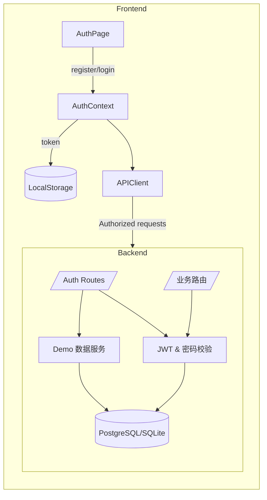

# 用户管理功能设计方案

## 架构概览
整体架构分为 React 前端与 FastAPI 后端两部分：

- **前端（frontend/）**
  - 入口 `App.tsx` 通过 `AuthProvider` 包裹业务路由，在 `AppGate` 中决定是渲染受保护页面还是认证页。
  - `src/context/AuthContext.tsx` 负责 token 存储、用户信息刷新、登录/注册/退出逻辑，并监听 401 事件。
  - `src/pages/AuthPage.tsx` 提供登录与注册的 UI；表单通过 Ant Design 校验，注册成功后自动登录。
  - `src/api/client.ts` 对 axios 实例添加 `Authorization` 头和 401 统一处理。

- **后端（backend/）**
  - `app/models.py` 新增 `User` 模型，所有业务模型补充 `owner_id` 外键。
  - `app/security.py` 提供密码哈希、JWT 生成与解析、`get_current_user` 依赖。
  - `app/main.py` 暴露 `/auth/register`、`/auth/token`、`/auth/me` 等路由，并在业务接口注入 `current_user` 完成 owner 过滤。
  - `app/sample_data.py` 扩展 Demo 数据复制逻辑，将副本绑定到新用户的 `owner_id`。

整体流程如下：

## 关键设计细节

### 前端
- `AuthContext` 使用 `localStorage` 作为持久层；初始化时读取 token 并调用 `fetchCurrentUser`。
- 登录成功后写入 token，再次调用 `fetchCurrentUser` 更新上下文状态。
- 注册成功时根据勾选项调用 `/auth/register` 并自动登录；消息提示由 Ant Design `message` 统一处理。
- 页面顶部通过 `useAuth()` 获取当前用户，显示姓名并提供 `logout` 按钮；移动端导航也使用相同上下文。

### 后端
- `User` 模型字段：`email`、`hashed_password`、`name`、`is_demo`、时间戳。
- 所有涉及教师、班级、学生、考试、练习、提交等模型都新增 `owner_id` 并在 CRUD 操作中校验。
- `authenticate_user` 验证邮箱和密码；`create_access_token` 默认 12 小时有效。
- `create_demo_dataset_for_user` 在注册时复制教师/班级/考试/学生等样本数据，并替换 `owner_id`。
- FastAPI 依赖 `Depends(get_current_user)` 的接口在执行前确保 token 合法并注入用户实例。

### 数据流
1. 用户访问应用 → `AuthProvider` 判断是否持有 token。
2. 若无 token，渲染 `AuthPage`。表单提交后调用 `/auth/token` 或 `/auth/register`。
3. 登录成功后，axios 拦截器自动为后续请求附带 `Authorization`，导航回业务路由。
4. 业务接口通过 `owner_id` 过滤仅返回当前用户资源。
5. 当后端返回 401 时，前端抛出全局事件，清除本地 token 并重定向到登录页。

## 测试策略
- **后端**：在 `backend/tests/test_auth.py` 使用内存 SQLite 覆盖注册、重复注册、登录、跨用户资源隔离等场景。其它 legacy 测试需补充鉴权凭据后再执行。
- **前端**：`frontend/src/context/AuthContext.test.tsx` 使用 Vitest 验证初始化、登录、注销流程；真实接口通过 Vitest mock。
- **手动验证**：注册两个账号，分别登录并确认 Dashboard 数据互不影响；注销后重新访问任意受保护页面，应重定向到登录页；等待 token 过期或手动触发 401 时，前端应自动清空会话。

## 后续扩展建议
- 为 `/auth/token` 增加刷新 token 或短期刷新机制，减少重复登录。
- 在前端添加「修改密码」与「找回密码」流程。
- 对文件上传等需要跨账户访问的接口建立更细粒度的权限模型。
